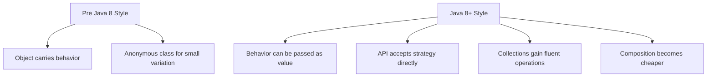
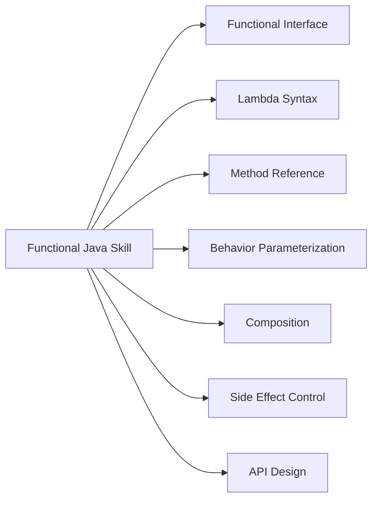
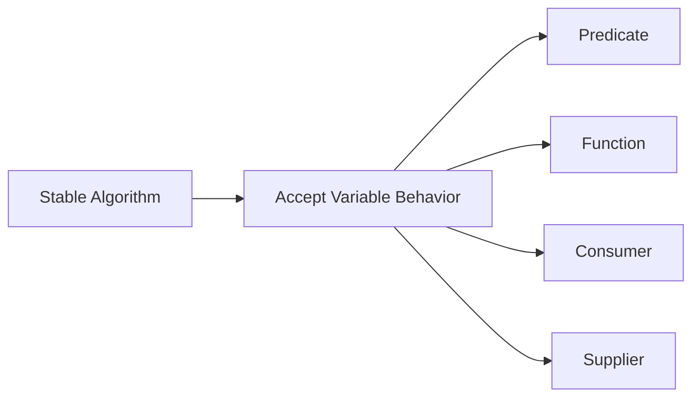

# Modern Java 8–25 Part 006 — Java 8 Functional Mindset: Lambda, Method Reference, dan Functional Interface

> **Posisi dalam seri:** Phase 2 — Java 8 Foundation  
> **Target utama:** memahami lambda bukan sebagai syntax pendek, tetapi sebagai perubahan cara mendesain API Java.  
> **Framework Kaufman:** part ini adalah sub-skill “behavior as value”: kemampuan memindahkan variasi behavior ke parameter, komposisi, dan pipeline.

---

## 1. Kenapa Java 8 Mengubah Cara Menulis Java

Java 8 adalah salah satu titik belok terbesar dalam sejarah Java modern. Java tetap bahasa object-oriented, tetapi Java 8 memperkenalkan cara yang lebih ringan untuk merepresentasikan behavior: **lambda expression** dan **method reference**.

Sebelum Java 8, jika kita ingin mengirim behavior ke method, biasanya kita memakai interface + anonymous class.

```java
button.addActionListener(new ActionListener() {
    @Override
    public void actionPerformed(ActionEvent event) {
        System.out.println("Clicked");
    }
});
```

Dengan lambda:

```java
button.addActionListener(event -> System.out.println("Clicked"));
```

Jika hanya melihat panjang kode, kita akan menyimpulkan lambda adalah syntax sugar. Itu terlalu dangkal.

Perubahan mental model-nya lebih besar:



Java 8 membuat pattern seperti strategy, callback, filtering, mapping, sorting, lazy operation, dan asynchronous continuation menjadi lebih murah ditulis dan lebih umum dipakai.

Tetapi kemampuan ini juga membawa risiko:

- lambda terlalu panjang,
- side effect tersembunyi,
- exception handling tidak jelas,
- stack trace kurang intuitif,
- readability turun karena chaining berlebihan,
- method reference menyembunyikan intent,
- functional style dipakai di tempat workflow imperative lebih jelas.

Goal part ini: membangun judgment.

---

## 2. Framework Kaufman untuk Functional Java

Untuk belajar cepat, jangan mulai dari teori category theory atau monad. Untuk Java engineer, sub-skill yang harus dipraktikkan lebih konkret:



Urutan efektif:

1. Pahami functional interface.
2. Pahami target typing.
3. Tulis lambda kecil.
4. Ubah lambda ke method reference ketika memperjelas intent.
5. Gunakan `java.util.function` untuk API kecil.
6. Desain method yang menerima behavior.
7. Kendalikan side effect.
8. Baru masuk Streams di part berikutnya.

---

## 3. Functional Interface

Functional interface adalah interface yang punya tepat satu abstract method.

Contoh:

```java
@FunctionalInterface
public interface Validator<T> {
    boolean isValid(T value);
}
```

Karena hanya ada satu abstract method, compiler tahu lambda berikut mengimplementasikan method itu:

```java
Validator<String> notBlank = value -> value != null && !value.isBlank();
```

Ini setara secara konsep dengan:

```java
Validator<String> notBlank = new Validator<>() {
    @Override
    public boolean isValid(String value) {
        return value != null && !value.isBlank();
    }
};
```

Tetapi lambda lebih ringkas dan lebih cocok untuk behavior kecil.

### 3.1 `@FunctionalInterface`

Annotation `@FunctionalInterface` tidak wajib, tetapi sangat disarankan untuk interface yang memang dirancang sebagai target lambda.

```java
@FunctionalInterface
public interface CaseRule {
    boolean matches(CaseFile file);
}
```

Jika nanti seseorang menambahkan abstract method kedua:

```java
@FunctionalInterface
public interface CaseRule {
    boolean matches(CaseFile file);
    String name();
}
```

Compiler akan error. Ini bagus karena menjaga kontrak API.

### 3.2 Default Method Tidak Merusak Functional Interface

Functional interface boleh punya default method.

```java
@FunctionalInterface
public interface CaseRule {
    boolean matches(CaseFile file);

    default CaseRule and(CaseRule other) {
        Objects.requireNonNull(other, "other is required");
        return file -> this.matches(file) && other.matches(file);
    }
}
```

`matches` tetap satu-satunya abstract method. `and` punya implementasi default.

Ini membuka desain API yang composable.

---

## 4. Lambda Expression

Lambda punya bentuk umum:

```java
(parameters) -> expression
```

atau:

```java
(parameters) -> {
    statements;
}
```

Contoh tanpa parameter:

```java
Runnable task = () -> System.out.println("running");
```

Satu parameter:

```java
Predicate<String> notBlank = value -> value != null && !value.isBlank();
```

Beberapa parameter:

```java
Comparator<User> byAge = (left, right) -> Integer.compare(left.age(), right.age());
```

Block body:

```java
Consumer<Order> audit = order -> {
    log.info("Order approved: {}", order.id());
    metrics.increment("order.approved");
};
```

Rule praktis:

- expression lambda cocok untuk logic singkat,
- block lambda cocok untuk beberapa statement kecil,
- jika block lambda panjang, extract method.

Bad:

```java
orders.forEach(order -> {
    if (order.isPending()) {
        repository.lock(order.id());
        paymentService.charge(order);
        order.markPaid();
        repository.save(order);
        audit.log(order);
        metrics.increment("order.paid");
    }
});
```

Better:

```java
orders.stream()
        .filter(Order::isPending)
        .forEach(this::chargePendingOrder);
```

Atau jika workflow side-effect berat, gunakan loop:

```java
for (Order order : orders) {
    if (order.isPending()) {
        chargePendingOrder(order);
    }
}
```

---

## 5. Target Typing

Lambda tidak berdiri sendiri sebagai function type bebas. Lambda di Java membutuhkan target type.

Valid:

```java
Predicate<String> notBlank = value -> value != null && !value.isBlank();
```

Compiler tahu `value` adalah `String` karena target type-nya `Predicate<String>`.

Tidak valid sebagai statement mandiri:

```java
// value -> value != null
```

Lambda harus muncul dalam konteks seperti:

- assignment,
- method invocation,
- cast,
- return statement dengan target type jelas.

Contoh method invocation:

```java
List<String> names = List.of("Ana", "", "Budi");

List<String> nonBlank = names.stream()
        .filter(name -> !name.isBlank())
        .toList();
```

`filter` menerima `Predicate<? super String>`, sehingga compiler tahu bentuk lambda yang diharapkan.

### 5.1 Lambda dan Overload Ambiguity

Target typing bisa menyebabkan ambiguity.

```java
void handle(Consumer<String> consumer) {}
void handle(Function<String, String> function) {}

// handle(value -> value.trim()); // ambiguous or unexpected depending context
```

Lambda `value -> value.trim()` menghasilkan value, cocok untuk `Function`, tetapi dalam beberapa overload design lambda bisa membuat API sulit dipakai.

Desain API yang buruk:

```java
void register(Consumer<Event> handler) {}
void register(Function<Event, Result> handler) {}
```

Caller bisa bingung. Lebih baik beri nama berbeda:

```java
void onEvent(Consumer<Event> handler) {}
void transformEvent(Function<Event, Result> transformer) {}
```

API naming lebih penting daripada memamerkan overload.

---

## 6. Effectively Final

Lambda bisa menangkap variable dari scope luar, tetapi variable itu harus final atau effectively final.

Valid:

```java
String prefix = "CASE-";
Function<String, String> formatter = id -> prefix + id;
```

Tidak valid:

```java
String prefix = "CASE-";
Function<String, String> formatter = id -> prefix + id;
prefix = "INCIDENT-"; // compile error karena prefix ditangkap lambda
```

Kenapa?

Karena lambda capture harus jelas dan aman. Jika variable lokal bisa berubah setelah dicapture, behavior menjadi lebih sulit dipahami.

### 6.1 Jangan Mengakali dengan Mutable Holder

Bad:

```java
int[] count = {0};
orders.forEach(order -> {
    if (order.isPending()) {
        count[0]++;
    }
});
```

Lebih baik:

```java
long count = orders.stream()
        .filter(Order::isPending)
        .count();
```

Atau jika memang side effect kompleks, gunakan loop.

```java
int count = 0;
for (Order order : orders) {
    if (order.isPending()) {
        count++;
    }
}
```

Functional style yang dipaksa sering lebih buruk daripada imperative yang jujur.

---

## 7. Method Reference

Method reference adalah bentuk lebih ringkas untuk lambda yang hanya memanggil method.

```java
Function<String, Integer> parse = Integer::parseInt;
```

Setara dengan:

```java
Function<String, Integer> parse = value -> Integer.parseInt(value);
```

Jenis method reference:

| Bentuk | Contoh | Setara Lambda |
|---|---|---|
| static method | `Integer::parseInt` | `s -> Integer.parseInt(s)` |
| instance method bound | `printer::print` | `x -> printer.print(x)` |
| instance method unbound | `String::trim` | `s -> s.trim()` |
| constructor | `ArrayList::new` | `() -> new ArrayList<>()` |

### 7.1 Method Reference yang Bagus

```java
List<String> normalized = names.stream()
        .map(String::trim)
        .filter(Predicate.not(String::isBlank))
        .toList();
```

Method reference memperjelas intent karena method name sudah kuat.

### 7.2 Method Reference yang Buruk

```java
orders.forEach(this::process);
```

Jika `process` terlalu umum, pembaca harus lompat ke method lain.

Lebih baik:

```java
orders.forEach(this::chargePendingOrder);
```

Nama method reference harus spesifik. Kalau tidak, lambda eksplisit bisa lebih jelas.

```java
orders.forEach(order -> charge(order, PaymentMode.CARD));
```

---

## 8. `java.util.function`: Vocabulary Inti

Java 8 menyediakan package `java.util.function` sebagai vocabulary umum untuk functional API.

| Interface | Shape | Contoh |
|---|---|---|
| `Predicate<T>` | `T -> boolean` | filter/validation |
| `Function<T, R>` | `T -> R` | mapping/conversion |
| `Consumer<T>` | `T -> void` | side effect |
| `Supplier<T>` | `() -> T` | lazy creation |
| `UnaryOperator<T>` | `T -> T` | transform same type |
| `BinaryOperator<T>` | `(T, T) -> T` | combine same type |
| `BiFunction<T, U, R>` | `(T, U) -> R` | combine two inputs |
| `BiConsumer<T, U>` | `(T, U) -> void` | side effect with two inputs |

### 8.1 Predicate

```java
Predicate<CaseFile> isSubmitted = file -> file.status() == CaseStatus.SUBMITTED;
Predicate<CaseFile> highRisk = file -> file.riskScore().isHigh();

Predicate<CaseFile> submittedAndHighRisk = isSubmitted.and(highRisk);
```

Use case:

- filtering,
- validation,
- rules,
- policy checks.

### 8.2 Function

```java
Function<UserEntity, UserDto> toDto = entity -> new UserDto(entity.id(), entity.name());
```

Use case:

- mapping,
- conversion,
- projection,
- normalization.

### 8.3 Consumer

```java
Consumer<DomainEvent> publish = event -> eventBus.publish(event);
```

Use case:

- logging,
- publishing,
- mutation,
- writing output.

Consumer harus dipakai hati-hati karena side effect.

### 8.4 Supplier

```java
Supplier<Instant> now = clock::instant;
```

Use case:

- lazy initialization,
- testable time,
- factory,
- fallback value.

Contoh lazy error message:

```java
User user = repository.findById(id)
        .orElseThrow(() -> new UserNotFoundException(id));
```

Supplier membuat exception dibuat hanya jika dibutuhkan.

---

## 9. Behavior Parameterization

Behavior parameterization berarti method menerima behavior sebagai parameter.

Sebelum:

```java
public List<CaseFile> highRiskCases(List<CaseFile> files) {
    List<CaseFile> result = new ArrayList<>();
    for (CaseFile file : files) {
        if (file.riskScore().isHigh()) {
            result.add(file);
        }
    }
    return result;
}

public List<CaseFile> submittedCases(List<CaseFile> files) {
    List<CaseFile> result = new ArrayList<>();
    for (CaseFile file : files) {
        if (file.status() == CaseStatus.SUBMITTED) {
            result.add(file);
        }
    }
    return result;
}
```

Setelah:

```java
public List<CaseFile> filterCases(List<CaseFile> files, Predicate<CaseFile> predicate) {
    List<CaseFile> result = new ArrayList<>();
    for (CaseFile file : files) {
        if (predicate.test(file)) {
            result.add(file);
        }
    }
    return result;
}
```

Pemakaian:

```java
List<CaseFile> highRisk = filterCases(files, file -> file.riskScore().isHigh());
List<CaseFile> submitted = filterCases(files, file -> file.status() == CaseStatus.SUBMITTED);
```

Ini dasar dari Stream API. Tetapi sebelum memakai stream, pahami prinsipnya: variasi behavior dipindahkan keluar dari algorithm.



---

## 10. Strategy Pattern Setelah Java 8

Sebelum Java 8, strategy sering membutuhkan banyak class.

```java
public interface FeePolicy {
    Money calculate(Order order);
}

public final class StandardFeePolicy implements FeePolicy {
    @Override
    public Money calculate(Order order) {
        return order.total().multiply(0.02);
    }
}
```

Dengan Java 8, strategy kecil bisa berupa lambda.

```java
@FunctionalInterface
public interface FeePolicy {
    Money calculate(Order order);
}

FeePolicy standard = order -> order.total().multiply(0.02);
FeePolicy premium = order -> Money.zero(order.currency());
```

Tetapi jangan menyimpulkan semua strategy harus lambda.

Gunakan class jika:

- strategy punya state,
- logic panjang,
- butuh dependency injection,
- butuh observability sendiri,
- butuh test terpisah,
- nama strategy adalah bagian domain penting.

Gunakan lambda jika:

- behavior kecil,
- local to method/configuration,
- tidak punya state kompleks,
- tidak perlu lifecycle.

---

## 11. Designing Custom Functional Interface

Jangan selalu memakai `Function`/`Predicate`. Kadang custom interface lebih jelas.

Generic:

```java
Function<CaseFile, Boolean> rule
```

Lebih buruk karena return `Boolean` boxed dan intent lemah.

Lebih baik:

```java
@FunctionalInterface
public interface CaseRule {
    boolean evaluate(CaseFile file);
}
```

Dengan composition:

```java
@FunctionalInterface
public interface CaseRule {
    boolean evaluate(CaseFile file);

    default CaseRule and(CaseRule other) {
        Objects.requireNonNull(other, "other is required");
        return file -> this.evaluate(file) && other.evaluate(file);
    }

    default CaseRule or(CaseRule other) {
        Objects.requireNonNull(other, "other is required");
        return file -> this.evaluate(file) || other.evaluate(file);
    }

    default CaseRule negate() {
        return file -> !this.evaluate(file);
    }
}
```

Pemakaian:

```java
CaseRule underReview = file -> file.status() == CaseStatus.UNDER_REVIEW;
CaseRule highRisk = file -> file.riskScore().isHigh();

CaseRule needsSeniorApproval = underReview.and(highRisk);
```

Custom functional interface bagus jika memberi vocabulary domain.

---

## 12. Default Methods dan API Evolution

Java 8 memperkenalkan default method agar interface bisa berkembang tanpa memaksa semua implementasi lama langsung menambahkan method baru.

Contoh:

```java
public interface CaseRepository {
    Optional<CaseFile> findById(CaseId id);

    default CaseFile getRequired(CaseId id) {
        return findById(id).orElseThrow(() -> new CaseNotFoundException(id));
    }
}
```

Default method bisa membantu:

- menambahkan convenience method,
- membuat composition method,
- menjaga backward compatibility,
- mengurangi utility class.

Tetapi default method juga bisa buruk jika digunakan untuk behavior yang seharusnya diketahui implementasi.

Bad:

```java
public interface AccountRepository {
    List<Account> findAll();

    default Optional<Account> findById(AccountId id) {
        return findAll().stream()
                .filter(account -> account.id().equals(id))
                .findFirst();
    }
}
```

Untuk repository production, `findById` harus query by key, bukan load all.

Rule:

- default method baik untuk behavior turunan yang benar secara umum,
- buruk jika default implementation punya asumsi performance/storage yang tidak universal,
- jangan jadikan default method tempat business logic kompleks.

---

## 13. Static Methods di Interface

Java 8 juga mendukung static method di interface.

```java
@FunctionalInterface
public interface CaseRule {
    boolean evaluate(CaseFile file);

    static CaseRule alwaysTrue() {
        return file -> true;
    }

    static CaseRule statusIs(CaseStatus status) {
        return file -> file.status() == status;
    }
}
```

Pemakaian:

```java
CaseRule submitted = CaseRule.statusIs(CaseStatus.SUBMITTED);
```

Ini bisa menggantikan beberapa utility class.

Namun jangan terlalu banyak memasukkan factory kompleks ke interface. Jika factory butuh dependency, konfigurasi, atau I/O, buat class terpisah.

---

## 14. Lambda dan Exception Handling

Functional interface standar seperti `Function` tidak melempar checked exception.

Ini sering terlihat saat I/O:

```java
paths.stream()
        .map(path -> Files.readString(path)) // compile error: IOException
        .toList();
```

Solusi buruk:

```java
paths.stream()
        .map(path -> {
            try {
                return Files.readString(path);
            } catch (IOException e) {
                throw new RuntimeException(e);
            }
        })
        .toList();
```

Ini bisa valid untuk boundary tertentu, tetapi jika dilakukan berulang, code menjadi noise.

Alternatif 1: gunakan helper eksplisit.

```java
private String readFileUnchecked(Path path) {
    try {
        return Files.readString(path);
    } catch (IOException e) {
        throw new UncheckedIOException("Failed to read " + path, e);
    }
}
```

```java
List<String> contents = paths.stream()
        .map(this::readFileUnchecked)
        .toList();
```

Alternatif 2: jangan pakai stream jika error handling per item kompleks.

```java
List<String> contents = new ArrayList<>();
for (Path path : paths) {
    try {
        contents.add(Files.readString(path));
    } catch (IOException e) {
        log.warn("Skipping unreadable file {}", path, e);
    }
}
```

Rule:

- kalau exception handling kompleks, imperative loop sering lebih jelas,
- kalau wrapping punya makna domain, buat method bernama,
- jangan menyembunyikan checked exception menjadi generic `RuntimeException` tanpa context.

---

## 15. Side Effects

Lambda sering terlihat functional, tetapi Java tidak mencegah side effect.

```java
List<String> names = new ArrayList<>();
users.forEach(user -> names.add(user.name()));
```

Lebih baik:

```java
List<String> names = users.stream()
        .map(User::name)
        .toList();
```

Side effect dalam lambda menjadi masalah jika:

- collection dimutasi dari luar,
- pipeline diubah menjadi parallel,
- order penting tetapi tidak eksplisit,
- exception meninggalkan state setengah berubah,
- lambda menyentuh I/O, DB, network, atau shared mutable state.

### 15.1 Pure-ish Function

Dalam Java production, kita tidak harus menjadi functional purist. Tetapi kita bisa menulis function yang “pure-ish”:

```java
Function<Order, Invoice> toInvoice = order -> new Invoice(
        order.id(),
        order.customerId(),
        order.total()
);
```

Input sama menghasilkan output sama, tanpa side effect.

Ini mudah diuji, mudah diparalelkan, dan mudah dipahami.

### 15.2 Side Effect yang Terkendali

Side effect tidak selalu buruk.

```java
Consumer<DomainEvent> publisher = event -> eventBus.publish(event);
```

Yang penting:

- nama menunjukkan side effect,
- boundary jelas,
- error handling jelas,
- observability jelas,
- idempotency dipikirkan.

---

## 16. Capturing State dan Lifecycle Bug

Lambda bisa menangkap object mutable.

```java
List<Order> failed = new ArrayList<>();
orders.forEach(order -> {
    if (!paymentService.charge(order)) {
        failed.add(order);
    }
});
```

Dalam sequential flow, ini mungkin berjalan. Tetapi jika diganti parallel:

```java
orders.parallelStream().forEach(order -> {
    if (!paymentService.charge(order)) {
        failed.add(order); // race condition
    }
});
```

Bug muncul karena shared mutable state.

Lebih baik:

```java
List<Order> failed = orders.stream()
        .filter(order -> !paymentService.charge(order))
        .toList();
```

Tetapi ini tetap punya side effect jika `charge` melakukan operasi eksternal. Jadi hati-hati: bentuk stream tidak otomatis membuat operasi aman.

Untuk operasi eksternal, pertimbangkan flow eksplisit:

```java
List<Order> failed = new ArrayList<>();
for (Order order : orders) {
    ChargeResult result = paymentService.charge(order);
    if (result.failed()) {
        failed.add(order);
    }
}
```

---

## 17. Lambda dan Object Identity

Lambda adalah object, tetapi identity-nya tidak boleh dijadikan asumsi desain.

Jangan lakukan:

```java
if (handler == this::handleEvent) {
    // unreliable conceptual design
}
```

Lambda dipakai sebagai behavior, bukan identity-bearing domain object.

Jika butuh identity, metadata, lifecycle, atau observability, buat class/record.

```java
public record NamedHandler(String name, Consumer<Event> handler) {
    public void handle(Event event) {
        handler.accept(event);
    }
}
```

---

## 18. Functional Composition

Composition adalah kemampuan menggabungkan behavior kecil menjadi behavior lebih besar.

### 18.1 Predicate Composition

```java
Predicate<CaseFile> underReview = file -> file.status() == CaseStatus.UNDER_REVIEW;
Predicate<CaseFile> highRisk = file -> file.riskScore().isHigh();
Predicate<CaseFile> hasSeniorReviewer = file -> file.reviewer().isSenior();

Predicate<CaseFile> needsEscalation = underReview
        .and(highRisk)
        .and(hasSeniorReviewer.negate());
```

### 18.2 Function Composition

```java
Function<String, String> trim = String::trim;
Function<String, String> lower = String::toLowerCase;
Function<String, String> normalizeEmail = trim.andThen(lower);
```

```java
String email = normalizeEmail.apply("  USER@EXAMPLE.COM ");
```

### 18.3 Consumer Composition

```java
Consumer<CaseFile> audit = file -> auditLog.record(file.id());
Consumer<CaseFile> metrics = file -> meter.increment("case.updated");

Consumer<CaseFile> observe = audit.andThen(metrics);
```

Hati-hati: jika consumer pertama throw exception, consumer berikutnya tidak jalan. Itu harus sesuai dengan contract.

---

## 19. Designing Higher-Order Methods

Higher-order method menerima atau mengembalikan function.

Contoh retry sederhana:

```java
public <T> T retry(Supplier<T> operation, int maxAttempts) {
    RuntimeException lastFailure = null;

    for (int attempt = 1; attempt <= maxAttempts; attempt++) {
        try {
            return operation.get();
        } catch (RuntimeException e) {
            lastFailure = e;
        }
    }

    throw lastFailure;
}
```

Pemakaian:

```java
Customer customer = retry(() -> customerClient.fetch(customerId), 3);
```

Namun retry production tidak sesederhana ini. Perlu:

- retry hanya untuk transient failure,
- backoff,
- jitter,
- timeout,
- idempotency,
- observability,
- cancellation.

Tetapi contoh ini menunjukkan kekuatan behavior parameterization.

### 19.1 Template Method tanpa Inheritance

Sebelum:

```java
abstract class TransactionTemplate {
    public final void execute() {
        begin();
        try {
            doWork();
            commit();
        } catch (RuntimeException e) {
            rollback();
            throw e;
        }
    }

    protected abstract void doWork();
}
```

Java 8 style:

```java
public void inTransaction(Runnable work) {
    transaction.begin();
    try {
        work.run();
        transaction.commit();
    } catch (RuntimeException e) {
        transaction.rollback();
        throw e;
    }
}
```

Pemakaian:

```java
inTransaction(() -> caseService.approve(command));
```

Untuk return value:

```java
public <T> T inTransaction(Supplier<T> work) {
    transaction.begin();
    try {
        T result = work.get();
        transaction.commit();
        return result;
    } catch (RuntimeException e) {
        transaction.rollback();
        throw e;
    }
}
```

---

## 20. Lazy Evaluation dengan Supplier

Supplier sering berguna untuk menunda pekerjaan.

### 20.1 Lazy Fallback

```java
public User getOrCreate(String email) {
    return repository.findByEmail(email)
            .orElseGet(() -> repository.save(User.newUser(email)));
}
```

Bedakan `orElse` dan `orElseGet`.

```java
User user = optional.orElse(expensiveCreateUser());
```

`expensiveCreateUser()` dieksekusi walaupun optional berisi value.

```java
User user = optional.orElseGet(() -> expensiveCreateUser());
```

`expensiveCreateUser()` hanya dieksekusi jika kosong.

### 20.2 Lazy Error

```java
CaseFile file = repository.findById(id)
        .orElseThrow(() -> new CaseNotFoundException(id));
```

Exception hanya dibuat saat dibutuhkan.

---

## 21. Lambda di Asynchronous Flow

`CompletableFuture` sangat bergantung pada functional interfaces.

```java
CompletableFuture<Customer> customerFuture = customerClient.fetchAsync(customerId);

CompletableFuture<CustomerDto> dtoFuture = customerFuture
        .thenApply(customer -> new CustomerDto(customer.id(), customer.name()))
        .exceptionally(error -> CustomerDto.unknown(customerId));
```

Method seperti `thenApply`, `thenCompose`, `thenAccept`, dan `exceptionally` menerima behavior.

Mental model:

| Method | Shape | Makna |
|---|---|---|
| `thenApply` | `T -> R` | transform value |
| `thenCompose` | `T -> CompletionStage<R>` | flatten async operation |
| `thenAccept` | `T -> void` | side effect after completion |
| `exceptionally` | `Throwable -> T` | recover |
| `handle` | `(T, Throwable) -> R` | handle success/failure |

Part concurrency nanti akan membahas ini lebih dalam. Di part ini, cukup pahami: lambda membuat async composition lebih natural, tetapi juga bisa menyembunyikan thread/executor boundary.

Bad:

```java
future.thenApply(value -> blockingCall(value));
```

Pertanyaan penting:

- executor mana yang menjalankan lambda?
- apakah lambda blocking?
- apakah context logging/security ikut terbawa?
- bagaimana timeout/cancellation?

---

## 22. API Design: Kapan Menerima Lambda

Method menerima lambda jika caller memang perlu mengontrol behavior.

Good:

```java
public List<CaseFile> findCases(Predicate<CaseFile> rule) {
    return cases.stream()
            .filter(rule)
            .toList();
}
```

Good untuk utility lokal/in-memory.

Namun untuk repository database, ini bisa buruk:

```java
public List<CaseFile> findCases(Predicate<CaseFile> rule) {
    return jdbc.query("select * from cases")
            .stream()
            .filter(rule)
            .toList();
}
```

Ini load semua row ke memory, lalu filter di aplikasi.

Lebih baik repository menerima query criteria yang bisa diterjemahkan ke database:

```java
public List<CaseFile> findCases(CaseSearchCriteria criteria) {
    // translate criteria to SQL
}
```

Functional API cocok jika:

- data sudah in-memory,
- algorithm generic,
- behavior kecil,
- caller memang perlu kustomisasi.

Tidak cocok jika:

- behavior harus diterjemahkan ke remote system,
- observability/audit perlu nama eksplisit,
- logic domain terlalu penting untuk anonymous lambda,
- serialization/distribution dibutuhkan.

---

## 23. Naming Functional Parameters

Nama parameter functional harus menyatakan peran.

Bad:

```java
public <T> void process(List<T> items, Consumer<T> consumer) {
    items.forEach(consumer);
}
```

Better:

```java
public <T> void processEach(List<T> items, Consumer<T> action) {
    items.forEach(action);
}
```

Lebih domain-specific:

```java
public void forEachPendingCase(Consumer<CaseFile> handler) {
    cases.stream()
            .filter(CaseFile::isPending)
            .forEach(handler);
}
```

Naming yang baik menjawab:

- kapan behavior dipanggil?
- dengan input apa?
- berapa kali?
- apakah order dijamin?
- apakah exception dipropagasi?
- apakah boleh side effect?

---

## 24. Lambda dan Readability Budget

Lambda bagus jika memperkecil jarak antara intent dan implementation.

Readable:

```java
users.stream()
        .filter(User::active)
        .map(User::email)
        .toList();
```

Kurang readable:

```java
users.stream()
        .filter(u -> u.active() && u.roles().stream().anyMatch(r -> r.name().startsWith("ADMIN")))
        .map(u -> new UserExportRow(u.id(), u.email().trim().toLowerCase(), u.createdAt().toString()))
        .sorted((a, b) -> a.email().compareToIgnoreCase(b.email()))
        .toList();
```

Refactor:

```java
users.stream()
        .filter(this::isActiveAdmin)
        .map(this::toExportRow)
        .sorted(comparing(UserExportRow::email, String.CASE_INSENSITIVE_ORDER))
        .toList();
```

Rule: jika lambda butuh lebih dari satu ide, beri nama.

---

## 25. Functional Style dan Domain Modeling

Functional Java bukan berarti menghapus object-oriented design. Justru keduanya bisa bekerja bersama.

Object menyimpan invariant:

```java
public final class CaseFile {
    private CaseStatus status;

    public void submit() {
        if (status != CaseStatus.DRAFT) {
            throw new InvalidCaseStateException(status, CaseStatus.DRAFT);
        }
        status = CaseStatus.SUBMITTED;
    }
}
```

Functional behavior memilih rule/policy:

```java
Predicate<CaseFile> eligibleForAutoAssignment = file ->
        file.status() == CaseStatus.SUBMITTED && file.riskScore().isLow();
```

Service mengorkestrasi:

```java
public void autoAssign(List<CaseFile> files) {
    files.stream()
            .filter(eligibleForAutoAssignment)
            .forEach(assignmentService::assignAutomatically);
}
```

Jangan mengganti domain method dengan lambda anonymous di mana-mana.

Bad:

```java
Consumer<CaseFile> submit = file -> file.setStatus(CaseStatus.SUBMITTED);
```

Ini melewati invariant jika setter terbuka.

Better:

```java
Consumer<CaseFile> submit = CaseFile::submit;
```

Domain behavior tetap di domain object.

---

## 26. Lambda, Testing, dan Dependency Injection

Lambda kecil bisa dites melalui behavior output.

```java
Predicate<CaseFile> highRisk = file -> file.riskScore().isHigh();
```

Jika rule penting, beri nama dan test.

```java
public final class CaseRules {
    public static Predicate<CaseFile> requiresSeniorReview() {
        return file -> file.status() == CaseStatus.UNDER_REVIEW
                && file.riskScore().isHigh()
                && !file.reviewer().isSenior();
    }
}
```

Test:

```java
@Test
void highRiskUnderReviewWithoutSeniorReviewerRequiresSeniorReview() {
    Predicate<CaseFile> rule = CaseRules.requiresSeniorReview();

    CaseFile file = CaseFileFixture.underReviewHighRiskWithJuniorReviewer();

    assertThat(rule.test(file)).isTrue();
}
```

Untuk dependency injection, jangan terlalu banyak memakai raw lambda jika dependency kompleks.

Bad:

```java
PaymentPolicy policy = order -> remoteConfig.getRate(order.region())
        .multiply(order.total());
```

Better:

```java
public final class ConfigurablePaymentPolicy implements PaymentPolicy {
    private final RemoteConfig remoteConfig;

    public ConfigurablePaymentPolicy(RemoteConfig remoteConfig) {
        this.remoteConfig = remoteConfig;
    }

    @Override
    public Money calculate(Order order) {
        return remoteConfig.getRate(order.region()).multiply(order.total());
    }
}
```

Class memberi tempat untuk dependency, metrics, logging, dan tests.

---

## 27. Lambda Performance: Yang Perlu Diketahui, Bukan Ditakuti

Untuk kebanyakan aplikasi, lambda overhead bukan bottleneck utama. Bottleneck lebih sering ada di:

- database,
- network,
- serialization,
- lock contention,
- allocation besar,
- logging berlebihan,
- blocking call,
- GC pressure.

Tetapi engineer senior tetap perlu tahu beberapa hal:

- capturing lambda bisa membawa reference ke object luar,
- lambda dalam hot path harus diprofiling, bukan diasumsikan,
- method reference tidak otomatis lebih cepat,
- stream/lambda bisa menghasilkan allocation atau menghambat optimisasi dalam kasus tertentu,
- JIT sering mampu mengoptimalkan lambda kecil,
- readability tetap prioritas sampai profiler membuktikan sebaliknya.

Bad optimization:

```java
// Menghindari lambda tanpa evidence, membuat code lebih sulit dibaca.
```

Good optimization:

1. ukur dengan profiler/JMH,
2. identifikasi bottleneck,
3. refactor hot path,
4. lock performance dengan benchmark/regression test.

---

## 28. Common Anti-Patterns

### 28.1 Lambda Terlalu Panjang

```java
orders.forEach(order -> {
    validate(order);
    reserveStock(order);
    charge(order);
    notify(order);
    updateAnalytics(order);
});
```

Gunakan method bernama atau workflow class.

### 28.2 Side Effect Tersembunyi di `map`

Bad:

```java
orders.stream()
        .map(order -> {
            repository.save(order);
            return order.id();
        })
        .toList();
```

`map` seharusnya transformasi, bukan command side effect utama.

### 28.3 `forEach` sebagai Pengganti Semua Loop

Bad:

```java
items.forEach(item -> {
    if (shouldStop(item)) {
        return; // hanya return dari lambda, bukan method luar
    }
    process(item);
});
```

Jika butuh `break`, `continue`, atau early return dari method, loop biasa lebih jelas.

### 28.4 Generic Functional Interface yang Mengaburkan Domain

Bad:

```java
Function<CaseFile, Boolean> f
```

Better:

```java
CaseRule rule
```

### 28.5 Method Reference dengan Nama Lemah

Bad:

```java
items.forEach(this::handle);
```

Better:

```java
items.forEach(this::publishCaseSubmittedEvent);
```

---

## 29. Refactoring Practice

### 29.1 Dari Anonymous Class ke Lambda

Sebelum:

```java
Collections.sort(users, new Comparator<User>() {
    @Override
    public int compare(User left, User right) {
        return left.name().compareToIgnoreCase(right.name());
    }
});
```

Setelah:

```java
users.sort((left, right) -> left.name().compareToIgnoreCase(right.name()));
```

Lebih baik:

```java
users.sort(Comparator.comparing(User::name, String.CASE_INSENSITIVE_ORDER));
```

### 29.2 Dari Repeated Filtering ke Predicate

Sebelum:

```java
List<CaseFile> result = new ArrayList<>();
for (CaseFile file : files) {
    if (file.status() == CaseStatus.SUBMITTED && file.riskScore().isHigh()) {
        result.add(file);
    }
}
```

Setelah:

```java
Predicate<CaseFile> submitted = file -> file.status() == CaseStatus.SUBMITTED;
Predicate<CaseFile> highRisk = file -> file.riskScore().isHigh();

List<CaseFile> result = files.stream()
        .filter(submitted.and(highRisk))
        .toList();
```

### 29.3 Dari Template Method ke Higher-Order Function

Sebelum inheritance, coba behavior parameter.

```java
public <T> T withAudit(String operation, Supplier<T> work) {
    audit.start(operation);
    try {
        T result = work.get();
        audit.success(operation);
        return result;
    } catch (RuntimeException e) {
        audit.failure(operation, e);
        throw e;
    }
}
```

Pemakaian:

```java
CaseFile file = withAudit("approve-case", () -> caseService.approve(command));
```

---

## 30. Production Example: Rule Engine Ringan

Misalnya kita butuh menentukan apakah case harus dieskalasi.

```java
@FunctionalInterface
public interface EscalationRule {
    boolean appliesTo(CaseFile file);

    default EscalationRule and(EscalationRule other) {
        Objects.requireNonNull(other, "other is required");
        return file -> this.appliesTo(file) && other.appliesTo(file);
    }

    default EscalationRule or(EscalationRule other) {
        Objects.requireNonNull(other, "other is required");
        return file -> this.appliesTo(file) || other.appliesTo(file);
    }

    static EscalationRule highRisk() {
        return file -> file.riskScore().isHigh();
    }

    static EscalationRule overdue(Duration threshold, Clock clock) {
        return file -> Duration.between(file.submittedAt(), clock.instant()).compareTo(threshold) > 0;
    }

    static EscalationRule unassigned() {
        return file -> file.assignee().isEmpty();
    }
}
```

Composition:

```java
EscalationRule rule = EscalationRule.highRisk()
        .or(EscalationRule.overdue(Duration.ofDays(3), clock))
        .and(EscalationRule.unassigned());
```

Service:

```java
public List<CaseFile> findCasesToEscalate(List<CaseFile> files, EscalationRule rule) {
    return files.stream()
            .filter(rule::appliesTo)
            .toList();
}
```

Ini ringan, testable, dan domain-specific.

Namun jika rule perlu disimpan di database, diedit user, diaudit, dan dieksekusi lintas service, lambda tidak cukup. Anda butuh model rule eksplisit.

---

## 31. Decision Matrix: Lambda atau Class?

| Kebutuhan | Lambda | Class |
|---|---:|---:|
| behavior kecil lokal | bagus | berlebihan |
| behavior punya nama domain penting | bisa | bagus |
| punya banyak dependency | kurang cocok | bagus |
| butuh metrics/logging sendiri | kurang cocok | bagus |
| perlu lifecycle | buruk | bagus |
| perlu serialization | buruk | bagus |
| perlu composition ringan | bagus | bisa |
| perlu debugging eksplisit | bisa sulit | bagus |
| dipakai sekali | bagus | berlebihan |
| dipakai banyak tempat | tergantung | sering bagus |

Rule ringkas:

> Lambda adalah alat untuk behavior kecil. Class tetap alat untuk konsep besar.

---

## 32. Practice Plan Menurut Kaufman

### 32.1 Latihan 45 Menit — Functional Interface

Buat interface:

```java
@FunctionalInterface
interface Rule<T> {
    boolean test(T value);
}
```

Tambahkan:

- `and`,
- `or`,
- `negate`,
- `alwaysTrue`,
- `alwaysFalse`.

Test semua kombinasi.

### 32.2 Latihan 60 Menit — Refactor Anonymous Class

Cari kode lama yang memakai:

- anonymous `Comparator`,
- anonymous `Runnable`,
- anonymous listener,
- custom callback.

Refactor ke lambda/method reference. Catat mana yang lebih readable dan mana yang tidak.

### 32.3 Latihan 60 Menit — Domain Rule Composition

Buat `CaseRule`:

- `isUnderReview`,
- `isHighRisk`,
- `isUnassigned`,
- `isOlderThan(Duration, Clock)`.

Susun rule:

```java
needsEscalation = isUnderReview.and(isHighRisk.or(isOlderThan(...))).and(isUnassigned)
```

Buat minimal 10 test.

### 32.4 Latihan 45 Menit — Lambda Exception Boundary

Buat pipeline membaca beberapa file. Implementasikan dua versi:

1. stream + helper `readUnchecked`,
2. loop imperative dengan per-file error handling.

Bandingkan readability dan failure behavior.

### 32.5 Latihan 45 Menit — API Design Review

Desain method yang menerima:

- `Predicate<T>`,
- `Function<T, R>`,
- `Consumer<T>`,
- `Supplier<T>`.

Untuk masing-masing, tulis contract:

- kapan dipanggil,
- berapa kali dipanggil,
- thread apa yang menjalankan,
- apakah exception dipropagasi,
- apakah side effect diperbolehkan.

---

## 33. Checklist Production

Sebelum merge lambda/functional API:

- [ ] Apakah lambda cukup pendek dan jelas?
- [ ] Apakah method reference punya nama yang menjelaskan intent?
- [ ] Apakah side effect terlihat dari nama method/API?
- [ ] Apakah exception handling tidak disembunyikan?
- [ ] Apakah functional parameter punya nama bermakna?
- [ ] Apakah custom functional interface lebih jelas daripada `Function` generic?
- [ ] Apakah lambda menangkap mutable state?
- [ ] Apakah ada risiko parallel execution?
- [ ] Apakah default method aman untuk semua implementasi?
- [ ] Apakah overload dengan lambda tidak ambiguous?
- [ ] Apakah class lebih tepat karena behavior punya state/dependency/lifecycle?
- [ ] Apakah rule penting punya test sendiri?

---

## 34. Mental Model Akhir

Lambda bukan sekadar cara menulis kode lebih pendek.

Lambda membuat behavior menjadi value yang bisa:

- dikirim,
- disimpan,
- digabung,
- ditunda,
- dijalankan sebagai callback,
- dipakai sebagai policy,
- dipakai sebagai rule,
- dipakai sebagai transformer.

Tetapi behavior yang terlalu penting untuk anonim sebaiknya diberi nama. Behavior yang punya lifecycle sebaiknya menjadi object/class. Behavior yang punya invariant sebaiknya hidup di domain model.

Java modern yang kuat bukan Java yang memaksa semua menjadi functional. Java modern yang kuat tahu kapan memakai object, kapan memakai lambda, kapan memakai method reference, kapan memakai loop, dan kapan memberi nama eksplisit pada konsep domain.

---

## 35. Ringkasan

Di part ini kita membahas:

- kenapa Java 8 mengubah desain API,
- functional interface,
- `@FunctionalInterface`,
- lambda syntax,
- target typing,
- effectively final,
- method reference,
- `java.util.function`,
- behavior parameterization,
- strategy pattern setelah Java 8,
- custom functional interface,
- default method,
- static method di interface,
- exception handling dalam lambda,
- side effect,
- capturing state,
- functional composition,
- higher-order method,
- lazy evaluation dengan supplier,
- lambda dalam async flow,
- API design dengan lambda,
- readability budget,
- lambda vs class decision.

Part berikutnya masuk ke **Streams Deep Dive**: pipeline, laziness, collectors, spliterator, parallel stream, dan performance trap.

---

## Referensi

- Java Tutorials: Lambda Expressions — https://docs.oracle.com/javase/tutorial/java/javaOO/lambdaexpressions.html
- Java SE 8 API: `java.util.function` — https://docs.oracle.com/javase/8/docs/api/java/util/function/package-summary.html
- Java Language Specification, Java SE 25 Edition — https://docs.oracle.com/javase/specs/jls/se25/html/index.html
- JDK 25 Documentation — https://docs.oracle.com/en/java/javase/25/
