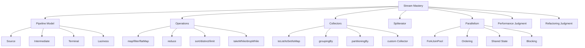
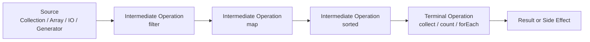
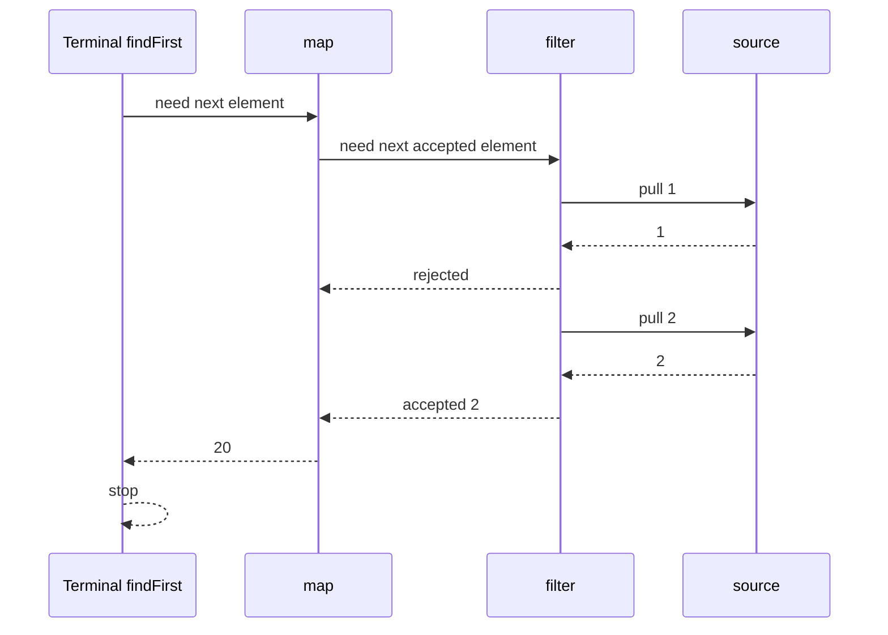
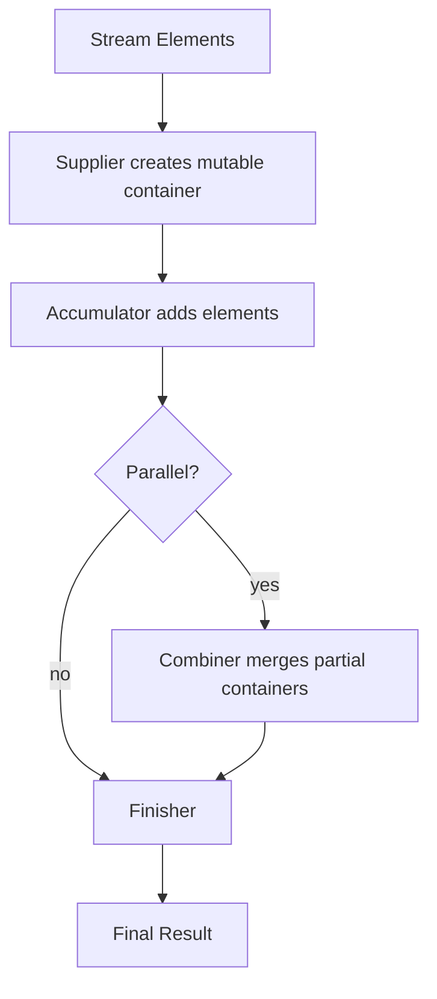
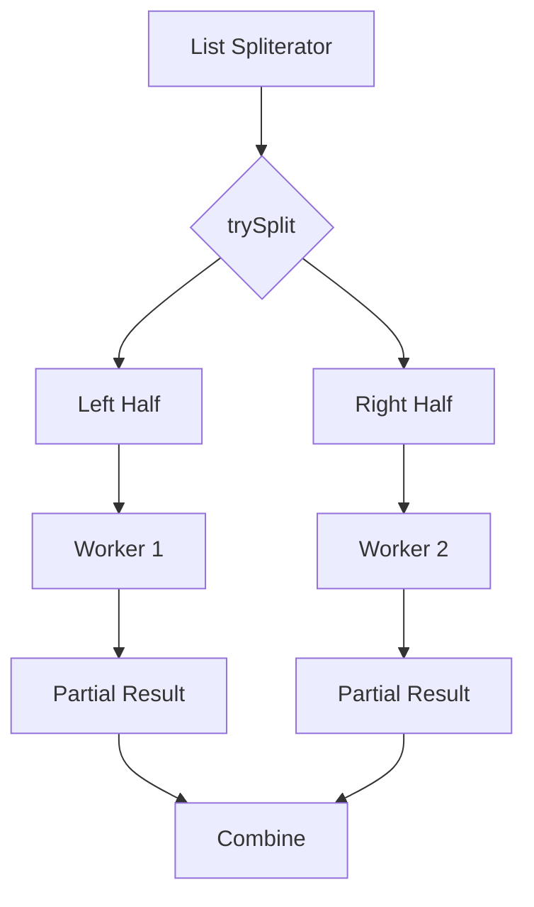
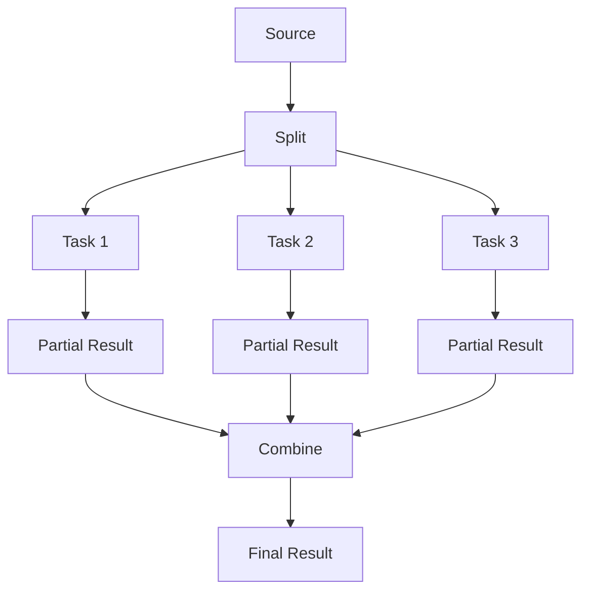
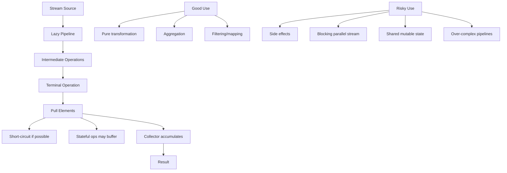

# Part 007 — Streams Deep Dive: Pipeline, Laziness, Collectors, Spliterator, dan Parallel Trap

## 1. Posisi Part Ini dalam Roadmap

Pada part sebelumnya kita sudah membahas **functional mindset**: lambda, method reference, dan functional interface. Part ini adalah tempat konsep tersebut menjadi alat nyata untuk memproses data.

Java Streams sering terlihat sederhana:

```java
var activeNames = users.stream()
    .filter(User::active)
    .map(User::name)
    .toList();
```

Namun di level production, Stream API bukan sekadar cara menulis loop dengan gaya lebih pendek. Stream adalah **model eksekusi deklaratif** yang punya aturan tentang:

- kapan operasi dijalankan;
- bagaimana data mengalir;
- kapan side effect boleh dan tidak boleh digunakan;
- bagaimana ordering memengaruhi hasil;
- bagaimana collector membangun hasil;
- bagaimana parallel stream memakai `ForkJoinPool`;
- kapan stream membantu readability;
- kapan stream memperburuk performance atau correctness.

Target part ini adalah membuat kita bisa membaca dan menulis stream pipeline dengan pemahaman execution model, bukan hanya mengenal method seperti `map`, `filter`, dan `collect`.

---

## 2. Kaufman Lens: Skill yang Harus Dikuasai

Mengikuti framework *The First 20 Hours*, kita tidak mulai dari menghafal semua method Stream API. Kita mulai dari skill minimum yang paling sering memberi return tinggi.

### 2.1 Target Performa

Setelah part ini, kita harus mampu:

1. Mengubah loop data-processing sederhana menjadi stream pipeline yang jelas.
2. Mengubah stream pipeline yang terlalu rumit kembali menjadi loop yang lebih jelas.
3. Menjelaskan kapan operasi intermediate dijalankan.
4. Memilih collector yang tepat untuk aggregation.
5. Menulis custom collector sederhana.
6. Mengenali stream yang berbahaya karena side effect, mutation, shared state, atau parallelism.
7. Menilai apakah parallel stream layak dipakai.
8. Debug dan refactor pipeline tanpa kehilangan semantic correctness.

### 2.2 Sub-skill Decomposition



### 2.3 Practice Rule

Untuk 20 jam pertama, jangan mencoba menghafal seluruh `java.util.stream`.

Gunakan aturan:

> Kuasai 10 operasi yang paling sering muncul, pahami execution model-nya, lalu pelajari sisanya saat masalah nyata membutuhkan.

Operasi inti:

- `filter`
- `map`
- `flatMap`
- `sorted`
- `distinct`
- `limit`
- `anyMatch` / `allMatch` / `noneMatch`
- `findFirst` / `findAny`
- `reduce`
- `collect` / `toList`

---

## 3. Stream Bukan Collection

Kesalahan pertama yang sering muncul:

> Menganggap `Stream<T>` adalah `List<T>` versi functional.

Itu salah.

Collection adalah **data structure**. Stream adalah **view atas sequence of elements yang dievaluasi melalui pipeline**.

```java
List<Order> orders = loadOrders(); // data sudah ada di memory
Stream<Order> stream = orders.stream(); // pipeline belum berjalan
```

Stream tidak menyimpan semua elemen sebagai struktur data baru. Stream membawa:

- source;
- daftar operasi;
- execution mode;
- karakteristik traversal;
- terminal operation yang akan memicu eksekusi.

Secara mental:



Contoh:

```java
var stream = users.stream()
    .filter(User::active)
    .map(User::email);

// Belum ada user yang difilter.
// Belum ada email yang diambil.
```

Eksekusi baru terjadi saat terminal operation dipanggil:

```java
var emails = stream.toList();
```

---

## 4. Anatomy of Stream Pipeline

Menurut dokumentasi resmi Java, stream pipeline terdiri dari:

1. **source**;
2. **zero or more intermediate operations**;
3. **terminal operation**.

Mari kita bedah.

### 4.1 Source

Source adalah asal data.

Contoh source umum:

```java
List<String> names = List.of("Ayu", "Budi", "Citra");
Stream<String> s1 = names.stream();

Stream<String> s2 = Stream.of("A", "B", "C");
Stream<Integer> s3 = Stream.iterate(1, n -> n + 1).limit(10);
Stream<Double> s4 = Stream.generate(Math::random).limit(5);
```

Source bisa finite atau infinite.

Finite:

```java
Stream.of(1, 2, 3);
```

Infinite:

```java
Stream.iterate(0, n -> n + 1);
```

Infinite stream harus dikombinasikan dengan short-circuiting operation seperti `limit`, `takeWhile`, atau terminal operation yang bisa berhenti.

```java
var firstTen = Stream.iterate(0, n -> n + 1)
    .limit(10)
    .toList();
```

Tanpa `limit`, pipeline bisa tidak pernah selesai.

---

### 4.2 Intermediate Operation

Intermediate operation mengubah stream menjadi stream lain.

Contoh:

```java
users.stream()
    .filter(User::active)     // Stream<User>
    .map(User::email);        // Stream<String>
```

Intermediate operation bersifat lazy.

Artinya, operasi tidak berjalan saat didefinisikan.

```java
var pipeline = users.stream()
    .filter(user -> {
        System.out.println("filter " + user.id());
        return user.active();
    });

System.out.println("after pipeline");
```

Output:

```text
after pipeline
```

Tidak ada `filter` yang dijalankan karena belum ada terminal operation.

Tambahkan terminal operation:

```java
var activeUsers = pipeline.toList();
```

Baru filter berjalan.

---

### 4.3 Terminal Operation

Terminal operation mengakhiri pipeline.

Contoh:

```java
long count = users.stream()
    .filter(User::active)
    .count();
```

Terminal operation menghasilkan:

- scalar value: `count`, `sum`, `max`;
- optional result: `findFirst`, `max`, `min`;
- collection/result object: `toList`, `collect`;
- side effect: `forEach`.

Setelah terminal operation dipanggil, stream dianggap consumed.

```java
var stream = users.stream();
long count = stream.count();
stream.toList(); // IllegalStateException: stream has already been operated upon or closed
```

Rule:

> Stream pipeline adalah one-shot execution plan.

Kalau perlu dua operasi berbeda, buat stream baru dari source.

```java
long activeCount = users.stream()
    .filter(User::active)
    .count();

List<String> activeEmails = users.stream()
    .filter(User::active)
    .map(User::email)
    .toList();
```

---

## 5. Laziness: Kunci Mental Model Streams

Laziness berarti Stream API tidak mengeksekusi intermediate operation sampai terminal operation membutuhkan elemen.

Contoh:

```java
var result = List.of(1, 2, 3, 4, 5).stream()
    .filter(n -> {
        System.out.println("filter " + n);
        return n % 2 == 0;
    })
    .map(n -> {
        System.out.println("map " + n);
        return n * 10;
    })
    .findFirst();
```

Output:

```text
filter 1
filter 2
map 2
```

Stream tidak memfilter semua elemen dulu lalu mem-map semua elemen. Pipeline diproses per elemen, dan `findFirst` berhenti setelah menemukan hasil pertama.

Mental model yang benar:



Ini penting untuk:

- performance;
- short-circuiting;
- debugging;
- side effect;
- infinite streams.

---

## 6. Stateless vs Stateful Intermediate Operations

Tidak semua intermediate operation sama.

### 6.1 Stateless Operations

Stateless operation tidak perlu mengingat elemen sebelumnya.

Contoh:

```java
stream.filter(x -> x > 10)
stream.map(x -> x * 2)
```

Untuk setiap elemen, operasi bisa diputuskan sendiri.

### 6.2 Stateful Operations

Stateful operation perlu melihat sebagian atau seluruh stream sebelum bisa menghasilkan output.

Contoh:

```java
stream.distinct()
stream.sorted()
stream.limit(10)     // stateful, terutama dalam parallel/ordered context
stream.skip(10)
```

`sorted()` harus mengetahui semua elemen sebelum mengeluarkan hasil pertama.

```java
var result = users.stream()
    .sorted(Comparator.comparing(User::createdAt))
    .limit(10)
    .toList();
```

Walaupun hanya mengambil 10, sorting seluruh input bisa tetap mahal.

Rule:

> Taruh filter yang paling mengurangi data sebelum operasi stateful seperti `sorted`, `distinct`, atau grouping.

Lebih baik:

```java
var result = users.stream()
    .filter(User::active)
    .sorted(Comparator.comparing(User::createdAt))
    .limit(10)
    .toList();
```

Daripada:

```java
var result = users.stream()
    .sorted(Comparator.comparing(User::createdAt))
    .filter(User::active)
    .limit(10)
    .toList();
```

Kecuali business meaning memang membutuhkan sorting sebelum filter, yang jarang.

---

## 7. Operation-by-Operation Mental Model

### 7.1 `filter`

`filter` menjaga elemen yang memenuhi predicate.

```java
var activeUsers = users.stream()
    .filter(User::active)
    .toList();
```

Gunakan `filter` untuk selection, bukan transformation.

Buruk:

```java
users.stream()
    .filter(user -> {
        user.markSeen();
        return user.active();
    })
    .toList();
```

Lebih baik:

```java
users.forEach(User::markSeen);

var activeUsers = users.stream()
    .filter(User::active)
    .toList();
```

Atau desain ulang agar mutation terjadi di service layer, bukan pipeline.

---

### 7.2 `map`

`map` mengubah `T` menjadi `R`.

```java
var emails = users.stream()
    .map(User::email)
    .toList();
```

Gunakan `map` untuk pure transformation.

```java
record UserDto(long id, String name, String email) {}

var dtos = users.stream()
    .map(user -> new UserDto(user.id(), user.name(), user.email()))
    .toList();
```

Jangan gunakan `map` untuk side effect.

Buruk:

```java
users.stream()
    .map(user -> {
        audit.log(user.id());
        return user;
    })
    .toList();
```

Kalau memang butuh side effect untuk observability/debug, gunakan dengan hati-hati melalui `peek`, tetapi jangan jadikan `peek` sebagai business logic.

---

### 7.3 `peek`

`peek` dirancang terutama untuk debugging pipeline.

```java
var result = users.stream()
    .peek(user -> log.debug("before filter {}", user.id()))
    .filter(User::active)
    .peek(user -> log.debug("after filter {}", user.id()))
    .toList();
```

Jangan menulis logic utama di `peek`.

Buruk:

```java
var result = users.stream()
    .peek(User::activate)
    .toList();
```

Masalah:

- bisa tidak dieksekusi jika terminal operation mengoptimalkan pipeline;
- membuat code sulit dipahami;
- bahaya di parallel stream;
- mencampur transformation dan mutation.

---

### 7.4 `flatMap`

`flatMap` digunakan saat satu elemen menghasilkan banyak elemen, lalu hasilnya diratakan.

```java
record Order(long id, List<OrderLine> lines) {}
record OrderLine(String sku, int quantity) {}

var allLines = orders.stream()
    .flatMap(order -> order.lines().stream())
    .toList();
```

Tanpa `flatMap`, kita mendapat nested stream atau nested list.

```java
var nested = orders.stream()
    .map(order -> order.lines().stream())
    .toList(); // List<Stream<OrderLine>>
```

`flatMap` adalah alat untuk menghindari struktur bertingkat yang tidak diperlukan.

Contoh umum:

```java
var uniqueSkus = orders.stream()
    .flatMap(order -> order.lines().stream())
    .map(OrderLine::sku)
    .distinct()
    .toList();
```

---

### 7.5 `mapMulti` sejak Java 16

`mapMulti` bisa dipakai saat `flatMap` terasa terlalu berat karena perlu membuat stream kecil untuk setiap elemen.

Contoh:

```java
var allLines = orders.stream()
    .<OrderLine>mapMulti((order, downstream) -> {
        for (var line : order.lines()) {
            downstream.accept(line);
        }
    })
    .toList();
```

Gunakan `mapMulti` jika:

- setiap input bisa menghasilkan 0..N output;
- ingin menghindari alokasi stream kecil berulang;
- logic expansion masih cukup sederhana.

Jangan gunakan jika membuat readability turun drastis. Dalam banyak business code, `flatMap` lebih jelas.

---

### 7.6 `distinct`

`distinct` menghapus duplikasi berdasarkan `equals` dan `hashCode`.

```java
var uniqueEmails = users.stream()
    .map(User::email)
    .distinct()
    .toList();
```

Pastikan equality benar.

Untuk record:

```java
record Email(String value) {}
```

`distinct` akan memakai equality berdasarkan semua component record.

Untuk class biasa, pastikan `equals/hashCode` benar.

---

### 7.7 `sorted`

```java
var sorted = users.stream()
    .sorted(Comparator.comparing(User::name))
    .toList();
```

Untuk multi-field:

```java
var sorted = users.stream()
    .sorted(
        Comparator.comparing(User::department)
            .thenComparing(User::name)
            .thenComparing(User::id)
    )
    .toList();
```

Rule:

> Sorting adalah operasi mahal dan stateful. Filter dulu jika memungkinkan.

---

### 7.8 `limit` dan `skip`

```java
var firstTen = users.stream()
    .limit(10)
    .toList();
```

Untuk pagination:

```java
int page = 2;
int size = 20;

var result = users.stream()
    .skip((long) page * size)
    .limit(size)
    .toList();
```

Catatan production:

- pagination di memory hanya layak untuk dataset kecil;
- untuk database, pagination harus didorong ke query layer;
- `skip` pada stream besar bisa mahal karena tetap melewati elemen.

---

### 7.9 `takeWhile` dan `dropWhile` sejak Java 9

`takeWhile` mengambil elemen selama predicate benar.

```java
var prefix = List.of(2, 4, 6, 7, 8).stream()
    .takeWhile(n -> n % 2 == 0)
    .toList();

// [2, 4, 6]
```

`dropWhile` membuang elemen selama predicate benar, lalu mengambil sisanya.

```java
var rest = List.of(2, 4, 6, 7, 8).stream()
    .dropWhile(n -> n % 2 == 0)
    .toList();

// [7, 8]
```

Jangan samakan dengan `filter`.

```java
List.of(2, 4, 6, 7, 8).stream()
    .filter(n -> n % 2 == 0)
    .toList();

// [2, 4, 6, 8]
```

`takeWhile/dropWhile` bergantung pada encounter order.

---

## 8. Terminal Operations

### 8.1 `toList`

Sejak Java 16, `Stream.toList()` tersedia langsung.

```java
var names = users.stream()
    .map(User::name)
    .toList();
```

Perhatikan: hasil `Stream.toList()` adalah unmodifiable list.

```java
var names = users.stream()
    .map(User::name)
    .toList();

names.add("new"); // UnsupportedOperationException
```

Jika butuh mutable list:

```java
var names = users.stream()
    .map(User::name)
    .collect(Collectors.toCollection(ArrayList::new));
```

Rule:

> Default-kan ke unmodifiable result. Minta mutability secara eksplisit jika memang diperlukan.

---

### 8.2 `forEach`

`forEach` adalah terminal operation untuk side effect.

```java
users.stream()
    .filter(User::active)
    .forEach(user -> emailService.sendWelcome(user.email()));
```

Ini boleh, tetapi sadar bahwa stream pipeline sekarang bukan pure transformation. Untuk side-effecting business operation, loop sering lebih jelas.

Lebih jelas:

```java
for (var user : users) {
    if (user.active()) {
        emailService.sendWelcome(user.email());
    }
}
```

Jangan memaksa stream jika operasi utama adalah command, bukan query.

Rule:

> Stream cocok untuk data transformation. Loop cocok untuk imperative workflow.

---

### 8.3 `count`

```java
long activeCount = users.stream()
    .filter(User::active)
    .count();
```

Hati-hati dengan side effect pada intermediate operation karena implementasi stream bisa mengoptimalkan pipeline dalam beberapa kasus.

Jangan menulis:

```java
long count = users.stream()
    .peek(System.out::println)
    .count();
```

sebagai logic yang harus selalu terjadi.

---

### 8.4 Match Operations

```java
boolean anyAdmin = users.stream().anyMatch(User::admin);
boolean allActive = users.stream().allMatch(User::active);
boolean noneLocked = users.stream().noneMatch(User::locked);
```

Match operations bersifat short-circuiting.

`anyMatch` berhenti saat menemukan satu elemen cocok.

`allMatch` berhenti saat menemukan satu elemen tidak cocok.

`noneMatch` berhenti saat menemukan satu elemen cocok.

Gunakan untuk business rule yang berupa quantifier:

- “ada minimal satu?” → `anyMatch`
- “semua memenuhi?” → `allMatch`
- “tidak ada yang melanggar?” → `noneMatch`

---

### 8.5 Find Operations

```java
Optional<User> firstAdmin = users.stream()
    .filter(User::admin)
    .findFirst();
```

`findFirst` mempertahankan encounter order.

`findAny` memberi ruang lebih besar untuk parallel execution.

```java
Optional<User> anyAdmin = users.parallelStream()
    .filter(User::admin)
    .findAny();
```

Untuk sequential stream, sering tidak terlihat berbeda. Untuk parallel stream, semantic difference penting.

---

## 9. `reduce`: Folding Values dengan Hati-hati

`reduce` menggabungkan elemen menjadi satu value.

Contoh sederhana:

```java
int total = List.of(1, 2, 3, 4).stream()
    .reduce(0, Integer::sum);
```

Mental model:

```text
start = 0
accumulate 1 -> 1
accumulate 2 -> 3
accumulate 3 -> 6
accumulate 4 -> 10
```

### 9.1 Reduce Tanpa Identity

```java
Optional<Integer> max = numbers.stream()
    .reduce(Integer::max);
```

Kenapa `Optional`? Karena stream bisa kosong.

### 9.2 Reduce dengan Identity

```java
int sum = numbers.stream()
    .reduce(0, Integer::sum);
```

Identity harus benar.

Untuk penjumlahan, identity adalah `0`.

Untuk perkalian, identity adalah `1`.

Buruk:

```java
int product = numbers.stream()
    .reduce(0, (a, b) -> a * b); // salah, selalu 0
```

Benar:

```java
int product = numbers.stream()
    .reduce(1, (a, b) -> a * b);
```

### 9.3 Reduce vs Collect

Gunakan `reduce` untuk immutable scalar/value aggregation.

Gunakan `collect` untuk mutable accumulation ke container.

Buruk:

```java
List<String> names = users.stream()
    .reduce(
        new ArrayList<>(),
        (list, user) -> {
            list.add(user.name());
            return list;
        },
        (left, right) -> {
            left.addAll(right);
            return left;
        }
    );
```

Ini membingungkan dan bisa berbahaya di parallel context.

Lebih baik:

```java
List<String> names = users.stream()
    .map(User::name)
    .toList();
```

Atau:

```java
List<String> names = users.stream()
    .map(User::name)
    .collect(Collectors.toCollection(ArrayList::new));
```

---

## 10. Collectors: Mental Model yang Benar

`Collector` adalah strategi untuk mengakumulasi elemen stream menjadi hasil.

Collector punya komponen konseptual:

1. **supplier** — membuat container awal.
2. **accumulator** — memasukkan satu elemen ke container.
3. **combiner** — menggabungkan dua container, penting untuk parallel stream.
4. **finisher** — mengubah container internal menjadi hasil final.
5. **characteristics** — metadata seperti `UNORDERED`, `CONCURRENT`, `IDENTITY_FINISH`.



### 10.1 `Collectors.toList` vs `Stream.toList`

```java
var a = users.stream()
    .map(User::name)
    .collect(Collectors.toList());

var b = users.stream()
    .map(User::name)
    .toList();
```

Secara praktis:

- `Stream.toList()` menghasilkan unmodifiable list.
- `Collectors.toList()` tidak menjamin mutability, serializability, atau thread-safety secara spesifikasi, walaupun implementasi umum sering mutable.
- Jika butuh mutable list, nyatakan eksplisit:

```java
var mutable = users.stream()
    .map(User::name)
    .collect(Collectors.toCollection(ArrayList::new));
```

---

### 10.2 `toSet`

```java
var uniqueNames = users.stream()
    .map(User::name)
    .collect(Collectors.toSet());
```

Jangan bergantung pada ordering hasil `toSet()`.

Jika butuh ordered set:

```java
var uniqueNames = users.stream()
    .map(User::name)
    .collect(Collectors.toCollection(LinkedHashSet::new));
```

---

### 10.3 `toMap`

Basic:

```java
var byId = users.stream()
    .collect(Collectors.toMap(User::id, Function.identity()));
```

Masalah umum: duplicate key.

```java
var byEmail = users.stream()
    .collect(Collectors.toMap(User::email, Function.identity()));
```

Jika ada dua user dengan email sama, `IllegalStateException`.

Tambahkan merge function:

```java
var byEmail = users.stream()
    .collect(Collectors.toMap(
        User::email,
        Function.identity(),
        (existing, replacement) -> existing
    ));
```

Atau fail dengan pesan domain-specific:

```java
var byEmail = users.stream()
    .collect(Collectors.toMap(
        User::email,
        Function.identity(),
        (a, b) -> {
            throw new IllegalStateException("Duplicate email: " + a.email());
        }
    ));
```

Jika ordering penting:

```java
var byId = users.stream()
    .collect(Collectors.toMap(
        User::id,
        Function.identity(),
        (a, b) -> a,
        LinkedHashMap::new
    ));
```

Rule:

> Setiap `toMap` di production harus menjawab: apa yang terjadi jika key duplicate?

---

### 10.4 `groupingBy`

`groupingBy` mengelompokkan elemen berdasarkan classifier.

```java
var usersByDepartment = users.stream()
    .collect(Collectors.groupingBy(User::department));
```

Hasil:

```java
Map<Department, List<User>>
```

Dengan downstream collector:

```java
var userNamesByDepartment = users.stream()
    .collect(Collectors.groupingBy(
        User::department,
        Collectors.mapping(User::name, Collectors.toList())
    ));
```

Counting:

```java
var countByDepartment = users.stream()
    .collect(Collectors.groupingBy(
        User::department,
        Collectors.counting()
    ));
```

Summing:

```java
var totalSalaryByDepartment = users.stream()
    .collect(Collectors.groupingBy(
        User::department,
        Collectors.summingBigDecimal(User::salary) // tidak ada built-in seperti ini
    ));
```

Karena tidak ada `summingBigDecimal`, kita bisa gunakan reducing:

```java
var totalSalaryByDepartment = users.stream()
    .collect(Collectors.groupingBy(
        User::department,
        Collectors.reducing(
            BigDecimal.ZERO,
            User::salary,
            BigDecimal::add
        )
    ));
```

Catatan: `Collectors.summingInt`, `summingLong`, dan `summingDouble` tersedia untuk primitive numeric umum.

---

### 10.5 `partitioningBy`

`partitioningBy` membagi elemen menjadi dua grup boolean.

```java
var partitioned = users.stream()
    .collect(Collectors.partitioningBy(User::active));

List<User> active = partitioned.get(true);
List<User> inactive = partitioned.get(false);
```

Gunakan `partitioningBy` jika classifier memang boolean.

Jika kategori lebih dari dua, gunakan `groupingBy`.

---

### 10.6 `joining`

```java
var csv = users.stream()
    .map(User::email)
    .collect(Collectors.joining(","));
```

Dengan prefix/suffix:

```java
var display = users.stream()
    .map(User::name)
    .collect(Collectors.joining(", ", "[", "]"));
```

---

### 10.7 `teeing` sejak Java 12

`teeing` menjalankan dua collector lalu menggabungkan hasilnya.

```java
record Stats(long count, int max) {}

var stats = numbers.stream()
    .collect(Collectors.teeing(
        Collectors.counting(),
        Collectors.maxBy(Integer::compareTo),
        (count, max) -> new Stats(count, max.orElseThrow())
    ));
```

Gunakan jika dua aggregation berasal dari stream yang sama dan hasilnya ingin digabung.

Jangan gunakan jika membuat code lebih sulit dipahami daripada dua langkah eksplisit.

---

## 11. Custom Collector

Misalnya kita ingin membuat collector untuk menghitung jumlah dan total amount order.

```java
record Order(String customerId, BigDecimal amount) {}
record OrderStats(long count, BigDecimal total) {}
```

Kita bisa membuat mutable accumulator internal:

```java
final class OrderStatsAccumulator {
    private long count;
    private BigDecimal total = BigDecimal.ZERO;

    void add(Order order) {
        count++;
        total = total.add(order.amount());
    }

    OrderStatsAccumulator combine(OrderStatsAccumulator other) {
        count += other.count;
        total = total.add(other.total);
        return this;
    }

    OrderStats finish() {
        return new OrderStats(count, total);
    }
}
```

Lalu collector:

```java
Collector<Order, OrderStatsAccumulator, OrderStats> orderStatsCollector = Collector.of(
    OrderStatsAccumulator::new,
    OrderStatsAccumulator::add,
    OrderStatsAccumulator::combine,
    OrderStatsAccumulator::finish
);

var stats = orders.stream().collect(orderStatsCollector);
```

Untuk grouping:

```java
var statsByCustomer = orders.stream()
    .collect(Collectors.groupingBy(
        Order::customerId,
        orderStatsCollector
    ));
```

Rule custom collector:

- accumulator internal boleh mutable;
- jangan bocorkan accumulator mutable sebagai hasil final kecuali memang aman;
- combiner harus benar;
- test dengan sequential dan parallel jika collector akan dipakai di parallel;
- jangan menandai `CONCURRENT` jika tidak benar-benar thread-safe.

---

## 12. Spliterator: Mesin Traversal di Balik Stream

`Spliterator` adalah abstraction yang digunakan stream untuk traverse dan membagi elemen.

Nama `Spliterator` berasal dari “splitable iterator”.

Spliterator punya dua kemampuan utama:

1. iterate elemen;
2. split source menjadi bagian-bagian untuk parallel processing.

Method penting:

```java
boolean tryAdvance(Consumer<? super T> action);
Spliterator<T> trySplit();
long estimateSize();
int characteristics();
```

### 12.1 Characteristics

Spliterator bisa mendeklarasikan karakteristik seperti:

- `ORDERED`
- `DISTINCT`
- `SORTED`
- `SIZED`
- `NONNULL`
- `IMMUTABLE`
- `CONCURRENT`
- `SUBSIZED`

Karakteristik ini membantu stream engine mengoptimalkan traversal.

Contoh mental model:



### 12.2 Custom Spliterator: Kapan Perlu?

Jarang.

Gunakan custom spliterator jika:

- source data tidak punya stream support yang baik;
- perlu lazy traversal atas source khusus;
- perlu parallel split yang terkontrol;
- sedang membangun library, bukan business code biasa.

Untuk aplikasi biasa, lebih sering cukup dengan:

```java
StreamSupport.stream(spliterator, false);
```

atau gunakan collection stream biasa.

---

## 13. Ordering dan Encounter Order

Beberapa stream punya encounter order.

Contoh ordered source:

```java
List.of("A", "B", "C").stream();
```

Contoh source yang ordering-nya tidak dijamin:

```java
HashSet.of(...).stream(); // ilustrasi; Set.of bukan HashSet
```

Ordering memengaruhi:

- `findFirst`;
- `limit`;
- `skip`;
- `forEachOrdered`;
- performance parallel stream.

Jika ordering tidak penting, bisa gunakan `unordered()` untuk memberi ruang optimasi.

```java
var result = users.parallelStream()
    .unordered()
    .filter(User::active)
    .limit(100)
    .toList();
```

Namun gunakan hanya jika business semantics memang tidak membutuhkan order.

---

## 14. Side Effects: Sumber Bug Paling Umum

Stream pipeline idealnya memakai function yang:

- non-interfering;
- stateless;
- tidak memodifikasi source;
- tidak bergantung pada mutable shared state.

Buruk:

```java
List<String> names = new ArrayList<>();

users.stream()
    .filter(User::active)
    .forEach(user -> names.add(user.name()));
```

Untuk sequential stream, ini mungkin terlihat jalan. Untuk parallel stream, bisa rusak.

Lebih baik:

```java
var names = users.stream()
    .filter(User::active)
    .map(User::name)
    .toList();
```

Buruk:

```java
users.stream()
    .filter(user -> {
        users.remove(user); // modifying source during traversal
        return user.active();
    })
    .toList();
```

Ini melanggar expectation traversal.

Rule:

> Jangan mutate source stream saat stream sedang berjalan.

---

## 15. Parallel Stream: Powerful, tetapi Sering Salah Dipakai

Parallel stream terlihat mudah:

```java
var result = users.parallelStream()
    .filter(User::active)
    .map(this::expensiveOperation)
    .toList();
```

Namun `parallelStream()` bukan tombol turbo universal.

### 15.1 Apa yang Terjadi?

Parallel stream menggunakan fork/join framework.

Secara sederhana:



Agar parallel stream efektif:

- data cukup besar;
- operasi per elemen cukup mahal;
- source mudah di-split;
- tidak ada shared mutable state;
- tidak blocking pada resource terbatas;
- combining cost tidak terlalu mahal;
- ordering tidak terlalu membatasi.

### 15.2 Kapan Parallel Stream Layak?

Lebih mungkin layak jika:

```java
largeArrayList.parallelStream()
    .map(cpuHeavyPureFunction)
    .toList();
```

Ciri baik:

- CPU-bound;
- pure function;
- large input;
- source `ArrayList` atau array yang split-friendly;
- tidak memanggil database/API eksternal;
- hasil tidak perlu strict order, atau order cost masih masuk akal.

### 15.3 Kapan Parallel Stream Buruk?

Buruk untuk blocking I/O:

```java
orders.parallelStream()
    .map(order -> paymentClient.charge(order))
    .toList();
```

Masalah:

- memblokir common ForkJoinPool;
- bisa mengganggu task lain;
- tidak mengontrol concurrency terhadap dependency;
- timeout/cancellation lebih sulit;
- backpressure tidak jelas;
- connection pool bisa habis.

Untuk I/O-bound concurrency, lebih baik gunakan:

- explicit `ExecutorService`;
- `CompletableFuture` dengan executor khusus;
- virtual threads;
- structured concurrency;
- reactive model jika backpressure dibutuhkan.

### 15.4 Common Pool Trap

Parallel stream secara default memakai common `ForkJoinPool`.

Masalahnya, common pool adalah resource shared dalam JVM. Jika pipeline blocking, aplikasi lain di JVM bisa ikut terdampak.

Rule:

> Jangan gunakan parallel stream untuk request-scoped blocking I/O di service production.

### 15.5 Measuring Parallel Stream

Jangan mengandalkan intuisi.

Gunakan JMH untuk microbenchmark dan production profiling untuk workload nyata.

Parallel stream bisa lebih lambat karena:

- splitting overhead;
- scheduling overhead;
- cache locality buruk;
- false sharing;
- synchronization;
- combining cost;
- GC pressure;
- ordered pipeline constraint.

---

## 16. Debugging Stream Pipeline

### 16.1 Gunakan `peek` untuk Observasi Sementara

```java
var result = users.stream()
    .peek(u -> log.debug("source {}", u.id()))
    .filter(User::active)
    .peek(u -> log.debug("active {}", u.id()))
    .map(User::email)
    .peek(email -> log.debug("email {}", email))
    .toList();
```

Hapus setelah diagnosis.

### 16.2 Pecah Pipeline Kompleks

Pipeline terlalu panjang:

```java
var result = orders.stream()
    .filter(o -> o.status() == Status.PAID)
    .flatMap(o -> o.lines().stream())
    .filter(l -> l.quantity() > 0)
    .collect(Collectors.groupingBy(
        OrderLine::sku,
        Collectors.reducing(
            BigDecimal.ZERO,
            l -> l.price().multiply(BigDecimal.valueOf(l.quantity())),
            BigDecimal::add
        )
    ));
```

Bisa dibuat lebih jelas:

```java
private static Stream<OrderLine> paidOrderLines(List<Order> orders) {
    return orders.stream()
        .filter(order -> order.status() == Status.PAID)
        .flatMap(order -> order.lines().stream())
        .filter(line -> line.quantity() > 0);
}

private static BigDecimal lineTotal(OrderLine line) {
    return line.price().multiply(BigDecimal.valueOf(line.quantity()));
}

var totalsBySku = paidOrderLines(orders)
    .collect(Collectors.groupingBy(
        OrderLine::sku,
        Collectors.reducing(
            BigDecimal.ZERO,
            ModernStreams::lineTotal,
            BigDecimal::add
        )
    ));
```

Rule:

> Stream pipeline boleh panjang jika tiap tahap masih jelas. Jika business meaning hilang, ekstrak method berdasarkan domain concept.

---

## 17. Refactoring Loop ke Stream

Loop awal:

```java
List<String> emails = new ArrayList<>();
for (User user : users) {
    if (user.active()) {
        emails.add(user.email().toLowerCase(Locale.ROOT));
    }
}
```

Stream:

```java
var emails = users.stream()
    .filter(User::active)
    .map(User::email)
    .map(email -> email.toLowerCase(Locale.ROOT))
    .toList();
```

Bagus karena:

- selection jelas;
- transformation jelas;
- tidak ada mutable accumulator eksternal;
- result unmodifiable.

---

## 18. Refactoring Stream ke Loop

Stream yang buruk:

```java
orders.stream()
    .filter(order -> order.status() == Status.PENDING)
    .peek(order -> order.markProcessing())
    .map(order -> paymentGateway.charge(order))
    .peek(result -> audit.log(result))
    .filter(PaymentResult::success)
    .forEach(result -> notificationService.send(result.orderId()));
```

Ini bukan data transformation murni. Ini workflow dengan side effect.

Lebih jelas sebagai loop:

```java
for (var order : orders) {
    if (order.status() != Status.PENDING) {
        continue;
    }

    order.markProcessing();

    var result = paymentGateway.charge(order);
    audit.log(result);

    if (result.success()) {
        notificationService.send(result.orderId());
    }
}
```

Rule:

> Jika pipeline berisi banyak command, external calls, mutation, dan error handling, loop biasanya lebih jujur.

---

## 19. Stream Performance Heuristics

Gunakan stream untuk clarity dulu. Optimalkan setelah ada evidence.

Namun ada heuristik penting.

### 19.1 Primitive Streams

Untuk angka besar, gunakan primitive streams untuk menghindari boxing overhead.

Kurang baik:

```java
int sum = numbers.stream()
    .map(n -> n * 2)
    .reduce(0, Integer::sum);
```

Lebih baik:

```java
int sum = numbers.stream()
    .mapToInt(Integer::intValue)
    .map(n -> n * 2)
    .sum();
```

Primitive streams:

- `IntStream`
- `LongStream`
- `DoubleStream`

### 19.2 Hindari Stream untuk Hot Loop Sangat Ketat

Untuk hot path yang sangat sering dipanggil dan terukur bottleneck, loop manual bisa lebih cepat dan lebih mudah diprediksi.

Namun jangan prematur.

Urutan yang benar:

1. Tulis jelas.
2. Test correctness.
3. Measure.
4. Profile.
5. Optimalkan bagian yang terbukti bottleneck.

### 19.3 Allocation Awareness

Pipeline seperti ini bisa membuat object intermediate:

```java
var result = users.stream()
    .map(user -> new UserDto(user.id(), user.name()))
    .filter(dto -> dto.name().startsWith("A"))
    .toList();
```

Jika filter bisa dilakukan sebelum membuat DTO:

```java
var result = users.stream()
    .filter(user -> user.name().startsWith("A"))
    .map(user -> new UserDto(user.id(), user.name()))
    .toList();
```

Lebih hemat allocation.

### 19.4 Order Operations by Selectivity and Cost

Jika dua filter tidak bergantung satu sama lain:

```java
stream
    .filter(cheapHighlySelective)
    .filter(expensiveLessSelective)
```

Biasanya lebih baik daripada kebalikannya.

Tapi jangan ubah order jika predicate punya side effect. Lebih baik: jangan punya side effect.

---

## 20. Production Design Patterns dengan Streams

### 20.1 Indexing by ID

```java
var usersById = users.stream()
    .collect(Collectors.toMap(
        User::id,
        Function.identity(),
        (a, b) -> {
            throw new IllegalStateException("Duplicate user id: " + a.id());
        },
        LinkedHashMap::new
    ));
```

### 20.2 Grouping Domain Events

```java
var eventsByAggregateId = events.stream()
    .collect(Collectors.groupingBy(
        DomainEvent::aggregateId,
        LinkedHashMap::new,
        Collectors.toList()
    ));
```

### 20.3 Validation Error Collection

```java
record ValidationError(String field, String message) {}

var errors = validators.stream()
    .flatMap(validator -> validator.validate(command).stream())
    .toList();

if (!errors.isEmpty()) {
    throw new ValidationException(errors);
}
```

### 20.4 Transition Table Generation

```java
enum CaseStatus { DRAFT, SUBMITTED, APPROVED, REJECTED }
enum Action { SUBMIT, APPROVE, REJECT }

record Transition(CaseStatus from, Action action, CaseStatus to) {}

var transitionsByKey = transitions.stream()
    .collect(Collectors.toMap(
        t -> Map.entry(t.from(), t.action()),
        Function.identity(),
        (a, b) -> {
            throw new IllegalStateException("Duplicate transition: " + a);
        }
    ));
```

Ini berguna untuk workflow/state machine modelling.

---

## 21. Anti-Patterns

### 21.1 Stream demi Terlihat Modern

Buruk:

```java
IntStream.range(0, users.size())
    .forEach(i -> users.get(i).setRank(i + 1));
```

Lebih jelas:

```java
for (int i = 0; i < users.size(); i++) {
    users.get(i).setRank(i + 1);
}
```

### 21.2 Nested Stream yang Sulit Dibaca

Buruk:

```java
var result = customers.stream()
    .filter(c -> orders.stream().anyMatch(o -> o.customerId().equals(c.id())))
    .toList();
```

Ini bisa O(n*m).

Lebih baik:

```java
var customerIdsWithOrders = orders.stream()
    .map(Order::customerId)
    .collect(Collectors.toSet());

var result = customers.stream()
    .filter(c -> customerIdsWithOrders.contains(c.id()))
    .toList();
```

### 21.3 Overusing `Optional` dalam Stream

Buruk:

```java
var values = items.stream()
    .map(this::maybeFindValue) // Optional<Value>
    .filter(Optional::isPresent)
    .map(Optional::get)
    .toList();
```

Lebih baik sejak Java 9:

```java
var values = items.stream()
    .map(this::maybeFindValue)
    .flatMap(Optional::stream)
    .toList();
```

### 21.4 Parallel Stream dengan Shared Mutable Accumulator

Buruk:

```java
var result = new ArrayList<String>();
users.parallelStream()
    .map(User::name)
    .forEach(result::add);
```

Benar:

```java
var result = users.parallelStream()
    .map(User::name)
    .toList();
```

---

## 22. Decision Matrix: Stream atau Loop?

| Situasi | Pilihan Default | Alasan |
|---|---|---|
| Transform collection ke collection lain | Stream | Pipeline lebih ekspresif |
| Filtering + mapping sederhana | Stream | Clear dan minim mutable state |
| Aggregation sederhana | Stream/Collector | Collector cocok untuk grouping/reducing |
| Workflow dengan mutation | Loop | Imperative flow lebih jujur |
| Banyak external call | Loop / executor eksplisit / virtual thread | Control timeout dan concurrency lebih jelas |
| Hot loop performance-critical | Ukur dulu, sering loop | Stream overhead bisa relevan |
| Complex branching/error handling | Loop atau method extraction | Stream bisa menyembunyikan control flow |
| Parallel CPU-bound transformation besar | Parallel stream mungkin | Harus benchmark |
| Blocking I/O parallel | Jangan parallel stream | Gunakan concurrency model eksplisit |

---

## 23. Practice: 20-Hour Drill untuk Streams

Gunakan model latihan ini.

### Hour 1–2: Pipeline Basics

Latihan:

- Ubah loop ke stream untuk `filter + map + toList`.
- Tambahkan `findFirst`, `anyMatch`, `count`.
- Prediksi kapan lambda dieksekusi.

Checklist:

- Bisa membedakan intermediate dan terminal operation.
- Bisa menjelaskan lazy evaluation.

### Hour 3–4: Collectors

Latihan:

- Buat `Map<ID, Entity>` dengan duplicate key handling.
- Buat `Map<Category, List<Item>>`.
- Buat `Map<Category, Long>` counting.
- Buat grouping dengan downstream mapping.

Checklist:

- Tidak menulis `toMap` tanpa memikirkan duplicate key.
- Bisa memilih `groupingBy` vs `partitioningBy`.

### Hour 5–6: Flattening

Latihan:

- Flatten `List<Order>` menjadi `List<OrderLine>`.
- Ambil unique SKU.
- Hitung total quantity per SKU.

Checklist:

- Bisa membedakan `map` vs `flatMap`.

### Hour 7–8: Optional in Streams

Latihan:

- Ubah `Stream<Optional<T>>` menjadi `Stream<T>` dengan `Optional::stream`.
- Hilangkan `isPresent/get` pattern.

Checklist:

- Tidak menggunakan `Optional.get()` tanpa alasan kuat.

### Hour 9–10: Stateful Operations

Latihan:

- Sort lalu limit.
- Filter sebelum sort.
- Ukur beda behavior dan readability.

Checklist:

- Bisa menjelaskan kenapa `sorted` stateful.

### Hour 11–12: Custom Collector

Latihan:

- Buat collector `OrderStats`.
- Gunakan sebagai downstream collector di `groupingBy`.

Checklist:

- Bisa menjelaskan supplier, accumulator, combiner, finisher.

### Hour 13–14: Parallel Stream Experiment

Latihan:

- Benchmark CPU-bound operation sequential vs parallel.
- Coba source `ArrayList` vs `LinkedList`.
- Coba ordered vs unordered.

Checklist:

- Tidak menyimpulkan tanpa measurement.

### Hour 15–16: Refactoring Judgment

Latihan:

- Ambil pipeline panjang dan pecah menjadi method domain.
- Ambil pipeline side-effect-heavy dan ubah ke loop.

Checklist:

- Bisa menjelaskan kenapa stream bukan selalu lebih baik.

### Hour 17–18: Production Use Case

Latihan:

- Bangun transition map untuk workflow.
- Buat validation error collector.
- Buat index untuk join in-memory.

Checklist:

- Bisa menggunakan stream untuk domain-level transformation.

### Hour 19–20: Review dan Kata

Latihan:

- Ambil 5 pipeline dari codebase nyata.
- Klasifikasikan:
  - good stream;
  - should be loop;
  - collector improvement;
  - performance risk;
  - side-effect risk.

Checklist:

- Bisa melakukan stream code review dengan alasan teknis.

---

## 24. Production Checklist

Sebelum merge stream-heavy code, tanyakan:

1. Apakah pipeline ini lebih jelas daripada loop?
2. Apakah lambda bebas side effect?
3. Apakah source dimodifikasi saat traversal?
4. Apakah operation order sudah masuk akal?
5. Apakah `toMap` menangani duplicate key?
6. Apakah ordering hasil penting?
7. Apakah hasil harus mutable atau immutable?
8. Apakah `parallelStream` benar-benar dibutuhkan?
9. Apakah operasi blocking?
10. Apakah dataset cukup besar untuk stream/parallel overhead?
11. Apakah collector aman untuk parallel jika dipakai parallel?
12. Apakah pipeline terlalu panjang dan perlu method extraction?
13. Apakah error handling terlihat jelas?
14. Apakah performance sudah diukur jika berada di hot path?

---

## 25. Common Interview/Review Questions

### Q1: Apa beda intermediate dan terminal operation?

Intermediate operation menghasilkan stream baru dan lazy. Terminal operation memicu eksekusi pipeline dan menghasilkan result atau side effect.

### Q2: Apa beda `map` dan `flatMap`?

`map` mengubah satu elemen menjadi satu output. `flatMap` mengubah satu elemen menjadi stream output lalu meratakannya.

### Q3: Kenapa `peek` berbahaya untuk business logic?

Karena `peek` dimaksudkan terutama untuk observasi/debugging, bersifat lazy, bisa terdampak optimisasi pipeline, dan membuat side effect tersembunyi.

### Q4: Kapan parallel stream aman?

Saat operasi CPU-bound, pure/stateless, input cukup besar, source split-friendly, tidak blocking, dan hasil/ordering tidak membuat combining mahal. Tetap harus diukur.

### Q5: Apa risiko `Collectors.toMap`?

Duplicate key menyebabkan exception jika merge function tidak disediakan. Di production, duplicate handling harus eksplisit.

---

## 26. Ringkasan Mental Model



Stream mastery bukan tentang menulis pipeline sepanjang mungkin. Stream mastery adalah kemampuan memilih bentuk yang paling jelas, benar, dan efisien untuk data-processing problem tertentu.

---

## 27. Referensi

- Oracle Java SE 25 API — `java.util.stream.Stream`.
- Oracle Java SE 25 API — `java.util.stream` package summary.
- Oracle Java SE 8 API — `java.util.stream.Stream`.
- Oracle Java Tutorials — Aggregate Operations.
- Oracle Java Tutorials — Parallelism.
- Oracle Java SE 8 API — `java.util.stream.Collectors`.
- OpenJDK/JDK documentation untuk evolusi API seperti `Stream.toList`, `mapMulti`, `takeWhile`, dan `dropWhile`.
