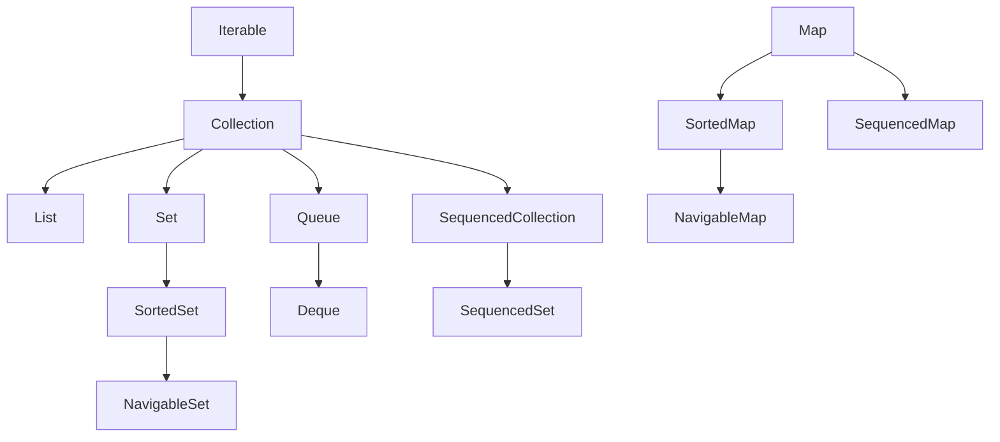
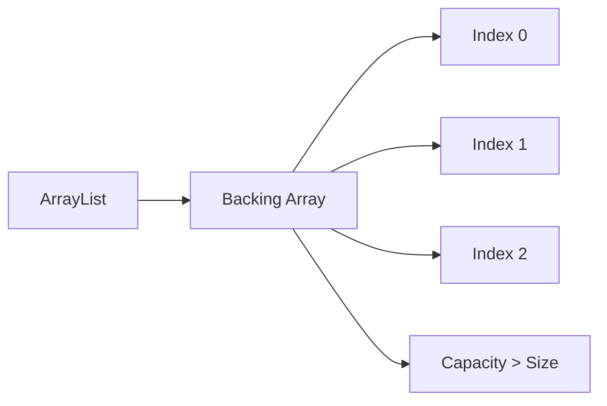
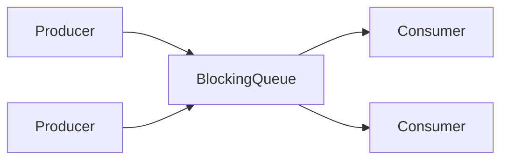
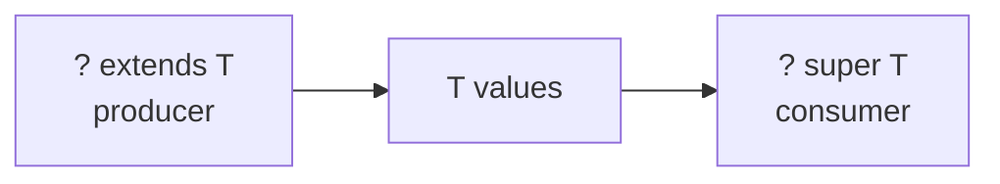
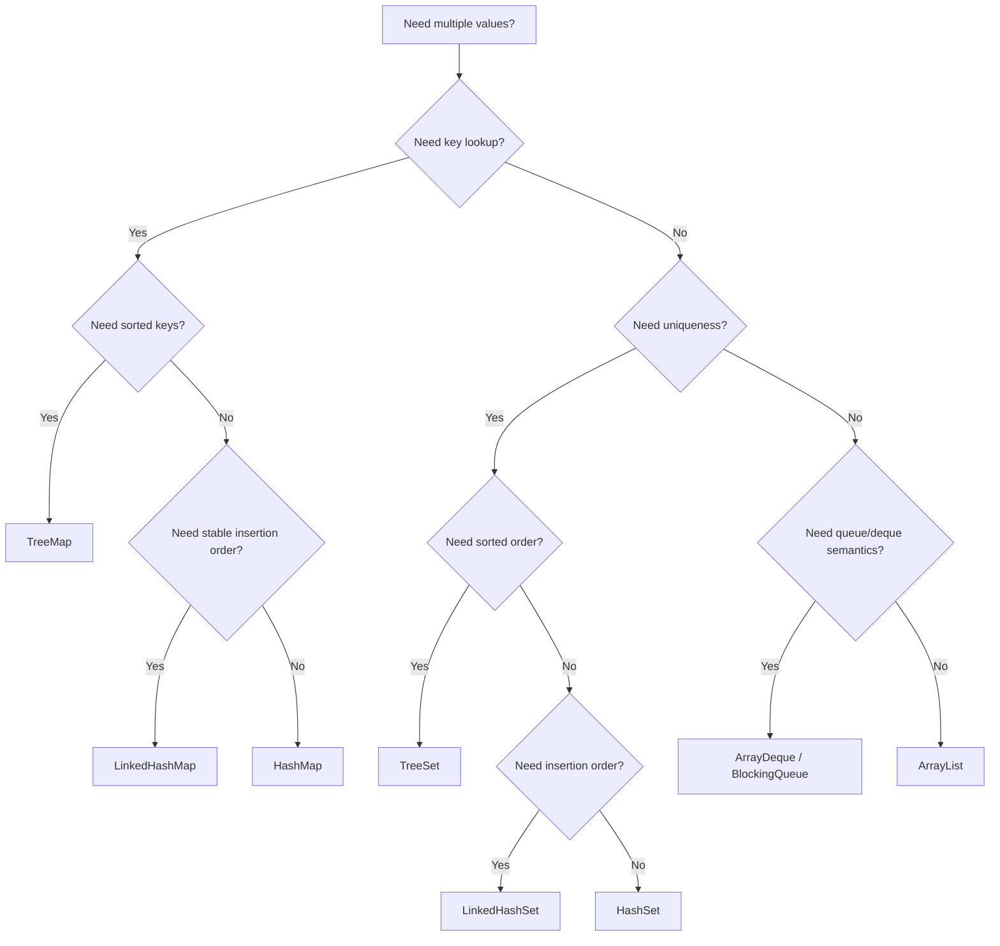
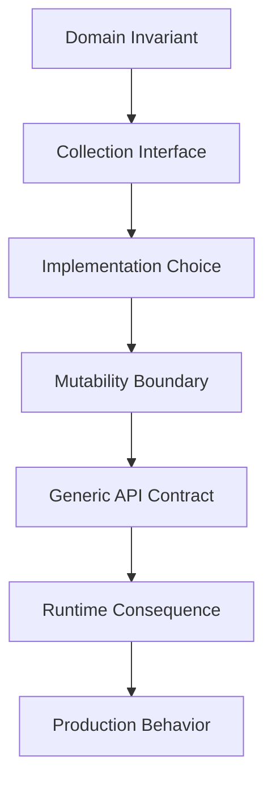

# Part 009 — Collections, Generics, Type Erasure, dan API Design

> Fokus part ini: mengubah `List`, `Set`, `Map`, dan generics dari sekadar API yang sering dipakai menjadi alat desain. Targetnya bukan hanya bisa memakai collection, tetapi mampu memilih struktur data, mendesain boundary API, memahami konsekuensi type erasure, dan menghindari bug yang biasanya hanya muncul pada sistem besar.

---

## 1. Posisi Part Ini dalam Framework Kaufman

Dalam framework *The First 20 Hours*, kita tidak mulai dari membaca seluruh dokumentasi `java.util`. Kita mulai dari kemampuan performa yang ingin dicapai.

Untuk part ini, target performanya adalah:

1. Bisa memilih collection yang benar berdasarkan operasi dominan.
2. Bisa menjelaskan konsekuensi ordering, uniqueness, equality, dan mutability.
3. Bisa mendesain generic API yang usable tanpa raw type dan tanpa wildcard berlebihan.
4. Bisa memahami kenapa generic type hilang di runtime karena type erasure.
5. Bisa membaca compiler error generic yang kompleks dan memperbaikinya secara sistematis.
6. Bisa membuat boundary API yang tidak membocorkan implementasi internal.

Part ini adalah titik penting karena banyak code Java enterprise sebenarnya adalah manipulasi struktur data: list of DTO, map of aggregate, set of permission, queue of work item, cache of lookup, collection of domain events, dan sebagainya.

Kalau collection dipilih asal-asalan, dampaknya bukan hanya performance. Dampaknya bisa masuk ke correctness, security, consistency, concurrency, API evolution, dan maintainability.

---

## 2. Mental Model: Collection adalah Kontrak Semantik, Bukan Container Saja

Kesalahan umum engineer adalah melihat collection sebagai “tempat menyimpan banyak data”. Itu terlalu dangkal.

Collection harus dibaca sebagai kontrak:

| Type | Kontrak utama | Pertanyaan desain |
|---|---|---|
| `List<E>` | Urutan dan akses posisi | Apakah urutan bermakna? Apakah duplikasi valid? |
| `Set<E>` | Keunikan elemen | Apa definisi “sama”? Apakah ordering dibutuhkan? |
| `Map<K,V>` | Lookup berdasarkan key | Apa identitas key? Apakah missing key valid? |
| `Queue<E>` | Pemrosesan antrean | Apakah FIFO cukup? Apakah blocking dibutuhkan? |
| `Deque<E>` | Dua ujung antrean | Apakah butuh stack/queue hybrid? |
| `SequencedCollection<E>` | Encounter order eksplisit | Apakah first/last adalah bagian dari domain? |

Jadi sebelum memilih implementasi, tanyakan dulu:

- Apakah elemen boleh duplikat?
- Apakah urutan penting?
- Apakah lookup by key dominan?
- Apakah operasi remove sering terjadi?
- Apakah data immutable setelah dibuat?
- Apakah collection melewati boundary API?
- Apakah collection dipakai lintas thread?
- Apakah ukuran data kecil, sedang, besar, atau tidak terbatas?
- Apakah ordering natural, insertion order, sorted order, atau tidak penting?

Contoh domain:

```java
record Permission(String name) {}

// Buruk: List menyiratkan urutan dan duplikasi mungkin valid.
List<Permission> permissions;

// Lebih kuat: Set menyatakan permission unik.
Set<Permission> permissions;
```

Dengan mengganti `List` menjadi `Set`, kita tidak hanya mengganti implementasi. Kita memperjelas invariant domain.

---

## 3. Java Collections Framework: Peta Besar

Java Collections Framework terdiri dari interface, implementasi, dan algoritma umum. Interface menyatakan kontrak. Implementasi menyatakan strategi data structure. Algoritma umum tersedia di `Collections`, `Arrays`, dan stream/collector API.



Catatan penting:

- `Map` bukan subtype dari `Collection`.
- `List`, `Set`, dan `Queue` adalah subtype dari `Collection`.
- Sejak Java 21, Java punya interface sequenced collection untuk collection/map yang punya encounter order eksplisit.
- Banyak implementasi collection tidak thread-safe.
- Banyak factory method modern menghasilkan collection yang unmodifiable.

---

## 4. List: Ordered, Indexed, Duplicate-Friendly

`List<E>` cocok ketika:

- Urutan elemen bermakna.
- Duplikasi valid.
- Akses berdasarkan indeks dibutuhkan.
- Output harus mempertahankan order input.
- Elemen diproses secara sekuensial.

Contoh yang cocok:

```java
List<String> validationErrors = new ArrayList<>();
validationErrors.add("email is required");
validationErrors.add("password is too short");
```

Di sini `List` masuk akal karena:

- Urutan error mungkin ingin dipertahankan.
- Dua error berbeda bisa memiliki pesan yang mirip.
- Consumer mungkin ingin menampilkan error sesuai urutan validasi.

### 4.1 `ArrayList`

`ArrayList` adalah pilihan default untuk list yang banyak dibaca dan ditambah di akhir.

Karakteristik umum:

| Operasi | Karakteristik |
|---|---|
| `get(index)` | cepat, akses langsung |
| `add(element)` di akhir | amortized cepat |
| insert di tengah | mahal karena shifting |
| remove di tengah | mahal karena shifting |
| memory locality | baik |

Mental model:



Gunakan `ArrayList` ketika:

- Jumlah elemen sedang sampai besar.
- Pola akses dominan adalah iterasi dan random access.
- Modifikasi dominan adalah append.
- Tidak butuh thread safety internal.

Hindari `ArrayList` ketika:

- Sering insert/remove di depan atau tengah.
- Banyak operasi concurrent mutation.
- Ukuran sangat besar dan resize tidak dikontrol.

### 4.2 `LinkedList`

`LinkedList` sering disalahgunakan karena orang mengingat teori bahwa insert/delete di linked list adalah O(1). Dalam praktik Java, itu sering menyesatkan.

Masalahnya:

- Untuk insert/delete di posisi tertentu, Anda tetap harus menemukan node-nya dulu.
- Tiap node adalah object terpisah, sehingga memory overhead lebih besar.
- Locality buruk untuk CPU cache.
- Iterasi bisa lebih lambat dibanding array-backed list.

Gunakan `LinkedList` hanya ketika Anda benar-benar membutuhkan operasi deque/list tertentu dan sudah punya alasan kuat. Untuk queue/deque, biasanya `ArrayDeque` lebih baik.

### 4.3 `CopyOnWriteArrayList`

`CopyOnWriteArrayList` cocok untuk pola:

- read sangat sering,
- write sangat jarang,
- iterator tidak perlu melihat perubahan terbaru,
- snapshot semantics berguna.

Contoh:

```java
private final List<Listener> listeners = new CopyOnWriteArrayList<>();

public void register(Listener listener) {
    listeners.add(listener);
}

public void publish(Event event) {
    for (Listener listener : listeners) {
        listener.onEvent(event);
    }
}
```

Jangan gunakan untuk workload write-heavy karena setiap write menyalin array.

---

## 5. Set: Uniqueness dan Equality Contract

`Set<E>` cocok ketika uniqueness adalah invariant.

Contoh:

```java
Set<String> roles = new HashSet<>();
roles.add("ADMIN");
roles.add("ADMIN");

System.out.println(roles.size()); // 1
```

Dengan `Set`, pertanyaan terpenting adalah: **apa definisi sama?**

Di Java, definisi sama untuk hash-based set bergantung pada:

- `equals`
- `hashCode`

### 5.1 `HashSet`

`HashSet` cocok untuk uniqueness tanpa ordering.

```java
Set<String> ids = new HashSet<>();
ids.add("A-001");
ids.add("A-002");
```

Karakteristik:

- Lookup rata-rata cepat.
- Tidak menjamin order iterasi semantik.
- Bergantung pada `hashCode` yang baik.
- Mutasi field yang dipakai `equals/hashCode` setelah masuk set adalah bug serius.

Contoh bug:

```java
final class UserKey {
    private String email;

    UserKey(String email) {
        this.email = email;
    }

    void changeEmail(String email) {
        this.email = email;
    }

    @Override
    public boolean equals(Object o) {
        return o instanceof UserKey other && Objects.equals(email, other.email);
    }

    @Override
    public int hashCode() {
        return Objects.hash(email);
    }
}

Set<UserKey> users = new HashSet<>();
UserKey key = new UserKey("a@example.com");
users.add(key);
key.changeEmail("b@example.com");

System.out.println(users.contains(key)); // bisa false
```

Solusi: key harus immutable.

```java
record UserKey(String email) {}
```

### 5.2 `LinkedHashSet`

`LinkedHashSet` mempertahankan insertion order.

Gunakan ketika:

- uniqueness dibutuhkan,
- order input harus dipertahankan,
- output stabil penting untuk test, logs, atau API response.

```java
Set<String> tags = new LinkedHashSet<>();
tags.add("java");
tags.add("jvm");
tags.add("java");

System.out.println(tags); // [java, jvm]
```

### 5.3 `TreeSet`

`TreeSet` mempertahankan sorted order.

Gunakan ketika:

- elemen harus selalu terurut,
- butuh range query,
- butuh `first`, `last`, `lower`, `higher`, `floor`, `ceiling`.

```java
NavigableSet<Integer> scores = new TreeSet<>(List.of(10, 30, 20));

System.out.println(scores.first());   // 10
System.out.println(scores.higher(20)); // 30
```

Hati-hati: `TreeSet` memakai `compareTo` atau `Comparator`, bukan hanya `equals`. Comparator yang tidak konsisten dengan equals bisa menghasilkan perilaku yang mengejutkan.

---

## 6. Map: Lookup, Identity, dan Missing Value Semantics

`Map<K,V>` adalah struktur untuk lookup berdasarkan key.

Pertanyaan desain utama:

- Apa identitas key?
- Apakah value boleh null?
- Apa arti key tidak ditemukan?
- Apakah ordering key penting?
- Apakah insertion order penting?
- Apakah map mewakili cache, index, registry, atau aggregate state?

Contoh:

```java
Map<String, Account> accountsById = new HashMap<>();
accountsById.put("A-001", new Account("A-001"));
```

### 6.1 `HashMap`

Default untuk lookup cepat tanpa ordering.

Gunakan ketika:

- key punya `equals/hashCode` yang benar,
- order tidak penting,
- tidak perlu sorted/range operation.

Jangan bergantung pada order iterasi `HashMap`. Jika output API harus stabil, gunakan `LinkedHashMap` atau sort secara eksplisit.

### 6.2 `LinkedHashMap`

Menjaga insertion order. Berguna untuk:

- stable serialization,
- deterministic tests,
- ordered response,
- simple LRU cache via access-order constructor.

Contoh LRU sederhana:

```java
final class LruCache<K, V> extends LinkedHashMap<K, V> {
    private final int maxEntries;

    LruCache(int maxEntries) {
        super(16, 0.75f, true);
        this.maxEntries = maxEntries;
    }

    @Override
    protected boolean removeEldestEntry(Map.Entry<K, V> eldest) {
        return size() > maxEntries;
    }
}
```

Untuk production cache serius, pertimbangkan library cache matang seperti Caffeine, karena cache production bukan hanya map dengan limit. Cache production perlu expiry, refresh, metrics, concurrency, eviction policy, dan backpressure.

### 6.3 `TreeMap`

Sorted map berdasarkan natural order atau comparator.

Cocok untuk:

- range query,
- time bucket,
- ordered navigation,
- prefix/range-like operation jika key mendukung ordering.

```java
NavigableMap<Instant, String> timeline = new TreeMap<>();
timeline.put(Instant.parse("2026-01-01T00:00:00Z"), "created");
timeline.put(Instant.parse("2026-01-02T00:00:00Z"), "approved");

Map.Entry<Instant, String> latest = timeline.lastEntry();
```

### 6.4 `EnumMap`

Gunakan `EnumMap` ketika key adalah enum.

```java
enum CaseStatus {
    DRAFT, SUBMITTED, APPROVED, REJECTED
}

Map<CaseStatus, Integer> counts = new EnumMap<>(CaseStatus.class);
counts.put(CaseStatus.DRAFT, 10);
```

Kelebihan:

- lebih efisien daripada `HashMap` untuk enum key,
- key space finite,
- intent jelas.

### 6.5 `ConcurrentHashMap`

Untuk concurrent access. Tetapi jangan menyimpulkan semua operasi compound otomatis aman.

Buruk:

```java
if (!map.containsKey(key)) {
    map.put(key, computeValue());
}
```

Lebih baik:

```java
map.computeIfAbsent(key, this::computeValue);
```

Tetap hati-hati: function di `computeIfAbsent` harus tidak punya efek samping berbahaya dan tidak memanggil operasi map lain yang bisa menyebabkan kompleksitas tak perlu.

---

## 7. Queue dan Deque: Work, Ordering, dan Backpressure

`Queue<E>` menyatakan elemen diproses dalam pola antrean. `Deque<E>` menyatakan operasi di dua ujung.

### 7.1 `ArrayDeque`

Default yang baik untuk stack/queue non-concurrent.

```java
Deque<String> stack = new ArrayDeque<>();
stack.push("A");
stack.push("B");
System.out.println(stack.pop()); // B
```

Untuk queue:

```java
Deque<String> queue = new ArrayDeque<>();
queue.addLast("A");
queue.addLast("B");
System.out.println(queue.removeFirst()); // A
```

Lebih baik daripada `Stack` legacy untuk penggunaan stack.

### 7.2 Blocking Queue

Untuk producer-consumer antar thread, gunakan implementasi dari `java.util.concurrent` seperti:

- `ArrayBlockingQueue`
- `LinkedBlockingQueue`
- `PriorityBlockingQueue`
- `DelayQueue`
- `SynchronousQueue`

Mental model:



Queue bukan hanya struktur data. Queue adalah boundary backpressure.

Jika queue tidak dibatasi, sistem bisa terlihat “tidak error” sampai memory habis.

---

## 8. Sequenced Collections: Order sebagai Kontrak Eksplisit

Java 21 memperkenalkan konsep sequenced collections. Sebelumnya, banyak collection punya order dalam praktik, tetapi tidak selalu diekspresikan di type umum.

Interface penting:

- `SequencedCollection<E>`
- `SequencedSet<E>`
- `SequencedMap<K,V>`

Gunanya adalah membuat operasi first/last/reversed lebih eksplisit.

Contoh mental:

```java
SequencedCollection<String> names = new ArrayList<>(List.of("A", "B", "C"));

String first = names.getFirst();
String last = names.getLast();
SequencedCollection<String> reversed = names.reversed();
```

Kapan berguna:

- audit trail,
- ordered domain events,
- deterministic output,
- workflow transition history,
- priority-like user presentation order.

Desain API yang lebih kuat:

```java
interface CaseHistory {
    SequencedCollection<CaseEvent> events();
}
```

Ini lebih jelas daripada `Collection<CaseEvent>` karena history tanpa order hampir tidak bermakna.

---

## 9. Equality, Hashing, dan Ordering

Collection correctness sangat bergantung pada tiga kontrak:

1. `equals`
2. `hashCode`
3. `compareTo` / `Comparator`

### 9.1 Kontrak `equals`

`equals` harus:

- reflexive: `x.equals(x)` true,
- symmetric: `x.equals(y)` sama dengan `y.equals(x)`,
- transitive,
- consistent,
- return false untuk null.

### 9.2 Kontrak `hashCode`

Jika dua object equal, hash code harus sama.

```java
record EmailAddress(String value) {
    EmailAddress {
        Objects.requireNonNull(value);
        value = value.trim().toLowerCase(Locale.ROOT);
    }
}
```

Record membantu karena `equals/hashCode` dibuat berdasarkan komponen record. Tetapi validasi/normalisasi tetap tanggung jawab Anda.

### 9.3 Comparator

Comparator harus konsisten dan transitive.

Buruk:

```java
Comparator<User> byNameLength = (a, b) -> a.name().length() - b.name().length();
```

Lebih baik:

```java
Comparator<User> byNameLength = Comparator.comparingInt(user -> user.name().length());
```

Jika comparator menganggap dua object sama (`compare(a, b) == 0`), `TreeSet` bisa menganggap hanya satu yang boleh masuk, walaupun `equals` berbeda.

---

## 10. Mutability: Collection Itself vs Elements Inside

Ada tiga hal berbeda:

1. Collection bisa dimodifikasi atau tidak.
2. Elemen di dalamnya mutable atau immutable.
3. Referensi internal bocor atau tidak.

Contoh bug:

```java
final class Order {
    private final List<String> items;

    Order(List<String> items) {
        this.items = items;
    }

    List<String> items() {
        return items;
    }
}
```

Consumer bisa mengubah internal state:

```java
List<String> input = new ArrayList<>();
input.add("book");

Order order = new Order(input);
order.items().clear(); // internal state rusak
```

Lebih baik:

```java
final class Order {
    private final List<String> items;

    Order(List<String> items) {
        this.items = List.copyOf(items);
    }

    List<String> items() {
        return items;
    }
}
```

Namun `List.copyOf` hanya membuat list unmodifiable. Jika elemen di dalam mutable object, mutasi elemen tetap mungkin.

```java
record LineItem(String sku, int quantity) {}
```

Gunakan immutable element jika collection mewakili state domain penting.

---

## 11. Unmodifiable, Immutable, Fixed-Size: Jangan Disamakan

Istilah yang sering tercampur:

| Bentuk | Contoh | Makna |
|---|---|---|
| fixed-size | `Arrays.asList(...)` | size tidak bisa berubah, elemen bisa diganti |
| unmodifiable view | `Collections.unmodifiableList(list)` | wrapper tidak bisa mutate, backing list bisa berubah |
| unmodifiable copy | `List.copyOf(list)` | copy tidak bisa mutate melalui API list |
| immutable deep structure | custom discipline | collection dan elemen tidak berubah |

Contoh jebakan:

```java
List<String> base = new ArrayList<>();
base.add("A");

List<String> view = Collections.unmodifiableList(base);
base.add("B");

System.out.println(view); // [A, B]
```

`view` tidak bisa dimutasi langsung, tetapi ia tetap melihat perubahan backing list.

Untuk boundary API, lebih aman:

```java
return List.copyOf(items);
```

---

## 12. Fail-Fast Iterator dan Concurrent Modification

Banyak collection non-concurrent punya iterator fail-fast. Jika collection dimodifikasi secara struktural saat iterasi selain melalui iterator, `ConcurrentModificationException` bisa muncul.

Buruk:

```java
for (String item : items) {
    if (item.isBlank()) {
        items.remove(item);
    }
}
```

Lebih baik:

```java
items.removeIf(String::isBlank);
```

Atau:

```java
Iterator<String> iterator = items.iterator();
while (iterator.hasNext()) {
    String item = iterator.next();
    if (item.isBlank()) {
        iterator.remove();
    }
}
```

Jangan memakai `ConcurrentModificationException` sebagai concurrency control. Ia adalah bug detector best-effort, bukan mekanisme correctness.

---

## 13. Big-O yang Berguna untuk Engineer Production

Big-O penting, tetapi jangan berhenti di tabel. Dalam Java production, performance dipengaruhi oleh:

- alokasi object,
- cache locality,
- hash distribution,
- comparator cost,
- boxing/unboxing,
- contention,
- GC pressure,
- data size,
- branch predictability,
- serialization cost,
- database/network cost di sekitar collection.

Tabel praktis:

| Struktur | Lookup | Insert | Ordered? | Use case dominan |
|---|---:|---:|---|---|
| `ArrayList` | by index cepat | append cepat | insertion order | sequence umum |
| `LinkedList` | lambat | context-dependent | insertion order | jarang sebagai pilihan utama |
| `HashSet` | cepat rata-rata | cepat rata-rata | tidak | uniqueness |
| `LinkedHashSet` | cepat rata-rata | cepat rata-rata | insertion order | uniqueness + stable order |
| `TreeSet` | log n | log n | sorted | range/sorted uniqueness |
| `HashMap` | cepat rata-rata | cepat rata-rata | tidak | lookup umum |
| `LinkedHashMap` | cepat rata-rata | cepat rata-rata | insertion/access order | stable map/cache sederhana |
| `TreeMap` | log n | log n | sorted key | range lookup |
| `ArrayDeque` | end ops cepat | end ops cepat | sequence | stack/queue non-concurrent |

Production rule:

> Untuk data kecil, readability dan semantic correctness sering lebih penting daripada micro-optimization. Untuk data besar, ukur dengan benchmark dan profiling, bukan asumsi.

---

## 14. Generics: Type Safety di Compile Time

Generics memungkinkan type safety tanpa cast manual.

Tanpa generics:

```java
List names = new ArrayList();
names.add("Alice");
names.add(42);

String first = (String) names.get(0);
String second = (String) names.get(1); // ClassCastException
```

Dengan generics:

```java
List<String> names = new ArrayList<>();
names.add("Alice");
// names.add(42); // compile error

String first = names.get(0);
```

Generic type menyatakan: “collection ini hanya boleh berisi nilai dengan tipe tertentu.”

Tetapi ada batas penting: generic type mostly bekerja di compile time, bukan runtime.

---

## 15. Invariance: `List<Integer>` Bukan `List<Number>`

Kesalahan paling umum:

```java
List<Integer> integers = List.of(1, 2, 3);
// List<Number> numbers = integers; // compile error
```

Kenapa?

Jika itu diizinkan:

```java
List<Integer> integers = new ArrayList<>();
List<Number> numbers = integers; // andaikan boleh
numbers.add(3.14);
Integer value = integers.get(0); // rusak
```

Java generic types invariant. Artinya `List<Integer>` bukan subtype dari `List<Number>`, walaupun `Integer` subtype dari `Number`.

Solusinya menggunakan wildcard saat API hanya perlu membaca atau menulis dengan pola tertentu.

---

## 16. Wildcards dan PECS

Mnemonic klasik: **PECS — Producer Extends, Consumer Super**.

- Jika collection memproduksi nilai untuk Anda baca: `? extends T`
- Jika collection mengonsumsi nilai yang Anda tulis: `? super T`

### 16.1 Producer Extends

```java
static double sum(List<? extends Number> numbers) {
    double total = 0;
    for (Number number : numbers) {
        total += number.doubleValue();
    }
    return total;
}
```

Bisa menerima:

```java
sum(List.of(1, 2, 3));       // List<Integer>
sum(List.of(1.5, 2.5, 3.5)); // List<Double>
```

Tetapi Anda tidak bisa add angka arbitrary ke `List<? extends Number>` karena compiler tidak tahu subtype konkret list tersebut.

```java
static void broken(List<? extends Number> numbers) {
    // numbers.add(1); // compile error
}
```

### 16.2 Consumer Super

```java
static void addDefaults(List<? super Integer> target) {
    target.add(1);
    target.add(2);
    target.add(3);
}
```

Bisa menerima:

```java
List<Integer> integers = new ArrayList<>();
List<Number> numbers = new ArrayList<>();
List<Object> objects = new ArrayList<>();

addDefaults(integers);
addDefaults(numbers);
addDefaults(objects);
```

Saat membaca dari `List<? super Integer>`, type paling aman adalah `Object`.

### 16.3 API Design Example

Buruk:

```java
static <T> void copy(List<T> source, List<T> target) {
    target.addAll(source);
}
```

Terlalu ketat. Ini tidak bisa copy `List<Integer>` ke `List<Number>`.

Lebih baik:

```java
static <T> void copy(List<? extends T> source, List<? super T> target) {
    target.addAll(source);
}
```

Mental model:



---

## 17. Generic Methods dan Bounded Type Parameters

Generic method berguna ketika type parameter milik method, bukan class.

```java
static <T> T first(List<T> items) {
    if (items.isEmpty()) {
        throw new NoSuchElementException("items is empty");
    }
    return items.get(0);
}
```

Bounded type parameter:

```java
static <T extends Comparable<T>> T max(List<T> items) {
    if (items.isEmpty()) {
        throw new NoSuchElementException("items is empty");
    }

    T result = items.get(0);
    for (T item : items) {
        if (item.compareTo(result) > 0) {
            result = item;
        }
    }
    return result;
}
```

Namun bound di atas masih bisa terlalu sempit. Versi yang lebih fleksibel:

```java
static <T extends Comparable<? super T>> T max(List<? extends T> items) {
    if (items.isEmpty()) {
        throw new NoSuchElementException("items is empty");
    }

    T result = items.get(0);
    for (T item : items) {
        if (item.compareTo(result) > 0) {
            result = item;
        }
    }
    return result;
}
```

Untuk sebagian besar API internal, jangan langsung membuat generic signature kompleks. Mulai dari signature sederhana, lalu perluas hanya ketika use case nyata membutuhkannya.

---

## 18. Type Erasure: Kenapa `List<String>` Tidak Ada sebagai Tipe Runtime Penuh

Java generics diimplementasikan dengan type erasure. Sederhananya, informasi generic type digunakan oleh compiler untuk type checking, lalu sebagian besar dihapus pada runtime.

Contoh:

```java
List<String> names = new ArrayList<>();
List<Integer> numbers = new ArrayList<>();

System.out.println(names.getClass() == numbers.getClass()); // true
```

Runtime class keduanya adalah `java.util.ArrayList`.

### 18.1 Konsekuensi Type Erasure

Anda tidak bisa:

```java
// if (value instanceof List<String>) {} // tidak valid
```

Anda tidak bisa membuat generic array secara langsung:

```java
// List<String>[] lists = new List<String>[10]; // tidak valid
```

Anda bisa mendapat warning heap pollution jika memaksa raw type atau unchecked cast.

### 18.2 Bridge Methods

Type erasure bisa menyebabkan compiler membuat bridge method untuk menjaga polymorphism.

```java
interface Box<T> {
    T get();
}

final class StringBox implements Box<String> {
    @Override
    public String get() {
        return "value";
    }
}
```

Setelah erasure, interface secara kasar membutuhkan `Object get()`, sedangkan class punya `String get()`. Compiler dapat menambahkan bridge method agar dispatch tetap benar.

Anda jarang perlu menulis bridge method, tetapi penting tahu bahwa generics punya konsekuensi bytecode.

---

## 19. Raw Types dan Heap Pollution

Raw type adalah generic type tanpa type argument.

Buruk:

```java
List values = new ArrayList<String>();
values.add(42);

List<String> names = values;
String name = names.get(0); // ClassCastException
```

Raw type membuka pintu heap pollution: variable generic terlihat memiliki type aman, tetapi object di heap berisi nilai yang tidak sesuai.

Rule:

- Jangan gunakan raw type di code baru.
- Jika bertemu raw type di legacy code, isolasi di boundary kecil.
- Tambahkan `@SuppressWarnings("unchecked")` hanya pada scope paling kecil dan jelaskan invariant-nya.

Contoh isolasi:

```java
@SuppressWarnings("unchecked")
static Map<String, Object> castToStringObjectMap(Object value) {
    if (!(value instanceof Map<?, ?> map)) {
        throw new IllegalArgumentException("Expected map");
    }

    for (Object key : map.keySet()) {
        if (!(key instanceof String)) {
            throw new IllegalArgumentException("Expected string keys");
        }
    }

    return (Map<String, Object>) map;
}
```

Unchecked cast tetap ada, tetapi invariant dicek manual sebelum cast.

---

## 20. Generic API Design: Prinsip Praktis

### 20.1 Return Concrete, Accept Flexible?

Ada dua prinsip yang sering dipakai:

- Parameter sebaiknya menerima tipe paling umum yang cukup.
- Return type sebaiknya menyatakan kontrak yang ingin dijanjikan.

Contoh:

```java
public List<Result> search(Collection<Query> queries) {
    ...
}
```

Parameter `Collection<Query>` menyatakan method tidak butuh indexing. Return `List<Result>` menyatakan hasil punya order.

### 20.2 Jangan Bocorkan Mutability Internal

Buruk:

```java
class Registry {
    private final Map<String, Handler> handlers = new HashMap<>();

    public Map<String, Handler> handlers() {
        return handlers;
    }
}
```

Lebih baik:

```java
class Registry {
    private final Map<String, Handler> handlers = new HashMap<>();

    public Map<String, Handler> handlers() {
        return Map.copyOf(handlers);
    }
}
```

Atau expose operasi domain, bukan collection:

```java
class Registry {
    private final Map<String, Handler> handlers = new HashMap<>();

    public Optional<Handler> find(String name) {
        return Optional.ofNullable(handlers.get(name));
    }

    public void register(String name, Handler handler) {
        if (handlers.containsKey(name)) {
            throw new IllegalArgumentException("Handler already registered: " + name);
        }
        handlers.put(name, handler);
    }
}
```

Ini lebih kuat karena invariant tetap di dalam aggregate/object.

### 20.3 Hindari Wildcard di Return Type

Biasanya buruk:

```java
public List<? extends Event> events() {
    ...
}
```

Consumer jadi sulit memakai return value. Lebih baik:

```java
public List<Event> events() {
    ...
}
```

Gunakan wildcard terutama di parameter untuk meningkatkan fleksibilitas input.

### 20.4 Jangan Over-Generalize

Buruk untuk API internal sederhana:

```java
public <T, C extends Collection<? super T>> C transform(
        Iterable<? extends T> source,
        Function<? super T, ? extends T> mapper,
        Supplier<? extends C> collectionFactory) {
    ...
}
```

Signature seperti ini mungkin cocok untuk library umum, tetapi sering terlalu kompleks untuk business code.

Lebih baik:

```java
public List<OrderSummary> summarize(Collection<Order> orders) {
    return orders.stream()
            .map(this::summarize)
            .toList();
}
```

Complexity harus dibayar hanya ketika memberi nilai nyata.

---

## 21. Collection Boundary dalam Domain Model

Collection sering mewakili hubungan domain.

Contoh domain enforcement/case management:

```java
record CaseId(String value) {}
record ActorId(String value) {}
record CaseEvent(Instant occurredAt, String type, String description) {}

final class EnforcementCase {
    private final CaseId id;
    private final List<CaseEvent> events = new ArrayList<>();
    private final Set<ActorId> assignedActors = new LinkedHashSet<>();

    EnforcementCase(CaseId id) {
        this.id = Objects.requireNonNull(id);
    }

    public void assign(ActorId actorId) {
        if (!assignedActors.add(actorId)) {
            return;
        }
        events.add(new CaseEvent(Instant.now(), "ASSIGNED", actorId.value()));
    }

    public List<CaseEvent> events() {
        return List.copyOf(events);
    }

    public Set<ActorId> assignedActors() {
        return Set.copyOf(assignedActors);
    }
}
```

Di sini:

- `events` adalah `List` karena urutan kejadian penting.
- `assignedActors` adalah `Set` karena aktor tidak boleh duplikat.
- `LinkedHashSet` internal menjaga insertion order jika nanti dibutuhkan untuk determinism.
- Getter mengembalikan copy agar invariant internal tidak bocor.

---

## 22. Collection dan Null

Banyak collection Java mengizinkan null, tetapi tidak semua. Sebagian collection modern dan concurrent tidak menerima null.

Rule praktis:

- Jangan simpan null di collection kecuali ada alasan eksplisit dan terdokumentasi.
- Missing element lebih baik dimodelkan sebagai absence, bukan null element.
- Untuk map, hindari null value karena `get(key) == null` ambigu antara key tidak ada dan value null.

Buruk:

```java
Map<String, User> users = new HashMap<>();
users.put("A", null);

if (users.get("A") == null) {
    // Apakah user tidak ada atau value-nya null?
}
```

Lebih baik:

```java
Optional<User> user = Optional.ofNullable(users.get("A"));
```

Atau gunakan method:

```java
public Optional<User> findUser(String id) {
    return Optional.ofNullable(usersById.get(id));
}
```

---

## 23. Collection dan Streams: Batas yang Sehat

Collection menyimpan data. Stream memproses data.

Jangan menyimpan `Stream` sebagai field.

Buruk:

```java
class Report {
    private final Stream<Row> rows;
}
```

Stream single-use dan lazy. Simpan source-nya, bukan stream-nya.

Lebih baik:

```java
class Report {
    private final List<Row> rows;

    Stream<Row> rows() {
        return rows.stream();
    }
}
```

Untuk API, return collection jika consumer perlu data materialized. Return stream jika producer ingin lazy processing dan lifecycle-nya jelas.

---

## 24. Decision Matrix: Memilih Collection dengan Cepat



Fast rules:

- Default sequence: `ArrayList`
- Default uniqueness: `HashSet`
- Default lookup: `HashMap`
- Need stable order: `LinkedHashSet` / `LinkedHashMap`
- Need sorted/range: `TreeSet` / `TreeMap`
- Need stack/queue non-concurrent: `ArrayDeque`
- Need concurrent map: `ConcurrentHashMap`
- Need producer-consumer: `BlockingQueue`
- Need enum key: `EnumMap`

---

## 25. Practice: 20-Hour Drill untuk Part Ini

Alokasi latihan:

| Waktu | Latihan | Fokus |
|---:|---|---|
| 30 menit | Implementasikan selection matrix | decision speed |
| 60 menit | Refactor `List` ke `Set/Map` berdasarkan invariant domain | semantic modeling |
| 60 menit | Debug bug `HashSet` dengan mutable key | equality/hashCode |
| 90 menit | Tulis generic utility `copy`, `map`, `groupBy` | generics + wildcard |
| 60 menit | Isolasi raw type dari legacy API | type erasure + safety |
| 90 menit | Buat aggregate dengan collection boundary immutable | API design |
| 60 menit | Benchmark kecil `ArrayList` vs `LinkedList` untuk workload tertentu | evidence-based decision |
| 60 menit | Gunakan `TreeMap` untuk timeline/range query | ordered map |
| 60 menit | Buat producer-consumer dengan bounded queue | backpressure |
| 30 menit | Tulis checklist code review collection | feedback loop |

---

## 26. Code Review Checklist

Gunakan checklist ini saat review Java code:

- Apakah collection type mencerminkan invariant domain?
- Apakah `List` dipakai hanya karena default, padahal `Set`/`Map` lebih tepat?
- Apakah ordering output stabil jika dibutuhkan?
- Apakah key map immutable?
- Apakah class yang masuk `HashSet/HashMap` punya `equals/hashCode` benar?
- Apakah comparator konsisten dan aman?
- Apakah collection internal bocor lewat getter?
- Apakah return collection seharusnya immutable/unmodifiable?
- Apakah null element/value diperbolehkan secara eksplisit?
- Apakah raw type/unchecked cast diisolasi?
- Apakah wildcard dipakai di parameter, bukan return type yang menyulitkan consumer?
- Apakah concurrent collection benar-benar menyelesaikan operasi compound?
- Apakah queue bounded jika dipakai sebagai buffer workload?

---

## 27. Kesalahan Umum dan Perbaikannya

### Kesalahan 1: Semua Banyak Data Dianggap `List`

Buruk:

```java
List<String> userIds = new ArrayList<>();
```

Jika user ID harus unik:

```java
Set<String> userIds = new HashSet<>();
```

Jika perlu lookup user by ID:

```java
Map<String, User> usersById = new HashMap<>();
```

### Kesalahan 2: Mengembalikan Mutable Internal Collection

Buruk:

```java
public List<Item> items() {
    return items;
}
```

Baik:

```java
public List<Item> items() {
    return List.copyOf(items);
}
```

### Kesalahan 3: Wildcard Berlebihan

Buruk:

```java
List<? extends User> users = service.findUsers();
```

Baik:

```java
List<User> users = service.findUsers();
```

### Kesalahan 4: Menggunakan `LinkedList` karena Teori Big-O

Sering lebih baik:

```java
List<Event> events = new ArrayList<>();
```

Atau untuk queue:

```java
Deque<Event> events = new ArrayDeque<>();
```

### Kesalahan 5: Menganggap `ConcurrentHashMap` Membuat Semua Flow Aman

Buruk:

```java
if (!map.containsKey(key)) {
    map.put(key, value);
}
```

Baik:

```java
map.putIfAbsent(key, value);
```

Atau:

```java
map.computeIfAbsent(key, this::load);
```

---

## 28. Mental Model Akhir



Urutan berpikir yang benar:

1. Mulai dari invariant domain.
2. Pilih interface yang menyatakan invariant.
3. Pilih implementasi berdasarkan operasi dominan.
4. Lindungi mutability boundary.
5. Desain generic API secukupnya.
6. Pahami konsekuensi type erasure.
7. Ukur jika performance penting.

---

## 29. Ringkasan

Collections dan generics adalah pusat desain Java sehari-hari. `ArrayList`, `HashMap`, dan `HashSet` memang sering menjadi default, tetapi top-tier engineer tidak memilih default tanpa alasan. Mereka membaca collection sebagai kontrak semantik.

Generics memberi type safety di compile time, tetapi type erasure membatasi apa yang bisa diketahui runtime. Karena itu, desain generic API harus seimbang: cukup fleksibel untuk consumer, tetapi tidak terlalu abstrak hingga sulit dibaca.

Rule paling penting:

- Gunakan `List` untuk ordered sequence.
- Gunakan `Set` untuk uniqueness.
- Gunakan `Map` untuk lookup by key.
- Gunakan `Queue/Deque` untuk work ordering.
- Gunakan sequenced collection ketika first/last/order adalah kontrak.
- Lindungi boundary dengan copy/unmodifiable collection.
- Jangan bocorkan mutable internal state.
- Hindari raw type.
- Gunakan PECS untuk API parameter yang fleksibel.
- Jangan biarkan collection choice menjadi accidental design.

---

## Referensi

- Oracle Java SE 25 API — Collections Framework Overview: https://docs.oracle.com/en/java/javase/25/docs/api/java.base/java/util/doc-files/coll-overview.html
- Oracle Java SE 25 API — `java.util.Collections`: https://docs.oracle.com/en/java/javase/25/docs/api/java.base/java/util/Collections.html
- Oracle Java SE 25 API — `SequencedCollection`: https://docs.oracle.com/en/java/javase/25/docs/api/java.base/java/util/SequencedCollection.html
- Oracle Java SE 25 API — `SequencedSet`: https://docs.oracle.com/en/java/javase/25/docs/api/java.base/java/util/SequencedSet.html
- Oracle Java SE 21 Guide — Creating Sequenced Collections, Sets, and Maps: https://docs.oracle.com/en/java/javase/21/core/creating-sequenced-collections-sets-and-maps.html
- Oracle Java Tutorials — Generics: https://docs.oracle.com/javase/tutorial/java/generics/
- Oracle Java Tutorials — Type Erasure: https://docs.oracle.com/javase/tutorial/java/generics/erasure.html
- Oracle Java Tutorials — Wildcards: https://docs.oracle.com/javase/tutorial/java/generics/wildcards.html
