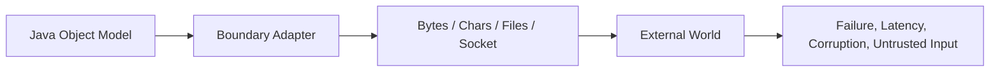
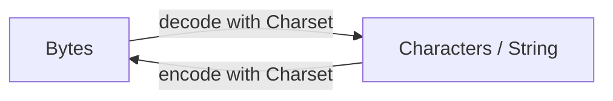
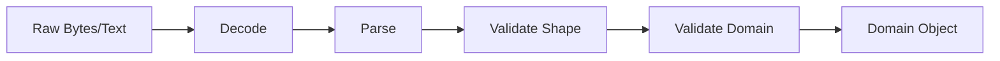
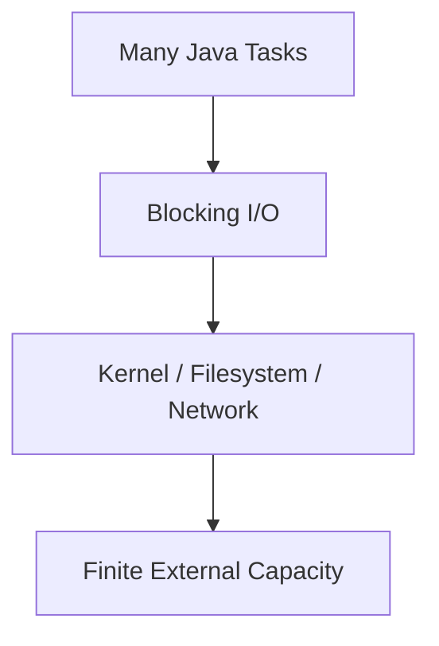
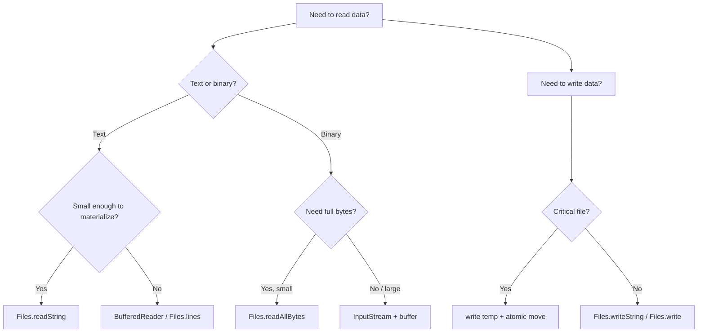
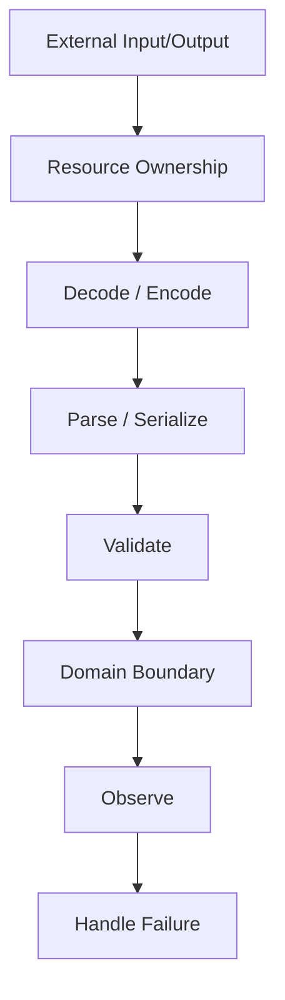

# Part 010 — I/O, NIO.2, Resources, Serialization, dan Data Boundaries

> Fokus part ini: memahami I/O bukan sebagai “cara baca file”, tetapi sebagai boundary antara program Java dan dunia luar. Boundary ini lambat, bisa gagal, tidak selalu trusted, perlu ditutup dengan benar, dan sering menjadi sumber bug production: file corrupt, encoding salah, resource leak, blocking thread, memory meledak, permission error, path traversal, dan deserialization vulnerability.

---

## 1. Posisi Part Ini dalam Framework Kaufman

Dalam 20 jam pertama, kita tidak perlu menghafal seluruh API `java.io` dan `java.nio.file`. Yang perlu dibangun adalah kemampuan melakukan operasi I/O dengan aman dan bisa dijelaskan.

Target performa part ini:

1. Bisa membedakan byte stream, character stream, buffer, file path, dan filesystem operation.
2. Bisa memakai `Path` dan `Files` sebagai default modern, bukan langsung `java.io.File`.
3. Bisa menutup resource dengan benar memakai try-with-resources.
4. Bisa memilih strategi baca/tulis file berdasarkan ukuran data.
5. Bisa menangani charset dan newline secara eksplisit.
6. Bisa mendesain data boundary yang valid, observable, dan secure.
7. Bisa menjelaskan kenapa Java native serialization sering tidak cocok untuk boundary modern.
8. Bisa membuat checklist production untuk file/input/output handling.

I/O adalah tempat di mana asumsi program diuji oleh realitas: disk penuh, network lambat, permission berubah, file dihapus saat dibaca, input corrupt, encoding tidak sesuai, dan dependency luar tidak bisa dipercaya.

---

## 2. Mental Model: I/O adalah Boundary, Bukan Utility

Saat code membaca file, menerima upload, membaca socket, menulis response, memuat config, atau memproses attachment, program sedang melewati boundary.

Boundary punya sifat:

- lebih lambat dari memory,
- bisa gagal kapan saja,
- datanya tidak selalu valid,
- datanya bisa sangat besar,
- datanya bisa malicious,
- resource-nya terbatas,
- harus diobservasi,
- harus punya timeout/cancellation jika terkait network,
- harus punya ownership lifecycle yang jelas.



Engineer yang matang tidak menulis:

```java
String content = Files.readString(path);
```

lalu berhenti. Ia bertanya:

- Seberapa besar file-nya?
- Charset-nya apa?
- Siapa yang mengontrol path?
- Apa yang terjadi kalau file tidak ada?
- Apa yang terjadi kalau permission ditolak?
- Apakah file bisa berubah saat dibaca?
- Apakah input perlu divalidasi?
- Apakah error perlu retry atau fail-fast?
- Apakah operasi ini boleh blocking?
- Apakah resource pasti ditutup?

---

## 3. Byte, Character, Charset, dan Encoding

Java membedakan byte dan character.

- Byte adalah data mentah: file binary, network payload, compressed data, encrypted data.
- Character adalah teks Unicode dalam model Java.
- Charset adalah aturan untuk mengubah byte menjadi character dan sebaliknya.



Contoh eksplisit:

```java
Path path = Path.of("message.txt");
String text = Files.readString(path, StandardCharsets.UTF_8);
```

Lebih baik daripada bergantung pada default jika boundary file harus stabil lintas environment.

### 3.1 Bug Encoding yang Umum

Bug umum:

- File dibuat UTF-8, dibaca sebagai charset lain.
- CSV dari Windows mengandung BOM atau line ending berbeda.
- Input mengandung karakter non-ASCII yang tidak diuji.
- Log/JSON rusak karena encoding tidak konsisten.

Rule:

> Untuk format teks yang Anda kontrol, jadikan UTF-8 sebagai kontrak eksplisit. Untuk format eksternal, deteksi/validasi sesuai spesifikasi input.

### 3.2 Newline

Newline bisa berbeda:

- Unix/Linux/macOS modern: `\n`
- Windows: `\r\n`

Untuk output human-readable lokal, `System.lineSeparator()` bisa masuk akal. Untuk protocol/file format, gunakan newline sesuai spesifikasi format, bukan OS default.

---

## 4. `java.io` vs `java.nio.file`

`java.io` adalah API lama yang masih penting. `java.nio.file` atau NIO.2 adalah API modern untuk file system operations.

Default modern untuk file path:

```java
Path path = Path.of("data", "input.txt");
```

Bukan:

```java
File file = new File("data/input.txt");
```

`File` masih ada, tetapi `Path` lebih kaya untuk operasi modern.

### 4.1 `Path`

`Path` merepresentasikan path dalam filesystem.

```java
Path base = Path.of("/app/data");
Path file = base.resolve("report.csv");
Path normalized = file.normalize();
```

Operasi penting:

```java
Path path = Path.of("/app/data/report.csv");

path.getFileName();     // report.csv
path.getParent();       // /app/data
path.isAbsolute();      // true/false
path.normalize();       // remove . and .. where possible
path.toAbsolutePath();
```

Jangan menyamakan normalize dengan security check penuh. Untuk input path dari user, perlu validasi bahwa hasil resolve tetap berada di base directory yang diizinkan.

Contoh defensive path resolution:

```java
static Path safeResolve(Path baseDir, String userInput) throws IOException {
    Path base = baseDir.toRealPath();
    Path resolved = base.resolve(userInput).normalize().toRealPath();

    if (!resolved.startsWith(base)) {
        throw new SecurityException("Path escapes base directory");
    }

    return resolved;
}
```

Catatan: `toRealPath()` membutuhkan file ada dan akan menyelesaikan symbolic link. Untuk flow create-new-file, strategi validasi bisa berbeda.

### 4.2 `Files`

`Files` adalah utility utama untuk operasi file.

Contoh:

```java
Path path = Path.of("data.txt");

boolean exists = Files.exists(path);
boolean regularFile = Files.isRegularFile(path);
long size = Files.size(path);
String content = Files.readString(path, StandardCharsets.UTF_8);
```

Operasi umum:

| Operasi | API |
|---|---|
| baca semua byte | `Files.readAllBytes(path)` |
| baca string | `Files.readString(path, charset)` |
| baca lines | `Files.readAllLines(path, charset)` |
| streaming lines | `Files.lines(path, charset)` |
| tulis string | `Files.writeString(path, text, charset)` |
| copy | `Files.copy(source, target)` |
| move | `Files.move(source, target)` |
| delete | `Files.delete(path)` |
| create directories | `Files.createDirectories(path)` |
| walk tree | `Files.walk(path)` |

---

## 5. Stream I/O: InputStream dan OutputStream

`InputStream` dan `OutputStream` bekerja dengan byte.

Gunakan untuk:

- binary file,
- upload/download,
- compressed stream,
- encrypted stream,
- socket payload,
- data yang belum tentu teks.

Contoh copy manual:

```java
static long copy(InputStream in, OutputStream out) throws IOException {
    byte[] buffer = new byte[8192];
    long total = 0;

    int read;
    while ((read = in.read(buffer)) != -1) {
        out.write(buffer, 0, read);
        total += read;
    }

    return total;
}
```

Namun untuk file-to-file, gunakan API yang sudah ada:

```java
Files.copy(source, target, StandardCopyOption.REPLACE_EXISTING);
```

### 5.1 Buffering

Tanpa buffer, operasi bisa terlalu sering memanggil sistem operasi atau underlying resource.

```java
try (InputStream in = new BufferedInputStream(Files.newInputStream(path))) {
    // read efficiently
}
```

Untuk output:

```java
try (OutputStream out = new BufferedOutputStream(Files.newOutputStream(path))) {
    out.write(data);
}
```

Buffer bukan magic. Buffer membantu mengurangi overhead call kecil berulang. Ukuran buffer harus masuk akal dan bisa diukur jika performance penting.

---

## 6. Reader dan Writer: Character I/O

`Reader` dan `Writer` bekerja dengan character.

Gunakan saat data adalah teks.

```java
try (BufferedReader reader = Files.newBufferedReader(path, StandardCharsets.UTF_8)) {
    String line;
    while ((line = reader.readLine()) != null) {
        process(line);
    }
}
```

Untuk tulis teks:

```java
try (BufferedWriter writer = Files.newBufferedWriter(path, StandardCharsets.UTF_8)) {
    writer.write("hello");
    writer.newLine();
}
```

Jangan membaca teks melalui byte lalu membuat `new String(bytes)` tanpa charset eksplisit jika format butuh stabil.

Buruk:

```java
String text = new String(Files.readAllBytes(path));
```

Lebih baik:

```java
String text = Files.readString(path, StandardCharsets.UTF_8);
```

---

## 7. Resource Lifecycle dan Try-With-Resources

Resource seperti file handle, socket, stream, reader, writer harus ditutup.

Manual close rawan bug:

```java
InputStream in = Files.newInputStream(path);
try {
    return in.readAllBytes();
} finally {
    in.close();
}
```

Lebih baik:

```java
try (InputStream in = Files.newInputStream(path)) {
    return in.readAllBytes();
}
```

Try-with-resources menutup resource yang mengimplementasikan `AutoCloseable`.

### 7.1 Urutan Close

Jika ada beberapa resource, resource ditutup dalam urutan kebalikan dari deklarasi.

```java
try (InputStream in = Files.newInputStream(input);
     OutputStream out = Files.newOutputStream(output)) {
    in.transferTo(out);
}
```

`out` ditutup dulu, lalu `in`.

### 7.2 Suppressed Exceptions

Jika body try melempar exception dan close juga melempar exception, exception dari close bisa menjadi suppressed exception.

```java
try {
    runIoOperation();
} catch (IOException e) {
    for (Throwable suppressed : e.getSuppressed()) {
        log.warn("Suppressed while closing resource", suppressed);
    }
    throw e;
}
```

Dalam production incident, suppressed exception bisa memberi petunjuk bahwa failure terjadi saat cleanup juga.

---

## 8. Membaca File: Small, Medium, Large

Strategi baca file harus mengikuti ukuran dan kebutuhan.

### 8.1 Small File

Jika file kecil dan memang harus dimaterialisasi:

```java
String content = Files.readString(path, StandardCharsets.UTF_8);
```

Atau:

```java
byte[] bytes = Files.readAllBytes(path);
```

Cocok untuk:

- config kecil,
- template kecil,
- test fixture,
- metadata file.

### 8.2 Medium Text File per Line

Jika ingin proses line-by-line:

```java
try (BufferedReader reader = Files.newBufferedReader(path, StandardCharsets.UTF_8)) {
    String line;
    while ((line = reader.readLine()) != null) {
        process(line);
    }
}
```

### 8.3 Large File

Untuk file besar, hindari `readAllBytes`, `readString`, atau `readAllLines`.

Gunakan streaming:

```java
try (Stream<String> lines = Files.lines(path, StandardCharsets.UTF_8)) {
    lines.filter(line -> !line.isBlank())
         .map(Parser::parse)
         .forEach(this::process);
}
```

Penting: stream dari `Files.lines` harus ditutup. Karena itu gunakan try-with-resources.

Untuk binary large file:

```java
try (InputStream in = new BufferedInputStream(Files.newInputStream(path))) {
    byte[] buffer = new byte[64 * 1024];
    int read;
    while ((read = in.read(buffer)) != -1) {
        process(buffer, read);
    }
}
```

---

## 9. Menulis File dengan Aman

Menulis file tampak sederhana, tetapi production-safe write butuh memikirkan partial write.

Buruk:

```java
Files.writeString(target, content, StandardCharsets.UTF_8);
```

Ini cukup untuk banyak kasus sederhana. Tetapi jika target adalah file penting, pertimbangkan atomic replace pattern.

### 9.1 Atomic Replace Pattern

```java
static void writeAtomically(Path target, String content) throws IOException {
    Path directory = target.toAbsolutePath().getParent();
    Path temp = Files.createTempFile(directory, target.getFileName().toString(), ".tmp");

    try {
        Files.writeString(temp, content, StandardCharsets.UTF_8,
                StandardOpenOption.TRUNCATE_EXISTING);
        Files.move(temp, target,
                StandardCopyOption.REPLACE_EXISTING,
                StandardCopyOption.ATOMIC_MOVE);
    } catch (IOException e) {
        try {
            Files.deleteIfExists(temp);
        } catch (IOException cleanupFailure) {
            e.addSuppressed(cleanupFailure);
        }
        throw e;
    }
}
```

Catatan:

- `ATOMIC_MOVE` bisa tidak didukung oleh semua filesystem/provider.
- Temp file sebaiknya berada pada filesystem yang sama agar move bisa atomic.
- Untuk durability kuat, topik fsync perlu dipertimbangkan, tetapi itu di luar kebutuhan awal kebanyakan aplikasi.

### 9.2 Open Options

`Files.writeString` dan `Files.newOutputStream` bisa memakai `StandardOpenOption`:

- `CREATE`
- `CREATE_NEW`
- `TRUNCATE_EXISTING`
- `APPEND`
- `WRITE`
- `SYNC`
- `DSYNC`

Contoh create-only:

```java
Files.writeString(path, content, StandardCharsets.UTF_8,
        StandardOpenOption.CREATE_NEW);
```

Ini gagal jika file sudah ada, sehingga cocok untuk mencegah overwrite tidak sengaja.

---

## 10. File Tree Walking

Untuk traversal directory:

```java
try (Stream<Path> paths = Files.walk(root)) {
    paths.filter(Files::isRegularFile)
         .forEach(this::processFile);
}
```

`Files.walk` juga menghasilkan stream yang perlu ditutup.

Untuk kontrol lebih detail, gunakan `Files.walkFileTree`.

```java
Files.walkFileTree(root, new SimpleFileVisitor<>() {
    @Override
    public FileVisitResult visitFile(Path file, BasicFileAttributes attrs) throws IOException {
        processFile(file);
        return FileVisitResult.CONTINUE;
    }

    @Override
    public FileVisitResult visitFileFailed(Path file, IOException exc) throws IOException {
        log.warn("Cannot visit file {}", file, exc);
        return FileVisitResult.CONTINUE;
    }
});
```

Gunakan `walkFileTree` ketika:

- perlu error handling per file,
- perlu kontrol depth,
- perlu skip subtree,
- perlu delete recursive dengan benar,
- perlu follow link policy eksplisit.

---

## 11. Watch Service

`WatchService` bisa memantau perubahan directory.

```java
try (WatchService watchService = FileSystems.getDefault().newWatchService()) {
    Path dir = Path.of("/app/inbox");
    dir.register(watchService,
            StandardWatchEventKinds.ENTRY_CREATE,
            StandardWatchEventKinds.ENTRY_MODIFY,
            StandardWatchEventKinds.ENTRY_DELETE);

    while (!Thread.currentThread().isInterrupted()) {
        WatchKey key = watchService.take();

        for (WatchEvent<?> event : key.pollEvents()) {
            WatchEvent.Kind<?> kind = event.kind();
            Path changed = (Path) event.context();
            handle(kind, dir.resolve(changed));
        }

        if (!key.reset()) {
            break;
        }
    }
}
```

Production caveats:

- Event bisa coalesced.
- Overflow bisa terjadi.
- Behavior tergantung filesystem/platform.
- Jangan jadikan satu-satunya mekanisme correctness untuk ingestion penting.
- Untuk workflow kritikal, kombinasikan dengan periodic reconciliation scan.

---

## 12. Temporary Files dan Cleanup

Temporary file sering dipakai untuk upload processing, report generation, atomic write, dan intermediate transform.

```java
Path temp = Files.createTempFile("upload-", ".tmp");
try {
    process(temp);
} finally {
    Files.deleteIfExists(temp);
}
```

Untuk directory:

```java
Path tempDir = Files.createTempDirectory("job-");
try {
    runJob(tempDir);
} finally {
    deleteRecursively(tempDir);
}
```

Recursive delete:

```java
static void deleteRecursively(Path root) throws IOException {
    if (!Files.exists(root)) {
        return;
    }

    Files.walkFileTree(root, new SimpleFileVisitor<>() {
        @Override
        public FileVisitResult visitFile(Path file, BasicFileAttributes attrs) throws IOException {
            Files.delete(file);
            return FileVisitResult.CONTINUE;
        }

        @Override
        public FileVisitResult postVisitDirectory(Path dir, IOException exc) throws IOException {
            if (exc != null) {
                throw exc;
            }
            Files.delete(dir);
            return FileVisitResult.CONTINUE;
        }
    });
}
```

Rule:

> Setiap temporary resource harus punya owner dan cleanup path yang jelas.

---

## 13. Data Boundary Design

I/O code sebaiknya tidak tersebar di business logic. Buat boundary adapter.

Buruk:

```java
class CaseService {
    void importCases(Path path) throws IOException {
        List<String> lines = Files.readAllLines(path);
        for (String line : lines) {
            String[] columns = line.split(",");
            // business logic bercampur parsing dan file access
        }
    }
}
```

Lebih baik:

```java
interface CaseImportSource {
    Stream<ImportedCaseRow> rows() throws IOException;
}

final class CsvCaseImportSource implements CaseImportSource {
    private final Path path;

    CsvCaseImportSource(Path path) {
        this.path = path;
    }

    @Override
    public Stream<ImportedCaseRow> rows() throws IOException {
        Stream<String> lines = Files.lines(path, StandardCharsets.UTF_8);
        return lines.skip(1).map(this::parse);
    }

    private ImportedCaseRow parse(String line) {
        // parsing detail here
        return ImportedCaseRow.from(line);
    }
}
```

Namun desain di atas punya masalah lifecycle: stream harus ditutup oleh caller. Itu harus dibuat eksplisit.

Alternatif callback-style:

```java
final class CsvCaseImportSource {
    private final Path path;

    CsvCaseImportSource(Path path) {
        this.path = path;
    }

    public void forEachRow(Consumer<ImportedCaseRow> consumer) throws IOException {
        try (Stream<String> lines = Files.lines(path, StandardCharsets.UTF_8)) {
            lines.skip(1)
                 .map(this::parse)
                 .forEach(consumer);
        }
    }

    private ImportedCaseRow parse(String line) {
        return ImportedCaseRow.from(line);
    }
}
```

Trade-off:

- Returning stream gives composition flexibility but exposes lifecycle responsibility.
- Callback contains lifecycle but can be less composable.

Top-tier engineer membuat ownership terlihat dalam API.

---

## 14. Input Validation dan Error Taxonomy

Input eksternal harus divalidasi sebelum masuk domain.

Buat lapisan:



Pisahkan error:

| Error | Contoh | Respons |
|---|---|---|
| transport/file error | file missing, permission denied | infrastructure error |
| decoding error | invalid UTF-8 | invalid input |
| parsing error | malformed CSV/JSON | invalid input with location |
| schema error | required column missing | reject batch |
| domain error | invalid transition | reject row/domain command |
| partial processing error | some rows invalid | report per-row result |

Contoh result model:

```java
sealed interface ImportResult permits ImportResult.Success, ImportResult.Failure {
    record Success(int importedRows) implements ImportResult {}
    record Failure(List<ImportError> errors) implements ImportResult {}
}

record ImportError(int lineNumber, String code, String message) {}
```

Dengan model seperti ini, boundary tidak melempar exception untuk semua invalid data. Exception dipakai untuk kegagalan mekanisme, bukan seluruh variasi data invalid.

---

## 15. Serialization: Jangan Disamakan dengan Data Interchange Modern

Serialization berarti mengubah object menjadi bentuk yang bisa disimpan atau dikirim, lalu dibaca kembali.

Ada banyak bentuk:

- Java native serialization,
- JSON,
- XML,
- CSV,
- Protocol Buffers,
- Avro,
- MessagePack,
- custom binary format,
- database row mapping.

Java native serialization (`Serializable`, `ObjectOutputStream`, `ObjectInputStream`) adalah mekanisme lama untuk object graph Java. Ia punya banyak caveat:

- mengikat data ke class Java,
- rawan compatibility issue,
- sulit diamankan untuk input tidak trusted,
- bisa menyebabkan object dibuat tanpa constructor normal,
- pernah menjadi sumber banyak vulnerability deserialization,
- tidak ideal untuk API boundary modern.

Rule praktis:

> Jangan gunakan Java native serialization untuk input dari pihak tidak trusted. Untuk boundary service/data modern, pilih format eksplisit seperti JSON/Protobuf/Avro sesuai kebutuhan.

### 15.1 Contoh Native Serialization

```java
record UserSnapshot(String id, String email) implements Serializable {}

static void write(Path path, UserSnapshot snapshot) throws IOException {
    try (ObjectOutputStream out = new ObjectOutputStream(Files.newOutputStream(path))) {
        out.writeObject(snapshot);
    }
}

static UserSnapshot read(Path path) throws IOException, ClassNotFoundException {
    try (ObjectInputStream in = new ObjectInputStream(Files.newInputStream(path))) {
        return (UserSnapshot) in.readObject();
    }
}
```

Contoh ini sederhana, tetapi tidak otomatis cocok untuk production boundary.

### 15.2 `serialVersionUID`

`serialVersionUID` dipakai untuk versioning class serializable.

```java
final class LegacyUser implements Serializable {
    private static final long serialVersionUID = 1L;

    private final String id;
    private final String email;

    LegacyUser(String id, String email) {
        this.id = id;
        this.email = email;
    }
}
```

Jika Anda harus memakai native serialization, definisikan serial form secara sadar dan dokumentasikan compatibility rules.

### 15.3 Serialization Proxy Pattern

Untuk class penting, serialization proxy dapat mengurangi risiko invariant rusak.

```java
final class Money implements Serializable {
    private final String currency;
    private final long minorUnits;

    Money(String currency, long minorUnits) {
        if (currency == null || currency.length() != 3) {
            throw new IllegalArgumentException("Invalid currency");
        }
        this.currency = currency;
        this.minorUnits = minorUnits;
    }

    private Object writeReplace() {
        return new SerializationProxy(currency, minorUnits);
    }

    private void readObject(ObjectInputStream stream) throws InvalidObjectException {
        throw new InvalidObjectException("Use serialization proxy");
    }

    private static final class SerializationProxy implements Serializable {
        private static final long serialVersionUID = 1L;

        private final String currency;
        private final long minorUnits;

        SerializationProxy(String currency, long minorUnits) {
            this.currency = currency;
            this.minorUnits = minorUnits;
        }

        private Object readResolve() {
            return new Money(currency, minorUnits);
        }
    }
}
```

Tetap: pattern ini berguna untuk legacy/native serialization, bukan alasan untuk memakai native serialization di boundary baru.

---

## 16. JSON/CSV/Binary Boundary: Prinsip Umum

Seri ini belum masuk library spesifik seperti Jackson, Gson, Protobuf, Avro, atau Jakarta JSON Binding. Tetapi prinsip boundary-nya sama.

### 16.1 Jangan Parse Langsung ke Entity Internal

Buruk:

```java
// External payload langsung menjadi entity persistence/domain internal
OrderEntity entity = objectMapper.readValue(json, OrderEntity.class);
```

Lebih baik:

```java
OrderRequest request = objectMapper.readValue(json, OrderRequest.class);
OrderCommand command = request.toCommand();
Order order = orderService.create(command);
```

Boundary DTO dan domain model sebaiknya dipisahkan.

### 16.2 Versioning

Input/output format perlu evolusi:

- field baru,
- field deprecated,
- enum value baru,
- optional field,
- default value,
- backward compatibility,
- forward compatibility.

Jangan membuat parser terlalu rapuh jika data bisa datang dari versi berbeda. Tetapi jangan juga menerima data invalid diam-diam.

### 16.3 Size Limit

Boundary harus punya limit:

- max file size,
- max line length,
- max JSON depth,
- max number of rows,
- max decompressed size,
- max attachment count,
- timeout.

Tanpa limit, input bisa menjadi denial-of-service vector.

---

## 17. Handling Large Files dan Memory Safety

Anti-pattern:

```java
List<String> lines = Files.readAllLines(hugeFile);
```

Untuk file besar, gunakan streaming dan batch processing.

```java
final class BatchImporter {
    private static final int BATCH_SIZE = 1_000;

    void importFile(Path path) throws IOException {
        List<Row> batch = new ArrayList<>(BATCH_SIZE);

        try (BufferedReader reader = Files.newBufferedReader(path, StandardCharsets.UTF_8)) {
            String line;
            int lineNumber = 0;

            while ((line = reader.readLine()) != null) {
                lineNumber++;
                batch.add(parse(lineNumber, line));

                if (batch.size() == BATCH_SIZE) {
                    persist(batch);
                    batch.clear();
                }
            }
        }

        if (!batch.isEmpty()) {
            persist(batch);
        }
    }

    private Row parse(int lineNumber, String line) {
        return new Row(lineNumber, line);
    }

    private void persist(List<Row> rows) {
        // write batch
    }
}

record Row(int lineNumber, String content) {}
```

Memory rule:

> Jangan biarkan ukuran input eksternal menentukan ukuran object graph di heap tanpa kontrol.

---

## 18. Blocking, Threads, dan I/O

File I/O dan network I/O bisa blocking. Dalam Java sebelum virtual threads, blocking operation yang banyak dapat menghabiskan platform threads. Dengan virtual threads, blocking menjadi lebih murah untuk banyak workload, tetapi resource di bawahnya tetap terbatas.

Hal yang tetap perlu dikontrol:

- file descriptor,
- database connection,
- network connection,
- disk throughput,
- downstream service limit,
- queue size,
- backpressure.

Virtual threads tidak membuat disk lebih cepat dan tidak membuat external system punya kapasitas tak terbatas.



Untuk part ini, cukup pegang prinsip:

- I/O bisa blocking.
- Blocking harus punya ownership thread model.
- External resource harus punya limit.
- Queue harus bounded jika digunakan untuk buffering.

---

## 19. File System Failure Modes

I/O code harus menganggap failure sebagai normal.

Failure umum:

| Failure | Contoh |
|---|---|
| not found | file sudah dihapus |
| permission denied | user/process tidak punya akses |
| already exists | create file race |
| disk full | write gagal di tengah |
| path invalid | karakter/path tidak valid |
| symbolic link issue | path keluar dari base dir |
| file locked | OS/proses lain memegang file |
| partial write | process crash saat menulis |
| corrupt input | file tidak sesuai format |
| encoding mismatch | decode gagal atau teks rusak |
| concurrent modification | file berubah saat diproses |

Contoh error handling:

```java
try {
    importFile(path);
} catch (NoSuchFileException e) {
    throw new ImportException("Input file does not exist: " + path, e);
} catch (AccessDeniedException e) {
    throw new ImportException("Cannot access input file: " + path, e);
} catch (MalformedInputException e) {
    throw new ImportException("Input file is not valid UTF-8: " + path, e);
} catch (IOException e) {
    throw new ImportException("I/O failure while importing: " + path, e);
}
```

Jangan selalu menangkap `IOException` sebagai satu pesan generik jika operasi perlu diagnosa production yang jelas.

---

## 20. Path Traversal dan Security

Jika user bisa memberi nama file/path, path traversal adalah risiko.

Input berbahaya:

```text
../../etc/passwd
```

Buruk:

```java
Path file = uploadDir.resolve(userFileName);
Files.readString(file);
```

Lebih aman:

```java
static Path resolveUserFile(Path baseDir, String userFileName) throws IOException {
    if (userFileName.contains("/") || userFileName.contains("\\")) {
        throw new IllegalArgumentException("File name must not contain path separators");
    }

    Path base = baseDir.toRealPath();
    Path resolved = base.resolve(userFileName).normalize();

    if (!resolved.startsWith(base)) {
        throw new SecurityException("Invalid path");
    }

    return resolved;
}
```

Tambahan:

- Jangan percaya file extension saja.
- Validasi content type jika relevan.
- Batasi ukuran upload.
- Simpan file upload dengan generated server-side name.
- Jangan mengeksekusi file upload.
- Jangan deserialize object dari input tidak trusted.

---

## 21. Observability untuk I/O

I/O harus observable karena failure sering ada di boundary.

Log yang berguna:

- operation type,
- logical resource id,
- path aman atau sanitized,
- size,
- duration,
- row count,
- error category,
- retry count,
- correlation id.

Jangan log:

- full sensitive path jika mengandung tenant/user secret,
- file content sensitif,
- raw payload PII,
- credentials,
- token,
- private key.

Contoh:

```java
long start = System.nanoTime();
try {
    ImportResult result = importer.importFile(path);
    long durationMs = Duration.ofNanos(System.nanoTime() - start).toMillis();
    log.info("case_import_completed file={} rows={} durationMs={}",
            safeFileName(path), result.importedRows(), durationMs);
} catch (ImportException e) {
    long durationMs = Duration.ofNanos(System.nanoTime() - start).toMillis();
    log.warn("case_import_failed file={} durationMs={} reason={}",
            safeFileName(path), durationMs, e.getMessage(), e);
    throw e;
}
```

---

## 22. Testing I/O Code

Testing I/O code perlu menguji lebih dari happy path.

JUnit 5 menyediakan `@TempDir` untuk temporary directory.

```java
class ImporterTest {
    @TempDir
    Path tempDir;

    @Test
    void importsValidFile() throws IOException {
        Path file = tempDir.resolve("cases.csv");
        Files.writeString(file, "id,status\nC-1,DRAFT\n", StandardCharsets.UTF_8);

        ImportResult result = new Importer().importFile(file);

        assertEquals(1, result.importedRows());
    }
}
```

Test cases penting:

- file tidak ada,
- file kosong,
- header salah,
- encoding invalid,
- baris terlalu panjang,
- kolom kurang/lebih,
- duplicate row,
- partial invalid rows,
- permission denied jika feasible,
- large file simulation,
- cleanup temp file,
- path traversal attempt.

Untuk I/O, test fixture harus jelas dan kecil. Untuk large file, generate programmatically agar repository tidak berat.

---

## 23. API Design untuk I/O Service

Buruk:

```java
public void importFile(String path) throws Exception;
```

Masalah:

- `String` tidak menyatakan filesystem path dengan kuat.
- `Exception` terlalu umum.
- Tidak jelas hasilnya.
- Tidak jelas partial failure.
- Tidak jelas ownership validasi.

Lebih baik:

```java
public ImportResult importCases(Path path) throws ImportIoException;
```

Atau untuk boundary upload:

```java
public ImportResult importCases(InputStream input, ImportOptions options) throws ImportIoException;
```

Pertimbangan:

| Parameter | Cocok ketika |
|---|---|
| `Path` | service bertanggung jawab membaca file lokal |
| `InputStream` | source bisa upload/network/memory dan caller mengelola stream |
| `Reader` | data sudah didecode sebagai text |
| `byte[]` | data kecil dan sudah materialized |
| `Stream<String>` | line source lazy, tetapi lifecycle harus jelas |

Jika method menerima `InputStream`, dokumentasikan siapa yang menutup stream. Biasanya yang membuat resource adalah yang menutup resource, kecuali API eksplisit mengambil ownership.

---

## 24. Mini Project: Case Import Boundary

Tujuan mini project: membuat import CSV yang production-aware.

### 24.1 Requirements

- Input file UTF-8.
- Header wajib: `case_id,status,submitted_at`.
- Maksimum 100.000 rows.
- Maksimum panjang line 10.000 characters.
- Invalid row dikumpulkan sebagai error.
- Jika header invalid, reject batch.
- Jika lebih dari 1.000 row invalid, stop processing.
- Result berisi imported count dan error list.
- File dibaca streaming.

### 24.2 Model

```java
record CaseImportOptions(int maxRows, int maxErrors, int maxLineLength) {
    static CaseImportOptions defaults() {
        return new CaseImportOptions(100_000, 1_000, 10_000);
    }
}

sealed interface CaseImportResult permits CaseImportResult.Success, CaseImportResult.Failure {
    record Success(int importedRows) implements CaseImportResult {}
    record Failure(int importedRows, List<CaseImportError> errors) implements CaseImportResult {}
}

record CaseImportError(int lineNumber, String code, String message) {}
record ImportedCase(String caseId, String status, Instant submittedAt) {}
```

### 24.3 Importer Skeleton

```java
final class CaseCsvImporter {
    private final CaseImportOptions options;

    CaseCsvImporter(CaseImportOptions options) {
        this.options = options;
    }

    CaseImportResult importFile(Path path) throws IOException {
        List<CaseImportError> errors = new ArrayList<>();
        int imported = 0;
        int lineNumber = 0;

        try (BufferedReader reader = Files.newBufferedReader(path, StandardCharsets.UTF_8)) {
            String header = reader.readLine();
            lineNumber++;

            if (!"case_id,status,submitted_at".equals(header)) {
                return new CaseImportResult.Failure(0,
                        List.of(new CaseImportError(1, "INVALID_HEADER", "Unexpected CSV header")));
            }

            String line;
            while ((line = reader.readLine()) != null) {
                lineNumber++;

                if (lineNumber > options.maxRows() + 1) {
                    errors.add(new CaseImportError(lineNumber, "TOO_MANY_ROWS", "Maximum row count exceeded"));
                    break;
                }

                if (line.length() > options.maxLineLength()) {
                    errors.add(new CaseImportError(lineNumber, "LINE_TOO_LONG", "Line exceeds maximum length"));
                    if (errors.size() >= options.maxErrors()) {
                        break;
                    }
                    continue;
                }

                try {
                    ImportedCase importedCase = parse(lineNumber, line);
                    persist(importedCase);
                    imported++;
                } catch (IllegalArgumentException e) {
                    errors.add(new CaseImportError(lineNumber, "INVALID_ROW", e.getMessage()));
                    if (errors.size() >= options.maxErrors()) {
                        break;
                    }
                }
            }
        }

        if (errors.isEmpty()) {
            return new CaseImportResult.Success(imported);
        }
        return new CaseImportResult.Failure(imported, List.copyOf(errors));
    }

    private ImportedCase parse(int lineNumber, String line) {
        String[] parts = line.split(",", -1);
        if (parts.length != 3) {
            throw new IllegalArgumentException("Expected 3 columns");
        }
        if (parts[0].isBlank()) {
            throw new IllegalArgumentException("case_id is required");
        }
        return new ImportedCase(parts[0], parts[1], Instant.parse(parts[2]));
    }

    private void persist(ImportedCase importedCase) {
        // persist or hand off to application service
    }
}
```

Catatan: CSV parsing real-world lebih rumit daripada `split(",")` karena quoting, escaping, multiline field, dan delimiter rules. Untuk production CSV, gunakan parser CSV matang. Skeleton ini untuk mental model boundary.

---

## 25. Decision Matrix I/O



---

## 26. Practice: 20-Hour Drill untuk Part Ini

| Waktu | Latihan | Fokus |
|---:|---|---|
| 30 menit | Baca/tulis small text file UTF-8 | basic API |
| 45 menit | Baca file line-by-line dengan `BufferedReader` | streaming text |
| 45 menit | Baca binary file dengan buffer | byte stream |
| 60 menit | Implement atomic write pattern | partial write safety |
| 60 menit | Buat safe path resolver dan test traversal | security |
| 90 menit | Implement CSV importer skeleton | data boundary |
| 60 menit | Tambahkan error taxonomy | diagnosability |
| 60 menit | Tambahkan `@TempDir` tests | testability |
| 60 menit | Refactor importer agar domain logic tidak tahu file | architecture boundary |
| 60 menit | Tambahkan observability log/metrics points | production readiness |

---

## 27. Code Review Checklist

Gunakan checklist ini saat review I/O code:

- Apakah charset eksplisit untuk text boundary?
- Apakah file besar diproses streaming, bukan dimuat seluruhnya?
- Apakah stream/reader/writer ditutup dengan try-with-resources?
- Apakah `Files.lines`/`Files.walk` stream ditutup?
- Apakah path dari user divalidasi terhadap traversal?
- Apakah temporary file punya cleanup path?
- Apakah write penting aman terhadap partial write?
- Apakah error taxonomy cukup diagnostik?
- Apakah input external divalidasi sebelum masuk domain?
- Apakah size limit diterapkan?
- Apakah data sensitif tidak masuk log?
- Apakah native serialization dihindari untuk untrusted input?
- Apakah ownership resource jelas di API?
- Apakah test mencakup failure modes?

---

## 28. Kesalahan Umum dan Perbaikannya

### Kesalahan 1: Membaca File Besar ke Memory

Buruk:

```java
List<String> lines = Files.readAllLines(path);
```

Baik:

```java
try (BufferedReader reader = Files.newBufferedReader(path, StandardCharsets.UTF_8)) {
    String line;
    while ((line = reader.readLine()) != null) {
        process(line);
    }
}
```

### Kesalahan 2: Tidak Menutup Stream dari `Files.lines`

Buruk:

```java
Files.lines(path).forEach(this::process);
```

Baik:

```java
try (Stream<String> lines = Files.lines(path, StandardCharsets.UTF_8)) {
    lines.forEach(this::process);
}
```

### Kesalahan 3: Charset Implisit

Buruk:

```java
String text = Files.readString(path);
```

Bisa diterima untuk local/simple case, tetapi untuk boundary kontraktual lebih baik:

```java
String text = Files.readString(path, StandardCharsets.UTF_8);
```

### Kesalahan 4: Native Serialization untuk External Input

Buruk:

```java
ObjectInputStream in = new ObjectInputStream(request.getInputStream());
Object object = in.readObject();
```

Lebih aman:

- gunakan format eksplisit,
- validasi schema,
- batasi ukuran,
- parse ke DTO,
- konversi ke command/domain object.

### Kesalahan 5: Path User Langsung Di-resolve

Buruk:

```java
Path target = baseDir.resolve(userInput);
```

Baik:

```java
Path target = resolveUserFile(baseDir, userInput);
```

---

## 29. Mental Model Akhir



Urutan berpikir yang benar:

1. Tentukan data boundary-nya.
2. Tentukan byte atau character.
3. Tentukan charset jika text.
4. Tentukan ukuran dan strategi streaming/materialization.
5. Tentukan ownership resource.
6. Tentukan error taxonomy.
7. Validasi sebelum masuk domain.
8. Tambahkan observability.
9. Test failure modes.

---

## 30. Ringkasan

I/O adalah titik pertemuan Java dengan dunia luar. Karena itu, I/O harus diperlakukan sebagai boundary yang bisa gagal, lambat, tidak trusted, dan terbatas.

Gunakan `Path` dan `Files` sebagai default modern untuk file system operation. Gunakan byte stream untuk binary data, reader/writer untuk text data, charset eksplisit untuk boundary stabil, dan try-with-resources untuk resource lifecycle. Hindari membaca file besar seluruhnya ke memory. Gunakan streaming dan batching.

Untuk serialization, jangan otomatis memilih Java native serialization. Untuk boundary modern, format eksplisit seperti JSON, Protobuf, Avro, CSV, atau format domain-specific biasanya lebih dapat dikontrol dan lebih aman. Native serialization hanya layak jika benar-benar legacy/internal/trusted dan compatibility/security-nya dipahami.

Rule paling penting:

- Boundary harus eksplisit.
- Resource harus ditutup.
- Charset harus jelas.
- Input harus divalidasi.
- Ukuran harus dibatasi.
- Failure harus didesain, bukan ditangkap generik.
- Data external tidak boleh langsung masuk domain tanpa parsing dan validasi.
- Serialization format adalah kontrak evolusi jangka panjang.

---

## Referensi

- Oracle Java SE 25 API — `java.nio.file.Files`: https://docs.oracle.com/en/java/javase/25/docs/api/java.base/java/nio/file/Files.html
- Oracle Java SE 25 API — `java.nio.file.Path`: https://docs.oracle.com/en/java/javase/25/docs/api/java.base/java/nio/file/Path.html
- Oracle Java SE 25 API — `java.io.InputStream`: https://docs.oracle.com/en/java/javase/25/docs/api/java.base/java/io/InputStream.html
- Oracle Java SE 25 API — `java.io.Reader`: https://docs.oracle.com/en/java/javase/25/docs/api/java.base/java/io/Reader.html
- Oracle Java SE 25 API — `java.io.File`: https://docs.oracle.com/en/java/javase/25/docs/api/java.base/java/io/File.html
- Oracle Java SE 21 Serialization Specification: https://docs.oracle.com/en/java/javase/21/docs/specs/serialization/index.html
- Oracle Secure Coding Guidelines for Java SE: https://www.oracle.com/java/technologies/javase/seccodeguide.html
