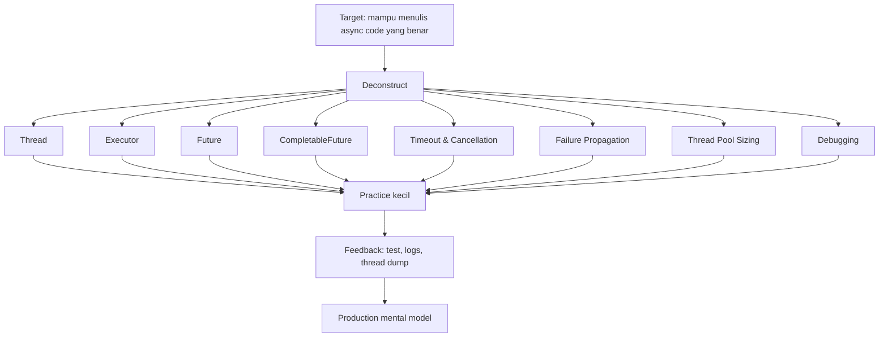
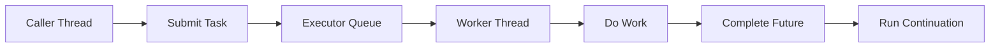
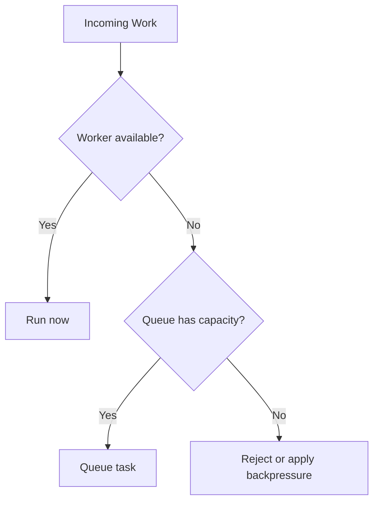
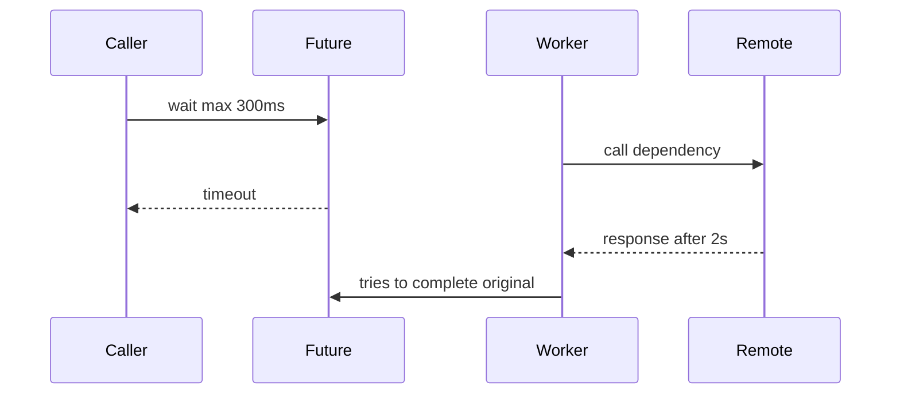
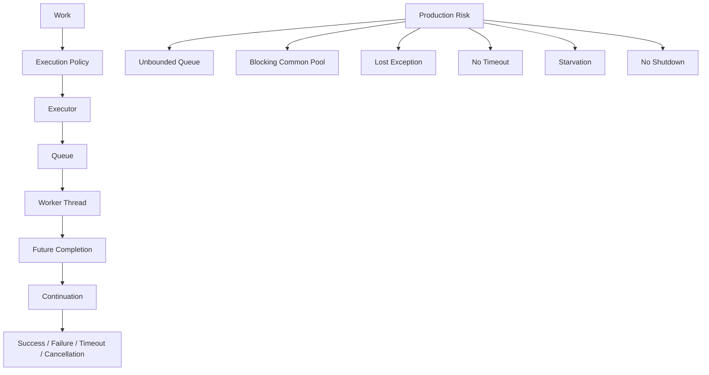

# Part 011 — Baseline Concurrency: Thread, Executor, Future, CompletableFuture

> **Tujuan part ini:** membangun mental model concurrency Java 8 yang cukup kuat untuk membaca, menulis, men-debug, dan mereview asynchronous code secara aman sebelum masuk ke virtual threads, structured concurrency, atau reactive programming.

Part ini adalah titik transisi dari “Java sebagai bahasa” ke “Java sebagai runtime eksekusi”. Di Java, concurrency bukan sekadar `new Thread(...)`. Begitu code berjalan paralel atau asynchronous, kita mulai berurusan dengan scheduling, queueing, visibility, ordering, cancellation, timeout, saturation, context propagation, dan failure propagation.

Banyak engineer bisa memakai `CompletableFuture`, tetapi tidak bisa menjelaskan:

- executor mana yang menjalankan stage tertentu,
- kapan task benar-benar mulai berjalan,
- apa yang terjadi kalau thread pool penuh,
- apakah exception akan terlihat atau hilang,
- apakah cancellation menghentikan pekerjaan aktual,
- mengapa `.join()` bisa menyebabkan starvation,
- mengapa `parallelStream()` atau `commonPool()` bisa membuat service lambat secara misterius.

Part ini membangun fondasi tersebut.

---

## 1. Posisi dalam Framework Kaufman

Dalam kerangka *The First 20 Hours*, concurrency harus dipelajari sebagai sub-skill yang bisa dipraktikkan, bukan sebagai teori abstrak.



Target performa untuk part ini:

> Dalam 2–3 jam latihan fokus, kamu harus mampu menulis pipeline asynchronous sederhana, mengatur executor eksplisit, menangani timeout/error/cancellation, dan menjelaskan konsekuensi blocking pada thread pool.

Ini bukan target “menguasai semua concurrency”. Itu nanti di Part 028 dan Part 029. Target di sini adalah baseline fluency.

---

## 2. Mental Model Utama: Concurrency Bukan Parallelism Saja

Sering ada kekacauan istilah:

| Istilah | Makna Praktis |
|---|---|
| **Concurrency** | Beberapa pekerjaan berada dalam progress pada periode waktu yang sama. Belum tentu berjalan bersamaan secara fisik. |
| **Parallelism** | Beberapa pekerjaan benar-benar berjalan bersamaan pada beberapa core/thread. |
| **Asynchronous** | Caller tidak harus menunggu hasil secara langsung. Hasil dikirim nanti melalui handle/callback/future. |
| **Non-blocking** | Thread tidak diparkir menunggu resource. Tidak semua async itu non-blocking. |
| **Blocking** | Thread menunggu sesuatu: I/O, lock, queue, sleep, future result. |

Contoh penting:

- `CompletableFuture.supplyAsync(...)` adalah asynchronous.
- Kalau isi task melakukan JDBC call blocking, maka ia tetap blocking terhadap worker thread.
- Async tidak otomatis membuat sistem scalable.
- Non-blocking tidak otomatis membuat sistem sederhana.

Mental model yang benar:



Pertanyaan review code yang harus selalu muncul:

1. Siapa caller-nya?
2. Ke executor mana task dikirim?
3. Apakah task blocking?
4. Apakah queue bounded atau unbounded?
5. Di thread mana continuation berjalan?
6. Apa yang terjadi saat task gagal?
7. Apa yang terjadi saat task terlalu lama?
8. Bagaimana task dibatalkan?
9. Apakah context seperti correlation id ikut terbawa?
10. Bagaimana code ini terlihat di log/thread dump/profiler?

---

## 3. Thread: Unit Eksekusi Dasar

`Thread` adalah abstraction untuk jalur eksekusi. Di Java sebelum virtual threads, thread yang biasa kamu buat adalah platform thread, yaitu thread Java yang secara umum dipetakan ke OS thread.

Contoh paling dasar:

```java
Thread worker = new Thread(() -> {
    System.out.println("Running in " + Thread.currentThread().getName());
});

worker.start();
worker.join();
```

Hal penting:

- `start()` membuat thread baru mulai berjalan.
- `run()` hanya method biasa; memanggil `run()` langsung tidak membuat thread baru.
- `join()` membuat caller menunggu thread selesai.
- Thread punya lifecycle.
- Thread punya stack sendiri.
- Thread creation mahal dibanding membuat object biasa.

### 3.1 Jangan Mendesain Sistem dengan `new Thread()` di Banyak Tempat

`new Thread()` boleh untuk belajar, tetapi jarang tepat untuk production code.

Masalahnya:

- tidak ada pooling,
- sulit mengontrol jumlah thread,
- sulit shutdown,
- sulit observability,
- tidak ada policy saat overload,
- mudah membuat resource leak.

Anti-pattern:

```java
public void sendNotification(Notification notification) {
    new Thread(() -> emailClient.send(notification)).start();
}
```

Masalah:

- Jika ada 10.000 notification, bisa ada 10.000 thread.
- Caller tidak punya handle untuk result/failure.
- Tidak ada timeout.
- Tidak ada retry policy.
- Tidak ada shutdown.

Versi lebih baik memakai executor:

```java
public final class NotificationService implements AutoCloseable {
    private final ExecutorService executor = Executors.newFixedThreadPool(8);
    private final EmailClient emailClient;

    public NotificationService(EmailClient emailClient) {
        this.emailClient = emailClient;
    }

    public Future<Void> sendNotification(Notification notification) {
        return executor.submit(() -> {
            emailClient.send(notification);
            return null;
        });
    }

    @Override
    public void close() {
        executor.shutdown();
    }
}
```

Masih belum sempurna, tetapi sudah ada boundary resource.

---

## 4. Executor: Memisahkan “Apa yang Dikerjakan” dari “Di Mana Dikerjakan”

`Executor` adalah abstraction sederhana:

```java
public interface Executor {
    void execute(Runnable command);
}
```

Ia memisahkan dua concern:

| Concern | Contoh |
|---|---|
| Work | Kirim email, hitung harga, parse file, panggil API |
| Execution policy | Thread baru, fixed pool, cached pool, scheduled pool, fork-join pool |

Ini prinsip desain penting. Code bisnis sebaiknya tidak selalu menentukan sendiri thread management.

```java
public final class ReportGenerator {
    private final Executor executor;

    public ReportGenerator(Executor executor) {
        this.executor = executor;
    }

    public void generateAsync(ReportRequest request) {
        executor.execute(() -> generate(request));
    }

    private void generate(ReportRequest request) {
        // expensive work
    }
}
```

Dengan desain ini, test bisa memakai direct executor:

```java
Executor sameThread = Runnable::run;
ReportGenerator generator = new ReportGenerator(sameThread);
```

Production bisa memakai pool:

```java
ExecutorService pool = Executors.newFixedThreadPool(16);
ReportGenerator generator = new ReportGenerator(pool);
```

---

## 5. ExecutorService: Lifecycle, Future, dan Shutdown

`ExecutorService` memperluas `Executor` dengan kemampuan:

- submit task,
- mendapatkan `Future`,
- shutdown,
- menunggu termination,
- invoke batch task.

Contoh:

```java
ExecutorService executor = Executors.newFixedThreadPool(4);

Future<Integer> result = executor.submit(() -> expensiveCalculation());

try {
    Integer value = result.get(500, TimeUnit.MILLISECONDS);
    System.out.println(value);
} catch (TimeoutException e) {
    result.cancel(true);
    throw new RuntimeException("Calculation timed out", e);
} finally {
    executor.shutdown();
}
```

### 5.1 Lifecycle Executor adalah Resource Lifecycle

Executor bukan utility stateless. Executor adalah resource.

Kalau membuat executor, harus ada jawaban untuk:

- siapa owner-nya,
- kapan dibuat,
- kapan shutdown,
- apa policy jika shutdown gagal,
- apakah ia shared atau dedicated,
- bagaimana namanya terlihat di thread dump.

Helper shutdown yang lebih defensible:

```java
public final class ExecutorShutdown {
    private ExecutorShutdown() {}

    public static void shutdownGracefully(
            ExecutorService executor,
            Duration timeout
    ) {
        executor.shutdown();
        try {
            if (!executor.awaitTermination(timeout.toMillis(), TimeUnit.MILLISECONDS)) {
                executor.shutdownNow();
                if (!executor.awaitTermination(timeout.toMillis(), TimeUnit.MILLISECONDS)) {
                    throw new IllegalStateException("Executor did not terminate");
                }
            }
        } catch (InterruptedException e) {
            executor.shutdownNow();
            Thread.currentThread().interrupt();
        }
    }
}
```

Hal penting: jika menangkap `InterruptedException`, restore interrupt status dengan:

```java
Thread.currentThread().interrupt();
```

Jangan menelan interrupt tanpa alasan.

---

## 6. Thread Pool: Fixed, Cached, Scheduled, Work-Stealing

Java menyediakan factory di `Executors`, tetapi factory ini sering menyembunyikan detail queue yang penting.

### 6.1 Fixed Thread Pool

```java
ExecutorService pool = Executors.newFixedThreadPool(8);
```

Karakteristik umum:

- jumlah worker tetap,
- cocok untuk membatasi concurrency,
- tetapi queue default dari factory ini bisa menjadi unbounded,
- jika producer lebih cepat dari consumer, memory bisa naik.

Masalah tersembunyi:

```java
ExecutorService pool = Executors.newFixedThreadPool(8);

for (int i = 0; i < 1_000_000; i++) {
    pool.submit(() -> callSlowDependency());
}
```

Jika dependency lambat, task menumpuk di queue. Sistem terlihat “tidak membuat thread berlebihan”, tetapi memory dan latency membengkak.

### 6.2 Cached Thread Pool

```java
ExecutorService pool = Executors.newCachedThreadPool();
```

Karakteristik:

- bisa membuat thread baru sesuai kebutuhan,
- bagus untuk task pendek dan bursty,
- berbahaya untuk unbounded load,
- bisa menciptakan terlalu banyak thread.

### 6.3 Scheduled Thread Pool

```java
ScheduledExecutorService scheduler = Executors.newScheduledThreadPool(2);

scheduler.schedule(
    () -> cleanupExpiredSessions(),
    10,
    TimeUnit.SECONDS
);
```

Gunakan untuk delayed atau periodic tasks.

Hati-hati:

- task periodic yang lambat bisa overlap tergantung scheduling method,
- exception yang tidak ditangani bisa menghentikan eksekusi periodic berikutnya,
- jangan menjalankan workload berat di scheduler kecil.

### 6.4 Work-Stealing Pool dan ForkJoinPool

```java
ExecutorService pool = Executors.newWorkStealingPool();
```

Biasanya berbasis `ForkJoinPool`, cocok untuk task yang bisa dipecah menjadi banyak subtask CPU-bound.

Tidak ideal untuk blocking I/O tanpa strategi khusus.

---

## 7. Membuat ThreadPoolExecutor Secara Eksplisit

Untuk production, sering lebih baik membuat `ThreadPoolExecutor` eksplisit agar queue dan rejection policy terlihat.

```java
ThreadFactory threadFactory = new ThreadFactory() {
    private final AtomicInteger counter = new AtomicInteger();

    @Override
    public Thread newThread(Runnable runnable) {
        Thread thread = new Thread(runnable);
        thread.setName("report-worker-" + counter.incrementAndGet());
        thread.setDaemon(false);
        return thread;
    }
};

ThreadPoolExecutor executor = new ThreadPoolExecutor(
    8,                          // corePoolSize
    16,                         // maximumPoolSize
    30, TimeUnit.SECONDS,       // keepAliveTime
    new ArrayBlockingQueue<>(500),
    threadFactory,
    new ThreadPoolExecutor.CallerRunsPolicy()
);
```

### 7.1 Kenapa Bounded Queue Penting?

Unbounded queue mengubah overload menjadi memory pressure. Bounded queue membuat overload terlihat lebih cepat.



Sistem production yang baik tidak berusaha menerima semua pekerjaan selamanya. Ia punya overload behavior yang eksplisit.

### 7.2 Rejection Policy

Beberapa policy umum:

| Policy | Dampak |
|---|---|
| `AbortPolicy` | Lempar `RejectedExecutionException`. Bagus jika caller harus tahu overload. |
| `CallerRunsPolicy` | Caller ikut menjalankan task. Bisa memberi backpressure, tetapi dapat memperlambat caller. |
| `DiscardPolicy` | Buang task diam-diam. Sangat berbahaya kecuali untuk task lossy. |
| `DiscardOldestPolicy` | Buang task tertua. Cocok hanya untuk kasus tertentu seperti refresh/cache signal. |

Rule of thumb:

- Untuk business operation: jangan buang task diam-diam.
- Untuk telemetry best-effort: discard mungkin bisa diterima, tetapi harus terukur.
- Untuk API request: reject dengan error eksplisit lebih baik daripada timeout diam-diam.

---

## 8. Future: Handle untuk Hasil yang Belum Ada

`Future<T>` merepresentasikan hasil asynchronous computation.

Operasi dasar:

```java
Future<OrderSummary> future = executor.submit(() -> loadOrderSummary(orderId));

OrderSummary summary = future.get();
```

Masalah `get()`:

- blocking,
- bisa menunggu selamanya,
- membungkus exception dalam `ExecutionException`,
- tidak composable.

Lebih baik memakai timeout:

```java
try {
    return future.get(300, TimeUnit.MILLISECONDS);
} catch (TimeoutException e) {
    future.cancel(true);
    throw new OrderSummaryTimeoutException(orderId, e);
} catch (ExecutionException e) {
    throw unwrap(e);
} catch (InterruptedException e) {
    Thread.currentThread().interrupt();
    throw new RuntimeException("Interrupted while loading order summary", e);
}
```

### 8.1 Cancellation Tidak Selalu Menghentikan Pekerjaan

```java
future.cancel(true);
```

Maknanya:

- jika task belum mulai, task bisa dibatalkan,
- jika task sedang berjalan, thread akan di-interrupt jika argumen `true`,
- task harus cooperative terhadap interrupt,
- I/O tertentu mungkin tidak langsung berhenti.

Task yang cooperative:

```java
public void processLargeBatch(List<Item> items) {
    for (Item item : items) {
        if (Thread.currentThread().isInterrupted()) {
            throw new CancellationException("Batch processing interrupted");
        }
        process(item);
    }
}
```

Task yang buruk:

```java
public void processForever() {
    while (true) {
        doWork();
    }
}
```

Jika tidak memeriksa interrupt atau tidak memanggil API interruptible, cancellation bisa tidak efektif.

---

## 9. CompletableFuture: Composition, Not Just Async

`CompletableFuture<T>` adalah `Future<T>` yang bisa diselesaikan secara eksplisit dan juga implementasi `CompletionStage<T>`. Nilai utamanya bukan sekadar “jalan async”, melainkan composition.

Contoh dasar:

```java
CompletableFuture<Customer> customerFuture = CompletableFuture.supplyAsync(
    () -> customerClient.findById(customerId),
    ioExecutor
);

CompletableFuture<List<Order>> ordersFuture = CompletableFuture.supplyAsync(
    () -> orderClient.findByCustomerId(customerId),
    ioExecutor
);

CompletableFuture<CustomerProfile> profileFuture = customerFuture.thenCombine(
    ordersFuture,
    CustomerProfile::new
);

CustomerProfile profile = profileFuture.join();
```

### 9.1 `thenApply`, `thenCompose`, `thenCombine`

Tiga method ini harus benar-benar dikuasai.

#### `thenApply`: transform value

```java
CompletableFuture<String> nameFuture = customerFuture
    .thenApply(Customer::name);
```

Gunakan ketika fungsi mengubah `T -> U`.

#### `thenCompose`: flatten async dependency

```java
CompletableFuture<Address> addressFuture = customerFuture
    .thenCompose(customer -> CompletableFuture.supplyAsync(
        () -> addressClient.findByCustomerId(customer.id()),
        ioExecutor
    ));
```

Gunakan ketika fungsi menghasilkan `T -> CompletableFuture<U>`.

Tanpa `thenCompose`, kamu akan mendapat nested future:

```java
CompletableFuture<CompletableFuture<Address>> wrong = customerFuture
    .thenApply(customer -> CompletableFuture.supplyAsync(
        () -> addressClient.findByCustomerId(customer.id()),
        ioExecutor
    ));
```

#### `thenCombine`: combine dua future independen

```java
CompletableFuture<CustomerProfile> profileFuture = customerFuture
    .thenCombine(ordersFuture, CustomerProfile::new);
```

Gunakan ketika dua pekerjaan bisa berjalan paralel dan hasilnya digabung.

---

## 10. Non-Async vs Async Continuation

Ini salah satu sumber bug paling umum.

```java
future.thenApply(value -> transform(value));
```

Continuation non-async biasanya dijalankan oleh thread yang menyelesaikan stage sebelumnya.

```java
future.thenApplyAsync(value -> transform(value), executor);
```

Continuation async dikirim ke executor.

Perbedaan praktis:

```java
CompletableFuture<String> future = CompletableFuture
    .supplyAsync(() -> fetchRemoteData(), ioExecutor)
    .thenApply(data -> cpuHeavyTransform(data));
```

Di sini `cpuHeavyTransform` bisa berjalan di thread `ioExecutor`. Jika transform CPU-heavy, ini bisa mengganggu I/O pool.

Lebih eksplisit:

```java
CompletableFuture<String> future = CompletableFuture
    .supplyAsync(() -> fetchRemoteData(), ioExecutor)
    .thenApplyAsync(data -> cpuHeavyTransform(data), cpuExecutor);
```

Rule of thumb:

- Pakai non-async untuk transform kecil, cepat, dan tidak blocking.
- Pakai async + executor eksplisit untuk kerja mahal atau boundary eksekusi berbeda.
- Jangan mengandalkan default executor tanpa sadar.

---

## 11. Common Pool: Nyaman, Tapi Berbahaya Jika Tidak Disadari

Jika memanggil:

```java
CompletableFuture.supplyAsync(() -> doWork());
```

tanpa executor eksplisit, Java memakai default asynchronous execution facility. Dalam banyak kasus, ini berarti `ForkJoinPool.commonPool()`.

Masalah:

- shared secara global dalam JVM,
- bisa dipakai juga oleh parallel streams,
- tidak domain-specific,
- sulit mengisolasi workload,
- blocking task bisa mengganggu task lain,
- observability buruk jika thread name generik.

Lebih baik:

```java
CompletableFuture.supplyAsync(() -> doWork(), orderLookupExecutor);
```

Jika workload penting, beri executor sendiri dengan nama thread jelas.

---

## 12. Error Handling di CompletableFuture

Ada beberapa method penting:

| Method | Kapan Dipakai |
|---|---|
| `exceptionally` | Mengubah failure menjadi fallback value. |
| `handle` | Mengakses hasil atau exception dan mengembalikan value baru. |
| `whenComplete` | Side effect setelah success/failure, tidak untuk recovery utama. |

### 12.1 `exceptionally`

```java
CompletableFuture<Customer> future = CompletableFuture
    .supplyAsync(() -> customerClient.findById(customerId), ioExecutor)
    .exceptionally(ex -> Customer.unknown(customerId));
```

Ini mengubah failure menjadi success dengan fallback. Jangan lakukan ini jika caller harus tahu kegagalan sebenarnya.

### 12.2 `handle`

```java
CompletableFuture<Result<Customer>> future = CompletableFuture
    .supplyAsync(() -> customerClient.findById(customerId), ioExecutor)
    .handle((customer, ex) -> {
        if (ex != null) {
            return Result.failure(ex);
        }
        return Result.success(customer);
    });
```

Bagus untuk mengubah exception flow menjadi value flow.

### 12.3 `whenComplete`

```java
CompletableFuture<Customer> future = CompletableFuture
    .supplyAsync(() -> customerClient.findById(customerId), ioExecutor)
    .whenComplete((customer, ex) -> {
        if (ex != null) {
            log.warn("Failed to load customer {}", customerId, ex);
        }
    });
```

Gunakan untuk logging, metrics, cleanup. Jangan menganggap `whenComplete` otomatis recover failure.

---

## 13. Timeout Pattern

Java 9 menambahkan `orTimeout` dan `completeOnTimeout`, tetapi karena baseline part ini dimulai dari Java 8, kita perlu memahami pola manual juga.

### 13.1 Timeout Manual Java 8

```java
public static <T> CompletableFuture<T> failAfter(
        Duration timeout,
        ScheduledExecutorService scheduler
) {
    CompletableFuture<T> promise = new CompletableFuture<>();
    scheduler.schedule(
        () -> promise.completeExceptionally(new TimeoutException("Timed out after " + timeout)),
        timeout.toMillis(),
        TimeUnit.MILLISECONDS
    );
    return promise;
}

public static <T> CompletableFuture<T> withTimeout(
        CompletableFuture<T> original,
        Duration timeout,
        ScheduledExecutorService scheduler
) {
    return original.applyToEither(failAfter(timeout, scheduler), Function.identity());
}
```

Pemakaian:

```java
CompletableFuture<Customer> customer = CompletableFuture.supplyAsync(
    () -> customerClient.findById(customerId),
    ioExecutor
);

CompletableFuture<Customer> bounded = withTimeout(
    customer,
    Duration.ofMillis(300),
    scheduler
);
```

### 13.2 Timeout Tidak Otomatis Membatalkan Work

Penting: timeout pada wrapper future tidak selalu menghentikan pekerjaan original.



Jika ingin cancellation, desain harus eksplisit:

- gunakan client timeout pada HTTP/JDBC/Redis client,
- gunakan `Future.cancel(true)` jika applicable,
- pastikan task cooperative terhadap interrupt,
- jangan hanya membungkus dengan timeout di level atas.

---

## 14. Thread Pool Sizing: CPU-bound vs I/O-bound

Tidak ada angka universal, tetapi mental model awal:

| Workload | Karakteristik | Pool Sizing Awal |
|---|---|---|
| CPU-bound | CPU aktif hampir sepanjang task | sekitar jumlah core atau sedikit di atasnya |
| I/O-bound blocking | Banyak waktu menunggu network/disk/database | bisa lebih besar dari core, dibatasi dependency/pool eksternal |
| Mixed | CPU + blocking | pisahkan executor bila perlu |

Rumus kasar untuk blocking workload:

```text
threads ≈ cores * target_utilization * (1 + wait_time / compute_time)
```

Ini bukan hukum mutlak. Gunakan sebagai hipotesis awal, lalu validasi dengan metric.

### 14.1 Bottleneck Sering Bukan Thread Pool

Contoh:

```java
ExecutorService executor = Executors.newFixedThreadPool(100);
HikariDataSource datasource = new HikariDataSource();
datasource.setMaximumPoolSize(10);
```

Jika semua task butuh DB connection, concurrency efektif dibatasi 10 koneksi. Thread 100 hanya membuat 90 thread menunggu.

Pertanyaan production:

- Berapa thread pool size?
- Berapa queue size?
- Berapa DB connection pool size?
- Berapa max connection remote dependency?
- Berapa timeout tiap dependency?
- Berapa concurrency yang benar-benar bisa dilayani downstream?

---

## 15. Deadlock, Starvation, dan Thread Pool Trap

### 15.1 Deadlock Klasik

```java
Object lockA = new Object();
Object lockB = new Object();

Thread t1 = new Thread(() -> {
    synchronized (lockA) {
        synchronized (lockB) {
            doWork();
        }
    }
});

Thread t2 = new Thread(() -> {
    synchronized (lockB) {
        synchronized (lockA) {
            doWork();
        }
    }
});
```

Solusi umum:

- lock ordering konsisten,
- kurangi shared mutable state,
- gunakan higher-level concurrency primitives,
- gunakan timeout lock jika perlu.

### 15.2 Thread Starvation karena Menunggu Future di Pool yang Sama

Anti-pattern:

```java
ExecutorService pool = Executors.newFixedThreadPool(2);

CompletableFuture<String> a = CompletableFuture.supplyAsync(() -> {
    CompletableFuture<String> b = CompletableFuture.supplyAsync(() -> slowCall(), pool);
    return b.join();
}, pool);

CompletableFuture<String> c = CompletableFuture.supplyAsync(() -> {
    CompletableFuture<String> d = CompletableFuture.supplyAsync(() -> slowCall(), pool);
    return d.join();
}, pool);
```

Dua worker dipakai oleh `a` dan `c`, keduanya menunggu `b` dan `d`, tetapi `b` dan `d` tidak mendapat worker.

Rule:

- Hindari blocking wait pada task yang berjalan di executor terbatas.
- Compose dengan `thenCompose`/`thenCombine`, bukan `.get()`/`.join()` di tengah pipeline.
- Pisahkan executor untuk blocking dependency jika perlu.

---

## 16. Logging Context dan Async Boundary

Di service production, asynchronous boundary sering memutus context.

Misal memakai MDC logging:

```java
MDC.put("correlationId", correlationId);
CompletableFuture.runAsync(() -> log.info("Processing"), executor);
```

Log di worker thread bisa kehilangan `correlationId` karena MDC berbasis `ThreadLocal`.

Wrapper sederhana:

```java
public final class ContextAwareExecutor implements Executor {
    private final Executor delegate;

    public ContextAwareExecutor(Executor delegate) {
        this.delegate = delegate;
    }

    @Override
    public void execute(Runnable command) {
        Map<String, String> context = MDC.getCopyOfContextMap();
        delegate.execute(() -> {
            Map<String, String> previous = MDC.getCopyOfContextMap();
            try {
                if (context == null) {
                    MDC.clear();
                } else {
                    MDC.setContextMap(context);
                }
                command.run();
            } finally {
                if (previous == null) {
                    MDC.clear();
                } else {
                    MDC.setContextMap(previous);
                }
            }
        });
    }
}
```

Ini bukan solusi universal, tetapi menunjukkan prinsip: context propagation harus eksplisit.

---

## 17. Case Study: Aggregating Customer Dashboard

Problem:

> Endpoint dashboard butuh mengambil customer, orders, invoices, dan risk score dari empat dependency berbeda. Target latency 500 ms. Setiap dependency punya timeout masing-masing.

### 17.1 Model Domain

```java
public record CustomerDashboard(
    Customer customer,
    List<Order> orders,
    List<Invoice> invoices,
    RiskScore riskScore
) {}
```

### 17.2 Executor Strategy

```java
public final class DashboardExecutors implements AutoCloseable {
    private final ExecutorService ioExecutor = new ThreadPoolExecutor(
        16,
        64,
        30, TimeUnit.SECONDS,
        new ArrayBlockingQueue<>(500),
        namedThreadFactory("dashboard-io-"),
        new ThreadPoolExecutor.CallerRunsPolicy()
    );

    private final ScheduledExecutorService scheduler = Executors.newScheduledThreadPool(
        2,
        namedThreadFactory("dashboard-scheduler-")
    );

    public ExecutorService ioExecutor() {
        return ioExecutor;
    }

    public ScheduledExecutorService scheduler() {
        return scheduler;
    }

    @Override
    public void close() {
        ExecutorShutdown.shutdownGracefully(ioExecutor, Duration.ofSeconds(5));
        ExecutorShutdown.shutdownGracefully(scheduler, Duration.ofSeconds(5));
    }

    private static ThreadFactory namedThreadFactory(String prefix) {
        AtomicInteger counter = new AtomicInteger();
        return runnable -> {
            Thread thread = new Thread(runnable);
            thread.setName(prefix + counter.incrementAndGet());
            return thread;
        };
    }
}
```

### 17.3 Async Composition

```java
public CompletableFuture<CustomerDashboard> loadDashboard(CustomerId customerId) {
    CompletableFuture<Customer> customer = withTimeout(
        CompletableFuture.supplyAsync(() -> customerClient.findById(customerId), ioExecutor),
        Duration.ofMillis(200),
        scheduler
    );

    CompletableFuture<List<Order>> orders = withTimeout(
        CompletableFuture.supplyAsync(() -> orderClient.findRecent(customerId), ioExecutor),
        Duration.ofMillis(300),
        scheduler
    ).exceptionally(ex -> List.of());

    CompletableFuture<List<Invoice>> invoices = withTimeout(
        CompletableFuture.supplyAsync(() -> invoiceClient.findOpen(customerId), ioExecutor),
        Duration.ofMillis(300),
        scheduler
    ).exceptionally(ex -> List.of());

    CompletableFuture<RiskScore> riskScore = withTimeout(
        CompletableFuture.supplyAsync(() -> riskClient.score(customerId), ioExecutor),
        Duration.ofMillis(250),
        scheduler
    ).exceptionally(ex -> RiskScore.unknown());

    return customer.thenCombine(orders, PartialDashboard::withOrders)
        .thenCombine(invoices, PartialDashboard::withInvoices)
        .thenCombine(riskScore, PartialDashboard::withRiskScore)
        .thenApply(PartialDashboard::toDashboard);
}
```

Design decision:

- Customer failure mungkin fatal.
- Orders/invoices/risk score bisa fallback.
- Timeout per dependency eksplisit.
- Executor eksplisit.
- Queue bounded.

Ini adalah bentuk engineering judgment yang penting: semua dependency tidak harus punya failure policy yang sama.

---

## 18. Testing Async Code

### 18.1 Gunakan Direct Executor untuk Unit Test

```java
Executor direct = Runnable::run;
```

Dengan direct executor, test menjadi deterministic untuk logic composition.

### 18.2 Gunakan Fake Scheduler untuk Timeout jika Perlu

Untuk timeout logic kompleks, hindari test yang tidur terlalu lama.

Buruk:

```java
Thread.sleep(1000);
```

Lebih baik:

- isolasi timeout policy,
- gunakan scheduler kecil,
- gunakan timeout pendek tapi stabil,
- atau gunakan library test clock/fake scheduler.

### 18.3 Test Failure Propagation

```java
@Test
void shouldReturnFallbackWhenOrdersFail() {
    OrderClient failingOrderClient = customerId -> {
        throw new RuntimeException("orders unavailable");
    };

    DashboardService service = new DashboardService(
        customerClient,
        failingOrderClient,
        invoiceClient,
        riskClient,
        Runnable::run,
        scheduler
    );

    CustomerDashboard dashboard = service.loadDashboard(customerId).join();

    assertThat(dashboard.orders()).isEmpty();
}
```

Test tidak hanya success path. Async code paling sering gagal di failure path.

---

## 19. Observability Minimum untuk Executor

Thread pool production harus bisa diamati.

Minimum metric:

- active thread count,
- pool size,
- queue size,
- completed task count,
- rejected task count,
- task duration,
- wait time in queue,
- timeout count,
- cancellation count.

Untuk `ThreadPoolExecutor`:

```java
public record ExecutorSnapshot(
    int activeCount,
    int poolSize,
    int largestPoolSize,
    int queueSize,
    long completedTaskCount,
    long taskCount
) {
    public static ExecutorSnapshot from(ThreadPoolExecutor executor) {
        return new ExecutorSnapshot(
            executor.getActiveCount(),
            executor.getPoolSize(),
            executor.getLargestPoolSize(),
            executor.getQueue().size(),
            executor.getCompletedTaskCount(),
            executor.getTaskCount()
        );
    }
}
```

Thread names juga penting. Thread dump dengan nama `pool-1-thread-7` sulit dibaca. Thread dump dengan nama `order-lookup-io-7` jauh lebih berguna.

---

## 20. Common Anti-Patterns

### 20.1 Fire-and-Forget tanpa Error Handling

```java
CompletableFuture.runAsync(() -> sendEmail(order));
```

Masalah:

- executor default tidak jelas,
- exception bisa tidak diamati,
- tidak ada retry,
- tidak ada timeout,
- tidak ada shutdown ownership.

Lebih baik:

```java
CompletableFuture.runAsync(() -> sendEmail(order), emailExecutor)
    .whenComplete((ignored, ex) -> {
        if (ex != null) {
            log.warn("Failed to send email for order {}", order.id(), ex);
            metrics.increment("email.send.failure");
        }
    });
```

### 20.2 Blocking di Common Pool

```java
CompletableFuture.supplyAsync(() -> jdbcRepository.findById(id));
```

Jika task blocking, gunakan executor eksplisit yang sesuai.

### 20.3 `.join()` di Tengah Pipeline

```java
CompletableFuture<Order> order = loadOrder(id);
CompletableFuture<Customer> customer = loadCustomer(order.join().customerId());
```

Lebih baik:

```java
CompletableFuture<Customer> customer = loadOrder(id)
    .thenCompose(order -> loadCustomer(order.customerId()));
```

### 20.4 Timeout di Level Salah

Timeout wrapper tanpa timeout di HTTP client tidak cukup. Client dependency juga harus punya timeout.

### 20.5 Executor per Request

```java
public Response handle(Request request) {
    ExecutorService executor = Executors.newFixedThreadPool(4);
    // use executor
}
```

Ini mahal dan rawan leak. Executor biasanya dibuat di application lifecycle, bukan request lifecycle.

---

## 21. Practice Plan: 2 Jam Fokus

### Sesi 1 — Executor dan Future

Durasi: 30 menit.

Tugas:

1. Buat `ThreadPoolExecutor` eksplisit dengan bounded queue.
2. Submit 100 task yang masing-masing sleep 100 ms.
3. Log thread name, queue size, active count.
4. Ubah queue capacity dari 10 ke 1000.
5. Amati perbedaan overload behavior.

Output:

- catatan tentang rejected execution,
- catatan latency,
- catatan queue growth.

### Sesi 2 — CompletableFuture Composition

Durasi: 40 menit.

Tugas:

1. Buat tiga fake clients: customer, order, invoice.
2. Masing-masing punya delay berbeda.
3. Gabungkan dengan `thenCombine`.
4. Tambahkan failure pada salah satu client.
5. Tambahkan fallback hanya untuk dependency non-fatal.

Output:

- pipeline async yang tidak memakai `.join()` di tengah.

### Sesi 3 — Timeout dan Cancellation

Durasi: 30 menit.

Tugas:

1. Implementasikan `withTimeout` Java 8 style.
2. Buat task yang lebih lambat dari timeout.
3. Amati bahwa original work bisa tetap berjalan.
4. Tambahkan cooperative cancellation.

Output:

- catatan perbedaan timeout result vs actual work cancellation.

### Sesi 4 — Debugging

Durasi: 20 menit.

Tugas:

1. Buat thread starvation scenario.
2. Ambil thread dump.
3. Identifikasi worker yang blocked/waiting.

Output:

- satu markdown pendek berisi diagnosis.

---

## 22. Checklist Review Async Code

Gunakan checklist ini saat code review.

### Executor

- [ ] Executor eksplisit untuk workload penting.
- [ ] Thread name jelas.
- [ ] Queue bounded jika workload bisa overload.
- [ ] Rejection policy disadari.
- [ ] Executor lifecycle jelas.
- [ ] Tidak membuat executor per request.

### Future/CompletableFuture

- [ ] Tidak ada `.get()`/`.join()` di tengah pipeline tanpa alasan kuat.
- [ ] `thenApply` vs `thenCompose` dipakai benar.
- [ ] Continuation async memakai executor yang sesuai.
- [ ] Exception tidak hilang diam-diam.
- [ ] Timeout ada di boundary yang benar.
- [ ] Cancellation semantics dipahami.

### Production

- [ ] Metrics executor tersedia.
- [ ] Rejection/timeout/failure tercatat.
- [ ] Context logging tidak hilang di async boundary.
- [ ] Downstream bottleneck diperhitungkan.
- [ ] Ada test failure path.

---

## 23. Mental Model Final

Concurrency Java 8 baseline bisa diringkas seperti ini:



Kalimat yang harus tertanam:

> Async code yang baik bukan code yang “tidak menunggu”; async code yang baik adalah code yang punya execution policy, failure policy, timeout policy, cancellation policy, dan observability policy yang eksplisit.

---

## 24. Referensi Utama

- Oracle Java SE 25 API Documentation — `CompletableFuture`  
  https://docs.oracle.com/en/java/javase/25/docs/api/java.base/java/util/concurrent/CompletableFuture.html

- Oracle Java SE 8 API Documentation — `ExecutorService`  
  https://docs.oracle.com/javase/8/docs/api/java/util/concurrent/ExecutorService.html

- Oracle Java SE 25 API Documentation — `java.util.concurrent` package  
  https://docs.oracle.com/en/java/javase/25/docs/api/java.base/java/util/concurrent/package-summary.html

- Java Language Specification, Java SE 25  
  https://docs.oracle.com/javase/specs/jls/se25/html/index.html

- Java Virtual Machine Specification, Java SE 25  
  https://docs.oracle.com/javase/specs/jvms/se25/html/index.html

---

## 25. Ringkasan

Di part ini kamu sudah membangun baseline concurrency Java 8:

- `Thread` adalah unit eksekusi dasar, tetapi bukan policy production yang cukup.
- `Executor` memisahkan work dari execution policy.
- `ExecutorService` adalah resource yang harus punya lifecycle.
- `Future` memberi handle hasil async, tetapi blocking dan tidak composable.
- `CompletableFuture` memberi composition model untuk async workflow.
- Timeout, cancellation, error handling, dan context propagation harus eksplisit.
- Thread pool bukan sekadar angka; ia adalah mekanisme queueing, backpressure, dan overload behavior.

Part berikutnya membuka Java 9 dan JPMS: bagaimana Java menambahkan module sebagai boundary resmi di atas package dan classpath.
