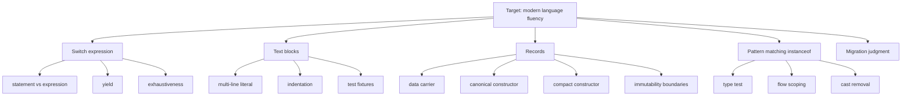
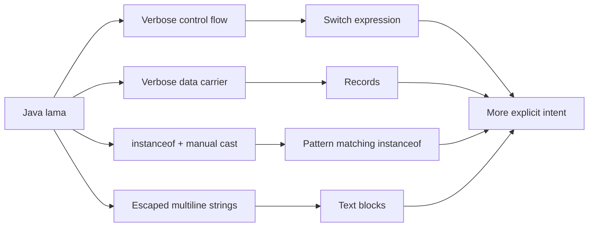

# Part 014 — Java 12 sampai 16: Switch Expressions, Text Blocks, Records, Pattern Matching

> **Tujuan part ini:** memahami evolusi Java 12–16 sebagai pergeseran desain bahasa menuju code yang lebih ekspresif, lebih sedikit ceremony, dan lebih aman untuk data modeling. Setelah part ini, kamu harus bisa memakai switch expression, text block, record, dan pattern matching dengan judgment, bukan sekadar mengikuti syntax baru.

Java 12 sampai 16 sering terlihat seperti kumpulan fitur kecil. Itu cara pandang yang kurang tepat.

Jika Java 8 membawa functional style, maka Java 12–16 mulai membuka jalan menuju:

- expression-oriented control flow,
- data carrier yang eksplisit,
- pattern matching,
- data-oriented programming,
- model domain yang lebih ringkas tetapi tetap statically typed.

Fitur utama yang dibahas:

- Switch expressions, final di Java 14.
- Helpful NullPointerExceptions, Java 14.
- Text blocks, final di Java 15.
- Records, final di Java 16.
- Pattern matching for `instanceof`, final di Java 16.

---

## 1. Posisi dalam Framework Kaufman

Target performa part ini:

> Kamu bisa mengambil code Java 8/11 yang verbose, lalu memodernisasinya memakai fitur Java 12–16 tanpa mengubah semantic behavior dan tanpa membuat API menjadi rapuh.



Kaufman-style learning sequence:

1. Pelajari masalah lama.
2. Pelajari syntax baru secukupnya.
3. Refactor satu contoh kecil.
4. Bandingkan readability sebelum/sesudah.
5. Catat edge case dan failure mode.
6. Hindari rewrite massal sebelum test aman.

---

## 2. Big Picture: Dari Statement ke Expression, Dari POJO ke Data Carrier

Evolusi Java 12–16 bisa dibaca sebagai dua arus besar.



Arah perubahannya bukan “Java menjadi Kotlin” atau “Java meninggalkan OOP”. Arah sebenarnya:

- Java tetap nominally typed.
- Java tetap menjaga compatibility.
- Java menambahkan bentuk yang lebih ringkas untuk pola yang sangat umum.
- Java mengurangi ceremony pada code yang semantic-nya sudah jelas.

---

## 3. Switch Lama: Statement dengan Fall-Through

Sebelum switch expression, `switch` adalah statement.

```java
String label;

switch (status) {
    case OPEN:
        label = "Open";
        break;
    case CLOSED:
        label = "Closed";
        break;
    case ESCALATED:
        label = "Escalated";
        break;
    default:
        label = "Unknown";
}
```

Masalah:

- variable harus dideklarasikan di luar,
- mudah lupa `break`,
- intent “memetakan satu value ke value lain” kurang jelas,
- compiler sulit membantu exhaustiveness untuk beberapa kasus,
- banyak boilerplate.

Fall-through bisa berguna, tetapi sering menjadi sumber bug.

Contoh bug:

```java
switch (priority) {
    case HIGH:
        notifyManager();
    case MEDIUM:
        addToQueue();
        break;
    default:
        log(priority);
}
```

Jika `HIGH`, method `addToQueue()` juga dipanggil karena tidak ada `break`.

---

## 4. Switch Expression

Switch expression memungkinkan `switch` menghasilkan value.

```java
var label = switch (status) {
    case OPEN -> "Open";
    case CLOSED -> "Closed";
    case ESCALATED -> "Escalated";
};
```

Jika `status` adalah enum dan semua constant tercakup, `default` tidak selalu diperlukan.

Kelebihan:

- intent mapping lebih jelas,
- tidak perlu mutable variable sementara,
- arrow form menghindari accidental fall-through,
- compiler bisa membantu exhaustiveness,
- cocok untuk domain mapping kecil.

---

## 5. Statement vs Expression

Statement melakukan aksi.

```java
switch (command) {
    case START -> service.start();
    case STOP -> service.stop();
    default -> throw new IllegalArgumentException("Unknown command: " + command);
}
```

Expression menghasilkan value.

```java
var action = switch (command) {
    case START -> Action.START_SERVICE;
    case STOP -> Action.STOP_SERVICE;
    default -> throw new IllegalArgumentException("Unknown command: " + command);
};
```

Gunakan switch expression ketika kamu sedang melakukan transformasi nilai.

Gunakan statement ketika kamu memang menjalankan side effect.

Rule praktis:

| Situasi | Pilihan |
|---|---|
| Mapping enum ke label | switch expression |
| Mapping status ke strategy object | switch expression |
| Memanggil command handler dengan side effect | switch statement |
| Validasi lalu return value | switch expression |
| Banyak langkah imperative per branch | pertimbangkan method extraction |

---

## 6. `yield` dalam Switch Expression

Jika branch butuh block, gunakan `yield` untuk menghasilkan value.

```java
var fee = switch (caseType) {
    case SIMPLE -> BigDecimal.ZERO;
    case STANDARD -> baseFee;
    case COMPLEX -> {
        var multiplier = riskScore.compareTo(BigDecimal.TEN) > 0
            ? new BigDecimal("2.0")
            : new BigDecimal("1.5");
        yield baseFee.multiply(multiplier);
    }
};
```

`yield` berbeda dari `return`.

- `yield` mengembalikan value dari switch expression.
- `return` keluar dari method.

Anti-pattern:

```java
var result = switch (type) {
    case A -> {
        doA();
        doB();
        doC();
        yield computeResult();
    }
    case B -> {
        doD();
        doE();
        doF();
        yield computeOtherResult();
    }
};
```

Jika block terlalu panjang, extract method:

```java
var result = switch (type) {
    case A -> handleA(input);
    case B -> handleB(input);
};
```

---

## 7. Exhaustiveness

Switch expression harus menghasilkan value untuk semua kemungkinan input.

Contoh enum:

```java
enum CaseStatus {
    DRAFT,
    SUBMITTED,
    UNDER_REVIEW,
    CLOSED
}
```

Switch:

```java
var terminal = switch (status) {
    case DRAFT, SUBMITTED, UNDER_REVIEW -> false;
    case CLOSED -> true;
};
```

Jika nanti enum ditambah:

```java
ESCALATED
```

Compiler bisa memaksa kamu memperbarui switch expression yang exhaustive.

Ini bagus untuk domain model. Perubahan state harus terlihat di compile-time.

Namun, hati-hati dengan `default`.

```java
var terminal = switch (status) {
    case CLOSED -> true;
    default -> false;
};
```

Ini lebih pendek tetapi menyembunyikan perubahan enum di masa depan. Jika `CANCELLED` ditambahkan, compiler tidak memaksa kamu berpikir ulang.

Prinsip:

> Untuk domain enum penting, hindari `default` jika semua case bisa diekspresikan eksplisit.

---

## 8. Refactoring If-Else ke Switch Expression

Sebelum:

```java
String severityLabel(Priority priority) {
    if (priority == Priority.LOW) {
        return "Low";
    }
    if (priority == Priority.MEDIUM) {
        return "Medium";
    }
    if (priority == Priority.HIGH) {
        return "High";
    }
    throw new IllegalArgumentException("Unknown priority: " + priority);
}
```

Sesudah:

```java
String severityLabel(Priority priority) {
    return switch (priority) {
        case LOW -> "Low";
        case MEDIUM -> "Medium";
        case HIGH -> "High";
    };
}
```

Lebih baik karena:

- semua kemungkinan terlihat sebagai satu konstruksi,
- tidak ada repeated `if`,
- compiler memahami enum domain,
- tidak ada unreachable accidental logic.

---

## 9. Helpful NullPointerExceptions

Java 14 memperkenalkan pesan `NullPointerException` yang lebih informatif melalui JEP 358.

Sebelum:

```text
Exception in thread "main" java.lang.NullPointerException
```

Dengan helpful NPE, JVM bisa menunjukkan bagian expression yang null.

Contoh code:

```java
order.customer().address().city().toUpperCase();
```

Pesan error bisa menjelaskan bahwa return value dari `address()` adalah `null`, bukan sekadar mengatakan ada `NullPointerException`.

Ini berguna untuk diagnosis, tetapi jangan jadikan alasan untuk membiarkan null boundary berantakan.

Mental model:

- Helpful NPE mempercepat debugging.
- Ia tidak memperbaiki desain nullability.
- Domain boundary tetap harus jelas.
- Public API tetap harus menjelaskan apakah null mungkin muncul.

---

## 10. Text Blocks

Text blocks adalah multi-line string literal, final di Java 15 melalui JEP 378.

Sebelum:

```java
var json = "{\n" +
    "  \"caseId\": \"CASE-001\",\n" +
    "  \"status\": \"OPEN\"\n" +
    "}";
```

Dengan text block:

```java
var json = """
    {
      "caseId": "CASE-001",
      "status": "OPEN"
    }
    """;
```

Kegunaan utama:

- JSON fixture,
- SQL query,
- XML payload,
- HTML template kecil,
- expected output dalam test,
- documentation snippets.

---

## 11. Text Block Mental Model

Text block bukan sekadar string dengan tiga quote. Ia punya aturan:

- dibuka dengan `"""` diikuti line terminator,
- ditutup dengan `"""`,
- indentation umum akan di-strip,
- newline akhir biasanya ikut masuk jika closing delimiter di baris sendiri,
- escape sequence tetap didukung.

Contoh:

```java
var text = """
    line one
    line two
    """;
```

Berisi kira-kira:

```text
line one
line two
```

Dengan newline di akhir.

Jika tidak ingin newline akhir:

```java
var text = """
    line one
    line two""";
```

Namun gaya ini sering kurang readable. Untuk test fixture, newline akhir biasanya tidak masalah atau bisa dikontrol dengan assertion yang tepat.

---

## 12. Text Blocks untuk SQL

Sebelum:

```java
var sql = "select c.id, c.status, c.created_at " +
    "from cases c " +
    "where c.status = ? " +
    "order by c.created_at desc";
```

Sesudah:

```java
var sql = """
    select c.id, c.status, c.created_at
    from cases c
    where c.status = ?
    order by c.created_at desc
    """;
```

Ini lebih mudah direview.

Tetapi text block bukan alasan membuat SQL raw di sembarang tempat. Boundary data access tetap harus rapi.

---

## 13. Text Blocks untuk Test Fixture

```java
var expected = """
    {
      "caseId": "CASE-001",
      "violations": [
        {
          "code": "DOC_MISSING",
          "severity": "HIGH"
        }
      ]
    }
    """;

assertThat(actualJson).isEqualToIgnoringWhitespace(expected);
```

Keuntungan:

- test lebih readable,
- fixture bisa dicopy dari real payload,
- escaping berkurang,
- reviewer lebih mudah melihat struktur data.

Anti-pattern:

- text block terlalu besar di test method,
- fixture duplikatif di banyak test,
- assertion terlalu bergantung pada formatting,
- payload tidak divalidasi secara semantic.

---

## 14. Records: Data Carrier dengan Sedikit Ceremony

Record adalah jenis class untuk plain data aggregate, final di Java 16 melalui JEP 395.

Sebelum:

```java
public final class CaseId {
    private final String value;

    public CaseId(String value) {
        this.value = Objects.requireNonNull(value);
    }

    public String value() {
        return value;
    }

    @Override
    public boolean equals(Object o) {
        if (this == o) return true;
        if (!(o instanceof CaseId)) return false;
        CaseId caseId = (CaseId) o;
        return value.equals(caseId.value);
    }

    @Override
    public int hashCode() {
        return value.hashCode();
    }

    @Override
    public String toString() {
        return "CaseId[value=" + value + "]";
    }
}
```

Dengan record:

```java
public record CaseId(String value) {
    public CaseId {
        Objects.requireNonNull(value, "value must not be null");
        if (value.isBlank()) {
            throw new IllegalArgumentException("value must not be blank");
        }
    }
}
```

Record otomatis menyediakan:

- private final fields untuk components,
- accessor method dengan nama component,
- canonical constructor,
- `equals`,
- `hashCode`,
- `toString`.

---

## 15. Record Bukan Lombok Replacement Sederhana

Record sering dibandingkan dengan Lombok `@Value` atau `@Data`, tetapi mental modelnya berbeda.

Record adalah deklarasi bahwa:

> API class ini adalah state-nya.

Jika kamu menulis:

```java
public record CustomerSummary(String id, String name, String email) {}
```

Maka kamu menyatakan bahwa `id`, `name`, dan `email` adalah transparent components dari `CustomerSummary`.

Record cocok untuk:

- value object sederhana,
- DTO,
- projection,
- command,
- query result,
- event payload,
- immutable snapshot,
- tuple kecil dengan nama domain jelas.

Record kurang cocok untuk:

- entity dengan identity lifecycle kompleks,
- object dengan banyak mutable state,
- object yang butuh lazy-loaded field,
- class yang harus extend class lain,
- API yang ingin menyembunyikan representasi internal.

---

## 16. Canonical Constructor

Record ini:

```java
public record Money(BigDecimal amount, Currency currency) {}
```

Secara konsep punya canonical constructor:

```java
public Money(BigDecimal amount, Currency currency) {
    this.amount = amount;
    this.currency = currency;
}
```

Kamu bisa menuliskannya eksplisit:

```java
public record Money(BigDecimal amount, Currency currency) {
    public Money(BigDecimal amount, Currency currency) {
        this.amount = Objects.requireNonNull(amount);
        this.currency = Objects.requireNonNull(currency);
    }
}
```

Tetapi untuk validasi sederhana, compact constructor lebih idiomatis.

---

## 17. Compact Constructor

```java
public record Money(BigDecimal amount, Currency currency) {
    public Money {
        Objects.requireNonNull(amount, "amount must not be null");
        Objects.requireNonNull(currency, "currency must not be null");

        if (amount.scale() > 2) {
            throw new IllegalArgumentException("amount scale must be <= 2");
        }
    }
}
```

Dalam compact constructor:

- parameter tersedia dengan nama component,
- assignment ke field dilakukan otomatis setelah body constructor,
- kamu bisa validasi dan normalisasi parameter,
- kamu tidak boleh assign field component secara manual seperti class biasa.

Normalisasi:

```java
public record EmailAddress(String value) {
    public EmailAddress {
        Objects.requireNonNull(value, "value must not be null");
        value = value.strip().toLowerCase(Locale.ROOT);
        if (!value.contains("@")) {
            throw new IllegalArgumentException("invalid email address");
        }
    }
}
```

---

## 18. Record dan Immutability Trap

Record fields final, tetapi itu tidak berarti seluruh object graph immutable.

Contoh buruk:

```java
public record CaseSnapshot(List<String> violations) {}
```

Caller masih bisa memodifikasi list jika list yang sama disimpan.

```java
var violations = new ArrayList<String>();
violations.add("A");

var snapshot = new CaseSnapshot(violations);
violations.add("B");

System.out.println(snapshot.violations()); // bisa ikut berubah
```

Lebih aman:

```java
public record CaseSnapshot(List<String> violations) {
    public CaseSnapshot {
        violations = List.copyOf(violations);
    }
}
```

Namun jika element di dalam list mutable, tetap belum deep immutable.

Prinsip:

> Record memberi shallow immutability pada field reference. Deep immutability tetap tanggung jawab desainmu.

---

## 19. Record sebagai DTO

Record sangat cocok untuk response/query DTO.

```java
public record CaseSummaryResponse(
    String caseId,
    String status,
    String assignedTo,
    Instant lastUpdatedAt
) {}
```

Kelebihan:

- ringkas,
- jelas,
- equality berguna untuk test,
- mudah dipakai sebagai projection,
- mengurangi boilerplate.

Tetapi hati-hati dengan API compatibility.

Jika record dipakai sebagai public API library, component list adalah bagian dari contract. Mengubah nama component, urutan component, atau tipe component dapat memengaruhi source/binary/serialization compatibility.

---

## 20. Record sebagai Value Object

Contoh:

```java
public record CaseNumber(String value) {
    private static final Pattern PATTERN = Pattern.compile("CASE-[0-9]{6}");

    public CaseNumber {
        Objects.requireNonNull(value, "value must not be null");
        value = value.strip().toUpperCase(Locale.ROOT);

        if (!PATTERN.matcher(value).matches()) {
            throw new IllegalArgumentException("Invalid case number: " + value);
        }
    }
}
```

Penggunaan:

```java
void assign(CaseNumber caseNumber, InvestigatorId investigatorId) {
    // no Stringly typed ambiguity
}
```

Dibanding:

```java
void assign(String caseNumber, String investigatorId) {
}
```

Record kecil bisa mengurangi primitive obsession.

---

## 21. Record dengan Behavior

Record boleh punya method.

```java
public record DateRange(LocalDate start, LocalDate end) {
    public DateRange {
        Objects.requireNonNull(start);
        Objects.requireNonNull(end);
        if (end.isBefore(start)) {
            throw new IllegalArgumentException("end must not be before start");
        }
    }

    public boolean contains(LocalDate date) {
        return !date.isBefore(start) && !date.isAfter(end);
    }

    public long daysInclusive() {
        return ChronoUnit.DAYS.between(start, end) + 1;
    }
}
```

Record tidak harus anemic. Ia hanya menyatakan bahwa state component adalah representasi publik dari data tersebut.

---

## 22. Pattern Matching for `instanceof`

Sebelum Java 16:

```java
if (obj instanceof String) {
    String text = (String) obj;
    System.out.println(text.toUpperCase());
}
```

Dengan pattern matching:

```java
if (obj instanceof String text) {
    System.out.println(text.toUpperCase());
}
```

Ini menggabungkan:

- type test,
- cast,
- binding variable.

Manfaatnya bukan hanya mengurangi baris. Manfaat utamanya adalah mengurangi error dari cast manual dan membuat intent lebih langsung.

---

## 23. Flow Scoping

Pattern variable hanya tersedia ketika compiler tahu pattern match berhasil.

```java
if (obj instanceof String text) {
    System.out.println(text.length()); // available
}

// text tidak tersedia di sini
```

Dengan negasi:

```java
if (!(obj instanceof String text)) {
    throw new IllegalArgumentException("Expected String");
}

System.out.println(text.length()); // available setelah guard clause
```

Ini sangat berguna untuk guard clause.

Sebelum:

```java
if (!(input instanceof CreateCaseCommand)) {
    throw new IllegalArgumentException("Invalid command");
}
CreateCaseCommand command = (CreateCaseCommand) input;
```

Sesudah:

```java
if (!(input instanceof CreateCaseCommand command)) {
    throw new IllegalArgumentException("Invalid command");
}

handler.handle(command);
```

---

## 24. Pattern Matching dan Compound Conditions

```java
if (obj instanceof String text && !text.isBlank()) {
    System.out.println(text.strip());
}
```

`text` tersedia di kanan `&&` karena jika evaluasi sampai kanan, match sudah berhasil.

Tetapi ini tidak berlaku untuk `||` dengan cara yang sama.

```java
// Tidak valid untuk menggunakan text secara aman di kanan ||
// if (obj instanceof String text || text.isBlank()) { ... }
```

Mental model:

- `&&` kanan hanya dievaluasi jika kiri true.
- `||` kanan dievaluasi jika kiri false.
- Jika kiri false, pattern variable belum bound.

---

## 25. Pattern Matching Bukan Visitor Replacement Penuh

Pattern matching for `instanceof` hanya membantu type check lokal.

Contoh:

```java
String describe(Object event) {
    if (event instanceof CaseCreated created) {
        return "Case created: " + created.caseId();
    }
    if (event instanceof CaseClosed closed) {
        return "Case closed: " + closed.caseId();
    }
    return "Unknown event";
}
```

Ini lebih baik dari manual cast, tetapi belum exhaustive. Exhaustive pattern switch datang lebih matang di Java 21.

Untuk Java 16, jangan menganggap pattern matching sudah menyelesaikan seluruh algebraic data type modeling.

---

## 26. Refactoring POJO ke Record

Sebelum:

```java
public final class ViolationSummary {
    private final String code;
    private final String description;
    private final Severity severity;

    public ViolationSummary(String code, String description, Severity severity) {
        this.code = Objects.requireNonNull(code);
        this.description = Objects.requireNonNull(description);
        this.severity = Objects.requireNonNull(severity);
    }

    public String code() {
        return code;
    }

    public String description() {
        return description;
    }

    public Severity severity() {
        return severity;
    }

    // equals, hashCode, toString
}
```

Sesudah:

```java
public record ViolationSummary(
    String code,
    String description,
    Severity severity
) {
    public ViolationSummary {
        Objects.requireNonNull(code, "code must not be null");
        Objects.requireNonNull(description, "description must not be null");
        Objects.requireNonNull(severity, "severity must not be null");

        if (code.isBlank()) {
            throw new IllegalArgumentException("code must not be blank");
        }
    }
}
```

Refactor aman jika:

- class memang immutable data carrier,
- accessor naming kompatibel atau caller bisa diubah,
- tidak ada framework yang membutuhkan no-args constructor,
- serialization behavior dipahami,
- equality semantics memang berdasarkan semua fields/components,
- class tidak perlu extend class lain.

---

## 27. Kapan Jangan Refactor ke Record

Jangan ubah class menjadi record jika:

1. Equality berbasis identity, bukan state.

```java
class UserEntity {
    private Long databaseId;
    private String email;
}
```

Entity persistence sering punya lifecycle dan identity yang lebih kompleks.

2. Object butuh lazy initialization.

3. Object punya invariant yang tidak cocok dengan transparent state.

4. Kamu ingin menyembunyikan representasi internal.

5. Framework lama butuh mutable bean convention.

6. Ada binary compatibility yang harus dijaga ketat.

7. Semua fields tidak seharusnya menjadi bagian dari `equals/hashCode`.

---

## 28. DTO vs Value Object vs Entity

| Bentuk | Cocok dengan Record? | Alasan |
|---|---:|---|
| Request DTO | Ya | Data transparan dari boundary |
| Response DTO | Ya | Projection jelas |
| Domain value object | Ya, jika representasi transparan | Invariant bisa dijaga di constructor |
| Domain entity | Biasanya tidak | Identity/lifecycle kompleks |
| Persistence entity JPA | Umumnya tidak | Proxy, no-args constructor, mutation |
| Event payload | Ya | Immutable snapshot cocok |
| Configuration object | Ya | Data aggregate jelas |

---

## 29. Menggabungkan Switch Expression dan Record

```java
public record CaseView(
    String caseId,
    String label,
    boolean terminal
) {}

enum CaseStatus {
    DRAFT,
    SUBMITTED,
    UNDER_REVIEW,
    CLOSED
}

CaseView toView(String caseId, CaseStatus status) {
    var label = switch (status) {
        case DRAFT -> "Draft";
        case SUBMITTED -> "Submitted";
        case UNDER_REVIEW -> "Under review";
        case CLOSED -> "Closed";
    };

    var terminal = switch (status) {
        case DRAFT, SUBMITTED, UNDER_REVIEW -> false;
        case CLOSED -> true;
    };

    return new CaseView(caseId, label, terminal);
}
```

Ini simple, explicit, dan compiler-assisted.

---

## 30. Menggabungkan Pattern Matching dan Record

```java
interface Command {}

record CreateCase(String caseId, String reporterId) implements Command {}
record CloseCase(String caseId, String reason) implements Command {}

void handle(Command command) {
    if (command instanceof CreateCase create) {
        createCase(create.caseId(), create.reporterId());
        return;
    }

    if (command instanceof CloseCase close) {
        closeCase(close.caseId(), close.reason());
        return;
    }

    throw new IllegalArgumentException("Unsupported command: " + command);
}
```

Di Java 16, ini masih belum exhaustive. Di Java 17 sealed classes dan Java 21 pattern switch membuat model ini jauh lebih kuat. Itu akan dibahas di part berikutnya.

---

## 31. API Compatibility Implications

Modern syntax bisa mengubah API contract.

### 31.1 Mengubah POJO ke Record

Berpotensi mengubah:

- constructor signature,
- accessor naming,
- superclass,
- serialization form,
- reflection behavior,
- framework binding,
- `equals/hashCode`,
- binary compatibility.

Jika class internal, refactor lebih aman.

Jika class public library, perlakukan sebagai breaking change kecuali sudah dianalisis.

### 31.2 Mengubah Switch dengan `default`

Menambahkan `default` bisa membuat future enum changes tidak terlihat.

### 31.3 Text Block dan Snapshot Test

Text block bisa mengubah whitespace. Test harus jelas apakah whitespace semantic atau tidak.

---

## 32. Production Guidelines

Gunakan fitur Java 12–16 dengan aturan ini:

1. **Switch expression untuk mapping, bukan orchestration panjang.**
2. **Text block untuk literal struktural, bukan dumping ground.**
3. **Record untuk transparent immutable data, bukan entity lifecycle.**
4. **Compact constructor untuk invariant.**
5. **Defensive copy untuk mutable components.**
6. **Pattern matching untuk menghapus cast manual.**
7. **Jangan gabungkan migration dengan refactor massal.**
8. **Jangan memakai fitur baru untuk terlihat modern jika intent jadi kabur.**

---

## 33. Latihan 20 Jam untuk Part Ini

### Latihan 1 — Switch Refactoring

Cari 10 `switch` atau `if-else` yang melakukan value mapping.

Untuk masing-masing:

- refactor ke switch expression,
- hapus mutable temporary variable,
- hindari `default` jika enum exhaustive,
- tulis test untuk semua case.

### Latihan 2 — Text Block Test Fixtures

Ambil test JSON/XML/SQL lama.

Refactor ke text block.

Validasi:

- apakah whitespace penting,
- apakah assertion semantic lebih baik daripada exact string,
- apakah fixture lebih baik dipindah ke file resource.

### Latihan 3 — POJO to Record

Pilih 5 class yang terlihat seperti data carrier.

Untuk masing-masing, jawab:

```text
Class name:
Is it immutable?
Is equality state-based?
Does it need no-args constructor?
Does it extend another class?
Is representation intended to be public?
Safe to convert to record? yes/no
Reason:
```

### Latihan 4 — Pattern Matching Guard Clause

Cari code:

```java
if (!(x instanceof SomeType)) {
    throw ...;
}
SomeType y = (SomeType) x;
```

Refactor ke:

```java
if (!(x instanceof SomeType y)) {
    throw ...;
}
```

### Latihan 5 — Helpful NPE Diagnosis

Buat reproducer kecil dengan chained call yang menghasilkan NPE. Jalankan di JDK 8 dan JDK 14+ lalu bandingkan pesan error.

---

## 34. Review Questions

1. Apa perbedaan switch statement dan switch expression?
2. Kenapa `yield` diperlukan?
3. Kapan `default` sebaiknya dihindari dalam switch expression?
4. Apa risiko text block terhadap whitespace-sensitive test?
5. Apa yang otomatis dibuat oleh record?
6. Kenapa record tidak otomatis deep immutable?
7. Apa perbedaan DTO, value object, dan entity dalam konteks record?
8. Bagaimana compact constructor bekerja?
9. Apa itu flow scoping pada pattern matching for `instanceof`?
10. Kenapa pattern matching Java 16 belum memberikan exhaustiveness penuh?

---

## 35. Checklist Praktis

Sebelum lanjut, pastikan kamu bisa:

- [ ] Mengubah value-mapping switch lama menjadi switch expression.
- [ ] Menjelaskan statement vs expression.
- [ ] Menggunakan `yield` dengan benar.
- [ ] Menghindari `default` yang menyembunyikan enum changes.
- [ ] Menulis text block untuk JSON, SQL, atau XML.
- [ ] Mengontrol newline dan indentation pada text block.
- [ ] Mengubah immutable data carrier menjadi record.
- [ ] Menulis compact constructor untuk validasi record.
- [ ] Melakukan defensive copy pada record component mutable.
- [ ] Menjelaskan kapan record tidak cocok.
- [ ] Menggunakan pattern matching for `instanceof`.
- [ ] Menjelaskan flow scoping.
- [ ] Menghindari refactor fitur baru tanpa test.

---

## 36. Mental Model yang Harus Dibawa ke Part Berikutnya

Java 12–16 memperkenalkan kebiasaan baru:

- gunakan expression jika tujuanmu menghasilkan value,
- gunakan record jika data memang transparan,
- gunakan pattern matching untuk menghilangkan cast manual,
- gunakan text block untuk literal struktural,
- gunakan compiler sebagai partner untuk exhaustiveness dan type safety.

Part berikutnya membahas Java 17 LTS: sealed classes, strong encapsulation, dan modern domain modeling. Di sana record dan pattern matching mulai menjadi lebih kuat karena bisa dipasangkan dengan sealed hierarchy.

---

## 37. Referensi

- JEP 361 — Switch Expressions: https://openjdk.org/jeps/361
- JEP 358 — Helpful NullPointerExceptions: https://openjdk.org/jeps/358
- JEP 378 — Text Blocks: https://openjdk.org/jeps/378
- OpenJDK Programmer's Guide to Text Blocks: https://openjdk.org/projects/amber/guides/text-blocks-guide
- JEP 395 — Records: https://openjdk.org/jeps/395
- JEP 394 — Pattern Matching for instanceof: https://openjdk.org/jeps/394
- Java SE 25 Language Specification: https://docs.oracle.com/javase/specs/jls/se25/html/index.html
- Java SE 25 API — Record: https://docs.oracle.com/en/java/javase/25/docs/api/java.base/java/lang/Record.html
