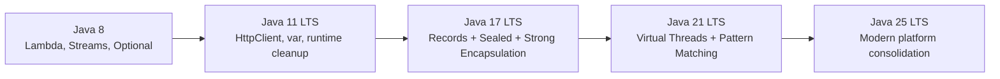
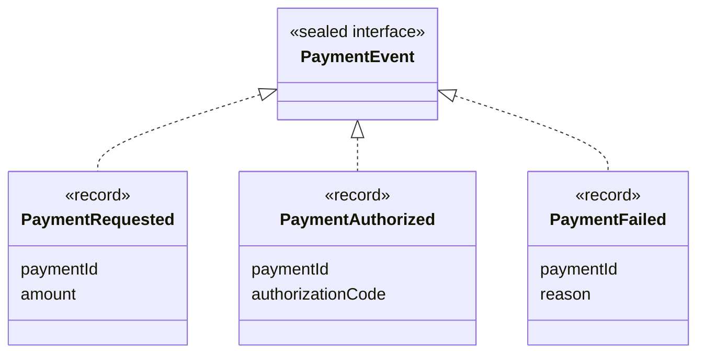
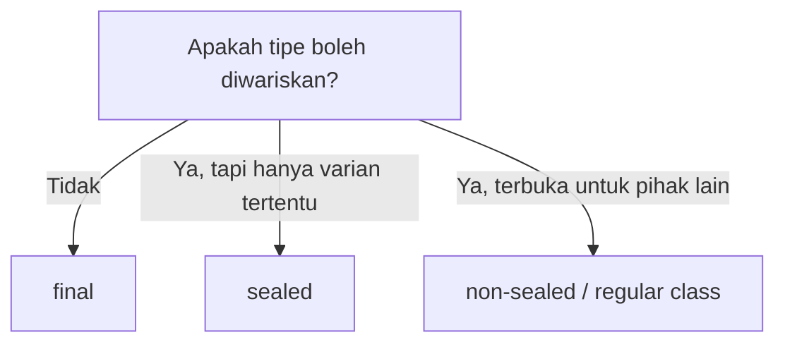
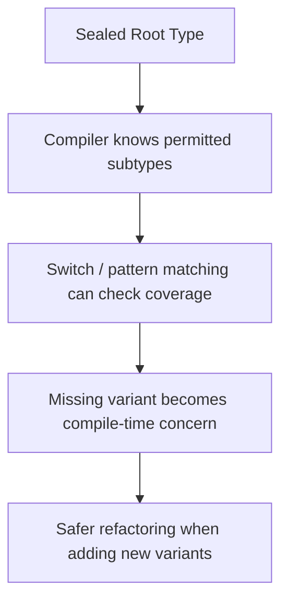
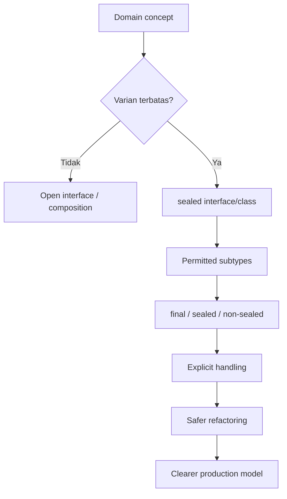

# Part 015 — Java 17 LTS: Sealed Classes, Strong Encapsulation, dan Modern Domain Modeling

Java 17 penting bukan hanya karena statusnya sebagai LTS. Java 17 adalah titik di mana beberapa arah desain Java modern menjadi cukup matang untuk dipakai sebagai baseline enterprise: `record` sudah final di Java 16, `sealed class` final di Java 17, strong encapsulation terhadap internal JDK semakin tegas, dan bahasa mulai bergerak ke arah modeling yang lebih eksplisit.

Bagian ini fokus pada satu ide besar:

> Java 17 memberi kita cara resmi untuk mengatakan: “tipe ini punya varian yang terbatas, diketahui, dan dapat diverifikasi compiler.”

Itulah fungsi sealed classes dan sealed interfaces.

Di sistem production, banyak bug bukan terjadi karena kita tidak tahu cara menulis `class`, tetapi karena domain model terlalu terbuka. Semua orang bisa extend class, membuat subclass baru, mengubah invariant, atau menambahkan state yang tidak pernah dipikirkan oleh pemilik domain. Sealed types memaksa kita mendesain batas variasi secara sadar.

---

## 1. Target Pembelajaran

Setelah menyelesaikan part ini, kamu harus mampu:

1. Menjelaskan masalah desain yang diselesaikan sealed classes.
2. Membedakan `final`, `sealed`, dan `non-sealed`.
3. Mendesain hierarchy domain yang tertutup dan eksplisit.
4. Memakai sealed interface untuk error model, command model, event model, dan workflow state.
5. Menilai kapan inheritance masih masuk akal dan kapan harus diganti composition.
6. Memahami dampak sealed types terhadap API evolution.
7. Mengenali risiko migration Java 8/11 ke Java 17, khususnya strong encapsulation.
8. Menulis checklist review untuk sealed hierarchy di codebase production.

---

## 2. Posisi Java 17 dalam Roadmap Java Modern

Java 17 adalah LTS setelah Java 11 dan sebelum Java 21. Dalam konteks seri ini, Java 17 adalah anchor modernisasi yang aman untuk banyak organisasi karena:

- fitur bahasa modern seperti records dan sealed classes sudah final;
- banyak library besar sudah mendukung Java 17;
- strong encapsulation membuat penggunaan internal JDK yang rapuh semakin terlihat;
- Java 17 cukup modern untuk mengurangi boilerplate, tetapi belum memaksa perubahan concurrency model seperti virtual threads di Java 21.

Pola mentalnya:



Java 17 bukan akhir perjalanan, tetapi merupakan titik baseline yang sangat baik untuk membersihkan model domain sebelum masuk ke Java 21/25.

---

## 3. Problem: Domain Model yang Terlalu Terbuka

Sebelum sealed classes, Java punya dua pilihan ekstrem:

```java
public class PaymentEvent {
    // anybody can extend this class
}
```

atau:

```java
public final class PaymentEvent {
    // nobody can extend this class
}
```

Masalahnya, banyak domain tidak cocok dengan dua ekstrem itu.

Contoh domain payment event:

- `PaymentRequested`
- `PaymentAuthorized`
- `PaymentCaptured`
- `PaymentFailed`
- `PaymentRefunded`

Kita ingin variasinya **terbatas**, tetapi kita tetap ingin punya beberapa subtype.

Sebelum Java 17, biasanya ada beberapa workaround:

1. Membuat constructor package-private.
2. Membuat abstract class dengan dokumentasi “jangan extend dari luar”.
3. Membuat enum dengan payload yang tidak nyaman.
4. Membuat marker interface yang sebenarnya terlalu terbuka.
5. Mengandalkan convention dan code review.

Semua pendekatan itu lemah karena compiler tidak benar-benar menjaga batasnya.

Sealed types memperbaiki ini.

---

## 4. Mental Model Sealed Types

Sealed type adalah tipe yang boleh di-extend atau diimplementasikan hanya oleh daftar subtype tertentu.

```java
public sealed interface PaymentEvent
        permits PaymentRequested, PaymentAuthorized, PaymentFailed {
}

public record PaymentRequested(String paymentId, long amount) implements PaymentEvent {
}

public record PaymentAuthorized(String paymentId, String authorizationCode) implements PaymentEvent {
}

public record PaymentFailed(String paymentId, String reason) implements PaymentEvent {
}
```

Kalimat desainnya:

> `PaymentEvent` adalah keluarga tipe tertutup. Hanya subtype yang disebut di `permits` yang boleh menjadi anggota keluarga ini.

Diagramnya:



Dengan model ini, compiler tahu seluruh varian langsung dari `PaymentEvent`.

Ini menjadi fondasi penting untuk exhaustive pattern matching di Java 21+, tetapi bahkan di Java 17 saja sudah berguna untuk domain boundary dan API clarity.

---

## 5. Syntax Dasar

Ada tiga modifier penting dalam sealed hierarchy:

| Modifier | Makna |
|---|---|
| `sealed` | Tipe ini membatasi siapa yang boleh extend/implement |
| `final` | Tipe ini adalah leaf; tidak boleh diwariskan lagi |
| `non-sealed` | Tipe ini membuka kembali inheritance dari titik tersebut |

Contoh:

```java
public sealed abstract class EnforcementAction
        permits WarningNotice, MonetaryPenalty, LicenseSuspension {
}

public final class WarningNotice extends EnforcementAction {
}

public final class MonetaryPenalty extends EnforcementAction {
}

public non-sealed class LicenseSuspension extends EnforcementAction {
}
```

Maknanya:

- `EnforcementAction` hanya boleh punya tiga subtype langsung.
- `WarningNotice` tidak boleh diwariskan lagi.
- `MonetaryPenalty` tidak boleh diwariskan lagi.
- `LicenseSuspension` membuka kembali inheritance.

`non-sealed` harus dipakai secara sadar. Ia adalah escape hatch. Jika terlalu sering dipakai, manfaat sealed hierarchy melemah.

---

## 6. Aturan Penting Sealed Classes

Aturan praktis yang harus selalu diingat:

1. Tipe `sealed` harus menyatakan permitted direct subclasses, baik eksplisit dengan `permits`, atau implisit jika subtype berada dalam file yang sama.
2. Setiap permitted subclass harus secara langsung extend/implement sealed type tersebut.
3. Setiap permitted subclass harus memilih salah satu dari `final`, `sealed`, atau `non-sealed`.
4. Jika berada dalam unnamed module, permitted subclass harus berada dalam package yang sama.
5. Jika berada dalam named module, permitted subclass harus berada dalam module yang sama.
6. Sealed type bisa berupa class atau interface.
7. Record bisa mengimplementasikan sealed interface, tetapi record sendiri implicitly `final`.

Contoh compact dalam satu file:

```java
sealed interface Decision {
    record Approved(String by) implements Decision {}
    record Rejected(String reason) implements Decision {}
    record Escalated(String queue) implements Decision {}
}
```

Karena semua subtype dideklarasikan di dalam sealed interface, `permits` tidak perlu ditulis eksplisit.

---

## 7. `final` vs `sealed` vs `non-sealed`

Gunakan mental model ini:



### 7.1 Gunakan `final` ketika

- class adalah value object leaf;
- tidak ada invariant yang aman untuk inheritance;
- API tidak dirancang untuk subclassing;
- class memegang resource atau lifecycle sensitif;
- subclassing hanya akan menambah surface area tanpa manfaat.

Contoh:

```java
public final class Money {
    private final String currency;
    private final long minorUnits;

    public Money(String currency, long minorUnits) {
        this.currency = Objects.requireNonNull(currency);
        this.minorUnits = minorUnits;
    }
}
```

### 7.2 Gunakan `sealed` ketika

- domain punya varian terbatas;
- semua varian diketahui oleh pemilik module/package;
- kamu ingin compiler membantu completeness checking;
- kamu ingin mencegah extension liar;
- model digunakan sebagai command, event, result, error, atau state.

Contoh:

```java
public sealed interface CaseStatus
        permits Draft, Submitted, UnderReview, Closed {
}
```

### 7.3 Gunakan `non-sealed` ketika

- kamu sengaja membuka extension point;
- subtype tertentu memang menjadi plugin boundary;
- kamu tetap ingin root hierarchy tertutup tetapi salah satu branch terbuka.

Contoh:

```java
public sealed interface NotificationChannel
        permits EmailChannel, SmsChannel, ExternalChannel {
}

public final class EmailChannel implements NotificationChannel {
}

public final class SmsChannel implements NotificationChannel {
}

public non-sealed interface ExternalChannel extends NotificationChannel {
    String providerName();
}
```

Dalam contoh ini, `NotificationChannel` tetap mengontrol bahwa extension eksternal hanya boleh masuk melalui `ExternalChannel`, bukan langsung mengimplementasikan root type.

---

## 8. Sealed Interface vs Sealed Abstract Class

Gunakan sealed interface ketika yang ingin kamu modelkan adalah **kategori kemampuan atau varian domain**, bukan shared state.

```java
public sealed interface ValidationResult
        permits Valid, Invalid {
}

public record Valid() implements ValidationResult {
}

public record Invalid(List<String> errors) implements ValidationResult {
}
```

Gunakan sealed abstract class ketika ada shared behavior atau shared protected state yang memang sah.

```java
public sealed abstract class CaseAction
        permits AssignOfficer, AddEvidence, CloseCase {

    private final String caseId;

    protected CaseAction(String caseId) {
        this.caseId = Objects.requireNonNull(caseId);
    }

    public final String caseId() {
        return caseId;
    }
}
```

Namun hati-hati: shared state di abstract class sering membuat hierarchy sulit diuji dan rawan fragile base class problem. Untuk domain modeling modern, sealed interface + records sering lebih bersih.

---

## 9. Sealed Types sebagai Algebraic Data Type ala Java

Java tidak memiliki algebraic data type seperti beberapa bahasa functional. Namun kombinasi sealed interface dan records memberi pendekatan yang mirip secara praktis.

```java
public sealed interface PaymentResult
        permits PaymentResult.Success, PaymentResult.Declined, PaymentResult.RequiresReview {

    record Success(String paymentId, String settlementId) implements PaymentResult {}

    record Declined(String paymentId, String reasonCode) implements PaymentResult {}

    record RequiresReview(String paymentId, String queueName) implements PaymentResult {}
}
```

Artinya:

- `PaymentResult` adalah sum type: salah satu dari beberapa varian.
- Setiap record adalah product type: gabungan beberapa field.
- Seluruh varian diketahui.

Ini sangat berguna untuk mengganti model lama seperti:

```java
public class PaymentResult {
    private boolean success;
    private boolean declined;
    private boolean requiresReview;
    private String paymentId;
    private String settlementId;
    private String reasonCode;
    private String queueName;
}
```

Model lama punya banyak invalid state:

- `success = true` tetapi `settlementId = null`
- `declined = true` dan `success = true`
- `requiresReview = false` tetapi `queueName` terisi
- semua flag `false`

Model sealed mencegah invalid combination tersebut di level type.

---

## 10. Modeling Error dengan Sealed Interface

Banyak sistem Java lama memakai exception untuk semua hal. Ini buruk jika error adalah bagian normal dari domain.

Contoh: validasi case intake.

```java
public sealed interface IntakeError
        permits MissingRequiredField, InvalidJurisdiction, DuplicateCase, UnsupportedCaseType {
}

public record MissingRequiredField(String fieldName) implements IntakeError {
}

public record InvalidJurisdiction(String jurisdictionCode) implements IntakeError {
}

public record DuplicateCase(String existingCaseId) implements IntakeError {
}

public record UnsupportedCaseType(String caseType) implements IntakeError {
}
```

Lalu hasil operasi:

```java
public sealed interface IntakeResult
        permits IntakeAccepted, IntakeRejected {
}

public record IntakeAccepted(String caseId) implements IntakeResult {
}

public record IntakeRejected(List<IntakeError> errors) implements IntakeResult {
}
```

Keuntungan:

- caller dipaksa menangani success dan rejected;
- error domain eksplisit;
- error bisa dites tanpa parsing string exception;
- error bisa dipetakan ke HTTP response, UI message, atau audit log secara deterministic.

Exception tetap dipakai untuk failure teknis:

- database unavailable;
- network timeout;
- corrupted file;
- invariant internal yang seharusnya mustahil;
- programming error.

Domain rejection bukan selalu exception.

---

## 11. Modeling Workflow State

Sealed types sangat cocok untuk workflow state.

Misalnya enforcement lifecycle:

```java
public sealed interface EnforcementCaseState
        permits Draft, Submitted, InReview, Escalated, Resolved, Closed {
}

public record Draft(String caseId) implements EnforcementCaseState {
}

public record Submitted(String caseId, Instant submittedAt) implements EnforcementCaseState {
}

public record InReview(String caseId, String reviewerId) implements EnforcementCaseState {
}

public record Escalated(String caseId, String escalationQueue, String reason) implements EnforcementCaseState {
}

public record Resolved(String caseId, String resolutionCode) implements EnforcementCaseState {
}

public record Closed(String caseId, Instant closedAt) implements EnforcementCaseState {
}
```

Kita bisa membuat transition function:

```java
public final class EnforcementWorkflow {

    public EnforcementCaseState submit(Draft draft, Instant now) {
        return new Submitted(draft.caseId(), now);
    }

    public EnforcementCaseState assignReviewer(Submitted submitted, String reviewerId) {
        return new InReview(submitted.caseId(), reviewerId);
    }

    public EnforcementCaseState escalate(InReview state, String queue, String reason) {
        return new Escalated(state.caseId(), queue, reason);
    }
}
```

Perhatikan: kita tidak menerima generic `EnforcementCaseState` untuk semua method. Method transition menerima state spesifik. Itu membuat illegal transition lebih sulit ditulis.

Model yang buruk:

```java
public EnforcementCaseState transition(EnforcementCaseState current, String action) {
    // giant if/switch, many runtime errors
}
```

Model yang lebih baik:

```java
public Escalated escalate(InReview current, String queue, String reason) {
    return new Escalated(current.caseId(), queue, reason);
}
```

Illegal transition seperti `escalate(Draft)` gagal compile.

---

## 12. Sealed Types dan Exhaustiveness

Di Java 17, pattern matching for switch belum final. Namun sealed types sudah menyiapkan jalan ke arah exhaustive handling.

Di Java 21+, kamu bisa menulis:

```java
static String describe(PaymentResult result) {
    return switch (result) {
        case PaymentResult.Success success -> "settled: " + success.settlementId();
        case PaymentResult.Declined declined -> "declined: " + declined.reasonCode();
        case PaymentResult.RequiresReview review -> "review: " + review.queueName();
    };
}
```

Karena `PaymentResult` sealed, compiler dapat mengetahui apakah semua varian sudah ditangani.

Mental model:



Ini mengubah cara kita melihat refactoring. Menambah subtype baru tidak lagi diam-diam membuat handler lama lupa diperbarui. Compiler bisa membantu menemukan titik yang perlu diubah.

---

## 13. Domain Modeling: Open World vs Closed World

Pertanyaan desain paling penting:

> Apakah variasi domain ini open-ended atau closed-ended?

### 13.1 Closed world

Gunakan sealed types ketika varian diketahui dan dikendalikan oleh domain owner.

Contoh:

- status case;
- payment result;
- validation error;
- command internal;
- domain event internal;
- workflow state;
- parse result;
- authorization decision.

### 13.2 Open world

Gunakan interface biasa ketika pihak luar memang harus bisa menambah implementasi.

Contoh:

- plugin SPI;
- storage provider extension;
- notification provider eksternal;
- custom rule evaluator dari tenant;
- framework callback.

### 13.3 Mixed world

Gunakan sealed root dengan branch `non-sealed` untuk extension point terbatas.

```java
public sealed interface Rule
        permits BuiltInRule, CustomRule {
}

public sealed interface BuiltInRule extends Rule
        permits AgeRule, JurisdictionRule, AmountRule {
}

public final class AgeRule implements BuiltInRule {
}

public final class JurisdictionRule implements BuiltInRule {
}

public final class AmountRule implements BuiltInRule {
}

public non-sealed interface CustomRule extends Rule {
    RuleEvaluation evaluate(RuleContext context);
}
```

Dengan ini, system owner tetap punya closed set untuk built-in rules, tetapi tenant/external party bisa menambah custom rules hanya melalui contract yang disediakan.

---

## 14. Sealed Types untuk API Boundary

Sealed type dalam public API harus dipikirkan lebih hati-hati.

Jika kamu expose sealed interface sebagai public API:

```java
public sealed interface FraudDecision
        permits Approved, Rejected, ManualReview {
}
```

maka kamu mengirim pesan ke consumer:

> Jangan extend ini. Ini bukan extension point. Ini closed result model.

Itu bagus untuk result model. Tetapi buruk jika consumer butuh extension.

### 14.1 Menambah permitted subtype adalah breaking change?

Secara source-level, menambah subtype baru ke sealed hierarchy dapat memaksa consumer memperbarui exhaustive switch mereka.

Itu bisa dianggap breaking secara behavioral/source compatibility, meskipun binary compatibility punya aturan lebih spesifik.

Prinsip praktis:

- Jika public sealed hierarchy dipakai oleh consumer untuk exhaustive handling, menambah varian harus dianggap perubahan besar.
- Dokumentasikan policy extension.
- Jangan expose sealed hierarchy publik jika kamu belum yakin varian domain stabil.

### 14.2 Internal sealed hierarchy lebih aman

Untuk domain internal, sealed types sangat kuat karena kamu mengontrol semua handler.

Contoh:

```java
sealed interface InternalRiskSignal
        permits VelocitySignal, DeviceSignal, GeoSignal {
}
```

Jika nanti kamu menambah `BehaviorSignal`, compiler membantu menemukan handler internal yang perlu diperbarui.

---

## 15. Records + Sealed Types

Records dan sealed types saling melengkapi.

- Record menyatakan data transparan dengan field final dan generated methods.
- Sealed interface menyatakan daftar varian yang terbatas.

Contoh command model:

```java
public sealed interface CaseCommand
        permits CreateCase, AssignCase, EscalateCase, CloseCase {
}

public record CreateCase(String intakeId, String createdBy) implements CaseCommand {
}

public record AssignCase(String caseId, String officerId) implements CaseCommand {
}

public record EscalateCase(String caseId, String queue, String reason) implements CaseCommand {
}

public record CloseCase(String caseId, String resolutionCode) implements CaseCommand {
}
```

Kelebihan:

- setiap command punya payload spesifik;
- tidak ada field opsional raksasa;
- tidak ada enum + map payload yang rawan runtime error;
- handler bisa eksplisit per command;
- audit log lebih jelas.

Handler Java 17-style:

```java
public final class CaseCommandHandler {

    public void handle(CaseCommand command) {
        if (command instanceof CreateCase create) {
            handleCreate(create);
        } else if (command instanceof AssignCase assign) {
            handleAssign(assign);
        } else if (command instanceof EscalateCase escalate) {
            handleEscalate(escalate);
        } else if (command instanceof CloseCase close) {
            handleClose(close);
        } else {
            throw new IllegalStateException("Unknown command: " + command);
        }
    }
}
```

Di Java 21+, ini menjadi jauh lebih rapi dengan pattern switch. Tetapi desain sealed + record sudah bisa dimulai di Java 17.

---

## 16. Strong Encapsulation di Java 17

Java 17 juga penting karena mempertegas strong encapsulation terhadap internal JDK.

Masalah lama di banyak codebase Java 8:

```java
import sun.misc.Unsafe;
import com.sun.*;
import jdk.internal.*;
```

Atau library memakai reflection untuk mengakses internal JDK.

Risikonya:

- internal API tidak dijamin stabil;
- upgrade JDK menjadi rapuh;
- behavior bisa berubah tanpa kontrak compatibility publik;
- security boundary melemah;
- runtime warning/error muncul saat migration.

Di Java 17, organisasi yang masih bergantung pada internal API biasanya mulai dipaksa untuk membersihkan dependency atau menambahkan explicit `--add-opens` / `--add-exports` sebagai temporary workaround.

Prinsip production:

> `--add-opens` adalah migration bridge, bukan permanent architecture.

Jika aplikasi hanya bisa berjalan dengan banyak flag `--add-opens`, itu tanda ada dependency atau framework yang harus dimodernisasi.

---

## 17. Java 8/11 ke Java 17 Migration Risk

Migration ke Java 17 biasanya gagal bukan karena syntax Java 17, tetapi karena ecosystem dan runtime assumption.

Checklist awal:

1. Upgrade build tool.
   - Maven/Gradle harus mendukung toolchain Java 17.
2. Upgrade compiler plugin.
   - `maven-compiler-plugin`, Surefire/Failsafe, JaCoCo, SpotBugs, Error Prone.
3. Audit dependency yang memakai internal JDK API.
   - gunakan `jdeps`.
4. Cari illegal reflective access.
5. Upgrade framework utama.
   - Spring Boot, Hibernate, Netty, Jackson, Mockito, Byte Buddy, Lombok.
6. Jalankan full test suite di Java 17 runtime.
7. Jalankan integration test dengan environment production-like.
8. Periksa GC flag lama yang sudah deprecated/removed.
9. Periksa TLS/cipher/security provider behavior.
10. Periksa performance baseline sebelum dan sesudah migration.

Command awal:

```bash
jdeps --jdk-internals --recursive target/app.jar
```

Jika output menunjukkan penggunaan `JDK internal API`, jangan langsung menambahkan `--add-opens`. Cari library mana yang membawa akses itu, lalu upgrade atau ganti.

---

## 18. Refactoring Legacy Inheritance ke Sealed Hierarchy

Legacy model:

```java
public abstract class Alert {
    private final String id;

    protected Alert(String id) {
        this.id = id;
    }
}

public class EmailAlert extends Alert { }
public class SmsAlert extends Alert { }
public class PushAlert extends Alert { }
```

Masalah:

- siapa pun bisa menambah subclass;
- handler harus defensif terhadap subclass tak dikenal;
- sulit memastikan semua varian ditangani;
- API tidak menyatakan apakah inheritance terbuka atau tertutup.

Refactor Java 17:

```java
public sealed interface Alert
        permits EmailAlert, SmsAlert, PushAlert {
    String id();
}

public record EmailAlert(String id, String emailAddress) implements Alert {
}

public record SmsAlert(String id, String phoneNumber) implements Alert {
}

public record PushAlert(String id, String deviceToken) implements Alert {
}
```

Handler:

```java
public final class AlertDispatcher {

    public void dispatch(Alert alert) {
        if (alert instanceof EmailAlert email) {
            sendEmail(email.emailAddress());
        } else if (alert instanceof SmsAlert sms) {
            sendSms(sms.phoneNumber());
        } else if (alert instanceof PushAlert push) {
            sendPush(push.deviceToken());
        } else {
            throw new IllegalStateException("Unhandled alert: " + alert);
        }
    }
}
```

Migration strategy:

1. Identifikasi abstract class/interface yang sebenarnya closed set.
2. Cari semua subclass aktual di codebase.
3. Tentukan apakah ada extension eksternal.
4. Jika tidak ada, ubah root menjadi sealed.
5. Ubah leaf menjadi `final` atau record jika cocok.
6. Tambahkan test handler untuk semua varian.
7. Pastikan serialization/deserialization masih benar.
8. Dokumentasikan bahwa hierarchy closed.

---

## 19. Anti-Pattern Sealed Types

### 19.1 Sealing everything

Tidak semua interface harus sealed.

Buruk:

```java
public sealed interface Repository permits UserRepository, OrderRepository {
}
```

Jika repository adalah abstraction untuk dependency injection atau testing, sealing bisa mengganggu mock/fake/extension.

### 19.2 `non-sealed` tanpa alasan

Buruk:

```java
public sealed interface Event permits BusinessEvent {
}

public non-sealed interface BusinessEvent extends Event {
}
```

Jika branch langsung dibuka kembali tanpa constraint, root sealed tidak memberi banyak manfaat.

### 19.3 Sealed hierarchy dengan shared mutable state

Buruk:

```java
public sealed abstract class WorkflowState permits Draft, Submitted {
    protected Map<String, Object> attributes = new HashMap<>();
}
```

Sealed tidak otomatis membuat desain aman. Jika semua subtype berbagi mutable map, invariant tetap rapuh.

### 19.4 Public sealed API yang belum stabil

Jika varian domain masih sering berubah, public sealed hierarchy bisa menyulitkan consumer.

### 19.5 Mengganti polymorphism sehat dengan switch raksasa

Sealed types cocok untuk data-oriented handling. Tetapi jangan otomatis mengubah semua polymorphic behavior menjadi switch.

Jika behavior benar-benar milik subtype dan stabil, method polymorphism masih baik.

---

## 20. Decision Matrix

| Situasi | Rekomendasi |
|---|---|
| Value object sederhana | `record` atau `final class` |
| Result dengan beberapa varian terbatas | sealed interface + records |
| Error domain eksplisit | sealed interface + records |
| Workflow state tertutup | sealed interface + records/classes |
| Plugin eksternal | interface biasa atau `non-sealed` branch |
| Framework extension point | jangan sealed kecuali framework memang mengontrol semua implementasi |
| Internal command/event model | sealed interface + records |
| Public API varian stabil | sealed boleh, dengan dokumentasi compatibility |
| Public API varian belum stabil | hindari sealed atau desain extension branch |

---

## 21. Production Review Checklist

Gunakan checklist ini saat review sealed hierarchy:

### Domain clarity

- Apakah root type merepresentasikan satu konsep domain yang jelas?
- Apakah subtype adalah varian domain yang valid?
- Apakah semua subtype punya nama yang meaningful?
- Apakah ada subtype yang sebenarnya hanya flag/state internal?

### Boundary

- Apakah hierarchy memang closed-world?
- Apakah ada consumer eksternal yang perlu extend?
- Apakah `non-sealed` benar-benar dibutuhkan?
- Apakah package/module placement sesuai aturan sealed?

### Invariant

- Apakah tiap subtype mencegah invalid state?
- Apakah constructor/record compact constructor melakukan validasi minimal?
- Apakah nullability jelas?
- Apakah mutability payload aman?

### Evolution

- Apa konsekuensi jika menambah subtype baru?
- Handler mana yang harus diperbarui?
- Apakah test akan gagal jika varian baru belum ditangani?
- Apakah public API compatibility terdokumentasi?

### Runtime

- Apakah serialization/deserialization mendukung sealed hierarchy?
- Apakah reflection framework mengenali subtype?
- Apakah native image/AOT tooling butuh konfigurasi tambahan?
- Apakah logging dan observability menampilkan subtype dengan jelas?

---

## 22. Latihan Terstruktur

### Latihan 1 — Refactor flag object menjadi sealed result

Ubah model ini:

```java
public class VerificationResult {
    boolean passed;
    boolean failed;
    boolean manualReview;
    String reason;
    String reviewerQueue;
}
```

Menjadi:

```java
sealed interface VerificationResult permits Passed, Failed, ManualReview {
}
```

Tambahkan record untuk setiap varian. Pastikan tidak ada invalid state.

### Latihan 2 — Modeling workflow state

Buat sealed hierarchy untuk lifecycle:

```text
Draft -> Submitted -> Assigned -> Investigating -> Resolved -> Closed
                         |              |
                         v              v
                      Escalated       Reopened
```

Tulis method transition yang menerima state spesifik, bukan generic state.

### Latihan 3 — Error model

Buat sealed hierarchy untuk domain error pada case intake:

- missing field;
- invalid document;
- duplicate case;
- unsupported jurisdiction;
- expired submission window.

Lalu buat mapper ke HTTP status dan audit code.

### Latihan 4 — Migration scan

Di project Java 8/11 lama, jalankan:

```bash
jdeps --jdk-internals --recursive target/*.jar
```

Catat dependency yang memakai internal JDK API. Buat migration note:

- library;
- internal API yang dipakai;
- versi saat ini;
- versi pengganti;
- workaround sementara;
- risk jika tidak diperbaiki.

---

## 23. Mental Model Akhir

Sealed classes bukan sekadar fitur inheritance. Ia adalah alat desain untuk menyatakan batas variasi.



Gunakan sealed types ketika kamu ingin model domain yang:

- eksplisit;
- terbatas;
- mudah diaudit;
- mudah diuji;
- sulit berada dalam invalid state;
- siap untuk pattern matching dan exhaustive handling di Java 21+.

---

## 24. Referensi

- OpenJDK — JEP 409: Sealed Classes: https://openjdk.org/jeps/409
- OpenJDK — JDK 17 Project: https://openjdk.org/projects/jdk/17/
- Oracle Java Language Guide — Sealed Classes and Interfaces: https://docs.oracle.com/en/java/javase/17/language/sealed-classes-and-interfaces.html
- OpenJDK — JEP 395: Records: https://openjdk.org/jeps/395
- Oracle Java Language Guide — Records: https://docs.oracle.com/en/java/javase/17/language/records.html
- OpenJDK — JEP 403: Strongly Encapsulate JDK Internals: https://openjdk.org/jeps/403

