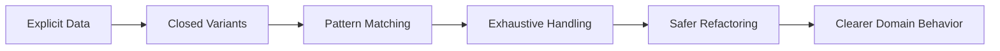
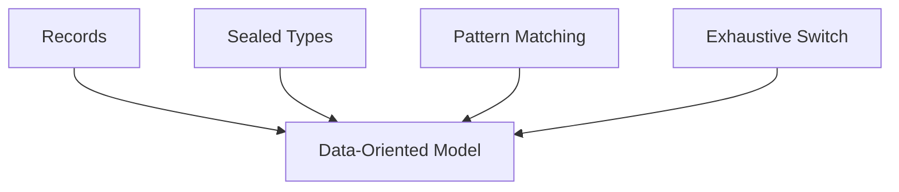
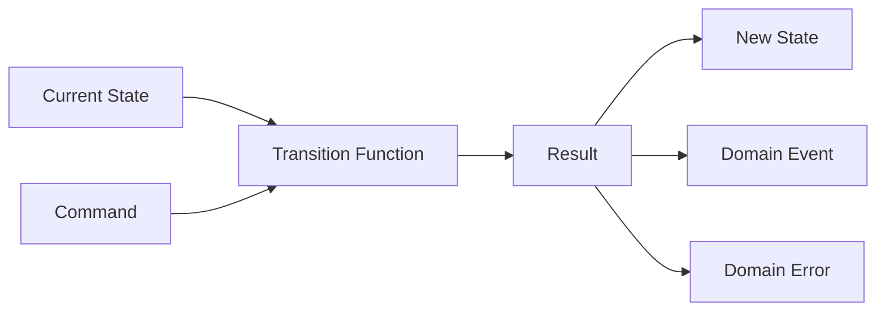
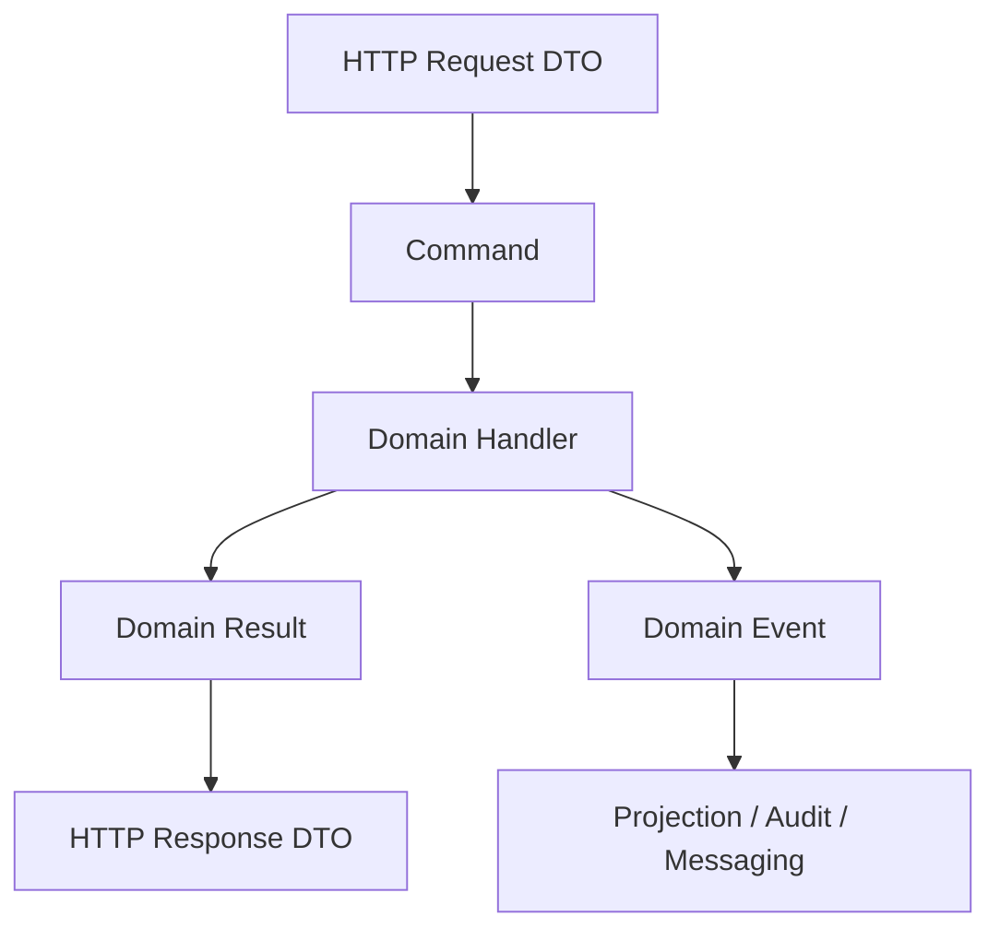
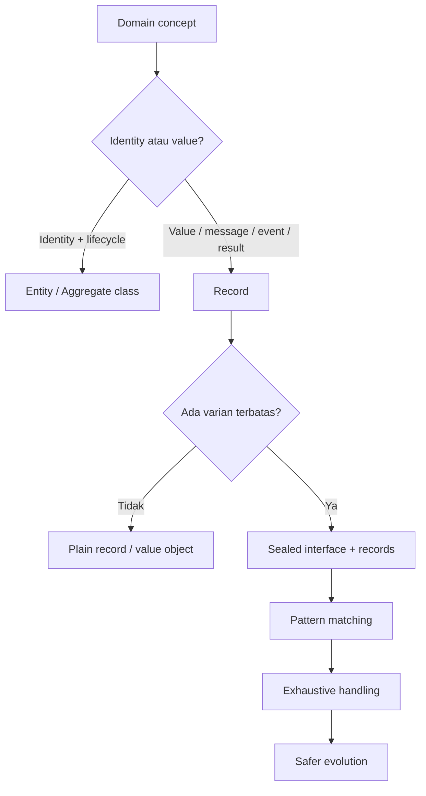

# Part 016 — Data-Oriented Programming di Java: Records, Sealed Types, Pattern Matching, dan Exhaustiveness

Part sebelumnya membahas sealed classes sebagai cara mengontrol inheritance. Bagian ini memperluasnya menjadi gaya desain: **data-oriented programming** di Java modern.

Data-oriented programming di Java bukan berarti meninggalkan object-oriented programming. Ini berarti kita tidak memaksa semua problem menjadi object dengan mutable state dan method polymorphism. Untuk banyak domain, terutama command, event, result, error, state, dan message, solusi paling jelas adalah:

1. Representasikan data secara eksplisit.
2. Batasi variasi data dengan sealed types.
3. Gunakan pattern matching untuk memproses varian secara aman.
4. Buat compiler membantu menemukan case yang belum ditangani.

Mental modelnya:



---

## 1. Target Pembelajaran

Setelah menyelesaikan part ini, kamu harus mampu:

1. Menjelaskan perbedaan object-oriented dan data-oriented design di Java.
2. Memakai records untuk data transparan yang immutable-by-default.
3. Memakai sealed types untuk closed domain variants.
4. Memakai pattern matching sebagai safe dispatch.
5. Memahami exhaustive switch dan dampaknya terhadap refactoring.
6. Mendesain command, event, result, error, dan workflow state dengan Java modern.
7. Menghindari anemic domain model secara realistis, bukan dogmatis.
8. Menilai trade-off antara extensibility dan exhaustiveness.

---

## 2. Problem: Java Lama Sering Over-Object-Oriented

Java lama sering mendorong desain seperti ini:

```java
public abstract class DomainEvent {
    public abstract void apply(Aggregate aggregate);
}

public class CaseSubmitted extends DomainEvent {
    @Override
    public void apply(Aggregate aggregate) {
        aggregate.setStatus("SUBMITTED");
    }
}
```

Pendekatan ini bisa baik jika behavior memang stabil dan selalu milik subtype. Namun sering kali event adalah data yang harus diproses berbeda oleh banyak consumer:

- audit writer;
- projection updater;
- notification sender;
- search indexer;
- workflow engine;
- analytics pipeline;
- policy evaluator.

Jika behavior ditanam ke event, event menjadi terlalu tahu banyak hal. Jika semua behavior ditaruh di subtype, setiap operation baru memaksa kita mengubah banyak class.

Masalah ini dikenal sebagai expression problem:

- mudah menambah tipe baru, sulit menambah operasi baru;
- atau mudah menambah operasi baru, sulit menambah tipe baru.

Object-oriented style biasanya bagus untuk open set of types dengan stable operations.

Data-oriented style biasanya bagus untuk closed set of types dengan many operations.

---

## 3. Object-Oriented vs Data-Oriented Design

| Dimensi | Object-Oriented | Data-Oriented |
|---|---|---|
| Fokus | Behavior dekat dengan object | Data shape eksplisit dan diproses oleh operation eksternal |
| Variasi tipe | Sering open-ended | Biasanya closed set |
| Menambah subtype | Mudah | Harus update handler |
| Menambah operasi | Bisa menyebar ke banyak subtype | Mudah, buat function/handler baru |
| Cocok untuk | Entity behavior, polymorphic services, plugin | Commands, events, results, errors, state machines |
| Risiko | Over-encapsulation, hidden flow | Switch raksasa, anemic model jika salah pakai |

Tidak ada yang selalu lebih baik. Pertanyaan desainnya:

> Apakah domain ini lebih sering berubah dengan menambah varian, atau menambah operasi atas varian yang sama?

Jika varian stabil tetapi operasi banyak, data-oriented design sering lebih jelas.

---

## 4. Building Blocks Java Modern

Data-oriented programming di Java modern berdiri di atas empat building blocks.



### 4.1 Records

Record menyatakan data carrier transparan.

```java
public record Money(String currency, long minorUnits) {
    public Money {
        Objects.requireNonNull(currency, "currency");
        if (currency.isBlank()) {
            throw new IllegalArgumentException("currency must not be blank");
        }
        if (minorUnits < 0) {
            throw new IllegalArgumentException("minorUnits must not be negative");
        }
    }
}
```

Record memberi:

- final fields untuk components;
- canonical constructor;
- accessor methods;
- `equals`;
- `hashCode`;
- `toString`.

Record bukan sekadar “Lombok tanpa Lombok”. Record adalah pernyataan desain bahwa API object tersebut adalah state description-nya.

### 4.2 Sealed Types

Sealed type membatasi varian.

```java
public sealed interface PaymentCommand
        permits AuthorizePayment, CapturePayment, RefundPayment {
}
```

### 4.3 Pattern Matching

Pattern matching membuat dispatch berdasarkan bentuk data lebih aman dan ringkas.

Java 16 final untuk pattern matching `instanceof`:

```java
if (command instanceof AuthorizePayment authorize) {
    authorize(authorize.paymentId(), authorize.amount());
}
```

Java 21 final untuk pattern matching `switch`:

```java
return switch (command) {
    case AuthorizePayment c -> authorize(c);
    case CapturePayment c -> capture(c);
    case RefundPayment c -> refund(c);
};
```

### 4.4 Record Patterns

Record patterns memungkinkan deconstruction record.

```java
return switch (event) {
    case CaseAssigned(String caseId, String officerId) ->
            "case " + caseId + " assigned to " + officerId;
    case CaseClosed(String caseId, String reason) ->
            "case " + caseId + " closed because " + reason;
};
```

Dengan ini, Java menjadi lebih ekspresif untuk data navigation.

---

## 5. Closed Variants: Sum Type dan Product Type

Untuk berpikir data-oriented, gunakan dua konsep:

### 5.1 Product type

Product type adalah gabungan beberapa field.

```java
record CustomerId(String value) {}
record Address(String street, String city, String postalCode) {}
```

Record adalah product type yang nyaman.

### 5.2 Sum type

Sum type adalah “salah satu dari beberapa kemungkinan”.

```java
sealed interface VerificationStatus
        permits NotStarted, Passed, Failed, RequiresManualReview {
}
```

Sealed interface adalah sum type secara praktis.

Kombinasinya:

```java
sealed interface VerificationStatus
        permits NotStarted, Passed, Failed, RequiresManualReview {

    record NotStarted(String caseId) implements VerificationStatus {}

    record Passed(String caseId, Instant checkedAt) implements VerificationStatus {}

    record Failed(String caseId, List<String> reasons) implements VerificationStatus {}

    record RequiresManualReview(String caseId, String queue) implements VerificationStatus {}
}
```

Ini membatasi invalid state jauh lebih baik daripada flag object.

---

## 6. Menghapus Invalid State

Model buruk:

```java
public class CaseDecision {
    private boolean approved;
    private boolean rejected;
    private boolean escalated;
    private String rejectionReason;
    private String escalationQueue;
}
```

Invalid state yang mungkin:

- `approved = true` dan `rejected = true`;
- `escalated = true` tetapi `escalationQueue = null`;
- `rejected = false` tetapi `rejectionReason` terisi;
- semua flag `false`;
- semua flag `true`.

Model data-oriented:

```java
public sealed interface CaseDecision
        permits Approved, Rejected, Escalated {
}

public record Approved(String caseId, String approvedBy) implements CaseDecision {
}

public record Rejected(String caseId, String reason) implements CaseDecision {
    public Rejected {
        if (reason == null || reason.isBlank()) {
            throw new IllegalArgumentException("reason must not be blank");
        }
    }
}

public record Escalated(String caseId, String queue, String reason) implements CaseDecision {
}
```

Sekarang invalid combination hilang dari representasi.

Prinsip:

> Jangan validasi state yang sebenarnya bisa dibuat tidak mungkin melalui desain tipe.

---

## 7. Command Modeling

Command adalah permintaan untuk melakukan perubahan.

Command yang baik:

- imperative;
- punya intent jelas;
- punya payload minimal;
- bisa divalidasi;
- bisa diaudit;
- tidak ambigu.

Contoh:

```java
public sealed interface EnforcementCommand
        permits SubmitCase, AssignOfficer, EscalateCase, ResolveCase, CloseCase {
}

public record SubmitCase(String intakeId, String submittedBy) implements EnforcementCommand {
}

public record AssignOfficer(String caseId, String officerId) implements EnforcementCommand {
}

public record EscalateCase(String caseId, String queue, String reason) implements EnforcementCommand {
}

public record ResolveCase(String caseId, String resolutionCode, String resolvedBy) implements EnforcementCommand {
}

public record CloseCase(String caseId, String closedBy) implements EnforcementCommand {
}
```

Handler Java 21+:

```java
public final class EnforcementCommandHandler {

    public CommandResult handle(EnforcementCommand command) {
        return switch (command) {
            case SubmitCase c -> submit(c);
            case AssignOfficer c -> assign(c);
            case EscalateCase c -> escalate(c);
            case ResolveCase c -> resolve(c);
            case CloseCase c -> close(c);
        };
    }
}
```

Karena `EnforcementCommand` sealed, switch dapat dibuat exhaustive.

### 7.1 Kenapa bukan `CommandType` enum + map?

Model buruk:

```java
public class Command {
    private CommandType type;
    private Map<String, Object> payload;
}
```

Masalah:

- payload tidak type-safe;
- required field tidak jelas;
- error muncul saat runtime;
- handler perlu casting;
- refactoring sulit;
- schema tidak terbaca dari type system.

Gunakan enum untuk finite scalar value, bukan untuk mengganti hierarchy data yang payload-nya berbeda-beda.

---

## 8. Event Modeling

Event adalah fakta yang sudah terjadi.

Naming event harus past tense:

- `CaseSubmitted`
- `OfficerAssigned`
- `CaseEscalated`
- `CaseResolved`
- `CaseClosed`

Model:

```java
public sealed interface EnforcementEvent
        permits CaseSubmitted, OfficerAssigned, CaseEscalated, CaseResolved, CaseClosed {
    String caseId();
    Instant occurredAt();
}

public record CaseSubmitted(
        String caseId,
        String intakeId,
        String submittedBy,
        Instant occurredAt
) implements EnforcementEvent {
}

public record OfficerAssigned(
        String caseId,
        String officerId,
        String assignedBy,
        Instant occurredAt
) implements EnforcementEvent {
}

public record CaseEscalated(
        String caseId,
        String queue,
        String reason,
        Instant occurredAt
) implements EnforcementEvent {
}

public record CaseResolved(
        String caseId,
        String resolutionCode,
        String resolvedBy,
        Instant occurredAt
) implements EnforcementEvent {
}

public record CaseClosed(
        String caseId,
        String closedBy,
        Instant occurredAt
) implements EnforcementEvent {
}
```

Event sebagai data memungkinkan banyak projection:

```java
public final class AuditMessageFormatter {

    public String format(EnforcementEvent event) {
        return switch (event) {
            case CaseSubmitted e -> "Case " + e.caseId() + " submitted by " + e.submittedBy();
            case OfficerAssigned e -> "Case " + e.caseId() + " assigned to " + e.officerId();
            case CaseEscalated e -> "Case " + e.caseId() + " escalated to " + e.queue();
            case CaseResolved e -> "Case " + e.caseId() + " resolved as " + e.resolutionCode();
            case CaseClosed e -> "Case " + e.caseId() + " closed by " + e.closedBy();
        };
    }
}
```

Tambahkan operation baru tanpa mengubah event class:

- audit formatter;
- notification selector;
- risk scorer;
- SLA tracker;
- reporting mapper.

Ini kekuatan data-oriented style.

---

## 9. Result Modeling

Jangan membuat method penting mengembalikan `null`, boolean ambigu, atau exception untuk flow domain normal.

Buruk:

```java
boolean approve(CaseId caseId);
```

Apa arti `false`?

- case tidak ditemukan?
- user tidak berwenang?
- sudah approved?
- validation gagal?
- dependency timeout?

Lebih baik:

```java
public sealed interface ApprovalResult
        permits ApprovalResult.Approved, ApprovalResult.Rejected, ApprovalResult.NotAllowed {

    record Approved(String caseId, Instant approvedAt) implements ApprovalResult {}

    record Rejected(String caseId, List<String> reasons) implements ApprovalResult {}

    record NotAllowed(String caseId, String policyCode) implements ApprovalResult {}
}
```

Untuk technical failure, exception tetap masuk akal:

```java
public ApprovalResult approve(String caseId, UserId actor) {
    // domain result for expected outcomes
    // exception for infrastructure failure
}
```

Boundary mapper:

```java
public HttpResponse toHttpResponse(ApprovalResult result) {
    return switch (result) {
        case ApprovalResult.Approved approved -> HttpResponse.ok(approved);
        case ApprovalResult.Rejected rejected -> HttpResponse.unprocessableEntity(rejected);
        case ApprovalResult.NotAllowed denied -> HttpResponse.forbidden(denied);
    };
}
```

---

## 10. Error Modeling

Error domain sering lebih baik sebagai data.

```java
public sealed interface IntakeError
        permits MissingField, InvalidFormat, DuplicateSubmission, UnsupportedJurisdiction {
    String code();
}

public record MissingField(String fieldName) implements IntakeError {
    @Override
    public String code() {
        return "MISSING_FIELD";
    }
}

public record InvalidFormat(String fieldName, String expectedFormat) implements IntakeError {
    @Override
    public String code() {
        return "INVALID_FORMAT";
    }
}

public record DuplicateSubmission(String existingCaseId) implements IntakeError {
    @Override
    public String code() {
        return "DUPLICATE_SUBMISSION";
    }
}

public record UnsupportedJurisdiction(String jurisdiction) implements IntakeError {
    @Override
    public String code() {
        return "UNSUPPORTED_JURISDICTION";
    }
}
```

Mapper:

```java
public String userMessage(IntakeError error) {
    return switch (error) {
        case MissingField e -> "Required field is missing: " + e.fieldName();
        case InvalidFormat e -> "Invalid format for " + e.fieldName() + ", expected " + e.expectedFormat();
        case DuplicateSubmission e -> "Duplicate submission. Existing case: " + e.existingCaseId();
        case UnsupportedJurisdiction e -> "Unsupported jurisdiction: " + e.jurisdiction();
    };
}
```

Jika nanti ditambah `ExpiredSubmissionWindow`, compiler membantu menemukan mapper yang belum diperbarui.

---

## 11. State Machine Modeling

Workflow/state machine adalah salah satu area terbaik untuk data-oriented Java.

Kita mulai dari state:

```java
public sealed interface CaseState
        permits Draft, Submitted, Assigned, Investigating, Escalated, Resolved, Closed {
    String caseId();
}

public record Draft(String caseId) implements CaseState {
}

public record Submitted(String caseId, Instant submittedAt) implements CaseState {
}

public record Assigned(String caseId, String officerId) implements CaseState {
}

public record Investigating(String caseId, String officerId, Instant startedAt) implements CaseState {
}

public record Escalated(String caseId, String queue, String reason) implements CaseState {
}

public record Resolved(String caseId, String resolutionCode) implements CaseState {
}

public record Closed(String caseId, Instant closedAt) implements CaseState {
}
```

Lalu transition:

```java
public final class CaseWorkflow {

    public Submitted submit(Draft draft, Instant now) {
        return new Submitted(draft.caseId(), now);
    }

    public Assigned assign(Submitted submitted, String officerId) {
        return new Assigned(submitted.caseId(), officerId);
    }

    public Investigating startInvestigation(Assigned assigned, Instant now) {
        return new Investigating(assigned.caseId(), assigned.officerId(), now);
    }

    public Escalated escalate(Investigating investigating, String queue, String reason) {
        return new Escalated(investigating.caseId(), queue, reason);
    }

    public Resolved resolve(Investigating investigating, String resolutionCode) {
        return new Resolved(investigating.caseId(), resolutionCode);
    }

    public Closed close(Resolved resolved, Instant now) {
        return new Closed(resolved.caseId(), now);
    }
}
```

Desain ini membuat banyak illegal transition tidak bisa dipanggil.

Namun dalam sistem nyata, event dari luar sering datang sebagai generic command. Maka kamu bisa gabungkan:

- command sealed hierarchy;
- current state sealed hierarchy;
- transition validator;
- event output sealed hierarchy.



---

## 12. Exhaustiveness sebagai Safety Net

Exhaustiveness adalah kemampuan compiler memastikan semua kemungkinan sudah ditangani.

Dengan sealed type:

```java
sealed interface RiskSignal permits VelocitySignal, DeviceSignal, GeoSignal {
}
```

Switch:

```java
int score(RiskSignal signal) {
    return switch (signal) {
        case VelocitySignal v -> scoreVelocity(v);
        case DeviceSignal d -> scoreDevice(d);
        case GeoSignal g -> scoreGeo(g);
    };
}
```

Jika kita menambah:

```java
record BehaviorSignal(String userId, double anomalyScore) implements RiskSignal {
}
```

maka switch yang belum menangani `BehaviorSignal` dapat menjadi compile-time problem.

Ini sangat penting di sistem besar. Refactoring yang hanya mengandalkan search manual mudah gagal. Compiler adalah reviewer yang tidak lelah.

---

## 13. Pattern Matching dengan Guards

Pattern matching switch mendukung guard dengan `when`.

```java
String route(IntakeError error) {
    return switch (error) {
        case MissingField e when e.fieldName().equals("jurisdiction") -> "JURISDICTION_QUEUE";
        case MissingField e -> "DATA_COMPLETION_QUEUE";
        case InvalidFormat e -> "DATA_QUALITY_QUEUE";
        case DuplicateSubmission e -> "DUPLICATE_REVIEW_QUEUE";
        case UnsupportedJurisdiction e -> "POLICY_QUEUE";
    };
}
```

Gunakan guard untuk constraint tambahan, bukan untuk menyembunyikan domain variant yang seharusnya menjadi subtype sendiri.

Buruk:

```java
case Rejected r when r.reason().equals("FRAUD") -> ...
case Rejected r when r.reason().equals("INSUFFICIENT_DATA") -> ...
```

Jika reason adalah varian domain penting, pertimbangkan sealed hierarchy untuk reason.

Lebih eksplisit:

```java
sealed interface RejectionReason permits FraudRisk, InsufficientData, PolicyViolation {
}
```

---

## 14. Record Patterns dan Nested Deconstruction

Record patterns berguna ketika data structure nested.

```java
record Officer(String id, String name) {}
record Assignment(String caseId, Officer officer) {}
```

Pattern:

```java
String describe(Assignment assignment) {
    return switch (assignment) {
        case Assignment(String caseId, Officer(String officerId, String name)) ->
                "Case " + caseId + " assigned to " + name + " (" + officerId + ")";
    };
}
```

Gunakan dengan disiplin. Nested deconstruction yang terlalu dalam bisa menurunkan readability.

Prinsip:

- 1–2 level deconstruction biasanya baik;
- lebih dari itu, pertimbangkan method helper;
- jangan membuat business rule penting tersembunyi dalam pattern yang terlalu kompleks.

---

## 15. Avoiding Anemic Domain Model secara Realistis

Kritik umum terhadap data-oriented programming:

> “Ini akan membuat anemic domain model.”

Kritik ini benar jika data hanya menjadi bag of fields dan semua invariant tersebar di service procedural.

Namun data-oriented Java yang baik tetap menjaga invariant.

### 15.1 Invariant lokal tetap di record

```java
public record CaseId(String value) {
    public CaseId {
        if (value == null || value.isBlank()) {
            throw new IllegalArgumentException("case id must not be blank");
        }
    }
}
```

### 15.2 Behavior yang benar-benar milik value tetap di value

```java
public record Money(String currency, long minorUnits) {

    public Money add(Money other) {
        if (!currency.equals(other.currency)) {
            throw new IllegalArgumentException("currency mismatch");
        }
        return new Money(currency, minorUnits + other.minorUnits);
    }
}
```

### 15.3 Operation lintas varian boleh di service/function

```java
public final class RiskScorer {
    public int score(RiskSignal signal) {
        return switch (signal) {
            case VelocitySignal v -> scoreVelocity(v);
            case DeviceSignal d -> scoreDevice(d);
            case GeoSignal g -> scoreGeo(g);
        };
    }
}
```

Ini bukan anemic jika invariant domain tetap dijaga, dan operation memang cross-cutting.

---

## 16. Trade-Off: Open Operations vs Open Variants

Ini trade-off utama.

### 16.1 Jika kamu sering menambah varian

Misalnya plugin notification provider:

- email;
- SMS;
- WhatsApp;
- Slack;
- Teams;
- provider tenant-specific.

Jika third-party harus menambah varian, sealed hierarchy akan menghambat.

Gunakan interface biasa:

```java
public interface NotificationProvider {
    void send(Notification notification);
}
```

### 16.2 Jika kamu sering menambah operasi

Misalnya event internal:

- format audit;
- update projection;
- calculate SLA;
- emit metric;
- classify risk;
- archive event.

Varian event relatif stabil. Operation banyak. Gunakan sealed hierarchy.

```java
sealed interface CaseEvent permits CaseSubmitted, CaseAssigned, CaseClosed {
}
```

### 16.3 Matrix

| Domain berubah dengan | Pilihan yang cenderung cocok |
|---|---|
| Menambah subtype/implementation dari luar | Interface polymorphism biasa |
| Menambah operasi atas varian stabil | Sealed types + pattern matching |
| Menambah field dalam data | Records, versioned schema, mapper |
| Menambah state workflow | Sealed state + exhaustive transition review |
| Menambah plugin tenant | Open interface atau `non-sealed` branch |

---

## 17. DTO vs Value Object vs Domain Event vs Entity

Jangan memakai record untuk semua hal tanpa membedakan peran model.

| Jenis | Identity | Mutability | Behavior | Cocok dengan record? |
|---|---|---|---|---|
| DTO | Tidak penting | Biasanya immutable | Minimal | Ya |
| Value Object | Berdasarkan value | Immutable | Invariant + value behavior | Ya |
| Domain Event | Fakta masa lalu | Immutable | Minimal/cross-operation | Ya |
| Command | Intent | Immutable | Validasi intent | Ya |
| Entity | Identity stabil | Bisa berubah via lifecycle | Rich lifecycle behavior | Kadang tidak |
| Aggregate | Identity + invariant besar | Controlled mutation | Behavior penting | Biasanya class biasa |

Entity tidak otomatis cocok menjadi record, karena record equality berbasis seluruh component. Entity biasanya equality berbasis identity.

Buruk:

```java
public record User(String id, String email, String name, Instant lastLoginAt) {
}
```

Jika `lastLoginAt` berubah, apakah itu user yang sama? Secara domain, iya. Tetapi record equality akan berubah.

Lebih baik:

```java
public final class User {
    private final UserId id;
    private Email email;
    private String name;
    private Instant lastLoginAt;

    public UserId id() {
        return id;
    }
}
```

Gunakan record untuk snapshot, DTO, atau event:

```java
public record UserSnapshot(String id, String email, String name, Instant lastLoginAt) {
}
```

---

## 18. Layering dan Boundary

Data-oriented model tidak berarti semua layer memakai class yang sama.



Gunakan boundary mapping:

- HTTP DTO tidak selalu sama dengan domain command.
- Database row tidak selalu sama dengan domain entity.
- Event schema tidak selalu sama dengan internal event object.
- Public API result tidak selalu sama dengan internal domain result.

Ini menjaga domain tidak bocor oleh kebutuhan transport/persistence.

---

## 19. Serialization dan Deserialization

Sealed hierarchy sering dipakai sebagai message model. Pastikan serialization framework memahami subtype.

Contoh JSON butuh discriminator:

```json
{
  "type": "CASE_ESCALATED",
  "caseId": "CASE-123",
  "queue": "HIGH_RISK",
  "reason": "SLA_BREACH"
}
```

Domain model:

```java
sealed interface CaseEvent permits CaseSubmitted, CaseEscalated, CaseClosed {
}
```

Production concern:

- Jangan bergantung pada class name sebagai wire type.
- Gunakan stable discriminator seperti `CASE_ESCALATED`.
- Pertimbangkan backward compatibility field.
- Jangan hapus event variant lama tanpa migration plan.
- Dokumentasikan schema evolution.

Sealed hierarchy internal boleh berubah lebih bebas. Sealed hierarchy yang menjadi wire contract harus diperlakukan seperti public API.

---

## 20. Versioning Event dan Command

Event versioning lebih sulit daripada class versioning.

Buruk:

```java
record CaseSubmitted(String caseId, String submittedBy) implements CaseEvent {}
```

Lalu kamu menambah required field:

```java
record CaseSubmitted(String caseId, String submittedBy, String jurisdiction) implements CaseEvent {}
```

Apa yang terjadi pada event lama?

Strategi:

1. Tambahkan optional/nullable field hanya jika domain mengizinkan.
2. Buat versioned event jika semantics berubah besar.
3. Gunakan upcaster untuk event lama.
4. Pisahkan internal model dan wire model.

Contoh:

```java
sealed interface CaseSubmittedWireEvent
        permits CaseSubmittedV1, CaseSubmittedV2 {
}

record CaseSubmittedV1(String caseId, String submittedBy) implements CaseSubmittedWireEvent {
}

record CaseSubmittedV2(String caseId, String submittedBy, String jurisdiction) implements CaseSubmittedWireEvent {
}
```

Upcaster:

```java
CaseSubmitted toDomain(CaseSubmittedWireEvent event) {
    return switch (event) {
        case CaseSubmittedV1 e -> new CaseSubmitted(e.caseId(), e.submittedBy(), "UNKNOWN");
        case CaseSubmittedV2 e -> new CaseSubmitted(e.caseId(), e.submittedBy(), e.jurisdiction());
    };
}
```

---

## 21. Testing Data-Oriented Model

Testing sealed hierarchy harus memastikan:

- setiap variant valid;
- invalid state ditolak;
- handler exhaustive;
- mapper tidak kehilangan informasi;
- serialization round-trip aman;
- transition rule benar.

Contoh test invariant:

```java
@Test
void rejectedDecisionRequiresReason() {
    assertThrows(IllegalArgumentException.class,
            () -> new Rejected("CASE-1", ""));
}
```

Contoh parameterized test handler:

```java
static Stream<CaseDecision> decisions() {
    return Stream.of(
            new Approved("CASE-1", "alice"),
            new Rejected("CASE-1", "missing evidence"),
            new Escalated("CASE-1", "HIGH_RISK", "policy trigger")
    );
}

@ParameterizedTest
@MethodSource("decisions")
void everyDecisionCanBeMappedToAuditMessage(CaseDecision decision) {
    assertThat(auditFormatter.format(decision)).isNotBlank();
}
```

Untuk Java 21+, exhaustive switch memberi safety tambahan. Namun test tetap diperlukan untuk semantics.

---

## 22. Refactoring Recipe: Legacy DTO ke Data-Oriented Model

Legacy:

```java
public class WorkflowMessage {
    public String type;
    public String caseId;
    public String officerId;
    public String reason;
    public String resolutionCode;
}
```

Masalah:

- field tergantung `type`;
- tidak jelas field mana wajib;
- invalid combination mudah terjadi;
- handler penuh null check.

Langkah refactor:

1. Enumerasi nilai `type` aktual dari log/database/test.
2. Kelompokkan field per type.
3. Buat sealed interface root.
4. Buat record per type.
5. Tambahkan compact constructor untuk invariant.
6. Buat mapper dari legacy ke model baru.
7. Pindahkan handler ke pattern matching.
8. Tambahkan test round-trip.
9. Deprecate legacy DTO.

Hasil:

```java
sealed interface WorkflowMessage
        permits AssignmentMessage, EscalationMessage, ResolutionMessage {
}

record AssignmentMessage(String caseId, String officerId) implements WorkflowMessage {
}

record EscalationMessage(String caseId, String reason) implements WorkflowMessage {
}

record ResolutionMessage(String caseId, String resolutionCode) implements WorkflowMessage {
}
```

---

## 23. Anti-Pattern Data-Oriented Java

### 23.1 Mega sealed root

Buruk:

```java
sealed interface ApplicationEvent permits UserCreated, OrderPlaced, PaymentCaptured, CaseClosed, EmailSent, ReportGenerated {
}
```

Terlalu luas. Handler menjadi tidak fokus. Pecah berdasarkan bounded context.

### 23.2 Switch raksasa di satu service

Jika satu class punya 20 switch untuk hierarchy yang sama, mungkin ada operation grouping yang salah.

Solusi:

- pecah handler berdasarkan use case;
- gunakan visitor-like adapter jika perlu;
- pertimbangkan polymorphism jika operation benar-benar milik subtype.

### 23.3 Record dengan mutable component

```java
public record Batch(List<String> ids) {
}
```

Record tidak membuat `List` menjadi immutable.

Lebih aman:

```java
public record Batch(List<String> ids) {
    public Batch {
        ids = List.copyOf(ids);
    }
}
```

### 23.4 Domain model bocor ke transport

Jangan memaksa internal sealed hierarchy menjadi JSON schema publik jika schema publik punya lifecycle berbeda.

### 23.5 Semua exception diganti sealed error

Technical failure tetap cocok sebagai exception. Jangan membuat return type terlalu kompleks untuk failure yang tidak recoverable di domain flow.

---

## 24. Design Heuristics

Gunakan pertanyaan ini saat mendesain:

1. Apakah data ini punya varian terbatas?
2. Apakah setiap varian punya payload berbeda?
3. Apakah invalid state bisa dihapus dengan tipe?
4. Apakah operation atas varian akan bertambah?
5. Apakah subtype perlu ditambah oleh pihak eksternal?
6. Apakah model ini menjadi wire contract?
7. Apakah equality berbasis value atau identity?
8. Apakah record component immutable secara dalam?
9. Apakah handler harus exhaustive?
10. Apakah perubahan varian harus dianggap breaking?

Jika jawaban 1–4 banyak “ya” dan 5 “tidak”, sealed + record biasanya kuat.

---

## 25. Mini Capstone: Enforcement Workflow Model

Bangun model ini:

### Commands

```java
sealed interface Command permits Submit, Assign, Escalate, Resolve, Close {
}
```

### States

```java
sealed interface State permits Draft, Submitted, Assigned, Escalated, Resolved, Closed {
}
```

### Events

```java
sealed interface Event permits SubmittedEvent, AssignedEvent, EscalatedEvent, ResolvedEvent, ClosedEvent {
}
```

### Results

```java
sealed interface TransitionResult permits TransitionAccepted, TransitionRejected {
}
```

### Rules

- `Submit` hanya valid dari `Draft`.
- `Assign` hanya valid dari `Submitted`.
- `Escalate` hanya valid dari `Assigned`.
- `Resolve` valid dari `Assigned` atau `Escalated`.
- `Close` hanya valid dari `Resolved`.

Model function:

```java
TransitionResult transition(State current, Command command) {
    return switch (current) {
        case Draft draft -> handleDraft(draft, command);
        case Submitted submitted -> handleSubmitted(submitted, command);
        case Assigned assigned -> handleAssigned(assigned, command);
        case Escalated escalated -> handleEscalated(escalated, command);
        case Resolved resolved -> handleResolved(resolved, command);
        case Closed closed -> new TransitionRejected("CASE_CLOSED", "Closed case cannot transition");
    };
}
```

Kemudian di tiap handler, switch lagi berdasarkan command.

Ini memang terlihat lebih eksplisit daripada string-based transition table. Untuk domain regulasi, eksplisit sering lebih baik karena:

- mudah diaudit;
- mudah diuji;
- mudah dijelaskan ke non-engineer;
- failure mode terlihat;
- illegal transition bisa diberi error code jelas.

---

## 26. Mental Model Akhir

Data-oriented programming di Java modern adalah gaya desain yang menempatkan data shape dan variasi domain sebagai first-class concern.



Jangan gunakan data-oriented design secara dogmatis. Gunakan ketika ia membuat domain lebih eksplisit, invalid state lebih sulit, dan refactoring lebih aman.

---

## 27. Referensi

- OpenJDK — JEP 395: Records: https://openjdk.org/jeps/395
- OpenJDK — JEP 409: Sealed Classes: https://openjdk.org/jeps/409
- OpenJDK — JEP 440: Record Patterns: https://openjdk.org/jeps/440
- OpenJDK — JEP 441: Pattern Matching for switch: https://openjdk.org/jeps/441
- Oracle Java Language Guide — Records: https://docs.oracle.com/en/java/javase/17/language/records.html
- Oracle Java Language Guide — Pattern Matching for switch: https://docs.oracle.com/en/java/javase/22/language/pattern-matching-switch-expressions-and-statements.html

