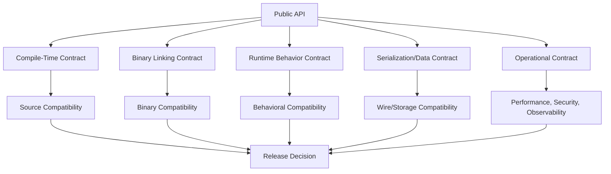
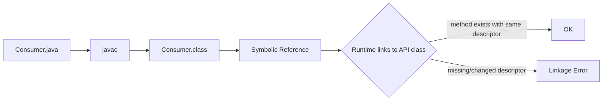
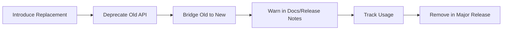
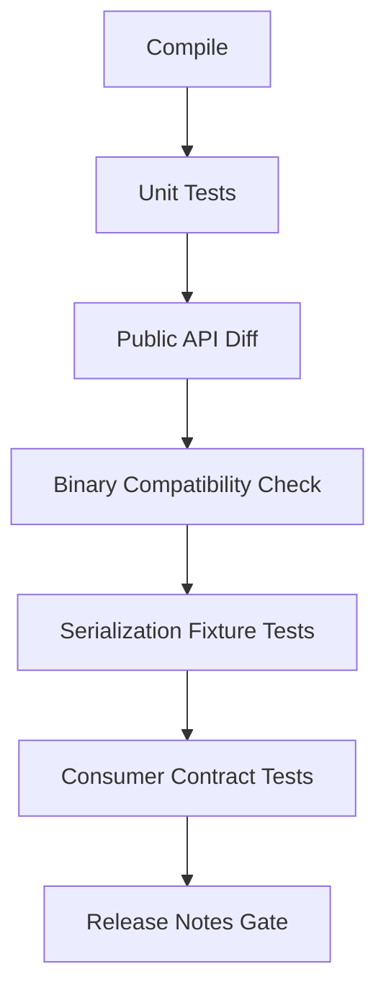
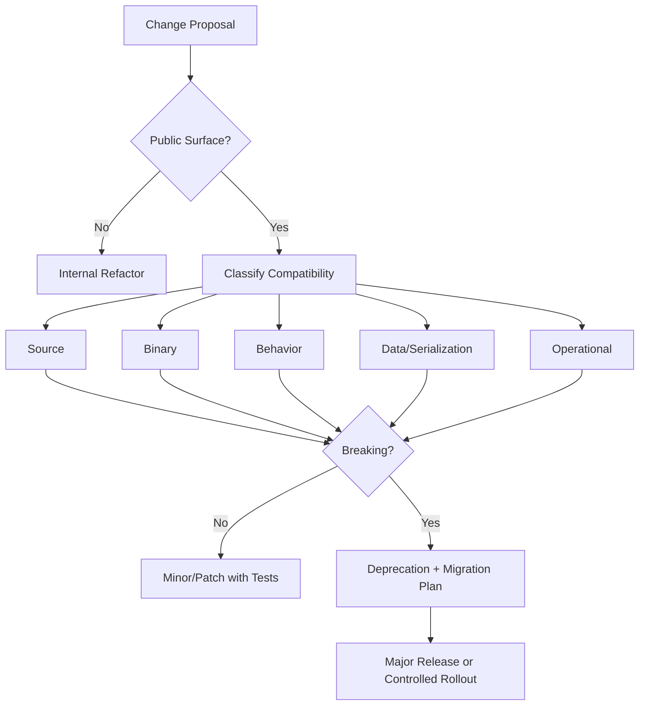

# Part 017 — API Evolution: Binary Compatibility, Source Compatibility, Serialization, dan Library Design

Part sebelumnya membahas **data-oriented programming**: records, sealed types, pattern matching, dan exhaustive handling. Sekarang kita naik satu level: setelah kamu bisa membuat model yang jelas, bagaimana model itu **bertahan ketika dipakai orang lain, module lain, service lain, atau versi aplikasi lain**?

Di production, API bukan sekadar method signature. API adalah kontrak jangka panjang.

Kontrak itu mencakup:

- apa yang bisa dipanggil;
- apa yang dikembalikan;
- exception apa yang mungkin terjadi;
- field mana yang stabil;
- class mana yang boleh di-extend;
- interface mana yang boleh diimplement;
- format data apa yang tidak boleh berubah sembarangan;
- performance characteristic yang sudah diandalkan consumer;
- behavior edge case yang sudah menjadi bagian dari ekspektasi.

Mental model utama part ini:



---

## 1. Target Pembelajaran

Setelah menyelesaikan part ini, kamu harus mampu:

1. Membedakan **source compatibility**, **binary compatibility**, **behavioral compatibility**, dan **serialization compatibility**.
2. Menjelaskan kenapa code yang masih compile belum tentu aman secara runtime.
3. Menjelaskan kenapa code yang masih link belum tentu aman secara behavior.
4. Mendesain API Java yang stabil, evolvable, dan tidak terlalu mengekspos detail internal.
5. Memahami risiko default method, overload, generic signature, records, sealed classes, dan exception contract.
6. Membuat deprecation dan migration strategy yang membantu consumer.
7. Menulis release checklist untuk library/internal platform API.
8. Menilai apakah perubahan API harus dianggap patch, minor, major, atau breaking migration.

---

## 2. Kaufman Frame: Skill yang Sebenarnya Dilatih

Kalau mengikuti framework *The First 20 Hours*, skill ini harus didekomposisi. “API design” terlalu abstrak. Skill operasional yang perlu dilatih adalah:

| Sub-skill | Bentuk latihan |
|---|---|
| Membaca API surface | Identifikasi class, method, constructor, fields, annotations, exceptions, generics, visibility |
| Menilai compatibility | Tentukan apakah perubahan aman tanpa recompile, aman dengan recompile, atau breaking |
| Mendesain extension point | Pilih interface, abstract class, sealed type, callback, strategy, atau composition |
| Menulis migration path | Buat replacement API, deprecation note, adapter, release note, dan test compatibility |
| Membatasi leak | Hindari mengekspos mutable collection, implementation class, internal enum, atau database concept |
| Menguji API evolution | Jalankan consumer lama terhadap binary baru, compile consumer baru terhadap API baru, dan regression test behavior |

Tujuan part ini bukan membuat API “cantik”. Tujuannya membuat API yang **tidak menjadi beban jangka panjang**.

---

## 3. API Surface: Apa Saja yang Sebenarnya Public?

Public API bukan hanya yang ditulis dengan modifier `public`.

Dalam sistem nyata, API surface mencakup:

1. `public` dan `protected` class/method/field.
2. Constructor yang bisa dipanggil consumer.
3. Interface yang diimplementasikan consumer.
4. Abstract class yang di-extend consumer.
5. Annotation yang dipakai consumer.
6. Enum constants yang disimpan di database atau dikirim di JSON.
7. Record components yang menjadi nama field JSON.
8. Exception type yang ditangkap consumer.
9. Package yang diekspor JPMS.
10. Reflection entry points.
11. Serialized form.
12. Configuration keys.
13. Environment variables.
14. Metric names.
15. Log field names jika dipakai downstream parser.
16. HTTP status codes dan error body.
17. Database migration contract.
18. Message schema.

Jadi, API evolution bukan hanya problem library. Ini juga problem microservice, platform internal, shared module, SDK, CLI, dan message-driven systems.

Rule of thumb:

> Semakin banyak consumer tidak kamu kontrol, semakin konservatif kamu harus memperlakukan perubahan.

---

## 4. Empat Jenis Compatibility yang Harus Dipisahkan

Banyak engineer mencampur semua compatibility menjadi satu pertanyaan: “breaking atau tidak?” Itu terlalu kasar.

Gunakan empat kategori utama.

### 4.1 Source Compatibility

Source compatibility berarti source code consumer masih bisa dikompilasi ulang terhadap versi API baru.

Contoh source-compatible:

```java
// v1
public class Money {
    public BigDecimal amount() { return amount; }
}

// v2: tambah method baru biasanya source-compatible
public class Money {
    public BigDecimal amount() { return amount; }
    public Currency currency() { return currency; }
}
```

Contoh source-breaking:

```java
// v1
public BigDecimal amount() { ... }

// v2
public long amount() { ... }
```

Consumer lama:

```java
BigDecimal value = money.amount();
```

Tidak compile lagi.

Namun source compatibility saja tidak cukup. Banyak deployment Java memakai dynamic linking terhadap class file lama.

---

### 4.2 Binary Compatibility

Binary compatibility berarti class file consumer yang sudah dikompilasi terhadap API lama masih bisa dijalankan dengan binary API baru tanpa linkage error.

Contoh sederhana:

```java
// consumer dikompilasi terhadap v1
invoice.total();
```

Saat runtime, consumer class file akan mencari method dengan owner, name, dan descriptor tertentu. Jika method itu hilang atau descriptor berubah, kamu bisa mendapat:

- `NoSuchMethodError`
- `NoSuchFieldError`
- `AbstractMethodError`
- `IllegalAccessError`
- `IncompatibleClassChangeError`

Binary compatibility penting untuk:

- library yang dipakai banyak service;
- plugin architecture;
- application server;
- dependency graph besar;
- transitive dependency upgrade;
- rolling deployment;
- framework yang load class via reflection;
- OSGi/JPMS/module systems;
- long-lived JVM process yang load extension.

Binary compatibility adalah pertanyaan:

> Apakah class file lama masih bisa link ke class file baru?

Bukan:

> Apakah source code lama masih compile?

---

### 4.3 Behavioral Compatibility

Behavioral compatibility berarti code lama masih mendapatkan perilaku yang secara semantik sama.

Contoh binary-compatible tapi behavioral-breaking:

```java
// v1
public List<Order> findOpenOrders() {
    return orders.stream()
            .filter(o -> o.status() == Status.OPEN)
            .toList();
}

// v2: method sama, binary compatible, source compatible
public List<Order> findOpenOrders() {
    return orders.stream()
            .filter(o -> o.status() != Status.CLOSED)
            .toList();
}
```

Signature tidak berubah. Consumer tetap compile dan link. Tapi behavior berubah.

Behavioral compatibility sering lebih penting daripada binary compatibility.

Contoh behavioral contract tersembunyi:

- urutan list selalu dari paling baru;
- method mengembalikan empty list, bukan `null`;
- exception thrown sebelum side effect;
- timeout default 2 detik;
- retry maksimal 3 kali;
- method idempotent;
- map key case-sensitive;
- `equals` hanya berdasarkan ID;
- cache TTL 5 menit;
- method thread-safe;
- callback dipanggil di thread caller;
- transaction rollback pada exception tertentu.

Jika consumer sudah mengandalkan behavior itu, perubahan bisa breaking walaupun compiler diam.

---

### 4.4 Serialization dan Wire Compatibility

Serialization compatibility berarti data yang ditulis oleh versi lama masih bisa dibaca oleh versi baru, atau sebaliknya sesuai kebutuhan.

Ini berlaku untuk:

- Java native serialization;
- JSON;
- XML;
- Avro;
- Protobuf;
- database row;
- Kafka message;
- cache entry;
- session object;
- HTTP API payload;
- file format.

Contoh perubahan yang tampak kecil tapi breaking:

```java
// v1
public record CustomerCreated(String customerId, String email) {}

// v2
public record CustomerCreated(String id, String email) {}
```

Untuk Java source, ini jelas berubah. Untuk JSON serialization default yang memakai nama component, ini juga mengubah field dari `customerId` ke `id`.

Data contract sering lebih stabil daripada class contract. Jangan menganggap record component name sebagai detail internal jika record itu menjadi DTO eksternal.

---

## 5. Binary Compatibility Mental Model

Java binary compatibility ditentukan oleh kemampuan runtime untuk resolve symbolic references di class file.

Secara konseptual, consumer lama menyimpan referensi seperti:

```text
owner: com.acme.billing.Invoice
name: total
descriptor: ()Ljava/math/BigDecimal;
```

Jika API baru mengubah return type menjadi `long`, descriptor berubah:

```text
()J
```

Maka class file lama tidak menemukan method lama.



Practical implication:

- Mengubah implementation body biasanya binary-compatible.
- Menambah method concrete ke class biasanya binary-compatible.
- Menghapus method public biasanya binary-breaking.
- Mengubah parameter type biasanya binary-breaking.
- Mengubah return type non-covariantly biasanya binary-breaking.
- Mengubah field menjadi method atau sebaliknya binary-breaking.
- Mengubah class menjadi interface atau interface menjadi class binary-breaking.
- Mengubah method instance menjadi static atau sebaliknya binary-breaking.
- Mengurangi visibility binary-breaking.

Tetapi “biasanya” bukan lisensi untuk sembarang ubah. Source dan behavior tetap perlu dicek.

---

## 6. Compatibility Matrix untuk Perubahan Umum

Gunakan matrix ini sebagai starting point, bukan sebagai hukum mutlak.

| Perubahan | Source | Binary | Behavior | Catatan |
|---|---:|---:|---:|---|
| Tambah method public concrete ke class | Aman | Aman | Biasanya aman | Bisa konflik dengan subclass method tertentu |
| Hapus method public | Breaking | Breaking | Breaking | Harus major/migration |
| Rename method | Breaking | Breaking | Breaking | Sama dengan delete + add |
| Ubah parameter type | Breaking | Breaking | Breaking | Descriptor berubah |
| Ubah return type | Biasanya breaking | Biasanya breaking | Breaking | Covariant return punya aturan khusus |
| Tambah overload | Kadang breaking | Biasanya aman | Bisa breaking | Bisa mengubah overload resolution saat recompile |
| Tambah default method ke interface | Kadang aman | Bisa berisiko | Bisa breaking | Risiko konflik dengan implementasi/multiple inheritance |
| Tambah abstract method ke interface | Breaking | Breaking | Breaking | Implementor lama bisa `AbstractMethodError` |
| Tambah enum constant | Biasanya aman | Aman | Bisa breaking | Switch exhaustive/default behavior risk |
| Hapus enum constant | Breaking | Bisa breaking | Breaking | Data lama juga bisa gagal |
| Rename enum constant | Breaking | Breaking/data breaking | Breaking | Jangan lakukan untuk value eksternal |
| Tambah field private | Aman | Aman | Bisa affect serialization | Jika native serialization, hati-hati |
| Ubah `public` jadi `protected`/package/private | Breaking | Breaking | Breaking | Access error |
| Ubah mutable return jadi immutable return | Source aman | Binary aman | Bisa breaking | Consumer mungkin mutate result |
| Ubah `null` menjadi empty list | Biasanya aman | Aman | Bisa breaking | Jika consumer membedakan null |
| Ubah empty list menjadi null | Source aman | Binary aman | Breaking | Hampir selalu buruk |
| Ubah ordering list | Source aman | Binary aman | Bisa breaking | Ordering sering implicit contract |
| Ubah exception unchecked | Source aman | Binary aman | Bisa breaking | Consumer runtime flow berubah |
| Tambah checked exception | Source breaking | Binary nuance | Breaking | Caller harus handle saat compile |
| Hapus checked exception | Source nuance | Aman | Bisa breaking | Override/catch logic bisa berubah |
| Ubah record component name | Breaking | Breaking | Data breaking | Accessor berubah |
| Tambah record component | Breaking | Breaking | Data breaking | Canonical constructor berubah |
| Permit subtype baru pada sealed hierarchy | Source bisa breaking | Binary biasanya aman | Exhaustiveness breaking saat recompile | Switch exhaustive perlu update |

---

## 7. Source Compatibility Trap: Overload Resolution

Overload terlihat nyaman, tetapi overload bisa mengubah meaning saat consumer dikompilasi ulang.

Contoh:

```java
// v1
public void submit(Object command) {
    System.out.println("object");
}
```

Consumer:

```java
submit(null);
```

Sekarang v2 menambah overload:

```java
public void submit(Object command) { }
public void submit(String command) { }
```

Saat consumer dikompilasi ulang, `submit(null)` memilih overload paling spesifik yaitu `String`.

Artinya:

- binary lama mungkin tetap memanggil descriptor lama;
- source baru bisa memilih method berbeda;
- behavior bisa berubah tanpa perubahan source consumer.

Avoid overload jika parameter memiliki relasi subtype yang membingungkan:

```java
submit(Object value)
submit(String value)
submit(CharSequence value)
submit(Serializable value)
submit(Collection<String> value)
submit(List<String> value)
```

Lebih baik pakai nama eksplisit:

```java
submitRaw(Object value)
submitText(String value)
submitItems(List<String> items)
```

API clarity lebih penting daripada terlihat “elegan”.

---

## 8. Interface Evolution: Default Method Bukan Magic Compatibility

Java 8 memperkenalkan default method agar interface bisa berevolusi tanpa selalu memecahkan implementor lama.

Contoh:

```java
public interface CaseRepository {
    Optional<Case> findById(CaseId id);

    default Case getRequired(CaseId id) {
        return findById(id).orElseThrow(() -> new NoSuchElementException("Case not found: " + id));
    }
}
```

Ini sering aman, tetapi tidak selalu.

Risiko default method:

### 8.1 Conflict dengan Interface Lain

```java
interface A {
    default String name() { return "A"; }
}

interface B {
    default String name() { return "B"; }
}

class C implements A, B {
    // harus override karena konflik
}
```

Jika consumer sudah punya class yang mengimplementasi dua interface, lalu salah satu versi baru menambah default method dengan signature sama, source consumer bisa mulai gagal compile.

### 8.2 Mengunci Semantik yang Salah

Default method sering dibuat dengan asumsi minimal. Namun setelah dipakai consumer, behavior default menjadi contract.

```java
default List<Case> findAllOpen() {
    return findAll().stream()
            .filter(Case::isOpen)
            .toList();
}
```

Jika `findAll()` mahal, default method ini bisa menjadi performance trap.

### 8.3 Menambah Method yang Harusnya Implementor-Specific

Jika method butuh database query spesifik, jangan dipaksa sebagai default method berbasis `findAll()`.

Lebih baik:

```java
interface CaseQueryService {
    List<Case> findOpenCases(CaseSearchCriteria criteria);
}
```

Gunakan default method untuk:

- convenience yang benar-benar universal;
- composition kecil di atas method existing;
- behavior yang murah dan deterministic;
- backward compatible helper.

Jangan gunakan default method untuk menyembunyikan operasi mahal.

---

## 9. Abstract Class vs Interface vs Sealed Interface sebagai Extension Point

Memilih extension point adalah keputusan API jangka panjang.

### 9.1 Interface

Gunakan interface ketika:

- consumer boleh menyediakan implementasi sendiri;
- contract bisa dijelaskan tanpa state internal;
- multiple implementation masuk akal;
- kamu siap mendukung implementor eksternal.

Contoh:

```java
public interface RiskScorer {
    RiskScore score(CaseSnapshot snapshot);
}
```

Risiko:

- sulit menambah abstract method;
- default method harus hati-hati;
- semua method public;
- implementor eksternal bisa melakukan hal yang tidak kamu prediksi.

### 9.2 Abstract Class

Gunakan abstract class ketika:

- kamu butuh shared state atau template method;
- kamu ingin mengontrol sebagian lifecycle;
- kamu ingin protected extension point;
- inheritance memang bagian dari desain.

Contoh:

```java
public abstract class AbstractEscalationPolicy {
    public final EscalationDecision evaluate(CaseSnapshot snapshot) {
        validate(snapshot);
        return doEvaluate(snapshot);
    }

    protected abstract EscalationDecision doEvaluate(CaseSnapshot snapshot);

    private void validate(CaseSnapshot snapshot) {
        Objects.requireNonNull(snapshot, "snapshot");
    }
}
```

Risiko:

- single inheritance;
- fragile base class problem;
- protected methods menjadi API;
- constructor order bisa rumit.

### 9.3 Sealed Interface/Class

Gunakan sealed type ketika:

- variasi domain harus dibatasi;
- kamu ingin exhaustive switch;
- consumer boleh membaca varian, tapi tidak boleh menambah varian sembarangan;
- correctness lebih penting daripada open extension.

Contoh:

```java
public sealed interface EnforcementDecision
        permits Approve, Reject, Escalate, RequestMoreInfo {
}

public record Approve(String reason) implements EnforcementDecision {}
public record Reject(String reason) implements EnforcementDecision {}
public record Escalate(String queue, String reason) implements EnforcementDecision {}
public record RequestMoreInfo(List<String> missingItems) implements EnforcementDecision {}
```

Risiko:

- menambah subtype baru dapat memaksa consumer memperbarui exhaustive switch saat compile;
- tidak cocok untuk plugin ecosystem yang butuh open extension;
- module/package boundary perlu dipikirkan.

---

## 10. Records sebagai API Surface

Records sangat cocok untuk data transparan. Tetapi jika record menjadi public API, setiap component adalah contract.

```java
public record CaseSummary(
        String caseId,
        String subject,
        CaseStatus status,
        Instant createdAt
) {}
```

Public surface record mencakup:

- canonical constructor;
- accessor `caseId()`;
- accessor `subject()`;
- accessor `status()`;
- accessor `createdAt()`;
- `equals`;
- `hashCode`;
- `toString`;
- component names;
- component order;
- serialized/JSON mapping jika dipakai framework.

Perubahan berikut biasanya breaking:

```java
// Rename component
caseId -> id

// Ubah type
Instant createdAt -> LocalDateTime createdAt

// Tambah component
String assignedOfficer

// Hapus component
subject
```

Records bukan entity mutable. Jangan expose record jika kamu butuh:

- lazy-loaded field;
- identity mutable lifecycle;
- partial construction rumit;
- invariant yang butuh state transition;
- compatibility jangka panjang dengan optional fields yang sering berubah.

Untuk API eksternal, pertimbangkan DTO evolvable:

```java
public final class CaseSummaryDto {
    private final String caseId;
    private final String subject;
    private final String status;
    private final Instant createdAt;
    private final Map<String, Object> extensions;

    // constructor, getters, builder
}
```

Atau gunakan record internal, lalu mapping eksplisit ke wire schema.

---

## 11. Enum Evolution: Sederhana tapi Berbahaya

Enum sering dianggap aman. Padahal enum menjadi kontrak kuat jika disimpan di database atau dikirim sebagai JSON.

```java
public enum CaseStatus {
    DRAFT,
    SUBMITTED,
    UNDER_REVIEW,
    CLOSED
}
```

Perubahan berisiko:

- rename constant;
- delete constant;
- reuse meaning constant lama;
- mengubah mapping ke string/code;
- menambah constant jika consumer punya switch tanpa default yang tidak siap;
- mengubah ordering jika ordinal dipakai.

Jangan simpan ordinal enum di database.

Buruk:

```java
@Enumerated(EnumType.ORDINAL)
private CaseStatus status;
```

Lebih aman:

```java
@Enumerated(EnumType.STRING)
private CaseStatus status;
```

Lebih defensible untuk domain yang butuh stability:

```java
public enum CaseStatus {
    DRAFT("DRAFT"),
    SUBMITTED("SUBMITTED"),
    UNDER_REVIEW("UNDER_REVIEW"),
    CLOSED("CLOSED");

    private final String code;

    CaseStatus(String code) {
        this.code = code;
    }

    public String code() {
        return code;
    }
}
```

Jika status externally visible, code adalah API. Jangan ubah tanpa migration.

---

## 12. Exception Contract

Exception adalah bagian dari API.

Contoh buruk:

```java
public Case getCase(String id) {
    return repository.findById(id).get();
}
```

Consumer bisa melihat `NoSuchElementException`, tetapi exception itu tidak menjelaskan domain.

Lebih baik:

```java
public Case getCase(CaseId id) {
    return repository.findById(id)
            .orElseThrow(() -> new CaseNotFoundException(id));
}
```

Exception contract harus menjawab:

1. Exception apa yang bisa terjadi karena input invalid?
2. Exception apa yang bisa terjadi karena state domain?
3. Exception apa yang bisa terjadi karena dependency gagal?
4. Exception mana yang retryable?
5. Exception mana yang boleh ditampilkan ke caller?
6. Exception mana yang harus memicu rollback?

Contoh taxonomy:

```java
public sealed class CaseServiceException extends RuntimeException
        permits CaseNotFoundException,
                CaseAlreadyClosedException,
                CaseConflictException,
                CaseDependencyException {

    protected CaseServiceException(String message) {
        super(message);
    }
}
```

Namun hati-hati: sealed exception hierarchy menjadi public closed hierarchy. Menambah subclass baru bisa berdampak pada pattern switch consumer.

---

## 13. Nullability sebagai Contract

Java belum memiliki nullability type system standar di language level. Jadi nullability harus dibuat eksplisit lewat desain.

Buruk:

```java
public String assignedOfficerId();
```

Apakah bisa null? Tidak jelas.

Lebih eksplisit:

```java
public Optional<OfficerId> assignedOfficerId();
```

Atau jika field wajib:

```java
public OfficerId assignedOfficerId();
```

Dengan constructor validation:

```java
public Assignment(OfficerId assignedOfficerId) {
    this.assignedOfficerId = Objects.requireNonNull(assignedOfficerId, "assignedOfficerId");
}
```

Rule praktis:

- Jangan return `null` untuk collection. Return empty collection.
- Jangan return `null` untuk Optional. Itu double failure.
- Jangan pakai Optional untuk field entity JPA tanpa alasan kuat.
- Jangan pakai Optional untuk parameter public API jika overload/nama method lebih jelas.
- Dokumentasikan nullability untuk interop dengan framework.

---

## 14. Collection Return Contract

Ketika API mengembalikan collection, contract tidak hanya type-nya.

```java
public List<CaseSummary> searchCases(CaseSearchCriteria criteria);
```

Pertanyaan contract:

- Apakah list bisa null?
- Apakah list mutable?
- Apakah order stabil?
- Apakah duplicate mungkin?
- Apakah list lazy?
- Apakah list snapshot atau live view?
- Apakah size dibatasi?
- Apakah pagination wajib?
- Apakah caller boleh menyimpan list?

Contoh buruk:

```java
public List<CaseSummary> cases() {
    return internalCases;
}
```

Consumer bisa mutate internal state.

Lebih baik:

```java
public List<CaseSummary> cases() {
    return List.copyOf(internalCases);
}
```

Namun `List.copyOf` menolak null element. Jika data lama bisa berisi null, ini mengubah behavior. Refactor seperti ini perlu regression test.

Jika order penting, tulis di contract:

```java
/**
 * Returns cases ordered by creation time descending.
 * Never returns null. The returned list is immutable.
 */
public List<CaseSummary> findRecentCases(CaseSearchCriteria criteria) { ... }
```

---

## 15. Generic API Evolution

Generics meningkatkan type safety, tetapi perubahan generic signature bisa source-breaking.

Contoh:

```java
// v1
public List findAll();

// v2
public List<Case> findAll();
```

Karena type erasure, binary mungkin tetap kompatibel. Namun source warnings berubah. Untuk API lama, migrasi raw type ke generic perlu hati-hati.

Contoh lain:

```java
// v1
public void process(List<Case> cases) { }

// v2
public void process(Collection<Case> cases) { }
```

Secara desain v2 lebih umum, tetapi descriptor berubah dari `List` ke `Collection`. Binary consumer lama bisa gagal link.

Solusi evolusi:

```java
public void process(List<Case> cases) {
    processCollection(cases);
}

public void processCollection(Collection<Case> cases) {
    // new implementation
}
```

Atau gunakan nama baru, deprecate method lama, dan hapus di major release.

Wildcard API:

```java
public void publishAll(Collection<? extends DomainEvent> events) { }
```

Ini memudahkan consumer mengirim subtype collection. Tapi jangan berlebihan sampai signature sulit dibaca.

---

## 16. Builder Pattern untuk Evolvable Parameter

Method dengan banyak parameter sulit dievolusi.

Buruk:

```java
public Case createCase(
        String subject,
        String description,
        String reporterId,
        String departmentId,
        boolean urgent,
        Instant submittedAt
) { ... }
```

Masalah:

- parameter order rawan salah;
- tambah parameter breaking;
- overload menjadi rumit;
- optional parameter tidak jelas;
- default value tersebar.

Lebih baik:

```java
public final class CreateCaseCommand {
    private final String subject;
    private final String description;
    private final ReporterId reporterId;
    private final DepartmentId departmentId;
    private final boolean urgent;
    private final Instant submittedAt;

    private CreateCaseCommand(Builder builder) {
        this.subject = Objects.requireNonNull(builder.subject, "subject");
        this.description = builder.description;
        this.reporterId = Objects.requireNonNull(builder.reporterId, "reporterId");
        this.departmentId = Objects.requireNonNull(builder.departmentId, "departmentId");
        this.urgent = builder.urgent;
        this.submittedAt = builder.submittedAt != null ? builder.submittedAt : Instant.now();
    }

    public static Builder builder(String subject, ReporterId reporterId) {
        return new Builder(subject, reporterId);
    }

    public static final class Builder {
        private final String subject;
        private final ReporterId reporterId;
        private String description;
        private DepartmentId departmentId;
        private boolean urgent;
        private Instant submittedAt;

        private Builder(String subject, ReporterId reporterId) {
            this.subject = subject;
            this.reporterId = reporterId;
        }

        public Builder description(String description) {
            this.description = description;
            return this;
        }

        public Builder departmentId(DepartmentId departmentId) {
            this.departmentId = departmentId;
            return this;
        }

        public Builder urgent(boolean urgent) {
            this.urgent = urgent;
            return this;
        }

        public Builder submittedAt(Instant submittedAt) {
            this.submittedAt = submittedAt;
            return this;
        }

        public CreateCaseCommand build() {
            return new CreateCaseCommand(this);
        }
    }
}
```

Builder bisa menambah optional field tanpa memecahkan caller lama.

Namun jangan gunakan builder untuk semua hal. Untuk value kecil, record tetap lebih jelas:

```java
public record CaseId(String value) {
    public CaseId {
        if (value == null || value.isBlank()) {
            throw new IllegalArgumentException("CaseId must not be blank");
        }
    }
}
```

---

## 17. Serialization Compatibility

Java native serialization punya aturan versioning sendiri. Jika class mengimplementasikan `Serializable`, serialized form menjadi API.

```java
public final class CaseSnapshot implements Serializable {
    private static final long serialVersionUID = 1L;

    private final String caseId;
    private final String status;
}
```

`serialVersionUID` menyatakan versi serialized form yang kompatibel. Jika tidak dideklarasikan, runtime menghitung default berdasarkan detail class. Itu membuat perubahan kecil bisa menyebabkan `InvalidClassException`.

Dalam sistem modern, gunakan Java native serialization dengan sangat hati-hati. Hindari untuk boundary eksternal.

Lebih defensible:

- JSON untuk human-readable boundary;
- Protobuf/Avro untuk schema-managed binary boundary;
- explicit DTO untuk persistence/cache;
- migration-aware schema registry untuk event streaming;
- custom serialization format yang diuji compatibility-nya.

Jika tetap harus memakai `Serializable`:

1. Deklarasikan `serialVersionUID` eksplisit.
2. Jangan serialize entity domain langsung.
3. Gunakan serialization proxy pattern untuk object kompleks.
4. Tambahkan compatibility test dengan serialized fixture lama.
5. Jangan deserialize untrusted input.

Contoh compatibility test:

```java
@Test
void canReadVersion1Snapshot() throws Exception {
    try (var in = new ObjectInputStream(
            getClass().getResourceAsStream("/fixtures/case-snapshot-v1.bin"))) {
        var snapshot = (CaseSnapshot) in.readObject();
        assertThat(snapshot.caseId()).isEqualTo("CASE-001");
    }
}
```

---

## 18. Behavioral Compatibility: Yang Paling Sering Diabaikan

Behavioral compatibility biasanya tidak terdeteksi oleh compiler atau binary compatibility checker.

Contoh:

```java
// v1
public boolean canEscalate(Case c) {
    return c.status() == SUBMITTED || c.status() == UNDER_REVIEW;
}

// v2
public boolean canEscalate(Case c) {
    return c.status() == UNDER_REVIEW;
}
```

Tidak ada signature berubah. Tapi policy berubah.

Behavioral contract harus diuji dengan:

- golden master test;
- approval test;
- compatibility fixture;
- consumer-driven contract test;
- property-based test untuk invariants;
- migration scenario test.

Contoh invariant:

```java
@Property
void closedCaseCannotBeEscalated(CaseSnapshot snapshot) {
    assumeThat(snapshot.status()).isEqualTo(CaseStatus.CLOSED);
    assertThat(policy.canEscalate(snapshot)).isFalse();
}
```

Behavioral compatibility juga mencakup performance.

Jika v1 method O(1), lalu v2 menjadi O(n) terhadap data besar, consumer bisa rusak di production walaupun test kecil lulus.

---

## 19. API Documentation sebagai Contract

Dokumentasi bukan kosmetik. Dokumentasi adalah bagian dari compatibility.

Dokumentasikan minimal:

- nullability;
- mutability;
- ordering;
- thread-safety;
- exception;
- idempotency;
- timeouts;
- resource ownership;
- lifecycle;
- performance expectation;
- security assumptions;
- versioning/deprecation.

Contoh Javadoc yang berguna:

```java
/**
 * Finds cases matching the given criteria.
 *
 * <p>The returned list is never {@code null}, is immutable, and is ordered by
 * creation time descending. The method returns at most {@code limit} items.
 *
 * <p>This method does not lock cases and does not guarantee that returned cases
 * remain open after this method returns.
 *
 * @throws IllegalArgumentException if {@code criteria.limit()} is less than 1
 * @throws CaseRepositoryException if the backing store cannot be queried
 */
public List<CaseSummary> findCases(CaseSearchCriteria criteria) { ... }
```

Javadoc harus menjawab pertanyaan consumer, bukan mengulang nama method.

Buruk:

```java
/**
 * Gets case.
 */
Case getCase(String id);
```

Tidak ada contract.

---

## 20. Deprecation Strategy

Deprecation yang baik bukan sekadar annotation.

Buruk:

```java
@Deprecated
public Case find(String id) { ... }
```

Lebih baik:

```java
/**
 * @deprecated since 2.4. Use {@link #findById(CaseId)} instead.
 * This method accepts raw string identifiers and will be removed in 3.0.
 */
@Deprecated(since = "2.4", forRemoval = true)
public Case find(String id) { ... }
```

Deprecation harus menjelaskan:

1. Sejak versi berapa.
2. Apa penggantinya.
3. Kenapa diganti.
4. Apakah behavior sama.
5. Kapan akan dihapus.
6. Bagaimana migrasi otomatis/manual.

Strategi aman:



Jika API internal digunakan banyak team, tambahkan usage telemetry atau static code search sebelum removal.

---

## 21. Semantic Versioning untuk Java Library

Semantic versioning umum:

```text
MAJOR.MINOR.PATCH
```

Interpretasi praktis:

- PATCH: bug fix compatible.
- MINOR: fitur baru compatible.
- MAJOR: breaking changes.

Tetapi untuk Java, jangan hanya pakai compile check. Pertimbangkan compatibility matrix:

| Change type | Patch | Minor | Major |
|---|---:|---:|---:|
| Bug fix tanpa behavior surprise | Ya | Ya | Ya |
| Tambah method concrete aman | Tidak selalu | Ya | Ya |
| Tambah enum constant eksternal | Hati-hati | Mungkin | Ya |
| Ubah exception behavior | Hati-hati | Mungkin | Mungkin |
| Hapus public API | Tidak | Tidak | Ya |
| Rename public API | Tidak | Tidak | Ya |
| Ubah serialized/wire schema breaking | Tidak | Tidak | Ya |
| Performance regression besar | Tidak | Tidak | Tidak boleh tanpa warning |

SemVer bukan pengganti judgment. SemVer adalah cara mengomunikasikan risiko.

---

## 22. Compatibility Testing Tooling

Untuk library Java, tambahkan automated compatibility check.

Tool yang sering dipakai:

- `japicmp` untuk membandingkan binary API antar JAR.
- `Revapi` untuk API difference analysis.
- `jdeps` untuk dependency dan JDK internal API analysis.
- `jdeprscan` untuk deprecated JDK API usage.
- Maven Enforcer untuk dependency convergence.
- Gradle dependency locking/version catalog.
- Error Prone/NullAway untuk static checks.

Pipeline ideal:



Contoh policy:

```text
A release cannot be published if:
- public API diff contains breaking removal;
- binary compatibility check fails;
- serialized fixture test fails;
- migration note is missing for deprecated API;
- release notes omit behavior change.
```

---

## 23. Internal API vs Public API

Di Java 9+, JPMS membantu membedakan package yang diekspor dan tidak.

```java
module com.acme.caseengine {
    exports com.acme.caseengine.api;
    exports com.acme.caseengine.model;

    // not exported:
    // com.acme.caseengine.internal
}
```

Namun di banyak codebase non-JPMS, boundary harus dijaga lewat convention:

```text
com.acme.caseengine.api
com.acme.caseengine.model
com.acme.caseengine.spi
com.acme.caseengine.internal
```

Aturan:

- `api`: dipakai consumer umum.
- `spi`: dipakai implementor/plugin.
- `internal`: tidak boleh dipakai consumer.
- `impl`: detail implementation.

Tapi nama package saja tidak cukup. CI bisa melarang dependency ke package internal.

Contoh ArchUnit style:

```java
noClasses()
    .that().resideOutsideOfPackage("..caseengine..")
    .should().accessClassesThat().resideInAPackage("..caseengine.internal..");
```

---

## 24. SPI Design: Ketika Consumer Mengimplementasikan Interface Kamu

SPI lebih berisiko daripada API biasa karena consumer membuat implementation.

Contoh:

```java
public interface EscalationRuleProvider {
    List<EscalationRule> rulesFor(DepartmentId departmentId);
}
```

Jika kamu menambah abstract method:

```java
public interface EscalationRuleProvider {
    List<EscalationRule> rulesFor(DepartmentId departmentId);
    boolean supports(CaseType caseType);
}
```

Semua implementor lama rusak.

Strategi evolusi SPI:

### 24.1 Tambahkan Sub-interface Baru

```java
public interface EscalationRuleProviderV2 extends EscalationRuleProvider {
    boolean supports(CaseType caseType);
}
```

Runtime bisa detect:

```java
if (provider instanceof EscalationRuleProviderV2 v2) {
    return v2.supports(caseType);
}
return true;
```

### 24.2 Gunakan Capability Object

```java
public interface RuleProviderCapabilities {
    boolean supportsCaseTypeFiltering();
}
```

### 24.3 Gunakan Context Object yang Bisa Bertambah

```java
public interface EscalationRuleProvider {
    List<EscalationRule> rulesFor(EscalationContext context);
}
```

Context object bisa berevolusi lebih baik daripada parameter list panjang.

---

## 25. Public Constructors dan Factory Methods

Constructor adalah API yang sulit dievolusi.

```java
public CaseService(CaseRepository repository, Clock clock) { ... }
```

Jika nanti butuh `AuditLogger`, menambah parameter constructor breaking.

Opsi:

### 25.1 Static Factory

```java
public static CaseService create(CaseRepository repository) {
    return new CaseService(repository, Clock.systemUTC(), AuditLogger.noop());
}
```

### 25.2 Builder

```java
CaseService service = CaseService.builder(repository)
        .clock(clock)
        .auditLogger(auditLogger)
        .build();
```

### 25.3 Dependency Injection Internal

Untuk aplikasi, constructor injection tetap baik. Untuk library public, pikirkan evolusi constructor.

Rule:

- Public constructor cocok untuk value object kecil.
- Public factory cocok untuk class dengan lifecycle/config default.
- Builder cocok untuk object dengan banyak optional dependencies/config.

---

## 26. Time, Clock, dan Compatibility

Time sering masuk API tanpa sadar.

Buruk:

```java
public boolean isExpired() {
    return Instant.now().isAfter(expiresAt);
}
```

Testing sulit. Behavior tergantung wall-clock.

Lebih baik:

```java
public boolean isExpired(Clock clock) {
    return Instant.now(clock).isAfter(expiresAt);
}
```

Atau di service:

```java
public final class TokenService {
    private final Clock clock;

    public TokenService(Clock clock) {
        this.clock = Objects.requireNonNull(clock);
    }
}
```

API yang memakai time harus jelas:

- timezone apa;
- precision apa;
- inclusive/exclusive boundary;
- clock source apa;
- expiry behavior apa;
- apakah monotonic time dibutuhkan.

`Instant` cocok untuk timestamp global. `LocalDateTime` tidak punya timezone dan sering berbahaya untuk event timestamp lintas sistem.

---

## 27. Thread-Safety sebagai API Contract

Thread-safety harus eksplisit.

Contoh class immutable:

```java
public final class RiskScore {
    private final BigDecimal value;

    public RiskScore(BigDecimal value) {
        this.value = Objects.requireNonNull(value);
    }

    public BigDecimal value() {
        return value;
    }
}
```

Contoh class not thread-safe:

```java
/**
 * Not thread-safe. Create a new instance per request.
 */
public final class CaseImportBuilder {
    private final List<CaseDraft> drafts = new ArrayList<>();
}
```

Contoh class thread-safe:

```java
/**
 * Thread-safe. Instances may be shared across requests.
 */
public final class CaseIdGenerator {
    private final AtomicLong sequence = new AtomicLong();
}
```

Jika kamu mengubah thread-safety property, itu behavioral breaking.

Contoh:

- v1 service stateless dan thread-safe;
- v2 menambah mutable cache non-synchronized;
- API tidak berubah, tapi production bisa race.

---

## 28. Performance sebagai Compatibility

Public API punya performance expectation.

Contoh:

```java
public Optional<Case> findById(CaseId id)
```

Consumer mungkin mengasumsikan ini indexed lookup. Jika v2 berubah menjadi scan semua data, signature tetap sama tapi production rusak.

Dokumentasikan jika penting:

```java
/**
 * Performs an indexed lookup by case id. Expected to be O(1) or O(log n)
 * depending on repository implementation.
 */
Optional<Case> findById(CaseId id);
```

Tidak semua API harus punya Big-O di Javadoc, tetapi collection-like API perlu.

Contoh performance-breaking changes:

- eager loading dari yang dulu lazy;
- lazy loading dari yang dulu eager jika caller butuh deterministic failure;
- menambah remote call tersembunyi;
- menambah synchronous audit write;
- mengubah cache policy;
- mengubah list sorting dari database ke in-memory;
- mengganti immutable copy dengan live view;
- menambah locking coarse-grained;
- mengganti streaming dengan materialization penuh.

---

## 29. Designing for Migration

API yang baik punya jalan migrasi.

Contoh v1:

```java
public Case find(String id) { ... }
```

Target v2:

```java
public Optional<Case> findById(CaseId id) { ... }
```

Migration path:

```java
/**
 * @deprecated since 2.3. Use {@link #findById(CaseId)}.
 */
@Deprecated(since = "2.3", forRemoval = true)
public Case find(String id) {
    return findById(new CaseId(id))
            .orElseThrow(() -> new CaseNotFoundException(new CaseId(id)));
}
```

Release notes:

```md
### Deprecated

- `CaseService.find(String)` is deprecated since 2.3 and will be removed in 3.0.
  Use `CaseService.findById(CaseId)` instead.

### Migration

Before:

```java
Case c = service.find("CASE-1");
```

After:

```java
Case c = service.findById(new CaseId("CASE-1"))
        .orElseThrow(() -> new CaseNotFoundException(new CaseId("CASE-1")));
```
```

Good migration docs include before/after snippets.

---

## 30. Compatibility Review Checklist

Sebelum release library/API baru, jawab pertanyaan ini.

### 30.1 Public Surface

- Apakah ada public/protected class baru?
- Apakah ada method/constructor/field public baru?
- Apakah ada package baru yang diekspor?
- Apakah ada annotation baru?
- Apakah ada enum constant baru?
- Apakah ada record component berubah?
- Apakah ada exception type berubah?

### 30.2 Binary Compatibility

- Apakah ada method dihapus?
- Apakah descriptor method berubah?
- Apakah field dihapus/diubah?
- Apakah visibility dikurangi?
- Apakah class berubah menjadi interface atau sebaliknya?
- Apakah method instance berubah static atau sebaliknya?
- Apakah superclass berubah?

### 30.3 Source Compatibility

- Apakah overload baru bisa mengubah overload resolution?
- Apakah generics berubah?
- Apakah checked exception berubah?
- Apakah interface implementor perlu menambah method?
- Apakah sealed hierarchy berubah sehingga exhaustive switch consumer perlu update?

### 30.4 Behavioral Compatibility

- Apakah ordering berubah?
- Apakah null/empty semantics berubah?
- Apakah mutability return berubah?
- Apakah exception timing berubah?
- Apakah retry/timeout/default berubah?
- Apakah thread-safety berubah?
- Apakah idempotency berubah?
- Apakah performance characteristic berubah?

### 30.5 Data Compatibility

- Apakah JSON field name berubah?
- Apakah enum string berubah?
- Apakah database column semantics berubah?
- Apakah event schema berubah?
- Apakah serialized form berubah?
- Apakah cache key/value format berubah?

### 30.6 Migration Support

- Apakah replacement API tersedia sebelum old API dihapus?
- Apakah old API dibridge ke new implementation?
- Apakah deprecation punya `since` dan `forRemoval`?
- Apakah release notes punya before/after?
- Apakah consumer impact dipetakan?
- Apakah ada rollback strategy?

---

## 31. Practice: API Evolution Lab

Buat module kecil:

```text
case-api-v1
case-api-v2
case-consumer
```

### Step 1 — Buat API v1

```java
package com.acme.caseapi;

public interface CaseService {
    Case find(String id);
    List<Case> findOpenCases();
}

public record Case(String id, String status) {}
```

### Step 2 — Compile consumer terhadap v1

```java
CaseService service = ...;
Case c = service.find("CASE-1");
System.out.println(c.id());
```

### Step 3 — Buat perubahan v2 satu per satu

Coba:

1. Rename `find` menjadi `findById`.
2. Ubah return `Case` menjadi `Optional<Case>`.
3. Tambah overload `find(CaseId id)`.
4. Tambah component `Instant createdAt` ke record `Case`.
5. Tambah method abstract ke interface.
6. Tambah default method ke interface.
7. Ubah `List<Case>` menjadi `Collection<Case>`.
8. Ubah ordering `findOpenCases`.

### Step 4 — Uji dua mode

- Compile consumer source terhadap v2.
- Jalankan binary consumer lama terhadap v2 tanpa recompile.

Catat hasil:

| Change | Source result | Binary result | Behavior result | Decision |
|---|---|---|---|---|
| Rename method | fail | fail | fail | major |
| Add default method | pass? | pass? | inspect | minor with caution |

Ini latihan penting. Banyak engineer senior baru benar-benar memahami compatibility setelah melihat `NoSuchMethodError` sendiri.

---

## 32. Anti-Pattern API Design

### 32.1 Expose Implementation Class

Buruk:

```java
public ArrayList<Case> findCases() { ... }
```

Lebih baik:

```java
public List<Case> findCases() { ... }
```

### 32.2 Return Mutable Internal State

Buruk:

```java
return this.cases;
```

Lebih baik:

```java
return List.copyOf(this.cases);
```

### 32.3 Raw String untuk Domain Identifier

Buruk:

```java
findCase(String id)
```

Lebih baik:

```java
findCase(CaseId id)
```

### 32.4 Boolean Parameter yang Tidak Menjelaskan Intent

Buruk:

```java
submit(caseId, true, false);
```

Lebih baik:

```java
submit(caseId, SubmitOptions.builder()
        .urgent(true)
        .notifyReporter(false)
        .build());
```

### 32.5 Catch-All Map API

Buruk:

```java
createCase(Map<String, Object> payload)
```

Kadang perlu di boundary dinamis, tetapi buruk sebagai domain API.

Lebih baik:

```java
createCase(CreateCaseCommand command)
```

### 32.6 Exception Leakage

Buruk:

```java
throws SQLException
```

di API domain service.

Lebih baik:

```java
throws CaseRepositoryException
```

atau unchecked domain infrastructure exception dengan cause.

---

## 33. Top-Tier Engineering Judgment

Engineer top-tier tidak hanya bertanya:

> Apakah ini compile?

Mereka bertanya:

1. Siapa consumer API ini?
2. Apakah consumer dikompilasi ulang bersama kita?
3. Apakah consumer menjalankan binary lama dengan dependency baru?
4. Apakah ada data lama yang harus tetap bisa dibaca?
5. Apakah enum/status ini sudah tersimpan di database?
6. Apakah exception ini sudah ditangkap caller?
7. Apakah ordering ini sudah diandalkan UI/test/report?
8. Apakah performance profile berubah?
9. Apakah API ini akan sulit dihapus?
10. Apakah ada migration path yang murah?

API design yang matang adalah desain yang memperhitungkan waktu.

---

## 34. Ringkasan Mental Model



Inti part ini:

- API adalah kontrak jangka panjang.
- Compatibility punya beberapa dimensi.
- Binary compatible belum tentu source compatible.
- Source compatible belum tentu behavioral compatible.
- Behavioral compatibility sering paling mahal jika rusak.
- Records, sealed types, default methods, overloads, dan enums punya dampak API yang besar.
- Migration path adalah bagian dari desain, bukan pekerjaan dokumentasi belakangan.

---

## 35. Checklist Hafalan Cepat

Sebelum mengubah API Java, tanya:

1. Apakah ada consumer eksternal?
2. Apakah perubahan ini mengubah method descriptor?
3. Apakah binary lama masih bisa link?
4. Apakah source lama masih compile?
5. Apakah behavior lama tetap sama?
6. Apakah data lama masih bisa dibaca?
7. Apakah exception contract berubah?
8. Apakah nullability/mutability/ordering berubah?
9. Apakah performance berubah?
10. Apakah migration path tersedia?

Jika salah satu jawabannya tidak jelas, jangan anggap perubahan aman.

---

## 36. Latihan 20 Jam: Slot untuk API Evolution

Dalam framework Kaufman, kamu tidak perlu langsung membaca seluruh spesifikasi. Kamu perlu cukup teori untuk praktik yang benar.

Alokasi latihan untuk topik ini:

| Durasi | Latihan |
|---:|---|
| 30 menit | Baca public API dari satu library internal/OSS |
| 45 menit | Buat v1/v2 small library dan consumer |
| 45 menit | Uji source compatibility vs binary compatibility |
| 45 menit | Tambah default method dan overload, amati behavior |
| 45 menit | Uji record evolution dan JSON mapping |
| 30 menit | Tulis deprecation note dan migration guide |
| 30 menit | Buat compatibility checklist untuk team kamu |

Targetnya bukan hafal semua aturan JLS. Targetnya membangun reflex:

> “Perubahan kecil di API bisa punya dampak besar jika sudah ada consumer.”

---

## 37. Referensi

- Java Language Specification, Java SE 25, Chapter 13 — Binary Compatibility: https://docs.oracle.com/javase/specs/jls/se25/html/jls-13.html
- Java Language Specification, Java SE 21, Chapter 13 — Binary Compatibility: https://docs.oracle.com/javase/specs/jls/se21/html/jls-13.html
- Java Object Serialization Specification — Class Descriptors and `serialVersionUID`: https://docs.oracle.com/en/java/javase/21/docs/specs/serialization/class.html
- `java.io.Serializable` API documentation: https://docs.oracle.com/en/java/javase/21/docs/api/java.base/java/io/Serializable.html
- JEP 395 — Records: https://openjdk.org/jeps/395
- JEP 409 — Sealed Classes: https://openjdk.org/jeps/409
- JEP 440 — Record Patterns: https://openjdk.org/jeps/440
- JEP 441 — Pattern Matching for switch: https://openjdk.org/jeps/441
