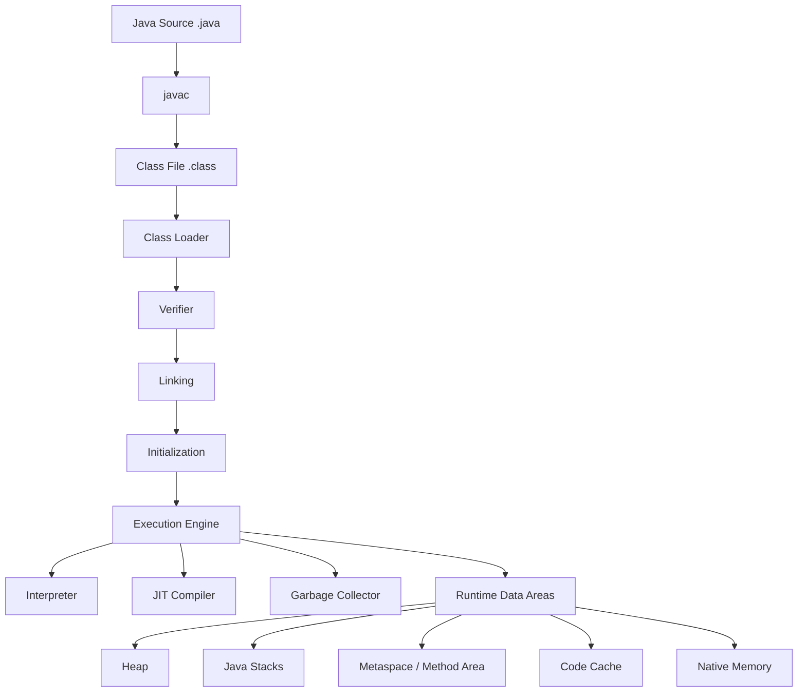
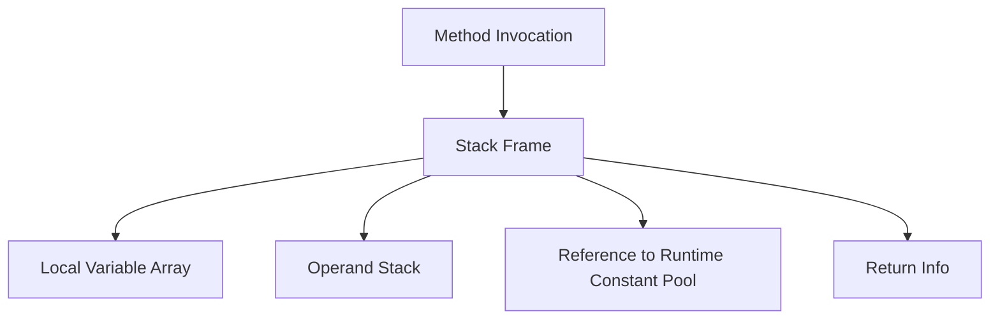
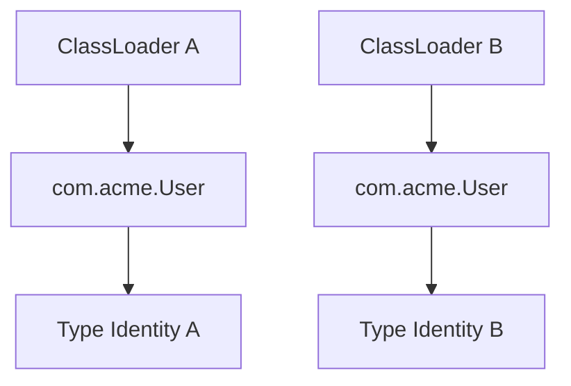
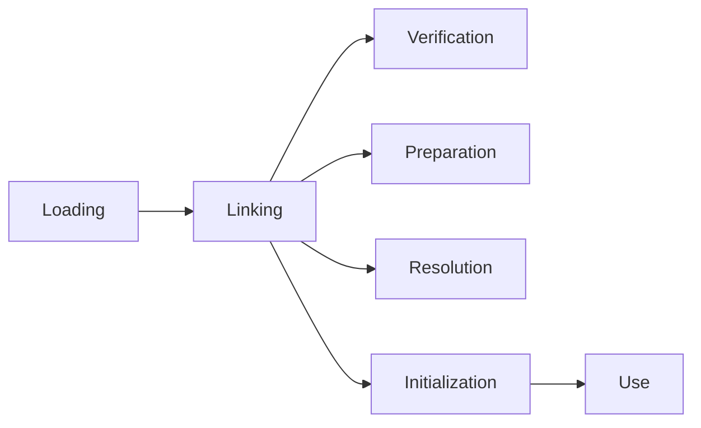
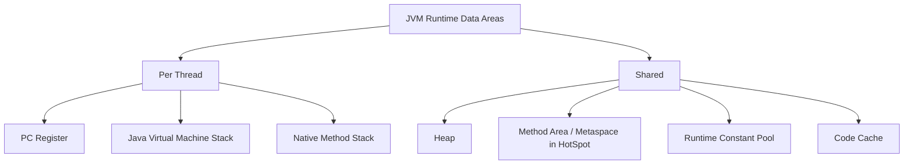

# Part 023 — JVM Internals: Bytecode, Class Loading, Metaspace, Stack, Heap, dan Java Memory Model

Java tidak hanya bahasa. Java adalah kontrak antara:

- source code;
- compiler;
- class file;
- class loader;
- verifier;
- interpreter;
- JIT compiler;
- garbage collector;
- memory model;
- operating system;
- hardware.

Jika kamu hanya memahami syntax, kamu bisa menulis Java. Tetapi ketika production mengalami:

- `ClassNotFoundException`;
- `NoClassDefFoundError`;
- `NoSuchMethodError`;
- `OutOfMemoryError: Java heap space`;
- `OutOfMemoryError: Metaspace`;
- deadlock;
- visibility bug;
- warmup latency;
- classloader leak;
- unexpected initialization;
- performance regression setelah upgrade JDK;

kamu perlu mental model JVM.

Part ini bukan untuk mengubahmu menjadi JVM implementer. Tujuannya lebih praktis: membuatmu mampu membaca gejala runtime dan menghubungkannya ke mekanisme JVM yang benar.

---

## 1. Target Performa

Setelah menyelesaikan bagian ini, kamu harus mampu:

- menjelaskan apa yang terjadi dari `.java` menjadi `.class` lalu dieksekusi JVM;
- membaca bytecode sederhana dengan `javap`;
- membedakan compile-time type, runtime class, dan class loader identity;
- menjelaskan loading, linking, verification, preparation, resolution, dan initialization;
- membedakan heap, stack, metaspace, code cache, native memory, dan direct memory;
- memahami object identity, object header, reference, dan compressed OOPs secara praktis;
- menjelaskan Java Memory Model dengan konsep visibility, ordering, atomicity, `volatile`, `final`, dan happens-before;
- mengenali failure mode runtime seperti classpath conflict, classloader leak, metaspace leak, stack overflow, data race, dan unsafe publication;
- membuat checklist investigasi JVM issue.

---

## 2. Mental Model Besar JVM



JVM melakukan beberapa hal besar:

1. membaca class file;
2. memastikan class file valid dan aman;
3. menghubungkan symbolic reference ke runtime representation;
4. menjalankan class initialization;
5. mengeksekusi bytecode;
6. mengoptimalkan hot code dengan JIT;
7. mengelola memory dan object lifecycle;
8. menyediakan concurrency semantics melalui Java Memory Model.

---

## 3. Source Code, Bytecode, dan Class File

Contoh Java:

```java
public final class Calculator {
    public int add(int a, int b) {
        return a + b;
    }
}
```

Compile:

```bash
javac Calculator.java
```

Inspect:

```bash
javap -c -v Calculator
```

Bytecode sederhana:

```text
public int add(int, int);
  Code:
     0: iload_1
     1: iload_2
     2: iadd
     3: ireturn
```

Interpretasi:

| Bytecode | Makna |
|---|---|
| `iload_1` | push local variable index 1 ke operand stack |
| `iload_2` | push local variable index 2 ke operand stack |
| `iadd` | pop dua int, jumlahkan, push hasil |
| `ireturn` | return int dari method |

JVM adalah stack-based virtual machine. Banyak instruksi bekerja dengan **operand stack**, bukan register eksplisit seperti assembly CPU umum.

---

## 4. Frame, Local Variables, dan Operand Stack

Setiap method invocation membuat **frame** di Java stack thread tersebut.



Frame berisi:

- local variables;
- operand stack;
- reference ke runtime constant pool;
- informasi return.

Contoh:

```java
int multiplyThenAdd(int a, int b, int c) {
    return a * b + c;
}
```

Bytecode kira-kira:

```text
iload_1
iload_2
imul
iload_3
iadd
ireturn
```

Mental model operand stack:

```text
push a
push b
multiply
push c
add
return
```

Ini penting karena:

- compiler Java menghasilkan bytecode;
- JIT mengoptimalkan bytecode hot path;
- verifier mengecek type safety bytecode;
- instrumentation tools membaca/menulis class file;
- stack trace mencerminkan method frames, bukan source statement murni.

---

## 5. Constant Pool dan Symbolic Reference

Class file menyimpan constant pool. Constant pool berisi symbolic references seperti:

- class names;
- method names;
- field names;
- descriptors;
- string constants;
- bootstrap method info.

Contoh:

```java
System.out.println("hello");
```

Di class file, `System.out` dan `println` awalnya berupa symbolic reference. Saat runtime, JVM me-resolve reference tersebut menjadi runtime entities.

Kenapa ini penting?

Karena error seperti ini sering terjadi di production:

```text
java.lang.NoSuchMethodError
java.lang.NoSuchFieldError
java.lang.IncompatibleClassChangeError
```

Itu biasanya bukan error source code saat compile, melainkan error linkage runtime: class yang ditemukan runtime tidak cocok dengan class yang dipakai saat compile.

---

## 6. Class Loading: Identity = Class Name + Class Loader

Di Java, identity sebuah class bukan hanya fully qualified name.

Identity class adalah:

```text
binary class name + defining class loader
```

Artinya dua class dengan nama yang sama bisa dianggap berbeda jika dimuat oleh class loader berbeda.



Akibatnya:

```text
com.acme.User cannot be cast to com.acme.User
```

bisa benar-benar terjadi.

Kasus umum:

- application server;
- plugin system;
- OSGi;
- servlet container;
- test runtime;
- shaded JAR;
- agent/instrumentation;
- hot reload;
- framework dev mode.

---

## 7. Loading, Linking, Initialization

JVM specification membagi lifecycle class/interface menjadi:



### 7.1 Loading

Loading berarti JVM menemukan binary representation class/interface lalu membuat runtime representation.

Sumber class bisa dari:

- file system;
- JAR;
- module;
- network;
- generated bytecode;
- instrumentation;
- hidden class.

### 7.2 Verification

Verifier memastikan class file valid dan type-safe.

Contoh yang dicegah:

- operand stack type invalid;
- branch ke tengah instruction;
- method return type tidak cocok;
- akses field/method ilegal;
- stack map frame invalid.

Verification adalah alasan Java bytecode bisa relatif aman meskipun class file bisa datang dari luar compiler Java.

### 7.3 Preparation

Preparation mengalokasikan static fields dan mengisi default values.

Contoh:

```java
static int count = 42;
```

Pada preparation, `count` awalnya `0`. Nilai `42` diberikan saat initialization, bukan preparation.

### 7.4 Resolution

Resolution mengubah symbolic references menjadi direct references.

Contoh symbolic reference:

```text
java/lang/String.length:()I
```

di-resolve ke method runtime yang sebenarnya.

Resolution bisa eager atau lazy tergantung implementasi dan kebutuhan.

### 7.5 Initialization

Initialization menjalankan:

- static field initializers;
- static initializer blocks;
- class initialization method `<clinit>`.

Contoh:

```java
public final class Config {
    static final String ENV = loadEnv();

    static {
        System.out.println("Config initialized");
    }
}
```

`loadEnv()` dan static block berjalan saat class initialization, bukan saat class file baru ditemukan.

---

## 8. Initialization Trap

Class initialization bersifat lazy, tetapi trigger-nya sering mengejutkan.

Contoh:

```java
public final class Holder {
    static final Service SERVICE = new Service();
}
```

Class `Holder` baru diinisialisasi ketika active use terjadi, misalnya:

```java
Service s = Holder.SERVICE;
```

Failure mode:

```java
public final class A {
    static final B B_INSTANCE = new B();
}

public final class B {
    static final A A_INSTANCE = new A();
}
```

Circular initialization bisa membuat object terlihat dalam kondisi belum lengkap atau menghasilkan error yang sulit dibaca.

Rule praktis:

- jangan lakukan I/O berat di static initializer;
- jangan akses remote service di static initializer;
- jangan membuat graph dependency besar di static initializer;
- simpan initialization mahal di lifecycle eksplisit;
- gunakan holder idiom hanya untuk hal yang benar-benar aman.

---

## 9. Runtime Data Areas

JVM mendefinisikan beberapa runtime data areas. Implementasi HotSpot memiliki detail implementasi seperti metaspace dan code cache.



---

## 10. Java Stack

Setiap thread punya Java stack. Stack berisi frame method invocation.

Stack dipakai untuk:

- local variables;
- operand stack;
- return path;
- method call nesting.

Failure mode:

```text
java.lang.StackOverflowError
```

Penyebab umum:

- rekursi tanpa base case;
- recursion terlalu dalam;
- object graph traversal rekursif;
- framework proxy recursion;
- `equals`/`hashCode` circular reference;
- `toString` circular reference.

Contoh:

```java
int f(int n) {
    return f(n + 1);
}
```

Mitigasi:

- ubah ke iterative;
- batasi depth;
- gunakan explicit stack;
- detect cycle;
- audit recursive `toString`, `equals`, serializer.

---

## 11. Heap

Heap adalah area utama object allocation.

```java
User user = new User("Duke");
```

Object `User` dialokasikan di heap, reference-nya disimpan di local variable frame.

Mental model:

```text
local variable -> reference -> object on heap
```

Heap berisi:

- object instances;
- arrays;
- class mirrors tertentu;
- string objects;
- collections;
- application state.

Failure mode:

```text
java.lang.OutOfMemoryError: Java heap space
```

Penyebab umum:

- object retention tidak sengaja;
- cache tanpa eviction;
- collection tumbuh tanpa batas;
- batch terlalu besar;
- leak melalui listener/subscriber;
- leak melalui static field;
- leak melalui `ThreadLocal`;
- classloader leak yang menahan object graph;
- terlalu banyak virtual thread dengan per-task state besar.

---

## 12. Metaspace

Di HotSpot, metadata class disimpan di metaspace, yang berada di native memory, bukan Java heap biasa.

Metaspace menyimpan hal seperti:

- class metadata;
- method metadata;
- constant pool metadata;
- runtime representation class;
- class loader related metadata.

Failure mode:

```text
java.lang.OutOfMemoryError: Metaspace
```

Penyebab umum:

- terlalu banyak class loaded;
- classloader leak;
- dynamic proxy/class generation tanpa unload;
- hot reload/dev mode leak;
- application server redeploy leak;
- bytecode generation framework membuat class terus-menerus.

Checklist investigasi metaspace:

- lihat jumlah loaded classes;
- cek class unloading;
- cek classloader count;
- cek framework bytecode generation;
- heap dump untuk classloader retention;
- native memory tracking jika tersedia;
- cek redeploy/hot reload pattern.

---

## 13. Code Cache

JIT compiled code disimpan di code cache.

Jika code cache penuh:

- JIT compilation bisa berhenti atau dibatasi;
- performance turun;
- warning muncul di log;
- aplikasi tetap jalan tetapi lebih banyak interpreted code.

Penyebab:

- aplikasi sangat besar;
- banyak generated code;
- banyak proxy;
- banyak lambda/metafactory;
- banyak dynamic language/runtime on JVM;
- JIT flags tidak sesuai.

Observasi:

```bash
jcmd <pid> Compiler.codecache
jcmd <pid> Compiler.queue
```

---

## 14. Native Memory dan Direct Memory

Tidak semua memory Java ada di heap.

Native memory dipakai oleh:

- metaspace;
- thread stacks;
- code cache;
- GC structures;
- direct buffers;
- JNI/native libraries;
- mmap files;
- JVM internals.

Direct buffer:

```java
ByteBuffer buffer = ByteBuffer.allocateDirect(1024 * 1024);
```

Direct memory berguna untuk I/O, tetapi failure mode-nya berbeda:

```text
java.lang.OutOfMemoryError: Direct buffer memory
```

Jangan menyimpulkan:

```text
heap usage rendah = memory aman
```

Di container, RSS bisa tinggi karena native memory.

Investigasi:

```bash
jcmd <pid> VM.native_memory summary
```

Jika Native Memory Tracking diaktifkan.

---

## 15. Object Layout dan Object Header

Object di heap biasanya memiliki:

- object header;
- instance fields;
- padding/alignment.

Header menyimpan informasi runtime seperti:

- mark word;
- class pointer;
- lock state;
- hash code;
- GC metadata tertentu.

Java 25 memperkenalkan Compact Object Headers sebagai fitur final. Ini bertujuan mengurangi footprint header object sehingga object-heavy workload bisa memakai heap lebih efisien.

Namun:

- layout adalah detail VM, bukan Java language contract;
- jangan menulis logic yang bergantung pada layout;
- manfaat harus dibuktikan dengan measurement;
- ukuran object dipengaruhi alignment, compressed references, fields, dan VM flags.

Gunakan tools seperti JOL untuk eksplorasi object layout, bukan sebagai kontrak bisnis.

---

## 16. Compressed OOPs dan References

OOP berarti ordinary object pointer. Pada heap tertentu, JVM bisa memakai compressed ordinary object pointers untuk mengurangi ukuran reference.

Dampak:

- reference bisa lebih kecil;
- heap footprint turun;
- cache locality lebih baik;
- batas efektif tergantung mode dan alignment.

Tapi jangan mengoptimalkan domain model hanya berdasarkan asumsi reference size. Gunakan measurement.

---

## 17. Escape Analysis dan Stack Allocation

JIT dapat melakukan escape analysis.

Contoh:

```java
public int sum(int a, int b) {
    Point p = new Point(a, b);
    return p.x() + p.y();
}
```

Jika object `Point` tidak escape dari method, JIT mungkin:

- menghilangkan allocation;
- melakukan scalar replacement;
- menyimpan field sebagai scalar lokal.

Namun ini optimisasi runtime, bukan guarantee source-level. Jangan membuat API buruk dengan alasan "JIT pasti optimize".

Rule:

> Tulis code jelas dulu. Gunakan profiler untuk melihat allocation hotspot. Baru optimasi.

---

## 18. Java Memory Model: Kenapa Ada?

Modern CPU dan compiler boleh melakukan optimization:

- reordering;
- caching;
- register allocation;
- store buffering;
- instruction scheduling;
- JIT transformation.

Tanpa memory model, program multi-thread bisa punya behavior tidak jelas.

Java Memory Model mendefinisikan kapan write dari satu thread harus terlihat oleh thread lain.

Masalah dasar:

```java
class StopFlag {
    boolean stop = false;

    void worker() {
        while (!stop) {
            // work
        }
    }

    void stop() {
        stop = true;
    }
}
```

Tanpa synchronization, thread worker tidak wajib melihat perubahan `stop`.

Benar:

```java
class StopFlag {
    volatile boolean stop = false;

    void worker() {
        while (!stop) {
            // work
        }
    }

    void stop() {
        stop = true;
    }
}
```

`volatile` memberi visibility dan ordering tertentu.

---

## 19. Atomicity, Visibility, Ordering

Concurrency correctness punya tiga dimensi:

| Dimensi | Pertanyaan |
|---|---|
| Atomicity | Apakah operasi tidak bisa terlihat setengah jalan? |
| Visibility | Apakah write thread A terlihat oleh thread B? |
| Ordering | Apakah urutan operasi yang penting dipertahankan? |

Contoh atomicity bug:

```java
count++;
```

Ini bukan operasi atomik. Ia kira-kira:

```text
read count
add 1
write count
```

Untuk counter multi-thread:

```java
AtomicInteger count = new AtomicInteger();

count.incrementAndGet();
```

Atau gunakan `LongAdder` untuk high-contention counting metrics.

---

## 20. Happens-Before

Happens-before adalah relasi yang menjamin visibility dan ordering.

Contoh penting:

| Rule | Makna Praktis |
|---|---|
| Program order | Dalam satu thread, aksi sebelumnya happens-before aksi sesudahnya |
| Monitor lock | Unlock pada monitor happens-before lock berikutnya pada monitor yang sama |
| Volatile | Write volatile happens-before read volatile berikutnya pada field yang sama |
| Thread start | `Thread.start()` happens-before aksi dalam thread baru |
| Thread join | Aksi dalam thread happens-before thread lain berhasil `join()` |
| Final fields | Final field punya initialization safety jika object tidak bocor saat construction |
| Transitivity | Jika A hb B dan B hb C, maka A hb C |

Contoh:

```java
class Holder {
    private int value;
    private volatile boolean ready;

    void publish() {
        value = 42;
        ready = true;
    }

    int read() {
        if (ready) {
            return value;
        }
        return -1;
    }
}
```

Write `ready = true` volatile membuat write `value = 42` sebelumnya terlihat oleh thread yang membaca `ready == true`.

---

## 21. Volatile Bukan Lock

`volatile` bagus untuk:

- flag;
- publication state;
- simple one-writer/many-reader visibility;
- immutable reference publication.

`volatile` tidak cukup untuk compound action:

```java
volatile int count;

void inc() {
    count++; // tetap tidak atomik
}
```

Gunakan:

```java
AtomicInteger count = new AtomicInteger();

void inc() {
    count.incrementAndGet();
}
```

Atau lock:

```java
private int count;

synchronized void inc() {
    count++;
}
```

---

## 22. Final Field Semantics dan Safe Publication

Final fields punya semantics khusus: jika object dibangun dengan benar dan tidak bocor dari constructor, thread lain yang melihat object akan melihat nilai final fields yang benar.

Contoh baik:

```java
public final class User {
    private final String id;
    private final String name;

    public User(String id, String name) {
        this.id = Objects.requireNonNull(id);
        this.name = Objects.requireNonNull(name);
    }
}
```

Contoh buruk:

```java
public final class Leaky {
    static Leaky INSTANCE;

    private final int value;

    public Leaky() {
        INSTANCE = this; // this escapes before construction complete
        value = 42;
    }
}
```

Rule:

> Jangan biarkan `this` escape dari constructor.

Hindari:

- register listener di constructor;
- start thread di constructor;
- publish ke static field di constructor;
- call overridable method dari constructor;
- pass `this` ke object lain yang bisa menyimpannya.

---

## 23. Double-Checked Locking

Dulu double-checked locking sering salah tanpa `volatile`.

Benar:

```java
public final class SingletonHolder {
    private static volatile Service instance;

    public static Service get() {
        Service result = instance;
        if (result == null) {
            synchronized (SingletonHolder.class) {
                result = instance;
                if (result == null) {
                    result = new Service();
                    instance = result;
                }
            }
        }
        return result;
    }
}
```

Lebih sederhana:

```java
public final class ServiceProvider {
    private static class Holder {
        static final Service INSTANCE = new Service();
    }

    public static Service get() {
        return Holder.INSTANCE;
    }
}
```

Atau gunakan dependency injection/lifecycle eksplisit.

---

## 24. Classpath Conflict dan Linkage Error

Contoh:

Compile dengan library A versi 2:

```java
client.newMethod();
```

Runtime memakai library A versi 1 yang tidak punya `newMethod()`.

Hasil:

```text
java.lang.NoSuchMethodError
```

Ini bukan "aneh". JVM melakukan resolution terhadap method yang tidak ada di class runtime.

Checklist:

- cek dependency tree;
- cek duplicate classes;
- cek shaded JAR;
- cek transitive dependency;
- cek classpath order;
- cek module path;
- cek build vs runtime artifact;
- cek container image layer;
- cek app server provided libraries.

Command:

```bash
mvn dependency:tree
gradle dependencies
jar tf app.jar | grep SomeClass
jdeps --multi-release 25 app.jar
```

---

## 25. ClassLoader Leak

Classloader leak terjadi ketika classloader lama tidak bisa di-GC karena masih direferensikan.

Penyebab umum:

- static field menyimpan object dari classloader lama;
- thread masih hidup dengan context classloader lama;
- ThreadLocal menyimpan object dari classloader lama;
- global registry;
- JDBC driver tidak deregister;
- logging framework;
- timer/scheduler;
- native library;
- application server redeploy.

Diagram:


Mitigasi:

- stop threads saat shutdown;
- clear ThreadLocal;
- deregister drivers/listeners;
- close classloader-owned resources;
- avoid static global registries;
- test redeploy cycles;
- inspect heap dump dominator tree.

---

## 26. Debugging JVM Runtime: Toolbelt

### 26.1 `javap`

```bash
javap -c -v com.acme.User
```

Gunakan untuk:

- bytecode inspection;
- method descriptor;
- constant pool;
- class file version;
- flags;
- annotations.

### 26.2 `jcmd`

```bash
jcmd <pid> help
jcmd <pid> VM.version
jcmd <pid> VM.flags
jcmd <pid> VM.system_properties
jcmd <pid> GC.heap_info
jcmd <pid> Thread.print
jcmd <pid> VM.native_memory summary
```

### 26.3 `jstack`

```bash
jstack <pid>
```

Gunakan untuk thread dump.

### 26.4 `jmap`

```bash
jmap -histo <pid>
jmap -dump:format=b,file=heap.hprof <pid>
```

Gunakan hati-hati di production.

### 26.5 JFR

```bash
jcmd <pid> JFR.start name=profile settings=profile duration=60s filename=recording.jfr
```

Gunakan untuk melihat:

- allocation;
- CPU;
- lock contention;
- thread events;
- GC;
- class loading;
- I/O.

---

## 27. Failure Mode Map

| Gejala | Kemungkinan Area JVM | Investigasi Awal |
|---|---|---|
| `StackOverflowError` | Java stack | Cek recursion, proxy loop, serializer |
| `OutOfMemoryError: Java heap space` | Heap | Heap dump, allocation profile |
| `OutOfMemoryError: Metaspace` | Metaspace/class loading | Class count, classloader leak |
| `NoSuchMethodError` | Linkage/classpath | Dependency tree, runtime artifact |
| `ClassCastException: X cannot be cast to X` | Classloader identity | Loader graph, container/plugin |
| CPU tinggi | JIT/app code/GC | JFR, async-profiler, thread dump |
| Latency setelah deploy | JIT warmup/class loading | JFR, compilation logs, startup profile |
| Data race | JMM/synchronization | Review happens-before |
| Deadlock | Locks/monitors | Thread dump |
| Native memory tinggi | Direct/metaspace/thread stacks/GC | NMT, RSS vs heap |

---

## 28. Practice Lab

### Lab 1 — Bytecode Reading

Buat class:

```java
public final class Demo {
    public int max(int a, int b) {
        return a > b ? a : b;
    }
}
```

Compile dan inspect:

```bash
javac Demo.java
javap -c -v Demo
```

Tulis:

- bytecode branching;
- local variable slot;
- method descriptor;
- class file major version.

### Lab 2 — Class Initialization

Buat class dengan static initializer yang print log. Akses:

- static final primitive constant;
- static final object;
- static method;
- `Class.forName`.

Catat kapan initialization terjadi.

### Lab 3 — Linkage Error Simulation

Buat dua versi library:

- v1 tanpa method `newMethod`;
- v2 dengan method `newMethod`.

Compile app dengan v2, jalankan dengan v1. Amati `NoSuchMethodError`.

### Lab 4 — Unsafe Publication

Buat contoh object mutable tanpa synchronization. Jalankan test stress sederhana. Tambahkan `volatile` atau safe publication.

### Lab 5 — Metaspace Awareness

Gunakan library bytecode generation atau dynamic proxy untuk membuat banyak class. Pantau loaded class count dan metaspace.

---

## 29. Review Checklist JVM-Aware Code

- [ ] Static initialization tidak melakukan I/O berat.
- [ ] Tidak ada `this` escape dari constructor.
- [ ] Shared mutable state punya synchronization strategy.
- [ ] `volatile` tidak dipakai untuk compound actions.
- [ ] Cache punya eviction dan size bound.
- [ ] ThreadLocal punya lifecycle cleanup.
- [ ] Dependency tree tidak punya duplicate/ambiguous versions.
- [ ] Generated class usage dipahami.
- [ ] Classloader boundaries jelas.
- [ ] Build artifact sama dengan runtime artifact.
- [ ] JVM flags terdokumentasi.
- [ ] Observability untuk class loading, GC, thread, allocation tersedia.

---

## 30. Ringkasan

JVM internals bukan pengetahuan "low-level trivia". Ini adalah peta sebab-akibat untuk production debugging.

Mental model terpenting:

```text
Java source is not what runs.
Class files run inside a JVM.
Classes are identified by name plus loader.
Objects live in managed memory.
Metadata lives outside normal heap.
Threads have stacks.
The JIT changes performance over time.
The Java Memory Model defines what threads are allowed to observe.
```

Jika kamu memahami bytecode, class loading, runtime data areas, object layout, and happens-before, kamu bisa membaca banyak incident Java dengan lebih tenang. Kamu tidak lagi sekadar melihat error message. Kamu melihat subsystem JVM mana yang sedang berbicara.

---

## 31. Referensi Resmi

- The Java Virtual Machine Specification, Java SE 25: https://docs.oracle.com/javase/specs/jvms/se25/html/index.html
- JVM Specification — Chapter 5: Loading, Linking, and Initializing: https://docs.oracle.com/javase/specs/jvms/se25/html/jvms-5.html
- Java Language Specification, Java SE 25: https://docs.oracle.com/javase/specs/jls/se25/html/index.html
- JLS Chapter 17 — Threads and Locks: https://docs.oracle.com/javase/specs/jls/se25/html/jls-17.html
- JEP 519 — Compact Object Headers: https://openjdk.org/jeps/519
- JDK Tools and Utilities: https://docs.oracle.com/en/java/javase/25/docs/specs/man/
