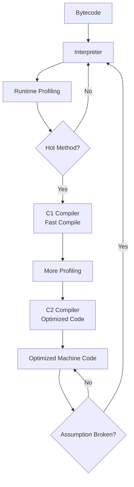
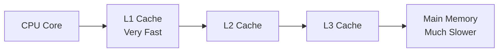
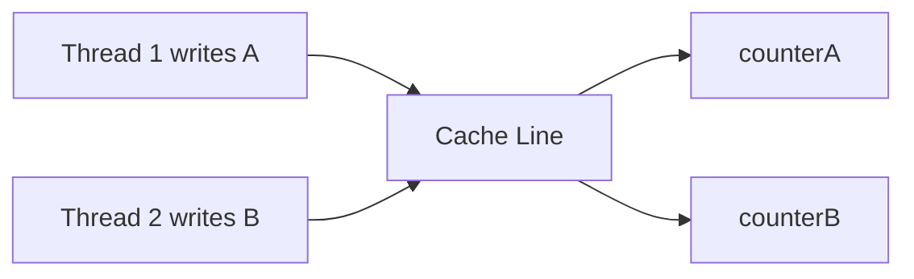
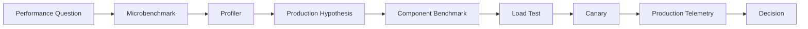

# Part 025 — JIT, Warmup, JMH, Mechanical Sympathy, dan Microbenchmarking yang Benar

Performance engineering di Java sering gagal bukan karena engineer tidak tahu API, tetapi karena salah memahami runtime.

Java bukan bahasa yang langsung berjalan seperti source code yang kamu tulis. Java berjalan di atas JVM yang:

- menginterpretasikan bytecode;
- mengumpulkan profil eksekusi;
- mengompilasi hot code dengan JIT;
- melakukan optimisasi spekulatif;
- melakukan deoptimization jika asumsi runtime salah;
- mengelola allocation dan garbage collection;
- berinteraksi dengan CPU cache, branch predictor, memory bandwidth, OS scheduler, dan container runtime.

Karena itu, microbenchmark Java mudah menipu.

Benchmark yang terlihat valid bisa saja hanya mengukur:

- dead-code elimination;
- constant folding;
- unrealistic branch profile;
- JIT warmup artifact;
- escape analysis yang tidak terjadi di production;
- cache locality yang terlalu ideal;
- data size yang tidak representatif;
- measurement overhead;
- GC noise;
- turbo boost/frequency scaling;
- OS scheduling noise.

Part ini membangun mental model agar kamu bisa melakukan performance experiment yang defensible.

---

## 1. Target Performa

Setelah menyelesaikan bagian ini, kamu harus mampu:

- menjelaskan interpreter, JIT, C1, C2, tiered compilation, dan warmup;
- menjelaskan mengapa Java performance bisa berubah selama runtime;
- mengenali optimisasi JIT seperti inlining, escape analysis, scalar replacement, constant folding, dead-code elimination, loop optimization, dan deoptimization;
- menggunakan JMH untuk benchmark kecil dengan warmup, fork, benchmark mode, state scope, dan `Blackhole`;
- mendesain benchmark yang tidak misleading;
- membedakan microbenchmark, macrobenchmark, load test, profiling, dan production telemetry;
- menghubungkan hasil benchmark ke hipotesis production;
- membaca hasil benchmark dengan statistical humility;
- menghindari performance folklore.

---

## 2. Mental Model Eksekusi Java



JVM tidak langsung menghasilkan kode paling optimal saat program mulai. Ia mempelajari runtime behavior dulu.

Konsekuensi:

- startup performance berbeda dari steady-state performance;
- benchmark pendek bisa mengukur interpreter/C1, bukan optimized C2;
- hasil bisa berubah setelah warmup;
- code path jarang mungkin tidak dioptimalkan;
- profile yang tidak realistis bisa menghasilkan optimisasi yang tidak realistis.

---

## 3. Interpreter, C1, C2, dan Tiered Compilation

### 3.1 Interpreter

Interpreter menjalankan bytecode instruksi demi instruksi.

Kelebihan:

- startup cepat;
- tidak perlu compile dulu;
- bisa mengumpulkan profil.

Kekurangan:

- lebih lambat daripada optimized machine code.

### 3.2 C1 Compiler

C1 adalah compiler cepat dengan optimisasi lebih ringan. Ia berguna untuk:

- mempercepat code lebih awal;
- mempertahankan startup relatif baik;
- mengumpulkan profiling information untuk optimisasi berikutnya.

### 3.3 C2 Compiler

C2 melakukan optimisasi lebih agresif untuk hot code.

Contoh optimisasi:

- method inlining;
- escape analysis;
- scalar replacement;
- loop optimization;
- dead-code elimination;
- range-check elimination;
- lock elision;
- branch optimization.

### 3.4 Tiered Compilation

Tiered compilation menggabungkan interpreter, C1, dan C2 untuk menyeimbangkan startup dan peak performance.

Mental model:

```text
Cold code: interpreted
Warm code: C1
Hot code: C2 optimized
```

Performance Java adalah proses adaptif.

---

## 4. Warmup

Warmup adalah fase ketika aplikasi belum mencapai performance stabil karena:

- class loading;
- class initialization;
- interpreter execution;
- JIT profiling;
- C1/C2 compilation;
- code cache filling;
- branch predictor learning;
- cache warming;
- connection pool warming;
- framework initialization;
- lazy singleton creation;
- TLS handshake/cache;
- serializer/deserializer initialization.

Benchmark tanpa warmup sering salah.

Contoh buruk:

```java
long start = System.nanoTime();
for (int i = 0; i < 1_000_000; i++) {
    service.compute(i);
}
long elapsed = System.nanoTime() - start;
System.out.println(elapsed);
```

Masalah:

- loop bisa dioptimalkan;
- return value bisa dihapus;
- warmup tidak dipisah;
- GC tidak dikontrol;
- tidak ada fork;
- tidak ada statistik;
- JIT profile tidak realistis;
- measurement overhead tidak dipertimbangkan.

---

## 5. JIT Optimisasi yang Harus Dipahami

### 5.1 Inlining

Inlining mengganti method call dengan body method.

Source:

```java
int totalPrice(OrderLine line) {
    return line.quantity() * line.unitPrice();
}
```

Jika `quantity()` dan `unitPrice()` kecil, JIT bisa inline.

Manfaat:

- mengurangi call overhead;
- membuka optimisasi lanjutan;
- memungkinkan constant propagation;
- memungkinkan escape analysis lebih baik.

Tapi inlining punya batas. Method besar atau polymorphic call bisa tidak inline.

---

### 5.2 Monomorphic, Bimorphic, Megamorphic Call Site

JIT suka call site yang predictable.

```java
interface DiscountPolicy {
    int apply(int price);
}
```

Jika runtime selalu melihat satu implementasi:

```text
monomorphic
```

JIT bisa inline agresif.

Jika banyak implementasi:

```text
megamorphic
```

JIT lebih sulit mengoptimalkan.

Production implication:

- dependency injection/proxy bisa membuat call site lebih kompleks;
- interface tidak otomatis lambat, tetapi dispatch profile penting;
- benchmark dengan satu implementation bisa terlalu optimistis dibanding production.

---

### 5.3 Escape Analysis

Object yang tidak escape dari method/thread bisa dioptimalkan.

Source:

```java
public int sum(int a, int b) {
    Point p = new Point(a, b);
    return p.x() + p.y();
}
```

JIT mungkin menghilangkan allocation `Point`.

Optimisasi terkait:

- scalar replacement;
- stack allocation-like effect;
- lock elision.

Namun jangan menganggap object selalu dihapus. Escape analysis tergantung context.

Benchmark trap:

```java
@Benchmark
public Point createPoint() {
    return new Point(1, 2);
}
```

Jika object dikembalikan, ia escape benchmark method. Jika tidak dikonsumsi benar, benchmark bisa dihapus.

---

### 5.4 Dead-Code Elimination

Jika hasil tidak dipakai, JIT bisa menghapus pekerjaan.

Buruk:

```java
@Benchmark
public void compute() {
    Math.sqrt(123.456);
}
```

JIT bisa melihat hasil tidak digunakan.

Lebih baik:

```java
@Benchmark
public double compute() {
    return Math.sqrt(123.456);
}
```

Atau:

```java
@Benchmark
public void compute(Blackhole blackhole) {
    blackhole.consume(Math.sqrt(123.456));
}
```

---

### 5.5 Constant Folding

Jika input konstan, JIT bisa menghitung hasil sekali.

Buruk:

```java
@Benchmark
public int calc() {
    return expensive(42);
}
```

Jika `expensive(42)` pure dan predictable, hasil bisa dioptimalkan.

Lebih baik gunakan state yang realistis:

```java
@State(Scope.Thread)
public class InputState {
    int value = ThreadLocalRandom.current().nextInt();
}
```

Tetapi hati-hati juga dengan random di benchmark; jangan sampai yang diukur adalah random generator.

---

### 5.6 Deoptimization

JIT membuat asumsi. Jika asumsi gagal, JVM bisa deoptimize kembali ke interpreter atau compile ulang.

Contoh asumsi:

- call site monomorphic;
- type profile stabil;
- branch probability stabil;
- class hierarchy belum berubah;
- null check bisa dieliminasi;
- range check bisa dieliminasi.

Jika class baru dimuat atau profile berubah, optimized code bisa invalid.

Production implication:

- performance bisa berubah setelah deployment warmup;
- plugin/dynamic class loading bisa mengubah assumptions;
- benchmark isolated tidak selalu mewakili service besar.

---

## 6. Mechanical Sympathy untuk Java Engineer

Mechanical sympathy berarti memahami karakteristik hardware/runtime agar desain software tidak melawan mesin.

Bukan berarti kamu harus menulis assembly. Tetapi kamu harus tahu bahwa:

- CPU jauh lebih cepat daripada memory;
- cache locality penting;
- branch prediction penting;
- allocation rate memengaruhi GC;
- false sharing bisa menghancurkan throughput;
- lock contention membuat core menganggur;
- memory bandwidth bisa menjadi bottleneck;
- context switching tidak gratis.

---

## 7. CPU Cache Mental Model



Data structure yang cache-friendly sering lebih cepat.

Contoh:

```java
int[] values = new int[1_000_000];

long sum = 0;
for (int value : values) {
    sum += value;
}
```

Array primitive contiguous lebih cache-friendly daripada object graph:

```java
List<Integer> values = new ArrayList<>();
```

`List<Integer>` menyimpan references ke `Integer` objects. Itu lebih banyak indirection, allocation, dan cache miss.

Namun jangan langsung mengubah semua code ke primitive arrays. Pertimbangkan:

- readability;
- domain clarity;
- mutation risk;
- API ergonomics;
- actual hotspot.

---

## 8. False Sharing

False sharing terjadi ketika dua thread menulis variable berbeda tetapi berada di cache line yang sama.



Meskipun variable berbeda, cache coherence protocol membuat update saling mengganggu.

Contoh:

```java
final class Counters {
    volatile long a;
    volatile long b;
}
```

Jika thread 1 sering update `a` dan thread 2 sering update `b`, bisa terjadi false sharing.

Mitigasi:

- gunakan `LongAdder` untuk high-contention counters;
- padding atau `@Contended` untuk low-level structures;
- sharding counters;
- hindari shared mutable hot fields.

`@Contended` adalah fitur internal/advanced dan perlu flag tertentu; jangan gunakan tanpa benchmark.

---

## 9. Lock Contention dan Synchronization Cost

Lock bukan selalu buruk. Lock contention yang buruk.

```java
public synchronized void add(Event event) {
    events.add(event);
}
```

Jika banyak thread masuk, semua serial di monitor.

Alternatif tergantung kebutuhan:

- `ConcurrentHashMap`;
- `LongAdder`;
- immutable snapshot;
- queue;
- sharding;
- actor/single writer;
- batching;
- reduce shared state.

Jangan mengganti lock dengan lock-free structure tanpa memahami correctness. Lock-free code sering lebih sulit diverifikasi.

---

## 10. Benchmark Taxonomy

| Jenis | Mengukur | Cocok Untuk | Risiko |
|---|---|---|---|
| Microbenchmark | operasi kecil | membandingkan algorithm/API kecil | mudah misleading |
| Component benchmark | komponen internal | serializer, parser, repository mock | masih jauh dari production |
| Macrobenchmark | aplikasi/subsystem | end-to-end lokal | setup mahal |
| Load test | service dengan traffic | latency/throughput/behavior under load | environment harus realistis |
| Stress test | batas sistem | failure mode | bisa merusak dependency |
| Soak test | durasi panjang | leak, stability | butuh waktu |
| Production telemetry | real workload | validasi nyata | banyak noise/confounder |

Microbenchmark tidak menjawab semua. Microbenchmark menjawab pertanyaan kecil:

```text
Dalam kondisi terkontrol ini, operasi A lebih cepat/lambat dari B?
```

Bukan:

```text
Service production pasti lebih cepat jika kita ganti A ke B.
```

---

## 11. JMH: Java Microbenchmark Harness

JMH adalah harness resmi OpenJDK untuk membuat, menjalankan, dan menganalisis benchmark nano/micro/milli/macro di JVM.

Minimal benchmark:

```java
import org.openjdk.jmh.annotations.Benchmark;

public class StringConcatBenchmark {
    @Benchmark
    public String concat() {
        return "hello" + " " + "world";
    }
}
```

Tetapi benchmark seperti ini terlalu trivial dan mungkin dioptimalkan total. JMH menyediakan anotasi untuk mengontrol warmup, measurement, forks, state, dan mode.

---

## 12. Struktur JMH yang Benar

Contoh lebih realistis:

```java
import org.openjdk.jmh.annotations.*;
import java.util.*;
import java.util.concurrent.TimeUnit;

@BenchmarkMode(Mode.Throughput)
@OutputTimeUnit(TimeUnit.MILLISECONDS)
@Warmup(iterations = 5, time = 1)
@Measurement(iterations = 10, time = 1)
@Fork(value = 3)
@State(Scope.Thread)
public class LookupBenchmark {

    private Map<String, Integer> map;
    private List<String> keys;

    @Setup(Level.Trial)
    public void setup() {
        map = new HashMap<>();
        keys = new ArrayList<>();

        for (int i = 0; i < 10_000; i++) {
            String key = "key-" + i;
            keys.add(key);
            map.put(key, i);
        }
    }

    @Benchmark
    public int lookup() {
        int sum = 0;
        for (String key : keys) {
            sum += map.get(key);
        }
        return sum;
    }
}
```

Elemen penting:

| Elemen | Fungsi |
|---|---|
| `@Benchmark` | method yang diukur |
| `@BenchmarkMode` | throughput, average time, sample time, single shot |
| `@OutputTimeUnit` | unit output |
| `@Warmup` | fase pemanasan tidak dihitung |
| `@Measurement` | fase pengukuran |
| `@Fork` | JVM process terpisah |
| `@State` | state benchmark |
| `@Setup` | setup data |
| `@TearDown` | cleanup |
| `Blackhole` | mencegah hasil dihapus |

---

## 13. Benchmark Modes

| Mode | Makna | Cocok Untuk |
|---|---|---|
| `Throughput` | operasi per waktu | seberapa banyak operasi |
| `AverageTime` | waktu rata-rata per operasi | latency rata-rata operasi kecil |
| `SampleTime` | distribusi sample waktu | variasi latency |
| `SingleShotTime` | satu eksekusi | cold start/batch tertentu |
| `All` | semua mode | eksplorasi, tapi output ramai |

Gunakan mode sesuai pertanyaan.

Pertanyaan:

```text
Berapa operasi per detik?
```

Gunakan throughput.

Pertanyaan:

```text
Berapa waktu per operasi?
```

Gunakan average/sample time.

Pertanyaan:

```text
Berapa waktu cold operation?
```

Gunakan single shot dengan desain hati-hati.

---

## 14. State Scope

| Scope | Makna |
|---|---|
| `Scope.Thread` | setiap worker thread punya state sendiri |
| `Scope.Benchmark` | state dibagi semua worker |
| `Scope.Group` | state dibagi dalam group benchmark |

Contoh:

```java
@State(Scope.Benchmark)
public class SharedState {
    AtomicLong counter = new AtomicLong();
}
```

Jika menguji contention, `Scope.Benchmark` bisa relevan. Jika tidak, shared state bisa mencemari hasil.

---

## 15. Setup Level

| Level | Kapan berjalan |
|---|---|
| `Trial` | sekali per fork/trial |
| `Iteration` | sebelum tiap iteration |
| `Invocation` | sebelum tiap benchmark invocation |

Hati-hati dengan `Level.Invocation`; overhead setup bisa sangat besar dan mengubah hasil.

---

## 16. Forks

Fork berarti menjalankan benchmark di JVM process terpisah.

Kenapa penting?

- mengisolasi profile antar benchmark;
- mengurangi efek JIT state;
- mengurangi cross-contamination;
- memberi statistik lebih baik.

Tanpa fork, benchmark A bisa memengaruhi benchmark B melalui profile, code cache, class loading, atau GC state.

Rule praktis:

```java
@Fork(3)
```

Untuk eksperimen serius, jalankan lebih banyak fork dan periksa variance.

---

## 17. Blackhole

Gunakan `Blackhole` jika hasil tidak bisa dikembalikan langsung atau perlu mengonsumsi banyak nilai.

```java
@Benchmark
public void parse(Blackhole blackhole) {
    for (String input : inputs) {
        blackhole.consume(Integer.parseInt(input));
    }
}
```

Namun jangan overuse. Jika benchmark bisa mengembalikan hasil, return value sering cukup.

---

## 18. Parameterized Benchmark

```java
@State(Scope.Thread)
public class SortBenchmark {

    @Param({"10", "1000", "100000"})
    int size;

    int[] values;

    @Setup
    public void setup() {
        values = ThreadLocalRandom.current()
                .ints(size)
                .toArray();
    }

    @Benchmark
    public int[] sort() {
        int[] copy = values.clone();
        Arrays.sort(copy);
        return copy;
    }
}
```

Parameter penting karena performance sering berubah berdasarkan ukuran data.

Contoh:

- algorithm A menang di size kecil;
- algorithm B menang di size besar;
- memory/cache behavior berubah;
- GC pressure berubah.

---

## 19. Benchmark Traps

### 19.1 Constant Input

Input terlalu konstan membuat JIT mengoptimalkan hasil.

Mitigasi:

- gunakan state;
- gunakan beberapa input;
- gunakan realistic distribution.

### 19.2 Dead Code

Hasil tidak dipakai.

Mitigasi:

- return result;
- gunakan `Blackhole`.

### 19.3 Benchmark Mengukur Setup

Setup dilakukan di method benchmark.

Buruk:

```java
@Benchmark
public int test() {
    List<Integer> list = loadData();
    return process(list);
}
```

Jika yang ingin diukur `process`, setup harus dipisah.

### 19.4 Unrealistic Branch Profile

Benchmark selalu memakai input yang membuat branch sama.

```java
if (value > 0) {
    fastPath();
} else {
    slowPath();
}
```

Jika production punya 70/30 tetapi benchmark 100/0, hasil misleading.

### 19.5 Dataset Terlalu Kecil

Data muat di L1 cache, padahal production tidak.

Mitigasi:

- gunakan size parameter;
- gunakan dataset production-like;
- ukur cache-sensitive behavior.

### 19.6 GC Noise

Benchmark membuat allocation besar dan hasil dipengaruhi GC.

Mitigasi:

- ukur allocation;
- gunakan profiler;
- set heap realistis;
- jangan sembunyikan GC jika production juga mengalami GC.

### 19.7 Benchmark dengan Logging

Logging di benchmark biasanya mengukur logging.

### 19.8 Benchmark dengan Random di Hot Path

Random generation bisa mendominasi.

Pisahkan input generation dari benchmark jika random bukan yang diukur.

### 19.9 Comparing Different Semantics

Contoh:

- method A validasi input;
- method B tidak validasi;
- parser A strict;
- parser B lenient;
- cache A thread-safe;
- cache B tidak.

Performance comparison tidak bermakna jika semantics berbeda.

### 19.10 Microbenchmark Menjadi Arsitektur Decision

Mengganti desain besar hanya karena microbenchmark kecil menang 5 ns/op biasanya salah.

---

## 20. Membaca Output JMH

Contoh output:

```text
Benchmark             Mode  Cnt   Score   Error  Units
LookupBenchmark.lookup thrpt  30  12.345 ± 0.321 ops/ms
```

Interpretasi:

| Kolom | Makna |
|---|---|
| `Mode` | mode benchmark |
| `Cnt` | jumlah measurement samples |
| `Score` | hasil utama |
| `Error` | confidence interval |
| `Units` | unit |
| `thrpt` | throughput |
| `avgt` | average time |

Perhatikan:

- variance;
- error bar overlap;
- outlier;
- consistency antar fork;
- GC allocation rate;
- profiler output;
- ukuran efek, bukan hanya "lebih cepat".

Jika A 1% lebih cepat tetapi variance 5%, jangan klaim A menang.

---

## 21. JMH Profilers

JMH bisa memakai profiler:

```bash
java -jar benchmarks.jar -prof gc
```

GC profiler memberi informasi allocation rate.

Profiler lain tergantung platform:

```bash
-prof stack
-prof perfasm
-prof async
```

Gunakan profiler untuk menjawab:

- apakah benchmark allocate?
- method mana dominan?
- apakah assembly menunjukkan vectorization/inlining?
- apakah lock contention terjadi?
- apakah GC memengaruhi hasil?

---

## 22. Dari Microbenchmark ke Production Hypothesis

Microbenchmark hanya langkah awal.

Alur yang sehat:



Contoh:

```text
Microbenchmark menunjukkan parser B 20% lebih cepat untuk payload 2KB.
```

Belum cukup.

Tanyakan:

- payload production ukurannya berapa?
- schema sama?
- error handling sama?
- allocation rate turun?
- p99 service turun?
- CPU turun?
- compatibility aman?
- observability sama?
- failure mode berubah?

---

## 23. Performance Experiment Template

Gunakan template ini.

```markdown
# Performance Experiment: <Title>

## Question

What exact question are we answering?

## Hypothesis

If we change X to Y, we expect Z because ...

## Scope

- Code path:
- Workload:
- Data size:
- JVM:
- Hardware:
- OS/container:
- Collector:

## Metrics

- Throughput:
- Latency:
- Allocation rate:
- CPU:
- GC:
- Memory:
- Error rate:

## Benchmark Design

- JMH / component / load test:
- Warmup:
- Measurement:
- Forks:
- Input distribution:
- State scope:

## Results

- Baseline:
- Variant:
- Confidence/error:
- Profiler notes:

## Decision

- Adopt:
- Reject:
- Needs more testing:

## Risks

- Production mismatch:
- Compatibility:
- Operational:
```

---

## 24. Mechanical Sympathy Checklist

Sebelum optimasi low-level, tanya:

- [ ] Apakah ini benar-benar hotspot?
- [ ] Apakah profiler membuktikannya?
- [ ] Apakah allocation rate tinggi?
- [ ] Apakah data structure cache-unfriendly?
- [ ] Apakah boxing terjadi di hot path?
- [ ] Apakah lock contention terjadi?
- [ ] Apakah false sharing mungkin?
- [ ] Apakah branch profile realistis?
- [ ] Apakah memory bandwidth bottleneck?
- [ ] Apakah algorithmic complexity lebih penting?
- [ ] Apakah optimasi merusak readability?
- [ ] Apakah ada test untuk correctness?
- [ ] Apakah benchmark merepresentasikan production?

---

## 25. Common Java Performance Smells

### 25.1 Recreating Expensive Objects

```java
ObjectMapper mapper = new ObjectMapper();
```

per request biasanya buruk.

Gunakan singleton/configured instance jika thread-safe.

### 25.2 Regex Compile per Request

```java
input.matches("[A-Z]+");
```

Untuk hot path, precompile:

```java
private static final Pattern CODE = Pattern.compile("[A-Z]+");
```

### 25.3 Exception untuk Control Flow

Exception mahal jika sering dibuat karena stack trace.

### 25.4 Boxing di Hot Path

```java
Map<Integer, Long> counts;
```

Bisa acceptable, bisa mahal tergantung volume.

### 25.5 Intermediate Collections

```java
list.stream()
    .map(...)
    .toList()
    .stream()
    .filter(...)
    .toList();
```

Bisa membuat allocation tidak perlu.

### 25.6 Synchronized Global Hot Path

Satu lock untuk semua request.

### 25.7 Logging String Construction

```java
log.debug("payload = " + expensiveToString(payload));
```

Lebih baik lazy/parameterized:

```java
log.debug("payload = {}", payload);
```

Namun pastikan `toString()` tidak tetap mahal di framework tertentu.

---

## 26. Latihan 20 Jam

### Jam 1–3: JMH Setup

Buat project JMH sederhana.

Benchmark:

- string concatenation;
- `StringBuilder`;
- `String.format`.

Pelajari output, warmup, measurement, fork.

### Jam 4–6: Dead Code dan Blackhole

Buat benchmark yang hasilnya tidak dipakai. Lihat hasil tidak masuk akal. Perbaiki dengan return value dan `Blackhole`.

### Jam 7–9: Dataset Size

Benchmark lookup `ArrayList`, `HashSet`, dan `TreeSet` dengan size:

- 10;
- 1.000;
- 1.000.000.

Catat bagaimana hasil berubah.

### Jam 10–12: Allocation Profiling

Tambahkan `-prof gc`. Bandingkan dua implementasi dengan throughput mirip tetapi allocation berbeda.

### Jam 13–15: Branch Profile

Buat benchmark dengan branch 100/0, 90/10, 50/50. Amati hasil.

### Jam 16–18: Lock Contention

Benchmark counter dengan:

- `synchronized`;
- `AtomicLong`;
- `LongAdder`.

Gunakan thread count berbeda.

### Jam 19–20: Experiment Report

Tulis laporan:

- pertanyaan;
- hipotesis;
- benchmark design;
- hasil;
- profiler evidence;
- decision;
- limitation.

---

## 27. Anti-Pattern

### Anti-Pattern 1 — Benchmark Manual dengan `System.nanoTime()`

Tidak selalu salah untuk quick check, tetapi tidak cukup untuk keputusan serius.

### Anti-Pattern 2 — Satu Run, Satu Angka

Performance adalah distribusi, bukan angka tunggal.

### Anti-Pattern 3 — Mengabaikan Warmup

JVM adaptif. Warmup bukan detail opsional.

### Anti-Pattern 4 — Tidak Memakai Fork

Benchmark saling mencemari profile.

### Anti-Pattern 5 — Benchmark Input Tidak Realistis

JIT mengoptimalkan berdasarkan profile input.

### Anti-Pattern 6 — Menyamakan Microbenchmark dengan Production

Microbenchmark hanya evidence kecil.

### Anti-Pattern 7 — Optimasi Tanpa Profiling

Optimasi tanpa profiler biasanya mengoptimalkan asumsi.

---

## 28. Ringkasan

Java performance adalah interaksi antara source code, JVM, JIT, GC, hardware, dan workload.

Mental model utama:

```text
The JVM optimizes what actually happens at runtime.
Bad benchmarks teach the JVM unrealistic behavior.
JMH reduces common mistakes, but does not guarantee relevance.
Microbenchmark results must become production hypotheses, not production conclusions.
```

JMH adalah alat yang sangat kuat, tetapi tetap butuh judgment. Engineer top-tier tidak hanya bertanya "mana lebih cepat?", tetapi:

```text
Lebih cepat dalam kondisi apa?
Dengan input apa?
Dengan JDK apa?
Dengan GC apa?
Dengan variance berapa?
Dengan allocation berapa?
Apakah semantics sama?
Apakah production workload mirip?
Apakah improvement terlihat di p95/p99?
```

Itulah bedanya performance tuning dan performance theatre.

---

## 29. Referensi Resmi dan Lanjutan

- OpenJDK JMH Project: https://openjdk.org/projects/code-tools/jmh/
- JMH Source Repository: https://github.com/openjdk/jmh
- Java SE 25 JVM Specification: https://docs.oracle.com/javase/specs/jvms/se25/html/index.html
- JDK Tools and Utilities: https://docs.oracle.com/en/java/javase/25/docs/specs/man/
- JDK Flight Recorder Tutorial: https://dev.java/learn/jvm/jfr/
- async-profiler: https://github.com/async-profiler/async-profiler
