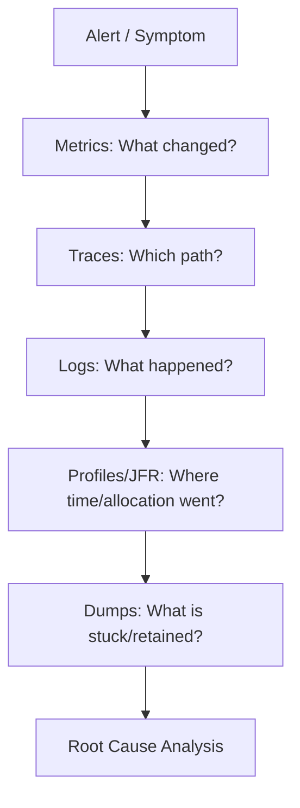
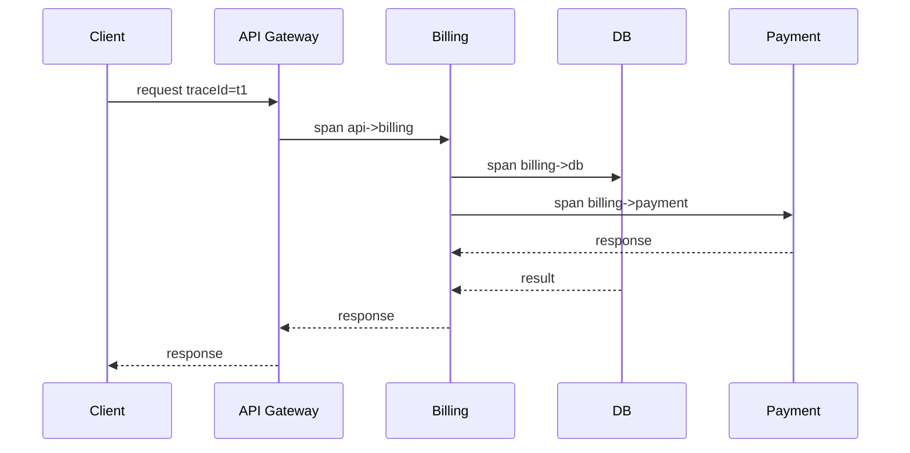
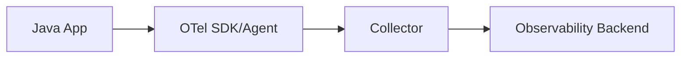

# Part 026 — Observability Java: Logs, Metrics, Traces, JFR, JMC, async-profiler, dan Thread Dump

Observability bukan menambahkan dashboard sebanyak mungkin. Observability adalah kemampuan menjawab pertanyaan tentang sistem dari luar, tanpa harus menebak atau deploy ulang dengan debug print.

Untuk Java production system, observability harus menjawab:

- request mana yang lambat?
- dependency mana yang menyebabkan tail latency?
- thread menunggu apa?
- lock mana yang contention?
- berapa allocation rate?
- object apa yang memenuhi heap?
- GC pause terjadi kapan?
- CPU habis di method mana?
- virtual threads sedang blocked di resource apa?
- error meningkat karena input, dependency, deploy, atau load?
- latency naik karena JVM, database, network, queue, GC, atau downstream?

Part ini membangun playbook observability untuk Java engineer. Fokusnya bukan tool worship, tetapi sinyal, pertanyaan, dan cara menghubungkan evidence.

---

## 1. Target Performa

Setelah menyelesaikan bagian ini, kamu harus mampu:

- membedakan logs, metrics, traces, profiles, dumps, dan events;
- mendesain structured logging yang berguna saat incident;
- memilih metric type yang tepat: counter, gauge, histogram, timer;
- memahami distributed tracing dan context propagation;
- memakai JFR untuk low-overhead runtime recording;
- membuka recording di JDK Mission Control;
- memakai async-profiler untuk CPU/allocation/lock profiling;
- membaca thread dump untuk deadlock, blocked threads, waiting, pool starvation, dan virtual thread patterns;
- membuat incident data checklist;
- menghindari observability anti-pattern seperti high-cardinality metrics, log spam, dan missing correlation id.

---

## 2. Observability vs Monitoring

Monitoring menjawab:

```text
Apakah sistem sehat?
```

Observability menjawab:

```text
Mengapa sistem tidak sehat?
```

Monitoring biasanya berupa alert:

- error rate naik;
- p99 latency naik;
- CPU tinggi;
- memory tinggi;
- queue depth naik;
- DB connection pool penuh.

Observability memberi data untuk investigasi:

- trace request lambat;
- log dengan correlation id;
- metric per dependency;
- JFR event;
- thread dump;
- heap dump;
- flame graph;
- GC log;
- allocation profile.



---

## 3. Signal Taxonomy

| Signal | Best For | Weakness |
|---|---|---|
| Logs | discrete events, business context, errors | noisy, expensive, hard to aggregate |
| Metrics | trends, alerting, dashboards | lose per-request detail |
| Traces | request flow across services | sampling, context propagation complexity |
| Profiles | CPU/allocation/lock hotspots | point-in-time, needs interpretation |
| JFR events | JVM/application runtime evidence | needs recording/configuration |
| Thread dumps | stuck/blocking/deadlock/pool diagnosis | snapshot only |
| Heap dumps | retention/memory leak diagnosis | heavy, privacy risk |
| GC logs | GC/memory behavior over time | specialized interpretation |

A good system uses multiple signals because no single signal is enough.

---

## 4. Structured Logging

Unstructured log:

```text
Payment failed for user 123
```

Structured log:

```json
{
  "timestamp": "2026-06-26T10:15:30.123Z",
  "level": "ERROR",
  "service": "billing-service",
  "event": "payment_failed",
  "correlationId": "01J...",
  "tenantId": "tenant-a",
  "userId": "123",
  "paymentId": "pay-789",
  "provider": "stripe",
  "errorCode": "CARD_DECLINED",
  "durationMs": 382
}
```

Structured logs allow filtering and aggregation.

Essential fields:

- timestamp;
- level;
- service;
- environment;
- version/build;
- event name;
- correlation id / trace id;
- tenant id if multi-tenant;
- user/account id if allowed;
- request id;
- operation;
- duration;
- status;
- error class/code;
- dependency name;
- deployment metadata.

Do not log secrets, tokens, passwords, private keys, full card numbers, or sensitive personal data.

---

## 5. Logging Levels

| Level | Use |
|---|---|
| TRACE | extremely detailed flow, usually off |
| DEBUG | diagnostic info for development |
| INFO | important lifecycle/business events |
| WARN | unexpected but handled condition |
| ERROR | failed operation requiring attention |

Anti-pattern:

```java
log.error("User not found");
```

If user not found is normal business outcome, it is not ERROR.

Better:

```java
log.info("User lookup completed: status=not_found userId={}", userId);
```

Or do not log every normal miss if metric/tracing already captures it.

---

## 6. Correlation ID, Trace ID, and MDC

MDC lets logging frameworks attach context to logs using thread-local storage.

Example:

```java
try (MDC.MDCCloseable ignored = MDC.putCloseable("correlationId", correlationId)) {
    service.handle(request);
}
```

With virtual threads, MDC can be easier because each request may run on its own virtual thread. But context propagation still matters when:

- crossing async boundaries;
- using `CompletableFuture`;
- using reactive streams;
- offloading to executor;
- sending messages;
- making outbound HTTP calls.

Guideline:

- use MDC for observability context;
- pass domain context explicitly when it affects behavior;
- avoid storing large objects in MDC;
- clear context at boundary;
- propagate trace context to downstream services.

---

## 7. Metrics

Metrics are aggregated numeric signals.

Common types:

| Type | Meaning | Example |
|---|---|---|
| Counter | monotonically increasing count | requests_total |
| Gauge | current value | queue_depth |
| Histogram | distribution buckets | request_duration_seconds |
| Timer | duration distribution | dependency_latency |
| Summary | client-side quantiles | less aggregatable across instances |

Useful Java service metrics:

- request count;
- error count;
- latency histogram;
- in-flight requests;
- dependency latency;
- dependency error rate;
- DB pool active/idle/waiting;
- executor queue depth;
- thread count;
- virtual thread count if available;
- heap usage;
- allocation rate;
- GC pause/count;
- class loading count;
- CPU usage;
- process RSS;
- file descriptor count;
- queue lag;
- retry count;
- timeout count;
- circuit breaker state.

---

## 8. Metric Cardinality

High-cardinality metrics can destroy observability systems.

Bad:

```text
http_requests_total{userId="123456789", path="/users/123456789/orders/987"}
```

Better:

```text
http_requests_total{route="/users/{userId}/orders/{orderId}", status="200", method="GET"}
```

Avoid labels with:

- user id;
- request id;
- trace id;
- raw URL;
- email;
- UUID-like entity id;
- free-form error message;
- stack trace.

Use logs/traces for high-cardinality details. Use metrics for aggregate dimensions.

---

## 9. Latency Metrics

Always prefer histograms over averages for latency.

Track:

- p50;
- p90;
- p95;
- p99;
- max;
- count;
- error rate.

But percentiles must be interpreted carefully across instances. Backend aggregation method matters.

For Java services, correlate latency with:

- dependency latency;
- GC pause;
- CPU;
- queue depth;
- lock contention;
- thread pool saturation;
- DB pool wait;
- allocation rate;
- downstream error rate.

---

## 10. Distributed Tracing

A trace represents one request or workflow across services.



Trace concepts:

| Term | Meaning |
|---|---|
| Trace | full request/workflow |
| Span | one timed operation |
| Parent span | caller span |
| Child span | nested operation |
| Trace context | ids propagated between services |
| Baggage | key-value context propagated carefully |

Good spans:

- HTTP inbound;
- HTTP outbound;
- DB query;
- cache operation;
- message publish;
- message consume;
- expensive domain operation;
- retry attempt;
- external API call.

Avoid:

- span per tiny method;
- sensitive data in span attributes;
- unbounded attribute cardinality;
- tracing without sampling strategy.

---

## 11. OpenTelemetry Mental Model

OpenTelemetry is the common standard many teams use for traces, metrics, and logs. The exact SDK/instrumentation choice can vary, but the mental model remains:



Important concerns:

- auto-instrumentation vs manual instrumentation;
- context propagation;
- sampling;
- semantic conventions;
- exporter overhead;
- PII/secrets;
- cardinality;
- backpressure if backend slow;
- agent compatibility with JDK version.

---

## 12. JDK Flight Recorder

JDK Flight Recorder is an observability and monitoring framework built into the HotSpot JVM. It records events from the JVM and application with low overhead.

JFR can capture:

- CPU samples;
- allocation events;
- GC events;
- safepoints;
- thread park/block/sleep;
- monitor enter;
- file I/O;
- socket I/O;
- class loading;
- exceptions;
- compiler events;
- virtual thread events;
- custom application events.

Start a recording:

```bash
jcmd <pid> JFR.start name=profile settings=profile duration=60s filename=/tmp/app.jfr
```

Check recordings:

```bash
jcmd <pid> JFR.check
```

Stop recording:

```bash
jcmd <pid> JFR.stop name=profile filename=/tmp/app.jfr
```

Start app with continuous recording:

```bash
java \
  -XX:StartFlightRecording=name=continuous,settings=profile,dumponexit=true,filename=/tmp/app.jfr \
  -jar app.jar
```

JFR is powerful because it observes the JVM from inside the runtime, not only from application logs.

---

## 13. JFR Custom Events

You can define custom events for business/runtime hotspots.

```java
import jdk.jfr.Event;
import jdk.jfr.Label;
import jdk.jfr.Category;

@Label("Payment Attempt")
@Category({"Application", "Billing"})
public class PaymentAttemptEvent extends Event {
    @Label("Provider")
    String provider;

    @Label("Status")
    String status;

    @Label("Amount Cents")
    long amountCents;
}
```

Usage:

```java
PaymentAttemptEvent event = new PaymentAttemptEvent();
event.provider = provider;
event.amountCents = amountCents;
event.begin();
try {
    gateway.charge(request);
    event.status = "success";
} catch (Exception e) {
    event.status = "failure";
    throw e;
} finally {
    event.commit();
}
```

Guidelines:

- use for high-value operations;
- avoid sensitive data;
- avoid extremely high-frequency events unless configured carefully;
- keep payload small;
- use categories/labels clearly.

---

## 14. JDK Mission Control

JDK Mission Control is a tool suite for analyzing JFR recordings and monitoring/profiling Java applications.

Use JMC to inspect:

- method profiling;
- allocation hotspots;
- GC behavior;
- thread activity;
- lock instances;
- I/O;
- exceptions;
- environment;
- JVM flags;
- system properties;
- latency events.

Workflow:

1. capture `.jfr`;
2. open in JMC;
3. inspect automated rules;
4. check method profiling;
5. check allocation;
6. check GC pause and heap;
7. check thread/lock events;
8. correlate timestamps with application incident.

JMC is often safer than attaching heavyweight profilers first because JFR is designed for production-time diagnostics.

---

## 15. async-profiler

async-profiler is a low-overhead sampling profiler for Java that avoids common safepoint bias issues and can collect Java, native, and kernel stack information on HotSpot-based runtimes.

Use cases:

- CPU flame graph;
- allocation profiling;
- lock profiling;
- wall-clock profiling;
- native stack visibility;
- profiling JIT/GC/native interaction.

Example CPU profile:

```bash
asprof -d 60 -e cpu -f /tmp/cpu.html <pid>
```

Allocation profile:

```bash
asprof -d 60 -e alloc -f /tmp/alloc.html <pid>
```

Wall-clock profile:

```bash
asprof -d 60 -e wall -f /tmp/wall.html <pid>
```

Wall-clock profiling is useful when threads spend time blocked or waiting, not just burning CPU.

---

## 16. Flame Graph Reading

Flame graph basics:

- width = time/sample count;
- height = stack depth;
- top frames = leaf methods;
- wide frames = important;
- color usually not important unless tool encodes meaning;
- look for unexpected wide stacks.

CPU flame graph answers:

```text
Where is CPU time spent?
```

Allocation flame graph answers:

```text
Where are objects allocated?
```

Wall-clock flame graph answers:

```text
Where does elapsed time go, including waiting?
```

Common mistake:

```text
Tall frame = bad
```

No. Width matters more than height.

---

## 17. Thread Dumps

Thread dump is a snapshot of thread states and stack traces.

Capture:

```bash
jcmd <pid> Thread.print > thread-dump.txt
```

Or:

```bash
jstack <pid> > thread-dump.txt
```

Thread states:

| State | Meaning |
|---|---|
| RUNNABLE | running or ready, may include native I/O |
| BLOCKED | waiting to acquire monitor lock |
| WAITING | waiting indefinitely |
| TIMED_WAITING | waiting with timeout |
| NEW | created not started |
| TERMINATED | finished |

Important: `RUNNABLE` does not always mean burning CPU. A thread blocked in native socket read may appear runnable depending on stack.

---

## 18. Reading Thread Dumps

Look for:

- many threads with same stack;
- `BLOCKED` on same monitor;
- deadlock report;
- thread pool worker all busy;
- request threads waiting for DB connection;
- executor queue backlog;
- `CompletableFuture` common pool starvation;
- virtual threads waiting on same resource;
- `Thread.sleep` misuse;
- lock ordering inversion;
- stuck shutdown hook;
- finalizer/reference handler issues;
- GC threads if relevant.

Pattern: DB Pool Exhaustion

```text
Many request threads waiting at:
com.zaxxer.hikari.pool.HikariPool.getConnection
```

Pattern: Lock Contention

```text
BLOCKED on java.lang.Object@...
at com.acme.Cache.get(Cache.java:42)
```

Pattern: Deadlock

JVM may print:

```text
Found one Java-level deadlock:
```

Pattern: Common Pool Starvation

```text
ForkJoinPool.commonPool-worker-...
CompletableFuture...
```

---

## 19. Virtual Thread Observability

With virtual threads, thread count may be huge. A thread dump can include many virtual threads.

Do not panic because there are many virtual threads. Ask:

- what are they waiting on?
- are many blocked on DB pool?
- are many blocked on same lock?
- are many doing CPU work?
- are many pinned?
- is carrier thread saturation visible?
- is downstream overloaded?
- is memory per virtual thread high?

Useful signals:

- active request count;
- virtual thread count;
- carrier thread behavior;
- JFR virtual thread events;
- DB pool wait;
- HTTP client pending;
- lock contention;
- scheduler/queue metrics;
- allocation rate;
- timeout count.

---

## 20. Logs + Metrics + Traces + Profiles: How They Work Together

Incident:

```text
p99 latency rose from 200 ms to 2 seconds.
```

Investigation:

1. Metrics show p99 spike started at 10:05.
2. Deployment marker shows new version at 10:00.
3. Traces show slow spans in `GET /customer/{id}/orders`.
4. Dependency metrics show DB latency normal, payment API normal.
5. JFR shows allocation rate doubled.
6. Allocation flame graph points to `OrderMapper.toDto`.
7. Logs show new debug log serializing full order payload.
8. Fix removes expensive log/serialization.

No single signal tells full story.

---

## 21. Incident Data Checklist

When Java service has incident, capture:

### Application

- service version/build;
- recent deploy/config change;
- request rate;
- error rate;
- latency percentiles;
- top endpoints;
- top tenants if safe;
- dependency latency/error;
- queue depth;
- retry/timeout/circuit breaker metrics.

### JVM

- JDK version;
- JVM flags;
- GC logs;
- heap usage;
- metaspace usage;
- direct memory if known;
- thread count;
- virtual thread count if relevant;
- class loaded count;
- JFR recording;
- thread dump;
- heap dump if memory leak/OOME;
- native memory if RSS issue.

### Platform

- CPU usage/throttling;
- memory RSS;
- container limits;
- OOMKilled events;
- disk I/O;
- network;
- node pressure;
- autoscaling events.

### Data

- traffic shape;
- payload size;
- batch size;
- DB query count;
- cache hit ratio;
- message lag.

---

## 22. Observability for Thread Pools

For platform thread pools, expose:

- pool size;
- active threads;
- queue size;
- completed task count;
- rejected task count;
- task duration;
- queue wait time.

Executor anti-pattern:

```java
Executors.newFixedThreadPool(100)
```

without naming, metrics, queue visibility, or rejection policy.

Better:

```java
ThreadFactory factory = Thread.ofPlatform()
        .name("billing-worker-", 0)
        .factory();

ThreadPoolExecutor executor = new ThreadPoolExecutor(
        20,
        100,
        60, TimeUnit.SECONDS,
        new ArrayBlockingQueue<>(1000),
        factory,
        new ThreadPoolExecutor.AbortPolicy()
);
```

Then instrument it.

---

## 23. Observability for Database Pools

Expose:

- active connections;
- idle connections;
- pending/waiting threads;
- acquire time;
- query latency;
- transaction duration;
- timeout count;
- connection creation count;
- pool saturation.

DB pool issues often masquerade as JVM thread issues.

---

## 24. Observability for GC and Memory

Expose:

- heap used/committed/max;
- non-heap memory;
- metaspace;
- direct memory if possible;
- GC count;
- GC pause duration;
- allocation rate;
- promotion rate if available;
- object pending finalization if relevant;
- process RSS;
- container memory limit.

Keep GC logs enabled for production services where possible:

```bash
-Xlog:gc*,safepoint:file=/var/log/app/gc.log:time,uptime,level,tags
```

---

## 25. Error Observability

A useful error event includes:

- error class;
- stable error code;
- operation;
- input category, not sensitive raw input;
- dependency if relevant;
- retryable/non-retryable classification;
- correlation id;
- trace id;
- cause chain;
- business outcome.

Do not rely only on exception message because it often changes and has high cardinality.

Example error taxonomy:

```java
public enum ErrorCategory {
    VALIDATION,
    AUTHORIZATION,
    NOT_FOUND,
    CONFLICT,
    RATE_LIMITED,
    DEPENDENCY_TIMEOUT,
    DEPENDENCY_ERROR,
    INTERNAL_BUG,
    CAPACITY,
    DATA_INTEGRITY
}
```

---

## 26. Custom Health Checks

Health checks should reflect dependency and lifecycle reality.

Types:

| Check | Meaning |
|---|---|
| Liveness | process should be restarted if false |
| Readiness | can receive traffic |
| Startup | initialization completed |

Bad readiness:

```text
return UP always
```

Better readiness:

- app initialized;
- critical dependencies reachable or degraded policy clear;
- DB migration state compatible;
- queue consumer ready;
- config loaded;
- not in shutdown drain.

Do not make liveness depend on remote DB unless you want transient DB issue to restart every service.

---

## 27. Profiling Workflow

### CPU High

1. Capture CPU profile with JFR or async-profiler.
2. Check top methods.
3. Check if CPU is app, GC, JIT, native, kernel.
4. Check recent deploy.
5. Compare with baseline.
6. Optimize proven hotspot.

### Latency High, CPU Normal

1. Capture wall-clock profile.
2. Check traces.
3. Check thread dump.
4. Check lock contention.
5. Check DB/HTTP pool wait.
6. Check downstream latency.

### Memory Growth

1. Check heap after GC trend.
2. Capture heap dump.
3. Check allocation profile.
4. Check cache/queue/session retention.
5. Check native memory/RSS.
6. Validate fix with soak test.

### Lock Contention

1. JFR lock events.
2. Thread dump blocked monitors.
3. async-profiler lock event if available.
4. Identify owner and waiters.
5. Reduce critical section.

---

## 28. Dashboard Design

A good Java service dashboard should include:

### Golden Signals

- request rate;
- error rate;
- latency percentiles;
- saturation.

### JVM

- heap;
- non-heap;
- GC pauses;
- CPU;
- threads;
- class loading;
- allocation rate.

### Dependencies

- DB latency;
- DB pool usage;
- HTTP client latency per dependency;
- retry/timeout;
- circuit breaker state;
- queue lag.

### Business

- successful operations;
- failed operations by category;
- idempotency conflicts;
- workflow state transitions;
- SLA-specific counters.

Dashboards should answer:

```text
What changed?
Where is pressure?
What user/business capability is affected?
```

---

## 29. Alerting Principles

Alert on user-impacting symptoms first:

- high error rate;
- high p99 latency;
- request success rate drop;
- queue lag threatening SLA;
- dependency failure affecting operation.

Then add cause alerts:

- DB pool saturated;
- memory near limit;
- GC pause severe;
- disk full;
- CPU throttling;
- thread pool rejected tasks.

Avoid noisy alerts:

- CPU 80% for 1 minute;
- single error log;
- heap high without impact;
- transient dependency blip;
- high thread count under virtual threads.

Every alert should have:

- owner;
- severity;
- runbook;
- dashboard;
- expected action.

---

## 30. Observability Anti-Patterns

### Anti-Pattern 1 — Logs as the Only Signal

Logs are not enough for latency, distribution, or resource pressure.

### Anti-Pattern 2 — Metrics with High Cardinality

Putting user ID, request ID, or raw URL in metric labels.

### Anti-Pattern 3 — No Correlation ID

Logs cannot be connected across services.

### Anti-Pattern 4 — Sampling Without Policy

Traces missing exactly the slow/error cases you need.

### Anti-Pattern 5 — Heavy Debug Logging in Hot Path

Logging becomes the performance problem.

### Anti-Pattern 6 — No JFR Access in Production

When incident happens, you have no runtime evidence.

### Anti-Pattern 7 — Dashboards Without Questions

A wall of graphs that does not guide decisions.

### Anti-Pattern 8 — Alerting on Causes Before Symptoms

Waking people for non-impacting internal noise.

---

## 31. Latihan 20 Jam

### Jam 1–3: Structured Logging

Instrument a small Java service with structured logs:

- request started;
- request completed;
- dependency call;
- error event.

Add correlation id.

### Jam 4–6: Metrics

Expose metrics:

- request count;
- latency histogram;
- error counter;
- in-flight gauge;
- DB pool simulated gauge.

Build a dashboard.

### Jam 7–9: Tracing

Add tracing to:

- inbound request;
- outbound fake dependency;
- database simulation.

Inspect slow trace.

### Jam 10–12: JFR

Run app under load. Capture:

```bash
jcmd <pid> JFR.start name=lab settings=profile duration=60s filename=lab.jfr
```

Open in JMC. Find:

- hottest methods;
- allocation;
- GC;
- threads.

### Jam 13–15: async-profiler

Capture CPU and allocation flame graphs.

Compare with JFR.

### Jam 16–18: Thread Dump Drill

Create:

- deadlock;
- lock contention;
- thread pool starvation;
- DB pool wait simulation.

Capture and analyze thread dumps.

### Jam 19–20: Incident Runbook

Write runbook:

- symptom;
- dashboard;
- commands;
- what to capture;
- first triage questions;
- escalation path.

---

## 32. Command Cheat Sheet

### Process Info

```bash
jcmd
jcmd <pid> VM.version
jcmd <pid> VM.flags
jcmd <pid> VM.command_line
jcmd <pid> VM.system_properties
```

### Thread Dump

```bash
jcmd <pid> Thread.print > threads.txt
jstack <pid> > threads.txt
```

### JFR

```bash
jcmd <pid> JFR.start name=profile settings=profile duration=60s filename=/tmp/app.jfr
jcmd <pid> JFR.check
jcmd <pid> JFR.stop name=profile filename=/tmp/app.jfr
```

### Heap

```bash
jcmd <pid> GC.heap_info
jcmd <pid> GC.class_histogram
jcmd <pid> GC.heap_dump /tmp/heap.hprof
```

### Native Memory

```bash
jcmd <pid> VM.native_memory summary
```

Requires NMT enabled.

### GC Logs

```bash
-Xlog:gc*,safepoint:file=/var/log/app/gc.log:time,uptime,level,tags
```

### async-profiler

```bash
asprof -d 60 -e cpu -f /tmp/cpu.html <pid>
asprof -d 60 -e alloc -f /tmp/alloc.html <pid>
asprof -d 60 -e wall -f /tmp/wall.html <pid>
```

---

## 33. Production Readiness Checklist

- [ ] Structured logs with correlation/trace id.
- [ ] Logs do not contain secrets/PII.
- [ ] Request latency histogram exists.
- [ ] Error metrics use stable categories.
- [ ] Dependency latency/error metrics exist.
- [ ] DB pool metrics exist.
- [ ] JVM metrics exist.
- [ ] GC logs are available or can be enabled.
- [ ] JFR can be started safely.
- [ ] Thread dump access is documented.
- [ ] Heap dump process is documented and privacy-reviewed.
- [ ] Dashboards answer operational questions.
- [ ] Alerts map to runbooks.
- [ ] Trace sampling strategy exists.
- [ ] Metric cardinality is controlled.
- [ ] Deployment markers are visible.
- [ ] Version/build metadata is visible.
- [ ] Incident data checklist is known by the team.

---

## 34. Ringkasan

Observability Java yang baik bukan sekadar menambahkan agent. Ia adalah desain evidence.

Mental model utama:

```text
Metrics tell you what changed.
Traces tell you where the request went.
Logs tell you what happened.
Profiles tell you where time/allocation went.
Thread dumps tell you what threads are doing now.
Heap dumps tell you what retains memory.
JFR connects JVM-level evidence with application behavior.
```

Engineer Java yang kuat tidak hanya membaca stack trace. Ia mengumpulkan sinyal yang tepat, menghubungkan timeline, membedakan symptom dari cause, lalu membuat keputusan berdasarkan evidence.

---

## 35. Referensi Resmi dan Lanjutan

- JDK Flight Recorder Tutorial: https://dev.java/learn/jvm/jfr/
- Java SE 25 FlightRecorder API: https://docs.oracle.com/en/java/javase/25/docs/api/jdk.jfr/jdk/jfr/FlightRecorder.html
- Flight Recorder API Programmer's Guide: https://docs.oracle.com/en/java/javase/25/jfapi/
- JDK Mission Control: https://docs.oracle.com/en/java/java-components/jdk-mission-control/
- Oracle JDK Mission Control Overview: https://www.oracle.com/java/technologies/jdk-mission-control.html
- async-profiler: https://github.com/async-profiler/async-profiler
- JDK Tools and Utilities: https://docs.oracle.com/en/java/javase/25/docs/specs/man/
