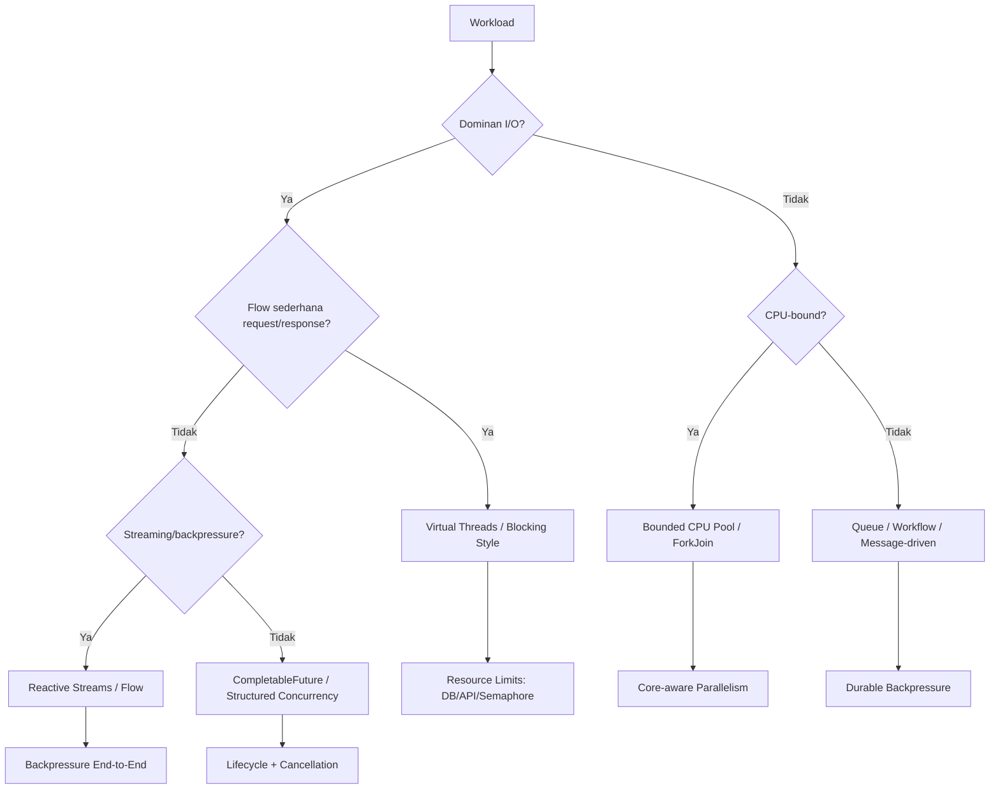
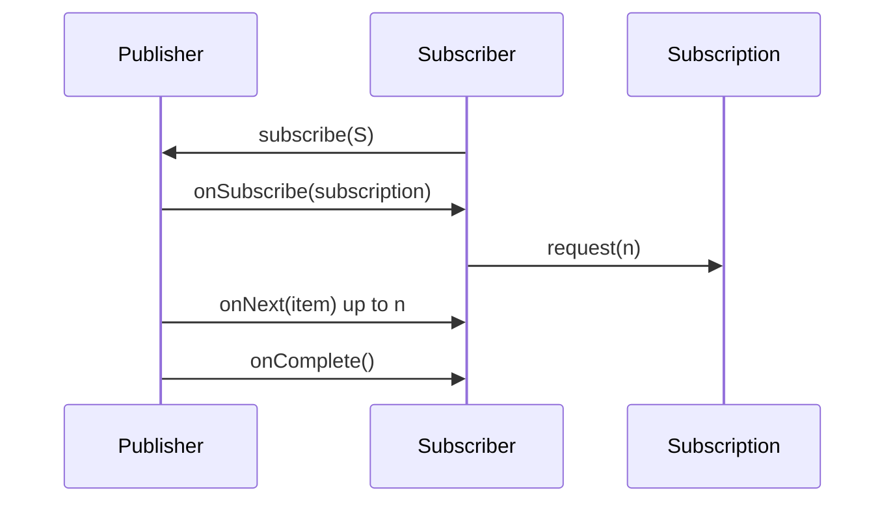
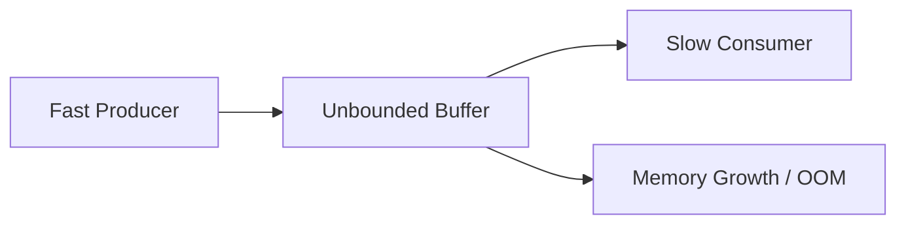
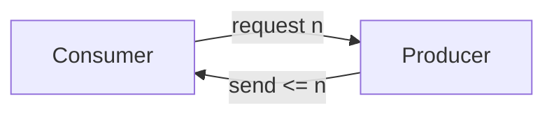
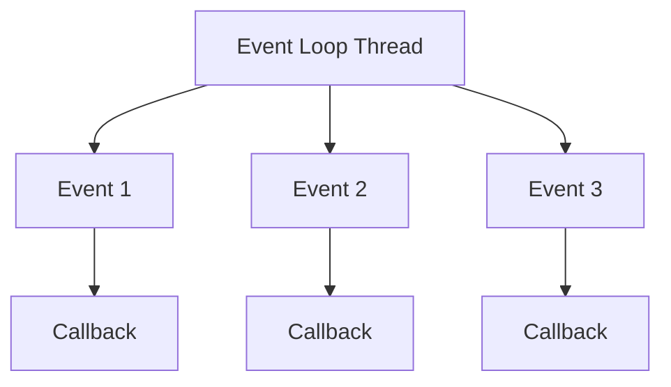
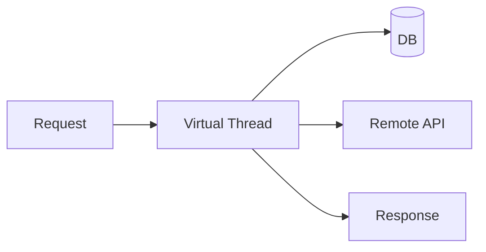
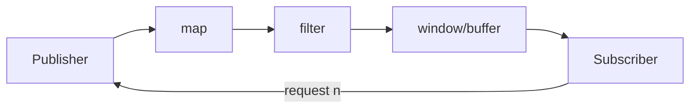
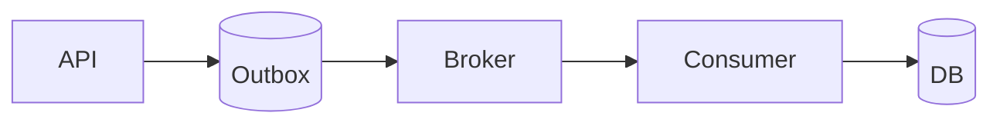

# Part 029 — Async, Reactive, Backpressure, Flow API, dan Virtual Thread Trade-Off

Java modern memiliki beberapa model concurrency yang sering dicampuradukkan:

- thread-per-request klasik;
- fixed thread pool;
- `CompletableFuture`;
- reactive streams;
- event loop;
- virtual threads;
- structured concurrency;
- message-driven processing.

Kesalahan umum adalah memilih model karena tren:

```text
"Reactive lebih scalable."
"Virtual threads membuat reactive tidak perlu."
"CompletableFuture sudah cukup."
"Thread blocking selalu buruk."
```

Semua pernyataan itu terlalu dangkal.

Model concurrency harus dipilih berdasarkan workload, failure mode, backpressure, observability, team capability, library ecosystem, dan operational constraints.

Part ini membangun decision model: kapan memakai async, kapan reactive, kapan virtual threads, kapan blocking sederhana cukup, dan kapan kamu sebenarnya butuh queue/backpressure, bukan API baru.

---

## 1. Target Performa

Setelah menyelesaikan bagian ini, kamu harus mampu:

- membedakan synchronous, asynchronous, non-blocking, reactive, parallel, concurrent, dan event-driven;
- menjelaskan `CompletableFuture` sebagai composition primitive, bukan magic scalability layer;
- menjelaskan Flow API: `Publisher`, `Subscriber`, `Subscription`, dan `Processor`;
- menjelaskan backpressure sebagai demand management, bukan sekadar buffering;
- memahami Reactive Streams sebagai standard asynchronous stream processing dengan non-blocking backpressure;
- membandingkan reactive/event-loop model dengan virtual threads;
- mendesain timeout, cancellation, error propagation, dan context propagation;
- mengenali anti-pattern async seperti unbounded fan-out, common-pool blocking, retry storm, callback spaghetti, dan hidden thread hopping;
- memilih concurrency architecture untuk HTTP service, batch job, streaming pipeline, message consumer, gateway, aggregator, dan workflow system.

---

## 2. Vocabulary yang Harus Dibersihkan

### 2.1 Concurrent

Beberapa pekerjaan sedang berada dalam progress pada waktu yang tumpang tindih.

```text
Request A menunggu DB.
Request B sedang hit API.
Request C sedang parsing response.
```

### 2.2 Parallel

Beberapa pekerjaan benar-benar berjalan di CPU core berbeda pada saat yang sama.

```text
Core 1 menjalankan task A.
Core 2 menjalankan task B.
```

Concurrency tidak selalu parallel. Parallelism adalah cara menjalankan sebagian concurrency.

### 2.3 Synchronous

Caller menunggu hasil sebelum lanjut.

```java
User user = userClient.getUser(id);
```

### 2.4 Asynchronous

Caller memulai pekerjaan dan hasil datang nanti.

```java
CompletableFuture<User> user = userClient.getUserAsync(id);
```

### 2.5 Blocking

Thread yang menjalankan code berhenti menunggu operasi selesai.

```java
ResultSet rs = statement.executeQuery(); // caller thread waits
```

### 2.6 Non-Blocking

Operasi tidak membuat thread caller menunggu sampai hasil tersedia. Completion diproses via callback/event/future.

### 2.7 Reactive

Model stream asynchronous dengan flow control/backpressure, biasanya berbasis `Publisher`/`Subscriber`.

### 2.8 Event Loop

Satu atau beberapa thread memproses event secara bergantian. Blocking di event loop sangat berbahaya karena menahan banyak flow.

---

## 3. Mental Model Pilihan Concurrency



Pertanyaan kunci:

1. Apa pekerjaan dominan: CPU, I/O, memory, network, atau coordination?
2. Apakah data finite atau stream panjang?
3. Apakah producer bisa lebih cepat dari consumer?
4. Apakah backpressure harus end-to-end?
5. Apakah library blocking atau non-blocking?
6. Apakah team bisa maintain reactive code dengan benar?
7. Apakah debugging/observability mendukung model tersebut?
8. Apakah timeout dan cancellation jelas?
9. Apakah workload lebih cocok sebagai request/response atau workflow/message?

---

## 4. `CompletableFuture`: Composition Primitive

`CompletableFuture` adalah alat untuk menyusun hasil asynchronous.

Contoh dasar:

```java
CompletableFuture<User> userFuture =
        CompletableFuture.supplyAsync(() -> userClient.getUser(userId), ioExecutor);

CompletableFuture<List<Order>> ordersFuture =
        CompletableFuture.supplyAsync(() -> orderClient.getOrders(userId), ioExecutor);

CompletableFuture<Dashboard> dashboard =
        userFuture.thenCombine(ordersFuture, Dashboard::new);
```

Nilainya:

- menjalankan beberapa operasi concurrently;
- composition tanpa blocking langsung;
- error handling chain;
- timeout;
- transformasi hasil;
- integrasi dengan API async.

Risikonya:

- executor tidak jelas;
- default common pool dipakai tanpa sadar;
- blocking di common pool;
- exception wrapping;
- cancellation tidak selalu propagate;
- context propagation sulit;
- chain sulit dibaca;
- lifecycle task tidak selalu terstruktur.

---

## 5. Executor Selection

Salah satu bug paling umum:

```java
CompletableFuture.supplyAsync(() -> blockingCall());
```

Tanpa executor eksplisit, task memakai default executor, umumnya common pool.

Jika `blockingCall()` melakukan I/O blocking, ini bisa mengganggu task lain yang memakai common pool.

Lebih baik:

```java
CompletableFuture.supplyAsync(
        () -> blockingCall(),
        blockingIoExecutor
);
```

Namun di Java modern, untuk blocking I/O, pertimbangkan virtual threads:

```java
try (var executor = Executors.newVirtualThreadPerTaskExecutor()) {
    CompletableFuture<User> user =
            CompletableFuture.supplyAsync(() -> userClient.getUser(id), executor);
}
```

Atau lebih sederhana, gunakan virtual thread di request boundary dan tulis blocking code biasa.

---

## 6. Composition Patterns

### 6.1 Transformasi Hasil

```java
CompletableFuture<UserDto> dto =
        userFuture.thenApply(UserDto::from);
```

### 6.2 Async Transformasi

```java
CompletableFuture<Account> account =
        userFuture.thenCompose(user -> accountClient.getAccountAsync(user.accountId()));
```

Gunakan `thenCompose` untuk menghindari nested future:

```java
CompletableFuture<CompletableFuture<Account>> // buruk
```

### 6.3 Combine Dua Future

```java
CompletableFuture<Dashboard> dashboard =
        userFuture.thenCombine(ordersFuture, Dashboard::new);
```

### 6.4 All Of

```java
CompletableFuture<Void> all =
        CompletableFuture.allOf(userFuture, ordersFuture, limitsFuture);
```

Hati-hati: `allOf` tidak mengembalikan typed tuple. Kamu tetap perlu mengambil hasil satu per satu.

---

## 7. Error Handling `CompletableFuture`

```java
future
    .thenApply(this::transform)
    .exceptionally(ex -> fallback());
```

Atau:

```java
future.handle((value, ex) -> {
    if (ex != null) {
        return recover(ex);
    }
    return value;
});
```

Atau:

```java
future.whenComplete((value, ex) -> {
    if (ex != null) {
        log.warn("operation failed", ex);
    }
});
```

Perbedaan:

| Method | Fungsi |
|---|---|
| `exceptionally` | recovery dari exception |
| `handle` | transform baik success maupun failure |
| `whenComplete` | side-effect saat selesai, tidak recovery default |
| `thenCompose` | flatten async operation |
| `thenCombine` | combine dua hasil |

Rule:

> Jangan biarkan exception async hilang tanpa observability.

---

## 8. Timeout dan Deadline

Timeout di async code harus eksplisit.

```java
CompletableFuture<User> user =
        userClient.getUserAsync(id)
                .orTimeout(500, TimeUnit.MILLISECONDS);
```

Fallback:

```java
CompletableFuture<User> user =
        userClient.getUserAsync(id)
                .completeOnTimeout(User.unknown(), 500, TimeUnit.MILLISECONDS);
```

Namun timeout di future tidak selalu membatalkan operation underlying. Pastikan client/library mendukung cancellation atau request timeout.

Gunakan deadline, bukan timeout lokal acak.

```text
Request deadline: 2 seconds
Service A budget: 500 ms
Service B budget: 300 ms
DB budget: 200 ms
Retry budget: remaining time only
```

---

## 9. Cancellation

Cancellation di Java async sering cooperative.

```java
future.cancel(true);
```

Tidak menjamin remote HTTP call langsung berhenti kecuali library mendukungnya.

Checklist cancellation:

- cancellation signal dikirim?
- blocking operation interruptible?
- HTTP request bisa dicancel?
- DB query timeout ada?
- child tasks dibatalkan jika parent gagal?
- retry berhenti saat deadline habis?
- resource dilepas?
- metrics mencatat cancellation?

Structured concurrency membantu karena parent-child task lifecycle lebih eksplisit, tetapi pada Java 25 masih preview.

---

## 10. Flow API

Java menyediakan `java.util.concurrent.Flow`, yang berisi empat interface utama:

```java
Flow.Publisher<T>
Flow.Subscriber<T>
Flow.Subscription
Flow.Processor<T, R>
```

Relasi:



### 10.1 Publisher

Sumber data.

```java
interface Publisher<T> {
    void subscribe(Subscriber<? super T> subscriber);
}
```

### 10.2 Subscriber

Penerima data.

```java
interface Subscriber<T> {
    void onSubscribe(Subscription subscription);
    void onNext(T item);
    void onError(Throwable throwable);
    void onComplete();
}
```

### 10.3 Subscription

Hubungan antara publisher dan subscriber. Di sinilah demand/backpressure diekspresikan.

```java
interface Subscription {
    void request(long n);
    void cancel();
}
```

### 10.4 Processor

Kombinasi subscriber dan publisher. Ia menerima item, memproses, lalu menerbitkan item lain.

```java
interface Processor<T, R> extends Subscriber<T>, Publisher<R> {}
```

---

## 11. Backpressure

Backpressure adalah mekanisme agar consumer mengendalikan seberapa banyak data yang boleh dikirim producer.

Tanpa backpressure:



Dengan backpressure:



Backpressure bukan sekadar queue. Queue hanya menunda masalah jika producer tetap lebih cepat dari consumer.

Backpressure yang sehat menjawab:

- consumer siap menerima berapa item?
- producer harus berhenti/kurangi laju kapan?
- item boleh drop?
- item harus disimpan durable?
- overload dikomunikasikan ke upstream?
- apakah ada deadline?
- apa yang terjadi saat downstream lambat?

---

## 12. Reactive Streams

Reactive Streams adalah standar untuk asynchronous stream processing dengan non-blocking backpressure.

Konsep inti:

- publisher tidak boleh mengirim item lebih banyak dari demand;
- subscriber meminta item melalui subscription;
- error terminal;
- completion terminal;
- signal order harus dipertahankan;
- non-blocking backpressure adalah tujuan utama;
- spesifikasi mendefinisikan aturan untuk interop antar-library.

Java Flow API dirancang agar semantically sejajar dengan Reactive Streams.

---

## 13. Push, Pull, dan Demand

### Push

Producer mengirim secepat mungkin.

```text
onNext(item)
onNext(item)
onNext(item)
...
```

Risiko: consumer overload.

### Pull

Consumer meminta ketika siap.

```text
next()
next()
next()
```

Risiko: producer tidak bisa push event natural.

### Reactive Demand

Gabungan:

```text
consumer requests n
producer pushes up to n
```

Ini memungkinkan asynchronous processing dengan kontrol consumer.

---

## 14. Event Loop Model

Event-loop framework memakai sedikit thread untuk menangani banyak connection.



Rule utama:

> Jangan blocking event loop.

Blocking di event loop membuat semua connection/event lain tertahan.

Jika perlu menjalankan blocking code, pindahkan ke bounded worker pool atau gunakan model berbeda.

---

## 15. Reactive Strengths

Reactive cocok jika:

- stream panjang atau tidak terbatas;
- producer dan consumer punya laju berbeda;
- backpressure harus end-to-end;
- data pipeline asynchronous;
- jumlah connection tinggi;
- event-loop ecosystem mature;
- memory harus dikontrol tanpa blocking thread;
- streaming response/request;
- message/event processing dengan flow control;
- operator composition penting.

Contoh domain:

- market data stream;
- IoT telemetry;
- high-volume event ingestion;
- streaming file processing;
- WebSocket/event stream;
- gateway dengan non-blocking I/O;
- data pipeline dengan transform/filter/windowing.

---

## 16. Reactive Costs

Reactive membawa biaya:

- learning curve;
- stack trace lebih sulit;
- debugging context lebih sulit;
- operator chain bisa opaque;
- thread hopping;
- context propagation tricky;
- blocking call bisa merusak event loop;
- error handling tersebar;
- testing butuh tool khusus;
- profiling lebih sulit;
- mental model demand/cancellation wajib benar.

Reactive code yang ditulis tanpa disiplin bisa lebih rapuh daripada blocking code.

---

## 17. Virtual Threads vs Reactive

Virtual threads dan reactive menyelesaikan sebagian masalah yang sama, tetapi dengan model berbeda.

| Aspek | Virtual Threads | Reactive |
|---|---|---|
| Style | imperative/blocking | declarative/event stream |
| Thread cost | murah | sedikit event-loop thread |
| Backpressure | manual/per-resource | bagian inti model |
| Debugging | stack trace lebih natural | perlu operator/context tooling |
| Blocking libraries | cocok | harus diisolasi |
| Streaming | bisa, tapi manual | sangat cocok |
| Request/response fan-out | cocok | cocok tapi lebih kompleks |
| CPU-bound | bukan solusi utama | bukan solusi utama |
| Context propagation | ScopedValue/ThreadLocal lebih natural | perlu context propagation |
| Team learning curve | lebih rendah untuk Java klasik | lebih tinggi |
| Ecosystem | blocking JDBC/HTTP mature | reactive library mature di domain tertentu |

Rule praktis:

```text
Virtual threads simplify high-concurrency blocking request/response.
Reactive shines for asynchronous streams with backpressure.
```

---

## 18. Decision Matrix

| Workload | Rekomendasi Awal | Catatan |
|---|---|---|
| CRUD HTTP service + JDBC | Virtual threads atau platform threads biasa | DB pool tetap batas utama |
| Aggregator banyak outbound REST blocking | Virtual threads + timeout + bulkhead | Structured concurrency jika policy mengizinkan |
| CPU-heavy computation | Bounded CPU pool/ForkJoin | Jangan pakai virtual threads untuk memperbanyak CPU |
| Streaming telemetry | Reactive streams | Backpressure penting |
| WebSocket banyak client | Reactive/event-loop atau virtual threads tergantung stack | Cek memory/thread model |
| Batch processing finite | Bounded executor/virtual threads tergantung I/O | Backpressure via queue/batch |
| Message consumer | Queue + bounded processing + idempotency | Reactive jika stream processing kompleks |
| Gateway non-blocking stack mature | Reactive/event-loop | Jangan blocking event loop |
| Legacy blocking monolith | Virtual threads bisa jadi migration path | Audit ThreadLocal, locks, pools |
| Library publik async API | `CompletionStage`/reactive type hati-hati | API compatibility jangka panjang |

---

## 19. Fan-Out Control

Async membuat fan-out mudah.

Buruk:

```java
List<CompletableFuture<Result>> futures = ids.stream()
        .map(id -> CompletableFuture.supplyAsync(() -> client.call(id), executor))
        .toList();
```

Jika `ids` berisi 100.000, kamu membuat 100.000 task.

Lebih baik:

- batasi concurrency;
- batch;
- gunakan semaphore;
- gunakan queue;
- gunakan rate limiter;
- gunakan backpressure.

Contoh semaphore:

```java
Semaphore permits = new Semaphore(50);

CompletableFuture<Result> call(String id) {
    return CompletableFuture.supplyAsync(() -> {
        try {
            if (!permits.tryAcquire(100, TimeUnit.MILLISECONDS)) {
                throw new RejectedExecutionException("bulkhead full");
            }
            try {
                return client.call(id);
            } finally {
                permits.release();
            }
        } catch (InterruptedException e) {
            Thread.currentThread().interrupt();
            throw new CompletionException(e);
        }
    }, executor);
}
```

Namun jika kamu sudah banyak menulis blocking I/O, virtual threads + explicit resource limit bisa lebih sederhana.

---

## 20. Context Propagation

Async code sering kehilangan context.

Contoh:

```java
MDC.put("correlationId", correlationId);

CompletableFuture.runAsync(() -> {
    log.info("processing"); // MDC might be missing
});
```

Karena task berjalan di thread lain.

Solusi:

- pass context eksplisit;
- gunakan wrapper executor;
- gunakan tracing instrumentation;
- gunakan context propagation library;
- gunakan `ScopedValue` untuk structured/virtual thread flow;
- hindari domain logic bergantung pada hidden thread-local context.

Pattern eksplisit:

```java
record RequestContext(String correlationId, String tenantId) {}

CompletableFuture<Result> process(RequestContext context, Request request) {
    return CompletableFuture.supplyAsync(() -> service.handle(context, request), executor);
}
```

---

## 21. Error Propagation

Async/reactive pipeline harus punya error semantics.

Pertanyaan:

- apakah satu subtask gagal membatalkan semua?
- apakah fallback diperbolehkan?
- apakah partial result valid?
- apakah error retryable?
- apakah cancellation downstream diberitahu?
- apakah error di-log sekali atau berkali-kali?
- apakah error category stabil?
- apakah trace/span menandai failure?

Contoh aggregator:

```text
User service gagal:
- Dashboard gagal total?
- Dashboard partial?
- Fallback anonymous user?
- Retry?
- Cache stale?
```

Ini bukan hanya technical decision. Ini business contract.

---

## 22. Timeout Composition

Jangan menaruh timeout yang tidak konsisten.

Buruk:

```text
API gateway timeout: 2s
Service A timeout to B: 5s
Service B timeout to DB: 10s
```

Service A akan tetap bekerja setelah caller sudah menyerah.

Lebih baik:

```text
Deadline masuk: now + 2s
Setiap downstream mengambil budget dari remaining deadline
Retry hanya jika masih ada budget
```

Representasi:

```java
record Deadline(Instant expiresAt) {
    Duration remaining(Clock clock) {
        return Duration.between(clock.instant(), expiresAt);
    }

    boolean expired(Clock clock) {
        return !remaining(clock).isPositive();
    }
}
```

---

## 23. Async and Transactions

Hati-hati mencampur async dengan transaction context.

Masalah umum:

```java
@Transactional
public void process(Order order) {
    repository.save(order);

    CompletableFuture.runAsync(() -> {
        repository.saveAudit(order); // may run outside transaction/context
    });
}
```

Risiko:

- transaction context thread-bound;
- entity manager tidak thread-safe;
- lazy entity digunakan di thread lain;
- commit belum terjadi;
- rollback tidak membatalkan async task;
- audit melihat state belum final.

Solusi:

- publish event after commit;
- gunakan outbox pattern;
- pass immutable DTO, bukan entity managed;
- buat transaction baru eksplisit jika perlu;
- jangan akses persistence context dari thread lain.

---

## 24. Async and Observability

Async system wajib punya observability lebih disiplin.

Metrics:

- active tasks;
- queued tasks;
- task latency;
- queue wait;
- cancellation count;
- timeout count;
- retry count;
- downstream in-flight;
- demand/requested items jika reactive;
- dropped items;
- backpressure events.

Logs/traces:

- correlation id propagated;
- span per async boundary;
- error terminal logged;
- cancellation visible;
- retries visible;
- queue wait visible.

JFR/profiling:

- thread states;
- lock contention;
- allocation;
- CPU;
- socket I/O;
- virtual thread events jika relevan.

---

## 25. Testing Async/Reactive Code

Test harus mengontrol:

- timing;
- timeout;
- cancellation;
- slow producer;
- slow consumer;
- failure in middle;
- backpressure;
- retry;
- ordering;
- context propagation;
- resource cleanup.

Anti-pattern:

```java
Thread.sleep(1000);
assertEquals(...)
```

Lebih baik:

- use latches/barriers;
- virtual time jika reactive library mendukung;
- deterministic scheduler;
- await with timeout;
- test cancellation;
- test no item beyond demand;
- test cleanup after error.

---

## 26. Architecture Patterns

### 26.1 Blocking Request/Response with Virtual Threads



Cocok untuk codebase imperative.

Guardrails:

- timeout;
- DB pool;
- HTTP pool;
- bulkhead;
- cancellation;
- observability.

### 26.2 Reactive Pipeline



Cocok untuk streaming/backpressure.

Guardrails:

- no blocking event loop;
- demand respected;
- bounded buffers;
- error handling;
- context propagation;
- test with slow consumers.

### 26.3 Message Queue Boundary



Cocok untuk durable async workflow.

Guardrails:

- idempotency;
- ordering;
- retry;
- DLQ;
- backpressure;
- monitoring lag;
- poison message handling.

---

## 27. Anti-Pattern Catalog

### 27.1 Async Over Sync

Membungkus blocking call dengan async tanpa mengubah resource model.

```java
CompletableFuture.supplyAsync(() -> jdbcCall());
```

Ini hanya memindahkan blocking ke thread lain.

### 27.2 Unbounded Fan-Out

Membuat task sebanyak input tanpa limit.

### 27.3 Blocking Event Loop

Menjalankan JDBC/blocking file I/O di event loop.

### 27.4 Common Pool Abuse

Menjalankan blocking I/O di `ForkJoinPool.commonPool()`.

### 27.5 Timeout Only at the Edge

Timeout hanya di API gateway, downstream tetap bekerja lama.

### 27.6 Lost Context

Trace/log context hilang setelah async boundary.

### 27.7 Reactive Without Backpressure Understanding

Memakai operator reactive tapi tetap buffer tanpa batas.

### 27.8 Returning Future but Doing Work Immediately

API terlihat async, tetapi sudah blocking sebelum future dikembalikan.

### 27.9 Async Transaction Leakage

Menggunakan entity/session/transaction context di thread lain.

### 27.10 Swallowed Errors

Future gagal tetapi tidak diobservasi.

---

## 28. Code Review Checklist

- [ ] Model concurrency apa yang dipilih dan kenapa?
- [ ] Workload I/O-bound, CPU-bound, atau streaming?
- [ ] Executor eksplisit?
- [ ] Blocking call di event loop/common pool?
- [ ] Fan-out bounded?
- [ ] Queue/buffer bounded?
- [ ] Backpressure jelas?
- [ ] Timeout dan deadline jelas?
- [ ] Cancellation propagate?
- [ ] Error semantics jelas?
- [ ] Retry punya budget?
- [ ] Context propagation aman?
- [ ] Transaction context tidak bocor?
- [ ] Resource limit per dependency?
- [ ] Observability per async boundary?
- [ ] Test mencakup slow consumer/failure/cancellation?

---

## 29. Latihan 20 Jam

### Jam 1–3: CompletableFuture Composition

Buat aggregator tiga fake remote service. Implementasikan sequential, `CompletableFuture`, dan virtual thread. Bandingkan readability dan error handling.

### Jam 4–6: Executor Trap

Jalankan blocking task di common pool. Observasi starvation. Perbaiki dengan executor eksplisit atau virtual threads.

### Jam 7–9: Timeout and Cancellation

Tambahkan slow dependency. Implementasikan timeout dan cancellation. Pastikan metrics/logs mencatatnya.

### Jam 10–12: Backpressure Simulation

Buat producer cepat dan consumer lambat. Versi 1 pakai unbounded queue. Versi 2 pakai bounded queue/backpressure.

### Jam 13–15: Flow API Mini Publisher

Implementasikan `Flow.Publisher` sederhana yang menghormati `request(n)`. Buat subscriber lambat.

### Jam 16–18: Context Propagation

Tambahkan correlation id. Tunjukkan bagaimana context hilang di async boundary. Perbaiki dengan context eksplisit/wrapper.

### Jam 19–20: Decision RFC

Tulis RFC:

- workload;
- model concurrency yang dipilih;
- alasan;
- failure mode;
- timeout/cancellation;
- backpressure;
- observability;
- test plan.

---

## 30. Ringkasan

Async bukan otomatis scalable. Reactive bukan otomatis lebih baik. Virtual threads bukan pengganti backpressure. `CompletableFuture` bukan pengganti resource governance.

Mental model utama:

```text
Concurrency model must match workload shape.
Blocking is not evil; unbounded blocking is.
Reactive is not magic; backpressure is the core value.
Virtual threads reduce thread cost; they do not reduce downstream cost.
Async increases the need for timeout, cancellation, context propagation, and observability.
```

Engineer yang kuat tidak bertanya "pakai reactive atau virtual thread?". Ia bertanya:

```text
Apa yang diproduksi?
Siapa consumer?
Apa yang terjadi jika consumer lambat?
Resource apa yang terbatas?
Apa deadline-nya?
Bagaimana failure propagate?
Bagaimana cancellation bekerja?
Bagaimana kita mengamati sistem ini saat rusak?
```

---

## 31. Referensi Resmi

- Java SE 25 Flow API: https://docs.oracle.com/en/java/javase/25/docs/api/java.base/java/util/concurrent/Flow.html
- Reactive Streams Specification for the JVM: https://github.com/reactive-streams/reactive-streams-jvm
- Java SE 25 CompletableFuture: https://docs.oracle.com/en/java/javase/25/docs/api/java.base/java/util/concurrent/CompletableFuture.html
- Java SE 25 Executors: https://docs.oracle.com/en/java/javase/25/docs/api/java.base/java/util/concurrent/Executors.html
- JEP 444 — Virtual Threads: https://openjdk.org/jeps/444
- JEP 505 — Structured Concurrency: https://openjdk.org/jeps/505
- JEP 506 — Scoped Values: https://openjdk.org/jeps/506
