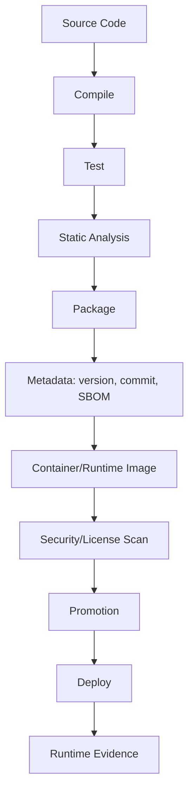
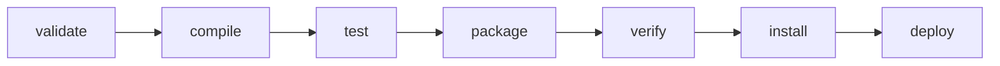
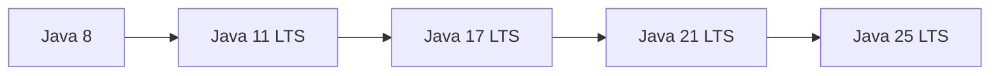

# Part 033 — Build, Dependency, Release, dan Migration Java 8 ke 25

Banyak engineer belajar Java sebagai bahasa, lalu menganggap build/release sebagai urusan sekunder. Di production, itu salah.

Java code yang bagus tetap bisa gagal karena:

- JDK build berbeda dengan JDK runtime;
- `source`/`target` salah sehingga API baru bocor ke runtime lama;
- transitive dependency konflik;
- bytecode library tidak mendukung class file versi baru;
- annotation processor gagal di JDK baru;
- CI memakai JDK berbeda dari developer;
- container image memakai patch JDK berbeda;
- Maven/Gradle plugin lama tidak kompatibel;
- illegal reflective access muncul setelah upgrade;
- library bergantung pada internal JDK API;
- logging/observability agent belum mendukung JDK baru;
- dependency supply chain tidak terkendali;
- rollback tidak disiapkan.

Part ini membangun kemampuan release engineering Java modern: dari source code sampai artifact yang bisa dipromosikan, diaudit, dan dimigrasikan lintas LTS.

---

## 1. Target Performa

Setelah menyelesaikan bagian ini, kamu harus mampu:

- menjelaskan lifecycle build Java modern;
- memilih dan mengkonfigurasi Maven/Gradle secara defensible;
- memakai `--release` dan Java toolchains dengan benar;
- mengelola dependency versions, BOM, scopes/configurations, dan transitive dependency;
- mendeteksi dependency convergence problem;
- memahami shading, relocation, multi-module build, dan generated code;
- membuat build reproducible dan CI-friendly;
- menghasilkan artifact yang punya version, metadata, SBOM, dan provenance;
- membuat migration plan Java 8 → 11 → 17 → 21 → 25;
- memisahkan runtime upgrade dari language-feature adoption;
- membuat rollback/canary strategy;
- menulis migration RFC yang bisa diaudit.

---

## 2. Build sebagai Supply Chain

Build bukan hanya compile.



Setiap tahap memiliki risiko:

| Tahap | Risiko |
|---|---|
| Compile | JDK salah, release salah, annotation processor gagal |
| Test | test tidak representatif, flaky, environment berbeda |
| Static analysis | false confidence atau tool tidak support syntax baru |
| Package | dependency duplicate, manifest salah, resource hilang |
| Image | JDK patch berbeda, CVE, timezone/cert issue |
| Scan | vulnerable transitive dependency |
| Promotion | artifact dibuild ulang, bukan dipromosikan |
| Deploy | rollback tidak kompatibel dengan schema/config |
| Runtime | flags/JDK berbeda dari test |

---

## 3. Java Version: Source, Target, Release, Runtime

Konsep yang sering membingungkan:

| Konsep | Makna |
|---|---|
| Source level | syntax Java yang diterima compiler |
| Target bytecode | class file version yang dihasilkan |
| Release | source+target+bootclasspath/API sesuai rilis tertentu |
| Build JDK | JDK yang menjalankan compiler/build tool |
| Runtime JDK | JDK yang menjalankan aplikasi |
| Toolchain JDK | JDK khusus yang dipakai build untuk compile/test/run task |

### 3.1 Kenapa `--release` Penting?

Jika compile dengan JDK 25 tapi ingin target Java 17, memakai `source=17` dan `target=17` saja tidak cukup. Kamu bisa tidak sengaja memakai API yang hanya ada di JDK 25.

Gunakan `--release`.

Maven:

```xml
<properties>
    <maven.compiler.release>17</maven.compiler.release>
</properties>
```

Gradle:

```kotlin
java {
    toolchain {
        languageVersion = JavaLanguageVersion.of(17)
    }
}
```

Atau untuk compile options spesifik:

```kotlin
tasks.withType<JavaCompile>().configureEach {
    options.release.set(17)
}
```

Rule:

> Jika ingin compatibility dengan runtime Java tertentu, gunakan `release`, bukan hanya `source` dan `target`.

---

## 4. Class File Version Awareness

Setiap Java release menghasilkan class file major version berbeda.

Contoh penting:

| Java | Class File Major |
|---:|---:|
| 8 | 52 |
| 11 | 55 |
| 17 | 61 |
| 21 | 65 |
| 25 | 69 |

Jika runtime lebih tua mencoba menjalankan class file lebih baru, hasilnya:

```text
UnsupportedClassVersionError
```

Cek class file:

```bash
javap -verbose target/classes/com/acme/App.class | grep "major"
```

Atau cek artifact:

```bash
jdeps --multi-release 25 app.jar
```

---

## 5. Maven Lifecycle Mental Model

Maven punya lifecycle standard:



Core concepts:

| Konsep | Makna |
|---|---|
| POM | project model |
| Lifecycle | urutan phase |
| Plugin | logic yang berjalan di phase |
| Goal | task spesifik plugin |
| Dependency scope | kapan dependency dipakai |
| Dependency management | kontrol version dependency |
| Parent POM | inheritance config |
| BOM | version alignment |
| Profile | conditional config |

---

## 6. Maven Compiler Configuration

Baseline modern:

```xml
<properties>
    <maven.compiler.release>25</maven.compiler.release>
    <project.build.sourceEncoding>UTF-8</project.build.sourceEncoding>
</properties>
```

Plugin explicit:

```xml
<build>
  <plugins>
    <plugin>
      <groupId>org.apache.maven.plugins</groupId>
      <artifactId>maven-compiler-plugin</artifactId>
      <version>3.14.1</version>
      <configuration>
        <release>25</release>
      </configuration>
    </plugin>
  </plugins>
</build>
```

Untuk project multi-JDK, jangan bergantung pada `JAVA_HOME` developer. Gunakan toolchains.

---

## 7. Maven Toolchains

`~/.m2/toolchains.xml`:

```xml
<toolchains>
  <toolchain>
    <type>jdk</type>
    <provides>
      <version>25</version>
      <vendor>any</vendor>
    </provides>
    <configuration>
      <jdkHome>/opt/jdks/jdk-25</jdkHome>
    </configuration>
  </toolchain>
</toolchains>
```

POM:

```xml
<plugin>
  <groupId>org.apache.maven.plugins</groupId>
  <artifactId>maven-toolchains-plugin</artifactId>
  <version>3.2.0</version>
  <executions>
    <execution>
      <goals>
        <goal>toolchain</goal>
      </goals>
    </execution>
  </executions>
  <configuration>
    <toolchains>
      <jdk>
        <version>25</version>
      </jdk>
    </toolchains>
  </configuration>
</plugin>
```

Tujuan:

- build tidak tergantung `JAVA_HOME`;
- CI dan developer konsisten;
- bisa compile/test multi-JDK;
- migration matrix lebih mudah.

---

## 8. Gradle Lifecycle Mental Model

Gradle task graph lebih fleksibel daripada Maven lifecycle.

Konsep:

| Konsep | Makna |
|---|---|
| Task | unit kerja |
| Plugin | menambah task/configuration |
| Configuration | dependency bucket |
| Source set | kumpulan source |
| Toolchain | JDK untuk compile/test/run |
| Build cache | reuse output |
| Wrapper | Gradle version terkunci |

Baseline:

```kotlin
plugins {
    java
}

java {
    toolchain {
        languageVersion = JavaLanguageVersion.of(25)
    }
}

tasks.withType<Test>().configureEach {
    useJUnitPlatform()
}
```

Gunakan Gradle Wrapper:

```bash
./gradlew build
```

Jangan mengandalkan Gradle system-wide.

---

## 9. Dependency Scopes dan Configurations

### Maven Scopes

| Scope | Makna |
|---|---|
| `compile` | compile + runtime |
| `provided` | compile, runtime disediakan environment |
| `runtime` | runtime saja |
| `test` | test saja |
| `import` | BOM di dependencyManagement |
| `system` | hindari |

### Gradle Configurations

| Configuration | Makna |
|---|---|
| `implementation` | internal dependency |
| `api` | exposed API dependency, untuk java-library plugin |
| `compileOnly` | compile only |
| `runtimeOnly` | runtime only |
| `testImplementation` | test compile/runtime |
| `annotationProcessor` | annotation processor |

Rule:

> Jangan expose dependency sebagai API jika hanya implementation detail.

Ini penting untuk library compatibility dan dependency graph hygiene.

---

## 10. BOM dan Version Alignment

BOM mengunci versi kumpulan dependency agar saling kompatibel.

Maven:

```xml
<dependencyManagement>
  <dependencies>
    <dependency>
      <groupId>com.fasterxml.jackson</groupId>
      <artifactId>jackson-bom</artifactId>
      <version>2.20.0</version>
      <type>pom</type>
      <scope>import</scope>
    </dependency>
  </dependencies>
</dependencyManagement>
```

Dependency tanpa version:

```xml
<dependency>
  <groupId>com.fasterxml.jackson.core</groupId>
  <artifactId>jackson-databind</artifactId>
</dependency>
```

Gradle:

```kotlin
dependencies {
    implementation(platform("com.fasterxml.jackson:jackson-bom:2.20.0"))
    implementation("com.fasterxml.jackson.core:jackson-databind")
}
```

Manfaat:

- menghindari version skew;
- memudahkan upgrade;
- dependency graph lebih predictable;
- cocok untuk ecosystem besar seperti Jackson, Netty, Spring, gRPC.

---

## 11. Dependency Convergence

Dependency convergence problem:

```text
A -> C:1.0
B -> C:2.0
App -> A + B
```

Build tool memilih salah satu versi. Pilihan itu bisa membuat runtime error.

Maven tools:

```bash
mvn dependency:tree
mvn enforcer:enforce
```

Maven Enforcer contoh:

```xml
<plugin>
  <groupId>org.apache.maven.plugins</groupId>
  <artifactId>maven-enforcer-plugin</artifactId>
  <version>3.5.0</version>
  <executions>
    <execution>
      <id>enforce</id>
      <goals>
        <goal>enforce</goal>
      </goals>
      <configuration>
        <rules>
          <dependencyConvergence/>
          <requireJavaVersion>
            <version>[25,)</version>
          </requireJavaVersion>
        </rules>
      </configuration>
    </execution>
  </executions>
</plugin>
```

Gradle:

```bash
./gradlew dependencies
./gradlew dependencyInsight --dependency guava
```

Rule:

> Dependency graph adalah bagian dari runtime behavior. Review seperti code.

---

## 12. Shading dan Relocation

Shading membuat dependency masuk ke artifact sendiri. Relocation mengubah package agar tidak konflik.

Use case:

- CLI standalone;
- library yang ingin menghindari dependency conflict;
- embedded tool;
- plugin environment.

Risiko:

- duplicate classes;
- service loader resources rusak;
- licenses;
- security scanning sulit;
- reflection/resource paths rusak;
- stack trace membingungkan;
- CVE tracking sulit.

Maven Shade Plugin contoh konseptual:

```xml
<relocations>
  <relocation>
    <pattern>com.google.common</pattern>
    <shadedPattern>com.acme.shadow.guava</shadedPattern>
  </relocation>
</relocations>
```

Rule:

> Shade hanya jika kamu mengerti classpath conflict yang ingin diselesaikan.

---

## 13. Multi-Module Build

Multi-module cocok jika:

- satu repository punya beberapa component;
- shared model/api;
- service + library;
- test fixtures;
- platform BOM;
- incremental build penting;
- release versioning terkoordinasi.

Struktur:

```text
root
├── pom.xml / settings.gradle.kts
├── platform-bom
├── domain
├── application
├── infrastructure
├── service
└── integration-tests
```

Risiko:

- module terlalu banyak;
- dependency cycle;
- build lambat;
- unclear ownership;
- everything depends on everything;
- internal API bocor.

Rule:

> Module boundary harus mengikuti architectural boundary, bukan folder preference.

---

## 14. Reproducible Builds

Reproducible build berarti source + dependency + environment yang sama menghasilkan artifact yang sama atau setara.

Hal yang mengganggu reproducibility:

- timestamp dalam JAR;
- generated files non-deterministic;
- dependency range;
- snapshot dependency;
- environment-specific path;
- system time/timezone;
- unordered resource packaging;
- build plugin version floating;
- external service during build.

Checklist:

- pin plugin versions;
- pin dependency versions;
- avoid dynamic ranges;
- avoid snapshots untuk release;
- use wrapper;
- normalize encoding/timezone;
- record commit SHA;
- generate SBOM;
- build once, promote same artifact.

---

## 15. SBOM dan Supply Chain Hygiene

SBOM = Software Bill of Materials. Ia mendeskripsikan dependency/artifact yang masuk ke software.

Manfaat:

- vulnerability response;
- license review;
- supply chain audit;
- incident response saat CVE baru;
- compliance.

Format umum:

- CycloneDX;
- SPDX.

Minimal metadata artifact:

- application name;
- version;
- commit SHA;
- build time;
- JDK version;
- build tool version;
- dependency list;
- container base image;
- SBOM;
- signature/provenance jika tersedia.

---

## 16. Static Analysis Gates

Static analysis bukan pengganti review, tetapi gate yang baik untuk bug class tertentu.

Tools umum:

- Checkstyle;
- SpotBugs;
- Error Prone;
- PMD;
- NullAway;
- ArchUnit;
- OWASP Dependency-Check;
- Snyk/Trivy/Grype;
- Revapi/japicmp untuk binary compatibility;
- forbidden-apis;
- Maven Enforcer/Gradle dependency checks.

Gate contoh:

- no dependency convergence conflict;
- no vulnerable critical dependency;
- no forbidden JDK internal API;
- no public API binary break tanpa approval;
- no generated code drift;
- no test skipping in release;
- code format consistent.

---

## 17. CI Pipeline Java Modern

```mermaid id="java_ci_pipeline"
flowchart LR
    CHECKOUT[Checkout] --> SETUP[Setup JDK Toolchain]
    SETUP --> COMPILE[Compile]
    COMPILE --> UNIT[Unit Tests]
    UNIT --> STATIC[Static Analysis]
    STATIC --> INTEG[Integration Tests]
    INTEG --> PACKAGE[Package]
    PACKAGE --> SBOM[Generate SBOM]
    SBOM --> SCAN[Scan]
    SCAN --> IMAGE[Build Image]
    IMAGE --> SMOKE[Smoke Test]
    SMOKE --> PUBLISH[Publish Artifact]
```



CI rules:

- use wrapper;
- use pinned JDK;
- cache dependencies safely;
- fail on warnings that matter;
- publish test reports;
- publish JFR/profile only for perf jobs;
- separate unit/integration/performance stages;
- build artifact once;
- promote artifact across environments;
- store SBOM and provenance.

---

## 18. Release Versioning

Versioning options:

| Strategy | Use |
|---|---|
| SemVer | libraries/API |
| CalVer | services/platform releases |
| Git SHA | internal deploy trace |
| Build number | CI trace |
| Maven snapshot/release | Java ecosystem |

For public libraries:

```text
MAJOR.MINOR.PATCH
```

Changing public API requires compatibility review.

For services:

- version should identify artifact exactly;
- include commit SHA;
- include build timestamp;
- expose `/version` or build info endpoint;
- include deployment metadata in logs/metrics/traces.

---

## 19. Java Migration Strategy: Prinsip

Migration Java 8 → 25 bukan satu langkah.

Jalur sehat:



Prinsip:

1. Upgrade runtime dulu, fitur bahasa belakangan.
2. Upgrade build tool/plugin sebelum upgrade source.
3. Upgrade dependency/agent sebelum runtime switch.
4. Jalankan test matrix multi-JDK.
5. Hilangkan illegal/internal API usage.
6. Pastikan observability agent kompatibel.
7. Canary dengan artifact yang sama.
8. Rollback runtime harus jelas.
9. Jangan gabungkan migration JDK dengan refactor besar.
10. Catat semua flag dan behavior change.

---

## 20. Java 8 ke 11

Risiko utama:

- Java EE/CORBA modules removed;
- JAXB/JAX-WS tidak tersedia by default;
- illegal reflective access warnings;
- library lama bergantung pada internal API;
- TLS/cert/security behavior change;
- build plugin lama;
- container memory behavior berbeda;
- default GC/runtime behavior berubah dari versi lama.

Checklist:

- update Maven/Gradle;
- update compiler/surefire/failsafe plugins;
- add explicit JAXB/JAX-WS dependency jika perlu;
- run `jdeps`;
- audit `sun.misc.*`;
- update bytecode libs;
- update test libraries;
- run full integration tests;
- run staging with JDK 11.

---

## 21. Java 11 ke 17

Risiko utama:

- strong encapsulation JDK internals semakin tegas;
- reflective access yang sebelumnya warning bisa gagal;
- framework lama tidak kompatibel;
- Security Manager deprecation path;
- removal/deprecation fitur lama;
- records/sealed classes mungkin mulai diadopsi tetapi jangan wajib.

Checklist:

- update framework major version jika perlu;
- audit `--add-opens` sementara;
- remove internal API dependency;
- update agents/APM;
- update container base image;
- run load test;
- compare GC/latency baseline.

---

## 22. Java 17 ke 21

Peluang utama:

- virtual threads final;
- record patterns/switch patterns;
- sequenced collections;
- generational ZGC;
- better modern language baseline.

Risiko:

- tool/static analysis belum mendukung syntax jika langsung pakai fitur baru;
- virtual threads mengubah resource pressure;
- ThreadLocal/context behavior perlu audit;
- DB pool/downstream bottleneck bisa muncul.

Checklist:

- runtime upgrade first;
- do not enable virtual threads globally without load test;
- audit thread pools;
- audit blocking calls;
- audit DB pool metrics;
- update CI to JDK 21;
- compare p95/p99, allocation, GC.

---

## 23. Java 21 ke 25

Peluang utama:

- Scoped Values final;
- compact source files final;
- flexible constructor bodies final;
- module import declarations final;
- compact object headers final;
- Generational Shenandoah final;
- AOT command-line ergonomics/method profiling;
- JFR improvements;
- Class-File API/Stream Gatherers sudah final sejak JDK 24.

Risiko:

- JDK 25 release notes/migration guide changes;
- agents/bytecode tools harus support class file 69;
- preview/incubator features masih butuh `--enable-preview`;
- structured concurrency masih preview;
- vector API masih incubator;
- native/JNI/Unsafe restrictions makin kuat;
- observability agent compatibility.

Checklist:

- upgrade bytecode libraries;
- update APM/profiler agents;
- verify static analysis support;
- run migration guide checks;
- audit native access warnings;
- audit `sun.misc.Unsafe` memory access usage;
- run with JDK 25 without source changes;
- collect performance baseline;
- adopt final language features selectively.

---

## 24. `jdeps` dan `jdeprscan`

`jdeps` membantu menganalisis dependency JDK modules dan internal API.

```bash
jdeps --multi-release 25 --class-path libs/* app.jar
```

Cek internal API:

```bash
jdeps --jdk-internals app.jar
```

`jdeprscan` membantu mencari deprecated API usage.

```bash
jdeprscan --release 25 app.jar
```

Gunakan sebagai migration gate.

---

## 25. Runtime Flags Migration

JVM flags bisa berubah, deprecated, atau removed.

Checklist:

- dump current flags;
- cek flags tidak dikenal di JDK baru;
- hapus tuning legacy tanpa evidence;
- validasi GC flags;
- validasi container memory flags;
- validasi logging flags;
- validasi `--add-opens`/`--add-exports`;
- dokumentasikan alasan setiap flag.

Command:

```bash
java -XX:+PrintFlagsFinal -version
java -Xlog:help
```

Runtime config harus diperlakukan seperti code.

---

## 26. Migration Test Matrix

Contoh matrix:

| Stage | JDK 17 | JDK 21 | JDK 25 |
|---|---:|---:|---:|
| Compile | yes | yes | yes |
| Unit test | yes | yes | yes |
| Integration test | yes | yes | yes |
| Static analysis | yes | yes | yes |
| Container smoke | no | yes | yes |
| Load test | baseline | compare | target |
| Canary | no | optional | yes |

Untuk migration besar:

- jalankan app lama di JDK baru;
- jalankan tests lama di JDK baru;
- baru ubah source level;
- baru adopsi fitur baru.

---

## 27. Rollback Strategy

Rollback bukan hanya deploy artifact lama.

Pertanyaan:

- schema backward-compatible?
- config backward-compatible?
- queue/event format backward-compatible?
- data migration reversible?
- feature flag bisa dimatikan?
- artifact lama bisa jalan di runtime lama?
- container image tersedia?
- JDK runtime lama tersedia?
- monitoring bisa membedakan versi?
- outbox/event duplicate aman?
- cache format kompatibel?

Migration JDK sebaiknya tidak digabung dengan migration schema destruktif.

---

## 28. Canary Strategy

Canary untuk JDK upgrade:

1. deploy JDK baru ke subset kecil traffic;
2. bandingkan dengan control;
3. pantau:
   - error rate;
   - p50/p95/p99;
   - CPU;
   - RSS;
   - heap;
   - GC pause;
   - allocation;
   - thread count;
   - class loading;
   - dependency metrics;
   - agent errors;
   - logs warnings;
4. naikkan traffic bertahap;
5. rollback jika signal buruk.

Canary harus punya baseline JDK lama yang sebanding.

---

## 29. Migration RFC Template

```markdown
# RFC: Migrate <Service> from Java <old> to Java <new>

## Summary

## Motivation

## Current State

- Runtime JDK:
- Source level:
- Build tool:
- Framework:
- Critical dependencies:
- JVM flags:

## Target State

- Runtime JDK:
- Source/release:
- Container image:
- Toolchain:

## Compatibility Analysis

- Source:
- Binary:
- Dependencies:
- Agents:
- Reflection/internal APIs:
- Native/JNI:
- Serialization:
- Build plugins:

## Test Plan

- Unit:
- Integration:
- Contract:
- Load:
- Soak:
- Canary:

## Rollout Plan

## Rollback Plan

## Risks

## Owners
```

---

## 30. Build/Release Checklist

- [ ] Build uses wrapper.
- [ ] JDK toolchain pinned.
- [ ] `--release` configured.
- [ ] Plugin versions pinned.
- [ ] Dependency versions pinned or BOM-managed.
- [ ] Dependency convergence checked.
- [ ] Vulnerability scan configured.
- [ ] License/SBOM generated.
- [ ] Tests separated by level.
- [ ] Static analysis gates defined.
- [ ] Artifact built once and promoted.
- [ ] Version metadata embedded.
- [ ] Container image records JDK version.
- [ ] Runtime flags documented.
- [ ] Rollback tested.
- [ ] Migration guide reviewed before JDK upgrade.
- [ ] Observability agent compatibility checked.

---

## 31. Latihan 20 Jam

### Jam 1–3: Maven/Gradle Toolchain

Buat project kecil yang compile dengan Java 25 tanpa bergantung pada `JAVA_HOME`.

### Jam 4–6: `--release` Trap

Compile dengan JDK 25 target Java 17. Coba pakai API JDK 25. Bandingkan `source/target` vs `release`.

### Jam 7–9: Dependency Conflict

Buat konflik transitive dependency. Gunakan `dependency:tree` atau `dependencyInsight`.

### Jam 10–12: Migration Audit

Ambil project Java 8/11 kecil. Jalankan `jdeps --jdk-internals`, update dependency, dan tulis findings.

### Jam 13–15: CI Gate

Tambahkan static analysis, dependency scan, dan SBOM generation.

### Jam 16–18: Runtime Flags Audit

Ambil daftar JVM flags legacy. Klasifikasikan: keep/remove/needs evidence.

### Jam 19–20: Migration RFC

Tulis RFC migrasi Java 17 ke 25 untuk service imajiner.

---

## 32. Anti-Pattern

### Anti-Pattern 1 — Build Works on My Machine

Tidak ada toolchain/wrapper/pinned version.

### Anti-Pattern 2 — Source/Target Without Release

Bisa bocor API runtime baru.

### Anti-Pattern 3 — Snapshot Dependency in Release

Tidak reproducible.

### Anti-Pattern 4 — Upgrade JDK + Refactor Besar

Root cause incident menjadi sulit dipisahkan.

### Anti-Pattern 5 — No Dependency Tree Review

Transitive dependency menentukan runtime.

### Anti-Pattern 6 — Rebuild Per Environment

Artifact dev/staging/prod berbeda.

### Anti-Pattern 7 — No Rollback

Migration bukan production-ready tanpa rollback.

### Anti-Pattern 8 — Preview Feature in Public API

Mengunci consumer ke fitur non-final.

---

## 33. Ringkasan

Build dan migration adalah bagian dari engineering, bukan administrasi.

Mental model utama:

```text
Source compatibility is not runtime compatibility.
Build JDK is not runtime JDK.
Dependency graph is executable behavior.
JDK migration is a controlled change program.
Artifact must be reproducible, traceable, and rollbackable.
```

Top-tier Java engineer mampu membawa codebase lama ke JDK baru tanpa membuat organisasi kehilangan safety net. Caranya bukan heroic refactor, tetapi build discipline, compatibility analysis, staged rollout, evidence, dan rollback.

---

## 34. Referensi Resmi

- Maven Compiler Plugin — Setting source/target and release: https://maven.apache.org/plugins/maven-compiler-plugin/examples/set-compiler-source-and-target.html
- Maven Toolchains Plugin: https://maven.apache.org/plugins/maven-toolchains-plugin/
- Gradle Java Toolchains: https://docs.gradle.org/current/userguide/toolchains.html
- Oracle JDK 25 Migration Guide: https://docs.oracle.com/en/java/javase/25/migrate/
- Preparing for Migration, Oracle JDK 25: https://docs.oracle.com/en/java/javase/25/migrate/preparing-migration.html
- JDK Tools and Utilities: https://docs.oracle.com/en/java/javase/25/docs/specs/man/
- CycloneDX Maven Plugin: https://github.com/CycloneDX/cyclonedx-maven-plugin
- CycloneDX Gradle Plugin: https://github.com/CycloneDX/cyclonedx-gradle-plugin
