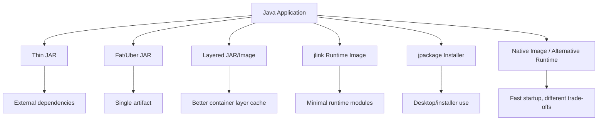
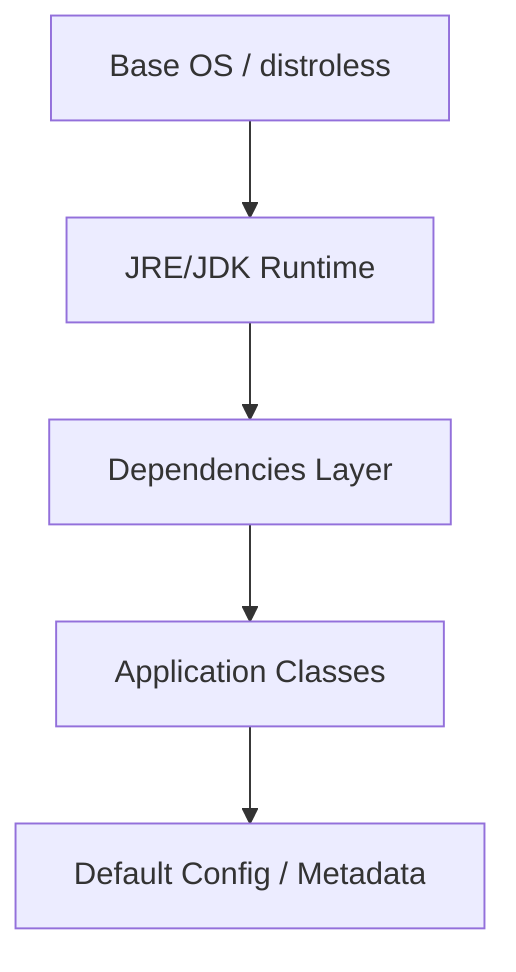
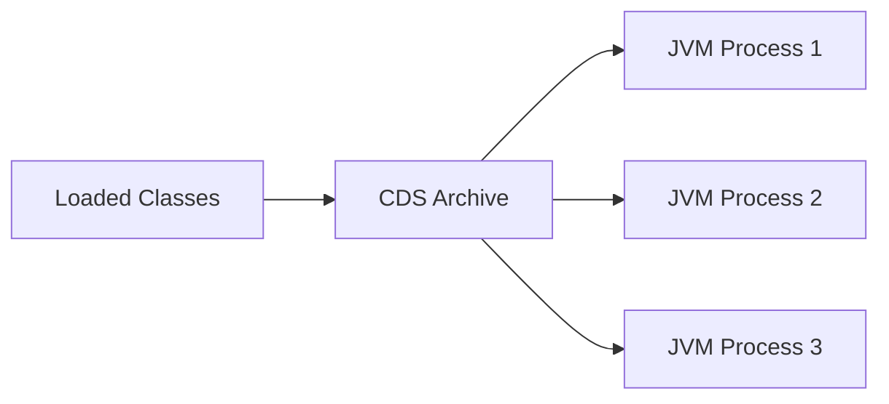
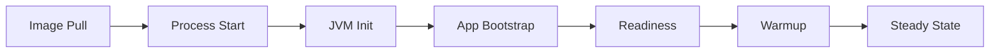
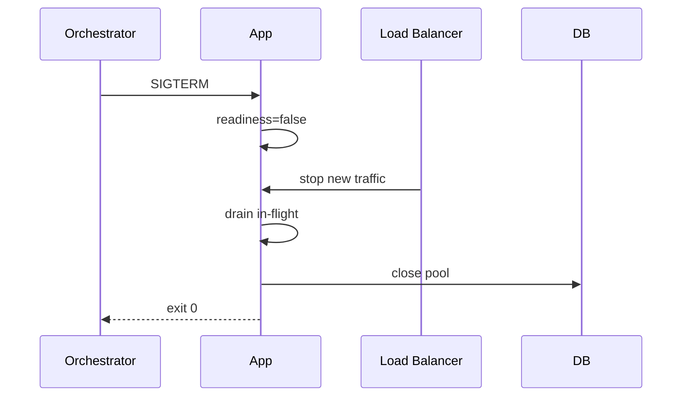

# Part 034 — Production Packaging dan Runtime Operations: Containers, jlink, CDS, AOT, Startup, dan Cloud

Java production tidak berhenti di `mvn package`.

Artifact Java harus dijalankan di runtime nyata yang punya:

- container memory limit;
- CPU quota;
- file system read-only;
- network latency;
- DNS;
- TLS certificates;
- timezone;
- secrets;
- config;
- logging pipeline;
- health checks;
- autoscaling;
- rolling deployment;
- graceful shutdown;
- observability agent;
- JDK patching;
- image scanning;
- rollback;
- incident response.

Part ini membahas operational layer: bagaimana Java app dipackage, dijalankan, dipantau, dan dikendalikan di production/cloud environment.

---

## 1. Target Performa

Setelah menyelesaikan bagian ini, kamu harus mampu:

- memilih packaging format Java: thin JAR, fat JAR, layered JAR, custom runtime image;
- memahami container image layering untuk Java;
- mengkonfigurasi JVM memory dan CPU di container;
- menjelaskan heap, non-heap, native memory, metaspace, code cache, direct buffer, dan thread stack dalam konteks container;
- memakai `jlink` untuk membuat custom runtime image jika sesuai;
- memahami CDS/AppCDS dan manfaatnya untuk startup/memory sharing;
- memahami AOT-related improvements di Java 25 sebagai startup/warmup tool, bukan magic native image;
- mendesain startup, readiness, liveness, graceful shutdown, dan draining;
- mengelola configuration dan secrets dengan aman;
- membuat baseline JVM flags production;
- menyiapkan logging/metrics/tracing/JFR di runtime;
- memilih rolling, blue-green, canary, dan rollback strategy;
- membuat production readiness checklist.

---

## 2. Packaging Options



### 2.1 Thin JAR

Thin JAR berisi app classes, dependencies di luar.

Kelebihan:

- dependency terlihat eksplisit;
- artifact kecil;
- cocok untuk environment yang mengatur classpath.

Kekurangan:

- deployment lebih kompleks;
- risiko missing dependency;
- classpath management perlu disiplin.

### 2.2 Fat/Uber JAR

Fat JAR menggabungkan app dan dependencies.

Kelebihan:

- mudah dijalankan;
- satu artifact;
- umum untuk service.

Kekurangan:

- ukuran besar;
- dependency duplication;
- shading/resource merging problem;
- layer caching kurang baik jika tidak dipecah.

### 2.3 Layered JAR/Image

Layered packaging memisahkan:

- dependencies;
- snapshot dependencies;
- application classes;
- resources.

Manfaat:

- container rebuild lebih cepat;
- dependency layer bisa cache;
- deployment delta lebih kecil;
- scanning lebih jelas.

---

## 3. Container Image Mental Model

Container image adalah stack layer immutable.



Jika app class berubah tetapi dependency tidak, hanya layer atas yang perlu berubah.

Rules:

- pilih base image yang jelas ownership-nya;
- pin image digest untuk reproducibility;
- update JDK patch secara rutin;
- scan image;
- jangan build tool di runtime image;
- jangan simpan secret di image;
- jalankan sebagai non-root jika memungkinkan;
- buat filesystem read-only jika sesuai;
- expose metadata version.

---

## 4. JDK vs JRE vs Custom Runtime

Sejak Java 9 modularization, konsep JRE tradisional berubah. Kamu bisa:

- memakai full JDK/JRE image dari vendor;
- memakai runtime base image;
- membuat custom runtime image dengan `jlink`.

Full JDK image:

- lebih besar;
- tool debugging tersedia;
- cocok untuk beberapa ops scenario.

Minimal runtime:

- lebih kecil;
- attack surface lebih rendah;
- tool debugging mungkin tidak ada.

Trade-off:

| Runtime | Kelebihan | Risiko |
|---|---|---|
| Full JDK | tools lengkap, simple | ukuran besar |
| Runtime/JRE image | lebih kecil | tools terbatas |
| `jlink` image | minimal sesuai module | perlu module analysis |
| Distroless | attack surface kecil | debugging lebih sulit |

---

## 5. `jlink`

`jlink` membuat custom runtime image berisi module yang dibutuhkan.

Contoh:

```bash
jdeps --print-module-deps --ignore-missing-deps --recursive app.jar
```

Lalu:

```bash
jlink \
  --add-modules java.base,java.logging,java.net.http \
  --output runtime-image \
  --strip-debug \
  --no-header-files \
  --no-man-pages \
  --compress=zip-6
```

Run:

```bash
./runtime-image/bin/java -jar app.jar
```

Manfaat:

- image lebih kecil;
- module eksplisit;
- attack surface lebih kecil;
- startup bisa lebih predictable.

Risiko:

- reflection/dynamic loading bisa membuat module dependency sulit terdeteksi;
- service loader perlu diperhatikan;
- framework besar bisa butuh banyak module;
- debugging tools mungkin hilang;
- build pipeline lebih kompleks.

Rule:

> Gunakan `jlink` jika ukuran/runtime control memberi manfaat nyata, bukan karena terlihat modern.

---

## 6. Class Data Sharing dan AppCDS

CDS menyimpan class metadata yang sudah diproses ke archive agar startup dan memory sharing bisa lebih baik.

Manfaat potensial:

- startup lebih cepat;
- memory footprint turun;
- class loading overhead turun;
- container density lebih baik.

Konsep:



AppCDS memperluas sharing ke application classes.

Typical workflow konseptual:

1. jalankan app untuk menghasilkan class list;
2. buat archive;
3. jalankan app dengan archive;
4. ukur startup/memory.

Java modern dan buildpack tertentu dapat mengotomatisasi sebagian proses CDS.

Jangan klaim manfaat tanpa measurement.

---

## 7. AOT di Java 25: Apa yang Dimaksud?

Java 25 membawa improvement terkait Ahead-of-Time class loading/linking, command-line ergonomics, dan method profiling sebagai bagian dari arah Project Leyden.

Pahami batasnya:

- ini bukan sama dengan native image penuh;
- tujuannya mengurangi startup/warmup tertentu;
- hasil bergantung workload;
- perlu profil/run configuration yang sesuai;
- tetap butuh measurement;
- deployment pipeline harus menyimpan cache/archive secara benar.

Gunakan untuk:

- startup-sensitive service;
- serverless-like workload;
- CLI tools;
- autoscaling cepat;
- high-density environments.

Jangan gunakan sebagai pengganti desain startup yang sehat.

---

## 8. Startup dan Warmup

Java startup dipengaruhi oleh:

- container pull time;
- JVM initialization;
- class loading;
- framework boot;
- dependency injection;
- reflection scan;
- config loading;
- TLS/cert initialization;
- DB pool creation;
- cache warmup;
- JIT warmup;
- lazy initialization;
- observability agent startup.



Important distinction:

```text
Process started != app ready
App ready != app warmed
```

Readiness should not return true before critical initialization is done.

---

## 9. Health Checks

### 9.1 Startup Probe

Menjawab:

```text
Apakah aplikasi selesai startup?
```

### 9.2 Liveness Probe

Menjawab:

```text
Apakah process harus direstart?
```

Jangan membuat liveness tergantung pada remote DB. Jika DB down, restart semua service biasanya memperburuk.

### 9.3 Readiness Probe

Menjawab:

```text
Apakah instance boleh menerima traffic?
```

Readiness boleh mempertimbangkan:

- app initialized;
- config loaded;
- critical dependency policy;
- migration compatible;
- not shutting down;
- thread/executor state;
- circuit breaker status jika dependency critical.

Example conceptual endpoint:

```text
/live  -> process alive
/ready -> can receive traffic
/startup -> initialized
```

---

## 10. Graceful Shutdown

Container orchestrator mengirim signal, biasanya `SIGTERM`.

Aplikasi harus:

1. menerima signal;
2. berhenti menerima traffic baru;
3. mark readiness false;
4. drain in-flight requests;
5. stop consumers;
6. flush outbox/logs/metrics;
7. close executors;
8. close DB pools;
9. close HTTP clients;
10. exit sebelum grace period habis.

Diagram:



Anti-pattern:

- `System.exit` mendadak;
- consumer tetap mengambil message saat shutdown;
- no drain;
- readiness tetap true;
- grace period terlalu pendek;
- executor tidak di-shutdown;
- non-daemon thread membuat process hang.

---

## 11. JVM Memory di Container

Total process memory bukan hanya heap.

```text
RSS ~= heap + metaspace + code cache + thread stacks + direct buffers + GC/native + libc + agents
```

Jika container limit 1024 MiB dan kamu set:

```bash
-Xmx1024m
```

process bisa OOMKilled karena native memory tidak punya ruang.

Gunakan container-aware config:

```bash
-XX:MaxRAMPercentage=75
```

Tetapi angka ideal tergantung:

- heap need;
- thread count;
- virtual vs platform threads;
- direct buffers;
- metaspace;
- code cache;
- GC collector;
- native libraries;
- observability agents;
- TLS/network buffers.

---

## 12. Heap Sizing

Approach:

1. tentukan container memory limit;
2. estimasi native overhead;
3. tentukan heap max;
4. load test;
5. pantau RSS, heap, GC, native memory;
6. adjust.

Example:

```text
Container limit: 2 GiB
Heap max: 1.4 GiB
Native/headroom: 600 MiB
```

Flags:

```bash
-XX:MaxRAMPercentage=70
-XX:InitialRAMPercentage=50
```

Avoid:

- `Xmx` sama dengan limit;
- heap terlalu kecil sehingga GC terlalu sering;
- heap terlalu besar sehingga native memory/OS headroom habis;
- tuning tanpa GC/RSS evidence.

---

## 13. CPU Limits dan Threading

CPU quota memengaruhi:

- JIT compilation;
- GC threads;
- application thread pools;
- ForkJoin parallelism;
- common pool;
- virtual thread carrier threads;
- latency under load.

Jika container dibatasi 1 CPU tetapi app menganggap tersedia 8 CPU, thread pool bisa oversized.

Modern JVM biasanya container-aware, tetapi tetap validasi:

```bash
java -XshowSettings:system -version
```

Checklist:

- CPU request/limit diketahui;
- common pool parallelism sesuai;
- GC threads tidak berlebihan;
- fixed thread pool tidak asal besar;
- CPU throttling metrics dipantau;
- load test di environment dengan quota serupa.

---

## 14. Virtual Threads di Runtime Operations

Virtual threads mengubah observability dan resource pressure:

- thread count bisa sangat tinggi;
- DB pool/downstream menjadi bottleneck utama;
- per-task memory harus kecil;
- ThreadLocal usage harus diaudit;
- thread dumps bisa besar;
- JFR virtual thread events berguna.

Runtime guardrails:

- timeout setiap dependency;
- connection pool metrics;
- bulkhead/rate limiter;
- no fixed virtual-thread pool;
- limit resource, not virtual thread count;
- monitor pending tasks/in-flight requests;
- avoid large ThreadLocal payload.

---

## 15. Runtime Flags Baseline

Minimal baseline umum:

```bash
-XX:+HeapDumpOnOutOfMemoryError
-XX:HeapDumpPath=/var/log/app/heapdump.hprof
-Xlog:gc*,safepoint:file=/var/log/app/gc.log:time,uptime,level,tags
```

Container memory:

```bash
-XX:MaxRAMPercentage=75
```

JFR optional continuous:

```bash
-XX:StartFlightRecording=name=continuous,settings=profile,dumponexit=true,filename=/var/log/app/app.jfr
```

Do not blindly copy flags.

Document every flag:

```markdown
| Flag | Reason | Owner | Review Date |
|---|---|---|---|
| -XX:MaxRAMPercentage=75 | leave native headroom in 2Gi container | platform | 2026-Q3 |
```

---

## 16. Logging in Containers

Container logging best practice:

- write structured logs to stdout/stderr;
- avoid local file logs unless sidecar/volume policy clear;
- include trace/correlation id;
- include version/build;
- do not log secrets;
- avoid log volume explosion;
- use async logging carefully;
- ensure shutdown flushes logs.

JSON logs example:

```json
{
  "level": "INFO",
  "service": "billing",
  "version": "1.42.7",
  "traceId": "abc",
  "event": "order_approved",
  "orderId": "ord-123",
  "durationMs": 42
}
```

---

## 17. Configuration Management

Configuration should be externalized.

Sources:

- environment variables;
- config files mounted as volume;
- config service;
- Kubernetes ConfigMap;
- system properties;
- command-line args.

Rules:

- config schema documented;
- defaults safe;
- invalid config fails fast;
- dynamic config has audit trail;
- config changes visible in logs/metrics;
- config is versioned where possible;
- secret not treated as normal config.

Avoid:

- hard-coded environment values;
- config only known in tribal memory;
- silent fallback for critical config;
- config reload without validation.

---

## 18. Secrets

Secrets include:

- database passwords;
- API keys;
- private keys;
- tokens;
- certificates;
- signing keys.

Rules:

- never bake secrets into image;
- never log secrets;
- rotate secrets;
- restrict access;
- prefer secret manager/Kubernetes secrets with policy;
- handle reload/rotation if required;
- do not expose secrets in heap dump/logs;
- redact error messages.

Be careful: heap dumps and JFR events may contain sensitive data. Treat diagnostic artifacts as sensitive.

---

## 19. TLS, Certificates, and Truststore

Java services often fail in production due to trust/cert issues.

Checklist:

- correct truststore;
- certificate chain valid;
- hostname verification on;
- mTLS keys mounted securely;
- cert rotation plan;
- timezone/clock sync;
- TLS version/cipher policy;
- outbound proxy if environment requires;
- diagnostics without logging secrets.

Common failures:

```text
PKIX path building failed
certificate expired
hostname verification failed
clock skew
```

---

## 20. File System and Temp Directory

Containers may have:

- read-only root filesystem;
- small `/tmp`;
- no persistent disk;
- limited ephemeral storage;
- different working directory.

Java app should know:

- where temp files go;
- max temp file size;
- upload buffering behavior;
- heap vs disk buffering;
- cleanup policy;
- permissions;
- user ID.

Set if needed:

```bash
-Djava.io.tmpdir=/tmp/app
```

---

## 21. Timezone, Locale, and Clock

Use UTC internally unless domain requires otherwise.

Runtime config:

```bash
-Duser.timezone=UTC
```

But prefer `java.time.Clock` injection for business logic tests.

Risks:

- timezone mismatch;
- locale-specific formatting;
- daylight saving bugs;
- container image missing timezone data;
- clock skew across nodes;
- TLS failures due to time.

---

## 22. Deployment Strategies

### 22.1 Rolling Deployment

Instances replaced gradually.

Pros:

- simple;
- efficient.

Risks:

- old/new versions overlap;
- schema/API/event compatibility required;
- rollback must be compatible.

### 22.2 Blue-Green

Two environments. Switch traffic.

Pros:

- fast rollback;
- clear separation.

Risks:

- cost;
- database shared state;
- migration compatibility.

### 22.3 Canary

Small subset traffic first.

Pros:

- controlled risk;
- compare metrics.

Risks:

- needs good observability;
- traffic must be representative;
- stateful side effects must be safe.

### 22.4 Feature Flags

Decouple deploy from release.

Risks:

- flag debt;
- combinatorial testing;
- stale flags;
- runtime config complexity.

---

## 23. Rolling Deploy Compatibility

During rolling deploy, old and new versions run together.

Must be compatible for:

- database schema;
- API request/response;
- event payloads;
- cache keys/values;
- serialized objects;
- config;
- feature flags;
- background jobs;
- scheduled tasks;
- idempotency keys.

Rule:

> If old and new cannot run simultaneously, rolling deploy is unsafe.

---

## 24. Runtime Observability

At minimum expose:

- build/version info;
- request metrics;
- error metrics;
- latency histogram;
- dependency metrics;
- DB pool metrics;
- JVM heap/non-heap;
- GC count/pause;
- thread count;
- CPU;
- RSS/container memory;
- logs with trace id;
- traces for key flows;
- readiness/liveness;
- JFR capture procedure.

Operational endpoint examples:

```text
/health/live
/health/ready
/metrics
/version
```

Secure operational endpoints. Do not expose heap dumps/thread dumps publicly.

---

## 25. JFR in Production

JFR is suitable for production diagnostics when configured properly.

Modes:

- on-demand recording during incident;
- continuous low-overhead rolling recording;
- startup profiling;
- custom application events.

On-demand:

```bash
jcmd <pid> JFR.start name=incident settings=profile duration=120s filename=/tmp/incident.jfr
```

Continuous:

```bash
-XX:StartFlightRecording=name=continuous,settings=default,maxage=1h,maxsize=256m,disk=true
```

Be mindful:

- disk usage;
- sensitive data in custom events;
- access control;
- archive retrieval;
- runtime overhead.

---

## 26. Heap Dump Operations

Heap dump can be huge and sensitive.

Enable:

```bash
-XX:+HeapDumpOnOutOfMemoryError
-XX:HeapDumpPath=/var/log/app
```

Operational concerns:

- disk space;
- PII/secrets in heap;
- transfer security;
- retention policy;
- who can access;
- whether dump on live process causes pause.

Never treat heap dump as ordinary log file.

---

## 27. Autoscaling Java Services

Autoscaling signals:

- CPU utilization;
- request rate;
- queue lag;
- p95/p99 latency;
- in-flight requests;
- custom business backlog.

CPU-only autoscaling can fail if service is I/O-bound and CPU low while latency high.

For queue consumers, scale on:

- lag;
- age of oldest message;
- processing rate;
- error/retry rate.

For HTTP services, scale on:

- RPS per pod;
- latency;
- CPU;
- saturation metrics.

Be careful with:

- cold start/warmup;
- DB pool multiplication;
- downstream capacity;
- thundering herd;
- cache warmup;
- rate limits.

---

## 28. Database Pool and Autoscaling

If each instance has DB pool size 30 and autoscaler scales from 10 to 50 pods:

```text
30 × 50 = 1500 possible DB connections
```

Can the database handle that?

Scaling app instances can overload database.

Mitigation:

- global DB connection budget;
- per-pod pool size adjusted;
- connection proxy/pooler;
- read replicas where appropriate;
- backpressure;
- rate limits;
- autoscaling guardrails.

---

## 29. Startup Optimization Checklist

Before advanced AOT/CDS, fix basics:

- reduce classpath bloat;
- remove unused dependencies;
- avoid scanning unnecessary packages;
- lazy vs eager initialization intentionally;
- avoid remote calls during startup;
- precompute config safely;
- reduce reflection where possible;
- use CDS/AppCDS if beneficial;
- evaluate AOT cache/profile features;
- warm critical paths before readiness if needed;
- measure startup phases.

Do not optimize startup blindly. Measure:

- process start to main;
- main to app initialized;
- initialized to readiness;
- readiness to steady-state p99;
- class loading count;
- JIT compilation;
- allocation.

---

## 30. Image Size Optimization

Options:

- slim base image;
- distroless base;
- `jlink` runtime;
- layered JAR;
- remove build tools from runtime;
- clean package manager cache;
- avoid copying test files;
- dependency pruning;
- compress runtime image carefully.

Trade-off:

| Optimization | Benefit | Cost |
|---|---|---|
| Distroless | smaller attack surface | harder debug |
| jlink | smaller runtime | module complexity |
| Layered JAR | faster rebuild/pull | packaging config |
| Remove shell/tools | security | incident debugging harder |
| Full JDK | easier diagnostics | larger image |

Choose based on operations model, not just image size leaderboard.

---

## 31. Security Hardening Runtime

Checklist:

- run non-root;
- minimal base image;
- image scanning;
- patch JDK regularly;
- no secrets in image/env logs;
- read-only filesystem if possible;
- least privilege network;
- TLS enforced;
- dependency scan;
- SBOM;
- no debug ports exposed;
- operational endpoints protected;
- heap/JFR dumps protected;
- native/JNI access reviewed;
- deserialization risk reviewed.

---

## 32. Runtime Failure Mode Catalog

| Failure | Symptom | Prevention |
|---|---|---|
| OOMKilled | process killed, no Java OOME | heap/native headroom, RSS metrics |
| Heap OOME | Java heap space | heap dump, cache bounds |
| Metaspace OOME | class metadata exhaustion | classloader leak audit |
| CPU throttling | latency high, CPU quota hit | quota metrics, pool sizing |
| Readiness too early | traffic before ready | proper startup/readiness |
| No graceful shutdown | dropped requests/messages | drain protocol |
| DB overload after scaling | DB pool explosion | global connection budget |
| Cert failure | TLS handshake errors | truststore/cert rotation |
| Log explosion | disk/network/CPU pressure | sampling, levels, structured logs |
| Missing tools | hard incident debugging | debug strategy/ephemeral containers |
| Preview flag missing | app fails startup | build/runtime flag consistency |

---

## 33. Production Readiness Review

### Packaging

- [ ] Artifact type chosen intentionally.
- [ ] JDK/runtime version pinned.
- [ ] Image base scanned.
- [ ] Non-root user.
- [ ] Layering strategy documented.
- [ ] SBOM available.

### Runtime

- [ ] Heap/container memory configured.
- [ ] GC logs enabled or capturable.
- [ ] JFR on-demand procedure available.
- [ ] Thread/heap dump procedure documented.
- [ ] CPU quota considered.
- [ ] JVM flags documented.
- [ ] Timezone/locale configured.
- [ ] Temp directory strategy clear.

### Operations

- [ ] Liveness/readiness/startup checks correct.
- [ ] Graceful shutdown tested.
- [ ] Config validation fail-fast.
- [ ] Secrets not logged/baked into image.
- [ ] TLS/truststore tested.
- [ ] Metrics/logs/traces available.
- [ ] Alerts/runbooks defined.
- [ ] Rollback tested.
- [ ] Canary/rolling compatibility verified.

### Scaling

- [ ] Autoscaling signal appropriate.
- [ ] DB pool scaling effect calculated.
- [ ] Downstream capacity understood.
- [ ] Cold start/warmup considered.
- [ ] Rate limits/bulkheads configured.

---

## 34. Runtime Runbook Template

```markdown
# Runbook: <Service> Java Runtime

## Identity

- Service:
- Version endpoint:
- Runtime JDK:
- Container image:
- Owner:

## Startup

- Expected startup time:
- Readiness criteria:
- Startup failure logs:

## Shutdown

- Grace period:
- Drain behavior:
- Consumer stop behavior:

## Memory

- Container limit:
- Heap config:
- Expected RSS:
- Heap dump path:

## CPU

- Request/limit:
- Thread pool assumptions:
- CPU throttling dashboard:

## Diagnostics

- Thread dump command:
- JFR command:
- Heap dump command:
- GC log location:
- Native memory command:

## Dependencies

- DB pool:
- HTTP clients:
- Message brokers:

## Alerts

- Latency:
- Error:
- Memory:
- CPU:
- DB pool:
- Queue lag:

## Rollback

- Previous image:
- Schema compatibility:
- Config compatibility:
```

---

## 35. Latihan 20 Jam

### Jam 1–3: Build Container Image

Buat Java app sederhana dengan Dockerfile multi-stage. Jalankan sebagai non-root.

### Jam 4–6: Memory Limit Lab

Jalankan container dengan memory limit. Bandingkan:

- `-Xmx` fixed;
- `MaxRAMPercentage`;
- RSS vs heap.

### Jam 7–9: Graceful Shutdown

Buat endpoint yang sleep 10 detik. Kirim SIGTERM. Pastikan readiness false dan request selesai/dibatalkan sesuai policy.

### Jam 10–12: jlink

Gunakan `jdeps` untuk module deps. Buat runtime image dengan `jlink`. Bandingkan ukuran image.

### Jam 13–15: CDS/JFR

Aktifkan JFR on-demand. Capture recording saat startup dan load kecil. Identifikasi class loading/warmup.

### Jam 16–18: Canary Metrics

Simulasikan dua versi app. Buat dashboard per version dan bandingkan latency/error.

### Jam 19–20: Production Readiness Review

Isi checklist untuk service imajiner:

- packaging;
- runtime;
- operations;
- scaling;
- rollback.

---

## 36. Anti-Pattern

### Anti-Pattern 1 — `Xmx` Sama dengan Container Limit

Mengabaikan native memory.

### Anti-Pattern 2 — Readiness Selalu UP

Traffic masuk sebelum app benar-benar siap.

### Anti-Pattern 3 — Liveness Bergantung DB

DB down membuat semua pod restart.

### Anti-Pattern 4 — No Graceful Shutdown

Dropped requests, duplicate message processing, corrupt workflow.

### Anti-Pattern 5 — Secrets in Image

Tidak bisa rotate aman, bocor via registry/layer.

### Anti-Pattern 6 — No Version Metadata

Incident tidak bisa menghubungkan behavior ke build.

### Anti-Pattern 7 — Debuggability Dikorbankan Total

Image minimal tetapi tidak ada prosedur diagnosis.

### Anti-Pattern 8 — Autoscale Tanpa Downstream Budget

App scale up, database/downstream collapse.

---

## 37. Ringkasan

Runtime operations adalah tempat Java bertemu realitas.

Mental model utama:

```text
A Java artifact is not production-ready until its runtime envelope is defined.
Container memory is not heap.
Startup is not readiness.
Readiness is not warmup.
Scaling app instances also scales pressure on dependencies.
Diagnostics artifacts are sensitive data.
Runtime flags are code.
```

Java modern memberi banyak alat: `jlink`, CDS/AppCDS, JFR, container awareness, AOT-related improvements, virtual threads, modern GC, structured logs, and better profiling. Tetapi alat tersebut harus ditempatkan dalam operating model yang jelas.

Production-grade Java bukan hanya cepat. Ia harus observable, controllable, secure, rollbackable, and predictable under failure.

---

## 38. Referensi Resmi

- Java SE 25 `jdk.jlink` module: https://docs.oracle.com/en/java/javase/25/docs/api/jdk.jlink/module-summary.html
- `jlink` Tool Reference: https://docs.oracle.com/en/java/javase/25/docs/specs/man/jlink.html
- Oracle JDK 25 Migration Guide: https://docs.oracle.com/en/java/javase/25/migrate/
- Java SE 25 Tools and Commands: https://docs.oracle.com/en/java/javase/25/docs/specs/man/
- JDK Flight Recorder Tutorial: https://dev.java/learn/jvm/jfr/
- JDK Mission Control: https://docs.oracle.com/en/java/java-components/jdk-mission-control/
- JEP 483 — Ahead-of-Time Class Loading & Linking: https://openjdk.org/jeps/483
- JEP 514 — Ahead-of-Time Command-Line Ergonomics: https://openjdk.org/jeps/514
- JEP 515 — Ahead-of-Time Method Profiling: https://openjdk.org/jeps/515
