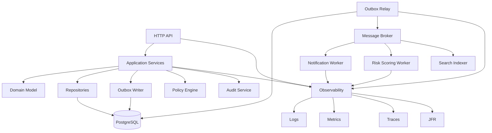
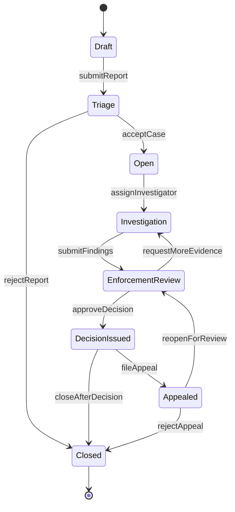
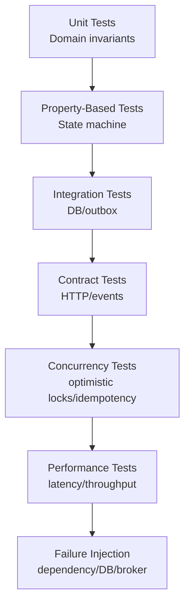

# Part 035 — Capstone: Build a Production-Grade Java 25 System dan Final Top 1% Rubric

Ini adalah bagian terakhir seri.

Sampai titik ini, kamu sudah melewati:

- skill acquisition ala Kaufman;
- Java language model;
- Java 8 functional baseline;
- Java 9 modules;
- Java 10–17 modernization;
- Java 18–25 evolution;
- virtual threads;
- scoped values;
- security;
- native interop;
- JVM internals;
- GC;
- JIT/JMH;
- observability;
- performance troubleshooting;
- concurrency deep dive;
- async/reactive/backpressure;
- persistence;
- service architecture;
- testing;
- build/release/migration;
- runtime operations.

Part ini menyatukan semuanya dalam satu capstone.

Tujuannya bukan membuat project "demo CRUD". Tujuannya membangun sistem Java 25 yang bisa:

- dijelaskan arsitekturnya;
- diuji invariants-nya;
- diprofiling;
- dimigrasikan;
- dioperasikan;
- di-debug saat rusak;
- direview secara engineering;
- dipertahankan di production.

---

## 1. Target Performa Capstone

Setelah menyelesaikan capstone ini, kamu harus mampu membangun dan menjelaskan sistem Java 25 dengan kemampuan berikut:

- domain model memakai records, sealed types, dan explicit invariants;
- workflow/state machine yang legal transition-nya jelas;
- transaction boundary eksplisit;
- persistence layer yang tidak membocorkan ORM ke API;
- outbox/eventing untuk side effect lintas boundary;
- idempotency untuk retry-safe operations;
- virtual threads untuk blocking I/O request/task model;
- scoped values untuk immutable request context;
- structured concurrency sebagai optional lab/preview, bukan dependency production wajib;
- observability lengkap: logs, metrics, traces, JFR, GC logs, thread dump procedure;
- testing strategy berlapis: unit, integration, contract, property-based, mutation, concurrency, performance;
- build pipeline dengan toolchain, dependency governance, SBOM, static analysis;
- packaging/runtime operations dengan container memory, health checks, graceful shutdown, rollout, rollback;
- performance baseline dan troubleshooting playbook;
- migration strategy dari Java 17/21 ke Java 25.

---

## 2. Capstone System: Enforcement Case Management Platform

Agar capstone relevan untuk sistem kompleks, kita akan mendesain platform fiktif:

```text
Regulatory Enforcement Case Management Platform
```

Sistem ini menangani lifecycle kasus penegakan regulasi.

Domain problem:

- laporan masuk dari berbagai channel;
- laporan ditriage;
- kasus dibuka;
- investigator ditugaskan;
- bukti dikumpulkan;
- risiko/escalation dihitung;
- enforcement action dibuat;
- approval dilakukan;
- decision diterbitkan;
- appeal bisa diajukan;
- audit trail harus defensible;
- semua state transition harus legal;
- semua external side effect harus idempotent;
- semua keputusan harus observable dan auditable.

Ini bukan sekadar CRUD. Ini cocok untuk melatih:

- state machine;
- domain invariants;
- workflow;
- auditability;
- concurrency;
- consistency;
- escalation logic;
- production readiness.

---

## 3. High-Level Architecture



Architectural style:

- modular monolith first;
- explicit bounded modules;
- relational database for transactional state;
- outbox for reliable event publication;
- workers for async side effects;
- virtual threads for request and worker task execution;
- strict observability from day one.

Why modular monolith first?

Because capstone goal is engineering clarity. Microservices terlalu cepat akan memindahkan complexity ke distributed consistency, observability, and deployment before domain invariants are stable.

---

## 4. Module Structure

```text
enforcement-platform
├── enforcement-domain
├── enforcement-application
├── enforcement-adapters-http
├── enforcement-adapters-persistence
├── enforcement-adapters-messaging
├── enforcement-adapters-observability
├── enforcement-runtime
├── enforcement-test-support
└── enforcement-architecture-tests
```

### 4.1 `enforcement-domain`

Contains:

- value objects;
- aggregate roots;
- domain events;
- state machine;
- policy abstractions;
- domain exceptions;
- invariants.

No framework dependency.

### 4.2 `enforcement-application`

Contains:

- use case services;
- transaction boundary orchestration;
- command handlers;
- query handlers;
- idempotency handling;
- outbox append;
- authorization checks;
- clock/id generation interfaces.

Minimal framework dependency.

### 4.3 `enforcement-adapters-http`

Contains:

- REST endpoints;
- request/response DTOs;
- validation;
- exception mapping;
- authentication context extraction.

### 4.4 `enforcement-adapters-persistence`

Contains:

- JDBC/JPA implementation;
- SQL queries;
- entity mappings;
- repository implementations;
- migration scripts.

### 4.5 `enforcement-adapters-messaging`

Contains:

- broker producer/consumer;
- outbox relay;
- inbox/idempotency consumer;
- event serialization.

### 4.6 `enforcement-adapters-observability`

Contains:

- structured logging;
- metrics;
- tracing;
- JFR custom events;
- context propagation.

### 4.7 `enforcement-runtime`

Contains:

- main class;
- dependency wiring;
- config;
- health checks;
- graceful shutdown;
- runtime flags documentation.

---

## 5. Package Boundary Rules

Use architecture tests to enforce:

```text
domain must not depend on adapters
application must not depend on HTTP framework details
persistence entities must not leak to API DTOs
domain events must be immutable
repositories are interfaces in application/domain boundary
```

Example ArchUnit-style rule concept:

```java
classes()
    .that().resideInAPackage("..domain..")
    .should().onlyDependOnClassesThat()
    .resideInAnyPackage(
        "java..",
        "javax..",
        "jakarta.validation..",
        "com.acme.enforcement.domain.."
    );
```

Goal:

> Architecture should fail fast in CI when boundary is violated.

---

## 6. Domain Model: Value Objects

Use records for immutable value objects.

```java
public record CaseId(UUID value) {
    public CaseId {
        Objects.requireNonNull(value, "value");
    }

    public static CaseId newId() {
        return new CaseId(UUID.randomUUID());
    }
}

public record ReportId(UUID value) {
    public ReportId {
        Objects.requireNonNull(value, "value");
    }
}

public record OfficerId(String value) {
    public OfficerId {
        if (value == null || value.isBlank()) {
            throw new IllegalArgumentException("officer id must not be blank");
        }
    }
}
```

Guidelines:

- validate in compact constructor;
- avoid primitive obsession;
- use domain-specific types;
- do not expose raw `String`/`UUID` everywhere;
- keep value objects immutable;
- use `List.copyOf` for collection components.

---

## 7. Domain State with Sealed Types

Case state is finite. Model it as sealed hierarchy.

```java
public sealed interface CaseState
        permits Draft, Triage, Open, Investigation, EnforcementReview,
                DecisionIssued, Closed, Appealed {

    String code();
}

public record Draft() implements CaseState {
    @Override public String code() { return "DRAFT"; }
}

public record Triage() implements CaseState {
    @Override public String code() { return "TRIAGE"; }
}

public record Open(OfficerId assignedOfficer) implements CaseState {
    public Open {
        Objects.requireNonNull(assignedOfficer);
    }

    @Override public String code() { return "OPEN"; }
}

public record Investigation(OfficerId investigator) implements CaseState {
    public Investigation {
        Objects.requireNonNull(investigator);
    }

    @Override public String code() { return "INVESTIGATION"; }
}

public record EnforcementReview() implements CaseState {
    @Override public String code() { return "ENFORCEMENT_REVIEW"; }
}

public record DecisionIssued(DecisionId decisionId) implements CaseState {
    public DecisionIssued {
        Objects.requireNonNull(decisionId);
    }

    @Override public String code() { return "DECISION_ISSUED"; }
}

public record Closed(ClosureReason reason) implements CaseState {
    public Closed {
        Objects.requireNonNull(reason);
    }

    @Override public String code() { return "CLOSED"; }
}

public record Appealed(AppealId appealId) implements CaseState {
    public Appealed {
        Objects.requireNonNull(appealId);
    }

    @Override public String code() { return "APPEALED"; }
}
```

Why sealed?

- legal variants explicit;
- pattern matching can be exhaustive;
- invalid state type cannot appear from random implementation;
- domain state space is visible.

---

## 8. Workflow State Machine

Legal transitions:



Represent command result:

```java
public sealed interface TransitionResult
        permits TransitionAccepted, TransitionRejected {
}

public record TransitionAccepted(
        CaseState newState,
        List<DomainEvent> events
) implements TransitionResult {
    public TransitionAccepted {
        Objects.requireNonNull(newState);
        events = List.copyOf(events);
    }
}

public record TransitionRejected(
        String reason
) implements TransitionResult {
    public TransitionRejected {
        if (reason == null || reason.isBlank()) {
            throw new IllegalArgumentException("reason must not be blank");
        }
    }
}
```

---

## 9. Aggregate Root

```java
public final class EnforcementCase {
    private final CaseId id;
    private CaseState state;
    private RiskLevel riskLevel;
    private final List<EvidenceId> evidenceIds;
    private long version;

    private EnforcementCase(
            CaseId id,
            CaseState state,
            RiskLevel riskLevel,
            List<EvidenceId> evidenceIds,
            long version
    ) {
        this.id = Objects.requireNonNull(id);
        this.state = Objects.requireNonNull(state);
        this.riskLevel = Objects.requireNonNull(riskLevel);
        this.evidenceIds = new ArrayList<>(evidenceIds);
        this.version = version;
    }

    public static EnforcementCase draft(CaseId id) {
        return new EnforcementCase(id, new Draft(), RiskLevel.UNKNOWN, List.of(), 0);
    }

    public CaseId id() {
        return id;
    }

    public CaseState state() {
        return state;
    }

    public long version() {
        return version;
    }

    public List<EvidenceId> evidenceIds() {
        return List.copyOf(evidenceIds);
    }

    public List<DomainEvent> submitForTriage(Actor actor, Instant now) {
        requireState(Draft.class);

        this.state = new Triage();
        this.version++;

        return List.of(new CaseSubmittedForTriage(id, actor.id(), now));
    }

    public List<DomainEvent> accept(OfficerId officer, Actor actor, Instant now) {
        requireState(Triage.class);

        this.state = new Open(officer);
        this.version++;

        return List.of(new CaseAccepted(id, officer, actor.id(), now));
    }

    public List<DomainEvent> assignInvestigator(OfficerId investigator, Actor actor, Instant now) {
        requireState(Open.class);

        this.state = new Investigation(investigator);
        this.version++;

        return List.of(new InvestigatorAssigned(id, investigator, actor.id(), now));
    }

    private void requireState(Class<? extends CaseState> expected) {
        if (!expected.isInstance(state)) {
            throw new IllegalStateException(
                    "Expected state " + expected.getSimpleName() +
                    " but was " + state.getClass().getSimpleName()
            );
        }
    }
}
```

Design notes:

- aggregate enforces legal transitions;
- state mutation is private;
- each command emits domain events;
- optimistic version supports concurrency control;
- external side effects are not done inside aggregate.

---

## 10. Domain Events

```java
public sealed interface DomainEvent
        permits CaseSubmittedForTriage, CaseAccepted, InvestigatorAssigned,
                FindingsSubmitted, DecisionApproved, CaseClosed {
    EventId eventId();
    CaseId caseId();
    Instant occurredAt();
}

public record CaseAccepted(
        EventId eventId,
        CaseId caseId,
        OfficerId officerId,
        ActorId actorId,
        Instant occurredAt
) implements DomainEvent {
    public CaseAccepted(CaseId caseId, OfficerId officerId, ActorId actorId, Instant occurredAt) {
        this(EventId.newId(), caseId, officerId, actorId, occurredAt);
    }

    public CaseAccepted {
        Objects.requireNonNull(eventId);
        Objects.requireNonNull(caseId);
        Objects.requireNonNull(officerId);
        Objects.requireNonNull(actorId);
        Objects.requireNonNull(occurredAt);
    }
}
```

Event rules:

- immutable;
- has stable type;
- has event id;
- has aggregate id;
- has occurrence time;
- does not contain sensitive payload unless required;
- serializable with versioned schema;
- safe to publish at-least-once.

---

## 11. Application Service

```java
public final class AcceptCaseUseCase {
    private final CaseRepository caseRepository;
    private final Outbox outbox;
    private final TransactionRunner transactions;
    private final Clock clock;

    public AcceptCaseUseCase(
            CaseRepository caseRepository,
            Outbox outbox,
            TransactionRunner transactions,
            Clock clock
    ) {
        this.caseRepository = caseRepository;
        this.outbox = outbox;
        this.transactions = transactions;
        this.clock = clock;
    }

    public AcceptCaseResult handle(AcceptCaseCommand command) {
        return transactions.required(() -> {
            EnforcementCase enforcementCase =
                    caseRepository.getForUpdate(command.caseId());

            List<DomainEvent> events =
                    enforcementCase.accept(command.officerId(), command.actor(), clock.instant());

            caseRepository.save(enforcementCase);
            outbox.appendAll(events);

            return new AcceptCaseResult(enforcementCase.id(), enforcementCase.state());
        });
    }
}
```

Key rules:

- transaction boundary in application service;
- domain enforces invariant;
- repository persists aggregate;
- outbox append in same transaction;
- no remote call inside transaction;
- command includes actor/context;
- result is explicit DTO, not entity.

---

## 12. Transaction Runner

```java
@FunctionalInterface
public interface TransactionRunner {
    <T> T required(TransactionalWork<T> work);

    @FunctionalInterface
    interface TransactionalWork<T> {
        T execute();
    }
}
```

Implementation may use JDBC, JPA, or framework transaction. The domain/application layer should not depend directly on framework annotation if you want clear testing and boundary control.

---

## 13. Repository Contract

```java
public interface CaseRepository {
    Optional<EnforcementCase> findById(CaseId id);

    EnforcementCase getForUpdate(CaseId id);

    void save(EnforcementCase enforcementCase);

    List<CaseSummary> findPendingTriage(int limit);
}
```

Repository contract documents:

- cardinality;
- locking;
- expected transaction;
- query shape;
- result size bound.

Avoid generic repository that hides query cost.

---

## 14. Persistence Model

Relational tables:

```sql
create table enforcement_case (
    id uuid primary key,
    state_code varchar(64) not null,
    assigned_officer varchar(128),
    risk_level varchar(64) not null,
    version bigint not null,
    created_at timestamptz not null,
    updated_at timestamptz not null
);

create table case_evidence (
    case_id uuid not null references enforcement_case(id),
    evidence_id uuid not null,
    added_at timestamptz not null,
    primary key (case_id, evidence_id)
);

create table outbox_event (
    id uuid primary key,
    aggregate_id uuid not null,
    event_type varchar(256) not null,
    payload jsonb not null,
    occurred_at timestamptz not null,
    published_at timestamptz,
    attempts int not null default 0
);
```

Persistence principles:

- schema reflects invariants;
- version column supports optimistic locking;
- outbox in same database transaction;
- payload schema versioned;
- indexes support real queries;
- large payloads should not be blindly embedded.

---

## 15. Optimistic Locking

Save with version:

```sql
update enforcement_case
set state_code = ?,
    assigned_officer = ?,
    risk_level = ?,
    version = version + 1,
    updated_at = ?
where id = ?
  and version = ?
```

If updated rows = 0:

```java
throw new OptimisticConcurrencyException(caseId);
```

Handling strategy:

- for user command: return conflict;
- for worker: retry with bounded retry;
- for idempotent command: detect previous success;
- for workflow: re-read and decide.

---

## 16. Outbox Relay

```java
public final class OutboxRelay implements Runnable {
    private final OutboxRepository repository;
    private final EventPublisher publisher;
    private final TransactionRunner transactions;

    @Override
    public void run() {
        while (!Thread.currentThread().isInterrupted()) {
            List<OutboxEvent> batch = repository.claimNextBatch(100);

            for (OutboxEvent event : batch) {
                try {
                    publisher.publish(event);
                    transactions.required(() -> {
                        repository.markPublished(event.id());
                        return null;
                    });
                } catch (Exception ex) {
                    repository.markFailedAttempt(event.id(), ex);
                }
            }
        }
    }
}
```

Production improvements:

- claim with `for update skip locked`;
- bounded batch;
- retry with backoff;
- dead-letter after max attempts;
- idempotent publisher;
- metrics: lag, attempts, failures, publish latency;
- graceful shutdown.

---

## 17. Inbox / Idempotent Consumer

```sql
create table processed_message (
    message_id uuid primary key,
    processed_at timestamptz not null
);
```

Consumer flow:

```java
public void consume(Message message) {
    transactions.required(() -> {
        if (processedMessages.exists(message.id())) {
            return null;
        }

        processedMessages.insert(message.id(), clock.instant());
        handler.handle(message);

        return null;
    });
}
```

This makes at-least-once delivery safe.

---

## 18. HTTP API Boundary

Example endpoint:

```text
POST /cases/{caseId}/accept
```

Request:

```json
{
  "officerId": "officer-123",
  "idempotencyKey": "01J..."
}
```

Response:

```json
{
  "caseId": "9dd5f3d1-bd95-4609-9b55-5fda72ce4a3d",
  "state": "OPEN",
  "assignedOfficer": "officer-123"
}
```

Error model:

```json
{
  "errorCode": "INVALID_CASE_STATE",
  "message": "Case cannot be accepted from state CLOSED",
  "correlationId": "01J..."
}
```

Rules:

- validate input at boundary;
- map errors to stable error codes;
- never leak stack trace to client;
- use idempotency for mutation endpoints;
- preserve correlation id;
- DTOs are not entities;
- API versioning strategy explicit.

---

## 19. Error Taxonomy

```java
public enum ErrorCategory {
    VALIDATION,
    AUTHENTICATION,
    AUTHORIZATION,
    NOT_FOUND,
    CONFLICT,
    INVALID_STATE,
    IDEMPOTENCY_CONFLICT,
    RATE_LIMITED,
    DEPENDENCY_TIMEOUT,
    DEPENDENCY_FAILURE,
    CAPACITY,
    INTERNAL
}
```

Error design:

| Error | HTTP |
|---|---:|
| validation | 400 |
| auth missing | 401 |
| forbidden | 403 |
| not found | 404 |
| conflict/optimistic lock | 409 |
| invalid workflow state | 409 |
| rate limited | 429 |
| dependency timeout | 504 |
| internal bug | 500 |

---

## 20. Request Context with Scoped Values

Java 25 finalizes scoped values. Use them for immutable context shared down call stack and child tasks.

```java
public record RequestContext(
        String correlationId,
        Actor actor,
        Instant receivedAt
) {}

public final class RequestContexts {
    public static final ScopedValue<RequestContext> CURRENT =
            ScopedValue.newInstance();

    private RequestContexts() {}
}
```

Usage:

```java
public Response handle(HttpRequest request) {
    RequestContext context = contextFrom(request);

    return ScopedValue.where(RequestContexts.CURRENT, context)
            .call(() -> route(request));
}
```

Access:

```java
RequestContext context = RequestContexts.CURRENT.get();
```

Guidelines:

- context immutable;
- small values only;
- no mutable domain state;
- no hidden dependencies for business logic;
- do not replace explicit parameters everywhere.

---

## 21. Virtual Threads Runtime Model

For blocking HTTP/JDBC style:

```java
ExecutorService requestExecutor =
        Executors.newVirtualThreadPerTaskExecutor();
```

Principles:

- do not pool virtual threads;
- bound DB connection pool;
- bound remote dependency calls;
- set timeout everywhere;
- monitor in-flight work;
- avoid large ThreadLocal payload;
- use JFR/thread dumps to inspect wait patterns.

Example remote dependency bulkhead:

```java
public final class DependencyBulkhead {
    private final Semaphore permits;

    public DependencyBulkhead(int maxConcurrent) {
        this.permits = new Semaphore(maxConcurrent);
    }

    public <T> T call(Callable<T> operation) throws Exception {
        if (!permits.tryAcquire(100, TimeUnit.MILLISECONDS)) {
            throw new RejectedExecutionException("bulkhead full");
        }

        try {
            return operation.call();
        } finally {
            permits.release();
        }
    }
}
```

---

## 22. Structured Concurrency Lab

As of Java 25, structured concurrency is still preview. Treat it as capstone lab, not mandatory production dependency.

Conceptual use case:

```java
// Requires --enable-preview in Java 25.
try (var scope = new StructuredTaskScope.ShutdownOnFailure()) {
    var caseData = scope.fork(() -> caseClient.get(caseId));
    var riskData = scope.fork(() -> riskClient.score(caseId));
    var auditData = scope.fork(() -> auditClient.latest(caseId));

    scope.join();
    scope.throwIfFailed();

    return Dashboard.of(caseData.get(), riskData.get(), auditData.get());
}
```

Learning goal:

- child tasks tied to parent scope;
- failure cancels siblings;
- no orphan task;
- cancellation model visible.

Governance:

- do not expose preview API in public contract;
- isolate experiments;
- compile with preview flags in lab only;
- document migration risk.

---

## 23. Risk Escalation Policy

Risk can be represented as policy result.

```java
public sealed interface RiskDecision
        permits NoEscalation, EscalateToSupervisor, EscalateToEnforcementBoard {
}

public record NoEscalation() implements RiskDecision {}

public record EscalateToSupervisor(String reason) implements RiskDecision {
    public EscalateToSupervisor {
        if (reason == null || reason.isBlank()) {
            throw new IllegalArgumentException("reason required");
        }
    }
}

public record EscalateToEnforcementBoard(String reason, RiskLevel riskLevel)
        implements RiskDecision {
    public EscalateToEnforcementBoard {
        Objects.requireNonNull(riskLevel);
        if (reason == null || reason.isBlank()) {
            throw new IllegalArgumentException("reason required");
        }
    }
}
```

Policy engine:

```java
public interface RiskPolicy {
    RiskDecision evaluate(EnforcementCase enforcementCase, EvidenceSummary evidence);
}
```

Rules:

- policy deterministic where possible;
- policy versioned;
- decision reason stored;
- audit event emitted;
- changes to policy require migration/replay analysis if historical defensibility matters.

---

## 24. Audit Trail

Audit is not logging.

Logs are operational. Audit trail is domain/legal evidence.

Audit event should include:

- audit id;
- actor;
- action;
- target;
- previous state;
- new state;
- reason;
- policy version;
- timestamp;
- correlation id;
- source channel;
- immutable payload hash if required.

Example:

```sql
create table audit_entry (
    id uuid primary key,
    actor_id varchar(128) not null,
    action varchar(128) not null,
    target_type varchar(128) not null,
    target_id varchar(128) not null,
    previous_state varchar(128),
    new_state varchar(128),
    reason text,
    correlation_id varchar(128) not null,
    occurred_at timestamptz not null
);
```

Rules:

- append-only;
- no destructive updates;
- access controlled;
- retention policy explicit;
- sensitive data redacted/minimized;
- audit schema versioned.

---

## 25. Observability Design

### 25.1 Structured Logs

Fields:

- timestamp;
- level;
- service;
- version;
- environment;
- correlationId;
- traceId;
- actorId;
- caseId;
- event;
- errorCode;
- durationMs.

Example event:

```json
{
  "level": "INFO",
  "event": "case_accepted",
  "caseId": "9dd5f3d1-bd95-4609-9b55-5fda72ce4a3d",
  "officerId": "officer-123",
  "actorId": "supervisor-88",
  "correlationId": "01J...",
  "durationMs": 37
}
```

### 25.2 Metrics

Core metrics:

- HTTP request count;
- HTTP latency histogram;
- error count by category;
- case transition count;
- invalid transition count;
- outbox lag;
- outbox publish failures;
- DB pool active/waiting;
- transaction duration;
- optimistic lock conflicts;
- dependency timeout count;
- queue lag;
- JVM heap/RSS/GC/thread metrics.

### 25.3 Traces

Span boundaries:

- inbound HTTP request;
- command handler;
- repository query;
- transaction;
- outbox append;
- event publish;
- worker consume;
- external dependency call.

### 25.4 JFR

Use JFR for:

- CPU profile;
- allocation profile;
- GC events;
- socket/file I/O;
- lock contention;
- virtual thread events;
- custom domain events for key workflows.

Custom event example:

```java
@Label("Case Transition")
@Category({"Enforcement", "Workflow"})
public final class CaseTransitionJfrEvent extends Event {
    @Label("Case ID")
    String caseId;

    @Label("From State")
    String fromState;

    @Label("To State")
    String toState;

    @Label("Outcome")
    String outcome;
}
```

---

## 26. Testing Strategy



---

## 27. Domain Unit Tests

Test legal transition:

```java
@Test
void draft_case_can_be_submitted_for_triage() {
    EnforcementCase c = EnforcementCase.draft(CaseId.newId());

    List<DomainEvent> events =
            c.submitForTriage(actor, clock.instant());

    assertThat(c.state()).isInstanceOf(Triage.class);
    assertThat(events).hasOnlyElementsOfType(CaseSubmittedForTriage.class);
}
```

Test illegal transition:

```java
@Test
void closed_case_cannot_be_accepted() {
    EnforcementCase c = closedCase();

    assertThatThrownBy(() -> c.accept(officerId, actor, clock.instant()))
            .isInstanceOf(IllegalStateException.class);
}
```

---

## 28. Property-Based State Machine Tests

Generate random command sequences. Invariant:

- closed case cannot return to investigation except through appeal path if allowed;
- version increases on accepted mutation;
- every state change emits audit/domain event;
- illegal transition never mutates state;
- evidence cannot be added after closed unless appeal reopens.

Pseudo-shape:

```java
property("case state machine preserves invariants")
    .forAll(commandSequences())
    .check(sequence -> {
        EnforcementCase c = EnforcementCase.draft(CaseId.newId());

        for (Command command : sequence) {
            CaseSnapshot before = snapshot(c);
            try {
                apply(c, command);
                assertValid(c);
            } catch (IllegalStateException rejected) {
                assertThat(snapshot(c)).isEqualTo(before);
            }
        }

        return true;
    });
```

---

## 29. Integration Tests with Testcontainers

Test against real database engine.

Scenarios:

- insert/load aggregate;
- optimistic lock conflict;
- outbox append in same transaction;
- rollback does not leave outbox event;
- migration scripts apply cleanly;
- query count/performance threshold for list endpoint;
- idempotency unique constraint works.

Do not rely solely on in-memory DB if production uses PostgreSQL/MySQL/Oracle/etc.

---

## 30. Contract Tests

HTTP contract:

- request/response schema;
- status codes;
- error codes;
- idempotency behavior;
- version compatibility.

Event contract:

- event type;
- schema version;
- required fields;
- backward compatibility;
- consumer tolerance for unknown fields;
- no sensitive data leakage.

Contract rule:

> Events and APIs are public contracts even if consumed by internal teams.

---

## 31. Concurrency Tests

Test optimistic lock:

1. load same case in two transactions;
2. both try transition;
3. one succeeds;
4. one fails with conflict;
5. final state valid;
6. no duplicate outbox event.

Test idempotency:

1. send same command twice with same idempotency key;
2. first creates transition;
3. second returns same result;
4. no duplicate side effect.

Test outbox relay:

1. relay publishes event;
2. crash before marking published;
3. relay republishes;
4. consumer idempotency prevents duplicate effect.

---

## 32. Performance Baseline

Define workload:

```text
500 RPS steady
p95 < 150 ms
p99 < 300 ms
error rate < 0.1%
DB pool wait p95 < 20 ms
outbox lag < 5 seconds
heap stable over 2-hour soak
no full GC
```

Metrics to capture:

- p50/p95/p99 latency;
- throughput;
- CPU;
- RSS;
- heap;
- allocation rate;
- GC pauses;
- DB pool active/waiting;
- query latency;
- outbox lag;
- lock conflicts;
- thread/virtual thread count;
- dependency latency;
- error category.

Record environment:

- JDK version;
- JVM flags;
- container CPU/memory;
- DB size/indexes;
- data distribution;
- dependency behavior;
- commit SHA;
- image digest.

---

## 33. Performance Troubleshooting Drill

Inject failure scenarios:

| Scenario | Expected Detection |
|---|---|
| DB query slowed by 500 ms | trace DB span, pool wait, p99 latency |
| DB pool max too low | pool waiting metric, thread dump |
| outbox broker down | outbox lag, publish failures |
| memory leak in cache | heap after-GC trend, heap dump |
| lock contention in policy cache | JFR monitor event, thread dump |
| CPU-heavy JSON serialization | CPU flame graph |
| unbounded fan-out | dependency rate limit/errors |
| missing timeout | in-flight growth, stuck threads |

For each, write:

- symptom;
- evidence;
- root cause;
- mitigation;
- permanent fix;
- prevention test.

---

## 34. Build Pipeline

CI stages:

```mermaid id="capstone_ci"
flowchart LR
    COMPILE[Compile Java 25] --> UNIT[Unit Tests]
    UNIT --> ARCH[Architecture Tests]
    ARCH --> STATIC[Static Analysis]
    STATIC --> INTEG[Integration Tests]
    INTEG --> CONTRACT[Contract Tests]
    CONTRACT --> MUT[Mutation Tests]
    MUT --> PERF[Performance Smoke]
    PERF --> SBOM[SBOM + Scan]
    SBOM --> IMAGE[Build Image]
    IMAGE --> SMOKE[Container Smoke]
    SMOKE --> PUBLISH[Publish Artifact]
```



Build rules:

- use Java toolchain;
- `--release 25`;
- dependency convergence check;
- SBOM generated;
- vulnerability scan;
- no preview features in production module unless RFC approved;
- artifact built once;
- image pinned and traceable;
- version metadata exposed.

---

## 35. Runtime Packaging

Options:

- layered JAR for standard service;
- jlink custom runtime if image size/startup/security benefit proven;
- CDS/AppCDS for startup/memory improvement if measured;
- JFR enabled on-demand;
- GC logs enabled;
- heap dump on OOME with secure handling.

Baseline runtime flags:

```bash
-XX:MaxRAMPercentage=75
-XX:+HeapDumpOnOutOfMemoryError
-XX:HeapDumpPath=/var/log/app
-Xlog:gc*,safepoint:file=/var/log/app/gc.log:time,uptime,level,tags
```

Document every flag.

---

## 36. Health and Shutdown

Endpoints:

```text
/live
/ready
/startup
/metrics
/version
```

Readiness false when:

- app starting;
- app shutting down;
- critical config invalid;
- DB migration incompatible;
- severe capacity condition if policy says remove from traffic.

Shutdown flow:

1. receive SIGTERM;
2. readiness false;
3. stop accepting new requests;
4. stop polling new messages;
5. finish/drain in-flight tasks within grace;
6. flush outbox/logs/metrics;
7. close DB pool;
8. close executor;
9. exit cleanly.

---

## 37. Migration Plan to Java 25

If existing baseline is Java 17/21:

1. upgrade build tool/plugins;
2. update dependencies/agents/bytecode tools;
3. run tests on Java 25 without source changes;
4. fix illegal reflective/internal API usage;
5. validate runtime flags;
6. validate container image;
7. run integration/performance tests;
8. canary JDK 25 runtime;
9. adopt final Java 25 features selectively:
   - Scoped Values;
   - Flexible Constructor Bodies;
   - Module Import Declarations where style guide allows;
   - Compact Object Headers runtime benefit by measurement.
10. keep preview/incubator features in lab modules only.

---

## 38. Production Readiness Review

### Domain

- [ ] State machine explicit.
- [ ] Illegal transitions rejected.
- [ ] Invariants tested.
- [ ] Domain events immutable.
- [ ] Audit trail append-only.
- [ ] Policy decisions versioned.

### Data

- [ ] Transaction boundary documented.
- [ ] Optimistic/pessimistic locking strategy clear.
- [ ] Query cardinality bounded.
- [ ] N+1 tested.
- [ ] Outbox implemented.
- [ ] Idempotency implemented.
- [ ] Migration expand-contract strategy.

### Concurrency

- [ ] Virtual threads used at proper boundary.
- [ ] DB/API resource limits explicit.
- [ ] No blocking on common pool.
- [ ] Cancellation/timeout defined.
- [ ] ThreadLocal audited.
- [ ] Scoped values used only for immutable context.

### Observability

- [ ] Structured logs.
- [ ] Metrics.
- [ ] Traces.
- [ ] JFR procedure.
- [ ] GC logs.
- [ ] Thread dump procedure.
- [ ] Heap dump handling.
- [ ] Dashboards and alerts.

### Testing

- [ ] Unit tests.
- [ ] Property-based state tests.
- [ ] Integration tests with real DB.
- [ ] Contract tests.
- [ ] Concurrency tests.
- [ ] Mutation tests.
- [ ] Performance baseline.
- [ ] Failure injection drills.

### Runtime

- [ ] Container memory configured.
- [ ] CPU limits considered.
- [ ] Health checks correct.
- [ ] Graceful shutdown tested.
- [ ] Secrets handled securely.
- [ ] TLS/truststore tested.
- [ ] Rollback tested.
- [ ] Canary plan.

---

## 39. Final Engineering Rubric

Use this rubric to evaluate whether you are operating at high-level Java engineering maturity.

### 39.1 Language Fluency

| Level | Signal |
|---|---|
| Basic | Can write classes, methods, collections |
| Intermediate | Uses lambdas, streams, records, generics correctly |
| Advanced | Designs APIs with compatibility and invariants |
| Top-tier | Chooses language features based on domain clarity, evolution, and failure mode |

### 39.2 JVM Awareness

| Level | Signal |
|---|---|
| Basic | Knows Java runs on JVM |
| Intermediate | Understands heap, stack, GC |
| Advanced | Reads GC logs, thread dumps, JFR |
| Top-tier | Connects runtime evidence to architecture decisions |

### 39.3 Concurrency Correctness

| Level | Signal |
|---|---|
| Basic | Uses executor/thread |
| Intermediate | Uses locks/atomics/queues |
| Advanced | Understands JMM, happens-before, safe publication |
| Top-tier | Designs concurrency around ownership, resource limits, cancellation, and observability |

### 39.4 Performance Engineering

| Level | Signal |
|---|---|
| Basic | Times code manually |
| Intermediate | Uses profiler/JMH |
| Advanced | Designs load tests and reads allocation/GC/JIT signals |
| Top-tier | Builds performance hypotheses, validates in production-like conditions, and avoids folklore |

### 39.5 API and Domain Design

| Level | Signal |
|---|---|
| Basic | Exposes CRUD |
| Intermediate | Uses DTOs/repositories |
| Advanced | Models state/invariants explicitly |
| Top-tier | Designs evolvable contracts with auditability, compatibility, and failure semantics |

### 39.6 Production Maturity

| Level | Signal |
|---|---|
| Basic | App runs locally |
| Intermediate | App deploys in container |
| Advanced | App has metrics/logs/traces/health checks |
| Top-tier | App is diagnosable, rollbackable, secure, capacity-aware, and tested under failure |

### 39.7 Migration Maturity

| Level | Signal |
|---|---|
| Basic | Changes JDK version |
| Intermediate | Fixes compile errors |
| Advanced | Audits dependencies, agents, flags, runtime behavior |
| Top-tier | Runs staged migration with compatibility matrix, canary, rollback, and adoption governance |

---

## 40. Final Capstone Deliverables

To complete the series, produce these artifacts:

```text
1. Architecture decision record
2. Domain state machine diagram
3. API contract
4. Event contract
5. Database schema
6. Migration scripts
7. Outbox/inbox implementation
8. Observability dashboard
9. Performance baseline report
10. Failure injection report
11. Production readiness checklist
12. Java 25 migration RFC
13. Runbook
14. Final self-assessment rubric
```

Each artifact should be reviewable by another senior engineer.

---

## 41. Final 20-Hour Capstone Plan

### Hours 1–2: Domain and Workflow

- define case lifecycle;
- draw state machine;
- define illegal transitions;
- define domain events.

### Hours 3–4: Domain Implementation

- records for value objects;
- sealed state hierarchy;
- aggregate methods;
- unit tests.

### Hours 5–6: Persistence and Transaction

- schema;
- repository;
- optimistic locking;
- transaction runner.

### Hours 7–8: Outbox and Idempotency

- outbox table;
- append events in transaction;
- relay;
- idempotent consumer.

### Hours 9–10: HTTP/API Boundary

- DTOs;
- validation;
- error taxonomy;
- idempotency key.

### Hours 11–12: Observability

- structured logs;
- metrics;
- traces;
- JFR custom event.

### Hours 13–14: Concurrency and Runtime

- virtual thread executor;
- resource bulkheads;
- timeout/deadline;
- scoped values context.

### Hours 15–16: Testing

- property-based tests;
- integration tests;
- contract tests;
- concurrency tests.

### Hours 17–18: Performance

- load test;
- JFR capture;
- GC log review;
- performance baseline.

### Hours 19–20: Production Readiness

- container image;
- health checks;
- graceful shutdown;
- runbook;
- final review.

---

## 42. What to Learn After Java 25

This series ends at Java 25, but Java platform evolution continues.

Watch these areas:

- Project Valhalla:
  - primitive classes;
  - value objects;
  - specialized generics direction.
- Project Leyden:
  - startup;
  - warmup;
  - AOT-related improvements.
- Project Panama:
  - FFM API ecosystem;
  - native interop maturity;
  - vector API finalization.
- Project Loom:
  - structured concurrency finalization;
  - virtual thread tooling;
  - scoped context patterns.
- Observability:
  - JFR improvements;
  - production profiling;
  - context propagation standards.
- Ecosystem:
  - Spring Boot / Jakarta EE alignment with Java 25+;
  - build tool support;
  - bytecode tool support;
  - container/runtime best practices.

---

## 43. Final Mental Model

The top Java engineer is not the person who uses the newest syntax. It is the person who can explain and defend the full path:

```text
business invariant
-> domain model
-> state transition
-> transaction boundary
-> data consistency
-> concurrency model
-> failure handling
-> observability
-> performance behavior
-> runtime envelope
-> migration path
-> production operation
```

Java 8 to 25 gives you a large toolbox:

- lambdas and streams;
- records;
- sealed types;
- pattern matching;
- modules;
- virtual threads;
- scoped values;
- modern GC;
- JFR;
- FFM;
- stronger encapsulation;
- AOT/CDS improvements;
- build/runtime governance.

But tools only matter if you can choose them under constraints.

Your final invariant as an engineer:

> A system is not well-designed merely because the happy path works. It is well-designed when its state, failure modes, resource limits, operational evidence, and evolution path are explicit.

That is the standard this series has been building toward.

---

## 44. Series Completion

This is the final part:

```text
learn-modern-java-8-to-25-part-035-capstone-production-grade-java25-system.mdx
```

The Modern Java 8–25 series is complete.

---

## 45. Referensi Resmi

- OpenJDK JDK 25 Project: https://openjdk.org/projects/jdk/25/
- JEPs in JDK 25 integrated since JDK 21: https://openjdk.org/projects/jdk/25/jeps-since-jdk-21
- JEP 444 — Virtual Threads: https://openjdk.org/jeps/444
- JEP 506 — Scoped Values: https://openjdk.org/jeps/506
- JEP 505 — Structured Concurrency: https://openjdk.org/jeps/505
- JEP 512 — Compact Source Files and Instance Main Methods: https://openjdk.org/jeps/512
- Java SE 25 API: https://docs.oracle.com/en/java/javase/25/docs/api/
- Java SE 25 JVM Specification: https://docs.oracle.com/javase/specs/jvms/se25/html/index.html
- Java SE 25 JLS: https://docs.oracle.com/javase/specs/jls/se25/html/index.html
- JDK Flight Recorder Tutorial: https://dev.java/learn/jvm/jfr/
- Java SE 25 Tools and Commands: https://docs.oracle.com/en/java/javase/25/docs/specs/man/
