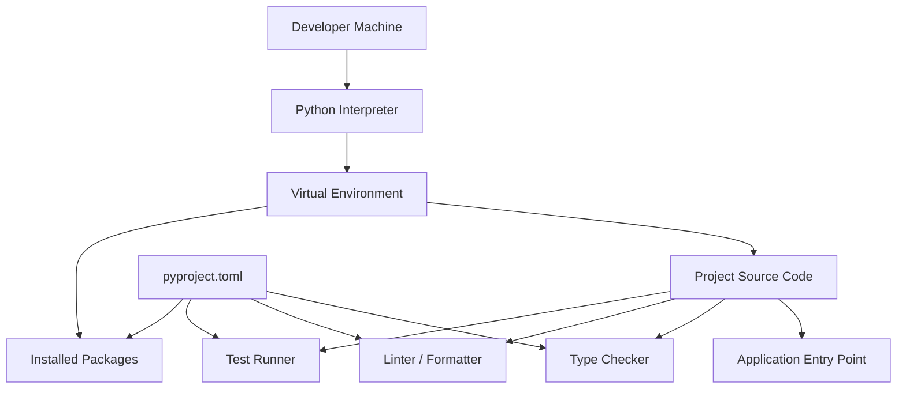
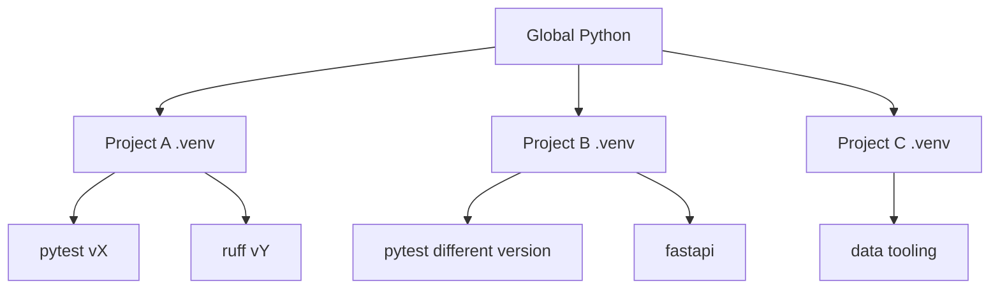

# Part 003 — Environment, Toolchain, dan Friction Removal

## 1. Tujuan Part Ini

Part ini membahas hal yang sering dianggap “sekadar setup”, padahal sangat menentukan kualitas belajar.

Dalam framework *The First 20 Hours*, salah satu prinsip utama adalah menghilangkan hambatan praktik. Untuk belajar programming, hambatan terbesar sering bukan teori. Hambatan terbesar adalah:

- interpreter tidak jelas;
- dependency bercampur dengan global environment;
- test sulit dijalankan;
- editor salah membaca Python path;
- package terinstall di tempat yang tidak disadari;
- command berbeda-beda setiap hari;
- project tidak bisa direproduksi di mesin lain;
- debugging habis waktu karena environment, bukan karena logic.

Environment yang buruk menciptakan noise.

Environment yang baik membuat loop ini cepat:

```text
edit -> run -> test -> lint -> fix -> commit
```

Tujuan part ini:

1. Memahami komponen dasar toolchain Python.
2. Membuat environment project yang isolated.
3. Menyiapkan struktur project awal.
4. Membuat command workflow yang konsisten.
5. Memasang tooling minimum untuk praktik efektif.
6. Menghindari jebakan umum setup Python.
7. Membuat fondasi untuk mini project `case-tracker`.

---

## 2. Prinsip Utama Toolchain Python

Toolchain bukan tujuan. Toolchain adalah alat untuk mempercepat feedback.

Prinsip yang akan kita pakai:

1. **Project harus isolated**  
   Dependency project A tidak boleh diam-diam memengaruhi project B.

2. **Command harus eksplisit**  
   Jangan bergantung pada “kebetulan shell saya mengarah ke Python yang benar”.

3. **Setup harus reproducible**  
   Engineer lain atau mesin CI harus bisa menjalankan project dengan langkah yang jelas.

4. **Quality check harus murah**  
   Test, lint, format, dan type-check harus bisa dijalankan dengan satu command pendek.

5. **Tooling jangan lebih kompleks dari project**  
   Untuk project kecil, setup sederhana lebih baik daripada toolchain enterprise yang tidak dipahami.

6. **Pahami fondasi sebelum memakai shortcut**  
   `uv`, Poetry, Hatch, atau tool modern lain berguna. Tetapi kamu tetap perlu paham `python`, `venv`, `pip`, dan `pyproject.toml`.

---

## 3. Komponen Mental Model Toolchain



Penjelasan:

| Komponen | Fungsi |
|---|---|
| Python interpreter | Program yang menjalankan kode Python |
| Virtual environment | Isolasi dependency per project |
| Package manager | Menginstall dependency |
| `pyproject.toml` | Konfigurasi project dan tools |
| Test runner | Menjalankan test |
| Linter | Mendeteksi style/bug pattern |
| Formatter | Merapikan format otomatis |
| Type checker | Memeriksa type hints secara statis |
| Entry point | Cara menjalankan aplikasi |

---

## 4. Mengenali Python yang Dipakai

Langkah pertama: tahu interpreter mana yang sedang digunakan.

Jalankan:

```bash
python --version
python -c "import sys; print(sys.executable)"
```

Di beberapa sistem, command bisa berbeda:

```bash
python3 --version
python3 -c "import sys; print(sys.executable)"
```

Di Windows, Python Launcher bisa dipakai:

```powershell
py --version
py -0p
```

Masalah umum:

| Gejala | Penyebab Umum |
|---|---|
| `python` tidak ditemukan | Python belum masuk PATH |
| `python` menunjuk versi lama | PATH order salah |
| `pip install` berhasil tapi import gagal | `pip` milik interpreter berbeda |
| VS Code tidak melihat package | interpreter editor berbeda dari terminal |
| Test jalan di terminal tapi gagal di IDE | environment tidak sama |

Rule penting:

> Jalankan package command melalui interpreter yang sama dengan project.

Lebih aman:

```bash
python -m pip install pytest
python -m pytest
```

Daripada:

```bash
pip install pytest
pytest
```

Karena `python -m pip` memastikan `pip` berasal dari interpreter `python` yang sedang kamu pakai.

---

## 5. Virtual Environment

Python memiliki modul `venv` untuk membuat virtual environment ringan. Virtual environment punya direktori package sendiri, sehingga dependency project terisolasi.

Buat project:

```bash
mkdir case-tracker
cd case-tracker
python -m venv .venv
```

Aktivasi di macOS/Linux:

```bash
source .venv/bin/activate
```

Aktivasi di Windows PowerShell:

```powershell
.venv\Scripts\Activate.ps1
```

Cek:

```bash
python --version
python -c "import sys; print(sys.prefix)"
```

Jika environment aktif, `sys.prefix` biasanya mengarah ke folder `.venv`.

### 5.1 Kenapa Nama `.venv`?

Nama `.venv` umum dipakai karena:

- jelas berada di root project;
- editor mudah mendeteksi;
- bisa diabaikan lewat `.gitignore`;
- tidak bercampur dengan source code.

Tambahkan ke `.gitignore`:

```gitignore
.venv/
__pycache__/
.pytest_cache/
.ruff_cache/
.mypy_cache/
.coverage
dist/
build/
*.egg-info/
```

### 5.2 Jangan Commit Virtual Environment

Virtual environment bukan artifact source. Jangan commit `.venv`.

Yang dicommit:

- source code;
- `pyproject.toml`;
- lock file jika dipakai;
- test;
- config;
- README.

Yang tidak dicommit:

- installed packages;
- cache;
- generated build directory;
- local environment.

---

## 6. `pip`, `pipx`, dan `uv`

Untuk 20 jam pertama, kamu cukup memahami tiga kategori.

### 6.1 `pip`

`pip` adalah installer package Python yang umum.

Contoh:

```bash
python -m pip install pytest
```

Cek package:

```bash
python -m pip list
```

Freeze dependency:

```bash
python -m pip freeze
```

Catatan penting:

- `pip freeze` mencatat semua package di environment, termasuk transitive dependency.
- Untuk project modern, dependency lebih baik dideklarasikan di `pyproject.toml`.
- Locking akan dibahas lebih dalam di part packaging.

### 6.2 `pipx`

`pipx` cocok untuk menginstall Python CLI tools secara isolated.

Contoh tool:

- `ruff`;
- `black`;
- `mypy`;
- `cookiecutter`;
- `tox`.

Namun jika tool adalah bagian dari project quality gate, sering lebih baik dideklarasikan sebagai dev dependency project agar versi konsisten.

### 6.3 `uv`

`uv` adalah tool modern untuk package/project management Python. Ia bisa menggantikan banyak workflow seperti pip, pip-tools, virtualenv, pipx, dan project management tertentu.

Contoh workflow:

```bash
uv init case-tracker
cd case-tracker
uv add --dev pytest ruff
uv run pytest
uv run ruff check .
uv run ruff format .
```

Kelebihan:

- cepat;
- mendukung lockfile;
- bisa mengelola project;
- bisa menjalankan tool dengan environment yang sesuai;
- ergonomis untuk development modern.

Namun untuk belajar fondasi, pahami dulu workflow manual:

```bash
python -m venv .venv
python -m pip install pytest ruff
python -m pytest
python -m ruff check .
```

Setelah itu, `uv` menjadi akselerator, bukan magic.

---

## 7. `pyproject.toml`

`pyproject.toml` adalah file konfigurasi project Python modern. Ia bisa berisi:

- metadata project;
- dependency;
- build system;
- konfigurasi tool seperti pytest, Ruff, mypy/pyright;
- dependency groups.

Contoh minimal untuk project belajar:

```toml
[project]
name = "case-tracker"
version = "0.1.0"
description = "A small CLI case tracker for learning Python engineering fundamentals."
readme = "README.md"
requires-python = ">=3.12"
dependencies = []

[project.scripts]
case-tracker = "case_tracker.cli:main"

[dependency-groups]
dev = [
    "pytest",
    "ruff",
]

[tool.pytest.ini_options]
testpaths = ["tests"]
pythonpath = ["src"]

[tool.ruff]
line-length = 100
target-version = "py312"

[tool.ruff.lint]
select = [
    "E",
    "F",
    "I",
    "B",
    "UP",
    "SIM",
]
```

Catatan:

- `requires-python = ">=3.12"` adalah baseline yang cukup modern.
- Jika kamu ingin mengikuti Python terbaru, boleh gunakan versi lebih tinggi.
- Untuk seri ini, konsep utama tidak bergantung pada minor version tertentu.
- Nanti fitur yang version-specific akan ditandai secara eksplisit.

### 7.1 Kenapa Tidak Mulai dari `requirements.txt` Saja?

`requirements.txt` masih banyak dipakai, tetapi secara konsep ia lebih sering cocok sebagai hasil pinning/lock atau deployment requirement, bukan satu-satunya metadata project.

Untuk project modern:

- metadata project: `pyproject.toml`;
- dependency declaration: `pyproject.toml`;
- reproducible lock: lock file dari tool yang dipilih;
- generated requirement: boleh ada untuk compatibility/deployment tertentu.

---

## 8. Struktur Project Awal

Kita akan memakai `src` layout:

```text
case-tracker/
  pyproject.toml
  README.md
  .gitignore
  src/
    case_tracker/
      __init__.py
      __main__.py
      cli.py
      domain.py
      storage.py
      service.py
  tests/
    test_domain.py
    test_service.py
```

Kenapa `src` layout?

Karena ia membantu mencegah import yang kebetulan berhasil dari root directory. Dengan `src`, kamu lebih cepat menyadari jika package belum terinstall atau path test belum dikonfigurasi.

### 8.1 File `__init__.py`

File ini menandai package Python.

```python
# src/case_tracker/__init__.py
```

Untuk awal, biarkan kosong.

### 8.2 File `__main__.py`

Agar package bisa dijalankan dengan:

```bash
python -m case_tracker
```

Isi:

```python
from case_tracker.cli import main

raise SystemExit(main())
```

### 8.3 File `cli.py`

Entry point CLI.

```python
def main() -> int:
    print("case-tracker")
    return 0
```

Jalankan:

```bash
python -m case_tracker
```

Jika memakai editable install:

```bash
python -m pip install -e .
case-tracker
```

---

## 9. Editable Install

Saat mengembangkan package, kamu ingin menginstall project sehingga import bekerja, tetapi perubahan source langsung terbaca.

Gunakan:

```bash
python -m pip install -e .
```

Setelah itu, command dari `[project.scripts]` bisa digunakan:

```bash
case-tracker
```

Mental model:

- project didaftarkan ke environment;
- source tetap berada di folder kerja;
- perubahan source tidak perlu reinstall penuh;
- cocok untuk development.

---

## 10. Tooling Minimum

Untuk fase awal, gunakan tooling minimum:

1. `pytest` untuk test.
2. `ruff` untuk linting dan formatting.
3. Optional: `mypy` atau `pyright` untuk type checking setelah type hints mulai banyak.
4. Optional: `coverage` setelah test suite mulai berarti.

Install:

```bash
python -m pip install pytest ruff
```

Atau dengan `uv`:

```bash
uv add --dev pytest ruff
```

---

## 11. Pytest Baseline

Buat file:

```text
tests/test_smoke.py
```

Isi:

```python
def test_smoke():
    assert 1 + 1 == 2
```

Jalankan:

```bash
python -m pytest
```

Output harus menunjukkan test pass.

Kenapa test smoke penting?

Karena ia membuktikan:

- pytest terinstall;
- test discovery jalan;
- path project tidak rusak;
- command test bisa dipakai sebelum logic kompleks dibuat.

---

## 12. Ruff Baseline

Ruff bisa dipakai untuk linting dan formatting.

Cek lint:

```bash
python -m ruff check .
```

Format:

```bash
python -m ruff format .
```

Auto-fix sebagian issue:

```bash
python -m ruff check . --fix
```

Rekomendasi awal:

- jalankan format sebelum commit;
- jalankan lint sebelum commit;
- jangan aktifkan terlalu banyak rule di hari pertama;
- tingkatkan rule seiring project matang.

### 12.1 Mengapa Ruff?

Ruff cepat dan menggabungkan banyak fungsi linting yang dulu sering tersebar di beberapa tool. Untuk belajar, ini mengurangi kompleksitas toolchain.

Tetapi tetap pahami konsepnya:

- formatter mengubah layout kode;
- linter mendeteksi pattern bermasalah;
- type checker memeriksa type contract;
- test runner memverifikasi behavior.

Jangan mencampur semua sebagai “tool yang marah”.

---

## 13. Editor Setup

Kamu bisa memakai editor apa pun. Yang penting:

1. Interpreter mengarah ke `.venv`.
2. Test runner mengenali folder `tests`.
3. Linter/formatter aktif.
4. Type hints terbaca.
5. Terminal dan editor memakai environment yang sama.

### 13.1 VS Code Checklist

- Select Python Interpreter: `.venv`.
- Enable format on save.
- Install Python extension.
- Install Ruff extension.
- Pastikan terminal terbuka dari root project.
- Jalankan `python -c "import sys; print(sys.executable)"` dari terminal VS Code.

### 13.2 PyCharm Checklist

- Project interpreter: `.venv`.
- Mark `src` sebagai source root jika perlu.
- Configure pytest.
- Enable Ruff integration atau external tool.
- Pastikan run configuration memakai interpreter project.

---

## 14. One-Command Workflow

Untuk project kecil, kamu bisa pakai script shell, `Makefile`, `justfile`, atau task runner lain.

Contoh `Makefile`:

```makefile
.PHONY: test lint format check

test:
	python -m pytest

lint:
	python -m ruff check .

format:
	python -m ruff format .

check:
	python -m pytest
	python -m ruff check .
```

Jalankan:

```bash
make check
```

Catatan Windows:

- `make` mungkin tidak tersedia default.
- Alternatif: gunakan PowerShell script, `just`, `nox`, atau langsung command eksplisit.

Untuk fase awal, command eksplisit sudah cukup. Tujuannya bukan memaksakan Makefile, tetapi membuat workflow tidak bergantung pada ingatan.

---

## 15. Baseline Repository

Buat file berikut.

### 15.1 `.gitignore`

```gitignore
.venv/
__pycache__/
*.py[cod]
.pytest_cache/
.ruff_cache/
.mypy_cache/
.coverage
htmlcov/
dist/
build/
*.egg-info/
.env
```

### 15.2 `README.md`

Gunakan isi berikut:

````markdown
# Case Tracker

A small CLI project for learning Python engineering fundamentals.

## Setup

```bash
python -m venv .venv
source .venv/bin/activate
python -m pip install -e .
python -m pip install pytest ruff
```

## Run

```bash
python -m case_tracker
```

## Test

```bash
python -m pytest
```

## Lint

```bash
python -m ruff check .
```

## Format

```bash
python -m ruff format .
```
````

### 15.3 `src/case_tracker/cli.py`

```python
def main() -> int:
    print("case-tracker is ready")
    return 0
```

### 15.4 `src/case_tracker/__main__.py`

```python
from case_tracker.cli import main

raise SystemExit(main())
```

### 15.5 `tests/test_smoke.py`

```python
from case_tracker.cli import main


def test_main_returns_success_code():
    assert main() == 0
```

---

## 16. Menjalankan Project

Urutan command:

```bash
python -m venv .venv
source .venv/bin/activate
python -m pip install --upgrade pip
python -m pip install -e .
python -m pip install pytest ruff
python -m case_tracker
python -m pytest
python -m ruff check .
```

Expected:

```text
case-tracker is ready
```

Test pass.

Lint pass atau memberi issue yang jelas.

---

## 17. Troubleshooting Umum

### 17.1 `ModuleNotFoundError: No module named 'case_tracker'`

Kemungkinan:

- package belum diinstall editable;
- `pythonpath` pytest belum dikonfigurasi;
- command dijalankan dari environment salah;
- struktur folder salah.

Solusi:

```bash
python -m pip install -e .
python -c "import case_tracker; print(case_tracker)"
```

### 17.2 `pytest: command not found`

Gunakan:

```bash
python -m pytest
```

Jika masih gagal:

```bash
python -m pip install pytest
```

### 17.3 Package Terinstall tapi Tidak Bisa Diimport

Cek interpreter:

```bash
python -c "import sys; print(sys.executable)"
python -m pip --version
```

Pastikan `pip` berasal dari environment yang sama.

### 17.4 VS Code Menandai Import Error

Biasanya interpreter editor salah.

Solusi:

- pilih interpreter `.venv`;
- reload window;
- jalankan test dari terminal editor;
- pastikan root workspace benar.

### 17.5 PowerShell Menolak Activate Script

Windows PowerShell bisa memblokir script activation.

Alternatif:

```powershell
.venv\Scripts\python.exe -m pytest
```

Atau atur execution policy sesuai kebijakan mesinmu.

---

## 18. Environment sebagai Boundary

Pikirkan environment sebagai boundary.



Setiap project boleh punya dependency berbeda. Ini menghindari:

- dependency conflict;
- upgrade tidak sengaja;
- “works on my machine”;
- hidden dependency;
- import dari package global.

---

## 19. Reproducibility Level

Ada beberapa level reproducibility.

| Level | Praktik | Cocok Untuk |
|---|---|---|
| 0 | Install manual global | Tidak direkomendasikan |
| 1 | `.venv` + manual install | Belajar awal |
| 2 | `pyproject.toml` dependency | Project kecil/menengah |
| 3 | Lock file | Team/CI/production |
| 4 | Container + lock + CI | Production system |
| 5 | Hermetic/reproducible builds | High assurance system |

Untuk part ini, target minimal:

- Level 1–2.

Nanti pada packaging dan production readiness:

- Level 3–4.

---

## 20. Quality Gate Minimum

Minimal command sebelum commit:

```bash
python -m pytest
python -m ruff check .
python -m ruff format --check .
```

Jika sudah memakai type checker:

```bash
python -m mypy src
```

Atau jika memakai pyright:

```bash
pyright
```

Namun jangan menambahkan mypy/pyright terlalu agresif sebelum kamu memahami type hints dasar.

---

## 21. Tooling Tidak Menggantikan Judgment

Linter bisa menemukan:

- unused import;
- undefined name;
- suspicious pattern;
- style violation;
- import sorting issue.

Formatter bisa merapikan:

- line wrapping;
- whitespace;
- quote consistency tertentu;
- indentation.

Type checker bisa menemukan:

- incompatible argument;
- missing return;
- optional misuse;
- wrong generic type.

Test bisa menemukan:

- behavior salah;
- edge case gagal;
- regression.

Tetapi tidak ada tool yang otomatis menjamin:

- domain rule benar;
- architecture sehat;
- error taxonomy tepat;
- operational behavior aman;
- security model cukup;
- performance sesuai kebutuhan.

Tooling adalah pagar, bukan sopir.

---

## 22. Praktik: Setup dari Nol

Lakukan dari folder kosong.

```bash
mkdir case-tracker
cd case-tracker
python -m venv .venv
source .venv/bin/activate
python -m pip install --upgrade pip
```

Buat struktur:

```bash
mkdir -p src/case_tracker tests
touch src/case_tracker/__init__.py
touch src/case_tracker/__main__.py
touch src/case_tracker/cli.py
touch tests/test_smoke.py
touch README.md
touch pyproject.toml
touch .gitignore
```

Jika Windows PowerShell:

```powershell
mkdir src
mkdir src\case_tracker
mkdir tests
New-Item src\case_tracker\__init__.py
New-Item src\case_tracker\__main__.py
New-Item src\case_tracker\cli.py
New-Item tests\test_smoke.py
New-Item README.md
New-Item pyproject.toml
New-Item .gitignore
```

Isi file sesuai baseline di atas.

Jalankan:

```bash
python -m pip install -e .
python -m pip install pytest ruff
python -m pytest
python -m ruff check .
python -m case_tracker
```

---

## 23. Praktik: Broken Environment Drill

Latihan ini penting karena environment issue pasti terjadi.

Buat tiga error sengaja:

### Error 1 — Import gagal

Rename folder:

```text
src/case_tracker
```

menjadi:

```text
src/casetracker
```

Jalankan test.

Amati error.

Kembalikan nama folder.

### Error 2 — Test gagal

Ubah `main()`:

```python
def main() -> int:
    print("case-tracker is ready")
    return 1
```

Jalankan test.

Perbaiki.

### Error 3 — Lint issue

Tambahkan unused import:

```python
import os


def main() -> int:
    print("case-tracker is ready")
    return 0
```

Jalankan:

```bash
python -m ruff check .
```

Perbaiki manual atau:

```bash
python -m ruff check . --fix
```

Tujuan latihan:

- tahu bentuk error;
- tahu command diagnosis;
- tidak panik saat setup rusak;
- membangun muscle memory.

---

## 24. Praktik: Environment Report

Buat file:

```text
ENVIRONMENT.md
```

Isi:

````markdown
# Environment Report

## Python

Command:

```bash
python --version
python -c "import sys; print(sys.executable)"
```

Output:

```text
[paste output]
```

## Virtual Environment

Command:

```bash
python -c "import sys; print(sys.prefix)"
```

Output:

```text
[paste output]
```

## Packages

Command:

```bash
python -m pip list
```

Output:

```text
[paste output]
```

## Test

Command:

```bash
python -m pytest
```

Output:

```text
[paste output]
```

## Lint

Command:

```bash
python -m ruff check .
```

Output:

```text
[paste output]
```
````

Ini terlihat sederhana, tetapi sangat berguna untuk debugging dan onboarding.

---

## 25. Decision Matrix Tooling Awal

| Kebutuhan | Tool Minimal | Tool Modern Opsional |
|---|---|---|
| Isolasi environment | `venv` | `uv` |
| Install package | `pip` | `uv` |
| Test | `pytest` | tetap `pytest` |
| Lint | `ruff` | `ruff` |
| Format | `ruff format` | `ruff format` |
| Type check | mypy/pyright | pyright/mypy |
| Task command | shell/Makefile | just/nox/tox |
| Project config | `pyproject.toml` | `pyproject.toml` |

Rekomendasi seri:

- Awal: `venv` + `pip` + `pytest` + `ruff`.
- Setelah nyaman: boleh pindah ke `uv`.
- Untuk team/CI: gunakan lock file dan quality gate.

---

## 26. Checklist Part 003

Sebelum lanjut, pastikan:

1. Kamu tahu interpreter Python yang dipakai.
2. Kamu bisa membuat `.venv`.
3. Kamu bisa mengaktifkan environment.
4. Kamu tahu kenapa `python -m pip` lebih aman daripada `pip`.
5. Kamu punya struktur `src/`.
6. Kamu punya `pyproject.toml`.
7. Kamu bisa menjalankan `python -m case_tracker`.
8. Kamu bisa menjalankan `python -m pytest`.
9. Kamu bisa menjalankan `python -m ruff check .`.
10. Kamu tahu cara membaca error `ModuleNotFoundError`.
11. Kamu tahu kenapa `.venv` tidak dicommit.
12. Kamu punya `.gitignore`.
13. Kamu bisa menjelaskan perbedaan interpreter, environment, package, dan project.
14. Kamu punya command workflow yang konsisten.
15. Kamu sudah membuat `ENVIRONMENT.md`.

---

## 27. Ringkasan

Environment bukan pekerjaan administratif. Environment adalah bagian dari engineering system.

Di part ini, kita membangun fondasi supaya praktik Python tidak terganggu oleh friksi yang tidak perlu:

- interpreter jelas;
- dependency isolated;
- project punya struktur;
- test runner siap;
- linter/formatter siap;
- command workflow jelas;
- troubleshooting dasar dipahami.

Dengan fondasi ini, kita bisa masuk ke syntax survival tanpa membuang energi untuk masalah environment.

Part berikutnya akan mulai menulis Python secara langsung: values, names, control flow, functions, imports, input/output, dan traceback.

---

## 28. Referensi

- Python Documentation — `venv`: https://docs.python.org/3/library/venv.html
- Python Tutorial — Virtual Environments and Packages: https://docs.python.org/3/tutorial/venv.html
- Python Packaging User Guide — Writing your `pyproject.toml`: https://packaging.python.org/en/latest/guides/writing-pyproject-toml/
- Python Packaging User Guide — `pyproject.toml` specification: https://packaging.python.org/en/latest/specifications/pyproject-toml/
- uv Documentation: https://docs.astral.sh/uv/
- Ruff Documentation: https://docs.astral.sh/ruff/
