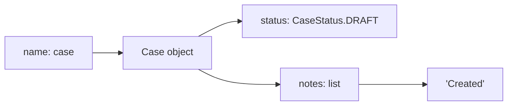
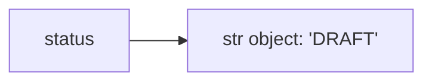
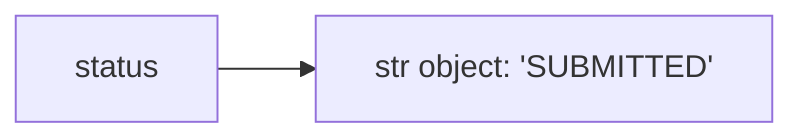
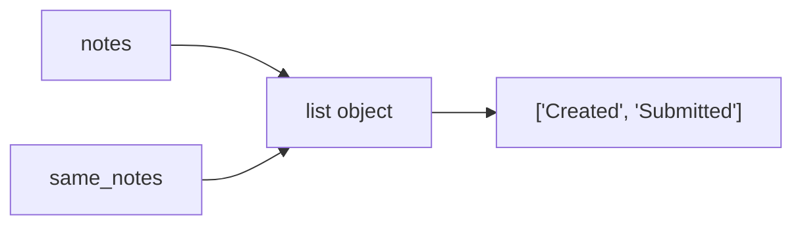
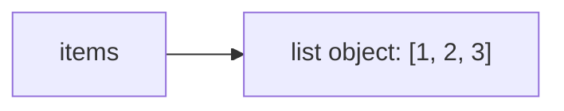
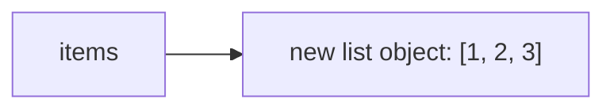
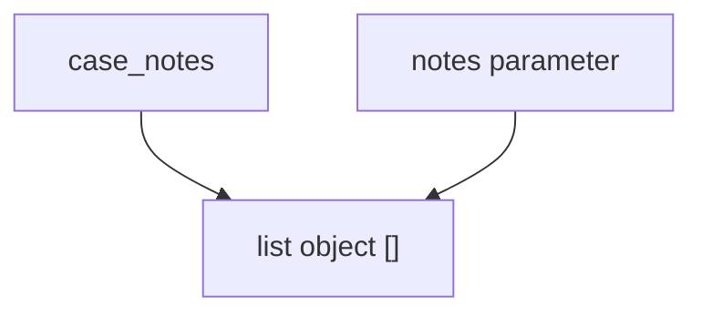
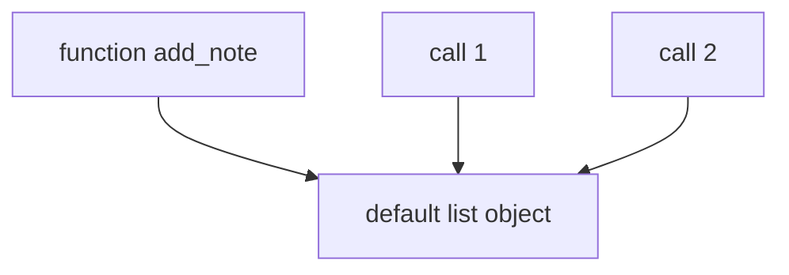
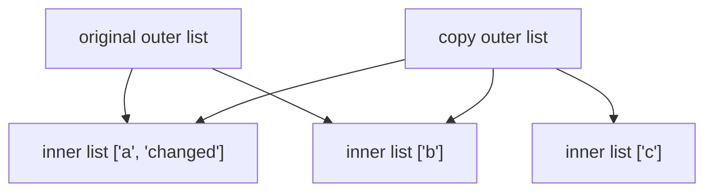

# Part 006 — Python Data Model: Object, Identity, Equality, dan Mutability

## 1. Tujuan Part Ini

Part ini adalah salah satu fondasi terpenting dalam belajar Python.

Jika kamu hanya menghafal syntax, kamu akan tetap sering bingung dengan bug seperti:

- list berubah padahal tidak merasa mengubahnya;
- default argument menyimpan state antar-call;
- object di test saling memengaruhi;
- `is` dan `==` tertukar;
- copy tidak sedalam yang dikira;
- dataclass equality mengejutkan;
- dictionary key tidak bisa memakai object tertentu;
- function mengubah data caller tanpa terlihat jelas;
- cache menyimpan reference yang ikut berubah.

Semua itu berakar pada data model.

Tujuan part ini:

1. Memahami object sebagai unit dasar Python.
2. Memahami name binding.
3. Membedakan identity dan equality.
4. Membedakan mutation dan rebinding.
5. Memahami aliasing.
6. Memahami shallow copy dan deep copy.
7. Menghindari mutable default bugs.
8. Memahami konsekuensi mutability untuk API design.
9. Menghubungkan konsep ini ke mini project `case-tracker`.
10. Membangun mental model yang kuat untuk debugging.

---

## 2. Premis Utama: Python Program adalah Object Graph

Python program dapat dipikirkan sebagai object graph yang berubah dari waktu ke waktu.



Nama menunjuk object. Object bisa menunjuk object lain.

Ini berbeda dari mental model “variable adalah kotak berisi value”.

Lebih tepat:

> Variable name adalah label yang di-bind ke object.

---

## 3. Object Punya Identity, Type, dan Value

Setiap object Python punya tiga aspek penting:

| Aspek | Pertanyaan | Contoh |
|---|---|---|
| Identity | Object ini object yang sama atau bukan? | `id(obj)` |
| Type | Object ini jenis apa? | `type(obj)` |
| Value/State | Isi atau state object apa? | `obj == other` |

Contoh:

```python
case_id = "CASE-001"

print(id(case_id))
print(type(case_id))
print(case_id)
```

Output akan mirip:

```text
4380321456
<class 'str'>
CASE-001
```

`id()` bukan sesuatu yang biasanya dipakai untuk business logic. Ia alat diagnosis untuk memahami identity.

---

## 4. Name Binding

Assignment di Python mengikat nama ke object.

```python
status = "DRAFT"
```

Model:



Reassignment atau rebinding:

```python
status = "SUBMITTED"
```

Model:



Object lama mungkin masih ada jika masih direferensikan nama lain. Jika tidak, ia bisa dibersihkan oleh memory management.

---

## 5. Multiple Names, Same Object

Contoh:

```python
notes = ["Created"]
same_notes = notes

same_notes.append("Submitted")

print(notes)
```

Output:

```text
['Created', 'Submitted']
```

Diagram:



`notes` dan `same_notes` bukan dua list. Mereka dua nama untuk list yang sama.

Ini disebut aliasing.

Aliasing bisa berguna, tetapi juga sumber bug.

---

## 6. Identity: `is`

Operator `is` memeriksa apakah dua nama menunjuk object yang sama.

```python
a = []
b = a
c = []

print(a is b)
print(a is c)
```

Output:

```text
True
False
```

`a` dan `b` menunjuk object sama. `a` dan `c` menunjuk dua list berbeda dengan value sama.

### 6.1 Gunakan `is` untuk Singleton

Gunakan `is` untuk `None`.

```python
assigned_to = None

if assigned_to is None:
    print("Unassigned")
```

Jangan:

```python
if assigned_to == None:
    ...
```

Kenapa?

Karena `==` bisa dioverride oleh object custom. `is None` memeriksa identity terhadap singleton `None`.

Gunakan juga untuk singleton lain jika relevan:

```python
if value is NotImplemented:
    ...
```

Namun untuk value equality biasa, gunakan `==`.

---

## 7. Equality: `==`

Operator `==` memeriksa equality value menurut definisi type object.

Contoh:

```python
a = [1, 2, 3]
b = [1, 2, 3]

print(a == b)
print(a is b)
```

Output:

```text
True
False
```

Value sama, identity berbeda.

### 7.1 Equality Bisa Didefinisikan Ulang

Class bisa menentukan equality.

Dengan dataclass:

```python
from dataclasses import dataclass


@dataclass
class Case:
    id: str
    title: str


first = Case(id="CASE-001", title="Late reporting")
second = Case(id="CASE-001", title="Late reporting")

print(first == second)
print(first is second)
```

Output:

```text
True
False
```

Dataclass secara default membuat equality berdasarkan field.

Ini sering berguna untuk value object dan test. Namun untuk entity domain, equality by all fields kadang bukan yang diinginkan.

---

## 8. Entity Equality vs Value Equality

Dalam domain modelling, ada perbedaan antara value object dan entity.

### 8.1 Value Object

Value object ditentukan oleh value-nya.

Contoh:

```python
from dataclasses import dataclass


@dataclass(frozen=True)
class CaseId:
    value: str
```

Dua `CaseId("CASE-001")` dianggap sama karena value sama.

```python
CaseId("CASE-001") == CaseId("CASE-001")
```

Hasil:

```text
True
```

### 8.2 Entity

Entity punya identity konseptual yang bertahan meski state berubah.

Contoh:

```python
@dataclass
class Case:
    id: CaseId
    title: str
    status: str
```

Jika status berubah, case tetap case yang sama secara domain.

Pertanyaan desain:

> Apakah equality `Case` harus berdasarkan semua field atau hanya id?

Dataclass default membandingkan semua field.

```python
case_a = Case(CaseId("CASE-001"), "Late reporting", "DRAFT")
case_b = Case(CaseId("CASE-001"), "Late reporting", "SUBMITTED")

print(case_a == case_b)
```

Hasil default:

```text
False
```

Padahal secara domain, bisa jadi itu entity yang sama di dua state berbeda.

Solusi bisa berupa custom equality atau tidak mengandalkan equality entity untuk domain identity.

Contoh:

```python
@dataclass(eq=False)
class Case:
    id: CaseId
    title: str
    status: str

    def same_identity_as(self, other: "Case") -> bool:
        return self.id == other.id
```

Untuk project awal, dataclass default masih acceptable. Namun engineer harus sadar konsekuensinya.

---

## 9. Mutability

Object mutable bisa berubah setelah dibuat.

Mutable umum:

- `list`;
- `dict`;
- `set`;
- sebagian besar instance class;
- dataclass biasa.

Immutable umum:

- `int`;
- `float`;
- `bool`;
- `str`;
- `tuple` jika isinya immutable;
- `frozenset`;
- `dataclass(frozen=True)` secara terbatas.

Contoh mutable:

```python
notes = []
notes.append("Created")
```

Object list berubah.

Contoh immutable:

```python
status = "DRAFT"
status = status.lower()
```

String lama tidak berubah. `status.lower()` membuat string baru, lalu nama `status` di-bind ke string baru.

---

## 10. Mutation vs Rebinding

Perbedaan ini wajib jelas.

### 10.1 Mutation

```python
items = [1, 2]
items.append(3)
```

Object list yang sama berubah.



### 10.2 Rebinding

```python
items = [1, 2]
items = [1, 2, 3]
```

Nama `items` sekarang menunjuk list baru.



Jika ada alias, efeknya berbeda.

```python
a = [1, 2]
b = a

a.append(3)
print(b)
```

Output:

```text
[1, 2, 3]
```

Karena object yang sama dimutasi.

```python
a = [1, 2]
b = a

a = [1, 2, 3]
print(b)
```

Output:

```text
[1, 2]
```

Karena `a` di-rebind ke object baru. `b` tetap menunjuk list lama.

---

## 11. Function Calls dan Object References

Saat object dikirim ke function, function menerima reference ke object tersebut.

Contoh mutation:

```python
def add_note(notes: list[str]) -> None:
    notes.append("Created")


case_notes = []
add_note(case_notes)

print(case_notes)
```

Output:

```text
['Created']
```

Function memutasi object list yang juga dimiliki caller.

Contoh rebinding:

```python
def replace_notes(notes: list[str]) -> None:
    notes = ["Created"]


case_notes = []
replace_notes(case_notes)

print(case_notes)
```

Output:

```text
[]
```

Rebinding nama lokal `notes` tidak mengubah binding `case_notes` di caller.

Mental model:



Parameter adalah nama lokal yang di-bind ke object yang sama. Mutasi object terlihat oleh caller. Rebinding parameter tidak mengubah nama caller.

---

## 12. API Design: Mutating atau Returning New Object?

Saat menulis function, tentukan kontrak:

1. Function memutasi input.
2. Function mengembalikan object baru.
3. Function tidak punya side effect.

### 12.1 Mutating API

```python
def add_note(case: Case, note: str) -> None:
    case.notes.append(note)
```

Ciri:

- return `None`;
- side effect jelas dari nama;
- efisien;
- cocok untuk entity mutable;
- harus hati-hati di test dan concurrency.

### 12.2 Non-Mutating API

```python
def with_note(case: Case, note: str) -> Case:
    return Case(
        id=case.id,
        title=case.title,
        status=case.status,
        notes=[*case.notes, note],
    )
```

Ciri:

- mengembalikan object baru;
- original tidak berubah;
- lebih mudah dipikirkan;
- bisa lebih mahal;
- cocok untuk value object atau immutable workflow.

### 12.3 Jangan Ambigu

Buruk:

```python
def update_case(case: Case, note: str) -> Case:
    case.notes.append(note)
    return case
```

Ini memutasi dan mengembalikan object yang sama. Kadang acceptable, tetapi contract harus jelas.

Lebih eksplisit:

```python
def add_note_in_place(case: Case, note: str) -> None:
    case.notes.append(note)
```

Atau:

```python
def case_with_added_note(case: Case, note: str) -> Case:
    ...
```

Nama function harus mencerminkan mutability contract.

---

## 13. Mutable Default Argument

Bug klasik Python.

```python
def add_note(note: str, notes: list[str] = []) -> list[str]:
    notes.append(note)
    return notes
```

Coba:

```python
first = add_note("first")
second = add_note("second")

print(first)
print(second)
```

Output:

```text
['first', 'second']
['first', 'second']
```

Kenapa?

Default argument dievaluasi sekali saat function didefinisikan, bukan setiap function call.

Diagram:



Perbaikan:

```python
def add_note(note: str, notes: list[str] | None = None) -> list[str]:
    if notes is None:
        notes = []

    notes.append(note)
    return notes
```

Rule:

> Jangan gunakan mutable object sebagai default argument kecuali memang sengaja membuat shared state, dan itu sangat jarang tepat.

---

## 14. Dataclass dan Mutable Defaults

Dataclass membantu mencegah beberapa mutable default.

Buruk:

```python
from dataclasses import dataclass


@dataclass
class Case:
    notes: list[str] = []
```

Dataclass akan menolak mutable default list langsung dengan error tertentu.

Gunakan:

```python
from dataclasses import dataclass, field


@dataclass
class Case:
    notes: list[str] = field(default_factory=list)
```

`default_factory=list` berarti:

> panggil `list()` setiap kali instance baru dibuat.

Setiap instance mendapat list sendiri.

Test penting:

```python
def test_cases_do_not_share_notes():
    first = Case()
    second = Case()

    first.notes.append("Created")

    assert second.notes == []
```

---

## 15. Shallow Copy

Shallow copy membuat container baru, tetapi item di dalamnya tetap reference yang sama.

Contoh:

```python
original = [["a"], ["b"]]
copy = list(original)

copy.append(["c"])
copy[0].append("changed")

print(original)
print(copy)
```

Output:

```text
[['a', 'changed'], ['b']]
[['a', 'changed'], ['b'], ['c']]
```

Kenapa?

- `copy` adalah list luar baru.
- Tetapi nested list `["a"]` masih object yang sama.

Diagram:



Cara shallow copy umum:

```python
copy_a = list(original)
copy_b = original.copy()
copy_c = original[:]
```

Untuk dict:

```python
copy_dict = dict(original_dict)
copy_dict = original_dict.copy()
```

---

## 16. Deep Copy

Deep copy mencoba menyalin object nested juga.

```python
from copy import deepcopy

original = [["a"], ["b"]]
copy = deepcopy(original)

copy[0].append("changed")

print(original)
print(copy)
```

Output:

```text
[['a'], ['b']]
[['a', 'changed'], ['b']]
```

Namun `deepcopy` bukan default solusi.

Risiko:

- mahal untuk object graph besar;
- bisa tidak sesuai untuk resource object;
- bisa menyalin lebih banyak dari yang diinginkan;
- bisa bermasalah dengan circular reference tertentu;
- bisa menyembunyikan desain mutability yang tidak jelas.

Gunakan deep copy ketika memang butuh object graph independen.

---

## 17. Copy dalam Mini Project

Di `case-tracker`, function serialization:

```python
def case_to_dict(case: Case) -> dict:
    return {
        "id": case.id,
        "title": case.title,
        "status": case.status.value,
        "notes": list(case.notes),
    }
```

Kenapa `list(case.notes)`?

Agar dictionary hasil serialization tidak berbagi list yang sama dengan domain object.

Tanpa copy:

```python
def case_to_dict(case: Case) -> dict:
    return {
        "notes": case.notes,
    }
```

Caller bisa mengubah hasil dict dan tanpa sengaja mengubah `case.notes`.

Contoh:

```python
data = case_to_dict(case)
data["notes"].append("Injected")

print(case.notes)
```

Jika tidak dicopy, domain object ikut berubah.

Boundary harus memutus aliasing jika tidak ingin berbagi state.

---

## 18. Hashability

Hashability penting untuk set dan dict key.

Object hashable bisa dipakai sebagai key dict atau member set.

Immutable built-ins seperti `str`, `int`, dan tuple immutable biasanya hashable.

```python
case_by_id = {
    "CASE-001": "Late reporting",
}
```

List tidak hashable:

```python
key = ["CASE-001"]
data = {key: "value"}
```

Akan error:

```text
TypeError: unhashable type: 'list'
```

Kenapa?

Karena list mutable. Jika list berubah setelah jadi key, hash map rusak.

### 18.1 Frozen Dataclass

Value object immutable bisa dibuat hashable.

```python
from dataclasses import dataclass


@dataclass(frozen=True)
class CaseId:
    value: str
```

Biasanya bisa dipakai sebagai dict key:

```python
case_by_id = {
    CaseId("CASE-001"): "Late reporting",
}
```

Namun hati-hati jika field di dalamnya mutable. Frozen dataclass mencegah assignment field, tetapi tidak selalu membuat nested mutable object benar-benar immutable.

---

## 19. Immutability sebagai Design Tool

Immutability bukan agama. Ia alat desain.

Kelebihan immutability:

- lebih mudah reasoning;
- aman untuk sharing;
- bagus untuk value object;
- mengurangi accidental mutation;
- bagus untuk dictionary key;
- membantu concurrency;
- test lebih predictable.

Kekurangan:

- update object bisa lebih verbose;
- bisa membuat banyak object baru;
- tidak selalu natural untuk entity lifecycle;
- butuh pattern untuk copy-with-change.

Contoh value object:

```python
@dataclass(frozen=True)
class Money:
    amount: int
    currency: str
```

Contoh entity mutable:

```python
@dataclass
class Case:
    id: CaseId
    status: CaseStatus

    def transition_to(self, target_status: CaseStatus) -> None:
        self.status = target_status
```

Dalam domain case management, entity mutable bisa masuk akal karena case memang mengalami lifecycle. Namun audit trail dan transaction boundary harus jelas.

---

## 20. Frozen Dataclass Tidak Selalu Deep Immutable

Contoh:

```python
from dataclasses import dataclass


@dataclass(frozen=True)
class CaseSnapshot:
    notes: list[str]


snapshot = CaseSnapshot(notes=[])
snapshot.notes.append("Still mutable")
```

Meskipun dataclass frozen, list di dalamnya tetap mutable.

`frozen=True` mencegah:

```python
snapshot.notes = []
```

Tetapi tidak mencegah:

```python
snapshot.notes.append(...)
```

Solusi:

```python
@dataclass(frozen=True)
class CaseSnapshot:
    notes: tuple[str, ...]
```

Tuple lebih cocok untuk immutable sequence.

---

## 21. Equality dan Mutation: Kombinasi Berbahaya

Jika object mutable dipakai dalam struktur yang mengandalkan equality/hash, hati-hati.

Contoh buruk:

```python
from dataclasses import dataclass


@dataclass(unsafe_hash=True)
class Case:
    id: str
    status: str


case = Case("CASE-001", "DRAFT")
cases = {case}

case.status = "SUBMITTED"

print(case in cases)
```

Behavior bisa mengejutkan karena hash dapat berubah jika field yang dihitung berubah.

Rule:

> Jangan membuat object mutable menjadi hashable kecuali kamu benar-benar memahami konsekuensinya.

Untuk dict key/set member, gunakan immutable value object seperti `CaseId`.

---

## 22. Small Integer dan String Interning: Jangan Bergantung

Kadang ini terjadi:

```python
a = 256
b = 256

print(a is b)
```

Bisa `True` karena implementation detail.

Atau:

```python
a = "CASE"
b = "CASE"

print(a is b)
```

Bisa `True` karena interning.

Jangan gunakan `is` untuk membandingkan value string/int.

Salah:

```python
if status is "DRAFT":
    ...
```

Benar:

```python
if status == "DRAFT":
    ...
```

`is` untuk identity, terutama `None`. `==` untuk value equality.

---

## 23. Lifecycle dan Garbage Collection Overview

Python object hidup selama masih ada reference yang menjangkaunya.

Contoh:

```python
notes = ["Created"]
alias = notes

notes = None
```

List masih hidup karena `alias` masih menunjuk ke sana.

```python
alias = None
```

Sekarang tidak ada nama yang menunjuk list tersebut. Object bisa dibersihkan.

CPython memakai reference counting sebagai mekanisme utama, ditambah garbage collector untuk menangani reference cycle.

Kamu tidak perlu mengelola memory manual seperti C. Tetapi kamu tetap perlu sadar:

- reference yang tersimpan di global cache bisa mencegah object dibersihkan;
- cycle dengan resource eksternal bisa tricky;
- file/socket harus ditutup dengan context manager;
- generator bisa menahan reference;
- closure bisa menahan object lebih lama dari yang dikira.

---

## 24. Resource Object dan Context Manager

Beberapa object punya resource eksternal:

- file;
- socket;
- database connection;
- lock;
- temporary directory.

Gunakan context manager:

```python
from pathlib import Path

path = Path("cases.txt")

with path.open("w", encoding="utf-8") as file:
    file.write("CASE-001")
```

Atau shortcut:

```python
path.write_text("CASE-001", encoding="utf-8")
```

Context manager memastikan resource release meskipun error.

Ini bagian dari object lifecycle yang lebih luas: bukan hanya memory, tetapi resource ownership.

---

## 25. Aliasing dalam Tests

Bug test sering muncul karena shared state.

Buruk:

```python
DEFAULT_CASE = Case(id="CASE-001", title="Late reporting")


def test_add_note():
    DEFAULT_CASE.add_note("Created")
    assert DEFAULT_CASE.notes == ["Created"]


def test_starts_without_notes():
    assert DEFAULT_CASE.notes == []
```

Test kedua bisa gagal tergantung urutan.

Solusi:

```python
def make_case() -> Case:
    return Case(id="CASE-001", title="Late reporting")


def test_add_note():
    case = make_case()
    case.add_note("Created")
    assert case.notes == ["Created"]


def test_starts_without_notes():
    case = make_case()
    assert case.notes == []
```

Rule:

> Test harus membuat state sendiri kecuali sharing memang disengaja dan aman.

---

## 26. Aliasing dalam Service Layer

Perhatikan function:

```python
def list_cases(path: Path) -> list[Case]:
    return load_cases(path)
```

Caller mendapat list mutable. Caller bisa mengubah list tanpa save.

```python
cases = list_cases(path)
cases.clear()
```

Apakah ini masalah?

Dalam versi awal, tidak besar karena list berasal dari load file dan mutation tidak otomatis persist. Namun API contract perlu jelas.

Alternatif:

```python
def list_cases(path: Path) -> tuple[Case, ...]:
    return tuple(load_cases(path))
```

Tuple memberi sinyal read-only sequence. Tetapi `Case` di dalamnya masih mutable.

Jika butuh snapshot benar-benar immutable, kamu perlu immutable `CaseSnapshot`.

Trade-off:

- list sederhana untuk awal;
- tuple lebih aman untuk read API;
- immutable snapshot lebih aman tapi lebih banyak modelling.

---

## 27. Defensive Copy

Defensive copy berarti function/class membuat copy untuk mencegah external mutation.

Contoh:

```python
class CaseBook:
    def __init__(self, cases: list[Case]) -> None:
        self._cases = list(cases)

    def list_cases(self) -> list[Case]:
        return list(self._cases)
```

Ini melindungi list container, tetapi tidak melindungi object `Case` di dalamnya.

Untuk deep protection:

- gunakan immutable objects;
- gunakan snapshots;
- gunakan deep copy jika sesuai;
- expose read-only view;
- dokumentasikan ownership.

Jangan defensive copy membabi buta. Copy punya cost dan bisa menyembunyikan model ownership yang buruk.

---

## 28. Ownership

Pertanyaan penting API design:

> Siapa yang memiliki object ini dan siapa yang boleh mengubahnya?

Contoh function:

```python
def process_cases(cases: list[Case]) -> None:
    ...
```

Apakah function boleh mutate `cases`?

Nama tidak menjelaskan.

Lebih jelas:

```python
def sort_cases_in_place(cases: list[Case]) -> None:
    cases.sort(key=lambda case: case.id)
```

Atau:

```python
def sorted_cases(cases: list[Case]) -> list[Case]:
    return sorted(cases, key=lambda case: case.id)
```

Konvensi Python:

- method seperti `.sort()` mutates dan return `None`;
- function seperti `sorted()` mengembalikan list baru.

Ikuti pola ini dalam API sendiri.

---

## 29. In-Place vs New Object Convention

Contoh built-in:

```python
numbers = [3, 1, 2]

result = numbers.sort()

print(result)
print(numbers)
```

Output:

```text
None
[1, 2, 3]
```

`.sort()` mutates in-place dan return `None`.

Sedangkan:

```python
numbers = [3, 1, 2]

result = sorted(numbers)

print(result)
print(numbers)
```

Output:

```text
[1, 2, 3]
[3, 1, 2]
```

Pelajaran:

- mutating API sebaiknya tidak mengembalikan object baru;
- non-mutating API sebaiknya jelas dari nama;
- jangan membuat caller menebak.

---

## 30. Mutability dan Concurrency

Mutable shared state adalah sumber race condition.

Contoh konseptual:

```python
cases = []


def create_case(case: Case) -> None:
    cases.append(case)
```

Jika banyak thread memanggil ini, kamu perlu memahami thread safety.

Untuk 20 jam pertama, kita belum masuk concurrency. Tetapi simpan rule:

> Semakin banyak shared mutable state, semakin sulit reasoning concurrency.

Immutability, message passing, queue, dan isolated process sering membantu mengurangi risiko.

---

## 31. Mutability dan Caching

Caching object mutable bisa berbahaya.

```python
_cache: dict[str, Case] = {}


def get_case(case_id: str) -> Case:
    return _cache[case_id]
```

Caller bisa mutate object dari cache:

```python
case = get_case("CASE-001")
case.status = CaseStatus.CLOSED
```

Sekarang cache berubah.

Solusi tergantung desain:

- return copy;
- return immutable snapshot;
- expose method untuk update terkontrol;
- document that returned object is live;
- avoid global mutable cache.

---

## 32. Debugging Identity

Gunakan `id()` untuk memahami aliasing.

```python
a = []
b = a
c = []

print(id(a))
print(id(b))
print(id(c))
```

`a` dan `b` punya id sama. `c` berbeda.

Untuk debugging object custom:

```python
print(f"{id(case)=}")
print(f"{case=}")
```

Dataclass `repr` membantu:

```python
@dataclass
class Case:
    id: str
    status: str
```

Output readable:

```text
Case(id='CASE-001', status='DRAFT')
```

---

## 33. Practical Rules

Gunakan rule ini dalam kode Python sehari-hari.

### Rule 1 — Gunakan `is None`

```python
if value is None:
    ...
```

### Rule 2 — Gunakan `==` untuk value

```python
if status == "DRAFT":
    ...
```

### Rule 3 — Jangan mutable default

```python
def f(items: list[str] | None = None):
    if items is None:
        items = []
```

### Rule 4 — Copy saat crossing boundary

```python
return list(self._items)
```

### Rule 5 — Mutating function harus jelas

```python
def add_note_in_place(case: Case, note: str) -> None:
    ...
```

### Rule 6 — Untuk finite state, gunakan enum

```python
class CaseStatus(Enum):
    DRAFT = "DRAFT"
```

### Rule 7 — Untuk identifier, pertimbangkan value object

```python
@dataclass(frozen=True)
class CaseId:
    value: str
```

### Rule 8 — Jangan pakai `is` untuk string/int comparison

```python
status == "DRAFT"
```

### Rule 9 — Test shared state behavior

```python
def test_instances_do_not_share_notes():
    ...
```

### Rule 10 — Jangan expose internal mutable state tanpa sengaja

```python
def notes(self) -> tuple[str, ...]:
    return tuple(self._notes)
```

---

## 34. Refactor `case-tracker`: Introduce `CaseId`

Sebagai latihan, ubah id dari raw string menjadi value object.

```python
from dataclasses import dataclass


@dataclass(frozen=True)
class CaseId:
    value: str

    def __post_init__(self) -> None:
        if not self.value.strip():
            raise ValueError("Case id cannot be empty")
```

Update `Case`:

```python
@dataclass
class Case:
    id: CaseId
    title: str
    status: CaseStatus = CaseStatus.DRAFT
    notes: list[str] = field(default_factory=list)
```

Serialization:

```python
def case_to_dict(case: Case) -> dict:
    return {
        "id": case.id.value,
        "title": case.title,
        "status": case.status.value,
        "notes": list(case.notes),
    }
```

Deserialization:

```python
def case_from_dict(data: dict) -> Case:
    return Case(
        id=CaseId(data["id"]),
        title=data["title"],
        status=CaseStatus(data["status"]),
        notes=list(data.get("notes", [])),
    )
```

Trade-off:

- lebih explicit;
- type checker lebih membantu;
- sedikit lebih verbose;
- JSON boundary butuh mapping.

Ini contoh bagaimana object model membantu domain modelling.

---

## 35. Practice: Identity vs Equality Drill

Buat file:

```text
scratch/identity_equality.py
```

Isi:

```python
from dataclasses import dataclass


@dataclass
class Case:
    id: str
    title: str


a = Case("CASE-001", "Late reporting")
b = Case("CASE-001", "Late reporting")
c = a

print(a == b)
print(a is b)
print(a is c)
print(id(a))
print(id(b))
print(id(c))
```

Jawab:

1. Kenapa `a == b` bernilai `True`?
2. Kenapa `a is b` bernilai `False`?
3. Kenapa `a is c` bernilai `True`?
4. Apa yang dibandingkan oleh dataclass default equality?
5. Apakah default equality ini cocok untuk entity?

---

## 36. Practice: Mutation Drill

Buat:

```python
def append_note(notes: list[str], note: str) -> None:
    notes.append(note)


notes = []
append_note(notes, "Created")

print(notes)
```

Lalu ubah function:

```python
def append_note(notes: list[str], note: str) -> list[str]:
    return [*notes, note]


notes = []
new_notes = append_note(notes, "Created")

print(notes)
print(new_notes)
```

Jawab:

1. Versi mana yang mutating?
2. Versi mana yang non-mutating?
3. Mana yang lebih cocok untuk entity?
4. Mana yang lebih cocok untuk value object?
5. Bagaimana nama function sebaiknya diubah agar contract jelas?

---

## 37. Practice: Copy Drill

Buat:

```python
original = {
    "id": "CASE-001",
    "notes": ["Created"],
}

copy = dict(original)
copy["notes"].append("Submitted")

print(original)
print(copy)
```

Jawab:

1. Kenapa original ikut berubah?
2. Bagaimana memperbaiki dengan shallow copy nested list?
3. Kapan perlu `deepcopy`?
4. Kenapa `dict(original)` belum cukup untuk nested mutable data?

Perbaikan:

```python
copy = dict(original)
copy["notes"] = list(original["notes"])
copy["notes"].append("Submitted")
```

---

## 38. Practice: Mutable Default Drill

Buat:

```python
def collect(value: str, bucket: list[str] = []) -> list[str]:
    bucket.append(value)
    return bucket


print(collect("a"))
print(collect("b"))
print(collect("c"))
```

Amati output.

Perbaiki:

```python
def collect(value: str, bucket: list[str] | None = None) -> list[str]:
    if bucket is None:
        bucket = []

    bucket.append(value)
    return bucket
```

Tulis penjelasan:

- kapan default list dibuat;
- kenapa call berikutnya memakai list yang sama;
- kenapa `None` sentinel menyelesaikan masalah.

---

## 39. Practice: API Contract Review

Review function ini:

```python
def prepare_cases(cases: list[Case]) -> list[Case]:
    cases.sort(key=lambda case: case.id)
    return cases
```

Pertanyaan:

1. Apakah function ini mutating?
2. Apakah nama function menjelaskan mutation?
3. Apakah return value bisa menyesatkan?
4. Bagaimana versi in-place yang lebih jelas?
5. Bagaimana versi non-mutating yang lebih jelas?

Jawaban contoh:

```python
def sort_cases_in_place(cases: list[Case]) -> None:
    cases.sort(key=lambda case: case.id)
```

Atau:

```python
def sorted_cases(cases: list[Case]) -> list[Case]:
    return sorted(cases, key=lambda case: case.id)
```

---

## 40. Checklist Part 006

Pastikan kamu bisa menjawab:

1. Apa tiga aspek object Python?
2. Apa itu name binding?
3. Apa beda identity dan equality?
4. Kapan memakai `is`?
5. Kapan memakai `==`?
6. Kenapa `is None` benar?
7. Apa itu aliasing?
8. Apa beda mutation dan rebinding?
9. Kenapa function bisa mengubah object caller?
10. Kenapa rebinding parameter tidak mengubah caller?
11. Apa bug mutable default argument?
12. Apa fungsi `field(default_factory=list)`?
13. Apa beda shallow copy dan deep copy?
14. Kenapa `list(case.notes)` berguna di serialization?
15. Apa itu hashability?
16. Kenapa list tidak bisa menjadi dict key?
17. Apa bedanya value object dan entity?
18. Kenapa frozen dataclass tidak otomatis deep immutable?
19. Apa risiko object mutable yang hashable?
20. Bagaimana mutability memengaruhi API design?

---

## 41. Ringkasan

Part ini membangun mental model object Python.

Inti yang harus melekat:

- nama menunjuk object;
- object punya identity, type, dan value/state;
- `is` memeriksa identity;
- `==` memeriksa equality;
- mutation mengubah object;
- rebinding mengubah nama;
- aliasing membuat banyak nama menunjuk object sama;
- shallow copy hanya menyalin container luar;
- deep copy menyalin lebih dalam tetapi punya cost;
- mutable default argument adalah jebakan besar;
- dataclass membutuhkan `default_factory` untuk field mutable;
- mutability adalah keputusan API design;
- boundary sering perlu copy;
- value object lebih cocok immutable;
- entity bisa mutable tetapi invariant harus dijaga.

Setelah memahami ini, banyak perilaku Python yang sebelumnya terasa aneh menjadi masuk akal.

Part berikutnya akan membahas core collections: `list`, `tuple`, `dict`, dan `set`, termasuk trade-off, complexity, ordering, hashability, dan cara memilih struktur data yang tepat.

---

## 42. Referensi

- Python Documentation — Data Model.
- Python Documentation — Built-in Types.
- Python Documentation — `dataclasses`.
- Python Documentation — `copy`.
- Python Documentation — `enum`.
- Python Tutorial — Data Structures.
