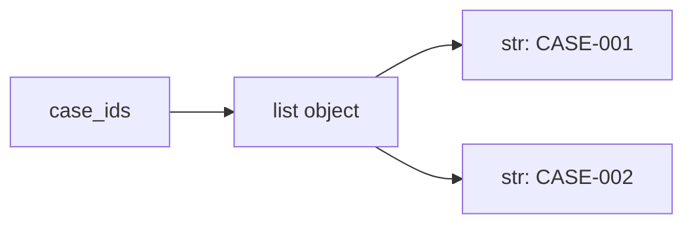

# Part 007 — Core Collections: list, tuple, dict, set, dan Trade-off-nya

## 1. Tujuan Part Ini

Mayoritas program Python memanipulasi data melalui collection.

Jika kamu menguasai syntax tetapi salah memilih collection, kode akan:

- sulit dibaca;
- lambat tanpa perlu;
- rentan duplicate data;
- sulit menjaga invariant;
- mudah salah saat mutation;
- penuh loop manual yang seharusnya sederhana;
- sulit dites karena struktur data tidak mencerminkan domain.

Part ini membahas empat collection inti:

1. `list`
2. `tuple`
3. `dict`
4. `set`

Kita akan fokus pada pertanyaan engineering:

- kapan memakai collection tertentu?
- apa trade-off mutability dan ordering?
- apa konsekuensi complexity?
- kapan perlu copy?
- kapan raw collection cukup?
- kapan harus naik ke dataclass/domain object?
- bagaimana collection memodelkan data case lifecycle?

Target setelah part ini:

- bisa memilih collection berdasarkan intent;
- bisa menjelaskan complexity dasar;
- bisa menghindari bug aliasing;
- bisa memakai comprehension dengan wajar;
- bisa membedakan data mentah dan domain model;
- bisa refactor kode berbasis collection menjadi lebih jelas.

---

## 2. Mental Model Collection

Collection adalah object yang menyimpan referensi ke object lain.

```python
case_ids = ["CASE-001", "CASE-002"]
```

Model:



Collection tidak “menyalin seluruh object” setiap kali kamu memasukkan object ke dalamnya. Ia menyimpan reference.

Contoh:

```python
case = {"id": "CASE-001", "status": "DRAFT"}
cases = [case]

case["status"] = "SUBMITTED"

print(cases)
```

Output:

```text
[{'id': 'CASE-001', 'status': 'SUBMITTED'}]
```

Karena list menyimpan reference ke dict yang sama.

Ini mengikat kembali ke part 006: collection adalah bagian dari object graph.

---

## 3. Collection Decision Matrix

Gunakan matrix awal ini.

| Kebutuhan | Pilihan Umum | Alasan |
|---|---|---|
| Urutan penting dan bisa ada duplicate | `list` | Ordered, mutable sequence |
| Urutan tetap dan data tidak dimaksudkan berubah | `tuple` | Immutable sequence |
| Lookup berdasarkan key | `dict` | Key-value mapping |
| Uniqueness dan membership check | `set` | Unique elements, fast membership |
| Finite states | `Enum` + `set`/`dict` | Domain lebih eksplisit |
| Record/domain object | `dataclass` | Field bernama dan type jelas |
| Read-only public sequence | `tuple` | Sinyal tidak dimutasi |
| Counting frequency | `collections.Counter` | Specialized mapping |
| Grouping by key | `dict[key, list[value]]` | Natural grouping |

Rule sederhana:

> Pilih collection yang membuat constraint data terlihat.

Jika data harus unique, jangan pakai `list` lalu berharap tidak duplicate. Pakai `set` atau enforce rule eksplisit.

---

## 4. `list`: Ordered Mutable Sequence

`list` adalah collection paling sering dipakai di Python.

Ciri:

- ordered;
- mutable;
- boleh duplicate;
- index-based;
- dynamic size;
- cocok untuk urutan item;
- cocok untuk append;
- cocok untuk iterasi.

Contoh:

```python
case_ids = ["CASE-001", "CASE-002"]
case_ids.append("CASE-003")

print(case_ids)
```

Output:

```text
['CASE-001', 'CASE-002', 'CASE-003']
```

### 4.1 Operasi Dasar List

```python
cases = ["CASE-001", "CASE-002", "CASE-003"]

first = cases[0]
last = cases[-1]
subset = cases[1:3]

cases.append("CASE-004")
cases.extend(["CASE-005", "CASE-006"])
cases.remove("CASE-002")

count = len(cases)
exists = "CASE-001" in cases
```

### 4.2 Indexing

```python
cases[0]
cases[-1]
```

Index negatif menghitung dari belakang.

Hati-hati:

```python
cases[100]
```

Akan menghasilkan `IndexError` jika index tidak ada.

### 4.3 Slicing

```python
cases = ["A", "B", "C", "D"]

print(cases[1:3])
print(cases[:2])
print(cases[2:])
print(cases[:])
```

Slicing menghasilkan list baru pada level luar.

```python
copy = cases[:]
```

Ini shallow copy.

---

## 5. Complexity Dasar `list`

Tidak perlu menghafal semua detail, tetapi perlu intuition.

| Operasi | Complexity Umum | Catatan |
|---|---:|---|
| Access by index | O(1) | Cepat |
| Append di akhir | Amortized O(1) | Umumnya cepat |
| Insert di awal/tengah | O(n) | Item harus digeser |
| Delete awal/tengah | O(n) | Item harus digeser |
| Membership `x in list` | O(n) | Scan linear |
| Search by predicate | O(n) | Scan linear |
| Sort | O(n log n) | Timsort |

Contoh masalah:

```python
if case_id in case_ids:
    ...
```

Jika `case_ids` list besar dan sering dicek membership, pertimbangkan `set`.

---

## 6. `list` untuk Case Tracker

Cocok:

```python
cases: list[Case] = load_cases(path)
```

Kenapa?

- urutan penyimpanan bisa dipertahankan;
- bisa append case baru;
- bisa iterasi untuk list command;
- jumlah data mini project kecil.

Namun lookup by id memakai scan:

```python
for case in cases:
    if case.id == case_id:
        return case
```

Ini O(n).

Untuk mini project, acceptable. Untuk data besar, gunakan index:

```python
case_by_id: dict[str, Case] = {case.id: case for case in cases}
```

Trade-off:

- list sederhana;
- dict lebih cepat untuk lookup;
- dict perlu menjaga uniqueness key;
- jika dua struktur dipakai, sinkronisasi harus hati-hati.

---

## 7. Common List Mistakes

### 7.1 Mutating While Iterating

Buruk:

```python
cases = ["A", "B", "C"]

for case in cases:
    if case == "B":
        cases.remove(case)
```

Untuk contoh kecil bisa terlihat jalan, tetapi pada data lain bisa melewati item.

Lebih baik buat list baru:

```python
cases = [case for case in cases if case != "B"]
```

Atau iterasi copy jika memang perlu mutate:

```python
for case in list(cases):
    if case == "B":
        cases.remove(case)
```

### 7.2 Using List for Membership-Heavy Logic

Buruk jika sering:

```python
allowed_statuses = ["DRAFT", "SUBMITTED", "UNDER_REVIEW"]

if status in allowed_statuses:
    ...
```

Lebih tepat:

```python
allowed_statuses = {"DRAFT", "SUBMITTED", "UNDER_REVIEW"}
```

Set menyatakan uniqueness dan membership intent.

### 7.3 Shared List

```python
default_notes = []

case_a_notes = default_notes
case_b_notes = default_notes
```

Keduanya berbagi list. Biasanya bukan yang diinginkan.

---

## 8. List Comprehension

List comprehension membuat list baru dari iterable.

```python
case_ids = [case.id for case in cases]
```

Dengan filter:

```python
open_cases = [case for case in cases if case.status is not CaseStatus.CLOSED]
```

Dengan transform:

```python
case_rows = [f"{case.id} [{case.status.value}] {case.title}" for case in cases]
```

### 8.1 Kapan List Comprehension Baik?

Baik jika:

- transform sederhana;
- filter sederhana;
- intent jelas;
- tidak ada side effect;
- tidak nested terlalu dalam.

Kurang baik:

```python
result = [
    transform(case)
    for case in cases
    if case.status in allowed and not case.deleted and user.can_view(case)
]
```

Jika rule penting, pecah:

```python
def is_visible_actionable_case(case: Case, user: User) -> bool:
    return case.status in ACTIONABLE_STATUSES and not case.deleted and user.can_view(case)


result = [transform(case) for case in cases if is_visible_actionable_case(case, user)]
```

### 8.2 Jangan Pakai Comprehension untuk Side Effect

Buruk:

```python
[print(case.id) for case in cases]
```

Lebih baik:

```python
for case in cases:
    print(case.id)
```

Comprehension untuk membuat collection, bukan menjalankan side effect.

---

## 9. `tuple`: Ordered Immutable Sequence

`tuple` adalah sequence yang tidak bisa diubah setelah dibuat.

```python
coordinates = (10, 20)
```

Untuk satu elemen:

```python
single = ("CASE-001",)
```

Tanpa koma, itu bukan tuple:

```python
not_tuple = ("CASE-001")
```

### 9.1 Kapan Memakai Tuple?

Gunakan tuple untuk:

- data fixed-size;
- return multiple values;
- read-only sequence;
- key composite jika semua elemen hashable;
- representasi ringan yang tidak dimutasi.

Contoh:

```python
def split_case_id(case_id: str) -> tuple[str, str]:
    prefix, number = case_id.split("-", maxsplit=1)
    return prefix, number
```

Unpacking:

```python
prefix, number = split_case_id("CASE-001")
```

### 9.2 Tuple Bukan Selalu Deep Immutable

```python
items = (["a"], ["b"])
items[0].append("changed")

print(items)
```

Tuple tidak bisa mengganti elemen, tetapi object mutable di dalamnya tetap bisa berubah.

Output:

```text
(['a', 'changed'], ['b'])
```

Jika ingin immutable sequence of strings:

```python
notes: tuple[str, ...] = ("Created", "Submitted")
```

---

## 10. Tuple untuk Public API

Jika function hanya mengembalikan sequence untuk dibaca, tuple bisa lebih baik.

```python
def list_case_statuses() -> tuple[CaseStatus, ...]:
    return tuple(CaseStatus)
```

Kenapa?

- caller mendapat sinyal jangan mutate;
- hashability mungkin tersedia jika elemennya hashable;
- tidak ada accidental `.append()`.

Namun jangan berlebihan. Jika caller memang perlu memproses/mengubah list, return list lebih praktis.

---

## 11. `dict`: Key-Value Mapping

`dict` adalah mapping dari key ke value.

```python
case_by_id = {
    "CASE-001": "Late reporting",
    "CASE-002": "Missing evidence",
}
```

Access:

```python
title = case_by_id["CASE-001"]
```

Jika key tidak ada:

```python
case_by_id["CASE-999"]
```

Akan menghasilkan `KeyError`.

Safe lookup:

```python
title = case_by_id.get("CASE-999")
```

Dengan default:

```python
title = case_by_id.get("CASE-999", "Unknown")
```

### 11.1 Operasi Dasar Dict

```python
case_by_id["CASE-003"] = "Late filing"

exists = "CASE-001" in case_by_id
count = len(case_by_id)

for case_id, title in case_by_id.items():
    print(case_id, title)

for case_id in case_by_id:
    print(case_id)

for title in case_by_id.values():
    print(title)
```

### 11.2 Complexity Dasar Dict

| Operasi | Complexity Umum | Catatan |
|---|---:|---|
| Lookup by key | O(1) average | Sangat cepat |
| Insert/update | O(1) average | Sangat cepat |
| Delete by key | O(1) average | Sangat cepat |
| Membership by key | O(1) average | Gunakan `key in dict` |
| Iterasi semua item | O(n) | Semua item dibaca |

Dict adalah pilihan natural untuk lookup by id.

---

## 12. Dict Ordering

Dalam Python modern, dict mempertahankan insertion order.

Contoh:

```python
data = {}
data["a"] = 1
data["b"] = 2
data["c"] = 3

print(list(data.keys()))
```

Output:

```text
['a', 'b', 'c']
```

Namun jangan gunakan dict hanya karena ordering jika data sebenarnya sequence. Gunakan collection sesuai intent.

---

## 13. Dict Keys Harus Hashable

Key dict harus hashable.

Valid:

```python
case_by_id = {
    "CASE-001": "Late reporting",
    42: "Answer",
    ("tenant-1", "CASE-001"): "Composite key",
}
```

Invalid:

```python
key = ["tenant-1", "CASE-001"]
data = {key: "value"}
```

Error:

```text
TypeError: unhashable type: 'list'
```

Kenapa?

Karena list mutable. Jika key berubah, dict tidak bisa menjaga hash table dengan benar.

Gunakan tuple untuk composite key:

```python
key = ("tenant-1", "CASE-001")
```

Atau frozen dataclass:

```python
from dataclasses import dataclass


@dataclass(frozen=True)
class CaseKey:
    tenant_id: str
    case_id: str
```

---

## 14. Dict untuk Raw Data vs Domain Object

Raw data dari JSON sering berupa dict:

```python
data = {
    "id": "CASE-001",
    "title": "Late reporting",
    "status": "DRAFT",
}
```

Ini cocok di boundary.

Tetapi untuk domain logic, raw dict punya risiko:

```python
if data["statsu"] == "DRAFT":
    ...
```

Typo baru ketahuan saat runtime.

Domain object lebih baik:

```python
@dataclass
class Case:
    id: str
    title: str
    status: CaseStatus
```

Rule:

> Dict bagus untuk data boundary dan flexible mapping. Domain rule penting sebaiknya tidak tersebar di raw dict.

---

## 15. Dict Comprehension

Membuat mapping dari iterable.

```python
case_by_id = {case.id: case for case in cases}
```

Dengan filter:

```python
open_case_by_id = {
    case.id: case
    for case in cases
    if case.status is not CaseStatus.CLOSED
}
```

Hati-hati duplicate key.

```python
cases = [
    Case(id="CASE-001", title="A"),
    Case(id="CASE-001", title="B"),
]

case_by_id = {case.id: case for case in cases}
```

Case kedua akan menimpa case pertama.

Jika duplicate adalah error, validasi eksplisit:

```python
def index_cases_by_id(cases: list[Case]) -> dict[str, Case]:
    case_by_id: dict[str, Case] = {}

    for case in cases:
        if case.id in case_by_id:
            raise ValueError(f"Duplicate case id: {case.id}")

        case_by_id[case.id] = case

    return case_by_id
```

---

## 16. `set`: Unique Unordered Collection

`set` menyimpan elemen unik.

```python
allowed_statuses = {"DRAFT", "SUBMITTED", "UNDER_REVIEW"}
```

Membership:

```python
if status in allowed_statuses:
    ...
```

### 16.1 Operasi Dasar Set

```python
statuses = {"DRAFT", "SUBMITTED"}

statuses.add("UNDER_REVIEW")
statuses.remove("DRAFT")
statuses.discard("MISSING")

exists = "SUBMITTED" in statuses
count = len(statuses)
```

Perbedaan `remove` dan `discard`:

- `remove(x)` error jika x tidak ada;
- `discard(x)` tidak error jika x tidak ada.

### 16.2 Set Operations

```python
a = {"DRAFT", "SUBMITTED"}
b = {"SUBMITTED", "CLOSED"}

print(a | b)  # union
print(a & b)  # intersection
print(a - b)  # difference
print(a ^ b)  # symmetric difference
```

Output:

```text
{'DRAFT', 'SUBMITTED', 'CLOSED'}
{'SUBMITTED'}
{'DRAFT'}
{'DRAFT', 'CLOSED'}
```

Set operations sangat ekspresif untuk permission, status, tags, feature flags, dan validation.

---

## 17. Complexity Dasar Set

| Operasi | Complexity Umum | Catatan |
|---|---:|---|
| Membership | O(1) average | Sangat cepat |
| Add | O(1) average | Sangat cepat |
| Remove | O(1) average | Sangat cepat |
| Iterasi | O(n) | Semua item |
| Union/intersection | Tergantung ukuran input | Umumnya efisien |

Jika kamu sering menulis:

```python
if value in long_list:
    ...
```

dan ordering tidak penting, pertimbangkan set.

---

## 18. Set untuk Status dan Permission

Contoh domain:

```python
ACTIONABLE_STATUSES = {
    CaseStatus.SUBMITTED,
    CaseStatus.UNDER_REVIEW,
    CaseStatus.ESCALATED,
}
```

Cek:

```python
def is_actionable(case: Case) -> bool:
    return case.status in ACTIONABLE_STATUSES
```

Untuk role permission:

```python
REVIEWER_ALLOWED_ACTIONS = {"view", "comment", "escalate"}
SUPERVISOR_ALLOWED_ACTIONS = REVIEWER_ALLOWED_ACTIONS | {"close", "reassign"}
```

Set membuat intent lebih jelas daripada list.

---

## 19. Set Tidak Menjaga Urutan Semantik

Jangan mengandalkan urutan set.

```python
statuses = {"DRAFT", "SUBMITTED", "CLOSED"}

for status in statuses:
    print(status)
```

Urutan iterasi bukan kontrak domain yang sebaiknya diandalkan.

Jika butuh urutan workflow, gunakan list/tuple:

```python
WORKFLOW_ORDER = (
    CaseStatus.DRAFT,
    CaseStatus.SUBMITTED,
    CaseStatus.UNDER_REVIEW,
    CaseStatus.ESCALATED,
    CaseStatus.CLOSED,
)
```

Jika butuh membership cepat dan urutan, bisa gunakan dua struktur:

```python
WORKFLOW_ORDER = (...)
WORKFLOW_STATUSES = set(WORKFLOW_ORDER)
```

Tetapi hati-hati sinkronisasi. Bisa derive set dari tuple agar source of truth satu.

---

## 20. Nested Collections

Data nyata sering nested.

```python
case = {
    "id": "CASE-001",
    "status": "UNDER_REVIEW",
    "notes": [
        {"author": "alice", "text": "Initial review"},
        {"author": "bob", "text": "Escalation recommended"},
    ],
}
```

Nested dict/list cocok untuk raw JSON. Tetapi jika logic makin banyak, naikkan model:

```python
@dataclass
class Note:
    author: str
    text: str


@dataclass
class Case:
    id: str
    status: CaseStatus
    notes: list[Note]
```

Rule:

> Semakin banyak rule yang bergantung pada field nested, semakin kuat alasan membuat domain object.

---

## 21. Choosing Between List of Dicts and Dict of Dicts

### 21.1 List of Dicts

```python
cases = [
    {"id": "CASE-001", "status": "DRAFT"},
    {"id": "CASE-002", "status": "SUBMITTED"},
]
```

Kelebihan:

- mudah serialize ke JSON;
- menjaga order;
- cocok untuk iterasi semua item.

Kekurangan:

- lookup by id O(n);
- duplicate id bisa muncul;
- update harus scan.

### 21.2 Dict of Dicts

```python
cases = {
    "CASE-001": {"id": "CASE-001", "status": "DRAFT"},
    "CASE-002": {"id": "CASE-002", "status": "SUBMITTED"},
}
```

Kelebihan:

- lookup by id cepat;
- uniqueness key lebih natural;
- update by id mudah.

Kekurangan:

- nested mutation tetap tricky;
- key dan field id bisa tidak sinkron;
- JSON masih bisa, tapi bentuk berbeda.

### 21.3 For Case Tracker

Untuk awal:

```python
list[Case]
```

Kenapa?

- sederhana;
- mudah dipahami;
- enough untuk data kecil;
- ordering natural.

Nanti bisa refactor ke repository/index.

---

## 22. Sorting

Sort in-place:

```python
cases.sort(key=lambda case: case.id)
```

Return new list:

```python
sorted_cases = sorted(cases, key=lambda case: case.id)
```

Descending:

```python
sorted_cases = sorted(cases, key=lambda case: case.created_at, reverse=True)
```

Multiple keys:

```python
sorted_cases = sorted(cases, key=lambda case: (case.status.value, case.id))
```

Rule mutability:

- `.sort()` mutate list dan return `None`;
- `sorted()` return list baru.

Gunakan sesuai intent.

---

## 23. Grouping Data

Misalnya ingin group cases by status.

```python
cases_by_status: dict[CaseStatus, list[Case]] = {}

for case in cases:
    if case.status not in cases_by_status:
        cases_by_status[case.status] = []

    cases_by_status[case.status].append(case)
```

Dengan `setdefault`:

```python
cases_by_status: dict[CaseStatus, list[Case]] = {}

for case in cases:
    cases_by_status.setdefault(case.status, []).append(case)
```

Dengan `defaultdict`:

```python
from collections import defaultdict

cases_by_status: dict[CaseStatus, list[Case]] = defaultdict(list)

for case in cases:
    cases_by_status[case.status].append(case)
```

`defaultdict` bagus, tetapi untuk awal `setdefault` atau explicit check lebih mudah dipahami.

---

## 24. Counting

Menghitung status:

```python
status_counts: dict[CaseStatus, int] = {}

for case in cases:
    status_counts[case.status] = status_counts.get(case.status, 0) + 1
```

Dengan `Counter`:

```python
from collections import Counter

status_counts = Counter(case.status for case in cases)
```

Output seperti mapping:

```python
status_counts[CaseStatus.DRAFT]
```

Gunakan `Counter` ketika counting adalah intent utama.

---

## 25. Avoiding Over-Clever Collections

Python memberi banyak cara singkat. Jangan membuat kode cryptic.

Buruk:

```python
d = {s: [c for c in cases if c.status == s] for s in {c.status for c in cases}}
```

Lebih jelas:

```python
cases_by_status: dict[CaseStatus, list[Case]] = {}

for case in cases:
    cases_by_status.setdefault(case.status, []).append(case)
```

Comprehension nested bisa benar, tetapi gunakan hanya jika masih jelas.

Dalam domain-critical code, clarity mengalahkan cleverness.

---

## 26. Collection Type Hints

Basic:

```python
case_ids: list[str] = []
case_by_id: dict[str, Case] = {}
allowed_statuses: set[CaseStatus] = set()
workflow_order: tuple[CaseStatus, ...] = (...)
```

Nested:

```python
cases_by_status: dict[CaseStatus, list[Case]] = {}
```

Optional:

```python
assigned_case_ids: list[str] | None = None
```

Read-only style:

```python
from collections.abc import Sequence, Mapping, Iterable


def render_cases(cases: Sequence[Case]) -> list[str]:
    ...


def find_case(case_by_id: Mapping[str, Case], case_id: str) -> Case | None:
    ...


def consume_cases(cases: Iterable[Case]) -> None:
    ...
```

Untuk function parameter, abstract collection type kadang lebih baik:

- `Sequence` jika butuh length/index/order;
- `Iterable` jika hanya iterasi;
- `Mapping` jika hanya read mapping;
- `MutableMapping` jika perlu mutate mapping.

Namun untuk awal, `list`, `dict`, `set` cukup. Abstract collection types akan dibahas lebih dalam saat typing.

---

## 27. Boundary Copying with Collections

Jika function menerima list lalu menyimpan internal reference:

```python
class CaseRegistry:
    def __init__(self, cases: list[Case]) -> None:
        self._cases = cases
```

Caller masih bisa mutate:

```python
cases = []
registry = CaseRegistry(cases)

cases.append(Case(...))
```

Registry ikut berubah.

Defensive copy:

```python
class CaseRegistry:
    def __init__(self, cases: list[Case]) -> None:
        self._cases = list(cases)
```

Saat expose:

```python
def list_cases(self) -> list[Case]:
    return list(self._cases)
```

Tetapi object `Case` di dalamnya masih sama. Jika butuh read-only, return tuple atau snapshot.

---

## 28. Case Tracker Refactor: Index by ID

Tambahkan helper di `service.py` atau module util:

```python
from case_tracker.domain import Case


def index_cases_by_id(cases: list[Case]) -> dict[str, Case]:
    case_by_id: dict[str, Case] = {}

    for case in cases:
        if case.id in case_by_id:
            raise ValueError(f"Duplicate case id: {case.id}")

        case_by_id[case.id] = case

    return case_by_id
```

Test:

```python
import pytest

from case_tracker.domain import Case
from case_tracker.service import index_cases_by_id


def test_index_cases_by_id():
    case = Case(id="CASE-001", title="Late reporting")

    result = index_cases_by_id([case])

    assert result == {"CASE-001": case}


def test_index_cases_by_id_rejects_duplicate_ids():
    first = Case(id="CASE-001", title="First")
    second = Case(id="CASE-001", title="Second")

    with pytest.raises(ValueError, match="Duplicate case id"):
        index_cases_by_id([first, second])
```

Manfaat:

- lookup helper jelas;
- duplicate invariant diuji;
- dict comprehension tidak diam-diam overwrite.

---

## 29. Case Tracker Refactor: Group by Status

Tambahkan function:

```python
from case_tracker.domain import Case, CaseStatus


def group_cases_by_status(cases: list[Case]) -> dict[CaseStatus, list[Case]]:
    grouped: dict[CaseStatus, list[Case]] = {}

    for case in cases:
        grouped.setdefault(case.status, []).append(case)

    return grouped
```

Test:

```python
from case_tracker.domain import Case, CaseStatus
from case_tracker.service import group_cases_by_status


def test_group_cases_by_status():
    draft = Case(id="CASE-001", title="Draft")
    submitted = Case(id="CASE-002", title="Submitted", status=CaseStatus.SUBMITTED)

    result = group_cases_by_status([draft, submitted])

    assert result[CaseStatus.DRAFT] == [draft]
    assert result[CaseStatus.SUBMITTED] == [submitted]
```

Pertanyaan desain:

- Apakah function ini harus return `dict[CaseStatus, list[Case]]`?
- Apakah missing status harus ada dengan empty list?
- Apakah return list boleh dimutasi caller?
- Apakah function ini domain, service, atau reporting helper?

Tidak selalu ada jawaban tunggal. Yang penting keputusan sadar.

---

## 30. Collection Smell Checklist

Waspadai smell berikut.

### 30.1 List Dipakai untuk Uniqueness

```python
if status not in statuses:
    statuses.append(status)
```

Pertimbangkan `set`.

### 30.2 Dict Menggantikan Domain Object

```python
case["status"]["workflow"]["current"]["value"]
```

Jika rule banyak, buat model.

### 30.3 Duplicate Source of Truth

```python
cases = [...]
case_by_id = {...}
```

Jika keduanya disimpan lama, bisa tidak sinkron.

### 30.4 Nested Comprehension Sulit Dibaca

```python
...
```

Pecah ke function bernama.

### 30.5 Function Mutasi Collection Tanpa Nama Jelas

```python
def prepare(cases):
    cases.sort()
```

Gunakan `sort_cases_in_place` atau `sorted_cases`.

### 30.6 Shallow Copy Dikira Deep Copy

```python
copy = dict(data)
```

Nested list/dict masih shared.

---

## 31. Practice: Collection Selection

Untuk setiap kebutuhan, pilih collection.

### Kasus 1

> Simpan urutan status workflow.

Jawaban:

```python
WORKFLOW_ORDER: tuple[CaseStatus, ...] = (
    CaseStatus.DRAFT,
    CaseStatus.SUBMITTED,
    CaseStatus.UNDER_REVIEW,
    CaseStatus.ESCALATED,
    CaseStatus.CLOSED,
)
```

Kenapa tuple?

- urutan penting;
- tidak dimaksudkan diubah.

### Kasus 2

> Cek apakah status termasuk actionable.

Jawaban:

```python
ACTIONABLE_STATUSES: set[CaseStatus] = {
    CaseStatus.SUBMITTED,
    CaseStatus.UNDER_REVIEW,
    CaseStatus.ESCALATED,
}
```

Kenapa set?

- membership check;
- uniqueness;
- order tidak penting.

### Kasus 3

> Lookup case by id.

Jawaban:

```python
case_by_id: dict[str, Case] = {}
```

Kenapa dict?

- lookup by key.

### Kasus 4

> Simpan list note berdasarkan urutan penambahan.

Jawaban:

```python
notes: list[str] = []
```

Kenapa list?

- urutan penting;
- append;
- duplicate note mungkin boleh.

---

## 32. Practice: Refactor Membership

Kode awal:

```python
allowed_statuses = ["DRAFT", "SUBMITTED", "UNDER_REVIEW", "ESCALATED", "CLOSED"]


def is_valid_status(status: str) -> bool:
    return status in allowed_statuses
```

Refactor:

```python
ALLOWED_STATUSES = {"DRAFT", "SUBMITTED", "UNDER_REVIEW", "ESCALATED", "CLOSED"}


def is_valid_status(status: str) -> bool:
    return status in ALLOWED_STATUSES
```

Pertanyaan:

1. Apa semantic improvement-nya?
2. Apa complexity improvement-nya?
3. Apakah ordering masih dibutuhkan?
4. Jika ordering dibutuhkan, bagaimana source of truth dibuat?

---

## 33. Practice: Avoid Duplicate Key Overwrite

Kode awal:

```python
def index_cases(cases: list[Case]) -> dict[str, Case]:
    return {case.id: case for case in cases}
```

Masalah:

- duplicate id silent overwrite.

Refactor:

```python
def index_cases(cases: list[Case]) -> dict[str, Case]:
    result: dict[str, Case] = {}

    for case in cases:
        if case.id in result:
            raise ValueError(f"Duplicate case id: {case.id}")

        result[case.id] = case

    return result
```

Test duplicate.

---

## 34. Practice: Shallow Copy Bug

Kode:

```python
case = {
    "id": "CASE-001",
    "notes": ["Created"],
}

snapshot = dict(case)
snapshot["notes"].append("Changed")

print(case)
```

Jawab:

1. Kenapa `case` ikut berubah?
2. Bagaimana memperbaiki?
3. Kapan perlu deep copy?

Perbaikan:

```python
snapshot = dict(case)
snapshot["notes"] = list(case["notes"])
```

---

## 35. Practice: Grouping

Implement:

```python
def group_case_ids_by_status(cases: list[Case]) -> dict[CaseStatus, list[str]]:
    ...
```

Expected:

```python
{
    CaseStatus.DRAFT: ["CASE-001"],
    CaseStatus.SUBMITTED: ["CASE-002"],
}
```

Tambahkan test:

- empty input;
- satu status;
- beberapa status;
- multiple case pada status sama.

---

## 36. Practice: Status Summary

Implement:

```python
def summarize_status_counts(cases: list[Case]) -> dict[CaseStatus, int]:
    ...
```

Tanpa `Counter` dulu:

```python
def summarize_status_counts(cases: list[Case]) -> dict[CaseStatus, int]:
    counts: dict[CaseStatus, int] = {}

    for case in cases:
        counts[case.status] = counts.get(case.status, 0) + 1

    return counts
```

Lalu implement versi `Counter`:

```python
from collections import Counter


def summarize_status_counts(cases: list[Case]) -> Counter[CaseStatus]:
    return Counter(case.status for case in cases)
```

Bandingkan readability.

---

## 37. Self-Check

Jawab tanpa melihat materi:

1. Kapan memakai `list`?
2. Kapan memakai `tuple`?
3. Kapan memakai `dict`?
4. Kapan memakai `set`?
5. Apa risiko memakai list untuk membership check besar?
6. Apa beda `.sort()` dan `sorted()`?
7. Apa risiko dict comprehension jika key duplicate?
8. Kenapa dict key harus hashable?
9. Kenapa list tidak hashable?
10. Apa beda shallow copy dan deep copy dalam nested collection?
11. Kenapa set tidak cocok untuk workflow order?
12. Apa maksud “collection menyimpan reference”?
13. Kapan raw dict cukup?
14. Kapan raw dict sebaiknya diganti dataclass?
15. Kenapa comprehension tidak sebaiknya dipakai untuk side effect?

---

## 38. Definition of Done Part 007

Kamu selesai part ini jika bisa:

1. Menjelaskan trade-off `list`, `tuple`, `dict`, `set`.
2. Memilih collection untuk minimal 10 skenario kecil.
3. Menulis list comprehension sederhana.
4. Menulis dict comprehension sederhana.
5. Menulis grouping dengan dict.
6. Menulis counting dengan dict atau `Counter`.
7. Menjelaskan membership complexity list vs set.
8. Menjelaskan lookup complexity dict.
9. Menghindari duplicate key overwrite silent.
10. Memperbaiki shallow copy bug.
11. Menulis helper `index_cases_by_id`.
12. Menulis helper `group_cases_by_status`.
13. Menambahkan test untuk duplicate id.
14. Menambahkan test untuk grouping.
15. Menjelaskan kapan collection perlu diganti domain object.

---

## 39. Ringkasan

Core collections adalah fondasi hampir semua Python code.

Inti part ini:

- `list` untuk ordered mutable sequence;
- `tuple` untuk ordered immutable-ish sequence;
- `dict` untuk key-value lookup;
- `set` untuk uniqueness dan membership;
- collection menyimpan reference, bukan deep copy otomatis;
- complexity memengaruhi desain;
- raw dict cocok di boundary, bukan untuk semua domain logic;
- comprehension harus menjaga clarity;
- duplicate key perlu diperhatikan;
- shallow copy tidak cukup untuk nested mutable data;
- structure choice harus mencerminkan invariant.

Part berikutnya akan membahas function sebagai design unit: parameter, return, side effect, closure, higher-order function, composition, dan bagaimana membangun function yang mudah diuji dan mudah direview.

---

## 40. Referensi

- Python Documentation — Data Structures.
- Python Documentation — Built-in Types.
- Python Documentation — `collections`.
- Python Documentation — `dataclasses`.
- Python Documentation — Time Complexity notes for Python containers.
