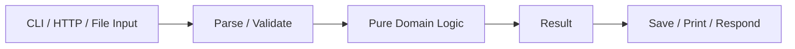
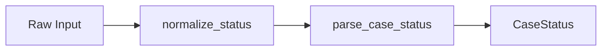

# Part 008 — Functions as Design Units

## 1. Tujuan Part Ini

Function adalah unit desain paling penting dalam Python.

Di banyak bahasa enterprise, engineer sering langsung berpikir dalam class, interface, service, dan framework. Di Python, function sering menjadi abstraction paling murah, paling jelas, dan paling testable.

Part ini membahas function bukan hanya sebagai syntax:

```python
def do_something():
    ...
```

Tetapi sebagai alat desain:

- membatasi scope;
- memberi nama pada intent;
- memisahkan pure logic dari side effect;
- membuat code testable;
- mengurangi duplication;
- memperjelas dependency;
- menjadi boundary error;
- menyusun pipeline transformasi;
- mengontrol mutability contract;
- menjadi API internal.

Target setelah part ini:

1. Bisa mendesain function signature yang jelas.
2. Bisa memilih parameter style yang tepat.
3. Bisa membedakan pure dan impure function.
4. Bisa mengisolasi side effect.
5. Bisa membuat function mudah diuji.
6. Bisa menghindari parameter berlebihan.
7. Bisa memakai closure dan higher-order function secara wajar.
8. Bisa refactor procedural code menjadi function kecil.
9. Bisa menghubungkan function design ke mini project `case-tracker`.

---

## 2. Function sebagai Boundary

Function memberi boundary kecil.

```python
def normalize_status(status: str) -> str:
    return status.strip().upper()
```

Boundary ini punya:

- nama;
- input;
- output;
- contract;
- failure behavior;
- side effect atau tidak;
- type hints;
- test surface.

Function kecil yang bagus adalah “kalimat domain” yang bisa diuji.

Contoh:

```python
def can_transition(from_status: CaseStatus, to_status: CaseStatus) -> bool:
    return to_status in ALLOWED_TRANSITIONS[from_status]
```

Ini jauh lebih baik daripada menyebarkan expression ke banyak tempat:

```python
if target_status in ALLOWED_TRANSITIONS[case.status]:
    ...
```

Karena function memberi nama pada rule.

---

## 3. Anatomy of a Function

```python
def transition_case(case: Case, target_status: CaseStatus) -> Case:
    if target_status not in ALLOWED_TRANSITIONS[case.status]:
        raise InvalidCaseTransitionError(case.status, target_status)

    case.status = target_status
    return case
```

Bagian:

| Bagian | Contoh | Peran |
|---|---|---|
| Name | `transition_case` | Intent |
| Parameters | `case`, `target_status` | Input/dependency |
| Type hints | `Case`, `CaseStatus` | Static reasoning/documentation |
| Return type | `Case` | Output contract |
| Body | validation + mutation | Behavior |
| Error | `InvalidCaseTransitionError` | Failure contract |
| Side effect | mutates `case` | Mutability contract |

Pertanyaan review:

1. Apakah nama jelas?
2. Apakah parameter minimal?
3. Apakah function terlalu banyak tahu?
4. Apakah function mutate input?
5. Apakah return value jelas?
6. Apakah error behavior jelas?
7. Apakah bisa dites tanpa I/O?
8. Apakah type hints membantu?

---

## 4. Function Name adalah Design

Nama buruk menyembunyikan intent.

Buruk:

```python
def process(case):
    ...
```

Lebih baik:

```python
def submit_case(case: Case) -> None:
    ...
```

Lebih spesifik:

```python
def validate_case_can_be_submitted(case: Case) -> None:
    ...
```

Nama function harus menjawab:

- apa yang dilakukan?
- terhadap apa?
- apakah hanya validasi?
- apakah memutasi?
- apakah mengembalikan object baru?
- apakah side effect terjadi?

Contoh nama yang memberi sinyal mutability:

```python
def sort_cases_in_place(cases: list[Case]) -> None:
    cases.sort(key=lambda case: case.id)


def sorted_cases(cases: list[Case]) -> list[Case]:
    return sorted(cases, key=lambda case: case.id)
```

---

## 5. Parameter Basics

### 5.1 Positional Parameter

```python
def describe_case(case_id: str, status: CaseStatus) -> str:
    return f"{case_id} [{status.value}]"
```

Call:

```python
describe_case("CASE-001", CaseStatus.DRAFT)
```

Positional cocok jika urutan natural dan jumlah parameter sedikit.

### 5.2 Keyword Argument

```python
describe_case(case_id="CASE-001", status=CaseStatus.DRAFT)
```

Keyword membuat call-site lebih jelas, terutama jika parameter sejenis.

Buruk:

```python
schedule("CASE-001", True, False, True)
```

Lebih baik:

```python
schedule(
    case_id="CASE-001",
    notify_reviewer=True,
    require_approval=False,
    create_audit_event=True,
)
```

Jika boolean banyak, pertimbangkan object/config/command.

---

## 6. Default Parameter

Default parameter baik untuk opsi yang benar-benar default.

```python
def create_case(title: str, status: CaseStatus = CaseStatus.DRAFT) -> Case:
    ...
```

Namun hati-hati dengan mutable default:

```python
def create_case(title: str, notes: list[str] = []) -> Case:
    ...
```

Gunakan:

```python
def create_case(title: str, notes: list[str] | None = None) -> Case:
    if notes is None:
        notes = []

    ...
```

### 6.1 Default Harus Stabil

Default sebaiknya tidak mengejutkan.

Buruk:

```python
def create_report(created_at=datetime.now()):
    ...
```

`datetime.now()` dievaluasi saat function didefinisikan, bukan tiap call.

Lebih baik:

```python
from datetime import datetime, UTC


def create_report(created_at: datetime | None = None):
    if created_at is None:
        created_at = datetime.now(UTC)

    ...
```

---

## 7. Keyword-Only Parameter

Keyword-only parameter memaksa caller menyebut nama argument.

```python
def create_case(
    title: str,
    *,
    priority: CasePriority = CasePriority.MEDIUM,
    assigned_to: str | None = None,
) -> Case:
    ...
```

Call:

```python
create_case(
    "Late reporting",
    priority=CasePriority.HIGH,
    assigned_to="reviewer-1",
)
```

Tidak bisa:

```python
create_case("Late reporting", CasePriority.HIGH, "reviewer-1")
```

Manfaat:

- call-site lebih jelas;
- menghindari salah urutan;
- cocok untuk optional/config parameters;
- bagus untuk public API.

Rule:

> Jika parameter optional lebih dari satu, pertimbangkan keyword-only.

---

## 8. Positional-Only Parameter

Python mendukung positional-only parameter dengan `/`.

```python
def parse_case_id(raw, /) -> str:
    return raw.strip().upper()
```

Caller tidak bisa:

```python
parse_case_id(raw="CASE-001")
```

Fitur ini lebih sering berguna untuk API/library design atau compatibility dengan built-ins. Untuk project awal, jarang perlu.

Namun kamu perlu mengenali syntax ini saat membaca kode:

```python
def func(pos_only, /, normal, *, keyword_only):
    ...
```

---

## 9. Variadic Parameters: `*args` dan `**kwargs`

### 9.1 `*args`

```python
def combine_case_ids(*case_ids: str) -> str:
    return ", ".join(case_ids)
```

Call:

```python
combine_case_ids("CASE-001", "CASE-002")
```

### 9.2 `**kwargs`

```python
def build_case_metadata(**metadata: str) -> dict[str, str]:
    return dict(metadata)
```

Call:

```python
build_case_metadata(source="email", channel="manual")
```

### 9.3 Jangan Overuse

Buruk:

```python
def create_case(*args, **kwargs):
    ...
```

Masalah:

- contract tidak jelas;
- type checker sulit membantu;
- caller tidak tahu parameter valid;
- refactor risk tinggi.

Gunakan `*args`/`**kwargs` jika memang function meneruskan argument atau membangun API fleksibel yang jelas.

---

## 10. Return Value

Function harus punya return contract yang jelas.

### 10.1 Return Value Normal

```python
def normalize_title(title: str) -> str:
    return title.strip()
```

### 10.2 Return `None` untuk Side Effect

```python
def add_note_in_place(case: Case, note: str) -> None:
    case.notes.append(note)
```

Jika function mutates in-place, return `None` sering lebih jelas.

### 10.3 Avoid Ambiguous Return

Buruk:

```python
def find_case(case_id: str):
    ...
```

Apakah return `Case`? `None`? Raise error?

Lebih jelas:

```python
def find_case(cases: list[Case], case_id: str) -> Case | None:
    ...
```

Atau:

```python
def get_case(cases: list[Case], case_id: str) -> Case:
    ...
```

Konvensi:

- `find_...` sering boleh return `None`;
- `get_...` sering raise jika tidak ada;
- tetapi ini harus konsisten di codebase.

---

## 11. Returning Multiple Values

Gunakan tuple unpacking.

```python
def parse_case_reference(reference: str) -> tuple[str, str]:
    tenant_id, case_id = reference.split(":", maxsplit=1)
    return tenant_id, case_id


tenant_id, case_id = parse_case_reference("tenant-1:CASE-001")
```

Untuk return yang lebih kompleks, pakai dataclass.

Kurang baik:

```python
def analyze_case(case: Case) -> tuple[bool, bool, str, int]:
    ...
```

Lebih baik:

```python
@dataclass(frozen=True)
class CaseAnalysis:
    is_actionable: bool
    requires_escalation: bool
    reason: str
    risk_score: int
```

Return:

```python
def analyze_case(case: Case) -> CaseAnalysis:
    ...
```

Rule:

> Tuple bagus untuk 2–3 value yang jelas. Lebih dari itu, buat object bernama.

---

## 12. Pure Function vs Impure Function

### 12.1 Pure Function

Pure function:

- output hanya bergantung pada input;
- tidak punya side effect;
- tidak mutate input;
- mudah dites;
- mudah direasoning.

Contoh:

```python
def can_transition(from_status: CaseStatus, to_status: CaseStatus) -> bool:
    return to_status in ALLOWED_TRANSITIONS[from_status]
```

### 12.2 Impure Function

Impure function punya side effect atau bergantung pada external state.

Contoh:

```python
def save_cases(path: Path, cases: list[Case]) -> None:
    path.write_text(...)
```

Side effect:

- file system write.

Impure function tidak buruk. Program nyata butuh side effect.

Yang penting:

> Isolasi side effect di boundary. Jaga domain logic sebanyak mungkin pure.

---

## 13. Side Effects

Side effect umum:

- print;
- logging;
- file read/write;
- database call;
- network call;
- mutation input;
- global state update;
- current time;
- random number;
- environment variable;
- process exit.

Contoh function sulit dites:

```python
def create_case_from_input() -> None:
    title = input("Title: ")
    case = create_case(title)
    print(case.id)
```

Masalah:

- membaca input;
- membuat domain object;
- print output;
- tidak return data;
- sulit dites tanpa monkeypatch.

Refactor:

```python
def create_case_from_title(title: str) -> Case:
    return create_case(title)


def main() -> int:
    title = input("Title: ")
    case = create_case_from_title(title)
    print(case.id)
    return 0
```

Sekarang domain/use case bisa dites tanpa CLI.

---

## 14. Function Design Rule: Pure Core, Imperative Shell

Pola penting:

```text
impure boundary -> pure core -> impure boundary
```

Diagram:



Contoh:

```python
def normalize_status(raw_status: str) -> str:
    return raw_status.strip().upper()


def parse_case_status(raw_status: str) -> CaseStatus:
    return CaseStatus(normalize_status(raw_status))


def main() -> int:
    raw_status = input("Status: ")
    status = parse_case_status(raw_status)
    print(status.value)
    return 0
```

`main()` impure. `normalize_status()` pure. `parse_case_status()` mostly pure kecuali raises exception.

Semakin banyak logic dipindahkan ke pure function, semakin mudah test.

---

## 15. Error Boundary dalam Function

Function harus jelas apakah error dikembalikan atau di-raise.

Python idiom umumnya memakai exception untuk failure yang tidak bisa diproses di level tersebut.

Contoh:

```python
def parse_case_status(raw_status: str) -> CaseStatus:
    normalized = raw_status.strip().upper()

    try:
        return CaseStatus(normalized)
    except ValueError as error:
        allowed = ", ".join(status.value for status in CaseStatus)
        raise ValueError(f"Invalid status: {raw_status}. Allowed statuses: {allowed}") from error
```

Function ini:

- input: raw string;
- output: `CaseStatus`;
- failure: `ValueError` dengan message jelas;
- tidak print;
- tidak exit;
- tidak return `None`.

CLI layer nanti menangkap error dan print.

### 15.1 Jangan Campur Error Strategy

Buruk:

```python
def parse_case_status(raw_status: str) -> CaseStatus | None:
    try:
        return CaseStatus(raw_status)
    except ValueError:
        print("Invalid")
        return None
```

Masalah:

- parse function print;
- caller harus cek `None`;
- error detail hilang;
- sulit dipakai di API/worker/test.

---

## 16. Function Length

Tidak ada angka sakral. Tetapi function yang terlalu panjang biasanya punya beberapa tanggung jawab.

Smell:

- banyak indentation;
- banyak local variables yang tidak berkaitan;
- membaca input dan menulis file dan validasi domain;
- test harus setup banyak hal;
- nama function umum seperti `process`;
- lebih dari satu level abstraction bercampur.

Contoh buruk:

```python
def handle_transition_command(args):
    path = Path("cases.json")
    raw = path.read_text()
    data = json.loads(raw)
    for item in data:
        if item["id"] == args.case_id:
            if args.status not in ["DRAFT", "SUBMITTED"]:
                print("invalid")
                return 1
            item["status"] = args.status
            path.write_text(json.dumps(data))
            print("ok")
            return 0
    print("not found")
    return 1
```

Refactor ke function:

- `load_cases`;
- `parse_case_status`;
- `transition_case`;
- `save_cases`;
- `render_error`.

---

## 17. Parameter Count

Banyak parameter sering tanda abstraction belum tepat.

Buruk:

```python
def create_case(
    case_id: str,
    title: str,
    status: str,
    priority: str,
    assigned_to: str | None,
    source: str,
    created_by: str,
    created_at: datetime,
    tags: list[str],
) -> Case:
    ...
```

Pertimbangkan command object:

```python
@dataclass(frozen=True)
class CreateCaseCommand:
    title: str
    priority: CasePriority
    assigned_to: str | None
    source: str
    created_by: str
    tags: tuple[str, ...]
```

Function:

```python
def create_case(command: CreateCaseCommand, clock: Clock) -> Case:
    ...
```

Rule awal:

- 0–3 parameter: biasanya OK;
- 4–5 parameter: cek readability;
- lebih dari 5: pertimbangkan object;
- banyak boolean: hampir selalu smell.

---

## 18. Boolean Parameter Smell

Buruk:

```python
def close_case(case: Case, notify: bool, force: bool, audit: bool) -> None:
    ...
```

Call-site tidak jelas:

```python
close_case(case, True, False, True)
```

Lebih baik keyword-only:

```python
def close_case(
    case: Case,
    *,
    notify: bool,
    force: bool,
    create_audit_event: bool,
) -> None:
    ...
```

Call-site:

```python
close_case(
    case,
    notify=True,
    force=False,
    create_audit_event=True,
)
```

Lebih baik lagi jika boolean mewakili mode kompleks:

```python
class CloseMode(Enum):
    NORMAL = "NORMAL"
    FORCE = "FORCE"
```

Atau pisah function:

```python
def close_case(case: Case) -> None:
    ...


def force_close_case(case: Case, reason: str) -> None:
    ...
```

---

## 19. Dependency Injection via Parameters

Python sering tidak butuh DI framework. Function parameter cukup.

Buruk:

```python
GLOBAL_REPOSITORY = JsonCaseRepository(Path("cases.json"))


def close_case(case_id: str) -> None:
    case = GLOBAL_REPOSITORY.get(case_id)
    ...
```

Lebih testable:

```python
def close_case(case_id: str, repository: CaseRepository) -> Case:
    case = repository.get(case_id)
    case.transition_to(CaseStatus.CLOSED)
    repository.save(case)
    return case
```

Dependency terlihat di signature.

Untuk mini project:

```python
def transition_case(path: Path, case_id: str, target_status: CaseStatus) -> Case:
    cases = load_cases(path)
    ...
```

`path` sebagai dependency sederhana. Nanti bisa diganti repository object.

---

## 20. Local Scope dan Global State

Function punya local scope.

```python
status = "DRAFT"


def submit() -> None:
    status = "SUBMITTED"
```

Function di atas membuat local `status`, tidak mengubah global.

Untuk mengubah global perlu `global`, tetapi hindari untuk application logic.

```python
status = "DRAFT"


def submit() -> None:
    global status
    status = "SUBMITTED"
```

Global mutable state membuat test dan concurrency lebih sulit.

Lebih baik pass state sebagai parameter atau simpan dalam object dengan boundary jelas.

---

## 21. Closure

Closure terjadi ketika inner function menangkap variable dari outer function.

```python
def make_status_checker(allowed_statuses: set[CaseStatus]):
    def is_allowed(status: CaseStatus) -> bool:
        return status in allowed_statuses

    return is_allowed
```

Pakai:

```python
is_actionable = make_status_checker(
    {CaseStatus.SUBMITTED, CaseStatus.UNDER_REVIEW, CaseStatus.ESCALATED}
)

print(is_actionable(CaseStatus.DRAFT))
```

Closure berguna untuk:

- membuat specialized function;
- dependency ringan;
- callback;
- decorators;
- partial application.

Namun jangan overuse. Jika closure menyembunyikan state kompleks, class mungkin lebih jelas.

---

## 22. Late Binding Closure Trap

Jebakan umum:

```python
checkers = []

for status in CaseStatus:
    checkers.append(lambda case: case.status is status)
```

Semua lambda bisa mengacu ke variable `status` yang sama setelah loop selesai.

Perbaikan dengan default argument:

```python
checkers = []

for status in CaseStatus:
    checkers.append(lambda case, expected=status: case.status is expected)
```

Atau lebih jelas:

```python
def make_checker(expected_status: CaseStatus):
    def checker(case: Case) -> bool:
        return case.status is expected_status

    return checker


checkers = [make_checker(status) for status in CaseStatus]
```

Untuk awal, hindari lambda/closure kompleks dalam loop.

---

## 23. Higher-Order Function

Function adalah object. Bisa dikirim sebagai parameter.

```python
def filter_cases(cases: list[Case], predicate) -> list[Case]:
    return [case for case in cases if predicate(case)]
```

Pakai:

```python
def is_open(case: Case) -> bool:
    return case.status is not CaseStatus.CLOSED


open_cases = filter_cases(cases, is_open)
```

Dengan type hints:

```python
from collections.abc import Callable


def filter_cases(
    cases: list[Case],
    predicate: Callable[[Case], bool],
) -> list[Case]:
    return [case for case in cases if predicate(case)]
```

Higher-order function berguna untuk:

- filtering;
- sorting key;
- callbacks;
- strategy injection;
- validation pipelines.

Namun jangan membuat kode terlalu abstract jika hanya ada satu use case.

---

## 24. Lambda

Lambda adalah anonymous function expression.

```python
sorted_cases = sorted(cases, key=lambda case: case.id)
```

Bagus untuk function kecil satu expression, terutama key function.

Buruk:

```python
rule = lambda c: c.status in allowed and not c.deleted and user.can_view(c)
```

Lebih baik:

```python
def is_visible_actionable_case(case: Case, user: User) -> bool:
    return case.status in ACTIONABLE_STATUSES and not case.deleted and user.can_view(case)
```

Rule:

> Lambda boleh untuk glue kecil. Domain rule penting sebaiknya punya nama.

---

## 25. Composition

Function composition berarti output satu function menjadi input function lain.

```python
def normalize_status(raw_status: str) -> str:
    return raw_status.strip().upper()


def parse_case_status(raw_status: str) -> CaseStatus:
    return CaseStatus(normalize_status(raw_status))
```

Pipeline sederhana:

```python
raw_status -> normalize_status -> CaseStatus
```

Diagram:



Composition baik jika setiap function:

- kecil;
- punya contract jelas;
- tidak side effect tersembunyi;
- error behavior jelas.

---

## 26. Refactoring Procedural Code

Kode awal:

```python
import json
from pathlib import Path

path = Path("cases.json")
data = json.loads(path.read_text(encoding="utf-8"))

case_id = input("Case ID: ")
target_status = input("Target status: ").strip().upper()

for case in data:
    if case["id"] == case_id:
        if target_status not in {"SUBMITTED", "UNDER_REVIEW", "ESCALATED", "CLOSED"}:
            print("Invalid status")
        else:
            case["status"] = target_status
            path.write_text(json.dumps(data, indent=2), encoding="utf-8")
            print("Updated")
        break
else:
    print("Not found")
```

Masalah:

- I/O bercampur domain;
- raw dict everywhere;
- validation tidak reusable;
- error handling minim;
- sulit dites;
- allowed status tidak mempertimbangkan current status;
- top-level side effects.

Refactor target:

```python
def load_raw_cases(path: Path) -> list[dict]:
    ...


def save_raw_cases(path: Path, cases: list[dict]) -> None:
    ...


def parse_case_status(raw_status: str) -> CaseStatus:
    ...


def find_case_data(cases: list[dict], case_id: str) -> dict:
    ...


def transition_case_data(case: dict, target_status: CaseStatus) -> None:
    ...


def main() -> int:
    ...
```

Lebih baik lagi: gunakan domain model seperti part 005.

---

## 27. Case Tracker Function Review

Dari part 005:

```python
def transition_case(path: Path, case_id: str, target_status: CaseStatus) -> Case:
    cases = load_cases(path)

    for case in cases:
        if case.id == case_id:
            case.transition_to(target_status)
            save_cases(path, cases)
            return case

    raise CaseNotFoundError(case_id)
```

Review:

| Aspek | Analisis |
|---|---|
| Nama | Jelas: transition case |
| Input | path, id, target status |
| Output | updated Case |
| Side effect | read/write file |
| Error | case not found, invalid transition |
| Testability | bisa dites dengan `tmp_path` |
| Concern | search logic bisa diekstrak |
| Concern | storage dependency masih berupa file path |

Refactor kecil:

```python
def find_case_in_list(cases: list[Case], case_id: str) -> Case:
    for case in cases:
        if case.id == case_id:
            return case

    raise CaseNotFoundError(case_id)
```

Service:

```python
def transition_case(path: Path, case_id: str, target_status: CaseStatus) -> Case:
    cases = load_cases(path)
    case = find_case_in_list(cases, case_id)

    case.transition_to(target_status)
    save_cases(path, cases)
    return case
```

Manfaat:

- search rule reusable;
- transition_case lebih pendek;
- failure behavior terpusat;
- function baru bisa dites tanpa file.

---

## 28. Avoiding Over-Fragmentation

Function kecil bagus. Tetapi terlalu banyak function kecil tanpa intent jelas juga buruk.

Buruk:

```python
def get_a(case):
    return case.id


def get_b(case):
    return case.status


def do_x(case):
    return get_a(case) + str(get_b(case))
```

Function extraction harus memberi nama pada konsep, bukan memecah baris secara mekanis.

Ekstrak function jika:

- logic punya nama domain;
- logic digunakan lebih dari sekali;
- logic perlu dites sendiri;
- function saat ini terlalu banyak level abstraction;
- failure behavior perlu dipisah;
- side effect perlu diisolasi.

Jangan ekstrak jika hanya membuat pembaca melompat-lompat tanpa alasan.

---

## 29. Command Function Pattern

Untuk application use case, pattern command function sering berguna.

```python
@dataclass(frozen=True)
class TransitionCaseCommand:
    case_id: str
    target_status: CaseStatus


def handle_transition_case(path: Path, command: TransitionCaseCommand) -> Case:
    return transition_case(
        path=path,
        case_id=command.case_id,
        target_status=command.target_status,
    )
```

Untuk mini project, ini mungkin terlalu formal. Tetapi untuk sistem besar, command object membantu:

- validation;
- logging;
- audit;
- serialization;
- queue message;
- API input mapping;
- versioning.

Rule:

> Jangan mulai dari command object untuk semua hal. Tambahkan saat parameter dan use case mulai kompleks.

---

## 30. Function as Policy

Domain policy bisa berupa function.

```python
def requires_escalation(case: Case) -> bool:
    return case.status is CaseStatus.UNDER_REVIEW and "critical" in case.title.lower()
```

Policy function bagus karena:

- mudah dites;
- bisa dikombinasikan;
- tidak perlu class jika tidak ada state;
- intent jelas.

Jika policy butuh dependency:

```python
def requires_escalation(case: Case, risk_threshold: int) -> bool:
    return case.risk_score >= risk_threshold
```

Jika policy punya banyak config/state, class mungkin lebih cocok.

---

## 31. Function vs Class

Gunakan function jika:

- behavior stateless;
- input/output jelas;
- tidak perlu menyimpan dependency;
- tidak perlu polymorphism;
- tidak ada lifecycle.

Gunakan class jika:

- ada state/invariant;
- ada beberapa method berbagi state;
- dependency perlu disimpan;
- object merepresentasikan domain entity/value;
- perlu protocol/interface;
- lifecycle penting.

Contoh function cukup:

```python
def can_transition(from_status: CaseStatus, to_status: CaseStatus) -> bool:
    ...
```

Contoh class masuk akal:

```python
class JsonCaseRepository:
    def __init__(self, path: Path) -> None:
        self._path = path

    def list(self) -> list[Case]:
        ...

    def save_all(self, cases: list[Case]) -> None:
        ...
```

Jangan membuat class hanya karena terbiasa dari Java/C#.

---

## 32. Testing Functions

Pure function test sangat sederhana.

```python
def test_normalize_status():
    assert normalize_status(" draft ") == "DRAFT"
```

Function dengan error:

```python
def test_parse_case_status_rejects_invalid_status():
    with pytest.raises(ValueError, match="Invalid status"):
        parse_case_status("waiting")
```

Function dengan side effect file:

```python
def test_save_and_load_cases(tmp_path):
    path = tmp_path / "cases.json"
    ...
```

Function dengan dependency:

```python
class FakeRepository:
    ...


def test_close_case():
    ...
```

Rule:

> Jika function sulit dites, periksa side effect, global state, parameter, dan boundary.

---

## 33. Function Documentation

Untuk internal function yang jelas, nama + type hints sering cukup.

```python
def normalize_status(status: str) -> str:
    return status.strip().upper()
```

Docstring berguna jika:

- public API;
- behavior tidak obvious;
- error contract penting;
- parameter punya constraint;
- ada domain nuance;
- function dipakai banyak tim;
- performance/security caveat.

Contoh:

```python
def transition_case(path: Path, case_id: str, target_status: CaseStatus) -> Case:
    """Transition a case and persist the updated case list.

    Raises:
        CaseNotFoundError: If no case exists with the given id.
        InvalidCaseTransitionError: If the transition violates workflow rules.
    """
    ...
```

Jangan tulis docstring yang hanya mengulang nama.

Buruk:

```python
def normalize_status(status: str) -> str:
    """Normalize status."""
```

---

## 34. Function API Stability

Jika function dipakai di banyak tempat, signature menjadi contract.

Perubahan ini breaking:

```python
def create_case(title: str) -> Case:
    ...
```

Menjadi:

```python
def create_case(title: str, priority: CasePriority) -> Case:
    ...
```

Karena semua caller harus update.

Lebih compatible:

```python
def create_case(
    title: str,
    *,
    priority: CasePriority = CasePriority.MEDIUM,
) -> Case:
    ...
```

Keyword-only default membuat penambahan parameter lebih aman.

Untuk internal function kecil, stabilitas tidak terlalu berat. Untuk public library/API, pikirkan compatibility.

---

## 35. Idempotency

Function idempotent memberi hasil sama jika dipanggil beberapa kali dengan input/state sama.

Pure function biasanya idempotent.

```python
normalize_status(" draft ")
```

Selalu `"DRAFT"`.

Side effect function bisa idempotent atau tidak.

Non-idempotent:

```python
def add_note(case: Case, note: str) -> None:
    case.notes.append(note)
```

Dipanggil dua kali, note double.

Idempotent-ish:

```python
def add_tag(case: Case, tag: str) -> None:
    case.tags.add(tag)
```

Set mencegah duplicate.

Dalam workflow/regulatory system, idempotency penting untuk retry, messaging, dan distributed systems. Untuk Python function design, tanyakan:

- Apakah aman dipanggil ulang?
- Jika tidak, apakah caller tahu?
- Apakah perlu idempotency key?
- Apakah side effect terjadi setelah semua validation?

---

## 36. Order of Validation and Side Effects

Rule penting:

> Validate before side effect.

Buruk:

```python
def transition_case(path: Path, case_id: str, target_status: CaseStatus) -> Case:
    cases = load_cases(path)
    save_audit_event("transition requested")

    case = find_case_in_list(cases, case_id)
    case.transition_to(target_status)
    save_cases(path, cases)
    return case
```

Jika transition invalid, audit “requested” mungkin masih acceptable, tetapi harus sengaja.

Jika side effect bukan audit, lebih berbahaya:

```python
send_notification()
case.transition_to(target_status)
```

Jika transition gagal, notification sudah terkirim.

Lebih aman:

```python
case.transition_to(target_status)
save_cases(path, cases)
send_notification()
```

Tetapi jika notification gagal setelah save, kamu punya partial failure. Ini akan dibahas di production/failure modelling. Di function design awal, minimal sadari urutan side effect.

---

## 37. Case Tracker Refactor: Pure Transition Check

Tambahkan ke `domain.py`:

```python
def can_transition(from_status: CaseStatus, to_status: CaseStatus) -> bool:
    return to_status in ALLOWED_TRANSITIONS[from_status]
```

Ubah method:

```python
def transition_to(self, target_status: CaseStatus) -> None:
    if not can_transition(self.status, target_status):
        raise InvalidCaseTransitionError(self.status, target_status)

    self.status = target_status
```

Test pure function:

```python
def test_can_transition_from_draft_to_submitted():
    assert can_transition(CaseStatus.DRAFT, CaseStatus.SUBMITTED)


def test_cannot_transition_from_draft_to_closed():
    assert not can_transition(CaseStatus.DRAFT, CaseStatus.CLOSED)
```

Manfaat:

- rule bisa ditest tanpa entity;
- method lebih jelas;
- policy function reusable.

---

## 38. Case Tracker Refactor: Parse Status Function

Tambahkan ke `cli.py` atau module parsing:

```python
def parse_case_status(raw_status: str) -> CaseStatus:
    normalized_status = raw_status.strip().upper()

    try:
        return CaseStatus(normalized_status)
    except ValueError as error:
        allowed = ", ".join(status.value for status in CaseStatus)
        raise ValueError(f"Invalid status: {raw_status}. Allowed statuses: {allowed}") from error
```

Test:

```python
import pytest

from case_tracker.cli import parse_case_status
from case_tracker.domain import CaseStatus


def test_parse_case_status_normalizes_input():
    assert parse_case_status(" submitted ") is CaseStatus.SUBMITTED


def test_parse_case_status_rejects_invalid_status():
    with pytest.raises(ValueError, match="Allowed statuses"):
        parse_case_status("waiting")
```

Manfaat:

- parsing dipisah dari `main`;
- error message teruji;
- CLI lebih pendek;
- input normalization konsisten.

---

## 39. Practice: Extract Function

Kode awal:

```python
for case in cases:
    if case.status in {CaseStatus.SUBMITTED, CaseStatus.UNDER_REVIEW}:
        if not case.notes:
            print(case.id)
```

Refactor:

```python
REQUIRES_NOTE_STATUSES = {CaseStatus.SUBMITTED, CaseStatus.UNDER_REVIEW}


def requires_note(case: Case) -> bool:
    return case.status in REQUIRES_NOTE_STATUSES and not case.notes


case_ids_requiring_note = [case.id for case in cases if requires_note(case)]
```

Pertanyaan:

1. Apa nama rule domainnya?
2. Apakah function pure?
3. Apakah mudah dites?
4. Apakah set status sebaiknya constant?
5. Apakah empty notes berarti problem domain valid?

---

## 40. Practice: Design Signature

Desain function untuk kebutuhan:

> Assign case ke reviewer. Case hanya boleh di-assign jika status `SUBMITTED` atau `UNDER_REVIEW`. Reviewer tidak boleh empty.

Versi awal:

```python
def assign_case(case: Case, reviewer: str) -> None:
    ...
```

Pertanyaan:

1. Apakah function mutate case?
2. Apa error jika status tidak assignable?
3. Apa error jika reviewer empty?
4. Apakah return `None` cukup?
5. Apakah reviewer harus value object?

Implementasi awal:

```python
ASSIGNABLE_STATUSES = {CaseStatus.SUBMITTED, CaseStatus.UNDER_REVIEW}


class CaseNotAssignableError(Exception):
    pass


def assign_case(case: Case, reviewer: str) -> None:
    normalized_reviewer = reviewer.strip()

    if not normalized_reviewer:
        raise ValueError("Reviewer cannot be empty")

    if case.status not in ASSIGNABLE_STATUSES:
        raise CaseNotAssignableError(f"Cannot assign case in status {case.status.value}")

    case.assigned_to = normalized_reviewer
```

Review:

- Mutating API.
- Error jelas.
- Side effect hanya mutation object.
- Belum ada persistence.
- Mudah dites.

---

## 41. Practice: Pure Core, Imperative Shell

Kode buruk:

```python
def run():
    title = input("Title: ")
    if not title.strip():
        print("Invalid title")
        return
    print(title.strip())
```

Refactor:

```python
def normalize_title(title: str) -> str:
    normalized = title.strip()

    if not normalized:
        raise ValueError("Title cannot be empty")

    return normalized


def run() -> int:
    title = input("Title: ")

    try:
        normalized_title = normalize_title(title)
    except ValueError as error:
        print(error)
        return 1

    print(normalized_title)
    return 0
```

Test `normalize_title()`.

---

## 42. Practice: Replace Boolean Parameter

Kode awal:

```python
def close_case(case: Case, force: bool) -> None:
    if force:
        case.status = CaseStatus.CLOSED
    else:
        case.transition_to(CaseStatus.CLOSED)
```

Masalah:

- `force=True` melewati invariant;
- call-site kurang jelas;
- dua behavior berbeda dalam satu function.

Refactor:

```python
def close_case(case: Case) -> None:
    case.transition_to(CaseStatus.CLOSED)


def force_close_case(case: Case, reason: str) -> None:
    if not reason.strip():
        raise ValueError("Force close reason is required")

    case.status = CaseStatus.CLOSED
    case.add_note(f"Force closed: {reason.strip()}")
```

Sekarang behavior berbeda punya nama berbeda.

---

## 43. Self-Check

Jawab tanpa melihat materi:

1. Kenapa function adalah unit desain penting di Python?
2. Apa yang harus terlihat dari function signature?
3. Kapan positional argument cukup?
4. Kapan keyword-only parameter lebih baik?
5. Kenapa mutable default berbahaya?
6. Apa beda pure dan impure function?
7. Apa contoh side effect?
8. Apa pola pure core, imperative shell?
9. Kenapa function parsing tidak sebaiknya print error?
10. Apa risiko banyak boolean parameter?
11. Kapan return tuple cukup?
12. Kapan return dataclass lebih baik?
13. Apa closure?
14. Apa late binding trap?
15. Kapan lambda acceptable?
16. Apa tanda function terlalu panjang?
17. Kapan membuat class daripada function?
18. Kenapa dependency via parameter sering cukup?
19. Apa maksud validate before side effect?
20. Apa contoh function idempotent dan non-idempotent?

---

## 44. Definition of Done Part 008

Kamu selesai part ini jika bisa:

1. Mendesain 5 function signature yang jelas.
2. Menjelaskan pure vs impure function.
3. Menulis keyword-only parameter.
4. Menghindari mutable default argument.
5. Menulis function parsing dengan error jelas.
6. Memisahkan domain logic dari CLI I/O.
7. Menulis function `can_transition`.
8. Menulis function `parse_case_status`.
9. Menulis test untuk pure function.
10. Refactor procedural code menjadi beberapa function.
11. Mengganti boolean parameter dengan function/enum lebih jelas.
12. Menjelaskan kapan memakai lambda.
13. Menjelaskan kapan memakai closure.
14. Menjelaskan kapan function lebih baik daripada class.
15. Menjelaskan side effect dan urutan validation.

---

## 45. Ringkasan

Function di Python bukan sekadar cara menghindari copy-paste. Function adalah unit desain.

Inti part ini:

- nama function adalah design;
- signature adalah contract;
- parameter harus minimal dan jelas;
- keyword-only membantu readability;
- return value harus tidak ambigu;
- pure function mudah dites dan direasoning;
- side effect harus diisolasi;
- dependency bisa diinjeksi lewat parameter;
- closure dan higher-order function berguna tetapi jangan overuse;
- lambda cocok untuk glue kecil, bukan domain rule penting;
- function panjang biasanya mencampur abstraction level;
- boolean parameter sering smell;
- validate sebelum side effect;
- function vs class adalah keputusan berdasarkan state, lifecycle, dan invariant.

Part berikutnya akan membahas module, package, imports, dan application boundaries. Setelah function sebagai unit desain kecil, kita akan belajar menyusun function dan object ke struktur project yang sehat.

---

## 46. Referensi

- Python Documentation — Defining Functions.
- Python Documentation — More Control Flow Tools.
- Python Documentation — Data Model.
- Python Documentation — Built-in Functions.
- Python Documentation — `typing`.
- Python Documentation — `collections.abc`.
- PEP 8 — Function and variable names.
