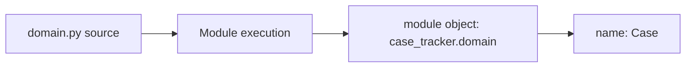
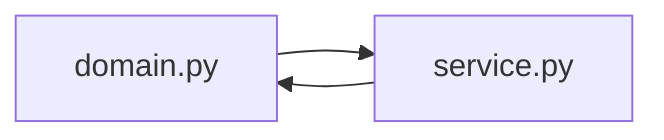
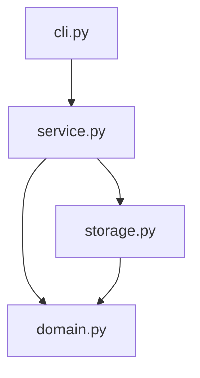
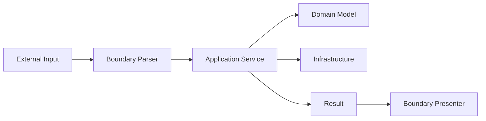
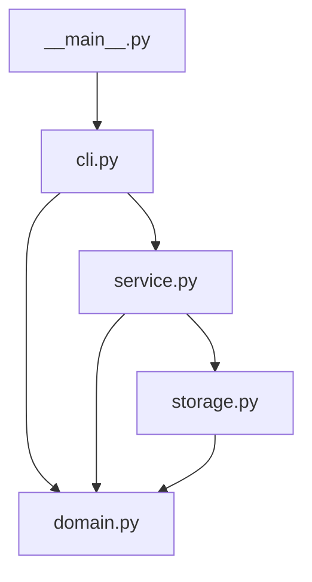
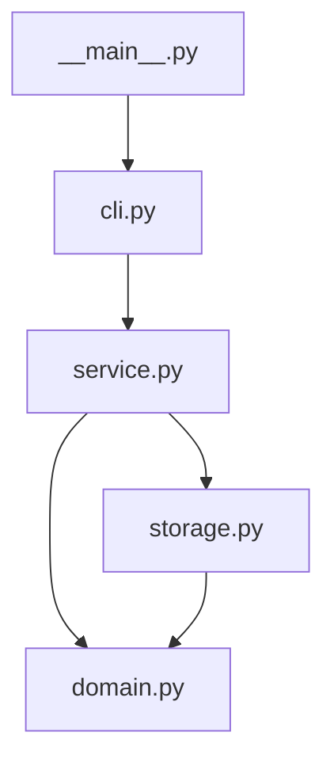

# Part 009 — Modules, Packages, Imports, dan Application Boundaries

## 1. Tujuan Part Ini

Setelah function, level desain berikutnya adalah module.

Banyak Python project gagal bukan karena syntax buruk, tetapi karena struktur module yang tidak punya arah:

- semua logic masuk `app.py`;
- import saling melingkar;
- domain layer import framework;
- file storage dipanggil langsung dari CLI;
- module punya side effect saat import;
- `sys.path` dimodifikasi sembarangan;
- test hanya jalan dari working directory tertentu;
- package tidak bisa dijalankan dengan konsisten;
- dependency direction tidak dijaga.

Part ini membahas cara menyusun Python code menjadi module dan package yang sehat.

Target setelah part ini:

1. Memahami module dan package.
2. Memahami `__init__.py`.
3. Memahami absolute import dan relative import.
4. Memahami `python -m`.
5. Menghindari import-time side effects.
6. Memahami circular import.
7. Mendesain import graph yang bersih.
8. Menyusun boundary aplikasi.
9. Menghubungkan struktur module ke mini project `case-tracker`.
10. Membaca import sebagai sinyal architecture.

---

## 2. Module: File Python sebagai Unit

Module adalah file Python yang bisa di-import.

Contoh:

```text
src/case_tracker/domain.py
```

Bisa di-import:

```python
from case_tracker.domain import Case
```

Saat module di-import, Python menjalankan top-level code di file itu satu kali, lalu menyimpan module object di cache import.

Contoh module:

```python
# domain.py
from dataclasses import dataclass


@dataclass
class Case:
    id: str
    title: str
```

Import:

```python
from case_tracker.domain import Case
```

Mental model:



Module bukan hanya “file”. Module adalah namespace runtime.

---

## 3. Package: Folder Module

Package adalah folder yang berisi module dan biasanya file `__init__.py`.

Contoh:

```text
src/
  case_tracker/
    __init__.py
    domain.py
    service.py
    storage.py
    cli.py
```

Import:

```python
import case_tracker
from case_tracker import domain
from case_tracker.domain import Case
```

`case_tracker` adalah package. `domain` adalah module di dalam package.

### 3.1 `__init__.py`

File `__init__.py` menandai package tradisional dan bisa berisi initialization code atau public exports.

Untuk awal, biarkan kosong:

```python
# src/case_tracker/__init__.py
```

Kenapa kosong?

Karena `__init__.py` yang terlalu aktif bisa membuat import package punya side effect.

Buruk:

```python
# __init__.py
from case_tracker.storage import load_cases
print("Loading case tracker package")
connect_to_database()
```

Import package harus ringan.

---

## 4. Module Namespace

Setiap module punya namespace sendiri.

```python
# a.py
value = 10
```

```python
# b.py
value = 20
```

Import:

```python
import a
import b

print(a.value)
print(b.value)
```

Nama `value` tidak bentrok karena berada di namespace module berbeda.

Ini alasan import module sering lebih jelas:

```python
import json

json.dumps(...)
```

Daripada membawa terlalu banyak nama ke local namespace.

---

## 5. Import Styles

### 5.1 Import Module

```python
import json

json.dumps({"id": "CASE-001"})
```

Kelebihan:

- asal nama jelas;
- namespace tidak penuh;
- cocok untuk standard library module.

### 5.2 Import Specific Name

```python
from pathlib import Path

path = Path("cases.json")
```

Kelebihan:

- call-site lebih ringkas;
- cocok untuk class/function yang sering dipakai;
- umum untuk `Path`, `dataclass`, `Enum`.

### 5.3 Alias Import

```python
import datetime as dt
```

Atau untuk library umum:

```python
import numpy as np
```

Gunakan alias jika idiom kuat atau nama terlalu panjang. Jangan membuat alias cryptic.

Buruk:

```python
import case_tracker.domain as d
```

Lebih baik:

```python
from case_tracker import domain
```

### 5.4 Wildcard Import

Hindari:

```python
from case_tracker.domain import *
```

Masalah:

- asal nama tidak jelas;
- static analysis lebih sulit;
- konflik nama mudah;
- reviewer harus menebak.

---

## 6. Absolute Import

Absolute import memakai path package penuh.

```python
from case_tracker.domain import Case
from case_tracker.storage import load_cases
```

Ini direkomendasikan untuk kebanyakan project application karena jelas dan stabil.

Dalam `service.py`:

```python
from case_tracker.domain import Case, CaseStatus
from case_tracker.storage import load_cases, save_cases
```

Kelebihan:

- import path eksplisit;
- mudah dicari;
- jelas layer mana dipakai;
- tidak bergantung pada lokasi relatif file.

---

## 7. Relative Import

Relative import memakai dot.

```python
from .domain import Case
from .storage import load_cases
```

Ini berarti:

- `.` current package;
- `..` parent package.

Contoh:

```text
case_tracker/
  application/
    service.py
  domain/
    model.py
```

Dari `application/service.py`:

```python
from ..domain.model import Case
```

Relative import bisa berguna dalam package besar, tetapi terlalu banyak `..` membuat struktur rapuh dan sulit dibaca.

Rule praktis:

- untuk aplikasi kecil/menengah, absolute import sering lebih jelas;
- relative import boleh untuk module yang sangat berdekatan;
- hindari relative import yang naik banyak level;
- jangan mencampur tanpa alasan.

---

## 8. Import Order

Konvensi umum:

1. Standard library.
2. Third-party.
3. Local application.

Contoh:

```python
import argparse
import json
from pathlib import Path

import pytest

from case_tracker.domain import Case, CaseStatus
from case_tracker.storage import load_cases
```

Ruff bisa membantu mengurutkan import.

Import order bukan hanya style. Import yang rapi membuat dependency terlihat.

---

## 9. `python file.py` vs `python -m package.module`

Ada perbedaan penting.

Menjalankan file langsung:

```bash
python src/case_tracker/cli.py
```

Sering bermasalah karena package context tidak sama. Import seperti:

```python
from case_tracker.domain import Case
```

bisa gagal jika `src` tidak ada di path.

Menjalankan module:

```bash
python -m case_tracker
```

atau:

```bash
python -m case_tracker.cli
```

Ini menjalankan module dalam package context.

Untuk package dengan `__main__.py`:

```text
src/case_tracker/__main__.py
```

Isi:

```python
from case_tracker.cli import main

raise SystemExit(main())
```

Jalankan:

```bash
python -m case_tracker
```

Rule:

> Untuk aplikasi package, biasakan menjalankan dengan `python -m package_name`.

---

## 10. `__name__ == "__main__"`

Pattern:

```python
def main() -> int:
    ...
    return 0


if __name__ == "__main__":
    raise SystemExit(main())
```

Jika file dijalankan langsung, `__name__` bernilai `"__main__"`.

Jika file di-import, `__name__` bernilai nama module, misalnya `"case_tracker.cli"`.

Manfaat:

- kode bisa di-import tanpa menjalankan program;
- test bisa import `main`;
- entry point jelas;
- side effect terkendali.

---

## 11. Import-Time Side Effects

Import menjalankan top-level code.

Contoh buruk:

```python
# report.py
from pathlib import Path

print("Generating report")
Path("report.txt").write_text("report", encoding="utf-8")
```

Jika module ini di-import, file langsung dibuat.

```python
import report
```

Ini berbahaya.

Top-level code sebaiknya hanya:

- import;
- constant definition;
- class/function definition;
- lightweight configuration;
- type alias.

Hindari top-level:

- membuka database connection;
- membaca file besar;
- menulis file;
- memanggil network;
- menjalankan CLI parsing;
- menjalankan job;
- membuat thread/process;
- membaca environment secara agresif tanpa alasan.

### 11.1 Refactor Side Effect

Buruk:

```python
# storage.py
DEFAULT_PATH = Path("cases.json")
CASES = load_cases(DEFAULT_PATH)
```

Lebih baik:

```python
DEFAULT_PATH = Path("cases.json")


def load_default_cases() -> list[Case]:
    return load_cases(DEFAULT_PATH)
```

Side effect dipindah ke function.

---

## 12. Import Cache

Python menyimpan module yang sudah di-import di `sys.modules`.

Artinya top-level module code biasanya dieksekusi sekali per process.

Contoh:

```python
# config.py
print("loading config")
VALUE = 10
```

Jika di-import dua kali:

```python
import config
import config
```

Print biasanya muncul sekali.

Konsekuensi:

- top-level state bisa menjadi singleton tidak disengaja;
- import order bisa memengaruhi behavior jika side effect ada;
- test bisa saling memengaruhi jika module global state dimutasi;
- reload module bukan workflow normal aplikasi.

Rule:

> Jangan memakai import cache sebagai lifecycle management aplikasi.

---

## 13. Circular Import

Circular import terjadi ketika module A import B, dan B import A.

Contoh:

```python
# domain.py
from case_tracker.service import create_new_case
```

```python
# service.py
from case_tracker.domain import Case
```

Import graph:



Ini sering menghasilkan error seperti:

```text
ImportError: cannot import name 'Case' from partially initialized module
```

### 13.1 Penyebab Umum Circular Import

- domain import service;
- low-level module import high-level module;
- constants tersebar di module yang saling membutuhkan;
- type hints membuat import runtime;
- `__init__.py` meng-import terlalu banyak;
- utility module menjadi dumping ground dan import balik.

### 13.2 Solusi Circular Import

1. Perbaiki dependency direction.
2. Pindahkan shared type/constant ke module lebih rendah.
3. Gunakan local import hanya sebagai solusi sementara.
4. Gunakan `typing.TYPE_CHECKING` untuk type-only import.
5. Pecah module yang terlalu besar.
6. Jangan membuat `__init__.py` meng-export semua hal jika menimbulkan cycle.

---

## 14. Dependency Direction

Architecture bisa dibaca dari import.

Untuk `case-tracker`:



Import direction:

```text
cli -> service -> domain
cli -> service -> storage -> domain
```

Yang tidak boleh:

```text
domain -> service
domain -> cli
storage -> cli
service -> cli
```

Domain harus menjadi layer paling stabil dan paling sedikit dependency.

### 14.1 Layer Rule

| Layer | Boleh Import | Tidak Boleh Import |
|---|---|---|
| Domain | standard library ringan | CLI, framework, storage |
| Storage | domain, standard library | CLI |
| Service | domain, storage | CLI |
| CLI | service, domain parsing | lower layer boleh dipanggil, tapi jangan domain rule diulang |

Rule:

> Higher-level boundary boleh depend pada lower-level domain, tetapi domain tidak boleh depend pada boundary.

---

## 15. Module Boundary Design

Module yang baik punya tanggung jawab jelas.

### 15.1 `domain.py`

Berisi:

- domain model;
- enum;
- domain error;
- pure domain rule;
- invariant.

Tidak berisi:

- print;
- argparse;
- JSON file read/write;
- HTTP exception;
- database session.

### 15.2 `storage.py`

Berisi:

- file path handling;
- JSON serialization/deserialization;
- load/save.

Tidak berisi:

- CLI parsing;
- transition rule;
- print;
- user message.

### 15.3 `service.py`

Berisi:

- use case orchestration;
- load data;
- call domain behavior;
- save data;
- service-level error.

Tidak berisi:

- argparse;
- raw terminal formatting;
- HTTP response details.

### 15.4 `cli.py`

Berisi:

- command parsing;
- mapping string input to domain type;
- calling service;
- printing result;
- exit code.

Tidak berisi:

- domain transition table;
- direct JSON mutation;
- business rule duplication.

---

## 16. Application Boundary

Application boundary adalah titik masuk/keluar sistem.

Contoh boundary:

- CLI;
- HTTP API;
- message consumer;
- scheduled job;
- test harness;
- script entry point.

Boundary tugasnya menerjemahkan dunia luar ke application use case.



Boundary tidak boleh menjadi tempat semua logic.

Untuk CLI:

```text
argv -> argparse -> parse domain types -> service call -> print/exit code
```

Untuk HTTP nanti:

```text
request -> schema validation -> service call -> response mapping
```

Domain dan service sebaiknya bisa dipakai oleh dua boundary tersebut tanpa copy-paste logic.

---

## 17. `__init__.py` sebagai Public API

Untuk package library, `__init__.py` bisa mengekspos public API:

```python
from case_tracker.domain import Case, CaseStatus

__all__ = ["Case", "CaseStatus"]
```

Lalu caller bisa:

```python
from case_tracker import Case, CaseStatus
```

Tetapi untuk aplikasi kecil, jangan buru-buru.

Risiko:

- import `case_tracker` menjadi berat;
- cycle mudah muncul;
- public API kabur;
- semua hal terlihat “resmi”.

Rule awal:

> Biarkan `__init__.py` kosong sampai ada kebutuhan public API yang jelas.

---

## 18. `__all__`

`__all__` mendefinisikan nama yang diekspor saat wildcard import.

```python
__all__ = ["Case", "CaseStatus"]
```

Karena kita menghindari wildcard import, `__all__` tidak terlalu penting di awal.

Namun untuk library, `__all__` bisa menjadi dokumentasi public surface.

Jangan gunakan `__all__` untuk menyembunyikan desain module yang berantakan. Public API harus didesain, bukan hanya difilter.

---

## 19. Module Granularity

Pertanyaan umum:

> Kapan memecah file?

Jangan terlalu cepat memecah module. Jangan juga menunggu sampai file 1000 baris.

Smell module terlalu besar:

- nama module umum seperti `utils.py`;
- banyak import tidak terkait;
- domain, storage, CLI bercampur;
- sulit menemukan function;
- test file menjadi sangat besar;
- circular import mulai muncul;
- perubahan kecil menyentuh banyak area.

Smell module terlalu kecil:

- file hanya wrapper tanpa konsep;
- terlalu banyak lompat file;
- nama module tidak bermakna;
- dependency graph lebih rumit dari problem;
- abstraction belum stabil.

Rule:

> Pecah module saat ada boundary konsep, bukan saat jumlah baris mencapai angka tertentu.

---

## 20. The Problem with `utils.py`

`utils.py` sering menjadi tempat sampah.

Contoh:

```text
utils.py
  normalize_status
  send_email
  parse_date
  save_json
  calculate_risk
  get_env
```

Masalah:

- cohesion rendah;
- dependency campur;
- mudah circular import;
- sulit tahu ownership;
- nama tidak membantu.

Lebih baik:

```text
parsing.py
json_storage.py
risk.py
time_utils.py
notifications.py
```

Atau jika hanya satu function dan konteks jelas, simpan di module domain/service terkait.

Rule:

> Jika module bernama `utils`, tanyakan “utility untuk konsep apa?”

---

## 21. `src` Layout dan Import Correctness

Struktur:

```text
case-tracker/
  src/
    case_tracker/
      domain.py
  tests/
    test_domain.py
```

Dengan `src` layout, import harus melalui package:

```python
from case_tracker.domain import Case
```

Bukan:

```python
from domain import Case
```

Manfaat:

- test menyerupai cara package dipakai;
- menghindari import dari current directory secara tidak sengaja;
- lebih dekat ke packaging/deployment real.

Jika import gagal, install editable:

```bash
python -m pip install -e .
```

Atau konfigurasi pytest:

```toml
[tool.pytest.ini_options]
pythonpath = ["src"]
```

Untuk project serius, editable install lebih representatif.

---

## 22. Avoiding `sys.path` Hacks

Buruk:

```python
import sys
sys.path.append("../src")
```

Masalah:

- environment-specific;
- fragile;
- menyembunyikan packaging issue;
- test bisa berbeda dari production;
- import order bisa kacau.

Solusi:

- gunakan package layout benar;
- install editable;
- gunakan `python -m`;
- konfigurasi tool dengan benar;
- jangan menjalankan file package langsung jika butuh package context.

---

## 23. Type-Only Imports dan `TYPE_CHECKING`

Kadang import hanya dibutuhkan untuk type hints, tetapi bisa membuat circular import.

Gunakan:

```python
from typing import TYPE_CHECKING

if TYPE_CHECKING:
    from case_tracker.service import CaseService
```

Lalu annotation dengan string atau future annotations.

```python
def register_service(service: "CaseService") -> None:
    ...
```

Dalam Python modern, kamu juga bisa memakai:

```python
from __future__ import annotations
```

agar annotation tidak selalu dievaluasi langsung.

Namun jangan jadikan ini alasan mempertahankan architecture yang circular. Ini solusi untuk type-only dependency, bukan obat desain buruk.

---

## 24. Import Cost

Import bisa punya cost.

Contoh:

- library besar;
- membaca config;
- initialization global;
- import framework;
- import data science stack;
- import module yang punya side effect.

Untuk CLI, startup time bisa penting. Untuk server, import time memengaruhi cold start.

Rule:

- top-level import standard library ringan OK;
- hindari top-level heavy initialization;
- lazy import boleh jika ada alasan performa atau optional dependency;
- jangan premature optimize import sebelum ada problem.

---

## 25. Naming Modules

Module name sebaiknya:

- lowercase;
- snake_case jika perlu;
- jelas konsepnya;
- tidak bentrok dengan standard library.

Baik:

```text
domain.py
storage.py
service.py
cli.py
case_status.py
repositories.py
```

Buruk:

```text
JSON.py
MyModule.py
stuff.py
helpers.py
test.py
logging.py
```

Hati-hati memberi nama module sama dengan standard library:

```text
json.py
typing.py
logging.py
email.py
```

Ini bisa shadow standard library dan membuat import membingungkan.

---

## 26. Application Factory Pattern

Untuk aplikasi lebih besar, boundary sering menggunakan factory.

Contoh konseptual:

```python
def create_app(config: AppConfig) -> Application:
    repository = JsonCaseRepository(config.store_path)
    service = CaseService(repository)
    return Application(service)
```

Untuk mini project, belum perlu. Tetapi pattern ini penting nanti untuk:

- FastAPI app;
- dependency wiring;
- testing;
- environment config;
- production startup.

Intinya:

> Wiring dependency sebaiknya terjadi di boundary, bukan tersebar di domain.

---

## 27. Case Tracker: Recommended Import Graph



File:

```text
__main__.py
```

```python
from case_tracker.cli import main

raise SystemExit(main())
```

`cli.py`:

```python
import argparse
from pathlib import Path

from case_tracker.domain import CaseStatus, InvalidCaseTransitionError
from case_tracker.service import CaseNotFoundError, create_new_case, list_cases, transition_case
```

`service.py`:

```python
from pathlib import Path

from case_tracker.domain import Case, CaseStatus, create_case
from case_tracker.storage import load_cases, save_cases
```

`storage.py`:

```python
import json
from pathlib import Path

from case_tracker.domain import Case, case_from_dict, case_to_dict
```

`domain.py`:

```python
from dataclasses import dataclass, field
from enum import Enum
from uuid import uuid4
```

Perhatikan: `domain.py` tidak import module project lain.

---

## 28. Case Tracker: Module Split Evolution

Versi awal:

```text
domain.py
service.py
storage.py
cli.py
```

Jika domain makin besar:

```text
domain/
  __init__.py
  models.py
  statuses.py
  transitions.py
  errors.py
```

Jika storage makin besar:

```text
infrastructure/
  json_storage.py
  repositories.py
```

Jika CLI makin besar:

```text
cli/
  __init__.py
  parser.py
  commands.py
  presenters.py
```

Namun jangan pecah terlalu awal.

Prinsip:

> Struktur harus mengikuti tekanan kompleksitas nyata.

---

## 29. Architecture Tests untuk Import Direction

Untuk project besar, dependency direction bisa diuji.

Contoh sederhana tanpa library khusus:

```python
from pathlib import Path


def test_domain_does_not_import_service_or_cli():
    domain_source = Path("src/case_tracker/domain.py").read_text(encoding="utf-8")

    assert "case_tracker.service" not in domain_source
    assert "case_tracker.cli" not in domain_source
```

Ini crude tetapi bisa berguna.

Untuk project besar, ada tools untuk import linter/architecture rules. Kita belum membutuhkannya di 20 jam pertama.

---

## 30. Import Smell Checklist

Waspadai:

1. `domain.py` import `cli.py`.
2. `domain.py` import `fastapi` atau framework boundary.
3. `storage.py` print ke terminal.
4. `cli.py` mutate JSON langsung.
5. `__init__.py` import semua module.
6. `utils.py` import hampir semua hal.
7. Banyak local import untuk menghindari circular import.
8. `sys.path.append`.
9. Menjalankan file package langsung.
10. Import error hanya terjadi di CI.
11. Test pass hanya dari folder tertentu.
12. Module punya side effect saat import.
13. Global object dibuat saat import dengan dependency eksternal.
14. Nama module shadow standard library.
15. Import graph sulit digambar.

Jika import graph sulit digambar, architecture biasanya kabur.

---

## 31. Practice: Draw Import Graph

Untuk project `case-tracker`, gambar import graph aktual.

Format:



Lalu jawab:

1. Apakah ada cycle?
2. Apakah domain import boundary?
3. Apakah CLI mengandung domain rule duplikat?
4. Apakah storage tahu tentang CLI?
5. Apakah `__init__.py` kosong?
6. Apakah test import module dengan path package benar?

---

## 32. Practice: Fix Import-Time Side Effect

Kode buruk:

```python
# storage.py
from pathlib import Path

DEFAULT_PATH = Path("cases.json")
print("Loading cases")
CASES = load_cases(DEFAULT_PATH)
```

Refactor:

```python
from pathlib import Path

DEFAULT_PATH = Path("cases.json")


def load_default_cases() -> list[Case]:
    return load_cases(DEFAULT_PATH)
```

Pertanyaan:

1. Apa side effect saat import?
2. Bagaimana ini memengaruhi test?
3. Apa yang terjadi jika file tidak ada?
4. Kenapa function lebih baik?
5. Di layer mana function ini sebaiknya dipanggil?

---

## 33. Practice: Resolve Circular Import

Kode buruk:

```python
# domain.py
from case_tracker.service import get_case


class Case:
    ...
```

```python
# service.py
from case_tracker.domain import Case
```

Refactor:

- hapus dependency domain ke service;
- pindahkan behavior service keluar dari domain;
- domain hanya menyimpan model/rule;
- service mengorkestrasi `get_case`.

Jika domain butuh capability dari luar, gunakan parameter/protocol nanti, bukan import high-level module.

---

## 34. Practice: Split a Large File

Diberikan file `app.py` berisi:

- `CaseStatus`;
- `Case`;
- `load_cases`;
- `save_cases`;
- `create_new_case`;
- `transition_case`;
- `argparse` CLI;
- `main`.

Split menjadi:

```text
domain.py
storage.py
service.py
cli.py
__main__.py
```

Aturan:

- domain tidak import module local lain;
- storage import domain;
- service import domain dan storage;
- cli import service/domain;
- `__main__.py` import cli only.

---

## 35. Practice: Public API Decision

Kamu ingin user bisa menulis:

```python
from case_tracker import Case, CaseStatus
```

Pertanyaan:

1. Apakah `case_tracker` adalah library atau aplikasi?
2. Apakah `Case` dan `CaseStatus` sudah stabil sebagai public API?
3. Apakah import package tetap ringan?
4. Apakah ini menimbulkan circular import?
5. Apakah lebih baik caller import dari `case_tracker.domain` dulu?

Jika memutuskan expose:

```python
# __init__.py
from case_tracker.domain import Case, CaseStatus

__all__ = ["Case", "CaseStatus"]
```

Pastikan `__init__.py` tetap ringan.

---

## 36. Self-Check

Jawab tanpa melihat materi:

1. Apa itu module?
2. Apa itu package?
3. Apa fungsi `__init__.py`?
4. Kenapa `__init__.py` sebaiknya kosong di awal?
5. Apa beda absolute dan relative import?
6. Kenapa wildcard import buruk?
7. Kenapa `python -m package` sering lebih baik?
8. Apa itu import-time side effect?
9. Kenapa import menjalankan top-level code?
10. Apa itu circular import?
11. Apa penyebab circular import umum?
12. Bagaimana dependency direction untuk `case-tracker`?
13. Kenapa domain tidak boleh import CLI?
14. Kenapa `utils.py` sering menjadi smell?
15. Apa risiko `sys.path.append`?
16. Apa itu type-only import?
17. Kapan memakai `TYPE_CHECKING`?
18. Bagaimana module boundary membantu testability?
19. Apa import smell paling berbahaya?
20. Bagaimana menggambar import graph?

---

## 37. Definition of Done Part 009

Kamu selesai part ini jika bisa:

1. Menjelaskan module dan package.
2. Menjelaskan `__init__.py`.
3. Menjalankan package dengan `python -m case_tracker`.
4. Menggunakan absolute import secara konsisten.
5. Menghindari wildcard import.
6. Menjelaskan import-time side effect.
7. Memindahkan side effect ke function/main.
8. Menjelaskan circular import.
9. Memperbaiki circular import sederhana.
10. Menggambar import graph `case-tracker`.
11. Menjelaskan dependency direction.
12. Memastikan domain tidak import CLI/storage/service.
13. Memastikan CLI tidak menduplikasi domain rule.
14. Menghindari `sys.path.append`.
15. Menjelaskan kapan module perlu dipecah.

---

## 38. Ringkasan

Module dan package adalah struktur architecture pertama dalam Python.

Inti part ini:

- module adalah file Python sekaligus runtime namespace;
- package adalah kumpulan module;
- import menjalankan top-level code;
- import-time side effect harus dihindari;
- `python -m` menjaga package context;
- `__main__.py` memberi entry point package;
- `__init__.py` sebaiknya ringan;
- absolute import biasanya jelas untuk aplikasi;
- circular import adalah sinyal dependency direction bermasalah;
- architecture bisa dibaca dari import graph;
- domain harus menjadi layer paling stabil dan paling sedikit dependency;
- boundary seperti CLI menerjemahkan dunia luar ke service/domain;
- struktur module harus mengikuti konsep, bukan ego layering.

Part berikutnya akan membahas exceptions dan failure semantics: bagaimana mendesain error yang jelas, kapan raise, kapan catch, bagaimana menjaga traceback, dan bagaimana membedakan domain failure dari infrastructure failure.

---

## 39. Referensi

- Python Documentation — Modules.
- Python Documentation — The Import System.
- Python Documentation — `__main__`.
- Python Packaging User Guide — src layout.
- PEP 8 — Imports.
