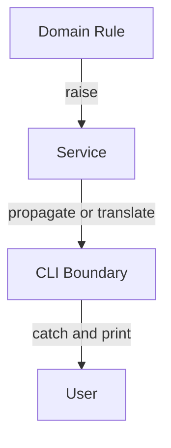
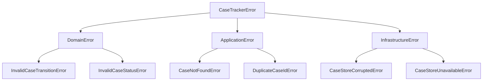

# Part 010 — Exceptions, Failure Semantics, dan Defensive Python

## 1. Tujuan Part Ini

Program yang baik bukan hanya bekerja saat input benar. Program yang baik punya failure semantics yang jelas.

Dalam Python, failure terutama dimodelkan dengan exception.

Banyak bug production muncul bukan karena exception terjadi, tetapi karena exception didesain buruk:

- error ditelan;
- error terlalu umum;
- traceback hilang;
- domain error bercampur infrastructure error;
- caller harus menebak apakah return `None` berarti not found atau system down;
- API boundary membocorkan internal exception;
- retry dilakukan pada error yang tidak retryable;
- user mendapat pesan tidak jelas;
- log tidak cukup untuk diagnosis;
- cleanup tidak berjalan;
- partial side effect tidak dipikirkan.

Part ini membahas exception sebagai desain, bukan hanya syntax `try/except`.

Target setelah part ini:

1. Memahami exception hierarchy.
2. Menulis `raise` dan `try/except` dengan benar.
3. Mendesain custom exception.
4. Membedakan domain error dan infrastructure error.
5. Memakai exception chaining.
6. Menghindari bare except.
7. Menjaga traceback.
8. Memakai `else` dan `finally` secara tepat.
9. Mendesain error boundary.
10. Menghubungkan failure semantics ke `case-tracker`.

---

## 2. Failure Semantics

Failure semantics menjawab:

- Apa yang dianggap gagal?
- Siapa yang mendeteksi kegagalan?
- Siapa yang boleh memulihkan?
- Apa informasi yang dibawa error?
- Apakah error retryable?
- Apakah error harus terlihat oleh user?
- Apakah error harus dilog?
- Apakah state sudah berubah sebelum error?
- Apakah cleanup wajib?
- Apakah error domain atau infrastructure?

Contoh:

```python
def get_case(path: Path, case_id: str) -> Case:
    ...
```

Jika case tidak ada, apa yang terjadi?

Opsi:

1. return `None`;
2. raise `CaseNotFoundError`;
3. return `Result[Case, Error]` style custom;
4. create default case;
5. print error dan exit.

Untuk Python application code, opsi 2 sering jelas:

```python
raise CaseNotFoundError(case_id)
```

Karena missing case adalah failure untuk `get_case`.

Namun untuk `find_case`, return `None` bisa masuk akal:

```python
def find_case(cases: list[Case], case_id: str) -> Case | None:
    ...
```

Nama function dan failure contract harus selaras.

---

## 3. Exception Hierarchy Dasar

Exception Python punya hierarchy.

Beberapa yang sering ditemui:

| Exception | Kapan Muncul |
|---|---|
| `ValueError` | Value valid type tetapi invalid value |
| `TypeError` | Type object tidak sesuai operasi |
| `KeyError` | Key dict tidak ditemukan |
| `IndexError` | Index sequence tidak ada |
| `AttributeError` | Attribute tidak ditemukan |
| `FileNotFoundError` | File tidak ditemukan |
| `PermissionError` | Permission OS gagal |
| `TimeoutError` | Operasi timeout |
| `RuntimeError` | Runtime failure umum |
| `NotImplementedError` | Method belum diimplementasikan |
| `AssertionError` | Assertion gagal |

Contoh:

```python
int("abc")
```

Muncul:

```text
ValueError
```

Contoh:

```python
"hello" + 1
```

Muncul:

```text
TypeError
```

Contoh:

```python
data = {}
data["id"]
```

Muncul:

```text
KeyError
```

---

## 4. Raise Exception

Gunakan `raise` untuk melaporkan error.

```python
def validate_title(title: str) -> None:
    if not title.strip():
        raise ValueError("Case title cannot be empty")
```

Panggil:

```python
validate_title("   ")
```

Exception menghentikan flow normal dan mencari handler yang sesuai.

### 4.1 Raise Exception Class vs Instance

Bisa:

```python
raise ValueError
```

Lebih baik:

```python
raise ValueError("Case title cannot be empty")
```

Pesan error penting untuk debugging.

---

## 5. Catch Exception

Gunakan `try/except`.

```python
try:
    validate_title(raw_title)
except ValueError as error:
    print(f"Invalid input: {error}")
```

Catching harus dilakukan di layer yang bisa mengambil keputusan.

Domain layer biasanya raise. Boundary layer biasanya catch dan present.



---

## 6. Jangan Bare Except

Buruk:

```python
try:
    do_work()
except:
    pass
```

Ini menangkap hampir semua hal, termasuk error yang seharusnya menghentikan program.

Lebih baik:

```python
try:
    do_work()
except ValueError as error:
    handle_invalid_input(error)
```

Jika memang perlu menangkap banyak exception:

```python
try:
    do_work()
except (ValueError, KeyError) as error:
    ...
```

Jika menangkap `Exception`, pastikan ada alasan kuat dan biasanya log/re-raise.

```python
try:
    run_job()
except Exception:
    logger.exception("Unexpected job failure")
    raise
```

---

## 7. Jangan Menelan Error

Buruk:

```python
def load_cases(path: Path) -> list[Case]:
    try:
        ...
    except Exception:
        return []
```

Masalah:

- file corrupt dianggap empty;
- permission error dianggap empty;
- JSON invalid dianggap empty;
- bug mapping dianggap empty;
- data loss bisa terjadi saat save berikutnya.

Lebih baik bedakan:

```python
def load_cases(path: Path) -> list[Case]:
    if not path.exists():
        return []

    raw_content = path.read_text(encoding="utf-8")

    if not raw_content.strip():
        return []

    return parse_cases(raw_content)
```

Jika JSON invalid, biarkan error naik atau translate dengan jelas.

---

## 8. Catch Specific Exception

Contoh storage:

```python
import json
from pathlib import Path


class CaseStoreCorruptedError(Exception):
    def __init__(self, path: Path) -> None:
        super().__init__(f"Case store is corrupted: {path}")
        self.path = path


def load_cases(path: Path) -> list[Case]:
    if not path.exists():
        return []

    raw_content = path.read_text(encoding="utf-8")

    try:
        data = json.loads(raw_content)
    except json.JSONDecodeError as error:
        raise CaseStoreCorruptedError(path) from error

    return [case_from_dict(item) for item in data]
```

Kita hanya menangkap `JSONDecodeError`, bukan semua exception.

Kenapa?

- missing file sudah ditangani;
- permission error biarkan naik;
- bug mapping biarkan terlihat;
- JSON corrupted diterjemahkan menjadi error storage yang lebih bermakna.

---

## 9. Exception Chaining

Gunakan `raise ... from error` saat menerjemahkan exception.

```python
try:
    data = json.loads(raw_content)
except json.JSONDecodeError as error:
    raise CaseStoreCorruptedError(path) from error
```

Manfaat:

- high-level error jelas;
- root cause tetap terlihat;
- traceback menyimpan chain;
- debugging lebih mudah.

Tanpa chaining:

```python
except json.JSONDecodeError:
    raise CaseStoreCorruptedError(path)
```

Root cause bisa kurang jelas.

### 9.1 Suppressing Context

Kadang kamu ingin menyembunyikan internal detail:

```python
raise UserFacingError("Invalid input") from None
```

Gunakan hati-hati. Untuk internal logs, root cause biasanya berguna. Untuk user-facing error, internal detail bisa disembunyikan di boundary, bukan dengan menghilangkan observability.

---

## 10. Re-Raising

Jika ingin menangkap untuk logging lalu meneruskan error, gunakan bare `raise` dalam except block.

```python
try:
    run_job()
except Exception:
    logger.exception("Job failed")
    raise
```

Jangan:

```python
except Exception as error:
    raise error
```

Karena ini bisa mengubah traceback dan membuat diagnosis kurang bersih.

---

## 11. `try/except/else/finally`

Python punya struktur lengkap:

```python
try:
    result = risky_operation()
except ExpectedError as error:
    handle(error)
else:
    use(result)
finally:
    cleanup()
```

### 11.1 `else`

`else` berjalan jika tidak ada exception di `try`.

```python
try:
    data = json.loads(raw_content)
except json.JSONDecodeError as error:
    raise CaseStoreCorruptedError(path) from error
else:
    return [case_from_dict(item) for item in data]
```

`else` berguna untuk membatasi area `try` agar tidak menangkap exception yang tidak dimaksud.

### 11.2 `finally`

`finally` selalu berjalan, baik ada exception atau tidak.

```python
resource = acquire_resource()

try:
    use_resource(resource)
finally:
    resource.close()
```

Untuk resource, context manager (`with`) sering lebih baik.

```python
with path.open("w", encoding="utf-8") as file:
    file.write(content)
```

---

## 12. Context Manager untuk Cleanup

File handling:

```python
with open("cases.json", "r", encoding="utf-8") as file:
    content = file.read()
```

Jika error terjadi saat `read`, file tetap ditutup.

Context manager dipakai untuk:

- file;
- lock;
- temporary directory;
- database transaction;
- network session;
- test patching;
- resource lifecycle.

Untuk storage sederhana, `Path.read_text()` dan `Path.write_text()` sudah mengelola file open/close secara internal.

---

## 13. Custom Exception

Custom exception berguna saat error punya makna domain/application.

Contoh:

```python
class CaseTrackerError(Exception):
    """Base class for case-tracker errors."""


class CaseNotFoundError(CaseTrackerError):
    def __init__(self, case_id: str) -> None:
        super().__init__(f"Case not found: {case_id}")
        self.case_id = case_id


class InvalidCaseTransitionError(CaseTrackerError):
    def __init__(self, from_status: CaseStatus, to_status: CaseStatus) -> None:
        super().__init__(f"Cannot transition case from {from_status.value} to {to_status.value}")
        self.from_status = from_status
        self.to_status = to_status
```

Base exception memudahkan boundary catch:

```python
try:
    ...
except CaseTrackerError as error:
    print(error)
    return 1
```

Tetapi jangan terlalu cepat menangkap base exception jika butuh behavior berbeda per error.

---

## 14. Exception Taxonomy

Untuk aplikasi, buat taxonomy sederhana.



Contoh code:

```python
class CaseTrackerError(Exception):
    pass


class DomainError(CaseTrackerError):
    pass


class ApplicationError(CaseTrackerError):
    pass


class InfrastructureError(CaseTrackerError):
    pass
```

Lalu:

```python
class InvalidCaseTransitionError(DomainError):
    ...


class CaseNotFoundError(ApplicationError):
    ...


class CaseStoreCorruptedError(InfrastructureError):
    ...
```

Untuk mini project, taxonomy ini mungkin terasa formal. Tetapi untuk sistem besar, ia membantu:

- error mapping;
- logging;
- retry policy;
- user message;
- monitoring;
- test clarity.

---

## 15. Domain Error vs Infrastructure Error

### 15.1 Domain Error

Domain error terjadi karena rule bisnis/domain dilanggar.

Contoh:

- invalid transition;
- title kosong;
- note kosong;
- close case tanpa approval;
- escalation tanpa reason.

Domain error biasanya tidak retryable. Jika input sama, hasilnya tetap gagal.

### 15.2 Infrastructure Error

Infrastructure error terjadi karena dependency teknis gagal.

Contoh:

- file tidak bisa dibaca;
- database down;
- network timeout;
- permission denied;
- JSON store corrupt;
- disk full.

Infrastructure error kadang retryable, kadang tidak.

### 15.3 Kenapa Perlu Dibedakan?

Karena handling berbeda.

| Error | Retry? | User Message | Log Severity |
|---|---|---|---|
| Invalid transition | Tidak | Jelaskan rule | Warning/Info |
| Case not found | Tidak, kecuali race | Case tidak ditemukan | Info/Warning |
| Timeout DB | Mungkin | Coba lagi nanti | Error |
| Store corrupt | Tidak otomatis | Hubungi admin | Error/Critical |
| Permission denied | Tidak sampai config diperbaiki | System unavailable | Error |

---

## 16. Return `None` vs Raise

Tidak semua absence harus exception.

### 16.1 `find_` Return `None`

```python
def find_case(cases: list[Case], case_id: str) -> Case | None:
    for case in cases:
        if case.id == case_id:
            return case

    return None
```

Cocok jika missing adalah kemungkinan normal.

### 16.2 `get_` Raise

```python
def get_case(cases: list[Case], case_id: str) -> Case:
    case = find_case(cases, case_id)

    if case is None:
        raise CaseNotFoundError(case_id)

    return case
```

Cocok jika caller membutuhkan case dan tidak bisa lanjut tanpa itu.

Rule:

- `find` boleh return optional;
- `get` biasanya raise;
- konsistensi lebih penting daripada nama spesifik.

---

## 17. Avoid Sentinel Ambiguity

Buruk:

```python
def get_case(case_id: str) -> Case | None:
    try:
        return repository.get(case_id)
    except Exception:
        return None
```

`None` bisa berarti:

- case tidak ada;
- database down;
- permission denied;
- bug deserialization;
- timeout.

Ini merusak semantics.

Lebih baik:

```python
def find_case(case_id: str) -> Case | None:
    try:
        return repository.find(case_id)
    except RepositoryUnavailableError:
        raise
```

Atau repository menyediakan error spesifik.

---

## 18. EAFP vs LBYL

Python sering memakai EAFP: “Easier to Ask Forgiveness than Permission”.

Contoh EAFP:

```python
try:
    value = data["status"]
except KeyError:
    ...
```

LBYL: “Look Before You Leap”.

```python
if "status" in data:
    value = data["status"]
else:
    ...
```

Keduanya valid.

Gunakan EAFP jika:

- operasi idiomatik;
- race condition mungkin terjadi antara check dan use;
- exception memang bagian dari API;
- code lebih sederhana.

Gunakan LBYL jika:

- check murah dan lebih jelas;
- missing field adalah validation concern;
- kamu ingin mengumpulkan banyak error;
- exception akan terlalu sering dalam hot path.

Dalam domain validation, LBYL sering lebih jelas:

```python
if target_status not in ALLOWED_TRANSITIONS[current_status]:
    raise InvalidCaseTransitionError(...)
```

---

## 19. Defensive Python

Defensive bukan berarti menangkap semua error. Defensive berarti failure mode dipikirkan.

Contoh defensive validation:

```python
def normalize_title(title: str) -> str:
    normalized = title.strip()

    if not normalized:
        raise ValueError("Case title cannot be empty")

    return normalized
```

Contoh defensive boundary:

```python
def case_from_dict(data: dict) -> Case:
    try:
        return Case(
            id=data["id"],
            title=data["title"],
            status=CaseStatus(data["status"]),
            notes=list(data.get("notes", [])),
        )
    except KeyError as error:
        raise CaseStoreCorruptedError("Missing required case field") from error
```

Defensive design bertanya:

- input dari mana?
- bisa dipercaya?
- field wajib apa?
- field optional apa?
- error apa yang harus diterjemahkan?
- error apa yang harus naik?
- apakah caller bisa memperbaiki?

---

## 20. Validation Boundary

Data dari luar harus divalidasi di boundary.

Sumber luar:

- CLI args;
- environment variable;
- JSON file;
- HTTP request;
- database row;
- message queue;
- user input;
- third-party API.

Contoh CLI boundary:

```python
def parse_case_status(raw_status: str) -> CaseStatus:
    normalized = raw_status.strip().upper()

    try:
        return CaseStatus(normalized)
    except ValueError as error:
        allowed = ", ".join(status.value for status in CaseStatus)
        raise ValueError(f"Invalid status: {raw_status}. Allowed statuses: {allowed}") from error
```

Contoh JSON boundary:

```python
def case_from_dict(data: dict) -> Case:
    ...
```

Domain object sebaiknya tidak menerima data mentah tanpa validasi.

---

## 21. Error Message Design

Pesan error baik:

- spesifik;
- actionable;
- tidak membocorkan secret;
- mencantumkan value relevan;
- tidak terlalu verbose;
- cocok untuk audience.

Buruk:

```text
Invalid
```

Lebih baik:

```text
Invalid status: WAITING. Allowed statuses: DRAFT, SUBMITTED, UNDER_REVIEW, ESCALATED, CLOSED
```

Buruk:

```text
Database password mysecret123 failed for user admin
```

Jangan log atau tampilkan secret.

### 21.1 Developer Message vs User Message

Exception message internal tidak selalu sama dengan user-facing message.

Internal:

```text
Case store is corrupted: /var/app/cases.json
```

User:

```text
Case data cannot be loaded. Please contact support.
```

CLI sederhana boleh menampilkan exception message, tetapi production API harus mapping lebih hati-hati.

---

## 22. Logging Exceptions

Jangan log exception di setiap layer. Itu menyebabkan duplicate logs.

Buruk:

```python
try:
    service()
except CaseTrackerError:
    logger.exception("Service failed")
    raise
```

Lalu boundary juga log.

Rule:

- log di boundary atau recovery point;
- lower layer raise dengan context;
- jangan log dan suppress tanpa alasan;
- gunakan `logger.exception()` dalam except block untuk menyertakan traceback.

Contoh:

```python
try:
    run_job()
except Exception:
    logger.exception("Unexpected job failure")
    return 1
```

Untuk CLI belajar, `print` cukup. Nanti observability akan memakai `logging`.

---

## 23. Exception Safety dan Partial Side Effects

Pertanyaan penting:

> Apa yang sudah berubah sebelum exception terjadi?

Contoh:

```python
def transition_case(path: Path, case_id: str, target_status: CaseStatus) -> Case:
    cases = load_cases(path)
    case = get_case_from_list(cases, case_id)

    case.transition_to(target_status)
    save_cases(path, cases)
    send_notification(case)

    return case
```

Jika `send_notification` gagal:

- status sudah tersimpan;
- notification belum terkirim;
- caller menerima exception;
- apakah retry akan mengirim notification?
- apakah transition akan dijalankan ulang?
- apakah idempotent?

Untuk mini project, kita belum punya notification. Tetapi pola ini penting.

Rule awal:

1. Validate sebelum side effect.
2. Minimalkan side effect dalam satu function.
3. Urutkan side effect dengan sadar.
4. Dokumentasikan partial failure jika ada.
5. Untuk operasi penting, pertimbangkan transaction/outbox pattern nanti.

---

## 24. Atomic File Write

Storage sederhana:

```python
path.write_text(json.dumps(data, indent=2), encoding="utf-8")
```

Jika process crash saat write, file bisa corrupt.

Lebih defensif:

```python
def atomic_write_text(path: Path, content: str) -> None:
    temp_path = path.with_suffix(path.suffix + ".tmp")
    temp_path.write_text(content, encoding="utf-8")
    temp_path.replace(path)
```

Gunakan di `save_cases`:

```python
def save_cases(path: Path, cases: list[Case]) -> None:
    data = [case_to_dict(case) for case in cases]
    content = json.dumps(data, indent=2)
    atomic_write_text(path, content)
```

Ini bukan sempurna untuk semua filesystem/OS scenario, tetapi lebih baik daripada direct overwrite.

Konsep penting:

> Failure semantics juga berlaku pada persistence.

---

## 25. Designing Case Tracker Errors

Refactor `domain.py`:

```python
class CaseTrackerError(Exception):
    pass


class DomainError(CaseTrackerError):
    pass


class InvalidCaseTransitionError(DomainError):
    def __init__(self, from_status: CaseStatus, to_status: CaseStatus) -> None:
        super().__init__(f"Cannot transition case from {from_status.value} to {to_status.value}")
        self.from_status = from_status
        self.to_status = to_status
```

`service.py`:

```python
class ApplicationError(CaseTrackerError):
    pass


class CaseNotFoundError(ApplicationError):
    def __init__(self, case_id: str) -> None:
        super().__init__(f"Case not found: {case_id}")
        self.case_id = case_id
```

`storage.py`:

```python
class InfrastructureError(CaseTrackerError):
    pass


class CaseStoreCorruptedError(InfrastructureError):
    def __init__(self, path: Path) -> None:
        super().__init__(f"Case store is corrupted: {path}")
        self.path = path
```

Namun hati-hati: jika base class ada di `domain.py`, maka storage import domain sudah OK. Tetapi jika `InfrastructureError` di storage dan domain butuh base, bisa muncul dependency question. Untuk project kecil, bisa buat module:

```text
errors.py
```

Berisi base exception umum.

---

## 26. Should Errors Live in `errors.py`?

Pilihan:

### 26.1 Error di Module Terkait

```text
domain.py -> InvalidCaseTransitionError
service.py -> CaseNotFoundError
storage.py -> CaseStoreCorruptedError
```

Kelebihan:

- dekat dengan sumber error;
- sederhana;
- tidak ada module extra.

Kekurangan:

- boundary yang ingin catch semua error harus import dari beberapa module;
- base taxonomy tersebar.

### 26.2 Error di `errors.py`

```text
errors.py -> CaseTrackerError, DomainError, ApplicationError, InfrastructureError
domain.py -> import DomainError
```

Kelebihan:

- taxonomy jelas;
- boundary bisa catch base error;
- mengurangi duplication.

Kekurangan:

- module baru;
- bisa menjadi dumping ground jika tidak disiplin.

Untuk mini project, error di module terkait cukup. Saat error taxonomy tumbuh, pindahkan base classes ke `errors.py`.

---

## 27. CLI Error Boundary

CLI boundary harus catch error yang bisa dipresentasikan.

```python
def main() -> int:
    parser = build_parser()
    args = parser.parse_args()

    try:
        return handle_command(args)
    except CaseTrackerError as error:
        print(error)
        return 1
    except ValueError as error:
        print(f"Invalid input: {error}")
        return 1
```

Namun jangan catch unexpected bug terlalu agresif.

Untuk development, biarkan unexpected exception muncul dengan traceback.

Untuk production CLI, bisa:

```python
except Exception:
    logger.exception("Unexpected error")
    print("Unexpected error. See logs for details.")
    return 1
```

Tetapi di fase belajar, traceback membantu self-correction. Jangan sembunyikan terlalu awal.

---

## 28. HTTP/API Error Boundary Preview

Nanti saat memakai FastAPI, mapping bisa seperti:

| Exception | HTTP Status |
|---|---:|
| `CaseNotFoundError` | 404 |
| `InvalidCaseTransitionError` | 409 atau 400 |
| `ValueError` input | 400 |
| `CaseStoreUnavailableError` | 503 |
| Unexpected exception | 500 |

Domain tidak boleh raise `HTTPException` langsung.

Buruk:

```python
def transition_to(...):
    raise HTTPException(status_code=400)
```

Lebih baik:

```python
raise InvalidCaseTransitionError(...)
```

API boundary yang menerjemahkan.

---

## 29. Testing Exceptions

Gunakan pytest:

```python
import pytest


def test_invalid_transition_raises_error():
    case = Case(id="CASE-001", title="Late reporting")

    with pytest.raises(InvalidCaseTransitionError):
        case.transition_to(CaseStatus.CLOSED)
```

Cek message:

```python
with pytest.raises(ValueError, match="Title cannot be empty"):
    create_case("   ")
```

Cek attribute:

```python
with pytest.raises(InvalidCaseTransitionError) as exc_info:
    case.transition_to(CaseStatus.CLOSED)

assert exc_info.value.from_status is CaseStatus.DRAFT
assert exc_info.value.to_status is CaseStatus.CLOSED
```

Test exception bukan hanya memastikan error terjadi, tetapi memastikan error membawa informasi yang benar.

---

## 30. Testing Exception Chaining

```python
import json
import pytest


def test_load_cases_wraps_json_decode_error(tmp_path):
    path = tmp_path / "cases.json"
    path.write_text("{invalid json", encoding="utf-8")

    with pytest.raises(CaseStoreCorruptedError) as exc_info:
        load_cases(path)

    assert isinstance(exc_info.value.__cause__, json.JSONDecodeError)
```

`__cause__` berasal dari `raise ... from error`.

Ini memastikan root cause tidak hilang.

---

## 31. Error Handling Smells

### 31.1 Bare Except

```python
except:
    ...
```

### 31.2 Catch and Ignore

```python
except Exception:
    pass
```

### 31.3 Catch Too Broad Too Early

```python
def domain_function():
    try:
        ...
    except Exception:
        return None
```

### 31.4 Lost Traceback

```python
except SomeError as error:
    raise OtherError(str(error))
```

Lebih baik:

```python
raise OtherError(...) from error
```

### 31.5 Print in Lower Layer

```python
def load_cases(...):
    print("Could not load")
```

Storage harus raise, boundary present.

### 31.6 Error Message Too Vague

```python
raise ValueError("Bad")
```

### 31.7 Error Message Leaks Secret

```python
raise ValueError(f"Invalid token: {token}")
```

### 31.8 Using Exception for Normal Loop Control Excessively

Exception boleh untuk EAFP, tetapi jangan membuat flow normal sulit dibaca.

### 31.9 Returning Magic Values

```python
return -1
```

Tanpa contract jelas.

### 31.10 Converting Every Error to `RuntimeError`

Menghilangkan semantics.

---

## 32. Failure Mode Table

Untuk `case-tracker`:

| Failure | Layer Deteksi | Exception | Boundary Handling |
|---|---|---|---|
| Empty title | Domain/factory | `ValueError` atau `InvalidCaseTitleError` | Print invalid input |
| Invalid status string | CLI parsing | `ValueError` | Print allowed statuses |
| Invalid transition | Domain | `InvalidCaseTransitionError` | Print transition error |
| Missing case id | Service | `CaseNotFoundError` | Print not found |
| Missing file | Storage | no error, return empty | Normal |
| Empty file | Storage | no error, return empty | Normal |
| Invalid JSON | Storage | `CaseStoreCorruptedError` | Print data corrupted |
| Permission denied | OS/storage | `PermissionError` | Unexpected or mapped infra error |
| Duplicate case id | Service/storage validation | `DuplicateCaseIdError` | Print data invariant error |

This table is design documentation.

---

## 33. Practice: Refactor Storage Error

Current:

```python
def load_cases(path: Path) -> list[Case]:
    if not path.exists():
        return []

    raw_content = path.read_text(encoding="utf-8")

    if not raw_content.strip():
        return []

    data = json.loads(raw_content)
    return [case_from_dict(item) for item in data]
```

Refactor:

```python
class CaseStoreCorruptedError(Exception):
    def __init__(self, path: Path) -> None:
        super().__init__(f"Case store is corrupted: {path}")
        self.path = path


def load_cases(path: Path) -> list[Case]:
    if not path.exists():
        return []

    raw_content = path.read_text(encoding="utf-8")

    if not raw_content.strip():
        return []

    try:
        data = json.loads(raw_content)
    except json.JSONDecodeError as error:
        raise CaseStoreCorruptedError(path) from error

    return [case_from_dict(item) for item in data]
```

Tambahkan test invalid JSON.

---

## 34. Practice: Split Find and Get

Implement:

```python
def find_case(cases: list[Case], case_id: str) -> Case | None:
    for case in cases:
        if case.id == case_id:
            return case

    return None


def get_case_from_list(cases: list[Case], case_id: str) -> Case:
    case = find_case(cases, case_id)

    if case is None:
        raise CaseNotFoundError(case_id)

    return case
```

Test:

```python
def test_find_case_returns_none_when_missing():
    assert find_case([], "CASE-001") is None


def test_get_case_from_list_raises_when_missing():
    with pytest.raises(CaseNotFoundError):
        get_case_from_list([], "CASE-001")
```

Manfaat:

- semantics jelas;
- caller memilih behavior;
- `transition_case` bisa pakai `get`.

---

## 35. Practice: Exception Attributes

Update:

```python
class InvalidCaseTransitionError(Exception):
    def __init__(self, from_status: CaseStatus, to_status: CaseStatus) -> None:
        self.from_status = from_status
        self.to_status = to_status
        super().__init__(f"Cannot transition case from {from_status.value} to {to_status.value}")
```

Test:

```python
def test_invalid_transition_error_contains_statuses():
    case = Case(id="CASE-001", title="Late reporting")

    with pytest.raises(InvalidCaseTransitionError) as exc_info:
        case.transition_to(CaseStatus.CLOSED)

    assert exc_info.value.from_status is CaseStatus.DRAFT
    assert exc_info.value.to_status is CaseStatus.CLOSED
```

Error object harus membawa data yang berguna, bukan hanya string.

---

## 36. Practice: Improve CLI Status Error

Implement:

```python
def parse_case_status(raw_status: str) -> CaseStatus:
    normalized = raw_status.strip().upper()

    try:
        return CaseStatus(normalized)
    except ValueError as error:
        allowed = ", ".join(status.value for status in CaseStatus)
        raise ValueError(f"Invalid status: {raw_status}. Allowed statuses: {allowed}") from error
```

Test:

```python
def test_parse_case_status_error_message_lists_allowed_values():
    with pytest.raises(ValueError, match="Allowed statuses"):
        parse_case_status("waiting")
```

---

## 37. Practice: Failure Mode Review

Ambil function:

```python
def transition_case(path: Path, case_id: str, target_status: CaseStatus) -> Case:
    cases = load_cases(path)
    case = get_case_from_list(cases, case_id)
    case.transition_to(target_status)
    save_cases(path, cases)
    return case
```

Jawab:

1. Apa saja exception yang mungkin muncul?
2. Dari layer mana exception itu berasal?
3. Mana domain error?
4. Mana application error?
5. Mana infrastructure error?
6. Mana yang boleh ditampilkan ke user?
7. Mana yang perlu log?
8. Apa partial side effect yang mungkin terjadi?
9. Apakah function ini idempotent?
10. Apa yang terjadi jika `save_cases` gagal?

---

## 38. Practice: Avoid Swallowing Error

Kode buruk:

```python
def safe_load_cases(path: Path) -> list[Case]:
    try:
        return load_cases(path)
    except Exception:
        return []
```

Refactor dengan semantics:

```python
def load_cases_or_empty_if_missing(path: Path) -> list[Case]:
    if not path.exists():
        return []

    return load_cases(path)
```

Atau jika CLI ingin present:

```python
try:
    cases = load_cases(path)
except CaseStoreCorruptedError as error:
    print(error)
    return 1
```

Jangan mengubah semua failure menjadi empty list.

---

## 39. Self-Check

Jawab tanpa melihat materi:

1. Apa itu failure semantics?
2. Kapan raise exception?
3. Kapan return `None`?
4. Apa beda `find` dan `get` semantics?
5. Kenapa bare except buruk?
6. Kenapa catch `Exception` terlalu awal buruk?
7. Apa itu exception chaining?
8. Kapan memakai `raise ... from error`?
9. Apa beda domain error dan infrastructure error?
10. Kenapa domain tidak boleh print error?
11. Kenapa CLI boleh catch dan print?
12. Apa guna custom exception attribute?
13. Apa fungsi `finally`?
14. Kapan context manager lebih baik dari `finally` manual?
15. Apa itu partial side effect?
16. Kenapa validate before side effect?
17. Apa risiko return empty list saat JSON corrupt?
18. Bagaimana test exception dengan pytest?
19. Apa itu `logger.exception()`?
20. Apa error handling smell paling berbahaya?

---

## 40. Definition of Done Part 010

Kamu selesai part ini jika bisa:

1. Menjelaskan exception hierarchy dasar.
2. Menulis custom exception.
3. Menulis `try/except` spesifik.
4. Menghindari bare except.
5. Menjelaskan exception chaining.
6. Menulis `raise ... from error`.
7. Menjaga traceback saat re-raise.
8. Membedakan domain/application/infrastructure error.
9. Membuat failure mode table.
10. Refactor storage invalid JSON menjadi custom error.
11. Split `find_case` dan `get_case_from_list`.
12. Test exception dengan pytest.
13. Test exception attributes.
14. Menjelaskan error boundary CLI.
15. Menjelaskan partial side effect dalam `transition_case`.

---

## 41. Ringkasan

Exception adalah bagian dari desain, bukan sekadar mekanisme crash.

Inti part ini:

- failure semantics harus jelas;
- raise exception saat function tidak bisa memenuhi contract;
- return `None` hanya jika absence adalah hasil normal dan jelas;
- catch exception di layer yang bisa mengambil keputusan;
- hindari bare except dan swallowing error;
- gunakan custom exception untuk domain/application semantics;
- gunakan exception chaining agar root cause tidak hilang;
- bedakan domain error dan infrastructure error;
- validation boundary penting untuk data eksternal;
- error message harus spesifik dan aman;
- lower layer raise, boundary layer present;
- partial side effect harus dipikirkan;
- tests harus mencakup failure path.

Part berikutnya akan membahas iteration, comprehension, generator, dan lazy thinking: bagaimana Python memproses aliran data dan bagaimana menulis transformasi yang efisien serta readable.

---

## 42. Referensi

- Python Documentation — Errors and Exceptions.
- Python Documentation — Built-in Exceptions.
- Python Documentation — Exception Chaining.
- Python Documentation — `contextlib`.
- pytest Documentation — `pytest.raises`.
