# Part 018 — Standard Library as Engineering Leverage

## 1. Tujuan Part Ini

Sebelum menambah dependency eksternal, engineer Python yang kuat selalu bertanya:

> “Apakah standard library sudah cukup?”

Python standard library adalah salah satu kekuatan utama Python. Banyak kebutuhan aplikasi sehari-hari sudah tersedia:

- file path;
- JSON;
- CSV;
- CLI parsing;
- logging;
- date/time;
- timezone;
- temporary files;
- collections specialized;
- iteration tools;
- functional utilities;
- context managers;
- subprocess;
- SQLite;
- config parsing;
- HTTP server/client dasar;
- compression;
- hashing;
- secrets;
- UUID;
- dataclasses;
- enums;
- typing;
- concurrency primitives;
- unit testing tools.

Part ini bukan katalog lengkap. Tujuannya adalah membangun peta mental standard library sebagai leverage engineering.

Target setelah part ini:

1. Mengetahui modul standard library yang paling bernilai.
2. Memahami kapan standard library cukup.
3. Memakai `pathlib` untuk filesystem.
4. Memakai `datetime` dan `zoneinfo` dengan sadar timezone.
5. Memakai `json` dan `csv`.
6. Memakai `argparse`.
7. Memakai `logging`.
8. Memakai `collections`, `itertools`, `functools`.
9. Memakai `contextlib`, `tempfile`, `subprocess`.
10. Memakai `sqlite3` sebagai embedded database.
11. Memahami dependency decision sebelum menambah package eksternal.
12. Menghubungkan standard library ke `case-tracker`.

---

## 2. Mental Model: Standard Library First

Standard library tidak selalu paling ergonomic. Tetapi ia punya keunggulan:

- tersedia tanpa install tambahan;
- relatif stabil;
- dokumentasi resmi;
- kompatibilitas luas;
- supply-chain risk lebih rendah daripada dependency eksternal;
- cocok untuk baseline project;
- cukup untuk banyak problem kecil-menengah.

Namun standard library tidak selalu cukup:

- HTTP client modern: `httpx`/`requests` bisa lebih ergonomic;
- data validation kompleks: Pydantic bisa membantu;
- CLI rich UX: Typer/Click/Rich bisa membantu;
- date/time business logic kompleks: library tambahan bisa berguna;
- async frameworks: standard library bukan web framework;
- ORM: SQLAlchemy/Django ORM punya leverage besar.

Rule:

> Mulai dari standard library untuk memahami problem. Tambah dependency saat leverage jelas.

---

## 3. Standard Library Map

```mermaid
flowchart TD
    A[Python Standard Library] --> B[Data & Collections]
    A --> C[Files & OS]
    A --> D[Text & Serialization]
    A --> E[Time & Dates]
    A --> F[CLI & Config]
    A --> G[Logging & Debugging]
    A --> H[Concurrency]
    A --> I[Networking]
    A --> J[Security/Crypto Utilities]
    A --> K[Testing & Dev]
    A --> L[Runtime Introspection]

    B --> B1[collections]
    B --> B2[itertools]
    B --> B3[functools]
    B --> B4[heapq]
    B --> B5[bisect]

    C --> C1[pathlib]
    C --> C2[tempfile]
    C --> C3[shutil]
    C --> C4[subprocess]
    C --> C5[os]

    D --> D1[json]
    D --> D2[csv]
    D --> D3[re]
    D --> D4[textwrap]
    D --> D5[string]

    E --> E1[datetime]
    E --> E2[zoneinfo]
    E --> E3[time]
```



Kamu tidak harus menghafal semua. Tetapi kamu harus tahu “ada modul apa” agar tidak langsung menambah dependency.

---

## 4. `pathlib`: Filesystem Path Modern

Gunakan `pathlib.Path`, bukan string concatenation.

```python
from pathlib import Path

store_path = Path("cases.json")
```

Read:

```python
content = store_path.read_text(encoding="utf-8")
```

Write:

```python
store_path.write_text("hello", encoding="utf-8")
```

Join path:

```python
data_dir = Path("data")
store_path = data_dir / "cases.json"
```

Check:

```python
if store_path.exists():
    ...
```

Create directory:

```python
data_dir.mkdir(parents=True, exist_ok=True)
```

### 4.1 Why `pathlib`

Bad:

```python
path = "data" + "/" + "cases.json"
```

Problems:

- platform separator;
- readability;
- path operations manual;
- methods scattered in `os.path`.

Good:

```python
path = Path("data") / "cases.json"
```

---

## 5. `tempfile`: Temporary Files and Directories

For tests and scripts:

```python
from tempfile import TemporaryDirectory
from pathlib import Path

with TemporaryDirectory() as directory:
    path = Path(directory) / "cases.json"
    path.write_text("[]", encoding="utf-8")
```

In pytest, prefer `tmp_path`.

For application code, `tempfile` is useful for atomic write staging, report generation, downloads, etc.

---

## 6. `shutil`: High-Level File Operations

Examples:

```python
import shutil
from pathlib import Path

shutil.copy(Path("source.txt"), Path("target.txt"))
shutil.copytree(Path("src_dir"), Path("dst_dir"))
shutil.rmtree(Path("old_dir"))
```

Use carefully. File operations can be destructive.

For scripts that delete/move files, consider:

- dry-run mode;
- logging;
- confirmation;
- idempotency;
- backup;
- explicit paths.

---

## 7. `json`

JSON serialization:

```python
import json

data = {"id": "CASE-001", "status": "DRAFT"}
content = json.dumps(data, indent=2)
```

Deserialization:

```python
data = json.loads(content)
```

File:

```python
path.write_text(json.dumps(data, indent=2), encoding="utf-8")
loaded = json.loads(path.read_text(encoding="utf-8"))
```

### 7.1 JSON Limitations

JSON supports:

- object/dict;
- array/list;
- string;
- number;
- boolean;
- null.

It does not natively know:

- `datetime`;
- `Enum`;
- `Decimal`;
- dataclass;
- UUID object;
- custom class.

You need mapping.

```python
def case_to_dict(case: Case) -> dict:
    return {
        "id": case.id.value,
        "status": case.status.value,
    }
```

---

## 8. `csv`

CSV is common for reports and imports.

Write:

```python
import csv
from pathlib import Path

path = Path("cases.csv")

with path.open("w", encoding="utf-8", newline="") as file:
    writer = csv.DictWriter(file, fieldnames=["id", "title", "status"])
    writer.writeheader()
    writer.writerow({"id": "CASE-001", "title": "Late reporting", "status": "DRAFT"})
```

Read:

```python
with path.open("r", encoding="utf-8", newline="") as file:
    reader = csv.DictReader(file)

    for row in reader:
        print(row["id"], row["status"])
```

CSV caveats:

- delimiter variations;
- quoting;
- encoding;
- newline handling;
- missing columns;
- type conversion;
- Excel quirks.

Always validate imported CSV data.

---

## 9. `datetime` and `zoneinfo`

Time is dangerous.

Use timezone-aware datetimes for real systems.

```python
from datetime import UTC, datetime

now = datetime.now(UTC)
```

Timezone:

```python
from zoneinfo import ZoneInfo

jakarta = ZoneInfo("Asia/Jakarta")
now_jakarta = datetime.now(jakarta)
```

Avoid naive datetime for cross-system events:

```python
datetime.now()
```

Naive datetime has no timezone info.

### 9.1 Time in Domain Systems

For case management:

- created_at;
- submitted_at;
- due_at;
- escalated_at;
- closed_at;
- SLA timers;
- audit event time.

Rules:

- store in UTC if possible;
- display in user timezone;
- inject clock for tests;
- distinguish date vs datetime;
- beware DST for some timezones;
- do not compare naive and aware datetime.

---

## 10. `uuid`

Generate unique identifiers:

```python
from uuid import uuid4

case_id = f"CASE-{uuid4()}"
```

UUID is useful for:

- identifiers;
- idempotency keys;
- event ids;
- request correlation ids.

For tests, inject ID factory if exact value matters.

---

## 11. `enum`

Enums model finite values.

```python
from enum import Enum


class CaseStatus(Enum):
    DRAFT = "DRAFT"
    SUBMITTED = "SUBMITTED"
    UNDER_REVIEW = "UNDER_REVIEW"
    ESCALATED = "ESCALATED"
    CLOSED = "CLOSED"
```

Use:

```python
status = CaseStatus("DRAFT")
```

Enum benefits:

- finite set;
- readable names;
- prevents arbitrary strings;
- works with type hints;
- suitable for state machine.

JSON serialization uses `.value`.

---

## 12. `dataclasses`

Dataclasses reduce boilerplate.

```python
from dataclasses import dataclass, field


@dataclass
class Case:
    id: str
    title: str
    notes: list[str] = field(default_factory=list)
```

Use for:

- domain models;
- value objects;
- DTOs;
- command objects;
- events;
- config structures.

Remember:

- default equality behavior;
- mutable defaults need `default_factory`;
- frozen not deep immutable;
- `__post_init__` for validation.

---

## 13. `argparse`

CLI parsing:

```python
import argparse

parser = argparse.ArgumentParser(prog="case-tracker")
subparsers = parser.add_subparsers(dest="command", required=True)

create_parser = subparsers.add_parser("create")
create_parser.add_argument("title")

args = parser.parse_args()
```

Pros:

- standard library;
- no dependency;
- supports subcommands;
- generates help;
- enough for many CLIs.

Cons:

- verbose for complex CLIs;
- less ergonomic than Typer/Click;
- rich output requires extra work.

For `case-tracker`, `argparse` is enough.

---

## 14. `logging`

Use logging instead of `print` for application diagnostics.

Basic:

```python
import logging

logger = logging.getLogger(__name__)


def transition_case(...):
    logger.info("Transitioning case %s to %s", case_id, target_status.value)
```

Configure at boundary:

```python
logging.basicConfig(level=logging.INFO)
```

### 14.1 Logger per Module

```python
logger = logging.getLogger(__name__)
```

This gives logger names like:

```text
case_tracker.service
case_tracker.storage
```

Useful for filtering.

### 14.2 Do Not Use f-string for Logging Arguments

Prefer:

```python
logger.info("Case %s transitioned to %s", case_id, status)
```

Instead of:

```python
logger.info(f"Case {case_id} transitioned to {status}")
```

The logging library can defer formatting and handles structured patterns better.

---

## 15. `collections`

### 15.1 `Counter`

```python
from collections import Counter

status_counts = Counter(case.status for case in cases)
```

### 15.2 `defaultdict`

```python
from collections import defaultdict

cases_by_status = defaultdict(list)

for case in cases:
    cases_by_status[case.status].append(case)
```

### 15.3 `deque`

Efficient queue operations at both ends.

```python
from collections import deque

queue = deque()
queue.append("task-1")
item = queue.popleft()
```

Use for BFS, queues, rolling windows.

### 15.4 `ChainMap`

Layered configuration:

```python
from collections import ChainMap

config = ChainMap(cli_config, env_config, default_config)
```

---

## 16. `itertools`

Useful for iteration pipelines.

```python
from itertools import chain, islice, pairwise
```

Examples:

```python
combined = chain(open_cases, closed_cases)
first_ten = list(islice(iter_cases(), 10))
```

Workflow transitions:

```python
for current_status, next_status in pairwise(workflow_order):
    print(current_status, "->", next_status)
```

Use `itertools` when it improves clarity. Do not make simple loops unreadable.

---

## 17. `functools`

### 17.1 `lru_cache`

Memoization:

```python
from functools import lru_cache


@lru_cache(maxsize=128)
def expensive_lookup(key: str) -> str:
    ...
```

Be careful with:

- mutable returns;
- cache invalidation;
- memory growth;
- hidden global state;
- test isolation.

### 17.2 `cached_property`

```python
from functools import cached_property


class CaseReport:
    @cached_property
    def summary(self) -> str:
        return expensive_summary()
```

### 17.3 `partial`

```python
from functools import partial

high_priority_case = partial(create_case, priority=CasePriority.HIGH)
```

Use sparingly; named functions are often clearer.

---

## 18. `contextlib`

Context manager utilities.

### 18.1 `contextmanager`

```python
from contextlib import contextmanager


@contextmanager
def managed_resource():
    resource = acquire()
    try:
        yield resource
    finally:
        resource.close()
```

### 18.2 `suppress`

```python
from contextlib import suppress

with suppress(FileNotFoundError):
    path.unlink()
```

Use carefully. Do not suppress errors broadly.

### 18.3 `nullcontext`

Useful for optional context manager.

```python
from contextlib import nullcontext

context = open(path) if path else nullcontext(sys.stdout)
```

---

## 19. `subprocess`

Run external commands.

```python
import subprocess

result = subprocess.run(
    ["python", "--version"],
    check=True,
    capture_output=True,
    text=True,
)
```

Avoid shell unless necessary.

Bad:

```python
subprocess.run(f"cat {user_input}", shell=True)
```

Better:

```python
subprocess.run(["cat", user_input], check=True)
```

Still validate file paths.

Use cases:

- automation scripts;
- calling system tools;
- integration with CLI tools.

Caveats:

- command injection;
- quoting;
- environment;
- working directory;
- timeout;
- output size;
- exit codes.

---

## 20. `sqlite3`

SQLite is built-in relational database.

Example:

```python
import sqlite3
from pathlib import Path

path = Path("cases.db")

with sqlite3.connect(path) as connection:
    connection.execute(
        """
        CREATE TABLE IF NOT EXISTS cases (
            id TEXT PRIMARY KEY,
            title TEXT NOT NULL,
            status TEXT NOT NULL
        )
        """
    )
    connection.execute(
        "INSERT INTO cases (id, title, status) VALUES (?, ?, ?)",
        ("CASE-001", "Late reporting", "DRAFT"),
    )
```

Use parameterized queries, not string interpolation.

Bad:

```python
connection.execute(f"SELECT * FROM cases WHERE id = '{case_id}'")
```

Good:

```python
connection.execute("SELECT * FROM cases WHERE id = ?", (case_id,))
```

SQLite is excellent for:

- local tools;
- prototypes;
- embedded apps;
- tests;
- small internal systems;
- migration staging.

For production multi-user server workloads, evaluate carefully.

---

## 21. `configparser`

INI config:

```python
import configparser

config = configparser.ConfigParser()
config.read("config.ini")

store_path = config["case_tracker"]["store_path"]
```

For many modern apps, environment variables or TOML/YAML may be used. But `configparser` is available without dependency.

Python standard library also includes `tomllib` for reading TOML in modern Python versions.

---

## 22. `tomllib`

Read TOML:

```python
import tomllib
from pathlib import Path

data = tomllib.loads(Path("pyproject.toml").read_text(encoding="utf-8"))
```

Note: `tomllib` reads TOML. It does not write TOML.

Useful for:

- reading config;
- inspecting `pyproject.toml`;
- internal tooling.

---

## 23. `os` and `os.environ`

Environment variables:

```python
import os
from pathlib import Path

store_path = Path(os.environ.get("CASE_TRACKER_STORE", "cases.json"))
```

For tests:

```python
def test_store_path_from_env(monkeypatch):
    monkeypatch.setenv("CASE_TRACKER_STORE", "/tmp/cases.json")
    ...
```

Avoid reading environment all over the codebase. Centralize configuration loading.

---

## 24. `secrets` and `hashlib`

Generate secure tokens:

```python
import secrets

token = secrets.token_urlsafe(32)
```

Hashing:

```python
import hashlib

digest = hashlib.sha256(content).hexdigest()
```

Do not use `random` for security tokens.

Use `secrets`.

For password hashing, use dedicated password hashing algorithms/libraries. `hashlib.sha256(password)` alone is not sufficient for password storage.

---

## 25. `random`

For simulation/testing non-security randomness:

```python
import random

value = random.choice(["LOW", "MEDIUM", "HIGH"])
```

For deterministic tests:

```python
rng = random.Random(42)
value = rng.choice(["LOW", "MEDIUM", "HIGH"])
```

Do not use global randomness if deterministic behavior matters. Inject RNG or factory.

---

## 26. `re`

Regex:

```python
import re

pattern = re.compile(r"^CASE-\d+$")

if pattern.match("CASE-001"):
    ...
```

Use regex for pattern matching, but do not overuse for parsing formats that need real parser.

For simple prefix/suffix checks, string methods are clearer:

```python
case_id.startswith("CASE-")
```

---

## 27. `textwrap`

Useful for formatting text output.

```python
from textwrap import dedent

message = dedent(
    """
    Usage:
      case-tracker create "Title"
      case-tracker list
    """
).strip()
```

Good for readable multi-line strings.

---

## 28. `decimal`

Use `Decimal` for decimal arithmetic where binary float is inappropriate.

```python
from decimal import Decimal

amount = Decimal("10.25")
tax = Decimal("0.10")
total = amount * (Decimal("1") + tax)
```

For financial/regulatory calculations, do not casually use float.

---

## 29. `heapq` and `bisect`

### 29.1 `heapq`

Priority queue:

```python
import heapq

items: list[tuple[int, str]] = []
heapq.heappush(items, (1, "urgent"))
heapq.heappush(items, (5, "normal"))

priority, item = heapq.heappop(items)
```

### 29.2 `bisect`

Binary search insertion in sorted list:

```python
import bisect

numbers = [1, 3, 5]
bisect.insort(numbers, 4)
```

Use when sorted list operations are needed and data size/modification pattern fits.

---

## 30. `importlib.metadata`

Inspect installed package metadata.

```python
from importlib.metadata import version

print(version("pytest"))
```

Useful for:

- diagnostics;
- plugin systems;
- version reporting.

---

## 31. `importlib.resources`

Access package data.

```python
from importlib.resources import files

content = files("case_tracker.templates").joinpath("report.txt").read_text(encoding="utf-8")
```

Use instead of assuming filesystem path relative to current working directory.

Works better for installed packages.

---

## 32. `unittest.mock`

Even if you use pytest, `unittest.mock` is standard library.

```python
from unittest.mock import Mock

notifier = Mock()
notifier.send("hello")

notifier.send.assert_called_once_with("hello")
```

Use carefully, as discussed in test architecture.

---

## 33. `pdb`

Debugger:

```bash
python -m pdb script.py
```

Or in code:

```python
breakpoint()
```

`breakpoint()` invokes debugger according to environment.

Use debugger to inspect runtime behavior, but do not leave breakpoints in committed code.

---

## 34. `time`

Use for monotonic timing:

```python
from time import perf_counter

start = perf_counter()
do_work()
elapsed = perf_counter() - start
```

For measuring durations, prefer monotonic/perf counter over wall-clock datetime.

For timestamps/events, use `datetime.now(UTC)`.

---

## 35. `concurrent.futures`

High-level thread/process pools.

```python
from concurrent.futures import ThreadPoolExecutor

with ThreadPoolExecutor(max_workers=4) as executor:
    results = list(executor.map(fetch_case, case_ids))
```

Use threads for I/O-bound blocking operations. Use process pool for CPU-bound work if appropriate. Concurrency will be covered later.

---

## 36. `asyncio`

Standard library async framework.

```python
import asyncio


async def main() -> None:
    await asyncio.sleep(1)


asyncio.run(main())
```

Async Python has its own mental model. Do not use it just because it exists. We cover it later.

---

## 37. `typing`

Type support:

```python
from typing import Protocol, TypedDict, TypeVar
```

We covered this in part 013.

Modern Python increasingly places runtime collection ABCs in `collections.abc` and typing constructs in `typing`.

---

## 38. Standard Library Decision Examples

### 38.1 CLI

Start with `argparse`.

Add Typer/Click if:

- CLI is large;
- nested commands complex;
- shell completion needed;
- rich UX matters;
- type-driven CLI improves maintainability.

### 38.2 JSON Validation

Start with manual mapping for small domain.

Add Pydantic if:

- many schemas;
- nested validation;
- API boundary;
- error messages important;
- serialization rules complex.

### 38.3 HTTP

Standard library has `urllib`, but many teams use `httpx`/`requests` for ergonomics.

Decision depends on frequency/complexity.

### 38.4 Reports

Start with `csv`, `json`, text.

Add external libraries for Excel/PDF/templating only when needed.

---

## 39. Case Tracker: Standard Library Baseline

Current dependencies can remain zero.

Use standard library:

| Need | Module |
|---|---|
| CLI | `argparse` |
| File path | `pathlib` |
| JSON storage | `json` |
| IDs | `uuid` |
| Domain model | `dataclasses`, `enum` |
| Type hints | `typing`, `collections.abc` |
| Tests temporary file | pytest `tmp_path`, but app uses `pathlib` |
| Logging | `logging` |
| Config | `os.environ`, maybe `tomllib` |
| CSV export | `csv` |
| SQLite evolution | `sqlite3` |
| Atomic/temp files | `tempfile`, `Path.replace` |

This is enough for a surprisingly capable CLI.

---

## 40. Case Tracker Enhancement: Logging

In `service.py`:

```python
import logging

logger = logging.getLogger(__name__)


def transition_case(path: Path, case_id: str, target_status: CaseStatus) -> Case:
    logger.info("Transitioning case %s to %s", case_id, target_status.value)

    cases = load_cases(path)
    case = get_case_from_list(cases, case_id)
    case.transition_to(target_status)
    save_cases(path, cases)

    logger.info("Case %s transitioned to %s", case_id, target_status.value)
    return case
```

In CLI:

```python
def configure_logging(verbose: bool) -> None:
    level = logging.DEBUG if verbose else logging.INFO
    logging.basicConfig(level=level, format="%(levelname)s %(name)s: %(message)s")
```

Add CLI flag:

```python
parser.add_argument("--verbose", action="store_true")
```

---

## 41. Case Tracker Enhancement: CSV Export

```python
import csv
from pathlib import Path


def export_cases_to_csv(path: Path, cases: list[Case]) -> None:
    with path.open("w", encoding="utf-8", newline="") as file:
        writer = csv.DictWriter(file, fieldnames=["id", "title", "status"])
        writer.writeheader()

        for case in cases:
            writer.writerow(
                {
                    "id": case.id.value,
                    "title": case.title,
                    "status": case.status.value,
                }
            )
```

Test with `tmp_path`.

---

## 42. Case Tracker Enhancement: SQLite Repository

Conceptual repository:

```python
import sqlite3
from pathlib import Path


class SqliteCaseRepository:
    def __init__(self, path: Path) -> None:
        self._path = path

    def initialize(self) -> None:
        with sqlite3.connect(self._path) as connection:
            connection.execute(
                """
                CREATE TABLE IF NOT EXISTS cases (
                    id TEXT PRIMARY KEY,
                    title TEXT NOT NULL,
                    status TEXT NOT NULL
                )
                """
            )
```

This is a later extension. Standard library is enough to learn persistence beyond JSON.

---

## 43. Practice: Standard Library Inventory

Create `STANDARD_LIBRARY_INVENTORY.md`.

```markdown
# Standard Library Inventory

## File and Path
- pathlib
- tempfile
- shutil

## Serialization
- json
- csv
- tomllib

## Domain Modelling
- dataclasses
- enum
- uuid
- decimal

## CLI and Config
- argparse
- os.environ
- configparser

## Diagnostics
- logging
- pdb
- time.perf_counter

## Data Structures
- collections
- itertools
- functools
- heapq
- bisect

## Security
- secrets
- hashlib

## Persistence
- sqlite3
```

Add examples from your project.

---

## 44. Practice: Replace String Paths with `Path`

Before:

```python
def load_cases(path: str) -> list[Case]:
    with open(path) as file:
        ...
```

After:

```python
from pathlib import Path


def load_cases(path: Path) -> list[Case]:
    ...
```

At boundary:

```python
store_path = Path(args.store)
```

---

## 45. Practice: Add UTC Timestamp

Add audit event:

```python
@dataclass(frozen=True)
class AuditEvent:
    case_id: CaseId
    event_type: str
    occurred_at: datetime
```

Clock:

```python
class Clock(Protocol):
    def now(self) -> datetime:
        ...


class SystemClock:
    def now(self) -> datetime:
        return datetime.now(UTC)
```

Test with fixed clock.

---

## 46. Practice: Count Status with `Counter`

```python
from collections import Counter


def count_cases_by_status(cases: Iterable[Case]) -> Counter[CaseStatus]:
    return Counter(case.status for case in cases)
```

Render in workflow order:

```python
def render_status_counts(counts: Counter[CaseStatus]) -> str:
    lines = []

    for status in CaseStatus:
        lines.append(f"{status.value}: {counts[status]}")

    return "\n".join(lines)
```

---

## 47. Practice: Add CSV Export Command

CLI:

```bash
case-tracker export-csv cases.csv
```

Implement:

- add parser command;
- load cases;
- call `export_cases_to_csv`;
- print output path;
- test with `tmp_path`.

No external dependency needed.

---

## 48. Practice: Use `tomllib` to Inspect Project Metadata

```python
import tomllib
from pathlib import Path


def read_project_name(pyproject_path: Path) -> str:
    data = tomllib.loads(pyproject_path.read_text(encoding="utf-8"))
    return data["project"]["name"]
```

Test with temporary `pyproject.toml`.

---

## 49. Self-Check

Jawab tanpa melihat materi:

1. Kenapa standard library first?
2. Kapan dependency eksternal tetap layak?
3. Apa manfaat `pathlib`?
4. Kenapa timezone-aware datetime penting?
5. Apa beda `datetime.now()` dan `datetime.now(UTC)`?
6. Kenapa JSON butuh mapping untuk Enum/dataclass?
7. Kapan memakai `csv`?
8. Kapan `argparse` cukup?
9. Kenapa logging lebih baik dari print untuk diagnostics?
10. Apa guna `Counter`?
11. Apa guna `defaultdict`?
12. Apa guna `itertools.islice`?
13. Kapan `lru_cache` berbahaya?
14. Apa guna `contextlib.suppress` dan apa risikonya?
15. Bagaimana memakai `subprocess` dengan aman?
16. Kenapa query SQL harus parameterized?
17. Kapan SQLite cocok?
18. Kenapa `secrets` berbeda dari `random`?
19. Apa guna `importlib.resources`?
20. Apa standard library module paling berguna untuk `case-tracker`?

---

## 50. Definition of Done Part 018

Kamu selesai part ini jika bisa:

1. Menjelaskan standard-library-first mindset.
2. Memakai `pathlib`.
3. Memakai `json` dengan domain mapping.
4. Memakai `csv`.
5. Memakai timezone-aware `datetime`.
6. Memakai `zoneinfo`.
7. Memakai `argparse`.
8. Memakai `logging`.
9. Memakai `Counter` dan `defaultdict`.
10. Memakai `itertools` minimal satu contoh.
11. Memakai `functools.lru_cache` dengan caveat.
12. Memakai `contextlib` sederhana.
13. Memakai `subprocess.run` dengan list args.
14. Menjelaskan basic `sqlite3`.
15. Menambahkan satu enhancement standard library ke `case-tracker`.

---

## 51. Ringkasan

Python standard library adalah leverage besar.

Inti part ini:

- cek standard library sebelum dependency eksternal;
- `pathlib` adalah default modern untuk path;
- `json`/`csv` cukup untuk banyak data interchange sederhana;
- timezone-aware datetime wajib untuk sistem nyata;
- `argparse` cukup untuk CLI awal;
- `logging` adalah diagnostics foundation;
- `collections`, `itertools`, dan `functools` memberi data-processing leverage;
- `contextlib`, `tempfile`, dan `shutil` membantu resource/file workflows;
- `subprocess` harus dipakai dengan aman;
- `sqlite3` memberi embedded relational persistence;
- `secrets` untuk token aman, bukan `random`;
- `importlib.resources` untuk package data;
- standard library mengurangi supply-chain risk dan memperkuat pemahaman problem.

Part berikutnya akan membahas file I/O, serialization, dan data boundaries secara lebih mendalam: schema evolution, validation, JSON/CSV trade-off, atomic writes, corruption handling, dan boundary mapping.

---

## 52. Referensi

- Python Documentation — The Python Standard Library.
- Python Documentation — `pathlib`.
- Python Documentation — `datetime`.
- Python Documentation — `zoneinfo`.
- Python Documentation — `json`.
- Python Documentation — `csv`.
- Python Documentation — `argparse`.
- Python Documentation — `logging`.
- Python Documentation — `collections`.
- Python Documentation — `itertools`.
- Python Documentation — `functools`.
- Python Documentation — `contextlib`.
- Python Documentation — `sqlite3`.
- Python Documentation — `subprocess`.
- Python Documentation — `secrets`.
- Python Documentation — `importlib.resources`.
