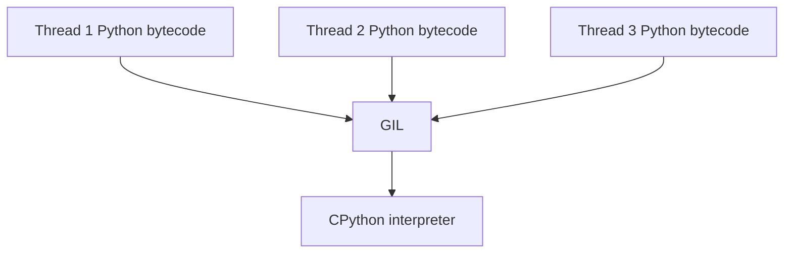
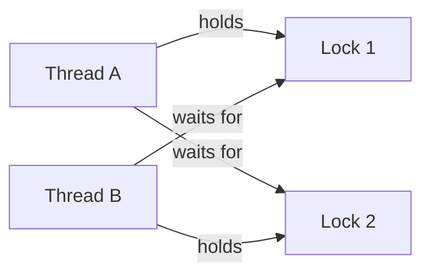

# Part 021 — Concurrency Model: Threads, Processes, GIL, dan Workload Classification

## 1. Tujuan Part Ini

Concurrency adalah salah satu area Python yang paling sering disalahpahami.

Banyak engineer bertanya:

- “Python lambat karena GIL?”
- “Thread di Python tidak berguna?”
- “Kapan pakai multiprocessing?”
- “Kapan pakai async?”
- “Apakah `ThreadPoolExecutor` bisa mempercepat CPU-bound work?”
- “Kenapa program concurrent malah lebih sulit debug?”
- “Apa beda concurrency dan parallelism?”
- “Apakah free-threaded Python mengubah semua best practice?”
- “Bagaimana memilih model yang benar untuk production?”

Part ini membangun mental model sebelum masuk async secara detail di part berikutnya.

Target setelah part ini:

1. Memahami concurrency vs parallelism.
2. Memahami I/O-bound vs CPU-bound workload.
3. Memahami GIL secara praktis.
4. Memahami thread dan process.
5. Memakai `concurrent.futures`.
6. Memahami `threading`, `multiprocessing`, `queue`.
7. Mengenali race condition dan deadlock.
8. Mendesain worker pool sederhana.
9. Memahami cancellation/timeout secara dasar.
10. Memilih thread/process/async berdasarkan workload.
11. Menghubungkan concurrency ke `case-tracker`.

---

## 2. Concurrency vs Parallelism

Concurrency:

> Mengelola banyak pekerjaan yang overlap dalam waktu.

Parallelism:

> Menjalankan banyak pekerjaan benar-benar bersamaan, biasanya di banyak CPU core.

Diagram:



```mermaid
gantt
    title Concurrency vs Parallelism
    dateFormat  X
    axisFormat %s

    section Single Core Concurrent
    Task A work       :a1, 0, 2
    Task B work       :b1, 2, 2
    Task A continue   :a2, 4, 2
    Task B continue   :b2, 6, 2

    section Multi Core Parallel
    Task C            :c1, 0, 4
    Task D            :d1, 0, 4
```

Concurrency bisa terjadi pada satu core dengan switching. Parallelism membutuhkan eksekusi bersamaan.

Analogi:

- Concurrency: satu chef mengurus beberapa masakan dengan menunggu oven/air mendidih.
- Parallelism: beberapa chef memasak secara bersamaan.

---

## 3. Workload Classification

Sebelum memilih tool, klasifikasikan workload.

| Workload | Bottleneck | Contoh | Biasanya Cocok |
|---|---|---|---|
| I/O-bound blocking | Menunggu network/file/database | HTTP calls, DB queries, file reads | Threads atau async |
| CPU-bound Python | CPU menjalankan Python bytecode | parsing besar, pure Python computation | Processes |
| CPU-bound native extension | Native code, mungkin release GIL | NumPy, compression, hashing tertentu | Threads bisa membantu, ukur |
| Mixed workload | I/O + CPU | ETL, scraping + parsing | Hybrid |
| Latency-sensitive async I/O | Banyak koneksi I/O | web server, websocket | async |
| Isolation needed | Fault/memory isolation | worker process | Processes |
| Simple background work | Sedikit task blocking | thread worker | Threads |

Rule utama:

> Pilih model berdasarkan bottleneck, bukan berdasarkan hype.

---

## 4. The GIL: Practical Mental Model

GIL adalah Global Interpreter Lock pada build CPython tradisional.

Praktisnya:

- Dalam build CPython dengan GIL, hanya satu thread yang menjalankan Python bytecode pada satu waktu.
- Thread tetap berguna untuk I/O-bound work karena thread lain bisa berjalan saat satu thread menunggu I/O.
- Untuk CPU-bound pure Python, thread biasanya tidak memberi parallel speedup yang berarti.
- Untuk memanfaatkan banyak CPU core pada CPU-bound Python, gunakan multiple processes atau native extension yang release GIL.
- Free-threaded CPython mulai tersedia sebagai build khusus sejak Python 3.13, tetapi ecosystem dan extension compatibility tetap perlu diperhatikan.

Diagram tradisional:



Hanya satu thread memegang GIL untuk Python bytecode pada waktu tertentu.

---

## 5. GIL Tidak Berarti Thread Tidak Berguna

Thread berguna ketika thread sering menunggu I/O.

Contoh:

- membaca banyak URL blocking;
- memanggil API eksternal;
- menunggu database;
- membaca banyak file kecil;
- menjalankan subprocess dan menunggu output;
- background log shipping;
- local file watcher.

Saat satu thread menunggu I/O, thread lain bisa melakukan pekerjaan.

### 5.1 Thread Buruk untuk CPU-bound Python

Contoh CPU-bound:

```python
def count_primes(limit: int) -> int:
    ...
```

Jika fungsi ini pure Python dan berat, menjalankannya di banyak thread mungkin tidak mempercepat karena GIL.

Gunakan:

- `ProcessPoolExecutor`;
- multiprocessing;
- native extension;
- vectorized library;
- algorithm improvement;
- external service;
- compiled path.

---

## 6. Free-Threaded Python: Apa Artinya untuk Strategi?

CPython modern memiliki dukungan build free-threading yang dapat menjalankan tanpa GIL. Namun ini bukan berarti semua code Python lama otomatis aman atau cepat dalam thread.

Kenapa tetap hati-hati?

- Code dengan shared mutable state tetap bisa race.
- C extension ecosystem perlu compatibility.
- Locking yang sebelumnya “tersembunyi” oleh GIL mungkin perlu dipikirkan.
- Performance bisa berbeda tergantung workload.
- Banyak deployment masih memakai build CPython dengan GIL.

Practical rule:

> Desain concurrency yang benar tetap menghindari shared mutable state berlebihan, memakai synchronization eksplisit, dan mengukur performa pada target runtime.

Jangan menjadikan “free-threading” alasan mengabaikan race condition.

---

## 7. Thread Basics

Thread adalah unit eksekusi dalam satu process dan berbagi memory.

```python
from threading import Thread


def worker(name: str) -> None:
    print(f"Hello from {name}")


thread = Thread(target=worker, args=("worker-1",))
thread.start()
thread.join()
```

Key methods:

- `start()` menjalankan thread;
- `join()` menunggu thread selesai;
- target function berisi pekerjaan.

### 7.1 Shared Memory

Thread dalam process yang sama berbagi object memory.

```python
items: list[int] = []


def worker() -> None:
    items.append(1)
```

Shared memory memudahkan komunikasi, tetapi membuka race condition.

---

## 8. Race Condition

Race condition terjadi ketika hasil bergantung pada timing antar task/thread.

Contoh konseptual:

```python
counter = 0


def increment() -> None:
    global counter
    counter += 1
```

`counter += 1` terlihat satu operasi, tetapi terdiri dari beberapa langkah:

1. read counter;
2. add one;
3. write counter.

Jika dua thread interleave, update bisa hilang.

### 8.1 Lock

Gunakan lock untuk critical section.

```python
from threading import Lock

counter = 0
counter_lock = Lock()


def increment() -> None:
    global counter

    with counter_lock:
        counter += 1
```

`with lock:` memastikan hanya satu thread masuk critical section.

---

## 9. Locks Are Not Free

Lock menyelesaikan race tertentu, tetapi bisa menimbulkan:

- contention;
- deadlock;
- complexity;
- performance loss;
- hidden ordering dependency.

Rule:

1. Minimalkan shared mutable state.
2. Prefer message passing via queue.
3. Lock hanya area kecil.
4. Jangan melakukan I/O lama sambil memegang lock.
5. Tentukan lock ordering jika banyak lock.
6. Test concurrency behavior, tetapi sadar tests tidak selalu menangkap race.

---

## 10. Deadlock

Deadlock terjadi ketika task saling menunggu selamanya.

Contoh:

```text
Thread A holds lock_1, waits for lock_2.
Thread B holds lock_2, waits for lock_1.
```

Diagram:



Avoid:

- consistent lock ordering;
- fewer locks;
- timeouts;
- higher-level abstractions;
- queue/message passing.

---

## 11. Queue: Message Passing

`queue.Queue` is thread-safe.

```python
from queue import Queue
from threading import Thread

queue: Queue[str] = Queue()


def worker() -> None:
    while True:
        item = queue.get()

        try:
            if item == "STOP":
                return

            print(f"Processing {item}")
        finally:
            queue.task_done()


thread = Thread(target=worker)
thread.start()

queue.put("CASE-001")
queue.put("STOP")
queue.join()
thread.join()
```

Queue helps avoid direct shared mutable state.

---

## 12. ThreadPoolExecutor

For many cases, prefer `concurrent.futures.ThreadPoolExecutor`.

```python
from concurrent.futures import ThreadPoolExecutor


def fetch_case(case_id: str) -> str:
    return f"case:{case_id}"


case_ids = ["CASE-001", "CASE-002", "CASE-003"]

with ThreadPoolExecutor(max_workers=4) as executor:
    results = list(executor.map(fetch_case, case_ids))

print(results)
```

Benefits:

- manages worker threads;
- returns futures;
- handles joining via context manager;
- simpler than manual threads.

---

## 13. Futures

`Future` represents a result that will be available later.

```python
from concurrent.futures import ThreadPoolExecutor

with ThreadPoolExecutor(max_workers=2) as executor:
    future = executor.submit(fetch_case, "CASE-001")

    result = future.result(timeout=5)
```

Methods:

- `result()`;
- `exception()`;
- `done()`;
- `cancel()`;
- `add_done_callback()`.

If function raises exception, `future.result()` re-raises it.

---

## 14. `as_completed`

Process results as they finish.

```python
from concurrent.futures import ThreadPoolExecutor, as_completed

with ThreadPoolExecutor(max_workers=4) as executor:
    futures = {
        executor.submit(fetch_case, case_id): case_id
        for case_id in case_ids
    }

    for future in as_completed(futures):
        case_id = futures[future]

        try:
            result = future.result()
        except Exception as error:
            print(f"{case_id} failed: {error}")
        else:
            print(f"{case_id}: {result}")
```

Use when:

- tasks have variable duration;
- you want early results;
- you need per-task error handling.

---

## 15. Timeout

Never assume external work finishes.

```python
result = future.result(timeout=5)
```

Timeout raises `TimeoutError`.

For executor map, timeout exists but per-task handling with futures is often clearer.

Timeout strategy:

- set timeouts at external calls;
- set future result timeouts if needed;
- decide retry behavior;
- log context;
- make cancellation best-effort;
- avoid hanging process indefinitely.

---

## 16. Process Basics

Processes have separate memory spaces.

`ProcessPoolExecutor`:

```python
from concurrent.futures import ProcessPoolExecutor


def compute_score(case_id: str) -> int:
    total = 0
    for number in range(1_000_000):
        total += number % 7
    return total


with ProcessPoolExecutor() as executor:
    scores = list(executor.map(compute_score, ["CASE-001", "CASE-002"]))
```

Processes can run Python bytecode truly in parallel on multiple CPU cores in traditional CPython because each process has its own interpreter/GIL.

Trade-offs:

- startup overhead;
- serialization/pickling overhead;
- data copying;
- harder shared state;
- platform differences;
- function/object must be picklable;
- logging/config needs thought.

---

## 17. Pickling and Process Pools

Arguments and return values for process pools must be serializable/picklable.

Good:

```python
def compute(case_id: str) -> int:
    ...
```

Bad:

- open file handles;
- database connections;
- lambdas;
- nested functions in some contexts;
- unpicklable objects;
- huge object graphs.

Process pool tasks should receive simple data and return simple data.

---

## 18. `if __name__ == "__main__"` for Multiprocessing

On platforms using spawn, multiprocessing imports the main module. You must protect process creation:

```python
def main() -> None:
    with ProcessPoolExecutor() as executor:
        ...


if __name__ == "__main__":
    main()
```

Without this, child processes can recursively create more processes.

For package CLI:

```python
def main(argv: list[str] | None = None) -> int:
    ...
```

Entry point calls it safely, but direct scripts using multiprocessing should still use the guard.

---

## 19. CPU-bound vs I/O-bound Examples

### 19.1 I/O-bound Thread Example

```python
from concurrent.futures import ThreadPoolExecutor
from pathlib import Path


def read_file(path: Path) -> str:
    return path.read_text(encoding="utf-8")


with ThreadPoolExecutor(max_workers=8) as executor:
    contents = list(executor.map(read_file, paths))
```

Could help if many file reads are slow/blocking.

### 19.2 CPU-bound Process Example

```python
from concurrent.futures import ProcessPoolExecutor


def parse_large_payload(payload: str) -> ParsedResult:
    ...


with ProcessPoolExecutor() as executor:
    results = list(executor.map(parse_large_payload, payloads))
```

---

## 20. Backpressure

Backpressure means preventing producers from overwhelming consumers.

Bad:

```python
for item in huge_items:
    executor.submit(process, item)
```

This can queue too many futures and use too much memory.

Better batching:

```python
from itertools import islice


def batched(iterable, size: int):
    iterator = iter(iterable)

    while batch := list(islice(iterator, size)):
        yield batch
```

Process batch:

```python
for batch in batched(huge_items, 100):
    with ThreadPoolExecutor(max_workers=10) as executor:
        list(executor.map(process, batch))
```

Or use bounded queue/worker model.

---

## 21. Worker Pool with Queue

```python
from queue import Queue
from threading import Thread

STOP = object()


def worker(queue: Queue[object]) -> None:
    while True:
        item = queue.get()

        try:
            if item is STOP:
                return

            process_item(item)
        finally:
            queue.task_done()


queue: Queue[object] = Queue(maxsize=100)
threads = [Thread(target=worker, args=(queue,)) for _ in range(4)]

for thread in threads:
    thread.start()

for item in items:
    queue.put(item)

for _ in threads:
    queue.put(STOP)

queue.join()

for thread in threads:
    thread.join()
```

`maxsize` gives backpressure. Producer blocks if queue is full.

---

## 22. Cancellation Is Hard

For threads, cancellation is cooperative. You generally cannot safely kill a thread.

Use event:

```python
from threading import Event

stop_event = Event()


def worker() -> None:
    while not stop_event.is_set():
        do_one_unit_of_work()
```

Signal:

```python
stop_event.set()
```

For process pools, you can terminate processes in some APIs, but graceful cancellation still requires design.

Rule:

> Design tasks as small units with timeouts and cooperative stop signals.

---

## 23. Shared State Strategy

Prefer:

1. No shared mutable state.
2. Immutable input/output.
3. Queue message passing.
4. Repository/database with transaction.
5. Lock only when necessary.
6. Atomic operations at storage boundary.
7. Idempotent tasks.

Avoid:

- many threads mutating same list/dict;
- global caches with mutation;
- long critical sections;
- hidden singleton state;
- “GIL makes it safe” assumptions.

---

## 24. Thread-Safe Does Not Mean Logic-Safe

Some operations may be individually safe at interpreter level, but your business logic can still race.

Example:

```python
if case_id not in case_by_id:
    case_by_id[case_id] = case
```

Two threads can both pass the check before either writes.

Use lock around check-and-set:

```python
with lock:
    if case_id not in case_by_id:
        case_by_id[case_id] = case
```

Business operations often need transaction semantics, not just data structure safety.

---

## 25. Idempotency

Concurrent/distributed systems often retry.

Idempotent operation:

```text
set status to SUBMITTED if current status is DRAFT and transition id not seen
```

Non-idempotent:

```text
append note blindly
```

If retry happens, note duplicates.

For background workers:

- use idempotency keys;
- record processed event IDs;
- make operations safe to repeat;
- design state transitions carefully.

This matters later for queues and distributed systems.

---

## 26. Case Tracker: Where Concurrency Might Appear

`case-tracker` current JSON file is single-user.

Potential future concurrency:

1. Bulk import CSV with validation in parallel.
2. Export/report generation.
3. Fetch enrichment data from external API.
4. Process many cases with independent CPU scoring.
5. Background notification sending.
6. Multi-user server.
7. Scheduled SLA checks.
8. Audit log writing.

Decision examples:

| Feature | Likely Model |
|---|---|
| Fetch external data per case | Threads or async |
| CPU risk scoring pure Python | Processes |
| Bulk CSV validation simple | Single-thread first, maybe process pool |
| Multi-user server | Database + async or threaded server |
| JSON file multi-writer | Avoid; use SQLite/database |
| Notification sending | Threads/async with retry |

---

## 27. Case Tracker: Concurrent Bulk Validation

Example CPU-light validation with threads is probably unnecessary. Single-thread is simpler.

```python
def validate_case_data(data: CaseData) -> Case:
    return case_from_dict(data)


def validate_many_case_data(items: Iterable[CaseData]) -> list[Case]:
    return [validate_case_data(item) for item in items]
```

Only add concurrency if measurement shows bottleneck.

If validation includes external API call:

```python
def enrich_case(case: Case) -> EnrichedCase:
    response = external_client.fetch(case.id)
    ...
```

Thread pool might help.

---

## 28. Case Tracker: External API Enrichment with Threads

```python
from concurrent.futures import ThreadPoolExecutor, as_completed


def enrich_cases(cases: list[Case], client: CaseEnrichmentClient) -> list[EnrichedCase]:
    enriched: list[EnrichedCase] = []

    with ThreadPoolExecutor(max_workers=8) as executor:
        futures = {
            executor.submit(client.enrich, case): case
            for case in cases
        }

        for future in as_completed(futures):
            case = futures[future]

            try:
                enriched.append(future.result(timeout=10))
            except Exception as error:
                logger.warning("event=case_enrichment_failed case_id=%s error=%s", case.id, error)

    return enriched
```

Caveats:

- client must be thread-safe or per-thread;
- timeouts should be at HTTP call level too;
- output order may change;
- error policy must be explicit;
- rate limits/backpressure matter.

---

## 29. Preserving Order

`executor.map` preserves input order.

```python
results = list(executor.map(process_case, cases))
```

`as_completed` yields completion order.

If preserving order matters with `as_completed`, store index:

```python
results: list[Result | None] = [None] * len(cases)

with ThreadPoolExecutor(max_workers=8) as executor:
    futures = {
        executor.submit(process_case, case): index
        for index, case in enumerate(cases)
    }

    for future in as_completed(futures):
        index = futures[future]
        results[index] = future.result()
```

---

## 30. Logging in Concurrent Code

Include context.

```python
logger.info(
    "event=case_processed worker=%s case_id=%s",
    worker_name,
    case.id,
)
```

Thread name:

```python
import threading

thread_name = threading.current_thread().name
```

Logging module is thread-safe for common use, but log lines from different threads interleave in time. Context helps.

For processes, logging configuration may need to be set per process.

---

## 31. Testing Concurrent Code

Prefer testing deterministic pieces:

- pure worker function;
- queue behavior with small input;
- timeout/cancellation logic with fake dependency;
- no real sleeps if possible.

Avoid brittle timing tests.

Bad:

```python
time.sleep(0.1)
assert something
```

Better:

- use event/queue synchronization;
- inject fake executor for unit tests;
- keep integration tests limited;
- test idempotency separately.

---

## 32. Executor as Dependency

For testability, you can inject executor-like dependency.

But do not over-abstract too early.

Simple function:

```python
def process_cases_concurrently(cases: list[Case]) -> list[Result]:
    with ThreadPoolExecutor(max_workers=8) as executor:
        return list(executor.map(process_case, cases))
```

If tests become hard or executor policy varies:

```python
def process_cases(
    cases: list[Case],
    executor: Executor,
) -> list[Result]:
    return list(executor.map(process_case, cases))
```

`concurrent.futures.Executor` is base interface.

---

## 33. Decision Framework

Ask:

1. Is there a measured bottleneck?
2. Is workload I/O-bound or CPU-bound?
3. Is task independent?
4. Is ordering required?
5. Is result aggregation simple?
6. Is shared state needed?
7. What is error policy?
8. What is timeout policy?
9. What is cancellation policy?
10. What is backpressure strategy?
11. What is observability strategy?
12. Can this be simpler single-threaded?
13. Is external dependency thread-safe?
14. Is data picklable for processes?
15. Is deployment compatible with process spawning?

Then choose.

---

## 34. Tool Selection Cheat Sheet

| Need | Start With |
|---|---|
| Simple sequential task | Plain loop |
| Many blocking I/O calls | `ThreadPoolExecutor` |
| CPU-bound pure Python | `ProcessPoolExecutor` |
| Many sockets/connections | `asyncio` or async framework |
| Background worker thread | `threading.Thread` + `Queue` |
| Producer/consumer threads | `queue.Queue` |
| Shared counter/state | Lock or avoid sharing |
| Multi-writer persistence | Database/transactions |
| Long-running service concurrency | Framework model + observability |
| Simple CLI | Avoid concurrency until measured |

---

## 35. Common Concurrency Mistakes

1. Adding concurrency before measuring.
2. Using threads for CPU-bound Python and expecting speedup.
3. Sharing mutable dict/list across threads without design.
4. Holding locks during slow I/O.
5. No timeout on external calls.
6. Submitting unbounded futures.
7. Ignoring exceptions in futures.
8. Assuming `executor.submit` means success.
9. Forgetting `future.result()`.
10. Process pool with unpicklable arguments.
11. No `if __name__ == "__main__"` in multiprocessing script.
12. Logging without context.
13. Tests based on arbitrary sleeps.
14. No cancellation story.
15. No idempotency for retried tasks.

---

## 36. Practice: Classify Workload

Classify:

1. Read 10,000 small local files.
2. Call 500 HTTP endpoints.
3. Calculate prime numbers up to huge limit.
4. Parse 5GB JSONL line by line.
5. Send 1,000 emails.
6. Resize images using native library.
7. Run SQL queries against database.
8. Compute pure Python risk score for 1M cases.
9. Watch directory for changes.
10. Serve websocket connections.

For each:

- I/O-bound or CPU-bound?
- thread/process/async/plain loop?
- what timeout/backpressure?
- what error policy?

---

## 37. Practice: ThreadPool for I/O Simulation

```python
from concurrent.futures import ThreadPoolExecutor
from time import sleep


def fetch(case_id: str) -> str:
    sleep(0.1)
    return f"fetched:{case_id}"


def fetch_all(case_ids: list[str]) -> list[str]:
    with ThreadPoolExecutor(max_workers=4) as executor:
        return list(executor.map(fetch, case_ids))
```

Measure sequential vs threaded with `perf_counter`.

---

## 38. Practice: ProcessPool for CPU Simulation

```python
from concurrent.futures import ProcessPoolExecutor


def cpu_work(number: int) -> int:
    total = 0
    for value in range(number):
        total += value % 7
    return total


def run_cpu_work(numbers: list[int]) -> list[int]:
    with ProcessPoolExecutor() as executor:
        return list(executor.map(cpu_work, numbers))
```

Run only under proper main guard in script.

---

## 39. Practice: Future Exceptions

```python
def might_fail(value: int) -> int:
    if value == 2:
        raise ValueError("bad value")
    return value * 2
```

Use `as_completed` and handle per future.

Expected:

- failed item logged/collected;
- successful items returned;
- no silent failure.

---

## 40. Practice: Bounded Queue Worker

Build:

```python
def start_workers(worker_count: int, queue: Queue[object]) -> list[Thread]:
    ...
```

Requirements:

- `STOP` sentinel;
- `queue.task_done`;
- `queue.join`;
- all threads joined;
- errors logged.

Keep it small.

---

## 41. Self-Check

Jawab tanpa melihat materi:

1. Apa beda concurrency dan parallelism?
2. Apa itu I/O-bound workload?
3. Apa itu CPU-bound workload?
4. Apa GIL secara praktis?
5. Kenapa thread tetap berguna di Python?
6. Kenapa CPU-bound pure Python biasanya butuh process?
7. Apa arti free-threaded Python secara praktis?
8. Apa itu race condition?
9. Apa itu deadlock?
10. Kapan memakai lock?
11. Kenapa queue membantu?
12. Apa fungsi `ThreadPoolExecutor`?
13. Apa fungsi `ProcessPoolExecutor`?
14. Apa itu Future?
15. Kenapa harus memanggil `future.result()`?
16. Apa beda `map` dan `as_completed`?
17. Apa itu backpressure?
18. Kenapa cancellation sulit?
19. Kenapa idempotency penting?
20. Apa concurrency mistake paling berbahaya?

---

## 42. Definition of Done Part 021

Kamu selesai part ini jika bisa:

1. Menjelaskan concurrency vs parallelism.
2. Mengklasifikasikan workload.
3. Menjelaskan GIL dan implikasinya.
4. Menulis Thread sederhana.
5. Menulis ThreadPoolExecutor.
6. Menulis ProcessPoolExecutor.
7. Menangani Future exception.
8. Memakai timeout.
9. Menjelaskan race condition.
10. Memakai Lock.
11. Memakai Queue.
12. Menjelaskan deadlock.
13. Menjelaskan backpressure.
14. Menjelaskan cancellation cooperative.
15. Memilih model concurrency untuk skenario nyata.

---

## 43. Ringkasan

Concurrency adalah desain, bukan sekadar API.

Inti part ini:

- concurrency mengelola overlap, parallelism menjalankan bersamaan;
- workload classification menentukan tool;
- thread cocok untuk banyak blocking I/O;
- process cocok untuk CPU-bound pure Python;
- GIL membatasi eksekusi Python bytecode paralel pada build tradisional;
- free-threaded Python tidak menghapus kebutuhan desain thread-safe;
- shared mutable state adalah sumber race;
- queue/message passing sering lebih aman daripada shared state;
- `concurrent.futures` adalah API high-level yang baik;
- future exception harus dikonsumsi;
- timeout, backpressure, cancellation, dan idempotency harus dipikirkan;
- jangan menambah concurrency sebelum bottleneck jelas.

Part berikutnya akan membahas async Python: event loop, coroutine, task, cancellation, backpressure, dan async design untuk I/O concurrency.

---

## 44. Referensi

- Python Documentation — `threading`.
- Python Documentation — `multiprocessing`.
- Python Documentation — `concurrent.futures`.
- Python Documentation — `queue`.
- Python Documentation — Global Interpreter Lock glossary.
- Python Documentation — Python support for free threading.
- Python Documentation — Concurrent Execution overview.
