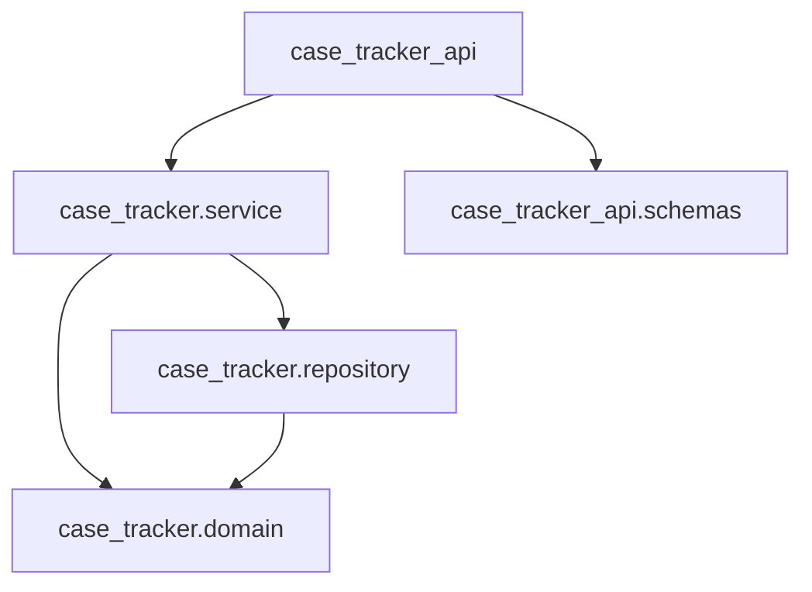
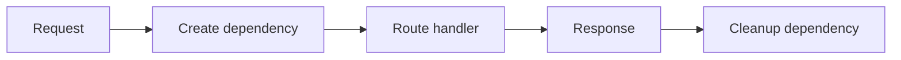
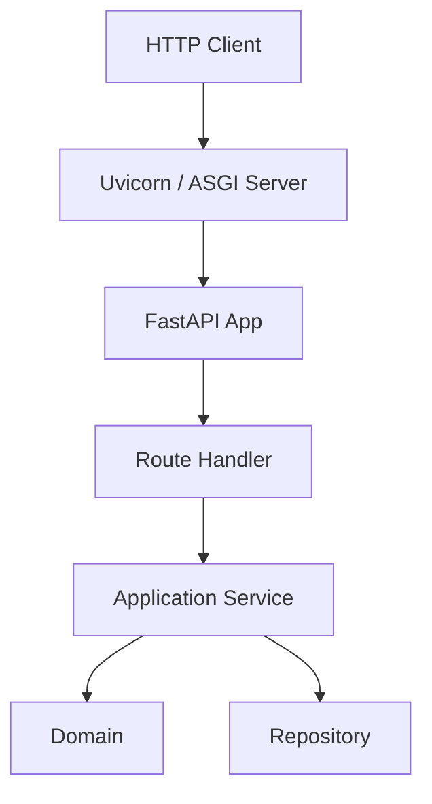

# Part 026 — API Development with Python: FastAPI, Pydantic, dan Service Boundaries

## 1. Tujuan Part Ini

Banyak Python production system berbentuk API service.

FastAPI populer karena menggabungkan:

- Python type hints;
- Pydantic validation;
- Starlette/ASGI runtime;
- dependency injection;
- automatic OpenAPI docs;
- sync/async route support;
- ergonomi tinggi.

Tetapi API yang baik bukan sekadar route function.

API yang baik punya boundary jelas:

```text
HTTP Request
  -> Pydantic Request Schema
  -> Application Service
  -> Domain Model
  -> Repository / Infrastructure
  -> Pydantic Response Schema
  -> HTTP Response
```

Kesalahan umum:

- domain model menjadi Pydantic model tanpa batas;
- route handler berisi business logic;
- HTTPException dilempar dari domain layer;
- database session bocor ke domain;
- async route memanggil blocking dependency tanpa sadar;
- error mapping tidak konsisten;
- response schema tidak stabil;
- status code salah;
- validation dianggap sama dengan authorization;
- OpenAPI dianggap dokumentasi cukup tanpa semantic design;
- test hanya happy path;
- dependency injection terlalu magic;
- service boundary tidak ada.

Part ini membahas API development dengan fokus software engineering.

Target setelah part ini:

1. Memahami HTTP/API boundary.
2. Memahami FastAPI app dan route.
3. Memahami Pydantic model sebagai boundary schema.
4. Membedakan schema model dan domain model.
5. Memetakan request ke service command.
6. Memetakan domain result ke response.
7. Memakai dependency injection dengan `Depends`.
8. Mendesain error mapping.
9. Memahami sync/async route decision.
10. Menulis API tests.
11. Mendesain `case-tracker` API version awal.
12. Menghindari framework leakage ke domain.

---

## 2. HTTP Mental Model

API HTTP punya konsep dasar:

| Concept | Contoh |
|---|---|
| Method | `GET`, `POST`, `PATCH`, `DELETE` |
| Path | `/cases/{case_id}` |
| Query | `?status=DRAFT` |
| Header | `Authorization`, `Content-Type` |
| Body | JSON request payload |
| Status code | `200`, `201`, `400`, `404`, `409`, `500` |
| Response body | JSON response |
| Idempotency | Aman diulang atau tidak |
| Cacheability | Bisa cache atau tidak |

Common method semantics:

| Method | Use |
|---|---|
| `GET` | Read |
| `POST` | Create/action non-idempotent |
| `PUT` | Replace full resource |
| `PATCH` | Partial update/transition |
| `DELETE` | Delete/remove |

Status code examples:

| Code | Meaning |
|---:|---|
| 200 | OK |
| 201 | Created |
| 204 | No Content |
| 400 | Bad Request |
| 401 | Unauthorized |
| 403 | Forbidden |
| 404 | Not Found |
| 409 | Conflict |
| 422 | Validation error often used by FastAPI/Pydantic |
| 500 | Internal Server Error |

---

## 3. FastAPI Minimal App

```python
from fastapi import FastAPI

app = FastAPI(title="Case Tracker API")


@app.get("/health")
def health() -> dict[str, str]:
    return {"status": "ok"}
```

Run with ASGI server such as uvicorn:

```bash
uvicorn case_tracker_api.main:app --reload
```

FastAPI automatically exposes interactive docs by default:

```text
/docs
/redoc
/openapi.json
```

Docs are useful, but they do not replace API design discipline.

---

## 4. Project Structure

For API evolution:

```text
src/
  case_tracker/
    domain.py
    service.py
    repository.py
    storage.py
  case_tracker_api/
    __init__.py
    main.py
    schemas.py
    dependencies.py
    error_handlers.py
    routes/
      __init__.py
      cases.py
tests/
  test_api_cases.py
```

Why separate `case_tracker_api`?

- domain/application package remains framework-agnostic;
- API boundary can import service/domain;
- domain does not import FastAPI;
- future CLI and API can share service layer.

Import direction:



Forbidden:

```text
domain -> fastapi
service -> fastapi
repository -> fastapi
```

---

## 5. Pydantic as Boundary Schema

Pydantic models validate external data.

```python
from pydantic import BaseModel, Field


class CreateCaseRequest(BaseModel):
    title: str = Field(min_length=1, max_length=200)
```

Response:

```python
class CaseResponse(BaseModel):
    id: str
    title: str
    status: str
    notes: list[str]
```

Route:

```python
@app.post("/cases", response_model=CaseResponse, status_code=201)
def create_case(request: CreateCaseRequest) -> CaseResponse:
    ...
```

Pydantic validates request body and serializes response.

Important:

> Pydantic model is API boundary schema, not automatically your domain model.

---

## 6. Domain Model vs API Schema

Domain:

```python
@dataclass
class Case:
    id: CaseId
    title: str
    status: CaseStatus
    notes: list[str]
```

API request:

```python
class CreateCaseRequest(BaseModel):
    title: str
```

API response:

```python
class CaseResponse(BaseModel):
    id: str
    title: str
    status: str
    notes: list[str]
```

Mapping:

```python
def case_to_response(case: Case) -> CaseResponse:
    return CaseResponse(
        id=case.id.value,
        title=case.title,
        status=case.status.value,
        notes=list(case.notes),
    )
```

Why mapping is good:

- API schema can evolve separately;
- domain can use value objects/enums;
- response can hide internal fields;
- request can have API-specific validation;
- framework does not leak into domain.

---

## 7. Pydantic Validation Is Boundary Validation

Pydantic validates shape/type constraints.

Example:

```python
class TransitionCaseRequest(BaseModel):
    target_status: str
```

But domain still validates business rule:

```python
case.transition_to(CaseStatus(request.target_status))
```

Invalid enum string might be boundary validation if schema uses enum.

Better:

```python
from enum import Enum


class CaseStatusSchema(str, Enum):
    DRAFT = "DRAFT"
    SUBMITTED = "SUBMITTED"
    UNDER_REVIEW = "UNDER_REVIEW"
    ESCALATED = "ESCALATED"
    CLOSED = "CLOSED"


class TransitionCaseRequest(BaseModel):
    target_status: CaseStatusSchema
```

Then map:

```python
target_status = CaseStatus(request.target_status.value)
```

Pydantic validation does not replace domain invariant.

---

## 8. Pydantic v2 Essentials

Pydantic v2 commonly uses:

- `BaseModel`;
- `Field`;
- `model_validate`;
- `model_dump`;
- `ConfigDict`;
- validators.

Example:

```python
class CaseResponse(BaseModel):
    id: str
    title: str
    status: str

data = {"id": "CASE-001", "title": "Late reporting", "status": "DRAFT"}

model = CaseResponse.model_validate(data)
payload = model.model_dump()
```

`model_validate` validates input into model.
`model_dump` converts model to dict.

Do not assume static type hints alone validate runtime data; Pydantic performs runtime validation for model creation.

---

## 9. Request Command Object

Route should not contain business logic.

Request schema:

```python
class CreateCaseRequest(BaseModel):
    title: str = Field(min_length=1, max_length=200)
```

Application command:

```python
@dataclass(frozen=True)
class CreateCaseCommand:
    title: str
```

Route mapping:

```python
command = CreateCaseCommand(title=request.title)
case = service.create_case(command)
```

For small apps, passing `title` directly is okay. Command object becomes useful when use case input grows:

- actor;
- priority;
- source;
- idempotency key;
- metadata;
- request id.

---

## 10. Service Boundary

Service should be framework-agnostic.

```python
class CaseService:
    def __init__(self, repository: CaseRepository) -> None:
        self._repository = repository

    def create_case(self, title: str) -> Case:
        cases = self._repository.list()
        case = create_case(title)
        cases.append(case)
        self._repository.save_all(cases)
        return case

    def get_case(self, case_id: CaseId) -> Case:
        cases = self._repository.list()
        return get_case_from_list(cases, case_id)
```

No `Request`, no `HTTPException`, no `Depends`.

This service can be used by:

- CLI;
- FastAPI;
- worker;
- tests;
- future gRPC/message handler.

---

## 11. FastAPI Dependency Injection

FastAPI provides dependency injection via `Depends`.

Repository dependency:

```python
from pathlib import Path

from fastapi import Depends


def get_repository() -> CaseRepository:
    return JsonCaseRepository(Path("cases.json"))


def get_case_service(
    repository: CaseRepository = Depends(get_repository),
) -> CaseService:
    return CaseService(repository)
```

Route:

```python
@app.post("/cases", response_model=CaseResponse, status_code=201)
def create_case_endpoint(
    request: CreateCaseRequest,
    service: CaseService = Depends(get_case_service),
) -> CaseResponse:
    case = service.create_case(request.title)
    return case_to_response(case)
```

Dependency functions are boundary wiring.

---

## 12. Dependency Scope and Lifecycle

For simple JSON repository, dependency creation is cheap.

For database sessions, lifecycle matters:

```python
def get_session():
    with Session(engine) as session:
        yield session
```

FastAPI supports dependencies with `yield` for cleanup.

Concept:



Do not create expensive global mutable dependencies casually. Be explicit about lifecycle.

---

## 13. Configuration Dependency

Avoid hardcoded path:

```python
def get_repository() -> CaseRepository:
    return JsonCaseRepository(Path("cases.json"))
```

Better:

```python
@dataclass(frozen=True)
class ApiConfig:
    store_path: Path


def get_config() -> ApiConfig:
    return ApiConfig(store_path=Path(os.environ.get("CASE_TRACKER_STORE", "cases.json")))


def get_repository(config: ApiConfig = Depends(get_config)) -> CaseRepository:
    return JsonCaseRepository(config.store_path)
```

For production, config loading should be centralized and tested.

---

## 14. Error Mapping

Domain/application exceptions must be mapped to HTTP.

Service may raise:

- `CaseNotFoundError`;
- `InvalidCaseTransitionError`;
- `CaseStoreCorruptedError`;
- `ValueError` for invalid domain value.

API layer maps:

| Exception | HTTP |
|---|---:|
| `CaseNotFoundError` | 404 |
| `InvalidCaseTransitionError` | 409 |
| Invalid request schema | 422 by FastAPI |
| Invalid domain input | 400 |
| Store unavailable/corrupt | 500 or 503 depending semantics |
| Unexpected exception | 500 |

Simple route local handling:

```python
from fastapi import HTTPException


try:
    case = service.get_case(CaseId(case_id))
except CaseNotFoundError as error:
    raise HTTPException(status_code=404, detail=str(error)) from error
```

Better centralized exception handlers for consistency.

---

## 15. Exception Handlers

```python
from fastapi import FastAPI, Request
from fastapi.responses import JSONResponse

app = FastAPI()


@app.exception_handler(CaseNotFoundError)
async def case_not_found_handler(request: Request, error: CaseNotFoundError) -> JSONResponse:
    return JSONResponse(
        status_code=404,
        content={
            "error": "case_not_found",
            "message": str(error),
        },
    )
```

For invalid transition:

```python
@app.exception_handler(InvalidCaseTransitionError)
async def invalid_transition_handler(
    request: Request,
    error: InvalidCaseTransitionError,
) -> JSONResponse:
    return JSONResponse(
        status_code=409,
        content={
            "error": "invalid_case_transition",
            "message": str(error),
            "from_status": error.from_status.value,
            "to_status": error.to_status.value,
        },
    )
```

Benefits:

- consistent errors;
- routes stay clean;
- mapping centralized.

---

## 16. Error Response Schema

Define consistent error shape:

```python
class ErrorResponse(BaseModel):
    error: str
    message: str
    details: dict[str, str] = {}
```

Example:

```json
{
  "error": "case_not_found",
  "message": "Case not found: CASE-001",
  "details": {}
}
```

Consistent errors help clients.

Avoid leaking internal stack traces in response.

Logs can include internal diagnostics.

---

## 17. Route Design for Case Tracker

Resource endpoints:

```text
GET    /health
POST   /cases
GET    /cases
GET    /cases/{case_id}
POST   /cases/{case_id}/notes
PATCH  /cases/{case_id}/status
```

Why `PATCH /cases/{case_id}/status`?

Status transition is partial update of case state.

Alternative:

```text
POST /cases/{case_id}/transitions
```

This can be better if transition is a domain action with audit/reason.

For learning:

```text
PATCH /cases/{case_id}/status
```

is simple.

---

## 18. Schemas

```python
class CreateCaseRequest(BaseModel):
    title: str = Field(min_length=1, max_length=200)


class AddNoteRequest(BaseModel):
    note: str = Field(min_length=1, max_length=2000)


class TransitionCaseRequest(BaseModel):
    target_status: CaseStatusSchema


class CaseResponse(BaseModel):
    id: str
    title: str
    status: CaseStatusSchema
    notes: list[str]
```

If response uses enum schema:

```python
status=CaseStatusSchema(case.status.value)
```

---

## 19. Case Mapper

```python
def case_to_response(case: Case) -> CaseResponse:
    return CaseResponse(
        id=case.id.value,
        title=case.title,
        status=CaseStatusSchema(case.status.value),
        notes=list(case.notes),
    )
```

List response:

```python
class CaseListResponse(BaseModel):
    cases: list[CaseResponse]
```

Why envelope list?

```json
{
  "cases": [...]
}
```

Benefits:

- metadata later;
- pagination fields;
- total count;
- links.

---

## 20. Pagination

Never assume list endpoint can return everything forever.

Query parameters:

```python
@app.get("/cases", response_model=CaseListResponse)
def list_cases(
    limit: int = Query(default=100, ge=1, le=1000),
    offset: int = Query(default=0, ge=0),
    service: CaseService = Depends(get_case_service),
) -> CaseListResponse:
    cases = service.list_cases()
    page = cases[offset : offset + limit]
    return CaseListResponse(cases=[case_to_response(case) for case in page])
```

For JSON file, slicing in memory is okay. For database, pagination should happen in query.

Response could include:

```python
class CaseListResponse(BaseModel):
    cases: list[CaseResponse]
    limit: int
    offset: int
    total: int
```

---

## 21. Filtering

Query:

```python
@app.get("/cases")
def list_cases(status: CaseStatusSchema | None = None):
    ...
```

Map:

```python
domain_status = CaseStatus(status.value) if status is not None else None
```

Service:

```python
def list_cases(self, status: CaseStatus | None = None) -> list[Case]:
    cases = self._repository.list()

    if status is None:
        return cases

    return [case for case in cases if case.status is status]
```

Keep filtering rule in service/repository, not duplicated in route.

---

## 22. Status Codes

Create:

```python
@app.post("/cases", status_code=201)
```

Get:

```python
@app.get("/cases/{case_id}", status_code=200)
```

No content:

```python
@app.delete("/cases/{case_id}", status_code=204)
```

Invalid transition conflict:

```text
409 Conflict
```

Why 409? The request may be syntactically valid, but conflicts with current resource state.

Validation failure from Pydantic often returns 422. Some APIs prefer 400; know your API standard.

---

## 23. Sync vs Async Routes

FastAPI supports both:

```python
@app.get("/sync")
def sync_route():
    ...


@app.get("/async")
async def async_route():
    ...
```

Use sync route when dependencies are blocking sync:

- file I/O with standard library;
- sync database driver;
- CPU-light service;
- legacy sync code.

Use async route when you await async dependencies:

- async HTTP client;
- async database driver;
- async message broker.

Do not write `async def` and then call blocking heavy code directly.

If you need to call blocking code from async route, consider threadpool/offload, but design carefully.

For current JSON file `case-tracker`, sync routes are fine.

---

## 24. ASGI Mental Model

FastAPI runs on ASGI server.

Conceptual stack:



ASGI enables async interface between server and app.

You do not need to deeply implement ASGI early, but understand the server/application boundary.

---

## 25. OpenAPI

FastAPI generates OpenAPI schema from routes, type hints, Pydantic models, and metadata.

Benefits:

- interactive docs;
- client generation;
- API discoverability;
- contract review;
- integration with tooling.

But generated OpenAPI is only as good as:

- schema names;
- descriptions;
- response models;
- status codes;
- error documentation;
- route design.

Add metadata:

```python
app = FastAPI(
    title="Case Tracker API",
    version="0.1.0",
    description="API for managing regulatory case lifecycle.",
)
```

---

## 26. Tags and Descriptions

```python
@app.post(
    "/cases",
    response_model=CaseResponse,
    status_code=201,
    tags=["cases"],
    summary="Create a case",
)
def create_case_endpoint(...):
    ...
```

Use route metadata to improve docs.

Avoid generated docs that are technically present but semantically poor.

---

## 27. Request IDs and Logging

API should log request context.

Middleware can add request id.

Simple conceptual middleware:

```python
from uuid import uuid4
from fastapi import Request


@app.middleware("http")
async def add_request_id(request: Request, call_next):
    request_id = request.headers.get("X-Request-ID", str(uuid4()))
    response = await call_next(request)
    response.headers["X-Request-ID"] = request_id
    return response
```

For production, integrate with logging context. Keep sensitive data out of logs.

---

## 28. Authentication and Authorization Preview

Authentication:

> Who are you?

Authorization:

> Are you allowed to do this?

Do not confuse with validation.

Example future:

```python
def get_current_user(...) -> User:
    ...
```

Route:

```python
def create_case_endpoint(
    request: CreateCaseRequest,
    current_user: User = Depends(get_current_user),
    service: CaseService = Depends(get_case_service),
):
    ...
```

Authorization belongs in service/policy layer, not just route decorator, if it affects domain/application behavior.

Detailed security is covered later.

---

## 29. Testing API with TestClient

FastAPI provides testing via TestClient.

```python
from fastapi.testclient import TestClient

from case_tracker_api.main import app

client = TestClient(app)


def test_health() -> None:
    response = client.get("/health")

    assert response.status_code == 200
    assert response.json() == {"status": "ok"}
```

Create case:

```python
def test_create_case() -> None:
    response = client.post("/cases", json={"title": "Late reporting"})

    assert response.status_code == 201
    body = response.json()
    assert body["title"] == "Late reporting"
    assert body["status"] == "DRAFT"
```

For isolated tests, override dependencies.

---

## 30. Dependency Overrides in Tests

FastAPI supports dependency overrides.

```python
def get_test_service() -> CaseService:
    return CaseService(FakeCaseRepository())


app.dependency_overrides[get_case_service] = get_test_service
```

Test:

```python
def test_create_case_with_fake_repository() -> None:
    app.dependency_overrides[get_case_service] = lambda: CaseService(FakeCaseRepository())

    try:
        client = TestClient(app)
        response = client.post("/cases", json={"title": "Late reporting"})
        assert response.status_code == 201
    finally:
        app.dependency_overrides.clear()
```

Better: create app factory.

---

## 31. App Factory

Instead of global app only:

```python
def create_app() -> FastAPI:
    app = FastAPI(title="Case Tracker API")
    register_routes(app)
    register_exception_handlers(app)
    return app


app = create_app()
```

For tests:

```python
def create_test_app(repository: CaseRepository) -> FastAPI:
    app = create_app()
    app.dependency_overrides[get_repository] = lambda: repository
    return app
```

App factory improves testability and configuration.

---

## 32. API Tests to Write

Minimum:

- health returns ok;
- create case returns 201;
- create case rejects empty title;
- list cases returns envelope;
- get existing case returns 200;
- get missing case returns 404;
- transition valid returns updated status;
- transition invalid returns 409;
- add note returns updated case;
- invalid status returns validation error;
- pagination params validated;
- dependency override uses fake repository.

---

## 33. Avoid Testing FastAPI Internals

Do not test that Pydantic itself validates string length in detail. Test your boundary contract.

Good:

```python
def test_create_case_rejects_empty_title() -> None:
    response = client.post("/cases", json={"title": ""})

    assert response.status_code in {400, 422}
```

Better if API standard fixed:

```python
assert response.status_code == 422
```

Do not assert entire validation response unless client depends on it.

---

## 34. Route Handler Thinness

Bad:

```python
@app.post("/cases/{case_id}/status")
def transition(...):
    cases = load_cases(Path("cases.json"))
    for case in cases:
        ...
    save_cases(...)
```

Good:

```python
@app.patch("/cases/{case_id}/status")
def transition_case_endpoint(
    case_id: str,
    request: TransitionCaseRequest,
    service: CaseService = Depends(get_case_service),
) -> CaseResponse:
    case = service.transition_case(
        CaseId(case_id),
        CaseStatus(request.target_status.value),
    )
    return case_to_response(case)
```

Route does:

- parse boundary input;
- call service;
- map response.

No business loop.

---

## 35. API Versioning

Start simple:

```text
/api/v1/cases
```

or unversioned during internal learning:

```text
/cases
```

Versioning matters when external clients depend on API.

Strategies:

- path version: `/v1/cases`;
- header version;
- media type version;
- no explicit version but compatibility policy.

For public API, define versioning early.

For internal learning, do not overcomplicate.

---

## 36. Idempotency

Create endpoint `POST /cases` is usually non-idempotent: repeated request creates multiple cases.

If clients retry due to timeout, duplicates can happen.

Add idempotency key later:

```http
Idempotency-Key: abc123
```

Service stores key/result.

For transition:

```text
PATCH /cases/{id}/status
```

Can be idempotent if setting same status is defined as no-op, or non-idempotent if transition event must be unique. Decide.

In regulatory systems, idempotency and audit semantics matter.

---

## 37. Validation vs Business Rule vs Authorization

Example request:

```json
{
  "target_status": "CLOSED"
}
```

Validation:

- is field present?
- is it allowed enum value?

Business rule:

- can case transition from current status to CLOSED?

Authorization:

- can this user close this case?

These are different layers.

Do not collapse all into “validation”.

---

## 38. API Boundary Security Basics

Even before full security part:

- validate input;
- limit body size at server/proxy;
- avoid logging sensitive body;
- avoid exposing stack traces;
- use HTTPS in deployment;
- set correct CORS policy;
- do not trust client-provided actor without auth;
- map errors safely;
- keep dependencies updated;
- avoid debug mode in production.

---

## 39. Deployment Preview

FastAPI app is ASGI. Common production stack:

```text
Uvicorn/Gunicorn/Uvicorn workers behind reverse proxy
```

For learning:

```bash
uvicorn case_tracker_api.main:app --reload
```

For production:

- no `--reload`;
- config via environment;
- structured logs;
- health endpoint;
- graceful shutdown;
- process manager/container;
- dependency timeouts;
- database connection lifecycle;
- metrics/tracing.

Detailed operations later.

---

## 40. Case Tracker API v1 Sketch

`schemas.py`:

```python
from enum import Enum

from pydantic import BaseModel, Field


class CaseStatusSchema(str, Enum):
    DRAFT = "DRAFT"
    SUBMITTED = "SUBMITTED"
    UNDER_REVIEW = "UNDER_REVIEW"
    ESCALATED = "ESCALATED"
    CLOSED = "CLOSED"


class CreateCaseRequest(BaseModel):
    title: str = Field(min_length=1, max_length=200)


class TransitionCaseRequest(BaseModel):
    target_status: CaseStatusSchema


class AddNoteRequest(BaseModel):
    note: str = Field(min_length=1, max_length=2000)


class CaseResponse(BaseModel):
    id: str
    title: str
    status: CaseStatusSchema
    notes: list[str]


class CaseListResponse(BaseModel):
    cases: list[CaseResponse]
    limit: int
    offset: int
    total: int
```

---

## 41. Case Tracker API Routes Sketch

```python
from fastapi import APIRouter, Depends, Query

router = APIRouter(prefix="/cases", tags=["cases"])


@router.post("", response_model=CaseResponse, status_code=201)
def create_case_endpoint(
    request: CreateCaseRequest,
    service: CaseService = Depends(get_case_service),
) -> CaseResponse:
    case = service.create_case(request.title)
    return case_to_response(case)


@router.get("", response_model=CaseListResponse)
def list_cases_endpoint(
    limit: int = Query(default=100, ge=1, le=1000),
    offset: int = Query(default=0, ge=0),
    service: CaseService = Depends(get_case_service),
) -> CaseListResponse:
    cases = service.list_cases()
    page = cases[offset : offset + limit]
    return CaseListResponse(
        cases=[case_to_response(case) for case in page],
        limit=limit,
        offset=offset,
        total=len(cases),
    )
```

---

## 42. Case Tracker API Error Handler Sketch

```python
def register_error_handlers(app: FastAPI) -> None:
    @app.exception_handler(CaseNotFoundError)
    async def case_not_found_handler(request: Request, error: CaseNotFoundError) -> JSONResponse:
        return JSONResponse(
            status_code=404,
            content={"error": "case_not_found", "message": str(error), "details": {}},
        )

    @app.exception_handler(InvalidCaseTransitionError)
    async def invalid_transition_handler(
        request: Request,
        error: InvalidCaseTransitionError,
    ) -> JSONResponse:
        return JSONResponse(
            status_code=409,
            content={
                "error": "invalid_case_transition",
                "message": str(error),
                "details": {
                    "from_status": error.from_status.value,
                    "to_status": error.to_status.value,
                },
            },
        )
```

---

## 43. Case Tracker API Test Sketch

```python
from fastapi.testclient import TestClient


def test_create_case_returns_created_case() -> None:
    repository = FakeCaseRepository()
    app = create_app()
    app.dependency_overrides[get_repository] = lambda: repository

    client = TestClient(app)

    response = client.post("/cases", json={"title": "Late reporting"})

    assert response.status_code == 201
    body = response.json()
    assert body["title"] == "Late reporting"
    assert body["status"] == "DRAFT"
```

Clear overrides after test if using shared app. App factory avoids shared override leakage.

---

## 44. API Design Smell Checklist

Watch for:

1. Route handler contains business logic.
2. Domain imports FastAPI.
3. Service raises `HTTPException`.
4. Pydantic model used as mutable domain entity everywhere.
5. No response model.
6. No error schema.
7. Inconsistent status codes.
8. No pagination on list endpoint.
9. Blocking I/O inside async route.
10. Unbounded request body assumptions.
11. Logs include full request body.
12. Dependency override leaks between tests.
13. OpenAPI docs generated but semantically poor.
14. Validation, business rule, and authorization mixed.
15. Tests only happy path.

---

## 45. Practice: Build Minimal API

Create package:

```text
src/case_tracker_api/
  __init__.py
  main.py
  schemas.py
  dependencies.py
  routes/
    __init__.py
    cases.py
```

Implement:

- `GET /health`;
- `POST /cases`;
- `GET /cases`;
- fake repository for tests.

Run:

```bash
uvicorn case_tracker_api.main:app --reload
```

Open docs.

---

## 46. Practice: Add Error Handlers

Add handlers for:

- `CaseNotFoundError`;
- `InvalidCaseTransitionError`.

Test:

- missing case returns 404;
- invalid transition returns 409;
- response has `error` and `message`.

---

## 47. Practice: Add Pagination

Add query params:

```python
limit: int = Query(default=100, ge=1, le=1000)
offset: int = Query(default=0, ge=0)
```

Test:

- default values;
- limit works;
- offset works;
- invalid negative offset returns validation error.

---

## 48. Practice: Dependency Override

Use fake repository in tests.

Questions:

1. Why not use real JSON file for every API test?
2. Which tests should use real repository?
3. How to avoid override leakage?
4. Why app factory helps?
5. What does this imply for production config?

---

## 49. Practice: Prevent Framework Leakage

Search:

```bash
grep -R "fastapi" src/case_tracker
```

Expected:

```text
no results
```

Only `case_tracker_api` should import FastAPI.

If domain/service imports FastAPI, refactor.

---

## 50. Self-Check

Jawab tanpa melihat materi:

1. Apa peran FastAPI?
2. Apa peran Pydantic?
3. Apa itu ASGI?
4. Kenapa schema model berbeda dari domain model?
5. Apa itu service boundary?
6. Apa fungsi `Depends`?
7. Kenapa route handler harus tipis?
8. Kenapa domain tidak boleh raise `HTTPException`?
9. Bagaimana memetakan `CaseNotFoundError`?
10. Status code apa untuk created resource?
11. Status code apa untuk missing case?
12. Status code apa untuk invalid state transition?
13. Apa beda validation, business rule, authorization?
14. Kapan route harus sync?
15. Kapan route harus async?
16. Kenapa list endpoint perlu pagination?
17. Apa manfaat response envelope?
18. Apa fungsi OpenAPI?
19. Bagaimana dependency override untuk test?
20. Apa API smell paling berbahaya?

---

## 51. Definition of Done Part 026

Kamu selesai part ini jika bisa:

1. Membuat FastAPI app minimal.
2. Membuat Pydantic request/response schema.
3. Memetakan domain object ke response schema.
4. Menjaga domain/service bebas FastAPI.
5. Membuat service dependency dengan `Depends`.
6. Membuat repository dependency.
7. Membuat route `POST /cases`.
8. Membuat route `GET /cases`.
9. Membuat route `GET /cases/{id}`.
10. Membuat route transition status.
11. Menambahkan exception handlers.
12. Menambahkan pagination.
13. Menulis API tests dengan TestClient.
14. Menggunakan dependency overrides.
15. Menjelaskan sync vs async route decision.

---

## 52. Ringkasan

FastAPI memberi API boundary yang produktif, tetapi desain tetap tanggung jawab engineer.

Inti part ini:

- HTTP punya semantics method, status code, path, body, headers;
- FastAPI route handler harus tipis;
- Pydantic schema adalah boundary model;
- domain model tetap framework-agnostic;
- service layer berisi use case orchestration;
- dependency injection wiring dilakukan di API boundary;
- error mapping harus konsisten;
- OpenAPI berguna jika schema/status/metadata didesain baik;
- sync route cocok untuk sync/blocking dependencies;
- async route cocok jika dependency benar-benar async;
- pagination harus dipikirkan sejak list endpoint;
- validation, business rule, dan authorization adalah layer berbeda;
- tests harus memakai dependency overrides dan app factory agar isolated;
- framework tidak boleh bocor ke domain.

Part berikutnya akan membahas data access: SQLAlchemy, transactions, repository, dan unit of work.

---

## 53. Referensi

- FastAPI Documentation — FastAPI.
- FastAPI Documentation — Dependencies.
- FastAPI Documentation — Path Operation Configuration.
- FastAPI Documentation — Testing.
- Pydantic Documentation — Models.
- Pydantic Documentation — BaseModel.
- Python Documentation — `enum`.
- Python Documentation — `dataclasses`.
