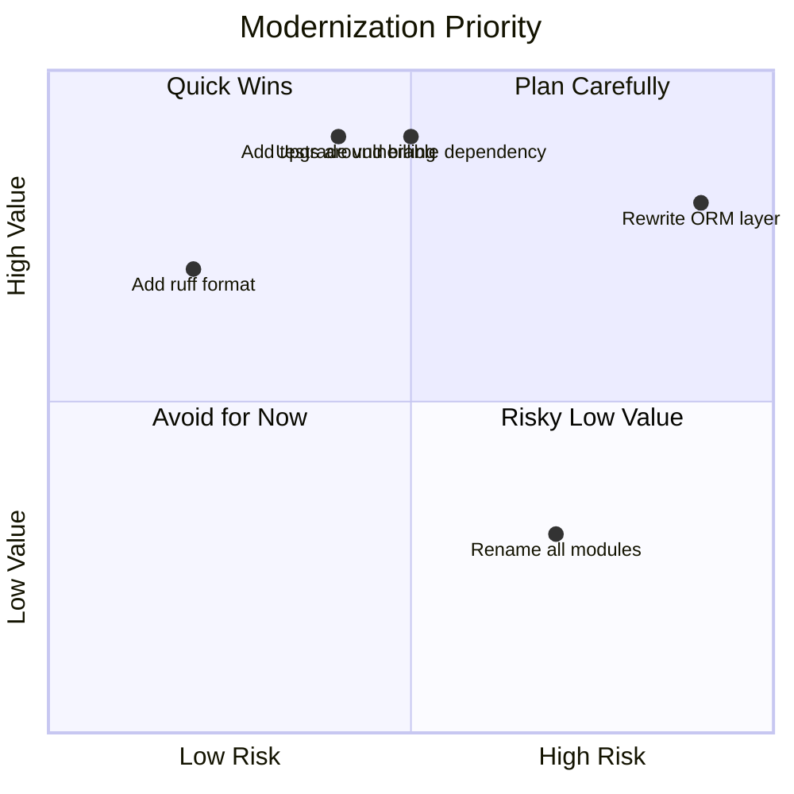
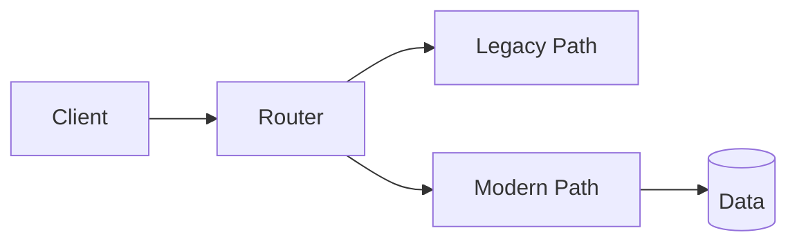

# Part 033 — Migration, Modernization, dan Maintaining Python Systems

## 1. Tujuan Part Ini

Software engineering level tinggi bukan hanya membangun dari nol. Banyak pekerjaan nyata adalah merawat, memodernisasi, dan mengubah sistem yang sudah berjalan.

Sistem Python yang hidup lama akan menghadapi:

- versi Python lama;
- dependency outdated;
- packaging legacy;
- `setup.py` custom;
- `requirements.txt` tidak terkunci;
- test minim;
- type hints tidak ada;
- global state tersebar;
- import side effects;
- synchronous/blocking code di async app;
- framework version lama;
- security vulnerabilities;
- performance bottleneck;
- schema migration;
- undocumented behavior;
- hidden business rules;
- flaky tests;
- tribal knowledge;
- “jangan disentuh, nanti rusak”.

Part ini membahas modernization sebagai proses engineering yang aman dan bertahap.

Target setelah part ini:

1. Memahami jenis legacy Python system.
2. Membuat modernization assessment.
3. Memprioritaskan migration berdasarkan risk/value.
4. Menambahkan characterization tests.
5. Memodernisasi packaging ke `pyproject.toml`.
6. Meng-upgrade Python version secara aman.
7. Meng-upgrade dependency dengan strategi.
8. Mengadopsi Ruff/type checking secara incremental.
9. Memecah monolith module menjadi boundary jelas.
10. Mengelola deprecation dan backward compatibility.
11. Melakukan data/schema migration.
12. Membuat migration playbook untuk sistem Python.

---

## 2. Maintenance Mindset

Legacy code bukan kode buruk. Legacy code adalah kode yang penting cukup lama sampai masih dipakai.

Mindset yang sehat:

- hormati alasan historis;
- jangan menghina desain lama tanpa memahami constraints;
- lindungi behavior yang sudah diandalkan user;
- ubah sistem dengan safety net;
- kurangi risiko sebelum memperbesar scope;
- dokumentasikan keputusan;
- modernisasi bertahap;
- jangan mencampur formatting besar dengan behavior change;
- ukur hasil;
- buat rollback plan.

Rule:

> Modernization tanpa safety net adalah rewrite risk yang menyamar sebagai refactor.

---

## 3. Jenis Legacy Python System

| Jenis | Gejala |
|---|---|
| Script pile | Banyak script manual tanpa packaging |
| Dependency drift | Dependency tidak pin/lock, sering broken install |
| Framework legacy | Django/FastAPI/Flask versi lama |
| Python version old | Masih Python 3.8/3.9 atau lebih lama |
| Untyped codebase | Semua dynamic, behavior tersembunyi |
| Test-poor system | Test minim atau flaky |
| Global-state app | Config/DB/session global |
| Import-side-effect app | Import module menjalankan I/O/app startup |
| Monolithic module | File ribuan baris |
| Data migration debt | Format file/database berubah tanpa versioning |
| Security debt | Dependency vulnerable, secrets/logging lemah |
| Operational debt | No health, no metrics, no runbook |

Setiap jenis butuh strategi berbeda.

---

## 4. Modernization Is Not Rewrite

Rewrite total menggoda karena terasa bersih.

Risiko rewrite:

- behavior lama tidak terdokumentasi;
- edge case hilang;
- timeline membesar;
- business berhenti mendapat fitur;
- bug lama diganti bug baru;
- migration data sulit;
- stakeholder kehilangan trust;
- parity tidak pernah selesai.

Alternatif:

- strangler pattern;
- module-by-module refactor;
- add tests around behavior;
- create boundary;
- replace internals behind stable API;
- migrate data gradually;
- deprecate old API.

Rewrite mungkin layak jika:

- system kecil;
- behavior simple;
- data migration mudah;
- risk rendah;
- team punya kapasitas;
- old system benar-benar tidak bisa diselamatkan.

Tetapi default profesional: incremental modernization.

---

## 5. Assessment: Current State Inventory

Mulai dengan inventory.

```markdown
# Python System Assessment

## Runtime
- Python version:
- OS/container:
- Entry points:
- Deployment target:

## Packaging
- pyproject.toml?
- setup.py?
- requirements?
- lockfile?
- editable install?

## Dependencies
- direct dependencies:
- transitive dependency risk:
- known vulnerabilities:
- unmaintained packages:

## Tests
- test runner:
- test count:
- flaky tests:
- coverage of critical paths:

## Architecture
- modules:
- domain boundaries:
- framework leakage:
- global state:
- import side effects:

## Data
- storage:
- schema version:
- migration tooling:
- backup strategy:

## Operations
- logs:
- metrics:
- health checks:
- runbook:
```

Inventory mengubah modernization dari opini menjadi evidence.

---

## 6. Risk/Value Matrix

Prioritize changes by risk and value.



Quick wins:

- add formatter;
- add CI command;
- add missing tests;
- add dependency audit;
- centralize config;
- add health check.

Plan carefully:

- Python major/minor runtime upgrade;
- framework upgrade;
- ORM migration;
- database schema migration;
- async rewrite;
- auth/security change.

Avoid:

- cosmetic module rename with no value;
- deep abstraction rewrite;
- optimize unmeasured path.

---

## 7. Characterization Tests

Characterization tests capture current behavior before refactor.

Even if behavior is weird, test documents it.

Example legacy function:

```python
def normalize_status(value):
    if value is None:
        return "DRAFT"
    return value.strip().upper()
```

Characterization test:

```python
def test_normalize_status_current_behavior() -> None:
    assert normalize_status(None) == "DRAFT"
    assert normalize_status(" submitted ") == "SUBMITTED"
```

Later decide whether behavior is desired.

Purpose:

- protect from accidental behavior changes;
- reveal edge cases;
- enable refactor;
- document legacy assumptions.

---

## 8. Golden Master Tests

For script/report output, use golden master.

Legacy command:

```bash
python legacy_report.py input.json
```

Capture output:

```text
tests/golden/legacy_report_output.txt
```

Test:

```python
def test_legacy_report_output_matches_golden() -> None:
    output = run_report("tests/fixtures/input.json")
    expected = Path("tests/golden/legacy_report_output.txt").read_text(encoding="utf-8")

    assert output == expected
```

Golden master is not perfect. It can preserve bugs. But it gives safety while refactoring.

After understanding behavior, update golden intentionally.

---

## 9. Add CI Before Big Refactor

Before modernization:

1. Make tests runnable.
2. Add formatting/lint check if low-risk.
3. Add type checker gradually.
4. Add dependency install command.
5. Add CI.

No CI means every migration relies on manual discipline.

Minimum CI:

```yaml
- install
- run tests
- run lint
```

Even if tests are few, CI creates baseline.

---

## 10. Formatting Migration

Large formatting change creates noisy diff.

Strategy:

1. Create separate PR: apply formatter only.
2. No behavior change.
3. Review mechanically.
4. Merge.
5. Future PRs are readable.

Ruff format:

```bash
python -m ruff format .
```

Then check:

```bash
python -m ruff format --check .
```

Do not mix formatting with logic refactor.

---

## 11. Lint Adoption Incrementally

Start with high-signal rules:

```toml
[tool.ruff.lint]
select = ["E", "F", "I", "B", "UP"]
```

If codebase has many violations, use baseline ignores carefully.

Options:

1. Fix all violations if manageable.
2. Enable only new files.
3. Use per-file ignores temporarily.
4. Ratchet down violation count.
5. Track ignore debt.

Bad:

```toml
ignore = ["ALL"]
```

or file-wide:

```python
# ruff: noqa
```

without plan.

---

## 12. Type Checking Migration

Do not try to type entire large legacy codebase in one pass unless small.

Incremental strategy:

1. Type domain/value objects.
2. Type public functions.
3. Type new code.
4. Type modules being changed.
5. Add `-> None` to tests.
6. Contain `Any` at boundaries.
7. Use `Protocol` for new abstractions.
8. Enable stricter options gradually.

Mypy config example:

```toml
[tool.mypy]
python_version = "3.12"
mypy_path = "src"
warn_unused_configs = true

[[tool.mypy.overrides]]
module = "legacy.*"
ignore_errors = true
```

Then shrink ignored modules over time.

---

## 13. Python Version Upgrade

Python version upgrade can affect:

- syntax availability;
- dependency compatibility;
- binary wheels;
- runtime behavior;
- stdlib changes;
- performance;
- deprecated APIs;
- CI image;
- Docker base image;
- type checker target;
- deployment platform.

Upgrade playbook:

1. Inventory current version.
2. Check dependency compatibility.
3. Add CI matrix with old and new Python.
4. Fix warnings/deprecations.
5. Run test suite.
6. Run integration tests.
7. Build deployment artifact.
8. Test staging.
9. Deploy canary.
10. Monitor.
11. Remove old version support if appropriate.

Do not upgrade runtime and framework and database driver all in one unbounded change if avoidable.

---

## 14. Syntax Modernization

Modern Python syntax examples:

Old:

```python
from typing import Optional, List

def find_case(case_id: str) -> Optional[Case]:
    ...
```

Modern:

```python
def find_case(case_id: str) -> Case | None:
    ...
```

Old:

```python
cases: List[Case] = []
```

Modern:

```python
cases: list[Case] = []
```

Ruff `UP` rules can help modernize syntax.

But syntax modernization should follow supported Python baseline.

If your library supports Python 3.9, do not use syntax only available in newer versions.

---

## 15. Dependency Upgrade Strategy

Types of dependencies:

- runtime;
- dev/test;
- build;
- framework;
- security-sensitive;
- transitive.

Upgrade strategy:

1. Lock current working state.
2. Upgrade one group at a time.
3. Read changelog for major upgrades.
4. Run tests.
5. Run static checks.
6. Run integration tests.
7. Test staging.
8. Monitor after deploy.

Security patch may require faster path but still needs validation.

Avoid unbounded command:

```bash
pip install -U everything
```

without plan.

---

## 16. Dependency Removal

Modernization is also removing dependencies.

Before removing:

1. Search usage.
2. Check transitive dependency.
3. Replace with standard library if simple.
4. Run tests.
5. Update docs/lockfile.
6. Check package size/deploy impact.

Dependency removal can reduce risk.

Example:

- replace custom CLI parser with `argparse` if simple;
- replace small utility library with stdlib;
- remove unused HTTP client;
- remove abandoned package.

---

## 17. Packaging Migration: `setup.py` to `pyproject.toml`

Legacy:

```python
# setup.py
from setuptools import setup

setup(
    name="case-tracker",
    version="0.1.0",
    packages=["case_tracker"],
)
```

Modern:

```toml
[project]
name = "case-tracker"
version = "0.1.0"
requires-python = ">=3.12"
dependencies = []

[build-system]
requires = ["setuptools"]
build-backend = "setuptools.build_meta"
```

Migration steps:

1. Add `pyproject.toml`.
2. Keep `setup.py` if needed as compatibility shim.
3. Test editable install.
4. Build wheel.
5. Install wheel in clean environment.
6. Update CI.
7. Update docs.
8. Remove obsolete config when safe.

---

## 18. Requirements to Lockfile

Legacy:

```text
requirements.txt
```

with loose versions or unpinned versions.

Modern application strategy:

- declare project dependencies;
- use lockfile;
- install from lock in CI/deploy;
- update lock intentionally.

If deployment requires requirements file, generate from lock rather than manually duplicating.

Avoid drift:

```text
pyproject says A>=1
requirements says A==0.9
```

Single source of truth matters.

---

## 19. Untangling Import Side Effects

Bad:

```python
# module import time
config = load_config()
engine = create_engine(config.database_url)
cases = load_cases(Path("cases.json"))
```

Problems:

- tests import module and trigger I/O;
- config errors at import;
- circular imports;
- slow startup;
- hard dependency injection.

Better:

```python
def create_app(config: AppConfig) -> FastAPI:
    engine = create_engine(config.database_url)
    ...
```

Use composition root.

Migration:

1. Identify import-time I/O.
2. Move to function/class constructor.
3. Pass dependencies explicitly.
4. Add tests importing module without side effects.

---

## 20. Global State Reduction

Global state examples:

- global DB session;
- global config dict;
- global current user;
- global mutable cache;
- global repository;
- global feature flags.

Migration:

1. Wrap in config/service object.
2. Pass dependency via constructor/function.
3. Keep compatibility wrapper.
4. Deprecate old global access.
5. Update call sites gradually.

Example:

```python
# Old
def create_case(title: str) -> Case:
    return GLOBAL_SERVICE.create_case(title)
```

Bridge:

```python
def create_case(title: str) -> Case:
    warnings.warn("create_case() global API is deprecated", DeprecationWarning, stacklevel=2)
    return get_default_service().create_case(title)
```

New:

```python
service.create_case(title)
```

---

## 21. Modularization of Large File

Legacy:

```text
app.py  # 5000 lines
```

Do not split randomly.

Split by responsibility:

```text
domain.py
errors.py
service.py
repository.py
schemas.py
routes.py
config.py
```

Steps:

1. Add tests around behavior.
2. Move pure functions first.
3. Move domain types.
4. Move errors.
5. Move I/O boundary.
6. Keep imports stable via re-export temporarily.
7. Avoid circular imports.
8. Run tests after each move.

Temporary re-export:

```python
# old_module.py
from new_module import moved_function
```

Then deprecate import path later.

---

## 22. Framework Upgrade

Framework upgrade examples:

- FastAPI major version changes;
- Pydantic v1 to v2;
- SQLAlchemy 1.x to 2.x style;
- Django LTS upgrade.

Strategy:

1. Read migration guide.
2. Upgrade in branch.
3. Fix warnings under old version first if possible.
4. Add compatibility layer.
5. Migrate one module at a time.
6. Avoid business logic changes.
7. Test API contract.
8. Test OpenAPI diff if applicable.
9. Deploy carefully.

For Pydantic migration, boundary schemas may need `model_dump`, `model_validate`, config changes.

For SQLAlchemy 2.x, query/session style may change.

---

## 23. Data Migration

Data migration is riskier than code migration because rollback may be hard.

Principles:

- backup before migration;
- migration scripts versioned;
- idempotent if possible;
- dry-run mode;
- validation before/after;
- row counts/checksums;
- rollback strategy;
- small batches for large data;
- observability;
- tested on copy of production data when allowed.

For JSON store:

```text
schema_version 1 -> 2
```

For DB:

- Alembic migrations;
- backward-compatible schema changes;
- expand-contract pattern.

---

## 24. Expand-Contract Pattern

For zero/low downtime DB changes:

1. Expand: add new column/table while old still works.
2. Dual write or backfill.
3. Read from new path after data ready.
4. Contract: remove old column/path later.

Example:

- add `priority` column nullable/default;
- deploy app writing both old/new;
- backfill priority;
- deploy app reading new;
- remove old representation later.

Do not combine expand and contract in same risky deploy if rolling deployment matters.

---

## 25. API Migration

Changing API response field:

Old:

```json
{"status": "DRAFT"}
```

New:

```json
{"case_status": "DRAFT"}
```

Better migration:

1. Add `case_status` while keeping `status`.
2. Mark `status` deprecated in docs.
3. Emit deprecation warning/header if appropriate.
4. Track usage.
5. Remove in major/new API version.

For public APIs, prefer versioning if breaking.

---

## 26. Deprecation Management

Deprecation is a project management process, not just warning.

Need:

- replacement API;
- warning;
- changelog;
- docs;
- timeline;
- owner;
- usage tracking if possible;
- removal version.

Python warning:

```python
warnings.warn(
    "old_function() is deprecated; use new_function() instead.",
    DeprecationWarning,
    stacklevel=2,
)
```

Tests:

```python
with pytest.warns(DeprecationWarning):
    old_function()
```

---

## 27. Security Modernization

Security modernization tasks:

- remove hardcoded secrets;
- dependency audit;
- upgrade vulnerable dependencies;
- strengthen auth/authorization;
- sanitize logs;
- add object-level authorization;
- configure CORS correctly;
- set secure headers;
- add input validation;
- replace insecure deserialization;
- add SSRF protections;
- improve password hashing if relevant;
- add security tests.

Security changes can be breaking. Coordinate carefully.

---

## 28. Performance Modernization

Performance modernization should follow measurement.

Steps:

1. Define scenario.
2. Baseline.
3. Profile.
4. Fix algorithm/data access.
5. Add index/cache/batch/streaming.
6. Measure.
7. Add regression guard if appropriate.
8. Document trade-off.

Avoid performance rewrite without evidence.

---

## 29. Observability Modernization

Add:

- structured logs;
- request id;
- error logs with context;
- metrics;
- health/readiness;
- tracing if service complexity needs it;
- runbooks;
- alerting.

Do this before risky migrations when possible. Better observability reduces migration risk.

---

## 30. Documentation Modernization

Docs to add/update:

- README setup;
- architecture overview;
- local development;
- testing;
- deployment;
- configuration;
- runbooks;
- API docs;
- migration guides;
- dependency decision records;
- changelog.

Docs are part of maintenance. Without docs, modernization knowledge decays.

---

## 31. Code Ownership

Long-lived systems need ownership.

Define:

- maintainers;
- review rules;
- on-call/operational owner;
- domain expert;
- release process;
- dependency update owner;
- security contact;
- deprecation owner.

Technical debt often persists because no owner can decide.

---

## 32. Migration Branch Strategy

Avoid giant branch living for months.

Prefer:

- small PRs;
- feature flags;
- compatibility layers;
- incremental merges;
- CI always green;
- reversible changes.

Large branch issues:

- merge conflicts;
- outdated assumptions;
- delayed feedback;
- high review burden;
- all-or-nothing risk.

Modernization should be shippable in increments.

---

## 33. Feature Flags

Use feature flags to switch behavior gradually.

Example:

```python
@dataclass(frozen=True)
class FeatureFlags:
    use_sql_repository: bool = False
```

Composition:

```python
repository = (
    SqlAlchemyCaseRepository(session_factory)
    if flags.use_sql_repository
    else JsonCaseRepository(path)
)
```

Feature flags need lifecycle:

- add;
- use;
- monitor;
- default on;
- remove old code;
- remove flag.

Otherwise flags become permanent complexity.

---

## 34. Compatibility Layer

During migration:

```python
class LegacyCaseRepositoryAdapter:
    def __init__(self, legacy_store: LegacyStore) -> None:
        self._legacy_store = legacy_store

    def list(self) -> list[Case]:
        return [legacy_to_case(item) for item in self._legacy_store.get_all()]
```

Adapter lets new service use old infrastructure.

Adapters support strangler pattern.

---

## 35. Strangler Pattern

Gradually replace old system with new components.



Steps:

1. Put boundary/router around legacy.
2. Implement one use case in new path.
3. Route subset traffic.
4. Validate parity.
5. Move more use cases.
6. Retire old path.

Works for APIs, modules, services, CLIs.

---

## 36. Case Tracker Modernization Scenario

Start:

```text
CLI + JSON store + service functions
```

Target:

```text
FastAPI + SQLAlchemy repository + UnitOfWork + observability + typed public API
```

Incremental plan:

1. Add tests around current CLI/service.
2. Introduce `CaseRepository` Protocol.
3. Implement `JsonCaseRepository`.
4. Move service functions into `CaseService`.
5. Add public API exports.
6. Add FastAPI boundary using same service.
7. Add SQLAlchemy repository behind same Protocol.
8. Add contract tests for repositories.
9. Add UnitOfWork for DB transaction.
10. Add data migration from JSON to SQL.
11. Add observability.
12. Deprecate old function APIs.
13. Keep CLI using new service.
14. Remove old storage path when safe.

---

## 37. Case Tracker JSON to SQL Migration

Steps:

1. Define SQL schema.
2. Implement SQLAlchemy models.
3. Implement `SqlAlchemyCaseRepository`.
4. Add repository contract tests.
5. Write migration script:

```bash
case-tracker migrate-json-to-sql --json cases.json --database cases.db --dry-run
```

6. Validate counts:

```text
JSON cases count == SQL cases count
```

7. Validate sample records.
8. Backup JSON.
9. Run migration.
10. Switch feature flag to SQL.
11. Monitor.
12. Keep rollback to JSON if possible.

---

## 38. Migration Script Design

Good migration script has:

- dry-run;
- input/output paths;
- validation;
- clear logs;
- progress;
- idempotency if possible;
- backup instruction;
- exit codes;
- report output.

Example:

```python
def migrate_json_to_sql(
    *,
    json_path: Path,
    database_url: str,
    dry_run: bool,
) -> MigrationResult:
    ...
```

Do not bury migration in app startup if it is risky/slow.

---

## 39. Maintaining Tests During Migration

Tests should evolve:

- old behavior tests remain;
- new repository contract tests added;
- API tests added;
- migration script tests added;
- old API deprecation tests added;
- performance smoke tests optional;
- security tests added.

Avoid deleting tests just because they fail after refactor. Understand whether behavior changed intentionally.

---

## 40. Modernization Smell Checklist

Watch for:

1. Rewrite without behavior tests.
2. Formatting mixed with logic changes.
3. Runtime upgrade mixed with framework upgrade.
4. Dependency upgrade all at once.
5. No rollback plan.
6. No data backup before migration.
7. No staging test.
8. No observability before risky migration.
9. Hidden import side effects remain.
10. New abstraction without contract tests.
11. Feature flag never removed.
12. Deprecated API without replacement.
13. Type checker ignored forever.
14. Legacy ignored modules never reduced.
15. Migration script not idempotent and no dry-run.
16. Docs not updated.
17. No owner for modernization.
18. Long-lived branch.
19. Performance claims without measurement.
20. Security fixes postponed indefinitely.

---

## 41. Practice: Modernization Assessment

Pick a Python project and fill:

```markdown
# Modernization Assessment

## Top 5 Risks
1.
2.
3.
4.
5.

## Quick Wins
1.
2.
3.

## High-Risk Changes
1.
2.
3.

## Safety Nets Needed
1.
2.
3.

## 30-Day Plan
Week 1:
Week 2:
Week 3:
Week 4:
```

---

## 42. Practice: Characterization Tests

Choose one legacy function. Write tests for:

- normal input;
- edge input;
- invalid input;
- current weird behavior.

Do not change behavior yet.

Then refactor internals and keep tests passing.

---

## 43. Practice: `pyproject.toml` Migration

Take legacy `setup.py` or requirements-only project.

Add:

- `[project]`;
- `[build-system]`;
- `[tool.pytest.ini_options]`;
- `[tool.ruff]`;
- dependency groups or documented dev install.

Test:

```bash
python -m pip install -e .
python -m build
python -m pytest
```

---

## 44. Practice: Dependency Upgrade PR Plan

Choose one dependency.

Write:

```markdown
# Dependency Upgrade Plan

Package:
From:
To:
Reason:
Changelog:
Breaking changes:
Test plan:
Rollback:
```

Execute upgrade in isolated PR.

---

## 45. Practice: Deprecation Wrapper

Deprecate old function:

```python
def old_create_case(...):
    warnings.warn(..., DeprecationWarning, stacklevel=2)
    return new_create_case(...)
```

Test warning.

Update docs.

Add changelog entry.

---

## 46. Practice: JSON Schema Migration

Add `schema_version` to store.

Support old root list.

Test:

- old file loads;
- new file loads;
- unsupported version fails;
- migration output matches expected;
- dry-run does not write.

---

## 47. Self-Check

Jawab tanpa melihat materi:

1. Kenapa legacy code bukan berarti bad code?
2. Kenapa rewrite total berisiko?
3. Apa isi modernization assessment?
4. Apa itu characterization test?
5. Kapan golden master berguna?
6. Kenapa CI harus ada sebelum refactor besar?
7. Kenapa formatting PR harus dipisah?
8. Bagaimana lint adoption incremental?
9. Bagaimana type checking migration yang aman?
10. Apa risiko Python version upgrade?
11. Bagaimana dependency upgrade yang aman?
12. Kenapa dependency removal juga modernization?
13. Bagaimana migrasi `setup.py` ke `pyproject.toml`?
14. Apa bahaya import-time side effects?
15. Apa itu expand-contract pattern?
16. Apa itu strangler pattern?
17. Apa yang harus ada di migration script?
18. Kenapa observability membantu migration?
19. Apa fungsi feature flag?
20. Apa modernization smell paling berbahaya?

---

## 48. Definition of Done Part 033

Kamu selesai part ini jika bisa:

1. Membuat modernization assessment.
2. Membuat risk/value matrix.
3. Menulis characterization tests.
4. Menulis golden master test.
5. Menambahkan CI baseline.
6. Memisahkan formatting PR.
7. Mengadopsi linting incremental.
8. Mengadopsi typing incremental.
9. Merencanakan Python version upgrade.
10. Merencanakan dependency upgrade.
11. Migrasi packaging ke `pyproject.toml`.
12. Menghapus import-time side effects.
13. Menjelaskan expand-contract.
14. Menjelaskan strangler pattern.
15. Membuat migration playbook.

---

## 49. Ringkasan

Modernization adalah perubahan sistem lama dengan safety, bukan rewrite impulsif.

Inti part ini:

- legacy code sering berarti code yang berhasil hidup lama;
- modernization harus dimulai dengan assessment;
- risk/value matrix membantu prioritas;
- characterization tests melindungi behavior;
- CI dan observability menurunkan risiko;
- formatting, linting, typing, packaging, runtime upgrade harus dilakukan bertahap;
- dependency upgrade perlu changelog/test/rollback;
- import-time side effects dan global state harus dikurangi;
- data migration perlu backup, dry-run, validation, dan rollback;
- expand-contract dan strangler pattern membuat perubahan besar jadi incremental;
- deprecation butuh replacement, warning, docs, dan timeline;
- modernization sukses jika sistem makin mudah diubah setelahnya.

Part berikutnya adalah capstone project: membangun production-grade regulatory case management service yang mengikat seluruh materi seri ini.

---

## 50. Referensi

- Python Packaging User Guide — `pyproject.toml`.
- Python Documentation — `warnings`.
- Python Documentation — `venv`.
- Python Documentation — `unittest`.
- pytest Documentation.
- Ruff Documentation.
- mypy Documentation.
- SQLAlchemy Documentation — Migrations with Alembic.
