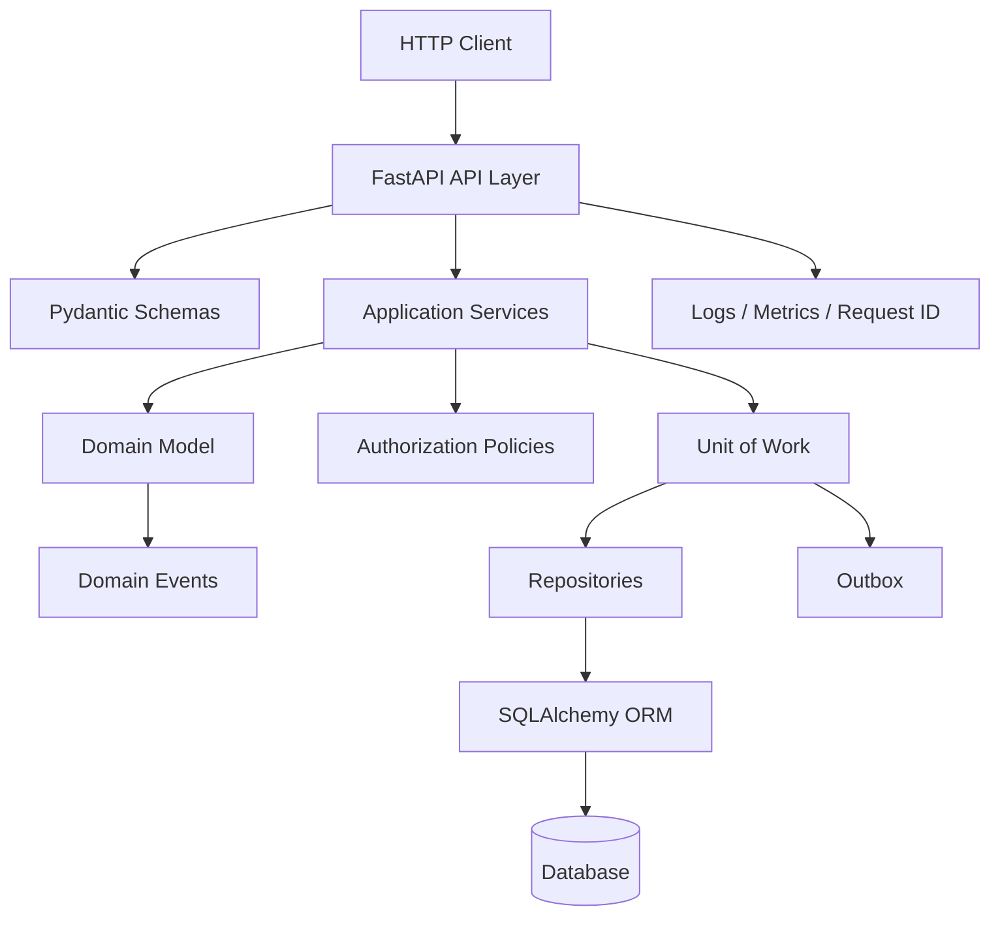
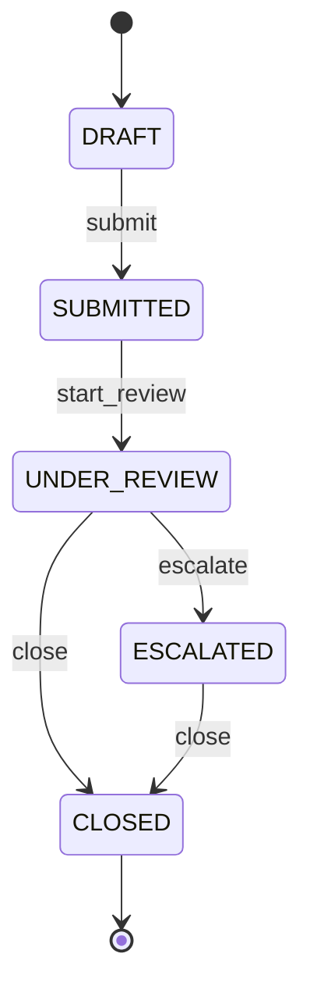
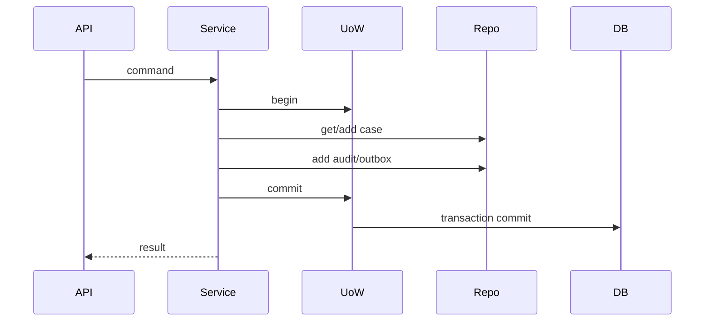
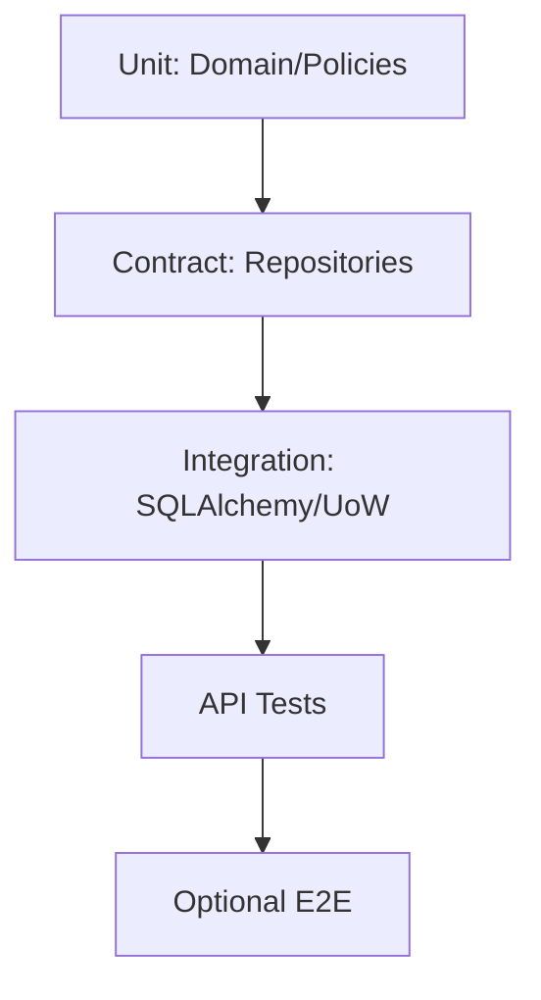

# Part 034 — Capstone Project: Production-Grade Regulatory Case Management Service

## 1. Tujuan Part Ini

Capstone ini mengikat seluruh seri Python.

Kita akan mendesain project:

> Production-Grade Regulatory Case Management Service

Bukan sekadar CRUD. Sistem ini punya:

- domain lifecycle;
- state machine;
- audit trail;
- authorization;
- validation boundary;
- FastAPI HTTP API;
- Pydantic schemas;
- SQLAlchemy persistence;
- Repository + Unit of Work;
- transaction boundaries;
- domain events;
- outbox pattern;
- idempotency;
- observability;
- tests berlapis;
- security baseline;
- migration plan;
- deployment readiness.

Tujuan capstone:

1. Mempraktikkan Python sebagai engineering platform.
2. Menerapkan mental model dari seluruh part.
3. Membangun architecture yang masuk akal, bukan over-engineered.
4. Membuat project yang bisa dikembangkan menjadi production system.
5. Melatih judgment: kapan simple, kapan formal.
6. Mempersiapkan final review part 035.

---

## 2. Problem Statement

Regulatory team perlu sistem untuk mengelola case lifecycle.

Case bisa:

- dibuat dari intake;
- disubmit untuk review;
- direview;
- dieskalasi;
- ditutup;
- diberi catatan;
- diberi assignee;
- diaudit;
- dicari/filter;
- diproses dengan authorization;
- memiliki SLA/due date;
- menghasilkan domain events.

System harus:

- expose HTTP API;
- validate input;
- enforce domain transition rules;
- persist to database;
- record audit events;
- expose observability signals;
- be testable;
- be maintainable;
- support future background workers.

---

## 3. Learning Outcomes

Setelah menyelesaikan capstone, kamu harus bisa:

1. Membuat project Python modern dengan `pyproject.toml`.
2. Mendesain domain model dengan dataclass/value object/enum.
3. Mendesain state machine lifecycle.
4. Mendesain service/use case layer.
5. Mendesain repository protocol.
6. Mendesain Unit of Work.
7. Implement persistence dengan SQLAlchemy.
8. Mendesain API boundary dengan FastAPI/Pydantic.
9. Menulis error mapping yang konsisten.
10. Menulis authorization policy dasar.
11. Menulis audit trail.
12. Menulis domain events/outbox.
13. Menulis unit/integration/API/contract tests.
14. Menambahkan logging/metrics/health.
15. Membuat migration/deployment/runbook checklist.

---

## 4. Scope

### 4.1 In Scope

- Case lifecycle management.
- Create case.
- Submit case.
- Start review.
- Escalate case.
- Close case.
- Add note.
- Assign reviewer.
- List/filter cases.
- Audit events.
- Basic authorization policy.
- REST API.
- SQL persistence.
- Tests.
- Observability baseline.
- Migration-ready architecture.

### 4.2 Out of Scope for Capstone

- Full UI.
- Full authentication provider integration.
- Real email/notification provider.
- Distributed tracing backend setup.
- Multi-tenant sharding.
- Advanced search engine.
- Full event sourcing.
- Kubernetes manifests.
- Complex workflow designer.
- Legal-grade audit immutability.

Out of scope bukan berarti tidak penting. Kita fokus pada core architecture.

---

## 5. Success Criteria

Project dianggap berhasil jika:

1. All tests pass.
2. API routes work with fake/test database.
3. Domain transition rules enforced.
4. Invalid transitions return 409.
5. Missing case returns 404.
6. Audit event recorded for state-changing actions.
7. Repository contract tests pass.
8. Unit of Work commits/rolls back correctly.
9. No FastAPI imports in domain/application package.
10. API has health endpoint.
11. Logs include request id and key events.
12. Config is explicit.
13. CI quality gate documented.
14. README quickstart works.
15. Architecture diagram matches code dependencies.

---

## 6. Architecture Overview



Dependency rule:

```text
API -> Application -> Domain
Infrastructure -> Application/Domain interfaces
Domain -> nothing framework-specific
```

---

## 7. Project Layout

```text
regulatory-case-service/
  pyproject.toml
  README.md
  Makefile
  src/
    regulatory_cases/
      __init__.py
      domain/
        __init__.py
        case.py
        events.py
        errors.py
        policies.py
        value_objects.py
      application/
        __init__.py
        commands.py
        services.py
        ports.py
        unit_of_work.py
      infrastructure/
        __init__.py
        sqlalchemy_models.py
        sqlalchemy_repositories.py
        sqlalchemy_uow.py
        migrations/
      api/
        __init__.py
        main.py
        schemas.py
        dependencies.py
        error_handlers.py
        middleware.py
        routes/
          __init__.py
          cases.py
      config.py
      observability.py
  tests/
    unit/
      test_domain_case.py
      test_policies.py
    contract/
      test_case_repository_contract.py
    integration/
      test_sqlalchemy_repositories.py
      test_unit_of_work.py
    api/
      test_cases_api.py
    builders.py
  docs/
    architecture.md
    runbooks/
      high-error-rate.md
      migration-failure.md
```

This is bigger than toy app but still understandable.

---

## 8. Domain Concepts

Core concepts:

| Concept | Meaning |
|---|---|
| Case | Regulatory case entity |
| CaseId | Stable identity |
| CaseStatus | Lifecycle state |
| Note | User-entered note |
| ReviewerId | Assigned reviewer |
| ActorId | User/system actor performing action |
| AuditEvent | Business record of action |
| DomainEvent | Event emitted by domain |
| TransitionPolicy | Allowed lifecycle transitions |
| AuthorizationPolicy | Actor permission rule |

---

## 9. Case Status Lifecycle



Allowed transition table:

```python
ALLOWED_TRANSITIONS: dict[CaseStatus, set[CaseStatus]] = {
    CaseStatus.DRAFT: {CaseStatus.SUBMITTED},
    CaseStatus.SUBMITTED: {CaseStatus.UNDER_REVIEW},
    CaseStatus.UNDER_REVIEW: {CaseStatus.ESCALATED, CaseStatus.CLOSED},
    CaseStatus.ESCALATED: {CaseStatus.CLOSED},
    CaseStatus.CLOSED: set(),
}
```

---

## 10. Domain Value Objects

```python
from dataclasses import dataclass


@dataclass(frozen=True, slots=True)
class CaseId:
    value: str

    def __post_init__(self) -> None:
        normalized = self.value.strip()

        if not normalized:
            raise ValueError("Case id cannot be empty")

        object.__setattr__(self, "value", normalized)

    def __str__(self) -> str:
        return self.value


@dataclass(frozen=True, slots=True)
class ActorId:
    value: str

    def __post_init__(self) -> None:
        normalized = self.value.strip()

        if not normalized:
            raise ValueError("Actor id cannot be empty")

        object.__setattr__(self, "value", normalized)
```

Use value objects to prevent string mix-up.

---

## 11. Domain Entity

```python
from dataclasses import dataclass, field
from datetime import UTC, datetime
from enum import Enum


class CaseStatus(Enum):
    DRAFT = "DRAFT"
    SUBMITTED = "SUBMITTED"
    UNDER_REVIEW = "UNDER_REVIEW"
    ESCALATED = "ESCALATED"
    CLOSED = "CLOSED"


@dataclass(eq=False)
class Case:
    id: CaseId
    title: str
    status: CaseStatus = CaseStatus.DRAFT
    assigned_reviewer_id: ReviewerId | None = None
    notes: list[Note] = field(default_factory=list)
    version: int = 0

    def __post_init__(self) -> None:
        self.title = self.title.strip()

        if not self.title:
            raise ValueError("Case title cannot be empty")

    def submit(self) -> DomainEvent:
        self._transition_to(CaseStatus.SUBMITTED)
        return CaseSubmitted(case_id=self.id)

    def start_review(self, reviewer_id: ReviewerId) -> DomainEvent:
        self._transition_to(CaseStatus.UNDER_REVIEW)
        self.assigned_reviewer_id = reviewer_id
        return CaseReviewStarted(case_id=self.id, reviewer_id=reviewer_id)

    def escalate(self, reason: str) -> DomainEvent:
        normalized_reason = reason.strip()

        if not normalized_reason:
            raise ValueError("Escalation reason cannot be empty")

        self._transition_to(CaseStatus.ESCALATED)
        return CaseEscalated(case_id=self.id, reason=normalized_reason)

    def close(self, reason: str) -> DomainEvent:
        normalized_reason = reason.strip()

        if not normalized_reason:
            raise ValueError("Close reason cannot be empty")

        self._transition_to(CaseStatus.CLOSED)
        return CaseClosed(case_id=self.id, reason=normalized_reason)

    def add_note(self, note: Note) -> DomainEvent:
        self.notes.append(note)
        return CaseNoteAdded(case_id=self.id, note_id=note.id)

    def _transition_to(self, target_status: CaseStatus) -> None:
        if target_status not in ALLOWED_TRANSITIONS[self.status]:
            raise InvalidCaseTransitionError(self.status, target_status)

        self.status = target_status
        self.version += 1
```

Entity enforces lifecycle rule.

---

## 12. Domain Events

```python
from dataclasses import dataclass
from datetime import datetime


@dataclass(frozen=True)
class DomainEvent:
    occurred_at: datetime


@dataclass(frozen=True)
class CaseSubmitted(DomainEvent):
    case_id: CaseId


@dataclass(frozen=True)
class CaseReviewStarted(DomainEvent):
    case_id: CaseId
    reviewer_id: ReviewerId


@dataclass(frozen=True)
class CaseEscalated(DomainEvent):
    case_id: CaseId
    reason: str
```

Alternative: event base can be Protocol, not class inheritance. Choose simplicity.

Events are emitted by domain but persisted/published by application/infrastructure.

---

## 13. Domain Errors

```python
class RegulatoryCasesError(Exception):
    pass


class CaseNotFoundError(RegulatoryCasesError):
    def __init__(self, case_id: CaseId) -> None:
        self.case_id = case_id
        super().__init__(f"Case not found: {case_id}")


class InvalidCaseTransitionError(RegulatoryCasesError):
    def __init__(self, from_status: CaseStatus, to_status: CaseStatus) -> None:
        self.from_status = from_status
        self.to_status = to_status
        super().__init__(
            f"Cannot transition case from {from_status.value} to {to_status.value}"
        )


class UnauthorizedCaseActionError(RegulatoryCasesError):
    def __init__(self, actor_id: ActorId, action: str) -> None:
        self.actor_id = actor_id
        self.action = action
        super().__init__(f"Actor {actor_id} is not allowed to perform {action}")
```

Errors are domain/application language, not HTTP.

---

## 14. Authorization Policy

```python
class CaseAction(Enum):
    CREATE = "CREATE"
    SUBMIT = "SUBMIT"
    START_REVIEW = "START_REVIEW"
    ESCALATE = "ESCALATE"
    CLOSE = "CLOSE"
    ADD_NOTE = "ADD_NOTE"


@dataclass(frozen=True)
class Actor:
    id: ActorId
    roles: frozenset[str]


class AuthorizationPolicy:
    def can_perform(self, actor: Actor, action: CaseAction, case: Case | None = None) -> bool:
        if "admin" in actor.roles:
            return True

        if action in {CaseAction.CREATE, CaseAction.ADD_NOTE}:
            return "case_writer" in actor.roles

        if action in {CaseAction.START_REVIEW, CaseAction.ESCALATE, CaseAction.CLOSE}:
            return "reviewer" in actor.roles

        return False
```

Application service checks policy before action.

---

## 15. Commands

```python
from dataclasses import dataclass


@dataclass(frozen=True)
class CreateCaseCommand:
    title: str
    actor: Actor
    idempotency_key: str | None = None


@dataclass(frozen=True)
class SubmitCaseCommand:
    case_id: CaseId
    actor: Actor


@dataclass(frozen=True)
class StartReviewCommand:
    case_id: CaseId
    reviewer_id: ReviewerId
    actor: Actor


@dataclass(frozen=True)
class EscalateCaseCommand:
    case_id: CaseId
    reason: str
    actor: Actor


@dataclass(frozen=True)
class CloseCaseCommand:
    case_id: CaseId
    reason: str
    actor: Actor
```

Commands represent application use case input, not HTTP schema.

---

## 16. Ports

```python
from typing import Protocol


class CaseRepository(Protocol):
    def add(self, case: Case) -> None:
        ...

    def get(self, case_id: CaseId) -> Case:
        ...

    def list(self, *, status: CaseStatus | None = None, limit: int = 100, offset: int = 0) -> list[Case]:
        ...


class AuditRepository(Protocol):
    def add(self, event: AuditEvent) -> None:
        ...


class OutboxRepository(Protocol):
    def add(self, event: DomainEvent) -> None:
        ...


class UnitOfWork(Protocol):
    cases: CaseRepository
    audit_events: AuditRepository
    outbox: OutboxRepository

    def __enter__(self) -> "UnitOfWork":
        ...

    def __exit__(self, exc_type, exc, tb) -> None:
        ...

    def commit(self) -> None:
        ...

    def rollback(self) -> None:
        ...
```

Application depends on ports, infrastructure implements them.

---

## 17. Application Service

```python
class CaseApplicationService:
    def __init__(
        self,
        uow_factory: Callable[[], UnitOfWork],
        authorization_policy: AuthorizationPolicy,
        id_factory: Callable[[], CaseId],
        clock: Clock,
    ) -> None:
        self._uow_factory = uow_factory
        self._authorization_policy = authorization_policy
        self._id_factory = id_factory
        self._clock = clock

    def create_case(self, command: CreateCaseCommand) -> Case:
        if not self._authorization_policy.can_perform(command.actor, CaseAction.CREATE):
            raise UnauthorizedCaseActionError(command.actor.id, CaseAction.CREATE.value)

        case = Case(
            id=self._id_factory(),
            title=command.title,
        )

        audit_event = AuditEvent.case_created(
            case_id=case.id,
            actor_id=command.actor.id,
            occurred_at=self._clock.now(),
        )

        with self._uow_factory() as uow:
            uow.cases.add(case)
            uow.audit_events.add(audit_event)
            uow.commit()

        return case
```

Service coordinates:

- authorization;
- domain method;
- repository;
- audit;
- transaction;
- outbox.

---

## 18. Transaction Boundary

Transaction should wrap state change and audit/outbox write.



If commit fails, operation should be considered failed.

Avoid writing audit separately outside transaction if audit must match state.

---

## 19. SQL Schema Sketch

Tables:

```text
cases
  id text primary key
  title text not null
  status text not null
  assigned_reviewer_id text null
  version integer not null
  created_at timestamp not null
  updated_at timestamp not null

case_notes
  id text primary key
  case_id text not null references cases(id)
  author_id text not null
  body text not null
  created_at timestamp not null

audit_events
  id text primary key
  case_id text not null
  actor_id text not null
  event_type text not null
  occurred_at timestamp not null
  details_json text not null

outbox_events
  id text primary key
  event_type text not null
  payload_json text not null
  occurred_at timestamp not null
  processed_at timestamp null
```

Indexes:

- `cases(status)`;
- `cases(assigned_reviewer_id)`;
- `audit_events(case_id, occurred_at)`;
- `outbox_events(processed_at)`.

---

## 20. SQLAlchemy ORM Mapping Sketch

```python
from sqlalchemy.orm import DeclarativeBase, Mapped, mapped_column, relationship


class Base(DeclarativeBase):
    pass


class CaseRecord(Base):
    __tablename__ = "cases"

    id: Mapped[str] = mapped_column(primary_key=True)
    title: Mapped[str]
    status: Mapped[str]
    assigned_reviewer_id: Mapped[str | None]
    version: Mapped[int]
```

Mapping functions:

```python
def case_record_to_domain(record: CaseRecord) -> Case:
    return Case(
        id=CaseId(record.id),
        title=record.title,
        status=CaseStatus(record.status),
        assigned_reviewer_id=(
            ReviewerId(record.assigned_reviewer_id)
            if record.assigned_reviewer_id is not None
            else None
        ),
        version=record.version,
    )


def update_record_from_case(record: CaseRecord, case: Case) -> None:
    record.title = case.title
    record.status = case.status.value
    record.assigned_reviewer_id = (
        case.assigned_reviewer_id.value
        if case.assigned_reviewer_id is not None
        else None
    )
    record.version = case.version
```

Keep mapping explicit.

---

## 21. Repository Implementation Sketch

```python
class SqlAlchemyCaseRepository:
    def __init__(self, session: Session) -> None:
        self._session = session

    def add(self, case: Case) -> None:
        record = CaseRecord(
            id=case.id.value,
            title=case.title,
            status=case.status.value,
            assigned_reviewer_id=(
                case.assigned_reviewer_id.value
                if case.assigned_reviewer_id is not None
                else None
            ),
            version=case.version,
        )
        self._session.add(record)

    def get(self, case_id: CaseId) -> Case:
        record = self._session.get(CaseRecord, case_id.value)

        if record is None:
            raise CaseNotFoundError(case_id)

        return case_record_to_domain(record)

    def list(
        self,
        *,
        status: CaseStatus | None = None,
        limit: int = 100,
        offset: int = 0,
    ) -> list[Case]:
        statement = select(CaseRecord)

        if status is not None:
            statement = statement.where(CaseRecord.status == status.value)

        statement = statement.limit(limit).offset(offset)

        records = self._session.scalars(statement).all()
        return [case_record_to_domain(record) for record in records]
```

For updates, decide whether repository tracks domain objects or has explicit `save(case)`.

---

## 22. Unit of Work Implementation Sketch

```python
class SqlAlchemyUnitOfWork:
    def __init__(self, session_factory: Callable[[], Session]) -> None:
        self._session_factory = session_factory

    def __enter__(self) -> "SqlAlchemyUnitOfWork":
        self.session = self._session_factory()
        self.cases = SqlAlchemyCaseRepository(self.session)
        self.audit_events = SqlAlchemyAuditRepository(self.session)
        self.outbox = SqlAlchemyOutboxRepository(self.session)
        return self

    def __exit__(self, exc_type, exc, tb) -> None:
        if exc_type is not None:
            self.rollback()

        self.session.close()

    def commit(self) -> None:
        self.session.commit()

    def rollback(self) -> None:
        self.session.rollback()
```

Make rollback behavior explicit.

---

## 23. API Schema Sketch

```python
class CaseStatusSchema(str, Enum):
    DRAFT = "DRAFT"
    SUBMITTED = "SUBMITTED"
    UNDER_REVIEW = "UNDER_REVIEW"
    ESCALATED = "ESCALATED"
    CLOSED = "CLOSED"


class CreateCaseRequest(BaseModel):
    title: str = Field(min_length=1, max_length=200)


class CaseResponse(BaseModel):
    id: str
    title: str
    status: CaseStatusSchema
    assigned_reviewer_id: str | None
    version: int


class ErrorResponse(BaseModel):
    error: str
    message: str
    details: dict[str, str] = {}
```

---

## 24. API Routes

```text
POST   /cases
GET    /cases
GET    /cases/{case_id}
POST   /cases/{case_id}/submit
POST   /cases/{case_id}/start-review
POST   /cases/{case_id}/escalate
POST   /cases/{case_id}/close
POST   /cases/{case_id}/notes
GET    /cases/{case_id}/audit-events
GET    /health/live
GET    /health/ready
```

Use action endpoints for lifecycle transitions because they carry domain meaning and audit.

Alternative REST PATCH can work, but explicit action endpoints are often clearer for regulated workflows.

---

## 25. Actor Boundary

For capstone, use simple header-based actor extraction.

```python
def get_actor(request: Request) -> Actor:
    actor_id = request.headers.get("X-Actor-ID")
    roles = request.headers.get("X-Actor-Roles", "")

    if not actor_id:
        raise HTTPException(status_code=401, detail="Missing actor")

    return Actor(
        id=ActorId(actor_id),
        roles=frozenset(role.strip() for role in roles.split(",") if role.strip()),
    )
```

This is not real authentication. It is boundary placeholder for learning.

In production, integrate real identity provider/auth middleware.

---

## 26. Error Mapping

| Domain/Application Error | HTTP |
|---|---:|
| `CaseNotFoundError` | 404 |
| `InvalidCaseTransitionError` | 409 |
| `UnauthorizedCaseActionError` | 403 |
| Pydantic validation error | 422 |
| Unique constraint/idempotency conflict | 409 |
| Unexpected DB error | 500 |
| Dependency unavailable | 503 |

Centralize handlers.

---

## 27. Idempotency

For create endpoints, support optional `Idempotency-Key`.

Simplified design:

Table:

```text
idempotency_keys
  key text primary key
  actor_id text not null
  response_json text not null
  created_at timestamp not null
```

Flow:

1. Request with key arrives.
2. Check if key exists for actor.
3. If exists, return stored response.
4. If not, process command.
5. Store response with key in same transaction.
6. Return response.

This prevents duplicate creates on retry.

For capstone, design it; implementation can be optional stretch.

---

## 28. Optimistic Locking

Case has `version`.

Update condition:

```sql
UPDATE cases
SET status = ?, version = version + 1
WHERE id = ? AND version = ?
```

If row count 0, conflict.

In SQLAlchemy, versioning can be configured or handled manually.

Why?

- prevents lost update;
- important for concurrent state transitions.

Capstone baseline can include `version` field and tests for conflict as stretch.

---

## 29. Audit Trail

Audit event should include:

- event id;
- case id;
- actor id;
- event type;
- occurred_at;
- details.

Example:

```python
AuditEvent(
    id=AuditEventId(...),
    case_id=case.id,
    actor_id=actor.id,
    event_type="CASE_SUBMITTED",
    occurred_at=clock.now(),
    details={"from_status": "DRAFT", "to_status": "SUBMITTED"},
)
```

Audit is domain/business record, not log.

---

## 30. Outbox Pattern

When domain event should trigger external side effect, store outbox event in same transaction.

```text
case state update + audit event + outbox event
```

committed together.

Worker later:

1. reads unprocessed outbox events;
2. publishes/sends notification;
3. marks processed;
4. retries on failure.

Outbox prevents:

- DB commit succeeds but message publish fails;
- message publish succeeds but DB commit fails.

Capstone can implement outbox table and repository. Worker can be stretch.

---

## 31. Observability Requirements

Baseline:

- request id middleware;
- structured logs;
- health endpoints;
- log application events;
- log errors with context;
- timing middleware;
- metrics interface or placeholder;
- readiness check database.

Request log:

```text
event=http_request_completed method=POST path=/cases status=201 duration_ms=24.1 request_id=...
```

Domain log:

```text
event=case_submitted case_id=CASE-001 actor_id=reviewer-1 request_id=...
```

Do not log note body if sensitive.

---

## 32. Security Requirements

Baseline:

- no framework leakage into domain;
- input validation with Pydantic;
- authorization policy;
- no SQL string interpolation;
- no sensitive logs;
- CORS explicit;
- error responses no stack trace;
- dependency audit documented;
- actor placeholder clearly marked non-production auth;
- object-level authorization checked;
- idempotency for create if implemented.

Security tests:

- missing actor returns 401;
- actor without role returns 403;
- unauthorized transition blocked;
- SQL injection-like input treated as data;
- error response does not include traceback.

---

## 33. Testing Strategy



Test layers:

| Layer | Examples |
|---|---|
| Unit | transition rules, value objects, policy |
| Contract | repository behavior for fake/sql |
| Integration | DB session, UoW commit/rollback |
| API | HTTP status, schemas, error mapping |
| Migration | schema/data migration |
| Security | authorization and unsafe inputs |
| Observability | request id/log presence |
| Performance smoke | list pagination, query indexes |

---

## 34. Unit Tests

Examples:

```python
def test_draft_case_can_be_submitted() -> None:
    case = make_case(status=CaseStatus.DRAFT)

    event = case.submit()

    assert case.status is CaseStatus.SUBMITTED
    assert isinstance(event, CaseSubmitted)


def test_closed_case_cannot_be_submitted() -> None:
    case = make_case(status=CaseStatus.CLOSED)

    with pytest.raises(InvalidCaseTransitionError):
        case.submit()
```

Policy:

```python
def test_reviewer_can_start_review() -> None:
    actor = Actor(id=ActorId("reviewer-1"), roles=frozenset({"reviewer"}))

    assert policy.can_perform(actor, CaseAction.START_REVIEW)
```

---

## 35. Contract Tests

```python
def assert_case_repository_contract(repository: CaseRepository) -> None:
    case = make_case(case_id=CaseId("CASE-001"))

    repository.add(case)

    assert repository.get(case.id).id == case.id

    listed = repository.list(limit=100, offset=0)
    assert [item.id for item in listed] == [case.id]
```

Run for:

- fake repository;
- SQLAlchemy repository.

---

## 36. Integration Tests

Use SQLite test database.

```python
def test_unit_of_work_commits_case(session_factory) -> None:
    with SqlAlchemyUnitOfWork(session_factory) as uow:
        case = make_case()
        uow.cases.add(case)
        uow.commit()

    with SqlAlchemyUnitOfWork(session_factory) as uow:
        assert uow.cases.get(case.id).id == case.id
```

Rollback:

```python
def test_unit_of_work_rolls_back_on_error(session_factory) -> None:
    case = make_case()

    with pytest.raises(RuntimeError):
        with SqlAlchemyUnitOfWork(session_factory) as uow:
            uow.cases.add(case)
            raise RuntimeError("boom")

    with SqlAlchemyUnitOfWork(session_factory) as uow:
        with pytest.raises(CaseNotFoundError):
            uow.cases.get(case.id)
```

---

## 37. API Tests

```python
def test_create_case_returns_201(client) -> None:
    response = client.post(
        "/cases",
        json={"title": "Late reporting"},
        headers={"X-Actor-ID": "writer-1", "X-Actor-Roles": "case_writer"},
    )

    assert response.status_code == 201
    body = response.json()
    assert body["title"] == "Late reporting"
    assert body["status"] == "DRAFT"
```

Invalid transition:

```python
def test_invalid_transition_returns_409(client, existing_case) -> None:
    response = client.post(
        f"/cases/{existing_case.id}/close",
        json={"reason": "close now"},
        headers={"X-Actor-ID": "reviewer-1", "X-Actor-Roles": "reviewer"},
    )

    assert response.status_code == 409
    assert response.json()["error"] == "invalid_case_transition"
```

---

## 38. API App Factory

```python
def create_app(config: AppConfig) -> FastAPI:
    app = FastAPI(title="Regulatory Case Service", version="0.1.0")

    register_middleware(app)
    register_error_handlers(app)
    register_routes(app)

    app.state.config = config

    return app
```

Tests can create app with test config/database.

Avoid shared global mutable app state for tests when possible.

---

## 39. Configuration

```python
@dataclass(frozen=True)
class AppConfig:
    environment: str
    database_url: str
    log_level: str
    enable_sql_echo: bool = False


def load_config(environ: Mapping[str, str]) -> AppConfig:
    return AppConfig(
        environment=environ.get("APP_ENV", "local"),
        database_url=environ["DATABASE_URL"],
        log_level=environ.get("LOG_LEVEL", "INFO"),
        enable_sql_echo=environ.get("SQL_ECHO", "false").lower() == "true",
    )
```

Fail fast if `DATABASE_URL` missing.

For local dev, provide `.env.example`, but do not commit real secrets.

---

## 40. Quality Gate

Commands:

```bash
python -m ruff format --check .
python -m ruff check .
python -m mypy src tests
python -m pytest
```

Optional:

```bash
python -m pytest --cov=regulatory_cases
python -m pip-audit
```

CI should run quality gate on PR.

---

## 41. Development Plan by Milestones

### Milestone 1 — Domain Core

- value objects;
- Case entity;
- statuses;
- transitions;
- errors;
- unit tests.

### Milestone 2 — Application Layer

- commands;
- service;
- policy;
- repository protocol;
- UoW protocol;
- fake repositories;
- unit tests.

### Milestone 3 — Persistence

- SQLAlchemy models;
- repositories;
- UoW;
- migrations;
- integration tests.

### Milestone 4 — API

- FastAPI app;
- schemas;
- routes;
- dependencies;
- error handlers;
- API tests.

### Milestone 5 — Production Readiness

- request id;
- logging;
- health/readiness;
- config;
- runbook;
- CI.

### Milestone 6 — Advanced Reliability

- idempotency;
- optimistic locking;
- outbox worker;
- metrics/tracing;
- security hardening.

---

## 42. Definition of Done

A milestone is done only when:

- code implemented;
- tests added;
- docs updated if user-facing;
- errors handled;
- type checker passes;
- linter passes;
- no framework leakage;
- behavior reviewed against requirements;
- relevant runbook updated.

Avoid “done except tests”. That means not done.

---

## 43. Capstone Review Rubric

Score 1–5:

| Area | Questions |
|---|---|
| Domain | Are invariants enforced in domain? |
| Architecture | Are dependencies pointing inward? |
| API | Are schemas clear and errors consistent? |
| Persistence | Are transactions explicit? |
| Tests | Are critical paths and failures tested? |
| Security | Is authorization enforced? |
| Observability | Can failures be diagnosed? |
| Operations | Are health/config/runbooks present? |
| Maintainability | Can new status/use case be added? |
| Simplicity | Is complexity justified? |

Top-tier result is not maximum abstraction. It is clear, safe, evolvable design.

---

## 44. Common Capstone Mistakes

1. Route handlers contain all logic.
2. Domain imports FastAPI/Pydantic/SQLAlchemy.
3. No transaction boundary.
4. Audit written outside transaction.
5. No invalid transition tests.
6. No authorization tests.
7. Pydantic model used as ORM and domain all at once.
8. No repository contract tests.
9. UoW does not rollback on exception.
10. List endpoint no pagination.
11. Error response inconsistent.
12. Logs contain sensitive note bodies.
13. No request id.
14. No health/readiness.
15. App cannot be configured in tests.
16. Migration not tested.
17. Async route calls blocking DB without thought.
18. Dependency override leaks across tests.
19. Service catches all exceptions and hides root cause.
20. Design too abstract before requirements.

---

## 45. Stretch Goals

After baseline:

1. Implement idempotency table.
2. Implement optimistic locking conflict.
3. Implement outbox worker.
4. Add background notification sender.
5. Add OpenTelemetry tracing.
6. Add Prometheus metrics.
7. Add Alembic migrations.
8. Add role-based authorization matrix.
9. Add search/filter by reviewer/status/date.
10. Add CSV export.
11. Add JSONL audit export.
12. Add load/performance benchmark.
13. Add Dockerfile.
14. Add security dependency audit.
15. Add API versioning.

Choose stretch goals based on learning value.

---

## 46. Practice: Architecture Diagram

Create `docs/architecture.md`.

Include:

- context diagram;
- package dependency diagram;
- request flow;
- transaction flow;
- outbox flow;
- data model overview;
- testing pyramid.

Use Mermaid.

---

## 47. Practice: Implement Domain First

Do not start with database/API.

Implement:

- `CaseStatus`;
- `CaseId`;
- `Case`;
- transition methods;
- errors;
- domain events;
- tests.

Only then build application service.

This prevents framework-first design.

---

## 48. Practice: Repository Contract

Before SQLAlchemy, define contract and fake.

Then implement SQLAlchemy repository to pass same contract.

This forces persistence API clarity.

---

## 49. Practice: API Error Contract

Define `ErrorResponse`.

Test every mapped error.

Ensure response never includes Python traceback.

---

## 50. Practice: Run Capstone Demo

Demo script:

```bash
# create case
curl -X POST http://localhost:8000/cases \
  -H "Content-Type: application/json" \
  -H "X-Actor-ID: writer-1" \
  -H "X-Actor-Roles: case_writer" \
  -d '{"title":"Late reporting"}'

# submit case
curl -X POST http://localhost:8000/cases/CASE-001/submit \
  -H "X-Actor-ID: writer-1" \
  -H "X-Actor-Roles: case_writer"

# start review
curl -X POST http://localhost:8000/cases/CASE-001/start-review \
  -H "Content-Type: application/json" \
  -H "X-Actor-ID: reviewer-1" \
  -H "X-Actor-Roles: reviewer" \
  -d '{"reviewer_id":"reviewer-1"}'
```

Document exact commands once API shape is final.

---

## 51. Self-Check

Jawab tanpa melihat materi:

1. Apa problem statement capstone?
2. Apa yang in scope?
3. Apa yang out of scope?
4. Apa dependency rule architecture?
5. Kenapa domain tidak boleh import FastAPI/SQLAlchemy?
6. Apa state transition case?
7. Apa value object yang diperlukan?
8. Apa command object?
9. Apa port utama?
10. Apa fungsi Unit of Work?
11. Kenapa audit harus dalam transaction?
12. Apa outbox pattern?
13. Apa baseline security requirement?
14. Apa baseline observability requirement?
15. Apa API endpoints utama?
16. Apa test layers yang harus ada?
17. Apa milestone implementasi?
18. Apa definition of done?
19. Apa capstone mistake paling berbahaya?
20. Apa stretch goal paling bernilai untukmu?

---

## 52. Definition of Done Part 034

Kamu selesai part ini jika bisa:

1. Menjelaskan capstone architecture.
2. Membuat project layout.
3. Implement domain core.
4. Implement state machine.
5. Implement commands.
6. Implement service layer.
7. Implement repository/UoW ports.
8. Implement fake repository.
9. Implement SQLAlchemy repository.
10. Implement UoW transaction.
11. Implement FastAPI routes.
12. Implement Pydantic schemas.
13. Implement error mapping.
14. Implement authorization policy.
15. Implement audit events.
16. Implement health/readiness.
17. Implement structured logging/request id.
18. Menulis tests berlapis.
19. Menulis README/runbook.
20. Menjalankan quality gate.

---

## 53. Ringkasan

Capstone ini adalah latihan menyatukan Python sebagai bahasa, runtime, ecosystem, dan engineering platform.

Inti project:

- domain model menjaga invariant;
- state machine mengatur lifecycle;
- application service mengorkestrasi use case;
- repository dan Unit of Work mengatur persistence/transaction;
- API layer memvalidasi boundary dan mapping HTTP;
- error mapping konsisten;
- authorization bukan sekadar validation;
- audit adalah domain/business record;
- outbox menyambungkan transaction dan side effect;
- observability membuat sistem operable;
- tests berlapis memberi confidence;
- production readiness mencakup config, health, logs, metrics, runbooks, CI;
- complexity harus punya alasan.

Part terakhir, part 035, akan menjadi final review: menyatukan seluruh seri menjadi engineering judgment, interview/self-assessment rubric, dan rencana lanjutan setelah 20 jam pertama.

---

## 54. Referensi

- Python Documentation — `dataclasses`, `enum`, `typing`.
- FastAPI Documentation — Dependencies, Testing, Error Handling.
- Pydantic Documentation — Models and Validation.
- SQLAlchemy Documentation — ORM, Session, Transactions.
- OpenTelemetry Documentation — Python.
- OWASP ASVS.
