# learn-drum-cajon-part-001.md

# Part 001 — Framework Kaufman untuk Drum dan Cajon

## Status Seri

- Seri: `learn-drum-cajon`
- Part: `001`
- Topik: Framework *The First 20 Hours* untuk belajar drum dan cajon
- Target akhir seri: mampu mengiringi penyanyi dengan drum dan/atau cajon secara stabil, musikal, dan sadar konteks
- Status: seri belum selesai
- Part sebelumnya: `learn-drum-cajon-part-000.md`
- Part berikutnya: `learn-drum-cajon-part-002.md`

---

## Tujuan Part Ini

Part ini membangun fondasi berpikir sebelum menyentuh teknik. Tujuannya bukan membuat kamu tahu banyak istilah drum, tetapi membuat proses belajar menjadi **terstruktur, terukur, dan tidak tersesat**.

Setelah menyelesaikan part ini, kamu harus mampu menjawab:

1. Apa target belajar drum/cajon yang cukup spesifik untuk 20 jam pertama?
2. Sub-skill apa yang harus diprioritaskan?
3. Sub-skill apa yang harus ditunda?
4. Bagaimana menerjemahkan framework Kaufman ke latihan musik?
5. Bagaimana membangun feedback loop agar latihan tidak sekadar mengulang kesalahan?
6. Bagaimana cara berpikir sebagai software engineer dapat membantu, tetapi juga bisa menjebak, dalam belajar musik?

---

# 1. Inti Framework *The First 20 Hours*

Josh Kaufman membedakan antara:

- **skill acquisition**, yaitu belajar cukup untuk bisa melakukan sesuatu,
- dan **expertise**, yaitu penguasaan mendalam yang butuh waktu jauh lebih lama.

Untuk konteks drum dan cajon, target kita bukan:

> “Saya ingin menjadi drummer profesional.”

Target itu terlalu luas, terlalu kabur, dan tidak cocok untuk 20 jam pertama.

Target yang lebih tepat:

> “Saya ingin mampu mengiringi penyanyi dengan drum dan/atau cajon pada lagu sederhana sampai menengah, dengan tempo stabil, groove masuk akal, dinamika peka, dan transisi aman.”

Framework Kaufman bisa diterjemahkan menjadi empat gerakan besar:

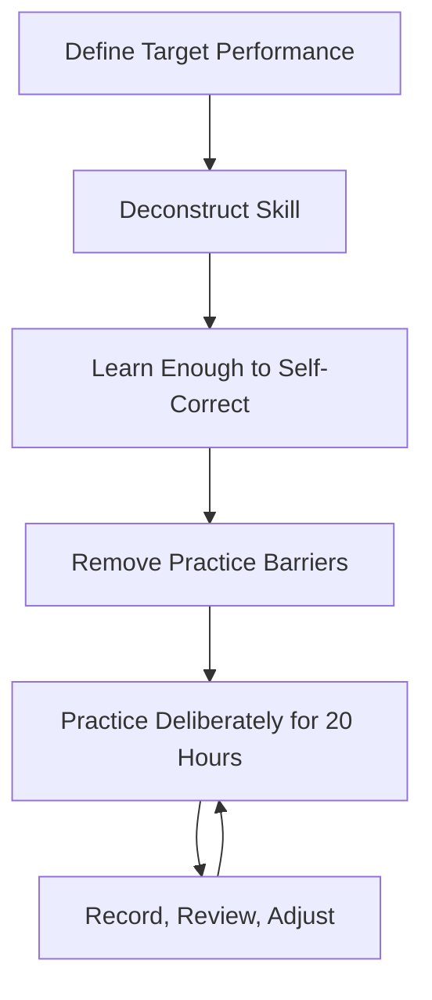

Penjelasan ringkas:

| Langkah | Makna Umum | Dalam Drum/Cajon |
|---|---|---|
| Define Target | Tentukan hasil yang ingin dicapai | Bisa mengiringi penyanyi, bukan solo drum |
| Deconstruct | Pecah skill besar menjadi sub-skill | pulse, groove, sound, dynamics, song form, fill |
| Learn Enough | Belajar teori secukupnya untuk koreksi diri | counting, metronome, struktur lagu, error timing |
| Remove Barriers | Hilangkan hambatan latihan | alat siap, metronome siap, lagu latihan siap |
| Practice | Latihan fokus minimal 20 jam | jadwal latihan deliberate, rekam, evaluasi |

---

# 2. Target Skill yang Tepat

## 2.1 Target yang Buruk

Target seperti ini kurang bagus:

> “Saya mau jago drum.”

Masalahnya:

- tidak ada batas,
- tidak ada standar selesai,
- tidak jelas apa yang dilatih dulu,
- terlalu banyak cabang,
- mudah membuat frustrasi.

Target seperti ini juga kurang bagus:

> “Saya mau bisa semua groove.”

Masalahnya:

- mustahil untuk 20 jam,
- terlalu pattern-oriented,
- tidak menjawab kebutuhan performa,
- mudah membuat kamu hafal pattern tetapi tidak bisa mengiringi lagu.

Target seperti ini juga kurang bagus:

> “Saya mau bisa main seperti drummer favorit saya.”

Masalahnya:

- drummer favorit mungkin sudah bermain ribuan jam,
- tekniknya dibangun dari fondasi panjang,
- style mereka belum tentu cocok untuk mengiringi penyanyi,
- kamu bisa terjebak mengejar ornament, bukan fungsi.

---

## 2.2 Target yang Bagus

Target seri ini:

> Dalam 20 jam latihan terstruktur, saya ingin mampu memainkan drum kit dan/atau cajon untuk mengiringi penyanyi pada lagu 4/4 dan 6/8 sederhana, dengan tempo stabil, groove dasar, dinamika section, fill aman, dan kemampuan membuat chart lagu sederhana.

Target ini bagus karena:

- spesifik,
- performatif,
- bisa diuji,
- bisa dipecah,
- relevan dengan kebutuhan nyata,
- tidak terlalu ambisius,
- tetap cukup menantang.

---

## 2.3 Acceptance Criteria Akhir 20 Jam

Di akhir 20 jam, kamu tidak perlu menjadi drummer hebat. Tetapi kamu harus bisa melakukan ini:

| Area | Standar Minimum |
|---|---|
| Pulse | Bisa menjaga tempo 3 menit tanpa drift ekstrem |
| Counting | Bisa menghitung 4/4 dan 6/8 sambil bermain |
| Drum kit | Bisa memainkan groove 4/4 dasar |
| Cajon | Bisa memainkan groove 4/4 dasar |
| Ballad | Bisa memainkan feel lambat atau 6/8 |
| Dynamics | Bisa membedakan verse dan chorus |
| Fill | Bisa memainkan fill 1 beat dan 1 bar tanpa keluar tempo |
| Song form | Bisa masuk, berhenti, dan pindah section |
| Singer support | Tidak menutup vokal |
| Recovery | Bisa lanjut saat salah tanpa panik |

---

# 3. Deconstruction: Skill Besar Dipecah Menjadi Sub-Skill

Belajar drum/cajon untuk accompaniment bukan satu skill tunggal. Ini kumpulan sub-skill yang saling terkait.

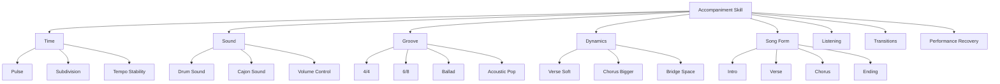

Sub-skill yang wajib dikuasai awal:

1. **Pulse**  
   Kemampuan merasakan ketukan utama.

2. **Subdivision**  
   Kemampuan membagi ketukan menjadi 8th note, 16th note, atau triplet.

3. **Basic sound production**  
   Kemampuan menghasilkan suara yang bersih dari drum atau cajon.

4. **Basic groove**  
   Kemampuan membangun pola yang stabil dan cocok untuk lagu.

5. **Dynamics**  
   Kemampuan memainkan pelan, sedang, besar, dan menahan diri.

6. **Song form awareness**  
   Kemampuan tahu posisi lagu: intro, verse, chorus, bridge, ending.

7. **Safe fill**  
   Kemampuan memberi transisi tanpa merusak tempo.

8. **Listening to vocalist**  
   Kemampuan mendengar frase vokal dan tidak menabraknya.

---

# 4. Skill yang Harus Ditunda

Salah satu bentuk disiplin belajar adalah tahu apa yang **tidak** dipelajari dulu.

Untuk 20 jam pertama, tunda hal-hal ini:

| Ditunda | Kenapa Ditunda |
|---|---|
| Drum solo | Tidak relevan untuk mengiringi penyanyi |
| Double pedal | Overkill untuk target accompaniment |
| Odd meter kompleks | Belum perlu untuk lagu umum |
| Semua 40 rudiment | Terlalu banyak, cukup subset minimum |
| Fill cepat | Biasanya merusak tempo pemula |
| Linear drumming kompleks | Butuh koordinasi lanjut |
| Jazz independence lanjut | Belum prioritas |
| Latin percussion tradisional mendalam | Terlalu luas |
| Polyrhythm | Belum perlu untuk target performa |
| Notasi drum penuh | Berguna nanti, tapi bukan blocker awal |

Prinsipnya:

> Jangan belajar hal yang membuatmu terlihat canggih di latihan, tetapi tidak membuatmu lebih berguna saat mengiringi penyanyi.

---

# 5. Mental Model untuk Software Engineer

Sebagai software engineer, kamu terbiasa berpikir deterministic:

- input jelas,
- proses jelas,
- output jelas,
- bug bisa direproduksi,
- solusi bisa diuji.

Musik punya sisi yang berbeda:

- feel bisa berubah tergantung konteks,
- pattern yang benar di satu lagu bisa salah di lagu lain,
- timing bukan hanya matematis, tetapi juga sosial,
- volume yang benar tergantung penyanyi dan ruangan,
- “lebih banyak note” sering berarti “lebih buruk”.

Namun cara pikir engineering tetap sangat berguna jika dipakai dengan benar.

## 5.1 Drum sebagai Runtime Clock

Dalam sistem distributed, clock yang tidak stabil menyebabkan banyak masalah. Dalam band, drummer adalah semacam clock sosial.

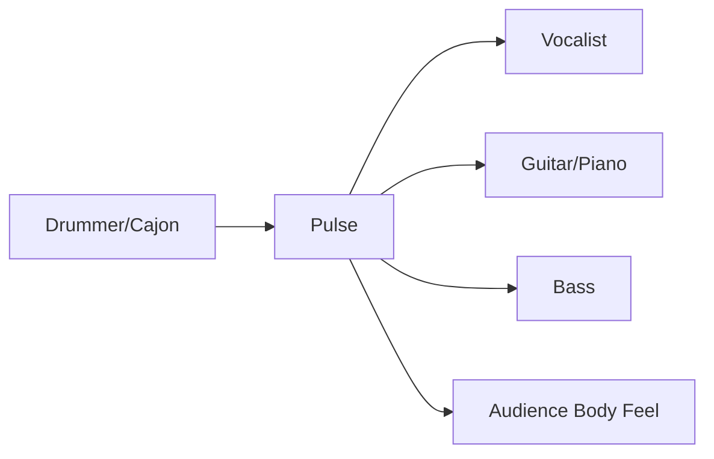

Kalau clock goyang:

- penyanyi sulit phrasing,
- gitar/piano ragu,
- bass tidak lock,
- lagu terasa tidak nyaman,
- audience tidak bisa ikut merasakan groove.

Tempo stabil bukan sekadar metronome accuracy. Tempo stabil berarti:

- tidak rush saat chorus,
- tidak drag saat verse lembut,
- tidak panik saat fill,
- tidak melambat saat susah,
- tidak mempercepat saat nervous.

---

## 5.2 Groove sebagai Event Loop

Groove adalah loop. Tetapi loop musik bukan hanya pengulangan mati.

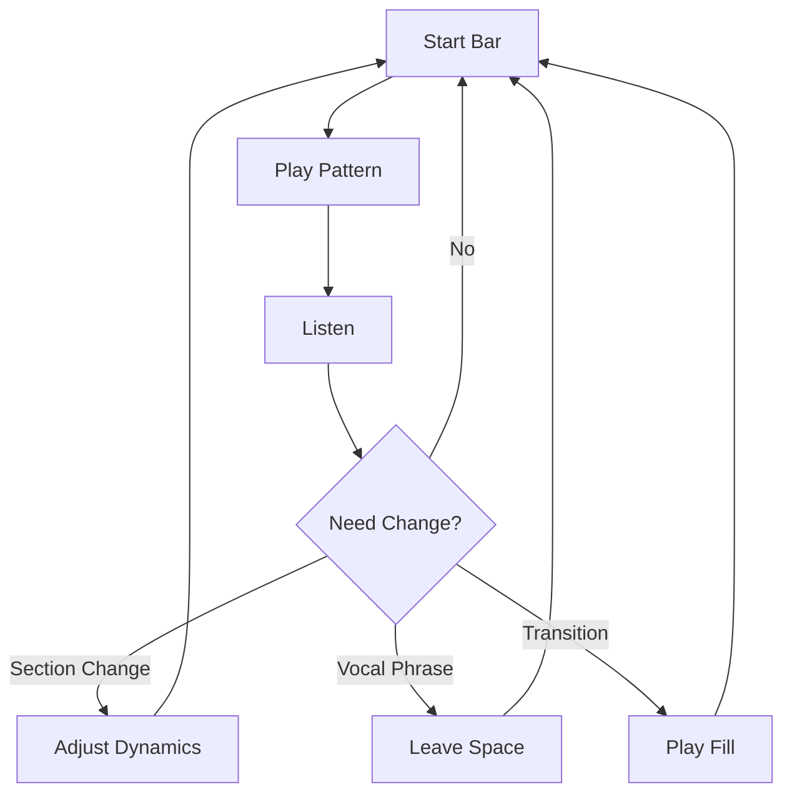

Dalam software, loop yang baik:

- stabil,
- predictable,
- tidak memory leak,
- tidak blocking tanpa alasan,
- merespons event.

Dalam drum/cajon, groove yang baik:

- stabil,
- predictable,
- tidak terlalu penuh,
- tidak menutup vokal,
- merespons perubahan section.

---

## 5.3 Fill sebagai State Transition

Fill bukan “hiasan bebas”. Fill adalah sinyal transisi.

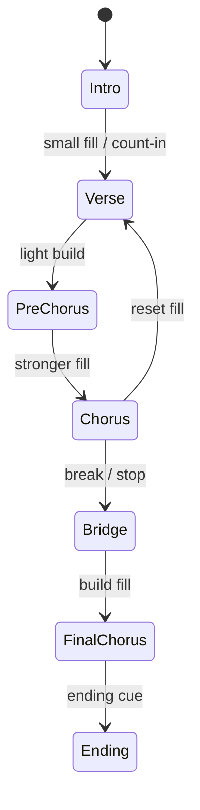

Kesalahan pemula:

- fill terlalu sering,
- fill terlalu panjang,
- fill menabrak vokal,
- fill membuat tempo rush,
- fill tidak memberi informasi musikal.

Rule awal:

> Fill hanya dimainkan jika membantu lagu berpindah state.

---

## 5.4 Dynamics sebagai Load Balancer Energi

Bayangkan lagu punya energy budget. Kalau kamu main besar dari awal, chorus tidak punya tempat untuk naik.

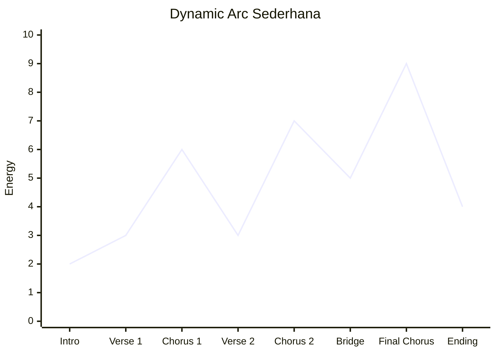

Dalam accompaniment, kamu harus bertanya:

- section ini harus naik atau turun?
- vokal sedang intim atau besar?
- gitar/piano sudah penuh atau kosong?
- apakah ruangan kecil?
- apakah penyanyi butuh ruang napas?

---

# 6. Perbedaan Belajar Drum Kit dan Cajon

Drum kit dan cajon punya fungsi yang mirip, tetapi mekaniknya berbeda.

## 6.1 Drum Kit

Drum kit punya separasi limb:

| Fungsi | Instrumen |
|---|---|
| Pulse bawah | Kick drum |
| Backbeat | Snare |
| Subdivision | Hi-hat atau ride |
| Marker section | Crash |
| Fill color | Tom |

Model dasar:

```text
Hi-hat : 1 & 2 & 3 & 4 &
Snare  :     2       4
Kick   : 1       3
```

Drum kit lebih cocok untuk:

- full band,
- lagu yang butuh energi besar,
- rock/pop kuat,
- worship full band,
- panggung dengan sound system memadai,
- lagu yang butuh dynamic ceiling tinggi.

Risiko drum kit untuk pemula:

- terlalu keras,
- koordinasi limb lebih kompleks,
- fill mudah berlebihan,
- setup lebih ribet,
- sound buruk bisa sangat mengganggu.

---

## 6.2 Cajon

Cajon adalah alat yang lebih sederhana secara setup, tetapi tidak otomatis lebih mudah secara musikal.

Pemetaan umum:

| Fungsi Drum Kit | Fungsi Cajon |
|---|---|
| Kick | Bass tone |
| Snare | Slap tone |
| Hi-hat | Touch / ghost note / shaker |
| Tom fill | Bass-slap variation |
| Brush texture | Finger roll / light tap |

Model dasar:

```text
Touch : 1 & 2 & 3 & 4 &
Slap  :     2       4
Bass  : 1       3
```

Cajon lebih cocok untuk:

- acoustic session,
- cafe,
- penyanyi solo,
- ruangan kecil,
- rehearsal sederhana,
- lagu intim,
- worship kecil,
- format gitar-vokal.

Risiko cajon untuk pemula:

- slap terlalu keras,
- bass tidak jelas,
- tangan cepat sakit,
- pattern monoton,
- tempo goyang karena tidak ada pedal,
- terlalu banyak menepuk tanpa dinamika.

---

# 7. The 20-Hour Design

Dalam framework ini, 20 jam bukan angka magis yang membuat kamu ahli. 20 jam adalah cukup untuk melewati fase awal yang paling canggung jika latihanmu tepat.

Masalah terbesar pemula biasanya bukan kurang bakat. Masalahnya adalah:

- latihan tidak jelas,
- tidak ada feedback,
- terlalu banyak materi,
- tidak tahu error-nya apa,
- terlalu cepat ingin main lagu sulit,
- tidak konsisten,
- tidak tahu standar “cukup baik”.

## 7.1 Pembagian 20 Jam

```mermaid
gantt
    title 20-Hour Practice Architecture
    dateFormat  X
    axisFormat %s

    section Foundation
    Pulse and Counting        :0, 2
    Sound Production          :2, 4

    section Groove
    Drum 4/4 Groove           :4, 6
    Cajon 4/4 Groove          :6, 8
    Metronome Stability       :8, 10

    section Song Application
    Song Form                 :10, 12
    Dynamics                  :12, 14
    Safe Fills                :14, 16

    section Performance
    6/8 and Ballad Feel       :16, 18
    Mock Performance          :18, 19
    Final Recording           :19, 20
```

## 7.2 Detail Pembagian

| Jam | Fokus | Output |
|---:|---|---|
| 1 | Counting 4/4, pulse, clap | Bisa hitung keras sambil tepuk |
| 2 | Subdivision 8th dan 16th | Bisa menjaga grid sederhana |
| 3 | Drum sound: kick, snare, hi-hat | Suara dasar bersih |
| 4 | Cajon sound: bass, slap, touch | Suara dasar terpisah |
| 5 | Drum groove 4/4 sangat dasar | Bisa 1 menit stabil |
| 6 | Drum groove variasi kick | Bisa 2–3 variasi |
| 7 | Cajon groove 4/4 dasar | Bisa 1 menit stabil |
| 8 | Cajon variation dan dynamics | Bisa verse/chorus sederhana |
| 9 | Metronome every beat | Bisa ikut click |
| 10 | Metronome sparse click | Mulai internal clock |
| 11 | Song form | Bisa map lagu |
| 12 | Transisi section | Bisa masuk chorus |
| 13 | Dynamics | Bisa 5 level volume |
| 14 | Vocal sensitivity | Bisa tidak menabrak vokal |
| 15 | Fill 1 beat | Bisa transisi aman |
| 16 | Fill 1 bar | Bisa balik groove |
| 17 | 6/8 feel | Bisa pola ballad |
| 18 | Slow song control | Tidak rush di tempo lambat |
| 19 | Mock performance | 2 lagu penuh |
| 20 | Final recording | 3 lagu/evaluasi |

---

# 8. Practice Loop

Latihan yang baik tidak berbentuk:

> main → salah → ulang asal → capek.

Latihan yang baik berbentuk:

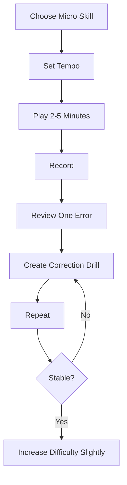

Contoh:

- Micro skill: groove 4/4 dengan snare di 2 dan 4.
- Tempo: 70 BPM.
- Latihan: 3 menit.
- Rekam: pakai handphone.
- Review: ternyata kick rush sebelum snare.
- Correction drill: main kick-snare saja tanpa hi-hat.
- Repeat: ulang di 60 BPM.
- Stable: baru naik ke 70 BPM.

---

# 9. Rule Latihan: Jangan Menambah Kompleksitas Saat Fondasi Belum Stabil

Kesalahan umum:

> “Groove ini sudah membosankan, saya tambah fill.”

Padahal groove-nya belum stabil.

Rule:

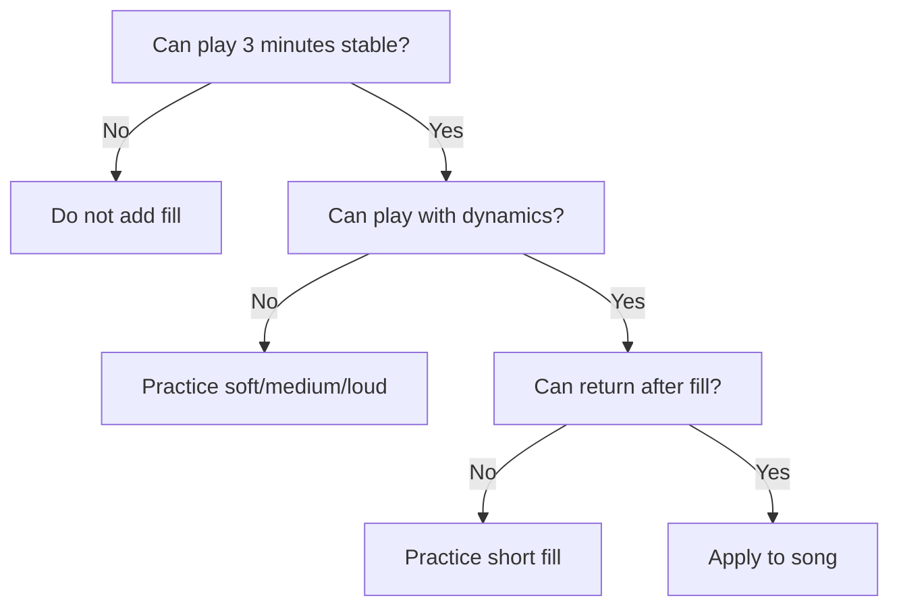

Sebelum menambah variasi, pastikan:

- tempo stabil,
- suara konsisten,
- badan rileks,
- bisa menghitung,
- bisa berhenti dan masuk lagi,
- bisa bermain pelan.

---

# 10. Learn Enough to Self-Correct

Teori minimum yang harus kamu tahu:

## 10.1 Counting 4/4

```text
Quarter notes:
1   2   3   4

Eighth notes:
1 & 2 & 3 & 4 &

Sixteenth notes:
1 e & a 2 e & a 3 e & a 4 e & a
```

## 10.2 Counting 6/8

```text
1 2 3 4 5 6
Accent: 1 and 4
```

Atau:

```text
ONE two three FOUR five six
```

## 10.3 Backbeat

Backbeat biasanya snare/slap di beat 2 dan 4 dalam 4/4.

```text
Count : 1 & 2 & 3 & 4 &
Snare :     X       X
```

## 10.4 Downbeat

Downbeat adalah beat 1, titik awal bar.

```text
1 2 3 4 | 1 2 3 4
^         ^
downbeat  downbeat
```

## 10.5 Fill

Fill adalah variasi pendek untuk transisi, biasanya di akhir phrase.

```text
Bar 1: groove
Bar 2: groove
Bar 3: groove
Bar 4: fill
Bar 5: new section
```

## 10.6 Dynamics

Dynamics bukan hanya keras-pelan. Dynamics adalah cara energi lagu bergerak.

```text
Verse  : soft, controlled
Chorus : bigger, open
Bridge : thinner or suspended
Final  : biggest or most emotional
```

---

# 11. Remove Barriers: Setup Minimum

## 11.1 Alat Minimum untuk Drum Kit

Ideal:

- drum kit,
- throne/kursi drum,
- stick 5A,
- metronome app,
- ear protection,
- phone untuk rekaman.

Jika belum punya drum kit:

- practice pad,
- kaki kanan di lantai sebagai kick,
- tangan kiri di paha sebagai snare,
- tangan kanan di meja/pad sebagai hi-hat.

## 11.2 Alat Minimum untuk Cajon

Ideal:

- cajon,
- metronome app,
- phone untuk rekaman,
- kursi/cajon height nyaman,
- optional shaker.

Jika belum punya cajon:

- box/kardus tebal,
- paha sebagai bass/slap approximation,
- meja kayu,
- latihan counting dan hand coordination.

## 11.3 Practice Environment

Sebelum latihan, semua harus siap:

| Item | Harus Siap? |
|---|---|
| Metronome app | Ya |
| Timer | Ya |
| Rekaman HP | Ya |
| Lagu latihan | Ya |
| Practice log | Ya |
| Stick/cajon | Ya |
| Air minum | Disarankan |
| Ear protection | Disarankan untuk drum kit |

Tujuannya: mengurangi friction. Jangan sampai 15 menit habis hanya untuk cari backing track.

---

# 12. Practice Log

Gunakan format sederhana:

```md
## Practice Log

Tanggal:
Durasi:
Instrumen:
Tempo:
Fokus:

### Latihan
- 
- 
- 

### Yang Sudah Stabil
- 

### Error yang Terdengar
- 

### Correction Drill
- 

### Target Sesi Berikutnya
- 
```

Contoh:

```md
## Practice Log

Tanggal: 2026-06-25
Durasi: 35 menit
Instrumen: Cajon
Tempo: 70 BPM
Fokus: groove 4/4 bass-slap-touch

### Latihan
- 5 menit counting 1 & 2 & 3 & 4 &
- 10 menit bass di 1/3, slap di 2/4
- 10 menit touch 8th note
- 5 menit rekam
- 5 menit review

### Yang Sudah Stabil
- Slap mulai konsisten
- Bisa 1 menit tanpa berhenti

### Error yang Terdengar
- Bass terlalu lemah
- Tempo rush setelah bar ke-8

### Correction Drill
- Latihan bass saja di beat 1 dan 3 selama 5 menit
- Main di 60 BPM

### Target Sesi Berikutnya
- 2 menit stabil di 70 BPM
```

---

# 13. Practice Unit: Sesi 30 Menit

Untuk pemula, 30 menit yang fokus lebih baik daripada 2 jam asal main.

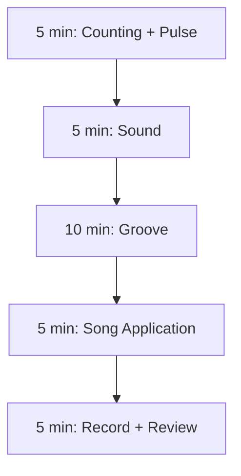

## Format 30 Menit

| Durasi | Fokus | Contoh |
|---:|---|---|
| 5 menit | Counting | Tepuk 1 & 2 & 3 & 4 & |
| 5 menit | Sound | Kick/snare atau bass/slap |
| 10 menit | Groove | 4/4 basic |
| 5 menit | Song | Main bersama lagu |
| 5 menit | Review | Dengarkan rekaman |

Rule penting:

> Setiap sesi harus menghasilkan satu temuan error.

Kalau kamu selesai latihan tanpa tahu error apa pun, kemungkinan kamu tidak benar-benar mendengar.

---

# 14. Cara Memilih Materi Latihan

Jangan pilih lagu karena keren. Pilih lagu karena sesuai archetype.

Untuk 20 jam pertama, pilih lagu dengan:

- tempo sedang,
- struktur jelas,
- drum/cajon tidak terlalu ramai,
- vokal dominan,
- chord progression sederhana,
- verse dan chorus mudah dibedakan,
- tidak banyak stop/break aneh.

Hindari dulu:

- lagu dengan tempo sangat cepat,
- metal/punk cepat,
- funk ghost note kompleks,
- jazz swing cepat,
- prog rock,
- lagu dengan banyak perubahan meter,
- lagu live version dengan improvisasi panjang.

---

# 15. Tiga Mode Latihan

## 15.1 Mode Mekanik

Tujuan: tubuh bisa melakukan gerakan.

Contoh:

- bass cajon di beat 1 dan 3,
- slap di beat 2 dan 4,
- hi-hat 8th note,
- kick-snare coordination.

Fokus:

- akurasi,
- suara,
- koordinasi,
- tidak tegang.

## 15.2 Mode Timing

Tujuan: stabil terhadap clock.

Contoh:

- main dengan metronome,
- click di semua beat,
- click hanya di 2 dan 4,
- rekam tanpa click lalu cek drift.

Fokus:

- tidak rush,
- tidak drag,
- tetap stabil setelah fill,
- bisa main pelan.

## 15.3 Mode Musik

Tujuan: cocok untuk lagu.

Contoh:

- main bersama vocal track,
- bedakan verse/chorus,
- isi transisi,
- diam saat vokal penting.

Fokus:

- taste,
- dynamics,
- song form,
- supporting vocalist.

Ketiganya harus ada.

Kalau hanya mekanik, kamu menjadi pemain pattern.

Kalau hanya timing, kamu menjadi metronome manusia tetapi kurang musikal.

Kalau hanya musik tanpa timing, kamu ekspresif tetapi tidak reliable.

---

# 16. Failure Model Belajar Drum/Cajon

Sebagai engineer, gunakan failure modelling.

```mermaid
flowchart TD
    A[Performance Failure] --> B[Timing Failure]
    A --> C[Sound Failure]
    A --> D[Dynamic Failure]
    A --> E[Form Failure]
    A --> F[Listening Failure]
    A --> G[Recovery Failure]

    B --> B1[Rushing]
    B --> B2[Dragging]
    B --> B3[Tempo collapses after fill]

    C --> C1[Slap inconsistent]
    C --> C2[Kick weak]
    C --> C3[Hi-hat too loud]

    D --> D1[Verse too loud]
    D --> D2[Chorus not lifted]
    D --> D3[No contrast]

    E --> E1[Missed chorus]
    E --> E2[Wrong ending]
    E --> E3[Lost bar count]

    F --> F1[Covers vocal]
    F --> F2[Ignores singer cue]
    F --> F3[Does not lock with guitar]

    G --> G1[Stops after mistake]
    G --> G2[Panic fill]
    G --> G3[Loses confidence]
```

Setiap failure punya correction drill. Jangan hanya berkata “saya kurang latihan”. Lebih presisi:

- error timing?
- error sound?
- error form?
- error listening?
- error dynamic?
- error recovery?

Diagnosis presisi membuat latihan lebih cepat.

---

# 17. Minimum Viable Drummer/Cajon Player

Untuk accompaniment, minimum viable player bukan orang yang punya banyak pattern. Minimum viable player adalah orang yang bisa dipercaya.

Ciri-cirinya:

1. Masuk tepat waktu.
2. Menjaga tempo.
3. Tidak bermain terlalu keras.
4. Bisa mengikuti struktur lagu.
5. Fill sederhana tetapi aman.
6. Mendengar penyanyi.
7. Bisa berhenti saat perlu.
8. Bisa recover saat salah.
9. Bisa menjaga groove walau bosan.
10. Bisa membuat lagu terasa lebih enak daripada tanpa drum/cajon.

---

# 18. Anti-Pattern Belajar

## 18.1 Pattern Hoarding

Gejala:

- mengumpulkan banyak pattern YouTube,
- mencoba banyak groove,
- tidak ada yang stabil,
- tidak bisa main satu lagu penuh.

Solusi:

- pilih 3 groove saja,
- latih sampai 3 menit stabil,
- aplikasikan ke lagu.

## 18.2 Fill Addiction

Gejala:

- setiap 2 bar ingin fill,
- fill lebih keras dari vokal,
- tempo naik saat fill,
- lupa kembali ke groove.

Solusi:

- hanya fill di akhir 4 atau 8 bar,
- fill maksimal 1 beat dulu,
- rekam dan cek tempo.

## 18.3 Volume Blindness

Gejala:

- merasa main normal,
- tetapi vokal tenggelam,
- cajon slap terlalu tajam,
- hi-hat menusuk.

Solusi:

- rekam dari jarak pendengar,
- latihan 5 level volume,
- main lebih pelan dari yang terasa nyaman.

## 18.4 Metronome Dependency

Gejala:

- stabil saat click keras,
- langsung goyang tanpa click,
- tidak bisa merasakan pulse internal.

Solusi:

- click every beat,
- lalu click di 2 dan 4,
- lalu click hanya beat 1,
- lalu 1 bar click, 1 bar silent.

## 18.5 Over-Engineering

Gejala:

- terlalu lama menganalisis pattern,
- takut main karena belum paham teori,
- ingin sistem sempurna sebelum praktik,
- menganggap musik seperti deterministic algorithm.

Solusi:

- mainkan versi paling sederhana,
- rekam,
- koreksi satu error,
- ulang.

Musik membutuhkan model, tetapi model harus diuji lewat tubuh dan telinga.

---

# 19. Rule of Simplicity

Untuk 20 jam pertama, gunakan aturan ini:

> Pattern sederhana yang stabil dan mendukung vokal lebih bernilai daripada pattern kompleks yang goyang.

Contoh:

Buruk:

```text
Pattern ramai + fill banyak + tempo goyang + vokal tertutup
```

Baik:

```text
Kick 1/3 + snare 2/4 + hi-hat 8th + dinamika rapi
```

Untuk cajon:

Buruk:

```text
Slap keras terus + bass tidak jelas + tempo naik saat chorus
```

Baik:

```text
Bass 1/3 + slap 2/4 + touch ringan + chorus sedikit lebih besar
```

---

# 20. First 20 Hours: Practical Contract

Sebelum lanjut, buat kontrak belajar:

```md
# Drum/Cajon 20-Hour Contract

Saya belajar bukan untuk menjadi drummer profesional dalam 20 jam.
Saya belajar untuk mampu mengiringi penyanyi secara stabil, musikal, dan bisa dipercaya.

Target:
- 3 lagu penuh
- minimal 1 lagu drum kit
- minimal 1 lagu cajon
- minimal 1 lagu ballad/6-8
- bisa rekam dan evaluasi

Batasan:
- tidak mengejar solo
- tidak mengejar pattern kompleks
- tidak mengejar semua rudiment
- tidak menambah fill sebelum groove stabil

Metode:
- latihan 30-45 menit per sesi
- metronome wajib
- rekaman wajib
- practice log wajib
- koreksi satu error per sesi
```

---

# 21. Latihan Part Ini

Part ini belum menuntut alat. Latihan utamanya adalah desain sistem belajar.

## Latihan 1 — Tulis Target Personal

Lengkapi:

```md
Saya ingin bisa mengiringi penyanyi dalam konteks:
- acoustic cafe / worship / band / recording / latihan pribadi: 
- lagu yang ingin saya iringi:
- instrumen utama yang ingin saya prioritaskan dulu:
- drum kit / cajon / keduanya:
- waktu latihan per hari:
- kendala utama:
```

## Latihan 2 — Pilih 3 Lagu Target

Pilih 3 lagu:

| Lagu | Meter | Tempo | Instrumen |
|---|---|---|---|
| Lagu 1 | 4/4 | slow/medium | cajon |
| Lagu 2 | 4/4 | medium | drum kit |
| Lagu 3 | 6/8 atau ballad | slow | bebas |

Tidak perlu sempurna. Nanti akan direvisi.

## Latihan 3 — Setup Practice Environment

Siapkan:

- metronome app,
- timer,
- phone recording,
- folder rekaman,
- practice log,
- alat atau substitusi alat.

## Latihan 4 — Baseline Recording

Rekam 1 menit:

- tepuk quarter note di 70 BPM,
- tepuk backbeat di 2 dan 4,
- hitung keras `1 & 2 & 3 & 4 &`.

Tujuan: bukan bagus, tetapi punya baseline.

---

# 22. Acceptance Criteria Part Ini

Kamu boleh lanjut ke part berikutnya jika:

- bisa menjelaskan target 20 jam dalam satu kalimat,
- tahu sub-skill utama yang akan dilatih,
- tahu skill yang sengaja ditunda,
- sudah menyiapkan metronome dan practice log,
- sudah memilih minimal 1 lagu latihan,
- paham bahwa accompaniment adalah support role, bukan show-off role.

---

# 23. Ringkasan

Framework Kaufman membantu kita menghindari jebakan belajar musik secara acak.

Untuk drum/cajon, target 20 jam bukan menjadi master, tetapi menjadi **pengiring yang cukup reliable**.

Sub-skill prioritas:

1. pulse,
2. counting,
3. sound,
4. groove,
5. dynamics,
6. song form,
7. fill aman,
8. listening,
9. recovery.

Sebagai software engineer, gunakan kekuatanmu:

- decomposition,
- feedback loop,
- error diagnosis,
- structured practice,
- incremental improvement.

Tetapi hati-hati dengan jebakan:

- over-analysis,
- mencari pattern sempurna,
- menganggap musik sepenuhnya deterministic,
- mengabaikan rasa, dinamika, dan konteks.

---

# 24. Latihan untuk Part Berikutnya

Sebelum membaca Part 002, lakukan ini:

1. Tulis kontrak belajar 20 jam.
2. Pilih 3 lagu target sementara.
3. Install/metronome app.
4. Buat practice log.
5. Rekam baseline 1 menit tepuk 4/4.

Part berikutnya akan membahas:

> peran drummer/cajon player saat mengiringi penyanyi, kenapa fungsi utamanya adalah menjaga waktu, energi, transisi, dan ruang vokal.
