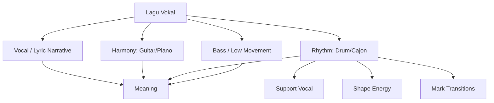
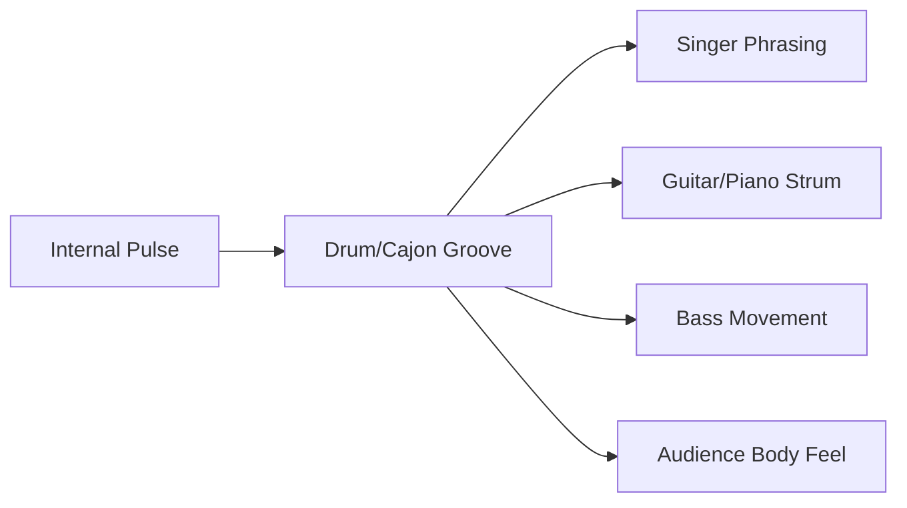
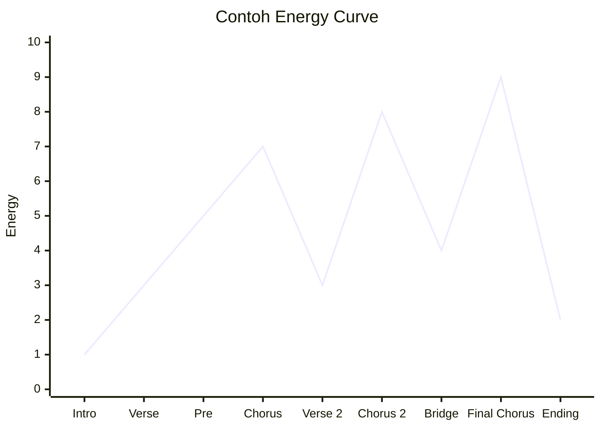
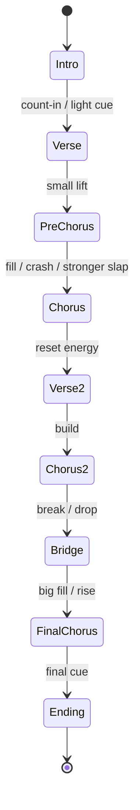
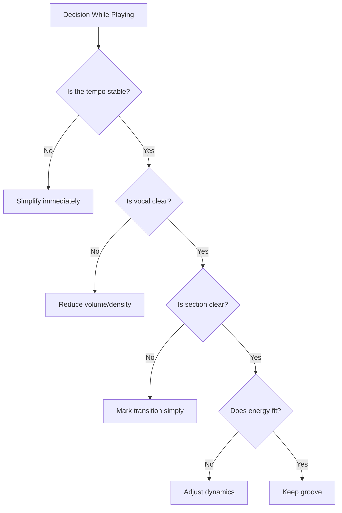
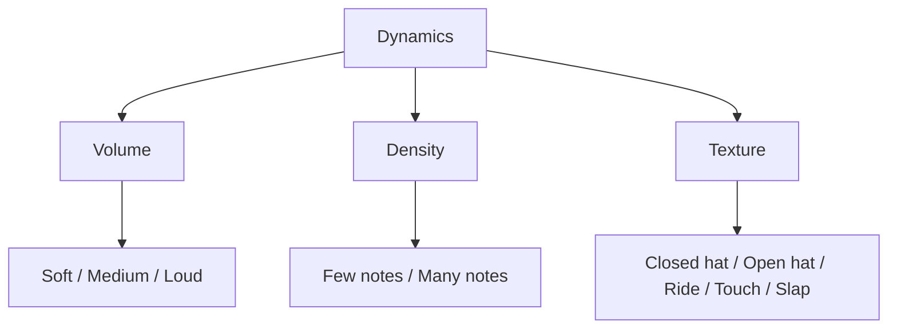
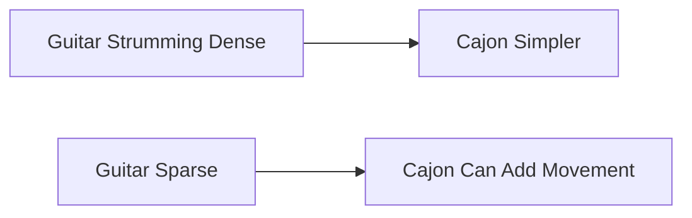
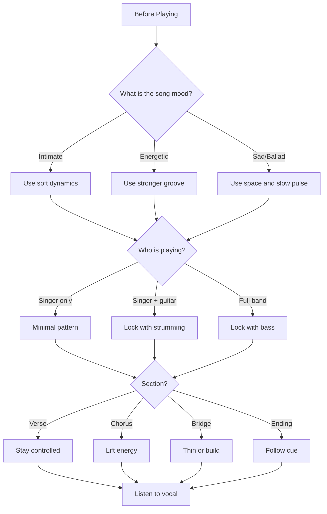
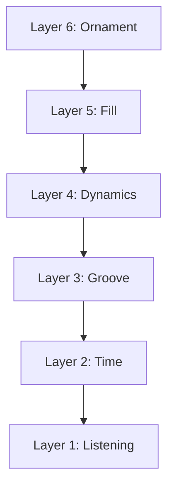

# learn-drum-cajon-part-002.md

# Part 002 — Peran Drummer/Cajon Player Saat Mengiringi Penyanyi

## Status Seri

- Seri: `learn-drum-cajon`
- Part: `002`
- Topik: Peran musikal drummer/cajon player dalam accompaniment
- Target akhir seri: mampu mengiringi penyanyi dengan drum dan/atau cajon secara stabil, musikal, dan sadar konteks
- Status: seri belum selesai
- Part sebelumnya: `learn-drum-cajon-part-001.md`
- Part berikutnya: `learn-drum-cajon-part-003.md`

---

## Tujuan Part Ini

Part ini membahas identitas peran. Sebelum belajar pattern, sticking, fill, atau teknik cajon, kamu perlu memahami **apa pekerjaan sebenarnya** dari drummer/cajon player ketika mengiringi penyanyi.

Setelah part ini, kamu harus paham bahwa tugas utama drummer/cajon player bukan:

- bermain paling ramai,
- menunjukkan teknik,
- mengisi semua ruang kosong,
- membuat lagu terasa seperti drum exercise,
- selalu memberi fill,
- selalu menaikkan volume.

Tugas utamanya adalah:

1. menjaga pulse,
2. membentuk groove,
3. menopang penyanyi,
4. mengatur energi lagu,
5. memberi tanda transisi,
6. menjaga ruang musikal,
7. membantu lagu terasa utuh.

---

# 1. Prinsip Utama: Penyanyi adalah Primary Thread

Dalam lagu vokal, penyanyi adalah pusat narasi.

Lirik, melodi, napas, artikulasi, dan emosi vokal adalah jalur utama yang didengar pendengar. Drum/cajon harus mendukung jalur itu, bukan berebut perhatian dengannya.



Jika memakai analogi software:

- vokal adalah **main user-facing flow**,
- chord/harmony adalah **domain context**,
- drum/cajon adalah **runtime scheduler + energy controller**,
- fill adalah **state transition signal**,
- dynamics adalah **load shaping**.

Drum/cajon yang baik membuat penyanyi merasa:

- aman,
- tidak dikejar,
- tidak ditenggelamkan,
- punya ruang bernapas,
- bisa membangun emosi,
- tahu kapan masuk chorus,
- tahu kapan ending.

---

# 2. Peran Drummer/Cajon Player

## 2.1 Timekeeper

Peran pertama adalah menjaga waktu.

Ini tidak berarti bermain seperti mesin mati. Tetapi artinya kamu menjaga pulse agar semua orang punya referensi bersama.



Kalau timing kamu goyang:

- penyanyi bisa masuk terlalu cepat atau lambat,
- gitar/piano kehilangan rasa strumming,
- lagu terasa amatir,
- fill terasa seperti gangguan,
- semua orang mulai saling menyalahkan.

## 2.2 Groove Builder

Time saja belum cukup. Metronome punya time, tetapi tidak punya groove.

Groove adalah pola berulang yang membuat lagu terasa bergerak.

Groove terdiri dari:

- pulse,
- subdivision,
- aksen,
- suara,
- dinamika,
- feel,
- ruang.

Contoh groove 4/4 paling dasar:

```text
Count : 1 & 2 & 3 & 4 &
Hat   : x x x x x x x x
Snare :     o       o
Kick  : o       o
```

Cajon equivalent:

```text
Count : 1 & 2 & 3 & 4 &
Touch : x x x x x x x x
Slap  :     S       S
Bass  : B       B
```

Pattern ini sederhana, tetapi jika stabil dan dinamis, sudah cukup untuk banyak lagu.

## 2.3 Energy Controller

Drum/cajon mengatur persepsi energi lagu.

Satu lagu bisa terasa:

- intim,
- ringan,
- tegang,
- naik,
- meledak,
- turun,
- selesai.

Perubahan itu sering dikendalikan oleh:

- volume,
- density,
- cymbal openness,
- cajon slap intensity,
- fill,
- stop,
- half-time feel,
- switch dari rim/touch ke full backbeat.



Drummer pemula sering salah karena:

- verse sudah terlalu keras,
- chorus tidak punya peningkatan,
- bridge tetap ramai padahal harus memberi ruang,
- ending terlalu mendadak,
- fill tidak sesuai energi.

## 2.4 Transition Manager

Drum/cajon memberi sinyal saat lagu berpindah section.

Contoh:

- intro ke verse,
- verse ke pre-chorus,
- pre-chorus ke chorus,
- chorus ke verse,
- bridge ke final chorus,
- final chorus ke ending.

Dalam state machine:



Fill adalah salah satu tool transition, tetapi bukan satu-satunya.

Transition bisa berupa:

- fill,
- crash,
- stop,
- open hi-hat,
- louder slap,
- silence,
- pickup,
- count-in,
- dynamic swell.

## 2.5 Space Protector

Musik bukan hanya note. Musik juga ruang.

Ruang dibutuhkan agar:

- vokal terdengar,
- lirik masuk,
- emosi punya tempat,
- chord bisa bernapas,
- audience tidak lelah,
- chorus punya dampak.

Drum/cajon yang terlalu penuh membuat lagu sesak.

Prinsip:

> Jangan mengisi setiap ruang kosong. Sebagian ruang kosong adalah bagian dari aransemen.

## 2.6 Emotional Amplifier

Drum/cajon mempertebal emosi yang sudah ada, bukan memaksakan emosi baru.

Jika lagu sedih dan intim, cajon bisa:

- bermain lembut,
- slap tidak terlalu tajam,
- memakai touch,
- menghindari fill ramai,
- memberi pulse hangat.

Jika lagu anthem, drum kit bisa:

- membuka hi-hat,
- menambah crash,
- kick lebih padat,
- chorus lebih besar.

Jika lagu tegang, drum/cajon bisa:

- menahan density,
- memakai pattern repetitive,
- menunda crash,
- membuat build perlahan.

---

# 3. Bedanya Mengiringi Penyanyi dengan Bermain Drum Sendiri

## 3.1 Bermain Sendiri

Saat bermain sendiri, kamu bisa fokus pada:

- pattern,
- teknik,
- kecepatan,
- koordinasi,
- fill,
- sound,
- eksplorasi.

## 3.2 Mengiringi Penyanyi

Saat mengiringi penyanyi, prioritas berubah:

| Bermain Sendiri | Mengiringi Penyanyi |
|---|---|
| Teknik bisa jadi pusat | Vokal adalah pusat |
| Fill bebas dicoba | Fill harus melayani transisi |
| Volume bisa lebih besar | Volume harus jaga vokal |
| Pattern bisa kompleks | Pattern harus cocok lagu |
| Salah bisa berhenti | Salah harus recover |
| Fokus ke diri sendiri | Fokus ke ensemble |
| Tidak perlu cue | Harus baca cue |

Jadi pertanyaan pentingnya bukan:

> “Pattern apa yang keren?”

Tetapi:

> “Apa yang dibutuhkan lagu dan penyanyi saat ini?”

---

# 4. Hierarki Prioritas Saat Mengiringi

Ketika bingung, pakai hierarki ini:



Urutan prioritas:

1. **Tempo stabil**
2. **Vokal terdengar**
3. **Section jelas**
4. **Energi sesuai**
5. **Groove enak**
6. **Fill/ornament**

Fill berada di prioritas bawah. Kalau tempo belum stabil, jangan mengejar fill.

---

# 5. Vokal sebagai Constraint Utama

Vokal memiliki beberapa kebutuhan:

## 5.1 Ruang Frekuensi

Vokal berada di area frekuensi yang harus terdengar jelas. Snare yang terlalu keras, cajon slap yang tajam, atau cymbal yang berlebihan bisa menutupi artikulasi vokal.

Untuk pemula:

- hi-hat jangan terlalu keras,
- crash jangan sering,
- cajon slap jangan selalu full power,
- snare rimshot jangan dipakai terus,
- jangan fill di tengah kalimat vokal penting.

## 5.2 Ruang Ritmis

Penyanyi butuh ruang untuk phrasing. Vokal sering tidak jatuh tepat di grid seperti drum.

Kalau kamu terlalu penuh, vokal kehilangan ruang.

Contoh buruk:

```text
Vokal : "Aku ingin pulang..."
Drum  : fill ramai di antara setiap kata
```

Contoh baik:

```text
Vokal : "Aku ingin pulang..."
Drum  : groove stabil, fill kecil setelah frase selesai
```

## 5.3 Ruang Napas

Penyanyi bernapas. Di sela napas, drummer bisa memberi respons kecil, tetapi jangan selalu.

Perhatikan:

- akhir kalimat,
- jeda sebelum chorus,
- kata panjang,
- nada tinggi,
- bagian lirikal penting.

Rule awal:

> Jangan fill saat penyanyi sedang menyampaikan kata penting.

---

# 6. Dynamics: Volume, Density, dan Texture

Banyak pemula mengira dynamics hanya volume. Padahal ada tiga dimensi utama:



## 6.1 Volume

Seberapa keras kamu bermain.

Contoh:

- verse: pelan,
- chorus: sedang-besar,
- final chorus: terbesar,
- ending: turun.

## 6.2 Density

Seberapa banyak note yang dimainkan.

Verse bisa memakai:

```text
Kick : 1       3
Snare:     2       4
Hat  : 1 & 2 & 3 & 4 &
```

Chorus bisa menambah kick:

```text
Kick : 1   &   3 &
Snare:     2       4
Hat  : 1 & 2 & 3 & 4 &
```

Cajon verse:

```text
Bass : 1       3
Slap :     2       4
Touch: light
```

Cajon chorus:

```text
Bass : 1   &   3 &
Slap :     2       4
Touch: stronger
```

## 6.3 Texture

Jenis suara yang dipakai.

Drum kit:

- closed hi-hat = tight,
- open hi-hat = lift,
- ride = wider,
- crash = marker,
- rim click = soft/intimate.

Cajon:

- touch = intimate,
- slap = backbeat,
- bass = body,
- finger roll = texture,
- shaker = movement.

---

# 7. Role Berdasarkan Format Ensemble

## 7.1 Penyanyi Solo + Cajon

Ini format sangat sensitif.

Prioritas:

- vokal jelas,
- cajon tidak terlalu keras,
- groove sederhana,
- banyak ruang,
- fill minimal.

Cocok untuk:

- ballad,
- acoustic pop,
- folk,
- worship kecil,
- cafe.

Risiko:

- slap terlalu tajam,
- cajon terdengar seperti orang mengetuk meja,
- tidak ada dynamic arc,
- terlalu monoton.

Strategi:

- gunakan bass lembut,
- slap dikontrol,
- touch sebagai pengisi halus,
- chorus sedikit lebih besar,
- ending disepakati.

## 7.2 Penyanyi + Gitar + Cajon

Cajon harus lock dengan strumming gitar.

Jika gitar sudah memainkan banyak strum 16th note, cajon jangan ikut terlalu ramai.



Rule:

- kalau gitar padat, cajon lebih sederhana,
- kalau gitar jarang, cajon boleh memberi subdivision,
- jangan menabrak aksen strumming utama.

## 7.3 Penyanyi + Piano + Cajon

Piano punya range besar dan bisa sangat penuh. Cajon harus menjaga ruang.

Strategi:

- main lebih lembut,
- pakai bass/slap jelas,
- touch secukupnya,
- hindari fill saat piano mengisi,
- dengarkan tangan kiri piano.

## 7.4 Full Band + Drum Kit

Drum kit harus lock dengan bass.

Prioritas:

- kick dengan bass,
- snare sebagai backbeat,
- hi-hat menjaga subdivision,
- crash menandai section,
- fill memberi transisi.

Risiko:

- terlalu keras,
- cymbal menutup vokal,
- fill menabrak gitar/vokal,
- tidak mendengar bass.

## 7.5 Worship / Church Band

Biasanya butuh dynamic build yang panjang.

Ciri:

- intro atmosferik,
- verse lembut,
- pre-chorus build,
- chorus besar,
- bridge bisa naik berulang,
- final chorus besar,
- ending bisa drop.

Strategi:

- jangan langsung besar,
- simpan crash,
- gunakan open hi-hat untuk lift,
- ikuti worship leader,
- siap berhenti/drop tiba-tiba.

## 7.6 Cafe Acoustic

Prioritas:

- volume rendah,
- groove hangat,
- tidak mengganggu percakapan,
- vokal tetap jelas,
- alat ringkas.

Cajon sering lebih cocok daripada drum kit.

---

# 8. Common Mistakes Saat Mengiringi Penyanyi

## 8.1 Terlalu Keras

Gejala:

- penyanyi memaksa suara,
- lirik tidak jelas,
- sound terasa kasar,
- audience fokus ke drum/cajon bukan lagu.

Solusi:

- main 30% lebih pelan dari yang kamu rasa normal,
- rekam dari jarak pendengar,
- gunakan touch/rim lebih banyak,
- kurangi crash/slap keras.

## 8.2 Terlalu Banyak Fill

Gejala:

- lagu terasa gelisah,
- penyanyi terganggu,
- tempo naik,
- section tidak terasa jelas karena semua tempat diisi.

Solusi:

- fill hanya di akhir 4/8 bar,
- maksimal 1 beat dulu,
- fill setelah frase vokal, bukan di atasnya,
- gunakan silence sebagai fill.

## 8.3 Tidak Tahu Bentuk Lagu

Gejala:

- masuk chorus terlambat,
- fill di tempat salah,
- ending berantakan,
- bingung saat bridge.

Solusi:

- buat song chart,
- hitung bar,
- tandai lyric cue,
- latihan dengan lagu asli.

## 8.4 Groove Tidak Stabil

Gejala:

- verse lambat, chorus cepat,
- fill membuat tempo berubah,
- penyanyi terlihat tidak nyaman.

Solusi:

- metronome,
- latihan tanpa fill,
- rekam,
- main lebih sederhana.

## 8.5 Tidak Mendengar Penyanyi

Gejala:

- fill di atas kata penting,
- volume tidak turun saat vokal lembut,
- tidak mengikuti cue napas,
- tetap main saat penyanyi ingin break.

Solusi:

- dengarkan vokal lebih keras daripada drum sendiri,
- latihan dengan vocal-only mindset,
- tonton mulut/badan penyanyi,
- sisakan ruang.

---

# 9. Decision Rules Saat Bermain

Gunakan rule sederhana.

## 9.1 Jika Ragu, Sederhanakan

```text
Jika bingung → main pattern dasar.
Jika hampir salah → kurangi note.
Jika vokal lembut → turunkan volume.
Jika chorus datang → naikkan sedikit energi.
Jika tidak tahu fill → jangan fill.
```

## 9.2 Jangan Mengorbankan Tempo untuk Fill

Jika fill membuat tempo goyang, fill itu belum siap.

Better:

```text
Groove stabil tanpa fill
```

Daripada:

```text
Fill keren tetapi masuk chorus rusak
```

## 9.3 Volume Harus Mengikuti Vokal

Jika penyanyi bernyanyi lembut, kamu harus turun.

Jika penyanyi naik, kamu boleh naik, tetapi tetap jangan menutupnya.

## 9.4 Satu Perubahan Cukup

Untuk menaikkan chorus, jangan langsung:

- lebih keras,
- lebih banyak kick,
- open hi-hat,
- crash setiap bar,
- fill panjang.

Cukup pilih satu atau dua:

- sedikit lebih keras,
- open hi-hat,
- tambah kick,
- crash di awal chorus.

---

# 10. Accompaniment Decision Tree



---

# 11. The Accompaniment Stack

Bayangkan accompaniment sebagai stack.



Urutan sebenarnya dari bawah:

1. Listening
2. Time
3. Groove
4. Dynamics
5. Fill
6. Ornament

Kalau layer bawah rusak, layer atas tidak ada artinya.

Contoh:

- Fill bagus di atas tempo buruk tetap terdengar buruk.
- Groove kompleks yang menutup vokal tetap buruk.
- Cymbal indah tetapi terlalu keras tetap mengganggu.
- Pattern kreatif tetapi salah section tetap gagal.

---

# 12. Listening Protocol untuk Mengiringi Penyanyi

Saat bermain, jangan hanya mendengar diri sendiri.

Gunakan urutan mendengar ini:

1. Vokal
2. Pulse internal
3. Bass/gitar/piano
4. Suara drum/cajon sendiri
5. Ruangan/audience


Kenapa suara sendiri bukan nomor satu?

Karena saat mengiringi, kamu bukan sedang mengevaluasi teknik semata. Kamu sedang membangun lagu bersama orang lain.

---

# 13. Cara Membaca Penyanyi

Penyanyi memberi cue lewat:

- napas,
- badan,
- mata,
- tangan,
- phrasing,
- volume,
- gerakan menjauh/mendekat mic,
- kata terakhir sebelum chorus,
- ekspresi sebelum ending.

## 13.1 Napas

Napas besar sebelum chorus sering berarti bagian akan naik.

## 13.2 Mata

Penyanyi kadang melihat drummer/cajon player sebelum masuk atau berhenti.

## 13.3 Gerakan Tangan

Tangan naik bisa berarti build. Tangan turun bisa berarti drop.

## 13.4 Jarak dari Mic

Jika penyanyi menjauh dari mic, mungkin akan bernyanyi lebih keras. Jika mendekat, mungkin akan lebih intim.

## 13.5 Frase Vokal

Jangan fill saat frase belum selesai. Tunggu ruang setelahnya.

---

# 14. Practical Scenarios

## Scenario 1 — Verse Sangat Lembut

Kondisi:

- penyanyi bernyanyi pelan,
- gitar fingerpicking,
- ruangan kecil.

Jangan:

- slap keras,
- snare rimshot,
- crash,
- fill ramai.

Lakukan:

- cajon touch ringan,
- bass lembut,
- backbeat tipis,
- atau bahkan diam di awal.

## Scenario 2 — Chorus Pertama Masuk

Kondisi:

- lirik mulai naik,
- chord lebih terbuka,
- vokal lebih kuat.

Lakukan:

- tambah sedikit volume,
- backbeat lebih jelas,
- mungkin crash/open hat di awal,
- cajon slap lebih tegas.

Jangan:

- langsung main sekeras final chorus,
- fill panjang,
- mengubah groove total tanpa alasan.

## Scenario 3 — Bridge Drop

Kondisi:

- lagu tiba-tiba turun,
- vokal menjadi intim,
- piano/gitar lebih sparse.

Lakukan:

- kurangi density,
- mungkin hanya kick/bass cajon,
- gunakan touch,
- sisakan ruang.

## Scenario 4 — Final Chorus

Kondisi:

- puncak lagu,
- vokal besar,
- semua instrumen naik.

Lakukan:

- groove lebih besar,
- crash/ride secukupnya,
- kick lebih padat,
- cajon slap lebih terbuka,
- tetap dengar vokal.

## Scenario 5 — Salah Masuk Fill

Kondisi:

- kamu fill di tempat salah,
- hampir kehilangan tempo.

Lakukan:

- jangan berhenti,
- kembali ke snare/slap 2 dan 4,
- cari downbeat berikutnya,
- sederhanakan 2 bar,
- lanjut.

---

# 15. Drum Kit Role Map

| Elemen Drum | Fungsi Musical | Risiko Pemula | Rule Awal |
|---|---|---|---|
| Kick | Fondasi low pulse | Tidak sinkron dengan bass | Sederhanakan dulu |
| Snare | Backbeat | Terlalu keras | Kontrol volume |
| Hi-hat | Subdivision | Terlalu tajam/ramai | Main lebih pelan |
| Ride | Texture luas | Membuat lagu terlalu besar | Pakai saat chorus/bridge tertentu |
| Crash | Marker section | Terlalu sering | Pakai di awal section penting |
| Tom | Fill color | Fill keluar tempo | Gunakan sedikit |

---

# 16. Cajon Role Map

| Elemen Cajon | Fungsi Musical | Risiko Pemula | Rule Awal |
|---|---|---|---|
| Bass | Kick equivalent | Lemah/tidak jelas | Latih suara terpisah |
| Slap | Snare equivalent | Terlalu tajam | Kontrol power |
| Touch | Hi-hat/texture | Tidak konsisten | Main ringan |
| Finger roll | Build/texture | Terlalu ramai | Pakai jarang |
| Shaker optional | Subdivision | Mengganggu vokal | Pakai jika lagu butuh movement |
| Silence | Space | Takut kosong | Gunakan sebagai bagian musik |

---

# 17. Latihan: Mendengar Peran Drum/Cajon dalam Lagu

Pilih satu lagu vokal sederhana.

Dengarkan 4 kali.

## Putaran 1 — Fokus Vokal

Catat:

- kapan vokal masuk?
- kapan vokal paling lembut?
- kapan vokal paling besar?
- kata mana yang terasa penting?

## Putaran 2 — Fokus Struktur

Catat:

- intro berapa bar?
- verse mulai kapan?
- chorus mulai kapan?
- ada bridge?
- ending seperti apa?

## Putaran 3 — Fokus Rhythm

Catat:

- 4/4 atau 6/8?
- tempo lambat/sedang/cepat?
- snare/slap terasa di mana?
- kick/bass terasa di mana?

## Putaran 4 — Fokus Dynamics

Catat:

- section mana paling kecil?
- section mana paling besar?
- di mana drum/cajon masuk?
- di mana drum/cajon diam?

---

# 18. Latihan: Accompaniment Without Instrument

Latihan ini penting jika belum punya alat.

Mainkan lagu. Lakukan:

1. tepuk paha untuk kick/bass,
2. tepuk tangan ringan untuk snare/slap,
3. ucapkan `ta ta ta ta` untuk hi-hat/touch,
4. hitung bar,
5. turunkan volume saat verse,
6. naikkan saat chorus.

Tujuannya bukan teknik, tetapi role awareness.

---

# 19. Latihan: Vocal Space Drill

Gunakan lagu vokal.

Langkah:

1. Putar lagu.
2. Mainkan groove paling sederhana.
3. Setiap kali vokal menyanyikan kalimat penting, kurangi volume.
4. Setiap akhir frase, boleh beri respons kecil.
5. Rekam.
6. Dengarkan: apakah vokal tetap jelas?

Rule:

> Kalau kamu tidak bisa mendengar lirik dengan jelas dalam rekaman, kamu terlalu ramai atau terlalu keras.

---

# 20. Latihan: Section Energy Map

Buat tabel untuk satu lagu:

| Section | Energy 1–10 | Drum/Cajon Strategy |
|---|---:|---|
| Intro | 1 | diam / touch |
| Verse 1 | 3 | groove ringan |
| Chorus 1 | 6 | backbeat jelas |
| Verse 2 | 3 | reset |
| Chorus 2 | 7 | sedikit lebih besar |
| Bridge | 4 | drop |
| Final Chorus | 9 | full |
| Ending | 2 | turun |

Tidak semua lagu sama. Tetapi mapping ini memaksa kamu berpikir sebagai arranger, bukan hanya pemain pattern.

---

# 21. Latihan: One Groove, Five Roles

Pakai satu groove dasar 4/4.

Mainkan dalam lima role berbeda:

## Role 1 — Intimate Verse

- volume sangat pelan,
- no fill,
- hi-hat/touch tipis.

## Role 2 — Normal Verse

- volume sedang kecil,
- backbeat jelas tapi tidak keras.

## Role 3 — Chorus

- volume naik,
- backbeat lebih tegas,
- mungkin open hat atau touch lebih kuat.

## Role 4 — Bridge Drop

- kurangi note,
- bisa hanya kick/bass dan sedikit touch.

## Role 5 — Final Chorus

- terbesar,
- tetapi tetap stabil,
- jangan menutup vokal.

Tujuan:

> Satu groove bisa punya banyak fungsi jika dynamics dan texture berubah.

---

# 22. Debugging Guide

| Gejala | Kemungkinan Penyebab | Perbaikan |
|---|---|---|
| Penyanyi terlihat tidak nyaman | Tempo goyang atau volume terlalu keras | Sederhanakan, turunkan volume |
| Chorus tidak terasa naik | Verse terlalu besar | Mulai verse lebih kecil |
| Lagu terasa kosong | Terlalu sedikit subdivision | Tambah touch/hi-hat ringan |
| Lagu terasa sesak | Terlalu banyak note | Kurangi density |
| Fill terdengar mengganggu | Salah tempat atau terlalu panjang | Fill setelah frase, pendekkan |
| Cajon terdengar kasar | Slap terlalu keras | Latih dynamic control |
| Drum menutup vokal | Cymbal/snare terlalu keras | Main lebih kecil, pakai rim/touch |
| Ending berantakan | Tidak ada cue | Sepakati ending sebelum main |
| Salah lalu berhenti | Recovery belum dilatih | Latih kembali ke backbeat |

---

# 23. Acceptance Criteria Part Ini

Kamu boleh lanjut ke Part 003 jika bisa:

1. menjelaskan kenapa penyanyi adalah primary thread,
2. menyebutkan minimal 5 peran drummer/cajon player,
3. menjelaskan bedanya time dan groove,
4. menjelaskan kenapa fill adalah transition tool, bukan pamer,
5. membuat energy map sederhana untuk satu lagu,
6. memainkan atau menepuk satu groove dengan 3 level dinamika,
7. tahu kapan harus mengurangi volume,
8. tahu bahwa diam juga bisa menjadi keputusan musikal.

---

# 24. Ringkasan

Drummer/cajon player dalam accompaniment bukan pusat perhatian. Perannya adalah membuat lagu lebih kuat tanpa mengambil alih lagu.

Peran utamanya:

1. timekeeper,
2. groove builder,
3. energy controller,
4. transition manager,
5. space protector,
6. emotional amplifier,
7. listener.

Prioritas saat bermain:

1. tempo stabil,
2. vokal jelas,
3. section jelas,
4. energi sesuai,
5. groove enak,
6. fill secukupnya.

Jika ragu:

> sederhanakan, dengarkan vokal, jaga pulse, dan jangan panik.

---

# 25. Latihan untuk Part Berikutnya

Sebelum lanjut ke Part 003, lakukan:

1. Pilih satu lagu vokal.
2. Buat energy map section-by-section.
3. Dengarkan lagu 4 kali dengan fokus berbeda: vokal, struktur, rhythm, dynamics.
4. Tepuk backbeat di 2 dan 4 sepanjang lagu.
5. Rekam 1 menit kamu menepuk groove sambil menjaga vokal tetap terdengar.

Part berikutnya akan membahas:

> rhythm sebagai sistem: pulse, meter, subdivision, accent, rest, dan bagaimana menghitung musik secara stabil sebelum masuk ke pattern drum/cajon.
