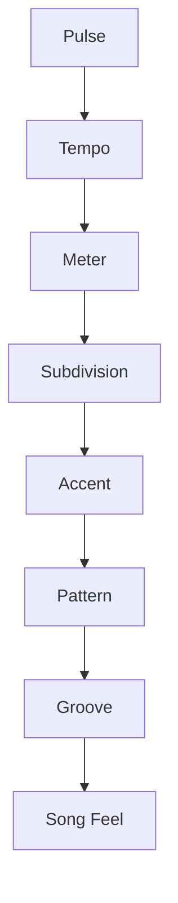
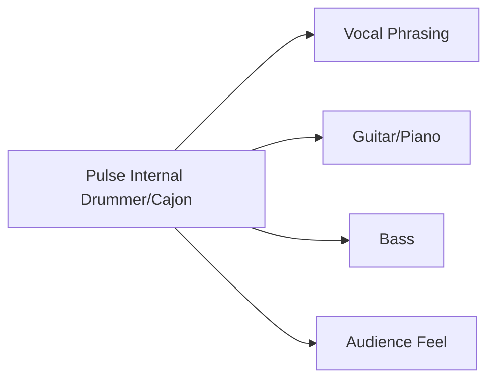
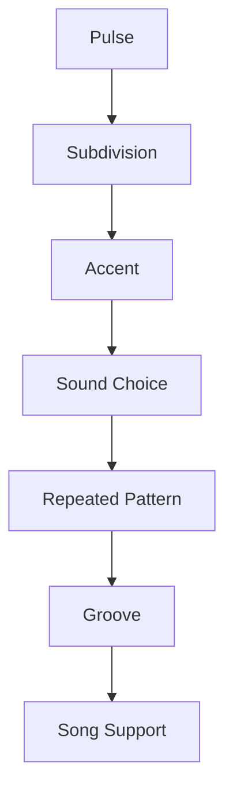

# learn-drum-cajon-part-003.md

# Part 003 — Rhythm sebagai Sistem: Pulse, Meter, Subdivision, Accent

## Status Seri

- Seri: `learn-drum-cajon`
- Part: `003`
- Topik: Rhythm sebagai sistem
- Target akhir seri: mampu mengiringi penyanyi dengan drum dan/atau cajon secara stabil, musikal, dan sadar konteks
- Status: seri belum selesai
- Part sebelumnya: `learn-drum-cajon-part-002.md`
- Part berikutnya: `learn-drum-cajon-part-004.md`

---

## Tujuan Part Ini

Part ini membangun bahasa internal ritme. Sebelum memainkan groove drum atau cajon, kamu harus memahami apa yang sebenarnya sedang kamu jaga.

Drum/cajon bukan sekadar memukul di waktu tertentu. Kamu sedang membangun **sistem waktu musikal** yang terdiri dari:

1. pulse,
2. tempo,
3. meter,
4. subdivision,
5. accent,
6. rest,
7. phrase,
8. groove.

Setelah menyelesaikan part ini, kamu harus mampu:

- membedakan pulse, tempo, meter, dan subdivision,
- menghitung 4/4, 3/4, 6/8, dan 12/8 secara praktis,
- memahami backbeat,
- memahami downbeat,
- memahami rest sebagai event musikal,
- menjaga counting sambil memainkan pattern sederhana,
- mendeteksi kapan kamu rushing atau dragging,
- melihat rhythm sebagai grid yang bisa dipetakan ke drum/cajon.

---

# 1. Kenapa Rhythm Harus Dipahami Sebagai Sistem?

Banyak pemula belajar drum/cajon langsung dari pattern:

```text
kick di sini, snare di sini, hi-hat di sini
```

Masalahnya, kalau hanya hafal pattern, kamu mudah bingung saat:

- tempo berubah,
- lagu masuk chorus,
- penyanyi telat masuk,
- gitar memainkan strumming berbeda,
- kamu harus fill,
- kamu kehilangan beat 1,
- lagu 6/8 bukan 4/4,
- groove harus dipelankan,
- pattern harus disederhanakan.

Pattern tanpa pemahaman rhythm seperti copy-paste code tanpa memahami control flow.

Rhythm adalah sistem yang membuat pattern punya konteks.



Jika fondasi atas rusak:

- groove goyang,
- fill keluar,
- chorus tidak masuk,
- penyanyi tidak nyaman,
- lagu terasa tidak natural.

---

# 2. Pulse: Detak Dasar Musik

## 2.1 Definisi Pulse

Pulse adalah detak dasar yang kamu rasakan saat mendengar lagu.

Itu adalah ketukan yang membuat orang:

- mengetuk kaki,
- mengangguk,
- menepuk tangan,
- bergerak,
- merasa lagu berjalan.

Pulse bukan pattern. Pulse adalah **clock internal**.

Contoh:

```text
1   2   3   4
tap tap tap tap
```

Jika kamu tidak bisa merasakan pulse, pattern apa pun akan rapuh.

---

## 2.2 Pulse dalam Accompaniment

Saat mengiringi penyanyi, pulse berfungsi sebagai pegangan bersama.



Penyanyi tidak selalu menyanyi tepat di atas grid. Kadang vokal sedikit lebih awal, sedikit lebih lambat, atau menahan kata. Drummer/cajon player harus tetap menjaga pulse tanpa memaksa vokal menjadi mekanis.

Ini perbedaan penting:

- **Pulse stabil**: lagu terasa aman.
- **Vokal fleksibel**: lagu terasa hidup.
- **Drummer ikut goyang karena vokal fleksibel**: lagu terasa tidak stabil.

---

## 2.3 Latihan Pulse Tanpa Alat

Latihan 1:

1. Set metronome 70 BPM.
2. Tepuk tangan di setiap click.
3. Hitung keras: `1 2 3 4`.
4. Lakukan 2 menit.

Latihan 2:

1. Set metronome 70 BPM.
2. Jangan tepuk setiap click.
3. Hanya anggukkan kepala.
4. Rasakan ketukan tanpa gerakan besar.
5. Lakukan 2 menit.

Latihan 3:

1. Set metronome 70 BPM.
2. Click hanya sebagai referensi.
3. Tepuk tangan di beat 1 saja.
4. Hitung `1 2 3 4`.
5. Lakukan 2 menit.

Tujuan:

> Pulse harus terasa di tubuh, bukan hanya didengar dari metronome.

---

# 3. Tempo: Kecepatan Pulse

## 3.1 Definisi Tempo

Tempo adalah kecepatan pulse, biasanya diukur dalam BPM: beats per minute.

Contoh:

| Tempo | Rasa Umum |
|---:|---|
| 50–65 BPM | sangat lambat, ballad, berat |
| 66–80 BPM | lambat-sedang, intimate |
| 81–100 BPM | medium, pop nyaman |
| 101–120 BPM | medium cepat |
| 121–150 BPM | cepat |
| 150+ BPM | sangat cepat |

Namun angka BPM tidak selalu cukup. Lagu 70 BPM bisa terasa lambat jika subdivision jarang, tetapi bisa terasa bergerak jika hi-hat/cajon touch memainkan 16th note.

---

## 3.2 Tempo Lambat Lebih Sulit dari yang Terlihat

Pemula sering mengira tempo lambat mudah. Faktanya, tempo lambat sering lebih sulit karena jarak antar beat lebih panjang.

Pada 60 BPM:

```text
1         2         3         4
```

Ada banyak ruang kosong. Jika internal clock belum kuat, kamu akan:

- masuk terlalu cepat,
- menunggu terlalu lama,
- fill terburu-buru,
- chorus naik tempo.

Tempo lambat membutuhkan subdivision internal.

---

## 3.3 Tempo Cepat Bukan Berarti Lebih Musikal

Tempo cepat biasanya menuntut efisiensi gerak. Tetapi untuk tujuan accompaniment, tempo sedang dan lambat lebih penting dulu.

Prioritas 20 jam:

| Tempo | Prioritas |
|---:|---|
| 60 BPM | sangat penting |
| 70 BPM | sangat penting |
| 80 BPM | sangat penting |
| 90 BPM | penting |
| 100 BPM | penting |
| 120 BPM | opsional awal |
| 140+ BPM | tunda dulu |

---

# 4. Meter: Cara Beat Dikelompokkan

## 4.1 Definisi Meter

Meter adalah cara pulse dikelompokkan ke dalam bar.

Contoh paling umum:

- 4/4,
- 3/4,
- 6/8,
- 12/8.

Meter memberi rasa “siklus” pada musik. Beat 1 biasanya terasa sebagai titik pulang atau titik awal.

```text
4/4:
1 2 3 4 | 1 2 3 4 | 1 2 3 4

3/4:
1 2 3 | 1 2 3 | 1 2 3

6/8:
1 2 3 4 5 6 | 1 2 3 4 5 6
```

---

## 4.2 4/4: Meter Paling Umum

4/4 berarti ada 4 beat utama dalam satu bar.

```text
1   2   3   4
```

Dalam pop/rock/acoustic/worship, snare atau cajon slap sering berada di beat 2 dan 4.

```text
Count : 1   2   3   4
Snare :     X       X
```

Ini disebut **backbeat**.

---

## 4.3 3/4: Waltz Feel

3/4 berarti ada 3 beat dalam satu bar.

```text
1   2   3 | 1   2   3
```

Rasa umumnya:

```text
strong weak weak
ONE    two  three
```

Untuk accompaniment modern, 3/4 tidak sesering 4/4, tetapi tetap perlu dikenali.

Cajon sederhana 3/4:

```text
Count : 1   2   3
Bass  : B
Slap  :     S   S
```

Atau lebih ringan:

```text
Count : 1   2   3
Bass  : B
Touch :     t   t
```

---

## 4.4 6/8: Dua Kelompok Tiga

6/8 sering membingungkan karena punya 6 hitungan kecil, tetapi rasa besarnya sering dua beat besar:

```text
1 2 3 4 5 6
ONE two three FOUR five six
```

Aksen besar di:

```text
1 dan 4
```

Contoh:

```text
1 2 3 4 5 6
B     S
```

Untuk ballad, 6/8 sering terasa mengayun.

---

## 4.5 12/8: Empat Kelompok Tiga

12/8 bisa dipikir sebagai 4 beat besar, masing-masing dibagi 3.

```text
1-trip-let 2-trip-let 3-trip-let 4-trip-let
```

Atau:

```text
1 la li 2 la li 3 la li 4 la li
```

Ini sering muncul pada bluesy ballad, gospel-ish, slow rock ballad, atau lagu yang punya triplet feel.

---

# 5. Subdivision: Membagi Beat

## 5.1 Definisi Subdivision

Subdivision adalah cara kamu membagi jarak antar beat.

Pulse:

```text
1   2   3   4
```

8th note subdivision:

```text
1 & 2 & 3 & 4 &
```

16th note subdivision:

```text
1 e & a 2 e & a 3 e & a 4 e & a
```

Triplet subdivision:

```text
1 trip let 2 trip let 3 trip let 4 trip let
```

Subdivision adalah kunci agar tempo stabil, terutama saat lambat.

---

## 5.2 Subdivision sebagai Grid

Bayangkan satu bar 4/4 sebagai grid.

Quarter note grid:

```text
1       2       3       4
```

Eighth note grid:

```text
1   &   2   &   3   &   4   &
```

Sixteenth note grid:

```text
1 e & a 2 e & a 3 e & a 4 e & a
```

Semakin kecil subdivision, semakin presisi kamu bisa meletakkan note.

Namun bukan berarti kamu harus memainkan semua subdivision. Kamu cukup **merasakannya**.

---

## 5.3 Internal Subdivision

Kamu bisa memainkan note jarang, tetapi tetap menghitung subdivision rapat di dalam kepala.

Contoh main ballad lambat:

```text
Yang dimainkan:
1       2       3       4

Yang dihitung dalam hati:
1 e & a 2 e & a 3 e & a 4 e & a
```

Ini membantu agar jarak antar beat tidak melar atau mengecil.

---

# 6. Accent: Beat yang Ditekankan

## 6.1 Definisi Accent

Accent adalah note yang dimainkan lebih menonjol.

Accent bisa dibuat dengan:

- volume lebih keras,
- suara berbeda,
- durasi berbeda,
- posisi musikal penting,
- instrument berbeda.

Dalam 4/4, beat 1 biasanya kuat, beat 2 dan 4 sering menjadi backbeat.

```text
1   2   3   4
>       >?
```

Dalam pop/rock:

```text
Kick/Sense of downbeat: 1 dan 3
Snare/backbeat       : 2 dan 4
```

---

## 6.2 Backbeat

Backbeat adalah penekanan pada beat 2 dan 4.

```text
Count : 1   2   3   4
Snare :     X       X
```

Backbeat memberi rasa pop/rock modern.

Cajon:

```text
Count : 1   2   3   4
Slap  :     S       S
```

Latihan:

1. Set metronome 80 BPM.
2. Hitung `1 2 3 4`.
3. Tepuk hanya di 2 dan 4.
4. Jangan tepuk di 1 dan 3.
5. Lakukan 3 menit.

Ini tampak mudah, tetapi sangat fundamental.

---

## 6.3 Downbeat

Downbeat adalah beat 1 dari bar.

```text
1 2 3 4 | 1 2 3 4
^         ^
```

Downbeat penting karena:

- tempat section mulai,
- tempat chorus masuk,
- tempat crash sering dimainkan,
- tempat fill harus selesai,
- tempat groove reset.

Kesalahan umum:

- fill terlalu panjang sehingga beat 1 hilang,
- tidak tahu kapan chorus masuk,
- salah menandai downbeat.

---

## 6.4 Accent Membentuk Feel

Pattern yang sama bisa terasa berbeda jika accent berubah.

Contoh 8th note datar:

```text
1 & 2 & 3 & 4 &
x x x x x x x x
```

Accent di beat:

```text
1 & 2 & 3 & 4 &
X x X x X x X x
```

Accent di offbeat:

```text
1 & 2 & 3 & 4 &
x X x X x X x X
```

Accent offbeat memberi rasa lebih syncopated, lebih bergerak.

---

# 7. Rest: Diam sebagai Event Musikal

## 7.1 Rest Bukan Kekosongan

Rest adalah diam yang disengaja.

Dalam accompaniment, rest bisa lebih kuat daripada fill.

Contoh:

```text
Verse terakhir sebelum chorus:
1 & 2 & 3 & 4 &
groove groove STOP...
```

Lalu chorus masuk:

```text
1
CRASH / strong slap
```

Diam membuat masuknya chorus terasa besar.

---

## 7.2 Kenapa Pemula Takut Diam?

Karena diam terasa seperti:

- tidak melakukan apa-apa,
- takut dianggap tidak bisa,
- takut kehilangan tempo,
- takut ruang kosong.

Padahal pemain matang tahu kapan harus tidak bermain.

Rule:

> Jika kamu tidak tahu harus mengisi apa, sering kali jawaban terbaik adalah diam atau tetap groove sederhana.

---

## 7.3 Latihan Rest

Latihan 1:

```text
Bar 1: clap quarter notes
Bar 2: diam, tetap hitung dalam hati
Bar 3: clap lagi
Bar 4: diam
```

Dengan metronome 70 BPM.

Tujuan:

- internal clock tetap hidup saat tidak bermain.

Latihan 2:

```text
1 & 2 & 3 & 4 &
x x x x - - - -
```

Main hanya setengah bar, lalu diam setengah bar.

Latihan 3:

```text
1 & 2 & 3 & 4 &
- - - - x x x x
```

Diam dulu, lalu masuk di tengah bar.

---

# 8. Phrase: Musik Bergerak dalam Kelompok Bar

## 8.1 Bar Bukan Unit Terbesar

Musik pop sering bergerak dalam phrase 4 bar atau 8 bar.

Contoh:

```text
Verse:
Bar 1
Bar 2
Bar 3
Bar 4

Next phrase:
Bar 5
Bar 6
Bar 7
Bar 8
```

Fill sering berada di bar ke-4 atau ke-8.

---

## 8.2 Counting Bar

Latihan:

```text
1 2 3 4 | 2 2 3 4 | 3 2 3 4 | 4 2 3 4
```

Artinya:

- bar 1: `1 2 3 4`
- bar 2: `2 2 3 4`
- bar 3: `3 2 3 4`
- bar 4: `4 2 3 4`

Ini membantu tahu kapan phrase selesai.

---

## 8.3 Phrase dan Fill

Rule awal:

- fill kecil di akhir 4 bar,
- fill lebih kuat di akhir 8 bar,
- jangan fill setiap bar,
- jangan fill di tengah frase vokal.

Contoh struktur:

```text
Bar 1: groove
Bar 2: groove
Bar 3: groove
Bar 4: small fill
Bar 5: chorus starts
```

---

# 9. Groove: Rhythm yang Punya Fungsi Lagu

Groove bukan cuma pattern. Groove adalah pattern yang:

- stabil,
- berulang,
- punya aksen,
- punya feel,
- cocok dengan lagu,
- menopang vokal,
- membuat tubuh ingin bergerak.



Pattern yang benar secara teknis belum tentu groove yang cocok.

Contoh:

- pattern funk kompleks mungkin buruk untuk ballad akustik,
- cajon slap keras bisa merusak lagu intim,
- hi-hat 16th note bisa terlalu ramai untuk verse.

Groove selalu contextual.

---

# 10. Mapping Rhythm ke Drum Kit

## 10.1 Basic 4/4 Drum Mapping

```text
Count : 1 & 2 & 3 & 4 &
Hat   : x x x x x x x x
Snare :     o       o
Kick  : o       o
```

Fungsi:

| Elemen | Fungsi |
|---|---|
| Hi-hat | subdivision |
| Snare | backbeat |
| Kick | downbeat/fondasi |
| Bar cycle | groove loop |

## 10.2 Lebih Sederhana

Jika koordinasi belum kuat:

```text
Count : 1   2   3   4
Snare :     o       o
Kick  : o       o
```

Tanpa hi-hat dulu.

## 10.3 Tambah Subdivision

Setelah stabil:

```text
Count : 1 & 2 & 3 & 4 &
Hat   : x x x x x x x x
```

Lalu tambahkan kick/snare.

---

# 11. Mapping Rhythm ke Cajon

## 11.1 Basic 4/4 Cajon Mapping

```text
Count : 1 & 2 & 3 & 4 &
Touch : t t t t t t t t
Slap  :     S       S
Bass  : B       B
```

Fungsi:

| Elemen | Fungsi |
|---|---|
| Bass | kick |
| Slap | snare/backbeat |
| Touch | hi-hat/subdivision |
| Silence | space |

## 11.2 Versi Lebih Sederhana

```text
Count : 1   2   3   4
Bass  : B       B
Slap  :     S       S
```

## 11.3 Versi Lebih Halus untuk Verse

```text
Count : 1 & 2 & 3 & 4 &
Touch : t t t t t t t t
Slap  :     s       s
Bass  : B       B
```

Gunakan slap kecil, bukan full slap.

---

# 12. Straight Feel vs Swing/Shuffle Feel

## 12.1 Straight Feel

Straight 8th note membagi beat menjadi dua bagian sama.

```text
1 & 2 & 3 & 4 &
```

Rasa:

```text
ta ta ta ta ta ta ta ta
```

Banyak pop modern memakai straight feel.

## 12.2 Swing/Shuffle Feel

Swing membagi beat seperti triplet, tetapi middle triplet tidak dimainkan.

Triplet grid:

```text
1 trip let 2 trip let 3 trip let 4 trip let
```

Swing 8th:

```text
1     let 2     let 3     let 4     let
```

Rasa:

```text
long-short long-short long-short long-short
```

Untuk 20 jam pertama, cukup kenali feel ini. Jangan terlalu dalam dulu.

---

# 13. 4/4 vs 6/8: Kesalahan Umum

Pemula sering mengira semua lagu lambat adalah 4/4. Padahal banyak ballad terasa 6/8 atau 12/8.

## 13.1 4/4 Lambat

Counting:

```text
1 & 2 & 3 & 4 &
```

Rasa:

```text
ONE and TWO and THREE and FOUR and
```

## 13.2 6/8

Counting:

```text
1 2 3 4 5 6
```

Rasa:

```text
ONE two three FOUR five six
```

## 13.3 Cara Membedakan

Dengarkan ayunan lagu.

Jika terasa:

```text
1-2-3 4-5-6
```

kemungkinan 6/8.

Jika terasa:

```text
1-&-2-&-3-&-4-&
```

kemungkinan 4/4.

---

# 14. Rushing dan Dragging

## 14.1 Rushing

Rushing berarti kamu makin cepat atau meletakkan note terlalu awal.

Biasanya terjadi saat:

- nervous,
- fill,
- chorus,
- tempo lambat,
- pattern sulit,
- tangan tegang,
- ingin segera sampai beat berikutnya.

Gejala:

- click metronome terasa tertinggal,
- kamu merasa “menarik” lagu ke depan,
- fill masuk terlalu cepat,
- penyanyi terasa dikejar.

## 14.2 Dragging

Dragging berarti kamu makin lambat atau meletakkan note terlalu terlambat.

Biasanya terjadi saat:

- lelah,
- groove terlalu berat,
- tempo lambat,
- kick/bass cajon lemah,
- terlalu fokus ke teknik,
- tidak menghitung subdivision.

Gejala:

- click terasa mendahului kamu,
- lagu terasa berat,
- penyanyi seperti menunggu,
- chorus kehilangan energi.

---

## 14.3 Correction Drill

Untuk rushing:

1. Turunkan tempo 10 BPM.
2. Main lebih pelan secara fisik.
3. Hitung subdivision keras.
4. Hindari fill.
5. Rekam 2 menit.

Untuk dragging:

1. Fokus ke beat 1 dan 3.
2. Gerakkan tubuh mengikuti pulse.
3. Mainkan subdivision lebih jelas.
4. Jangan terlalu keras.
5. Rekam 2 menit.

---

# 15. Counting Out Loud

Counting keras adalah latihan yang sering diabaikan karena terasa memalukan. Namun ini sangat efektif.

Jika kamu tidak bisa menghitung sambil bermain, kemungkinan kamu belum benar-benar menguasai pattern.

Tahapan:

## 15.1 Count Quarter

```text
1 2 3 4
```

## 15.2 Count Eighth

```text
1 & 2 & 3 & 4 &
```

## 15.3 Count Sixteenth

```text
1 e & a 2 e & a 3 e & a 4 e & a
```

## 15.4 Count Bars

```text
1 2 3 4 | 2 2 3 4 | 3 2 3 4 | 4 2 3 4
```

Rule:

> Kalau counting rusak, pattern harus disederhanakan.

---

# 16. Latihan Step-by-Step

## Latihan 1 — Pulse Lock

Durasi: 5 menit

1. Metronome 70 BPM.
2. Tepuk setiap beat.
3. Hitung `1 2 3 4`.
4. Setelah 1 menit, berhenti tepuk tetapi tetap hitung.
5. Masuk lagi di beat 1.

Acceptance:

- bisa masuk lagi tanpa kehilangan beat 1.

---

## Latihan 2 — Backbeat Clap

Durasi: 5 menit

1. Metronome 80 BPM.
2. Hitung `1 2 3 4`.
3. Tepuk hanya di 2 dan 4.
4. Beat 1 dan 3 jangan ditepuk.
5. Jaga tubuh tetap merasakan semua beat.

Acceptance:

- tepuk 2 dan 4 tidak berubah menjadi 1 dan 3.

---

## Latihan 3 — Eighth Note Grid

Durasi: 5 menit

1. Metronome 70 BPM.
2. Ucapkan `1 & 2 & 3 & 4 &`.
3. Tepuk di semua angka dan `&`.
4. Setelah stabil, tepuk hanya angka, tetapi tetap ucapkan `&`.

Acceptance:

- `&` tetap rata, tidak menyempit atau melebar.

---

## Latihan 4 — Sixteenth Note Awareness

Durasi: 5 menit

1. Metronome 60 BPM.
2. Ucapkan `1 e & a 2 e & a 3 e & a 4 e & a`.
3. Tepuk hanya di angka.
4. Rasakan `e & a` sebagai ruang internal.

Acceptance:

- beat angka tetap tepat walau mulut mengucapkan subdivision.

---

## Latihan 5 — 6/8 Feel

Durasi: 5 menit

1. Metronome 60–70 BPM.
2. Hitung `1 2 3 4 5 6`.
3. Tepuk lebih kuat di 1 dan 4.
4. Ulangi 3 menit.

Acceptance:

- aksen 1 dan 4 terasa alami.

---

## Latihan 6 — Bar Counting

Durasi: 5 menit

1. Metronome 70 BPM.
2. Hitung 4 bar:
   ```text
   1 2 3 4 | 2 2 3 4 | 3 2 3 4 | 4 2 3 4
   ```
3. Di bar ke-4 beat 4, tepuk lebih kuat.
4. Ulangi loop.

Acceptance:

- tahu kapan bar ke-4 datang tanpa menebak.

---

## Latihan 7 — Rest Internal Clock

Durasi: 5 menit

1. Metronome 70 BPM.
2. Bar 1: tepuk quarter.
3. Bar 2: diam.
4. Bar 3: tepuk lagi.
5. Bar 4: diam.
6. Tetap hitung dalam hati saat diam.

Acceptance:

- masuk kembali tepat di beat 1 setelah diam.

---

# 17. Latihan Aplikasi ke Drum Kit

Jika ada drum kit atau practice setup:

## Drill 1 — Kick/Snare Quarter

```text
Count : 1   2   3   4
Kick  : X       X
Snare :     X       X
```

Main 3 menit di 70 BPM.

## Drill 2 — Tambah Hi-hat 8th

```text
Count : 1 & 2 & 3 & 4 &
Hat   : x x x x x x x x
Kick  : X       X
Snare :     X       X
```

Main 2 menit di 70 BPM.

## Drill 3 — Hilangkan Hi-hat, Tetap Rasakan Grid

Main kick/snare saja, tetapi ucapkan `1 & 2 & 3 & 4 &`.

Tujuan:

- subdivision tetap hidup walau tidak dimainkan.

---

# 18. Latihan Aplikasi ke Cajon

## Drill 1 — Bass/Slap Quarter

```text
Count : 1   2   3   4
Bass  : B       B
Slap  :     S       S
```

Main 3 menit di 70 BPM.

## Drill 2 — Tambah Touch 8th

```text
Count : 1 & 2 & 3 & 4 &
Touch : t t t t t t t t
Bass  : B       B
Slap  :     S       S
```

Main 2 menit di 70 BPM.

## Drill 3 — Touch dalam Hati

Main bass/slap saja, tetapi hitung `1 & 2 & 3 & 4 &`.

Tujuan:

- tidak bergantung pada banyak note untuk menjaga time.

---

# 19. Debugging Guide

| Gejala | Kemungkinan Penyebab | Correction |
|---|---|---|
| Selalu kehilangan beat 1 | Tidak menghitung bar | Latih bar counting 4 bar |
| Backbeat berubah jadi 1 dan 3 | Belum merasakan 2 dan 4 | Clap 2/4 dengan lagu |
| Tempo naik saat fill | Subdivision hilang | Fill lebih pendek, count keras |
| Tempo lambat terasa sulit | Internal subdivision lemah | Count 16th note dalam hati |
| 6/8 terasa seperti 3/4 | Aksen salah | Tekankan 1 dan 4 |
| Groove terasa kaku | Accent terlalu datar | Tambah dynamic kecil |
| Cajon touch tidak rata | Gerak tangan tegang | Pelankan tempo, kecilkan gerak |
| Hi-hat terlalu dominan | Volume tangan kanan terlalu besar | Latih hi-hat 50% lebih pelan |

---

# 20. Kesalahan Konseptual

## 20.1 Menganggap Rhythm Hanya Hitungan

Hitungan membantu, tetapi rhythm harus masuk ke tubuh.

Tanda rhythm mulai masuk tubuh:

- kaki otomatis merasakan pulse,
- kamu tahu beat 1 tanpa melihat chart,
- kamu tidak panik saat diam,
- kamu bisa menghitung sambil bermain,
- kamu bisa mendengar saat tempo mulai rush.

## 20.2 Mengira Metronome adalah Musuh Feel

Metronome bukan pengganti feel. Metronome adalah cermin.

Metronome menunjukkan:

- kamu rush,
- kamu drag,
- fill terlalu cepat,
- spacing tidak rata,
- beat 1 hilang.

Feel yang baik justru butuh time yang bisa dipercaya.

## 20.3 Mengira Banyak Note Membuat Time Lebih Baik

Kadang banyak note menyembunyikan time yang buruk. Latihan yang lebih jujur adalah memainkan sedikit note dengan stabil.

Contoh sulit:

```text
Kick hanya di 1
Snare hanya di 3
Tempo 60 BPM
```

Sedikit note berarti ruang antar note besar. Ini menguji internal clock.

---

# 21. Practice Protocol Part Ini

Lakukan minimal 3 sesi sebelum lanjut serius ke groove.

## Sesi A — Pulse dan Backbeat

Durasi: 30 menit

| Durasi | Latihan |
|---:|---|
| 5 menit | clap quarter |
| 5 menit | clap 2 dan 4 |
| 5 menit | count 1 & 2 & 3 & 4 & |
| 5 menit | bar counting |
| 5 menit | rest internal clock |
| 5 menit | rekam dan review |

## Sesi B — Drum/Cajon Mapping

Durasi: 30 menit

| Durasi | Latihan |
|---:|---|
| 5 menit | counting |
| 10 menit | kick/snare atau bass/slap |
| 5 menit | tambah hi-hat/touch |
| 5 menit | main tanpa hi-hat/touch tapi tetap count |
| 5 menit | rekam dan review |

## Sesi C — 6/8 Awareness

Durasi: 30 menit

| Durasi | Latihan |
|---:|---|
| 5 menit | count 1–6 |
| 5 menit | accent 1 dan 4 |
| 10 menit | bass/slap atau kick/snare 6/8 |
| 5 menit | dengarkan lagu 6/8 |
| 5 menit | rekam dan review |

---

# 22. Self-Scoring Rubric

Nilai 1–5:

| Area | 1 | 3 | 5 |
|---|---|---|---|
| Pulse | sering hilang | kadang stabil | stabil |
| Backbeat | bingung 2/4 | cukup bisa | natural |
| Subdivision | tidak rata | cukup rata | terasa internal |
| Bar count | sering lupa | bisa 4 bar | bisa 8 bar |
| Rest | masuk salah | kadang tepat | tepat |
| 6/8 | bingung | bisa hitung | terasa feel |
| Recording review | tidak tahu error | tahu sebagian | tahu error utama |

Target sebelum lanjut:

- minimal skor 3 di semua area,
- skor 4 di pulse dan backbeat.

---

# 23. Acceptance Criteria Part Ini

Kamu boleh lanjut jika bisa:

1. tepuk quarter note 2 menit dengan metronome,
2. tepuk backbeat 2 dan 4 selama 2 menit,
3. hitung `1 & 2 & 3 & 4 &` sambil tepuk quarter,
4. hitung 4 bar tanpa kehilangan posisi,
5. diam 1 bar lalu masuk lagi di beat 1,
6. membedakan 4/4 dan 6/8 secara rasa,
7. memainkan mapping sederhana:
   - drum: kick 1/3, snare 2/4,
   - cajon: bass 1/3, slap 2/4.

---

# 24. Ringkasan

Rhythm adalah sistem, bukan sekadar pattern.

Urutannya:

1. pulse,
2. tempo,
3. meter,
4. subdivision,
5. accent,
6. rest,
7. phrase,
8. groove.

Untuk accompaniment, rhythm yang baik membuat penyanyi merasa aman. Kamu tidak perlu memainkan banyak note. Kamu perlu menjaga waktu, mendengar frase, dan tahu di mana kamu berada dalam lagu.

Skill paling penting dari part ini:

- merasakan pulse,
- menghitung subdivision,
- menjaga backbeat,
- tahu beat 1,
- tidak takut diam,
- menghitung phrase,
- membedakan 4/4 dan 6/8.

---

# 25. Latihan untuk Part Berikutnya

Sebelum lanjut ke Part 004, lakukan:

1. Rekam tepuk backbeat 2 menit di 70 BPM.
2. Rekam bass/slap cajon atau kick/snare simulasi 2 menit.
3. Latih counting 6/8 selama 5 menit.
4. Buat catatan: apakah kamu lebih sering rushing atau dragging?
5. Perhatikan tubuh: bagian mana yang tegang saat latihan?

Part berikutnya membahas:

> body mechanics: posture, relaxation, motion economy, grip, posisi duduk, dan cara menghasilkan suara tanpa tegang atau cedera.
