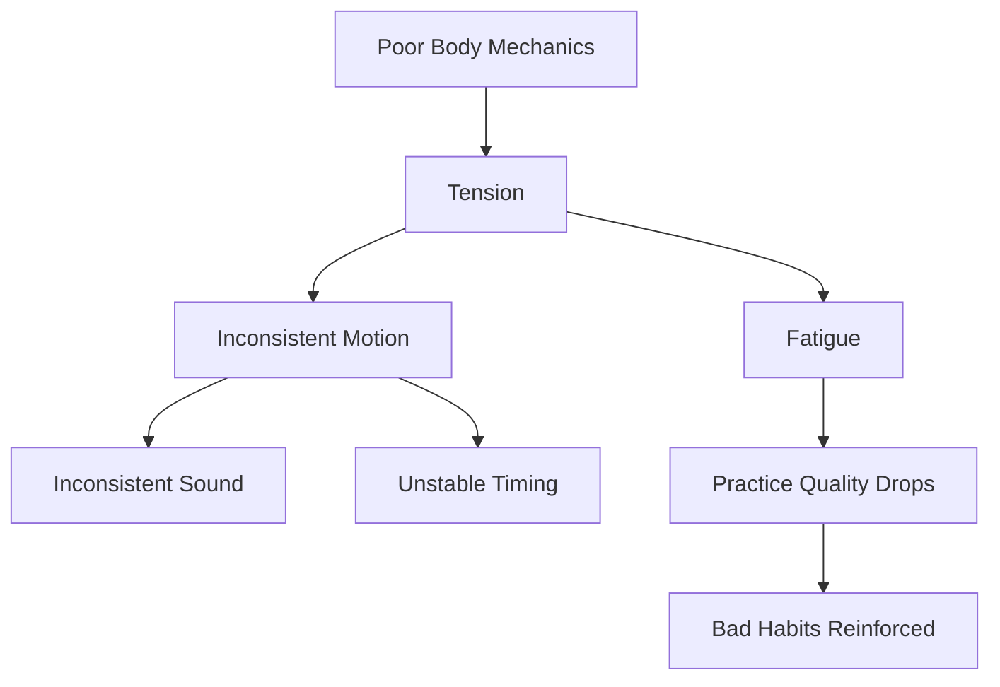
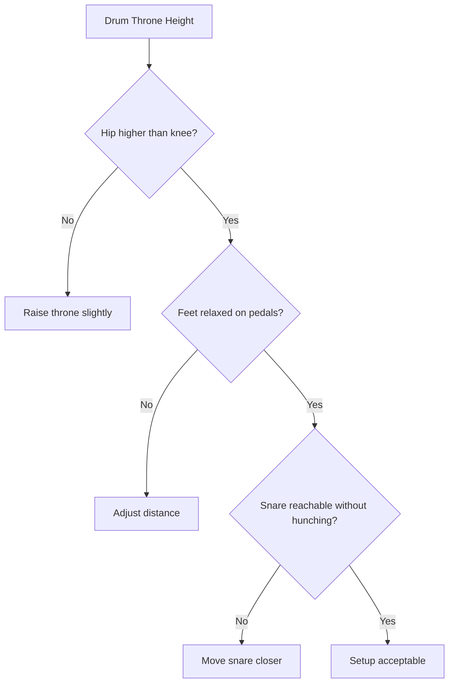
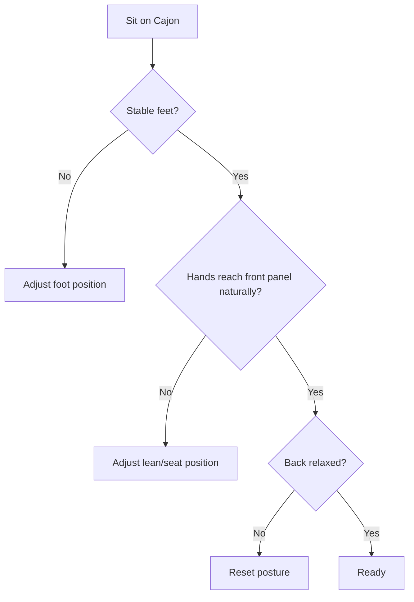
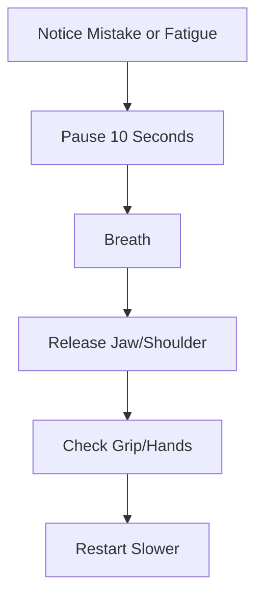

# learn-drum-cajon-part-004.md

# Part 004 — Body Mechanics: Posture, Relaxation, Motion Economy

## Status Seri

- Seri: `learn-drum-cajon`
- Part: `004`
- Topik: Mekanika tubuh untuk drum kit dan cajon
- Target akhir seri: mampu mengiringi penyanyi dengan drum dan/atau cajon secara stabil, musikal, dan sadar konteks
- Status: seri belum selesai
- Part sebelumnya: `learn-drum-cajon-part-003.md`
- Part berikutnya: `learn-drum-cajon-part-005.md`

---

## Tujuan Part Ini

Part ini membahas fondasi fisik. Drum dan cajon adalah skill tubuh. Jika postur, gerak, dan relaksasi salah sejak awal, akibatnya:

- tempo tidak stabil,
- suara tidak konsisten,
- tangan cepat sakit,
- kaki cepat lelah,
- fill menjadi tegang,
- dinamika sulit dikontrol,
- latihan terasa melelahkan,
- risiko cedera meningkat.

Setelah part ini, kamu harus mampu:

1. duduk dengan stabil di drum kit dan cajon,
2. memahami prinsip relaksasi,
3. memahami motion economy,
4. memegang stick secara aman,
5. menghasilkan suara cajon tanpa memukul brutal,
6. membedakan fatigue normal dan pain warning,
7. mendeteksi tension,
8. membuat setup latihan yang tidak merusak tubuh.

---

# 1. Kenapa Body Mechanics Penting?

Banyak pemula mengira masalah mereka adalah kurang hafal pattern. Padahal sering kali akar masalahnya fisik:

- bahu tegang,
- pergelangan kaku,
- duduk tidak seimbang,
- kaki terlalu jauh dari pedal,
- cajon terlalu rendah/tinggi,
- stick digenggam terlalu keras,
- tangan memukul cajon dengan tenaga berlebihan,
- badan ikut collapse saat tempo lambat.

Masalah fisik menghasilkan masalah musikal.



Jadi teknik tubuh bukan detail kosmetik. Ini mempengaruhi time, sound, dynamics, stamina, dan confidence.

---

# 2. Prinsip Utama: Relaxed Control

Tujuan bukan tubuh lemas. Tujuan adalah **relaxed control**.

Relaxed control berarti:

- otot cukup aktif untuk mengontrol gerakan,
- tetapi tidak mengunci,
- gerakan bisa mengalir,
- rebound bisa terjadi,
- volume bisa diatur,
- tubuh bisa bertahan lama.

Terlalu tegang:

```text
forceful, stiff, cepat lelah, suara kasar
```

Terlalu lemas:

```text
tidak presisi, suara lemah, timing tidak jelas
```

Target:

```text
stabil, ringan, responsif, controlled
```

---

# 3. Motion Economy

Motion economy berarti menggunakan gerakan sekecil dan seefisien mungkin untuk menghasilkan suara yang dibutuhkan.

Pemula sering berpikir:

> suara keras = tenaga besar.

Lebih tepat:

> suara baik = gerakan efisien + titik kontak tepat + rebound + kontrol.


Jika setiap pukulan memakai gerakan besar:

- tempo cepat sulit,
- tangan cepat lelah,
- volume sulit kecil,
- sound tidak konsisten,
- tubuh tegang.

---

# 4. Posture Umum untuk Drum dan Cajon

Ada prinsip yang sama untuk dua instrumen:

1. tulang belakang panjang,
2. bahu turun,
3. leher tidak maju,
4. siku tidak terkunci,
5. pergelangan tidak kaku,
6. napas tidak tertahan,
7. kaki stabil,
8. berat badan seimbang,
9. gerakan berasal dari sendi yang tepat,
10. tubuh tidak melawan alat.

## 4.1 Neutral Spine

Jangan membungkuk berlebihan. Jangan juga terlalu kaku seperti upacara.

Bayangkan:

```text
kepala di atas tulang belakang
dada terbuka
bahu turun
pinggul stabil
```

Jika tulang belakang collapse:

- napas pendek,
- bahu tegang,
- tangan lebih berat,
- timing terasa berat,
- cajon bass sulit,
- pedal kick tidak bebas.

## 4.2 Shoulders Down

Bahu yang naik adalah tanda tension.

Cek setiap beberapa menit:

- apakah bahu naik?
- apakah leher tegang?
- apakah rahang mengunci?
- apakah napas tertahan?

Jika ya:

1. berhenti 10 detik,
2. tarik napas,
3. turunkan bahu,
4. lanjut lebih pelan.

## 4.3 Elbow Natural

Siku jangan terlalu menempel, jangan terlalu terbuka.

Target:

- siku menggantung natural,
- lengan bisa bergerak,
- tangan mencapai permukaan tanpa memaksa,
- tidak ada rasa tertarik di bahu.

---

# 5. Drum Kit Setup Dasar

## 5.1 Posisi Duduk

Duduk di drum throne, bukan di ujung ekstrem.

Prinsip:

- pinggul sedikit lebih tinggi dari lutut,
- kaki bisa mencapai pedal tanpa menegang,
- badan seimbang,
- tidak bersandar,
- tidak membungkuk ke snare.



## 5.2 Jarak ke Snare

Snare harus bisa dicapai tanpa:

- membungkuk,
- mengangkat bahu,
- menarik siku ke belakang,
- menekuk pergelangan ekstrem.

Jika snare terlalu jauh, tangan akan tegang dan timing rusak.

## 5.3 Tinggi Snare

Snare idealnya sekitar tinggi antara paha atas dan pinggang bawah saat duduk, tergantung kenyamanan.

Terlalu rendah:

- badan membungkuk,
- rimshot tidak nyaman,
- tangan turun berlebihan.

Terlalu tinggi:

- bahu naik,
- stick angle buruk,
- tangan cepat lelah.

## 5.4 Hi-hat

Hi-hat jangan terlalu jauh. Tangan kanan harus bisa memainkan hi-hat tanpa menyilangkan tubuh secara ekstrem.

Jika hi-hat terlalu tinggi:

- bahu kanan naik,
- hi-hat terlalu keras,
- kontrol kecil sulit.

Jika hi-hat terlalu rendah:

- stick bisa bertabrakan dengan tangan kiri,
- posisi snare terganggu.

## 5.5 Kick Pedal

Kaki kanan harus bisa menekan pedal tanpa:

- paha tegang,
- pergelangan terkunci,
- badan ikut maju,
- pinggul miring.

Untuk pemula, jangan terlalu memusingkan heel-up vs heel-down secara dogmatis. Gunakan yang membuat:

- timing stabil,
- suara terkendali,
- kaki tidak sakit,
- badan tetap seimbang.

---

# 6. Grip Stick Dasar

## 6.1 Tujuan Grip

Grip bukan untuk mencekik stick. Grip adalah cara mengontrol stick agar bisa:

- turun,
- memantul,
- kembali,
- diarahkan,
- dimainkan pelan/keras,
- tidak terlempar.

Grip yang buruk biasanya terlalu kencang.

Akibatnya:

- rebound mati,
- pergelangan kaku,
- suara kasar,
- tangan cepat lelah,
- tempo sulit stabil.

## 6.2 Matched Grip Minimum

Untuk awal, gunakan matched grip.

Prinsip:

1. stick dipegang antara ibu jari dan telunjuk sebagai fulcrum awal,
2. jari lain membungkus ringan,
3. telapak tidak mengunci,
4. stick bisa memantul,
5. pergelangan bisa bergerak.

```text
Jangan:
- menggenggam seperti palu berat
- menekan stick sampai jari putih
- mengunci pergelangan

Lakukan:
- pegang cukup agar stick tidak jatuh
- biarkan rebound
- kontrol dengan jari dan wrist
```

## 6.3 Fulcrum

Fulcrum adalah titik kontrol utama stick.

Untuk pemula, jangan terlalu teoritis. Cukup pahami:

- stick perlu titik pivot,
- titik itu biasanya antara ibu jari dan telunjuk/tengah,
- jari belakang membantu kontrol,
- jangan menahan semua gerakan.

## 6.4 Rebound

Rebound adalah pantulan stick setelah mengenai drum/pad.

Latihan:

1. Jatuhkan stick ke pad/snare.
2. Jangan tekan ke bawah.
3. Biarkan stick memantul.
4. Tangkap pantulan dengan ringan.
5. Ulangi pelan.

Tujuan:

> Jangan memukul lalu menahan. Pukul lalu lepaskan.

---

# 7. Wrist, Fingers, Arm

Gerakan tangan bisa berasal dari:

- arm,
- wrist,
- fingers.

Untuk 20 jam pertama:

| Sumber Gerak | Fungsi |
|---|---|
| Arm | volume lebih besar, aksen |
| Wrist | stroke utama |
| Fingers | kontrol halus/rebound |
| Shoulder | bukan sumber utama pukulan |

Pemula sering memakai terlalu banyak bahu dan lengan atas. Akibatnya cepat capek dan kasar.

Rule awal:

> Untuk groove normal, biarkan wrist menjadi motor utama, bukan bahu.

---

# 8. Drum Stroke Minimum

Kita tidak akan masuk semua teknik stroke secara akademik, tetapi kamu perlu empat konsep.

## 8.1 Full Stroke

Mulai dari posisi agak tinggi, pukul, kembali tinggi.

Fungsi:

- aksen,
- suara besar,
- crash/snare kuat.

## 8.2 Down Stroke

Mulai tinggi, pukul, berhenti rendah.

Fungsi:

- aksen lalu siap note kecil berikutnya.

## 8.3 Tap Stroke

Mulai rendah, pukul rendah, kembali rendah.

Fungsi:

- ghost note,
- hi-hat/touch kecil,
- dynamic rendah.

## 8.4 Up Stroke

Mulai rendah, pukul, kembali tinggi.

Fungsi:

- persiapan aksen berikutnya.

Untuk awal, cukup sadari:

- tidak semua pukulan sama tinggi,
- volume dipengaruhi ketinggian dan kecepatan,
- note kecil tidak perlu gerakan besar.

---

# 9. Cajon Posture

Cajon tampak sederhana: duduk di atas kotak lalu tepuk. Namun postur salah bisa membuat punggung, pergelangan, dan telapak sakit.

## 9.1 Duduk di Cajon

Prinsip:

- duduk di bagian atas cajon dengan stabil,
- berat badan tidak sepenuhnya collapse ke belakang,
- kaki membuka natural,
- telapak kaki menyentuh lantai,
- badan sedikit condong ke depan tetapi tidak membungkuk ekstrem,
- tangan bisa mencapai area depan cajon tanpa menarik bahu.



## 9.2 Jangan Membungkuk Berlebihan

Pemula sering membungkuk untuk mengejar bass sound. Ini cepat melelahkan.

Lebih baik:

- condong sedikit,
- gunakan gerakan lengan yang efisien,
- cari sweet spot bass,
- jangan memaksa dengan punggung.

## 9.3 Kaki

Kaki membantu stabilitas. Jangan menggantung atau terlalu rapat.

Posisi kaki yang baik:

- memberi keseimbangan,
- tidak menekan cajon berlebihan,
- memungkinkan badan sedikit bergerak,
- tidak membuat pinggul miring.

---

# 10. Cajon Hand Mechanics

## 10.1 Prinsip Utama

Cajon dimainkan dengan tangan langsung. Karena itu kamu harus lebih hati-hati dibanding stick.

Target suara bukan berasal dari memukul keras, tetapi dari:

- titik kontak,
- bentuk tangan,
- release,
- kontrol jari,
- dinamika.

Jika tangan sakit tajam, jangan dipaksa.

---

## 10.2 Bass Tone

Bass tone biasanya dimainkan di area tengah/atas-tengah front plate, tergantung cajon.

Prinsip:

- gunakan telapak bagian bawah/flat hand,
- pukul lalu lepaskan,
- jangan menekan panel,
- cari suara bulat,
- jangan terlalu keras.

Latihan:

```text
B - - - | B - - -
```

Hitung:

```text
1 2 3 4
B
```

Fokus:

- suara bass bulat,
- tidak sakit,
- volume konsisten.

---

## 10.3 Slap Tone

Slap biasanya dimainkan di area atas/tepi front plate.

Prinsip:

- gunakan jari/telapak atas,
- kontak cepat,
- release cepat,
- jangan menghantam dengan seluruh tenaga,
- cari suara tajam tetapi terkontrol.

Latihan:

```text
1 2 3 4
  S   S
```

Fokus:

- slap jelas,
- tidak menyakiti jari,
- volume tidak berlebihan.

---

## 10.4 Touch Tone

Touch adalah pukulan kecil untuk tekstur/subdivision.

Prinsip:

- sangat ringan,
- memakai ujung jari,
- tidak harus keras,
- lebih terasa daripada terdengar dominan,
- menjaga movement.

Latihan:

```text
1 & 2 & 3 & 4 &
t t t t t t t t
```

Fokus:

- rata,
- ringan,
- tidak mengganggu bass/slap.

---

## 10.5 Ghost Note di Cajon

Ghost note adalah note kecil di antara note utama.

Contoh:

```text
Count : 1 & 2 & 3 & 4 &
Bass  : B       B
Slap  :     S       S
Touch :   t   t   t   t
```

Ghost note memberi flow, tetapi jangan terlalu keras.

Rule:

> Ghost note harus terasa sebagai tekstur, bukan menjadi backbeat kedua.

---

# 11. Tension Detection

Tension adalah musuh utama pemula.

Cek tension di:

| Area | Tanda Tension |
|---|---|
| Rahang | menggigit, mengunci |
| Bahu | naik |
| Leher | kaku |
| Siku | terkunci |
| Pergelangan | tidak lentur |
| Jari | menggenggam terlalu kuat |
| Punggung | membungkuk/collapse |
| Pinggul | tidak seimbang |
| Kaki | menekan pedal/lantai berlebihan |
| Napas | tertahan |

## 11.1 Tension Reset

Setiap 5 menit:

1. berhenti,
2. tarik napas,
3. buka rahang,
4. turunkan bahu,
5. goyangkan tangan,
6. cek duduk,
7. mulai lagi lebih pelan.



---

# 12. Fatigue vs Pain

## 12.1 Fatigue Normal

Fatigue normal:

- rasa lelah umum,
- otot terasa bekerja,
- hilang setelah istirahat,
- tidak tajam,
- tidak menusuk,
- tidak kebas.

## 12.2 Pain Warning

Hentikan latihan jika ada:

- sakit tajam,
- kebas,
- rasa terbakar,
- nyeri sendi,
- pergelangan menusuk,
- jari sakit tajam,
- punggung bawah sakit intens,
- nyeri yang bertahan setelah berhenti.

Rule:

> Drum/cajon boleh melelahkan, tetapi tidak boleh menyakiti secara tajam.

---

# 13. Breathing dan Timing

Pemula sering menahan napas saat pattern sulit. Ini membuat tubuh tegang dan timing memburuk.

Latihan:

1. Main pattern sederhana.
2. Tarik napas 4 beat.
3. Buang napas 4 beat.
4. Jangan berhenti groove.
5. Ulangi.

```text
Inhale : 1 2 3 4
Exhale : 1 2 3 4
```

Tujuan:

- tubuh tetap rileks,
- tempo tidak panik,
- tangan tidak mengunci.

---

# 14. Dynamic Control dari Tubuh

Dinamika tidak hanya urusan niat. Dinamika adalah hasil kontrol gerak.

Untuk main pelan:

- stroke lebih rendah,
- grip lebih ringan,
- gerakan lebih kecil,
- bahu tetap turun,
- jangan kehilangan pulse.

Untuk main keras:

- gunakan gerak sedikit lebih besar,
- tetap release,
- jangan menekan,
- jangan mengorbankan timing.

## 14.1 Lima Level Volume

Latih setiap suara dalam 5 level:

| Level | Deskripsi |
|---:|---|
| 1 | sangat pelan |
| 2 | pelan |
| 3 | sedang |
| 4 | besar |
| 5 | sangat besar, jarang dipakai |

Untuk accompaniment, sebagian besar waktu kamu berada di level 2–4.

Level 5 hanya untuk momen tertentu.

---

# 15. Drum Kit: Latihan Mechanics

## Drill 1 — Free Stroke di Pad/Snare

Durasi: 5 menit

1. Pegang stick ringan.
2. Pukul pad/snare dengan wrist.
3. Biarkan rebound.
4. Jangan tekan stick ke bawah.
5. Lakukan R L R L perlahan.

Counting:

```text
1 & 2 & 3 & 4 &
R L R L R L R L
```

Acceptance:

- stick memantul,
- tangan tidak menggenggam keras,
- suara cukup rata.

---

## Drill 2 — Height Control

Durasi: 5 menit

Main pukulan dari tiga tinggi:

| Tinggi | Fungsi |
|---|---|
| rendah | soft/tap |
| sedang | normal groove |
| tinggi | accent |

Latihan:

```text
Rendah  : 1 & 2 & 3 & 4 &
Sedang  : 1 & 2 & 3 & 4 &
Tinggi  : 1 & 2 & 3 & 4 &
```

Acceptance:

- volume berubah karena tinggi stroke, bukan karena tubuh tegang.

---

## Drill 3 — Kick Relaxation

Durasi: 5 menit

1. Duduk seimbang.
2. Letakkan kaki di pedal.
3. Main kick di beat 1 dan 3.
4. Jangan gerakkan seluruh badan.
5. Jaga napas.

```text
Count : 1   2   3   4
Kick  : X       X
```

Acceptance:

- badan tidak maju setiap kick,
- kaki tidak tegang berlebihan.

---

## Drill 4 — Hi-hat Softness

Durasi: 5 menit

Main hi-hat 8th note sangat pelan.

```text
Count : 1 & 2 & 3 & 4 &
Hat   : x x x x x x x x
```

Acceptance:

- hi-hat tidak mendominasi,
- bahu kanan tidak naik,
- stroke kecil dan rata.

---

# 16. Cajon: Latihan Mechanics

## Drill 1 — Bass Search

Durasi: 5 menit

1. Main bass di beberapa area front plate.
2. Dengarkan area mana paling bulat.
3. Jangan pakai tenaga besar.
4. Catat sweet spot.

Pattern:

```text
1   2   3   4
B       B
```

Acceptance:

- bass terdengar bulat,
- tangan tidak sakit,
- suara konsisten.

---

## Drill 2 — Slap Search

Durasi: 5 menit

1. Main slap di area atas/tepi.
2. Coba posisi jari berbeda.
3. Cari suara tajam tetapi tidak menyakitkan.
4. Jangan menghantam brutal.

Pattern:

```text
1   2   3   4
    S       S
```

Acceptance:

- slap berbeda jelas dari bass,
- volume bisa dikontrol.

---

## Drill 3 — Touch Consistency

Durasi: 5 menit

```text
1 & 2 & 3 & 4 &
t t t t t t t t
```

Fokus:

- ringan,
- rata,
- tidak menegangkan jari,
- tidak terlalu keras.

---

## Drill 4 — Bass-Slap Alternation

Durasi: 5 menit

```text
Count : 1   2   3   4
Bass  : B       B
Slap  :     S       S
```

Acceptance:

- bass dan slap terdengar berbeda,
- tempo stabil,
- tangan tidak sakit.

---

# 17. Setup Saat Tidak Punya Alat

## 17.1 Drum Kit Substitute

Gunakan:

- tangan kanan di meja/pad = hi-hat,
- tangan kiri di paha = snare,
- kaki kanan di lantai = kick,
- kaki kiri tap ringan = pulse optional.

Latihan:

```text
Right hand : 1 & 2 & 3 & 4 &
Left hand  :     2       4
Right foot : 1       3
```

## 17.2 Cajon Substitute

Gunakan:

- paha kanan/kiri,
- kotak kardus,
- meja kayu,
- permukaan berbeda untuk bass/slap.

Namun jangan terlalu keras. Tujuannya koordinasi, bukan volume.

---

# 18. Recording Angle untuk Mengecek Mechanics

Gunakan video, bukan audio saja.

Angle 1 — depan:

- cek bahu,
- cek tangan,
- cek postur.

Angle 2 — samping:

- cek punggung,
- cek posisi duduk,
- cek gerakan kaki.

Angle 3 — dekat tangan:

- cek grip,
- cek rebound,
- cek cajon contact.

Checklist video:

| Pertanyaan | Ya/Tidak |
|---|---|
| Bahu naik? | |
| Rahang tegang? | |
| Pergelangan kaku? | |
| Gerakan terlalu besar? | |
| Stick/cajon ditekan setelah kontak? | |
| Badan miring? | |
| Napas tertahan? | |
| Volume berubah tanpa kontrol? | |

---

# 19. Common Mistakes

## 19.1 Memukul Terlalu Keras

Pemula sering menganggap pukulan harus kuat agar terdengar.

Dampak:

- cepat lelah,
- tangan sakit,
- suara kasar,
- dinamika hilang,
- penyanyi tertutup.

Correction:

- main level volume 2,
- rekam,
- dengar dari jarak pendengar,
- naikkan hanya jika perlu.

---

## 19.2 Grip Terlalu Kencang

Gejala:

- jari cepat lelah,
- stick tidak memantul,
- wrist kaku,
- tempo terasa berat.

Correction:

- pegang stick lebih ringan,
- latihan rebound,
- lepaskan tekanan jari belakang,
- main di tempo lambat.

---

## 19.3 Cajon Slap Menyakitkan

Gejala:

- jari merah/sakit,
- suara terlalu tajam,
- tangan takut memukul.

Correction:

- cari titik kontak lebih baik,
- kurangi power,
- gunakan release,
- jangan memukul dengan sendi terkunci.

---

## 19.4 Duduk Tidak Seimbang

Gejala:

- kaki sulit stabil,
- punggung sakit,
- tempo goyang,
- badan ikut bergerak berlebihan.

Correction:

- atur tinggi duduk,
- cek posisi kaki,
- cari pusat berat,
- jangan duduk terlalu ujung.

---

## 19.5 Bahu Naik Saat Sulit

Gejala:

- setiap pattern sulit, bahu mengangkat,
- napas tertahan,
- fill makin kasar.

Correction:

- turunkan tempo,
- reset bahu,
- pecah pattern,
- latih tangan/kaki terpisah.

---

# 20. Debugging Guide

| Gejala | Akar Kemungkinan | Drill |
|---|---|---|
| Timing tidak stabil | tubuh tegang | tension reset + tempo turun |
| Suara tidak rata | stroke height tidak konsisten | height control |
| Tangan cepat capek | grip terlalu kuat | rebound drill |
| Kick membuat badan maju | posisi pedal/duduk salah | kick relaxation |
| Cajon bass lemah | titik kontak salah | bass search |
| Slap terlalu tajam | power berlebihan | slap at level 2 |
| Hi-hat terlalu keras | bahu/tangan kanan dominan | hi-hat softness |
| Sulit main pelan | kontrol stroke rendah lemah | volume level drill |
| Punggung sakit saat cajon | membungkuk/seat salah | posture reset |
| Fill kasar | gerakan terlalu besar | small-motion fill drill |

---

# 21. Warm-Up Aman

Gunakan warm-up 7 menit sebelum latihan utama.

## 21.1 Tanpa Alat

Durasi: 2 menit

- putar pergelangan tangan pelan,
- buka tutup jari,
- putar bahu,
- tarik napas dalam,
- rilekskan rahang.

## 21.2 Pulse Body

Durasi: 2 menit

- tap kaki quarter note,
- tepuk ringan 2 dan 4,
- hitung keras.

## 21.3 Light Stroke

Durasi: 3 menit

Drum:

```text
R L R L R L R L
```

Cajon:

```text
t t t t t t t t
```

Fokus:

- kecil,
- ringan,
- rata,
- tidak tegang.

---

# 22. Cooldown

Setelah latihan:

1. goyangkan tangan,
2. buka tutup jari,
3. stretching ringan,
4. catat bagian tubuh yang tegang,
5. catat apakah ada pain.

Practice log tambahan:

```md
## Body Check

Area tegang:
- 

Area sakit:
- 

Penyebab kemungkinan:
- 

Adjustment sesi berikutnya:
- 
```

---

# 23. Latihan Integrasi 30 Menit

## Sesi Drum Kit Mechanics

| Durasi | Latihan |
|---:|---|
| 5 menit | warm-up |
| 5 menit | rebound/free stroke |
| 5 menit | height control |
| 5 menit | kick relaxation |
| 5 menit | hi-hat softness |
| 5 menit | rekam video dan review |

## Sesi Cajon Mechanics

| Durasi | Latihan |
|---:|---|
| 5 menit | warm-up |
| 5 menit | bass search |
| 5 menit | slap search |
| 5 menit | touch consistency |
| 5 menit | bass-slap alternation |
| 5 menit | rekam video dan review |

## Sesi Hybrid Tanpa Alat

| Durasi | Latihan |
|---:|---|
| 5 menit | body pulse |
| 5 menit | tabletop hi-hat |
| 5 menit | thigh snare/slap |
| 5 menit | foot kick |
| 5 menit | combined pattern |
| 5 menit | tension review |

---

# 24. Acceptance Criteria Part Ini

Kamu boleh lanjut ke Part 005 jika:

1. bisa duduk stabil tanpa bahu naik,
2. bisa memainkan 2 menit stroke ringan tanpa tangan tegang,
3. bisa membedakan volume rendah/sedang/tinggi,
4. bisa memainkan kick atau bass tanpa badan ikut collapse,
5. bisa menghasilkan bass dan slap cajon yang berbeda,
6. bisa mendeteksi minimal satu tension habit pribadi,
7. tahu perbedaan fatigue normal dan pain warning,
8. punya video pendek untuk review posture.

---

# 25. Ringkasan

Body mechanics adalah fondasi dari time, sound, dynamics, dan stamina.

Prinsip utama:

- relaxed control,
- motion economy,
- posture stabil,
- grip tidak mencekik,
- rebound/release,
- suara cajon dari titik kontak, bukan brutal force,
- tension harus dideteksi cepat,
- pain tajam bukan hal yang boleh dipaksa.

Untuk accompaniment, teknik tubuh yang baik membuat kamu bisa:

- bermain lebih pelan,
- menjaga tempo,
- tidak cepat lelah,
- mendengar penyanyi,
- mengontrol dinamika,
- recover saat salah.

---

# 26. Latihan untuk Part Berikutnya

Sebelum lanjut ke Part 005, lakukan:

1. Rekam video 1 menit posture drum/cajon/substitute setup.
2. Mainkan 2 menit backbeat sambil menjaga bahu turun.
3. Latih 5 level volume pada satu suara:
   - snare atau slap,
   - kick atau bass,
   - hi-hat atau touch.
4. Catat tension habit:
   - bahu?
   - rahang?
   - wrist?
   - punggung?
   - kaki?
5. Siapkan alat atau substitusi untuk latihan sound production.

Part berikutnya membahas:

> sound production drum kit: kick, snare, hi-hat, ride, crash, tom, dan bagaimana tiap suara punya fungsi accompaniment.
