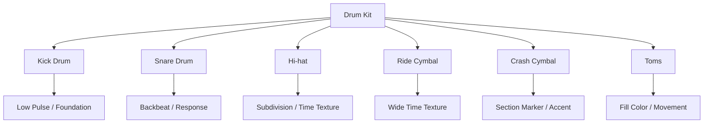
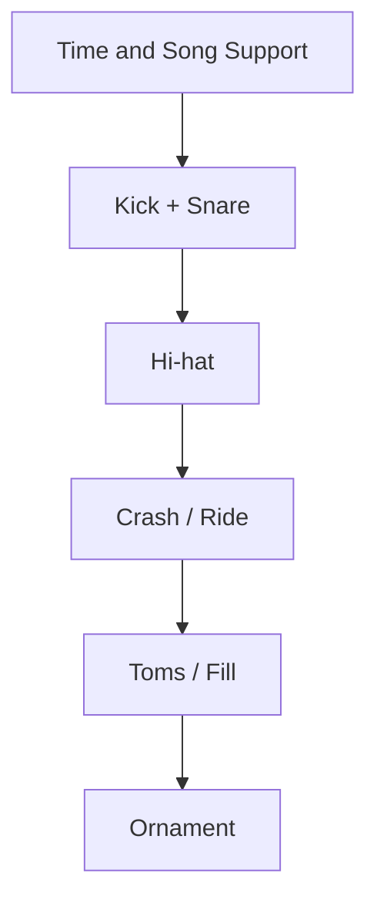
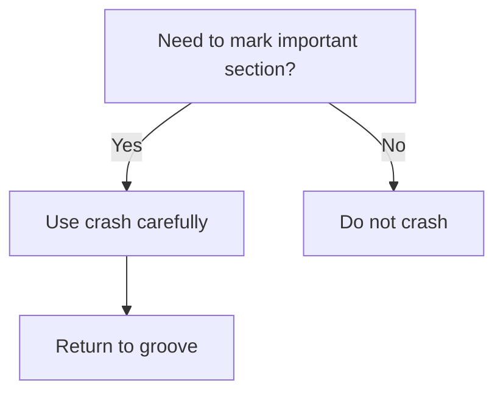

# learn-drum-cajon-part-005.md

# Part 005 — Sound Production Drum Kit: Kick, Snare, Hi-hat, Ride, Crash

## Status Seri

- Seri: `learn-drum-cajon`
- Part: `005`
- Topik: Produksi suara dasar drum kit
- Target akhir seri: mampu mengiringi penyanyi dengan drum dan/atau cajon secara stabil, musikal, dan sadar konteks
- Status: seri belum selesai
- Part sebelumnya: `learn-drum-cajon-part-004.md`
- Part berikutnya: `learn-drum-cajon-part-006.md`

---

## Tujuan Part Ini

Part ini membahas bagaimana menghasilkan suara drum kit yang berguna untuk mengiringi penyanyi. Fokusnya bukan sound engineering studio secara mendalam, tetapi **fungsi musikal setiap elemen drum kit** dan cara memainkannya dengan kontrol.

Setelah part ini, kamu harus mampu:

1. memahami fungsi kick, snare, hi-hat, ride, crash, dan tom,
2. menghasilkan suara kick yang konsisten,
3. menghasilkan suara snare yang stabil dan tidak terlalu keras,
4. memainkan hi-hat sebagai subdivision tanpa mendominasi vokal,
5. memakai crash sebagai marker, bukan kebiasaan acak,
6. memahami kapan memakai ride,
7. memainkan tom/fill sederhana tanpa merusak tempo,
8. mengontrol volume setiap limb,
9. membangun suara drum yang mendukung penyanyi.

---

# 1. Drum Kit sebagai Sistem Fungsi

Drum kit bukan kumpulan benda untuk dipukul. Drum kit adalah sistem peran.



Untuk accompaniment, setiap elemen harus menjawab pertanyaan:

> Elemen ini membantu lagu, vokal, dan section saat ini, atau hanya membuat saya terlihat sedang bermain drum?

Jika tidak membantu, kurangi.

---

# 2. Hierarki Suara untuk Mengiringi Penyanyi

Dalam banyak lagu vokal, hierarki drum kit yang aman adalah:



Prioritas:

1. **Kick dan snare** membangun kerangka groove.
2. **Hi-hat** memberi subdivision.
3. **Crash/ride** memberi warna dan marker section.
4. **Tom/fill** memberi transisi.
5. **Ornament** hanya jika semua fondasi stabil.

Jika kick/snare belum stabil, jangan sibuk ride pattern, crash, atau fill.

---

# 3. Kick Drum

## 3.1 Fungsi Kick

Kick drum adalah fondasi low-end. Dalam full band, kick sering berhubungan erat dengan bass guitar. Dalam format tanpa bass, kick tetap memberi rasa tanah atau ground.

Fungsi kick:

- menandai beat penting,
- memberi bobot ke downbeat,
- menggerakkan groove,
- membantu chorus terasa lebih besar,
- memberi energi fisik.

Dalam groove 4/4 paling dasar:

```text
Count : 1   2   3   4
Kick  : X       X
Snare :     X       X
```

Kick di 1 dan 3 memberi struktur sederhana.

---

## 3.2 Kick untuk Accompaniment

Kick yang baik untuk mengiringi penyanyi:

- stabil,
- tidak terlalu ramai,
- tidak mendahului tempo,
- tidak mengganggu vokal,
- mendukung bass/gitar/piano,
- memberi energi secukupnya.

Kesalahan umum:

| Kesalahan | Dampak |
|---|---|
| Kick terlalu banyak | Groove terasa gelisah |
| Kick tidak konsisten | Lagu terasa goyang |
| Kick terlalu lemah | Groove kehilangan fondasi |
| Kick rush sebelum snare | Tempo terasa maju |
| Kick terlalu keras di verse | Vokal terasa tertutup energi low-end |

---

## 3.3 Heel-Up dan Heel-Down secara Praktis

Untuk awal, jangan terjebak debat teknik.

### Heel-Down

Tumit menempel atau dekat pedal.

Kelebihan:

- kontrol pelan lebih mudah,
- cocok untuk dynamic kecil,
- baik untuk latihan awal,
- tidak terlalu eksplosif.

Risiko:

- volume terbatas,
- bisa terasa berat di tempo tertentu.

### Heel-Up

Tumit lebih terangkat.

Kelebihan:

- volume lebih besar,
- cocok untuk full band,
- lebih kuat untuk chorus/rock ringan.

Risiko:

- mudah terlalu keras,
- bisa membuat badan ikut bergerak,
- pemula sering kehilangan kontrol.

Rule awal:

> Gunakan teknik yang membuat kick stabil, tidak menyakiti kaki, dan tidak membuat tubuh kehilangan keseimbangan.

---

## 3.4 Kick Sound Drill

### Drill 1 — Kick di Beat 1

Durasi: 3 menit

```text
Count : 1   2   3   4
Kick  : X
```

Fokus:

- kick tepat di beat 1,
- suara konsisten,
- badan tidak ikut maju,
- napas normal.

### Drill 2 — Kick di 1 dan 3

Durasi: 3 menit

```text
Count : 1   2   3   4
Kick  : X       X
```

Fokus:

- jarak beat 1 ke 3 stabil,
- tidak rush ke beat 3.

### Drill 3 — Kick dengan Metronome

Durasi: 5 menit

- metronome 70 BPM,
- kick di setiap beat,
- lalu kick hanya 1 dan 3,
- rekam,
- dengarkan apakah kick tepat dengan click.

---

# 4. Snare Drum

## 4.1 Fungsi Snare

Snare adalah suara backbeat utama dalam banyak lagu 4/4.

```text
Count : 1   2   3   4
Snare :     X       X
```

Snare membuat pendengar merasakan 2 dan 4. Ini adalah salah satu elemen paling penting dalam pop, rock, worship, dan banyak acoustic arrangement.

Fungsi snare:

- memberi backbeat,
- memberi jawaban terhadap kick,
- menandai groove,
- memberi aksen,
- menjadi pusat energi rhythm section.

---

## 4.2 Snare Tidak Harus Selalu Keras

Kesalahan pemula:

> snare harus dipukul keras supaya terasa.

Padahal accompaniment sering membutuhkan snare yang terkendali.

Level snare:

| Level | Konteks |
|---:|---|
| 1 | sangat lembut, hampir ghost |
| 2 | verse acoustic |
| 3 | normal pop |
| 4 | chorus/full band |
| 5 | accent besar, jarang |

Jika kamu selalu main level 4–5, lagu kehilangan dynamic arc.

---

## 4.3 Area Pukulan Snare

Secara sederhana:

| Area | Karakter |
|---|---|
| Center | penuh, fokus |
| Slightly off-center | lebih hangat |
| Rim click | lembut/intimate |
| Rimshot | keras/tajam, hati-hati |

Untuk 20 jam pertama, fokus pada:

- center hit yang konsisten,
- rim click untuk dynamic lembut,
- hindari rimshot berlebihan.

---

## 4.4 Snare Drill

### Drill 1 — Snare di 2 dan 4

Durasi: 5 menit

```text
Count : 1   2   3   4
Snare :     X       X
```

Fokus:

- hanya 2 dan 4,
- jangan berubah menjadi 1 dan 3,
- suara konsisten.

### Drill 2 — Snare 5 Level Volume

Durasi: 5 menit

Main snare di 2 dan 4 pada level:

```text
Level 1: sangat pelan
Level 2: pelan
Level 3: sedang
Level 4: besar
Level 5: sangat besar
```

Fokus:

- volume berubah karena stroke height,
- bukan karena tubuh tegang.

### Drill 3 — Kick + Snare Skeleton

Durasi: 5 menit

```text
Count : 1   2   3   4
Kick  : X       X
Snare :     X       X
```

Acceptance:

- kick dan snare tidak saling menarik tempo,
- snare tidak lebih cepat karena tangan panik.

---

# 5. Hi-hat

## 5.1 Fungsi Hi-hat

Hi-hat sering menjadi penjaga subdivision.

Dalam groove dasar:

```text
Count : 1 & 2 & 3 & 4 &
Hat   : x x x x x x x x
```

Fungsi hi-hat:

- memberi grid,
- menjaga time,
- menentukan feel,
- memberi texture,
- membantu energi section,
- memberi lift saat dibuka sedikit.

---

## 5.2 Hi-hat Bisa Merusak Vokal

Hi-hat berada di frekuensi tinggi dan mudah menutupi artikulasi vokal jika terlalu keras.

Kesalahan pemula:

- hi-hat terlalu dominan,
- tangan kanan terlalu keras,
- semua 8th note sama keras,
- open hi-hat terlalu sering,
- hi-hat membuat verse terasa tegang.

Rule awal:

> Hi-hat harus terasa menjaga waktu, bukan menusuk telinga.

---

## 5.3 Closed, Slightly Open, Open

### Closed Hi-hat

Karakter:

- tight,
- controlled,
- cocok untuk verse,
- cocok untuk groove stabil.

### Slightly Open Hi-hat

Karakter:

- lebih besar,
- memberi lift,
- cocok menuju chorus,
- hati-hati jangan terlalu berisik.

### Open Hi-hat

Karakter:

- kuat,
- luas,
- dramatic,
- sebaiknya dipakai sebagai aksen, bukan default pemula.

---

## 5.4 Hi-hat Accent

Hi-hat datar:

```text
1 & 2 & 3 & 4 &
x x x x x x x x
```

Hi-hat dengan accent di angka:

```text
1 & 2 & 3 & 4 &
X x X x X x X x
```

Hi-hat dengan accent offbeat:

```text
1 & 2 & 3 & 4 &
x X x X x X x X
```

Untuk awal, gunakan accent angka dulu agar time kuat.

---

## 5.5 Hi-hat Drill

### Drill 1 — Soft 8th Notes

Durasi: 5 menit

```text
Count : 1 & 2 & 3 & 4 &
Hat   : x x x x x x x x
```

Fokus:

- sangat pelan,
- rata,
- bahu kanan turun,
- wrist kecil.

### Drill 2 — Hi-hat + Snare

Durasi: 5 menit

```text
Count : 1 & 2 & 3 & 4 &
Hat   : x x x x x x x x
Snare :     X       X
```

Fokus:

- snare tidak membuat hi-hat berhenti,
- hi-hat tidak makin keras saat snare masuk.

### Drill 3 — Hi-hat + Kick + Snare

Durasi: 5 menit

```text
Count : 1 & 2 & 3 & 4 &
Hat   : x x x x x x x x
Snare :     X       X
Kick  : X       X
```

Fokus:

- ini basic groove skeleton,
- main 2 menit tanpa fill.

---

# 6. Ride Cymbal

## 6.1 Fungsi Ride

Ride cymbal juga bisa menjadi subdivision, tetapi karakternya lebih terbuka dan luas daripada hi-hat.

Ride cocok untuk:

- chorus yang lebih besar,
- bridge yang terbuka,
- section yang butuh ruang,
- medium tempo groove,
- lagu yang tidak ingin terlalu tight.

Ride kurang cocok jika:

- verse sangat intim,
- ruangan kecil,
- vokal lembut,
- cymbal terlalu wash,
- drummer belum bisa kontrol volume.

---

## 6.2 Ride Pattern Dasar

```text
Count : 1 & 2 & 3 & 4 &
Ride  : x x x x x x x x
Snare :     X       X
Kick  : X       X
```

Ride harus dimainkan dengan kontrol. Jangan membuat wash terlalu besar sampai vokal tertutup.

---

## 6.3 Bell Ride

Bell ride memberi suara lebih tajam.

Untuk 20 jam pertama, gunakan sangat terbatas.

Cocok untuk:

- section besar,
- build,
- final chorus,
- accent tertentu.

Tidak cocok untuk:

- verse lembut,
- acoustic vocal,
- ruangan kecil.

---

# 7. Crash Cymbal

## 7.1 Fungsi Crash

Crash adalah marker. Biasanya dipakai untuk menandai:

- awal chorus,
- awal bridge,
- awal final section,
- ending,
- accent besar,
- transisi penting.

Crash bukan pengganti groove.



## 7.2 Kesalahan Pemula dengan Crash

| Kesalahan | Dampak |
|---|---|
| Crash terlalu sering | lagu terasa berisik |
| Crash terlalu keras | vokal tertutup |
| Crash di tempat acak | section membingungkan |
| Crash tanpa kembali groove | tempo rusak |
| Crash di verse lembut | dynamic hancur |

Rule:

> Crash harus memberi informasi. Jika tidak memberi informasi, jangan dipakai.

---

## 7.3 Crash Drill

Latihan:

```text
Bar 1: groove
Bar 2: groove
Bar 3: groove
Bar 4: groove/fill kecil
Bar 5: crash + kembali groove
```

Counting:

```text
1 2 3 4 | 2 2 3 4 | 3 2 3 4 | 4 2 3 4 | CRASH
```

Fokus:

- crash tepat di beat 1,
- setelah crash langsung kembali groove,
- tidak rush.

---

# 8. Toms

## 8.1 Fungsi Toms

Tom memberi warna fill dan movement. Untuk accompaniment, tom jarang menjadi fondasi groove awal.

Fungsi tom:

- fill,
- build,
- section transition,
- dramatic movement,
- alternative texture.

Risiko:

- fill terlalu panjang,
- tempo hilang,
- tangan bergerak terlalu besar,
- beat 1 missed.

---

## 8.2 Tom Fill Dasar

Untuk awal, gunakan fill sederhana.

### Fill 1 — Snare ke Tom

```text
Count : 1 & 2 & 3 & 4 &
Groove sampai 3 &, lalu:
4 & : Snare Tom
```

### Fill 2 — Four Notes

```text
Count : 1 & 2 & 3 & 4 &
Fill  :             S T T F
```

S = snare  
T = tom  
F = floor tom

Jangan mengejar cepat. Tujuan fill adalah kembali ke beat 1.

---

# 9. Dynamic Balance antar Elemen

Salah satu masalah terbesar pemula adalah semua elemen dimainkan dengan volume sama.

Padahal balance yang baik biasanya:

| Elemen | Volume Relatif |
|---|---:|
| Kick | medium-kuat |
| Snare | medium, sesuai section |
| Hi-hat | lebih pelan dari snare |
| Ride | terkendali |
| Crash | hanya accent |
| Tom | sesuai fill |

Hi-hat terlalu keras adalah masalah umum. Snare terlalu keras juga sangat umum.

Latihan balance:

```text
Hi-hat: level 2
Kick  : level 3
Snare : level 3
Crash : level 4 hanya section marker
```

---

# 10. Groove Skeleton

Sebelum pattern kompleks, kuasai skeleton.

## 10.1 Skeleton 1 — Kick/Snare

```text
Count : 1   2   3   4
Kick  : X       X
Snare :     X       X
```

## 10.2 Skeleton 2 — Add Hi-hat

```text
Count : 1 & 2 & 3 & 4 &
Hat   : x x x x x x x x
Kick  : X       X
Snare :     X       X
```

## 10.3 Skeleton 3 — Add Crash at Section

```text
Bar 1: groove
Bar 2: groove
Bar 3: groove
Bar 4: fill small
Bar 5: crash + groove
```

## 10.4 Skeleton 4 — Verse to Chorus

Verse:

```text
Hat closed, volume 2
Kick simple
Snare level 2
```

Chorus:

```text
Hat slightly stronger/open
Kick slightly more active
Snare level 3
Crash on beat 1 only
```

---

# 11. Sound Production dalam Konteks Lagu

## 11.1 Verse

Tujuan verse:

- vokal jelas,
- lirik terdengar,
- energy belum terlalu tinggi,
- groove tetap hidup.

Strategi drum:

- hi-hat closed,
- kick sederhana,
- snare level 2,
- no crash atau sangat sedikit,
- fill minimal.

## 11.2 Chorus

Tujuan chorus:

- energy naik,
- hook terasa,
- pendengar merasakan lift.

Strategi drum:

- crash di awal chorus,
- hi-hat lebih terbuka atau ride,
- kick sedikit lebih aktif,
- snare lebih tegas,
- tetap jangan menutup vokal.

## 11.3 Bridge

Bridge bisa dua arah:

- drop/turun,
- build/naik.

Jika drop:

- kurangi hi-hat,
- pakai kick ringan,
- snare tipis/rim,
- banyak ruang.

Jika build:

- tambah density perlahan,
- gunakan tom/snare build,
- simpan crash untuk masuk final chorus.

## 11.4 Ending

Ending butuh kesepakatan.

Jenis ending:

| Ending | Strategi Drum |
|---|---|
| Stop ending | semua berhenti di cue |
| Ring out | crash lalu sustain |
| Fade feel | turunkan density |
| Tag ending | ulang phrase terakhir |
| Ritardando | ikuti leader, jangan ego |

---

# 12. Sound Control untuk Ruangan Kecil

Dalam ruangan kecil, drum kit bisa terlalu keras bahkan ketika pemain merasa normal.

Strategi:

- pakai stick lebih ringan atau rods/brushes jika ada,
- main hi-hat lebih pelan,
- kurangi crash,
- gunakan rim click,
- snare level 2,
- kick tidak berlebihan,
- dengar vokal dari perspektif pendengar.

Rule:

> Kalau penyanyi harus berteriak untuk melawan drum, kamu terlalu keras.

---

# 13. Sound Control untuk Full Band

Dalam full band, kamu boleh lebih besar, tetapi tetap harus balance.

Prioritas:

- lock kick dengan bass,
- snare jelas,
- hi-hat tidak menusuk,
- crash tidak menutup vokal,
- fill tidak menabrak gitar/vokal.

Jika sound system ada, jangan berpikir kamu harus memukul lebih keras agar terdengar. Biarkan mic/PA bekerja.

---

# 14. Ear Protection

Drum kit bisa sangat keras. Gunakan ear protection jika memungkinkan, terutama:

- latihan lama,
- ruangan kecil,
- cymbal dekat telinga,
- full band,
- snare keras.

Telinga adalah alat musik utama. Jika pendengaran rusak, kemampuan musikal ikut turun.

---

# 15. Recording untuk Sound Review

Rekam dari dua posisi:

## 15.1 Dekat Drum

Mendengar detail teknik:

- snare consistency,
- hi-hat rata,
- kick clarity.

## 15.2 Jarak Pendengar

Mendengar balance:

- apakah hi-hat terlalu keras?
- apakah snare menutup vokal?
- apakah kick terlalu besar?
- apakah crash menyakitkan?
- apakah groove mendukung lagu?

Checklist review:

| Pertanyaan | Ya/Tidak |
|---|---|
| Kick konsisten? | |
| Snare tidak terlalu keras? | |
| Hi-hat tidak mendominasi? | |
| Crash hanya di section penting? | |
| Groove stabil? | |
| Vokal tetap jelas? | |
| Dynamics berubah antar section? | |

---

# 16. Practice Drills Terstruktur

## Drill A — Sound Isolation

Durasi: 15 menit

| Durasi | Fokus |
|---:|---|
| 3 menit | kick only |
| 3 menit | snare only |
| 3 menit | hi-hat only |
| 3 menit | kick + snare |
| 3 menit | hi-hat + kick + snare |

Tempo: 70 BPM.

## Drill B — Volume Ladder

Durasi: 10 menit

Pilih satu elemen:

- snare,
- hi-hat,
- kick.

Main level 1 sampai 5, lalu turun 5 sampai 1.

```text
1 - 2 - 3 - 4 - 5 - 4 - 3 - 2 - 1
```

Tujuan:

- dynamic control,
- bukan hanya keras.

## Drill C — Verse/Chorus Contrast

Durasi: 10 menit

Bar 1–4: verse

```text
closed hi-hat, soft snare, simple kick
```

Bar 5–8: chorus

```text
slightly stronger hi-hat, stronger snare, crash beat 1
```

Ulang 5 kali.

## Drill D — Crash Return

Durasi: 10 menit

```text
Bar 1-3: groove
Bar 4: small fill
Bar 5 beat 1: crash
Bar 5 onward: groove
```

Acceptance:

- crash tidak membuat tempo berubah.

---

# 17. Common Mistakes

## 17.1 Hi-hat Terlalu Keras

Gejala:

- rekaman terdengar tajam,
- vokal seperti tertutup noise tinggi,
- groove terasa nervous.

Correction:

- main hi-hat level 1–2,
- wrist kecil,
- bahu turun,
- rekam ulang.

## 17.2 Snare Selalu Rimshot

Gejala:

- verse terlalu keras,
- penyanyi tertutup,
- dynamic tidak punya ruang naik.

Correction:

- latih center hit level 2–3,
- gunakan rimshot hanya accent,
- coba rim click untuk verse.

## 17.3 Kick Tidak Stabil

Gejala:

- groove terasa jatuh bangun,
- beat 1 lemah,
- tempo goyang.

Correction:

- kick-only drill,
- kick 1/3 dengan metronome,
- jangan tambah kick variation dulu.

## 17.4 Crash di Semua Tempat

Gejala:

- lagu terasa amatir,
- section tidak jelas,
- cymbal wash menutupi vokal.

Correction:

- crash hanya awal chorus/bridge/final,
- maksimal satu crash per section awal untuk latihan awal.

## 17.5 Fill Tom Terlalu Panjang

Gejala:

- beat 1 hilang,
- tempo rush,
- chorus masuk berantakan.

Correction:

- fill 1 beat dulu,
- gunakan snare saja,
- baru tambah tom jika stabil.

---

# 18. Debugging Guide

| Gejala | Penyebab Kemungkinan | Correction Drill |
|---|---|---|
| Groove terasa kasar | snare/hi-hat terlalu keras | volume ladder |
| Vokal tertutup | cymbal/snare dominan | record from listener position |
| Tempo rush | kick/fill mendahului | metronome slow drill |
| Chorus tidak naik | verse terlalu besar | reduce verse dynamics |
| Crash mengacaukan tempo | badan tegang saat crash | crash return drill |
| Kick lemah | pedal control belum stabil | kick-only drill |
| Hi-hat tidak rata | wrist kaku | soft 8th drill |
| Sound monoton | tidak ada dynamic contrast | verse/chorus drill |

---

# 19. Mini Song Application

Pilih satu lagu 4/4 medium-slow.

Buat chart:

```md
## Song Drum Plan

Title:
Tempo:
Meter: 4/4

Intro:
- no crash / light hat

Verse:
- closed hat
- kick 1/3
- snare 2/4 level 2

Chorus:
- crash beat 1
- hi-hat slightly stronger
- snare level 3
- kick simple variation

Bridge:
- reduce / build

Ending:
- stop / crash / ring out
```

Latih:

1. main verse 4 bar,
2. chorus 4 bar,
3. ulang,
4. rekam,
5. cek balance.

---

# 20. Acceptance Criteria Part Ini

Kamu boleh lanjut jika:

1. bisa menjelaskan fungsi kick, snare, hi-hat, ride, crash, dan tom,
2. bisa memainkan kick di 1/3 dan snare di 2/4 selama 2 menit,
3. bisa menambahkan hi-hat 8th note tanpa terlalu keras,
4. bisa memainkan crash di beat 1 section lalu kembali groove,
5. bisa memainkan 3 level volume snare,
6. bisa membedakan verse dan chorus lewat drum sound,
7. tahu kapan ride lebih cocok daripada hi-hat,
8. tahu bahwa crash adalah marker, bukan default.

---

# 21. Ringkasan

Drum kit adalah sistem fungsi:

- kick = fondasi low pulse,
- snare = backbeat,
- hi-hat = subdivision,
- ride = texture luas,
- crash = section marker,
- tom = fill color.

Untuk mengiringi penyanyi, suara yang baik bukan suara paling keras, tetapi suara yang:

- stabil,
- seimbang,
- tidak menutup vokal,
- mendukung section,
- memberi dynamic arc,
- kembali ke groove setelah accent/fill.

Rule paling penting:

> Jika sound kamu membuat penyanyi sulit terdengar, maka permainanmu belum mendukung lagu.

---

# 22. Latihan untuk Part Berikutnya

Sebelum lanjut ke Part 006, lakukan:

1. Latih kick/snare skeleton 3 menit.
2. Tambahkan hi-hat 8th note 2 menit.
3. Rekam dari jarak pendengar.
4. Cek apakah hi-hat terlalu keras.
5. Mainkan verse 4 bar dan chorus 4 bar dengan dynamic berbeda.
6. Jika punya cajon, coba pikirkan:
   - kick = bass,
   - snare = slap,
   - hi-hat = touch.

Part berikutnya membahas:

> sound production cajon: bass, slap, touch, ghost note, muted tone, dan cara memetakan fungsi drum kit ke cajon untuk acoustic accompaniment.
