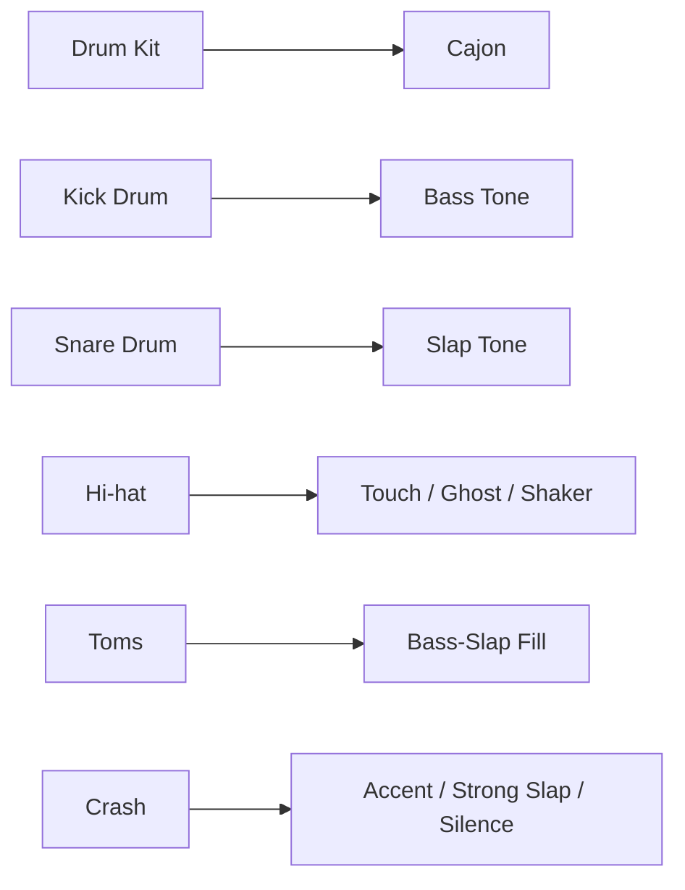
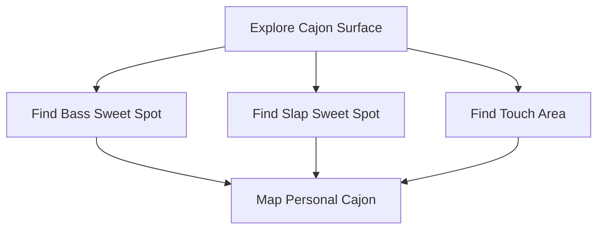
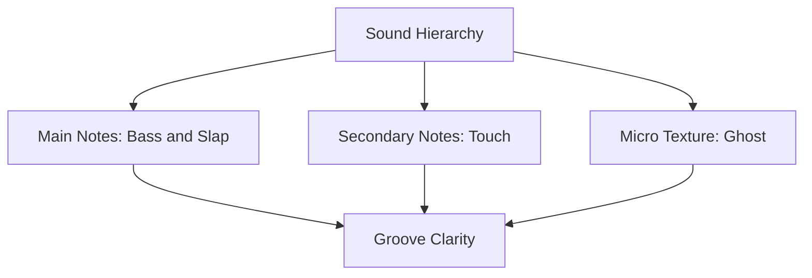

# learn-drum-cajon-part-006.md

# Part 006 — Sound Production Cajon: Bass, Slap, Touch, Ghost Note

## Status Seri

- Seri: `learn-drum-cajon`
- Part: `006`
- Topik: Produksi suara dasar cajon
- Target akhir seri: mampu mengiringi penyanyi dengan drum dan/atau cajon secara stabil, musikal, dan sadar konteks
- Status: seri belum selesai
- Part sebelumnya: `learn-drum-cajon-part-005.md`
- Part berikutnya: `learn-drum-cajon-part-007.md`

---

## Tujuan Part Ini

Part ini membahas cajon sebagai alat accompaniment. Cajon terlihat sederhana, tetapi untuk mengiringi penyanyi dengan baik, kamu harus bisa menghasilkan beberapa jenis suara dengan fungsi berbeda.

Setelah part ini, kamu harus mampu:

1. memahami cajon sebagai mini drum kit,
2. menghasilkan bass tone yang bulat,
3. menghasilkan slap tone yang jelas tetapi tidak menyakitkan,
4. memainkan touch sebagai subdivision ringan,
5. memahami ghost note sebagai tekstur,
6. memakai silence sebagai bagian groove,
7. mengontrol volume bass/slap/touch,
8. membangun groove cajon dasar,
9. memilih sound cajon berdasarkan section lagu,
10. menghindari cajon yang terlalu keras, kasar, atau monoton.

---

# 1. Cajon sebagai Mini Drum Kit

Dalam accompaniment modern, cajon sering menggantikan fungsi drum kit secara ringkas.



Pemetaan praktis:

| Drum Kit | Cajon |
|---|---|
| Kick | Bass |
| Snare | Slap |
| Hi-hat | Touch/ghost note/shaker |
| Tom fill | Bass-slap movement |
| Crash | accent kuat, flam, atau silence sebelum masuk |
| Rim click | light tap/touch |

Cajon bukan drum kit kecil secara literal. Tetapi secara fungsi accompaniment, ia bisa mengisi peran yang mirip.

---

# 2. Karakter Cajon dalam Accompaniment

Cajon cocok untuk:

- acoustic set,
- singer-songwriter,
- cafe,
- worship kecil,
- rehearsal,
- lagu intimate,
- ruangan yang tidak cocok untuk drum kit,
- format vokal + gitar/piano.

Kelebihan:

- portabel,
- volume lebih mudah dikontrol daripada drum kit,
- cocok untuk lagu vokal,
- sound organik,
- setup cepat.

Risiko:

- slap terlalu tajam,
- bass tidak terdengar,
- pattern monoton,
- tangan sakit,
- terlalu banyak tap,
- tidak ada dynamic arc,
- terdengar seperti mengetuk kotak tanpa musikalitas.

---

# 3. Area Suara Cajon

Setiap cajon berbeda, tetapi secara umum:

```text
+-----------------------+
| upper edge: slap/tap  |
|                       |
| upper-mid: touch      |
|                       |
| center/mid: bass      |
|                       |
| lower area: resonance |
+-----------------------+
```

Namun jangan menganggap ini absolut. Kamu harus mencari sweet spot alatmu.



Latihan awal selalu dimulai dari eksplorasi suara, bukan langsung pattern.

---

# 4. Bass Tone

## 4.1 Fungsi Bass Tone

Bass tone adalah pengganti kick drum.

Fungsi:

- memberi fondasi,
- menandai beat 1,
- memberi body,
- membuat groove tidak melayang,
- mendukung gitar/piano,
- memberi dasar untuk chorus.

Dalam 4/4 paling dasar:

```text
Count : 1   2   3   4
Bass  : B       B
```

---

## 4.2 Cara Menghasilkan Bass

Prinsip umum:

- pukul area tengah/atas-tengah front plate,
- gunakan telapak atau bagian bawah telapak,
- kontak cepat,
- jangan menekan setelah memukul,
- release agar resonansi keluar,
- jangan membungkuk ekstrem.

Kesalahan umum:

| Kesalahan | Akibat |
|---|---|
| Menekan panel setelah pukul | bass mati |
| Memukul terlalu keras | tangan sakit, sound kasar |
| Area terlalu atas | bass kurang bulat |
| Area terlalu bawah | gerak tidak nyaman |
| Badan terlalu membungkuk | punggung lelah |
| Tidak release | suara pendek/tumpul |

---

## 4.3 Bass Search Drill

Durasi: 7 menit

1. Hitung `1 2 3 4`.
2. Main bass di beat 1 saja.
3. Coba 5 titik berbeda di permukaan cajon.
4. Dengarkan titik mana paling bulat.
5. Pilih satu titik sebagai default.
6. Main 2 menit konsisten.

Pattern:

```text
Count : 1   2   3   4
Bass  : B
```

Acceptance:

- bass terdengar berbeda dari tap,
- tidak sakit,
- suara cukup konsisten.

---

## 4.4 Bass Consistency Drill

Durasi: 5 menit

```text
Count : 1   2   3   4
Bass  : B       B
```

Fokus:

- volume sama antara beat 1 dan 3,
- tangan tidak tegang,
- tempo tidak rush.

---

# 5. Slap Tone

## 5.1 Fungsi Slap

Slap adalah pengganti snare/backbeat.

Dalam 4/4:

```text
Count : 1   2   3   4
Slap  :     S       S
```

Slap memberi:

- backbeat,
- clarity,
- response terhadap bass,
- energi,
- section lift.

---

## 5.2 Cara Menghasilkan Slap

Prinsip:

- gunakan area atas/dekat tepi front plate,
- kontak cepat dengan jari/telapak atas,
- release langsung,
- cari suara tajam tetapi tidak brutal,
- jaga pergelangan tetap bebas,
- jangan mengunci jari.

Slap yang baik:

- jelas berbeda dari bass,
- tidak harus sangat keras,
- bisa dimainkan pada level volume berbeda,
- tidak menyakiti tangan.

---

## 5.3 Slap Search Drill

Durasi: 7 menit

1. Coba area kanan atas, kiri atas, dan tengah atas.
2. Main slap pelan.
3. Cari suara tajam yang nyaman.
4. Jangan mengejar volume dulu.
5. Setelah menemukan titik, main 2 dan 4.

Pattern:

```text
Count : 1   2   3   4
Slap  :     S       S
```

Acceptance:

- slap terdengar crisp,
- tidak menyakitkan,
- bisa diulang konsisten.

---

## 5.4 Slap Volume Drill

Durasi: 5 menit

Main slap di level 1–5:

| Level | Kegunaan |
|---:|---|
| 1 | verse sangat lembut |
| 2 | acoustic verse |
| 3 | normal chorus kecil |
| 4 | chorus kuat |
| 5 | accent khusus, jarang |

Pattern:

```text
1 2 3 4
  S   S
```

Rule:

> Slap level 5 bukan default. Untuk mengiringi penyanyi, level 2–3 sering lebih berguna.

---

# 6. Touch Tone

## 6.1 Fungsi Touch

Touch adalah pukulan ringan yang memberi movement atau subdivision. Touch bisa berfungsi seperti hi-hat.

```text
Count : 1 & 2 & 3 & 4 &
Touch : t t t t t t t t
```

Touch membantu:

- menjaga time,
- mengisi ruang tanpa terlalu keras,
- membuat groove mengalir,
- menjaga energi rendah,
- memberi tekstur verse.

---

## 6.2 Touch Harus Ringan

Touch yang terlalu keras menjadi noise. Dalam accompaniment, touch harus sering lebih terasa daripada terdengar dominan.

Kesalahan umum:

| Kesalahan | Akibat |
|---|---|
| Touch terlalu keras | groove sesak |
| Touch tidak rata | timing terasa goyang |
| Touch membuat tangan tegang | cepat lelah |
| Touch menutupi slap | backbeat kurang jelas |
| Touch dimainkan terus tanpa dynamics | monoton |

---

## 6.3 Touch Drill

Durasi: 5 menit

```text
Count : 1 & 2 & 3 & 4 &
Touch : t t t t t t t t
```

Fokus:

- volume level 1–2,
- rata,
- tangan kecil,
- bahu turun,
- tidak memburu tempo.

---

## 6.4 Touch + Backbeat Drill

Durasi: 5 menit

```text
Count : 1 & 2 & 3 & 4 &
Touch : t t t t t t t t
Slap  :     S       S
```

Fokus:

- touch tetap ringan,
- slap jelas,
- tidak semua note sama keras.

---

# 7. Ghost Note

## 7.1 Definisi Ghost Note

Ghost note adalah note kecil, halus, dan tidak dominan yang dimainkan di antara note utama.

Ghost note bukan backbeat. Ghost note adalah tekstur.

Contoh:

```text
Count : 1 & 2 & 3 & 4 &
Bass  : B       B
Slap  :     S       S
Ghost :   g   g   g   g
```

Ghost note membuat groove terasa lebih hidup.

---

## 7.2 Ghost Note Harus Punya Hierarki

Hierarki volume cajon:

```text
Bass/Slap utama > Touch/Ghost
```

Jika ghost note sama keras dengan slap, groove menjadi kacau.



---

## 7.3 Ghost Note Drill

Durasi: 7 menit

Mulai tanpa bass/slap:

```text
Count : 1 & 2 & 3 & 4 &
Ghost :   g   g   g   g
```

Lalu tambah slap:

```text
Count : 1 & 2 & 3 & 4 &
Slap  :     S       S
Ghost :   g   g   g   g
```

Lalu tambah bass:

```text
Count : 1 & 2 & 3 & 4 &
Bass  : B       B
Slap  :     S       S
Ghost :   g   g   g   g
```

Acceptance:

- ghost tetap kecil,
- tidak mengganggu bass/slap,
- timing tetap stabil.

---

# 8. Muted Tone

## 8.1 Fungsi Muted Tone

Muted tone adalah suara pendek/tumpul yang bisa dipakai sebagai texture atau dynamic control.

Cara umum:

- satu tangan sedikit menyentuh/mematikan resonansi,
- tangan lain memukul ringan,
- atau pukulan dilakukan dengan release lebih pendek.

Muted tone berguna untuk:

- verse lembut,
- groove intimate,
- variasi tanpa menaikkan volume,
- mengurangi resonansi berlebihan.

Untuk 20 jam pertama, muted tone bersifat optional. Jangan jadikan prioritas jika bass/slap belum jelas.

---

# 9. Silence sebagai Suara

Cajon sering terdengar terlalu ramai karena pemain merasa harus terus mengetuk.

Padahal silence sangat penting.

Contoh groove dengan ruang:

```text
Count : 1 & 2 & 3 & 4 &
Bass  : B       B
Slap  :     S       S
Touch :   t       t
```

Lebih lega daripada:

```text
Count : 1 & 2 & 3 & 4 &
Touch : t t t t t t t t
Bass  : B       B
Slap  :     S       S
```

Keduanya bisa benar, tergantung lagu.

Rule:

> Jika vokal padat, cajon harus memberi ruang.

---

# 10. Basic Cajon Groove

## 10.1 Skeleton Groove

```text
Count : 1   2   3   4
Bass  : B       B
Slap  :     S       S
```

Ini harus stabil sebelum variasi.

## 10.2 Add Touch

```text
Count : 1 & 2 & 3 & 4 &
Touch : t t t t t t t t
Bass  : B       B
Slap  :     S       S
```

## 10.3 Add Light Ghost

```text
Count : 1 & 2 & 3 & 4 &
Bass  : B       B
Slap  :     S       S
Ghost :   g   g   g   g
```

## 10.4 Sparse Verse Groove

```text
Count : 1 & 2 & 3 & 4 &
Bass  : B       B
Slap  :     s       s
Touch :   t       t
```

## 10.5 Stronger Chorus Groove

```text
Count : 1 & 2 & 3 & 4 &
Bass  : B   B   B
Slap  :     S       S
Touch : t t t t t t t t
```

---

# 11. Cajon Dynamics

Dinamika cajon dikendalikan oleh:

- power,
- titik kontak,
- jumlah note,
- jenis suara,
- openness/resonance,
- penggunaan ghost,
- penggunaan silence.

## 11.1 Verse

Strategi:

- bass level 2,
- slap level 1–2,
- touch ringan,
- banyak ruang,
- no fill atau fill kecil.

## 11.2 Chorus

Strategi:

- bass level 3,
- slap level 3,
- touch lebih jelas,
- bisa tambah bass variation,
- accent di awal chorus.

## 11.3 Bridge Drop

Strategi:

- kurangi slap,
- gunakan touch/muted tone,
- bisa hanya bass di beat 1,
- jangan takut diam.

## 11.4 Final Chorus

Strategi:

- bass/slap lebih tegas,
- touch lebih aktif,
- fill sedikit lebih kuat,
- tetap jaga vokal.

---

# 12. Bass-Slap Separation

Masalah umum pemula: bass dan slap terdengar mirip.

Jika bass dan slap tidak berbeda, groove tidak punya fungsi kick/snare yang jelas.

## Drill — Contrast

Durasi: 10 menit

Main bergantian:

```text
B S B S | B S B S
```

Lalu:

```text
Count : 1   2   3   4
Bass  : B       B
Slap  :     S       S
```

Fokus:

- bass bulat,
- slap tajam,
- volume tidak sama persis,
- titik kontak berbeda.

Checklist:

| Pertanyaan | Ya/Tidak |
|---|---|
| Bass terdengar lebih rendah? | |
| Slap terdengar lebih tajam? | |
| Tangan tidak sakit? | |
| Bisa diulang 2 menit? | |

---

# 13. Hand Assignment

Tidak ada satu aturan universal, tetapi kamu butuh sticking yang konsisten.

Jika tangan kanan dominan, opsi awal:

```text
Bass di 1 dan 3: R
Slap di 2 dan 4: L
Touch: alternating R/L
```

Contoh:

```text
Count : 1 & 2 & 3 & 4 &
Hand  : R L L R R L L R
Sound : B t S t B t S t
```

Atau:

```text
Count : 1 & 2 & 3 & 4 &
Hand  : R L R L R L R L
Sound : B t S t B t S t
```

Coba dua opsi dan pilih yang:

- stabil,
- tidak menyakitkan,
- sound jelas,
- tidak membuat bahu tegang.

---

# 14. Cajon Pattern Library Dasar

## Pattern 1 — Basic Pop

```text
Count : 1 & 2 & 3 & 4 &
Bass  : B       B
Slap  :     S       S
Touch : t t t t t t t t
```

## Pattern 2 — Sparse Acoustic

```text
Count : 1 & 2 & 3 & 4 &
Bass  : B       B
Slap  :     s       s
Touch :   t       t
```

## Pattern 3 — Four-on-the-floor Cajon

```text
Count : 1 & 2 & 3 & 4 &
Bass  : B   B   B   B
Slap  :     S       S
Touch : t t t t t t t t
```

## Pattern 4 — Ballad 4/4

```text
Count : 1 & 2 & 3 & 4 &
Bass  : B           B
Slap  :     s       S
Touch :   t   t   t
```

## Pattern 5 — Build

```text
Count : 1 & 2 & 3 & 4 &
Bass  : B   B   B
Slap  :     S       S
Touch : t t t t t t t t
```

## Pattern 6 — Drop

```text
Count : 1 & 2 & 3 & 4 &
Bass  : B
Slap  :
Touch :       t       t
```

## Pattern 7 — Backbeat Only

```text
Count : 1   2   3   4
Bass  : B       B
Slap  :     S       S
```

## Pattern 8 — Offbeat Touch

```text
Count : 1 & 2 & 3 & 4 &
Bass  : B       B
Slap  :     S       S
Touch :   t   t   t   t
```

---

# 15. Cajon for Singer Support

## 15.1 Jangan Menutup Vokal

Slap cajon bisa sangat tajam. Dalam ruangan kecil, slap level 3 bisa terasa seperti level 5 bagi pendengar.

Rule:

> Jika lirik tidak jelas dalam rekaman, kurangi slap atau touch.

## 15.2 Ikuti Napas Penyanyi

Saat penyanyi mengambil napas sebelum chorus, kamu bisa:

- memberi fill kecil,
- menaikkan touch,
- menambah bass,
- atau diam sebelum masuk.

Namun jangan menabrak kata penting.

## 15.3 Pakai Cajon seperti Percussion Arrangement

Jangan berpikir harus selalu memainkan kick-snare-hi-hat lengkap. Kadang cukup:

- bass saja,
- touch saja,
- slap di 4 saja,
- diam 2 bar,
- masuk di chorus.

---

# 16. Cajon dalam Format Berbeda

## 16.1 Singer Only + Cajon

Strategi:

- minimal,
- lembut,
- banyak ruang,
- slap hati-hati,
- ikuti vokal.

## 16.2 Guitar + Vocal + Cajon

Strategi:

- lock dengan strumming,
- jangan meniru semua strum gitar,
- jika gitar padat, cajon sederhana,
- jika gitar sparse, cajon boleh memberi movement.

## 16.3 Piano + Vocal + Cajon

Strategi:

- dengarkan tangan kiri piano,
- jangan membuat low-end terlalu ramai,
- slap jangan menabrak chord accent,
- pakai touch halus.

## 16.4 Full Band Acoustic

Strategi:

- lock dengan bass jika ada,
- cajon jangan tenggelam,
- gunakan slap lebih jelas,
- tetap hindari overplaying.

---

# 17. Common Mistakes

## 17.1 Bass Lemah

Gejala:

- groove terasa tipis,
- slap dominan,
- tidak ada fondasi.

Correction:

- bass search drill,
- kurangi slap,
- main bass 1/3 selama 5 menit,
- rekam.

## 17.2 Slap Terlalu Keras

Gejala:

- vokal tertutup,
- sound kasar,
- tangan sakit,
- lagu terasa agresif.

Correction:

- slap level 2,
- gunakan touch lebih ringan,
- rekam dari jarak pendengar.

## 17.3 Semua Note Sama Volume

Gejala:

- groove datar,
- tidak ada hierarki,
- ghost note mengganggu.

Correction:

- bass/slap utama level 3,
- touch/ghost level 1,
- latihan hierarchy.

## 17.4 Pattern Monoton

Gejala:

- verse dan chorus sama persis,
- lagu tidak berkembang,
- pendengar bosan.

Correction:

- verse sparse,
- chorus tambah density,
- bridge drop,
- final chorus bigger.

## 17.5 Tangan Sakit

Gejala:

- slap menyakitkan,
- telapak panas,
- jari nyeri,
- pergelangan tegang.

Correction:

- berhenti,
- cek teknik,
- kurangi power,
- cari titik kontak,
- jangan memaksa.

---

# 18. Debugging Guide

| Gejala | Penyebab Kemungkinan | Correction Drill |
|---|---|---|
| Bass tidak keluar | titik kontak salah / menekan panel | bass search + release |
| Slap sakit | terlalu keras / jari kaku | slap level 1–2 |
| Groove goyang | touch tidak rata | touch metronome drill |
| Vokal tertutup | slap/touch terlalu keras | record listener position |
| Pattern membosankan | tidak ada dynamic arc | verse/chorus contrast |
| Ghost note mengganggu | terlalu keras | ghost hierarchy drill |
| Tempo rush | tangan tegang | slow 60 BPM drill |
| Bass dan slap mirip | titik kontak tidak jelas | contrast drill |
| Bridge terlalu ramai | takut diam | silence drill |

---

# 19. Practice Drills Terstruktur

## Drill A — Sound Isolation

Durasi: 15 menit

| Durasi | Fokus |
|---:|---|
| 5 menit | bass only |
| 5 menit | slap only |
| 5 menit | touch only |

Tempo: 70 BPM.

## Drill B — Bass-Slap Skeleton

Durasi: 10 menit

```text
Count : 1   2   3   4
Bass  : B       B
Slap  :     S       S
```

Main 5 menit di 60 BPM, 5 menit di 70 BPM.

## Drill C — Add Touch

Durasi: 10 menit

```text
Count : 1 & 2 & 3 & 4 &
Touch : t t t t t t t t
Bass  : B       B
Slap  :     S       S
```

Fokus:

- touch kecil,
- bass/slap jelas.

## Drill D — Verse/Chorus Cajon

Durasi: 10 menit

Verse 4 bar:

```text
Bass simple
Slap soft
Touch sparse
```

Chorus 4 bar:

```text
Bass stronger
Slap clearer
Touch 8th note
```

Ulang 5 kali.

## Drill E — Silence Drill

Durasi: 5 menit

```text
Bar 1: groove
Bar 2: groove
Bar 3: groove
Bar 4: stop on beat 4
Bar 5: enter again
```

Fokus:

- diam tetap menghitung,
- masuk lagi tepat.

---

# 20. Song Application Template

Pilih satu lagu acoustic.

```md
# Cajon Song Plan

Title:
Tempo:
Meter:
Mood:

## Intro
- cajon: diam / touch only / bass light

## Verse
- bass:
- slap:
- touch:
- dynamic level:

## Chorus
- bass:
- slap:
- touch:
- accent:

## Bridge
- drop/build:
- strategy:

## Ending
- stop/ring/fade/tag:
```

Contoh:

```md
## Verse
- bass di 1 dan 3 level 2
- slap di 2 dan 4 level 1-2
- touch offbeat ringan

## Chorus
- bass lebih jelas
- slap level 3
- touch 8th note
- accent kuat di awal chorus
```

---

# 21. Self-Scoring Rubric

Nilai 1–5:

| Area | 1 | 3 | 5 |
|---|---|---|---|
| Bass | tidak jelas | cukup bulat | konsisten dan bulat |
| Slap | sakit/kasar | cukup jelas | jelas dan terkontrol |
| Touch | tidak rata | cukup rata | ringan dan stabil |
| Separation | bass/slap mirip | mulai beda | sangat jelas |
| Dynamics | satu volume | 2 level | 4–5 level |
| Time | goyang | cukup stabil | stabil 3 menit |
| Vocal support | terlalu ramai | cukup support | sangat peka ruang |

Target sebelum lanjut:

- minimal 3 semua area,
- minimal 4 untuk separation bass/slap,
- minimal 4 untuk slap control.

---

# 22. Mini Capstone Part Ini

Rekam 90 detik cajon atau substitusi cajon:

Struktur:

```text
0:00–0:20 Verse soft
0:20–0:40 Chorus medium
0:40–1:00 Verse soft
1:00–1:20 Chorus bigger
1:20–1:30 Ending stop
```

Gunakan hanya:

- bass,
- slap,
- touch,
- satu fill kecil.

Evaluasi:

| Pertanyaan | Ya/Tidak |
|---|---|
| Bass jelas? | |
| Slap tidak terlalu keras? | |
| Touch ringan? | |
| Verse dan chorus berbeda? | |
| Tempo stabil? | |
| Ending jelas? | |
| Tidak menutup vokal/backing track? | |

---

# 23. Acceptance Criteria Part Ini

Kamu boleh lanjut jika:

1. bisa menjelaskan cajon sebagai mini drum kit,
2. bisa menghasilkan bass dan slap yang berbeda,
3. bisa memainkan touch 8th note ringan selama 1 menit,
4. bisa memainkan bass 1/3 dan slap 2/4 selama 2 menit,
5. bisa membedakan verse dan chorus lewat cajon dynamics,
6. bisa memainkan satu groove sparse dan satu groove chorus,
7. tahu kapan harus diam,
8. tidak mengalami pain tajam saat bermain,
9. bisa merekam dan mengevaluasi balance cajon.

---

# 24. Ringkasan

Cajon adalah alat sederhana secara bentuk, tetapi kaya secara fungsi.

Suara utama:

- bass = kick,
- slap = snare,
- touch = hi-hat,
- ghost = texture,
- silence = ruang musikal.

Untuk mengiringi penyanyi, cajon yang baik harus:

- mendukung vokal,
- tidak terlalu keras,
- punya bass/slap separation,
- punya dynamic arc,
- tidak monoton,
- menjaga tempo,
- memberi ruang,
- tidak menyakiti tangan.

Rule terpenting:

> Cajon bukan tentang seberapa keras kamu menepuk kotak, tetapi seberapa baik kamu mengatur waktu, ruang, dan energi lagu.

---

# 25. Latihan untuk Part Berikutnya

Sebelum lanjut ke Part 007, lakukan:

1. Rekam bass/slap skeleton 2 menit di 70 BPM.
2. Rekam basic cajon groove dengan touch 1 menit.
3. Mainkan verse 4 bar dan chorus 4 bar dengan dynamics berbeda.
4. Latih silence 1 bar lalu masuk lagi.
5. Catat apakah kamu cenderung rushing atau dragging.
6. Siapkan metronome untuk latihan internal clock.

Part berikutnya membahas:

> metronome, internal clock, dan time stability: bagaimana menjaga tempo agar penyanyi merasa aman dan groove tidak collapse saat fill, chorus, atau bagian lambat.
