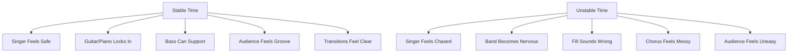
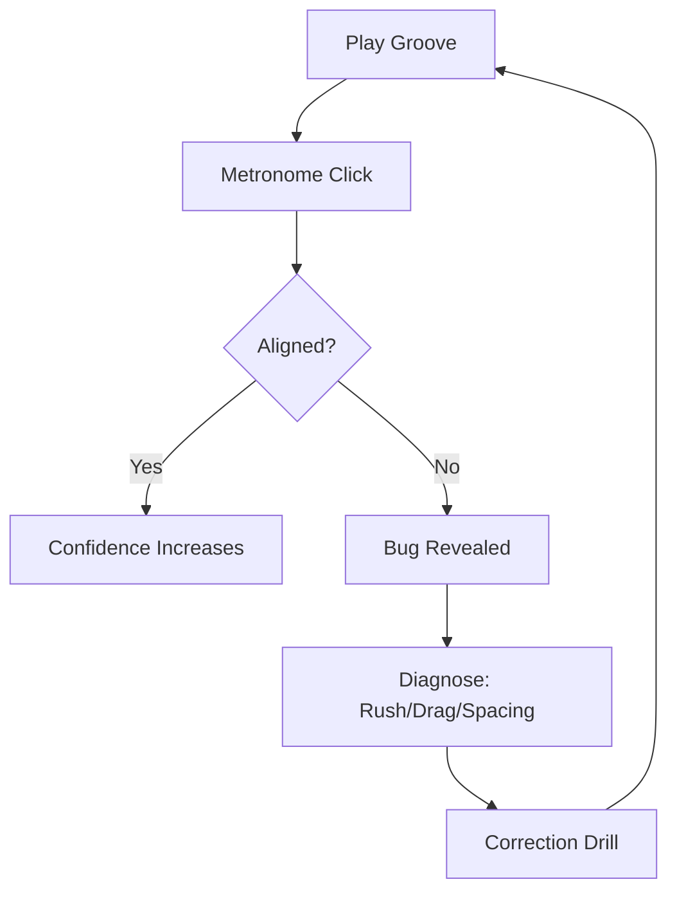
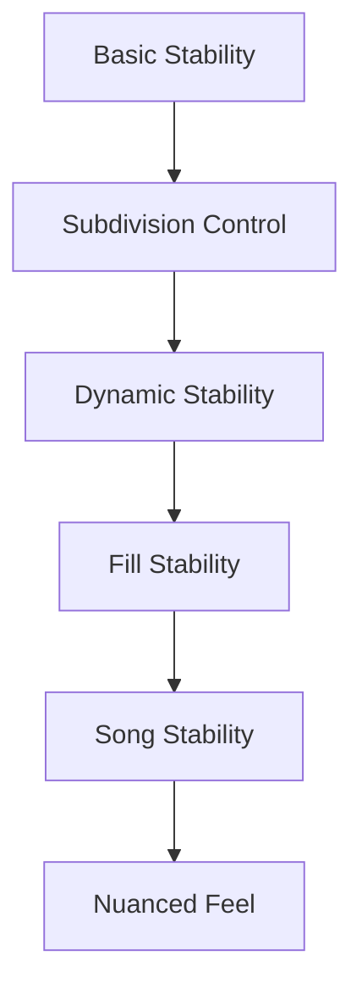
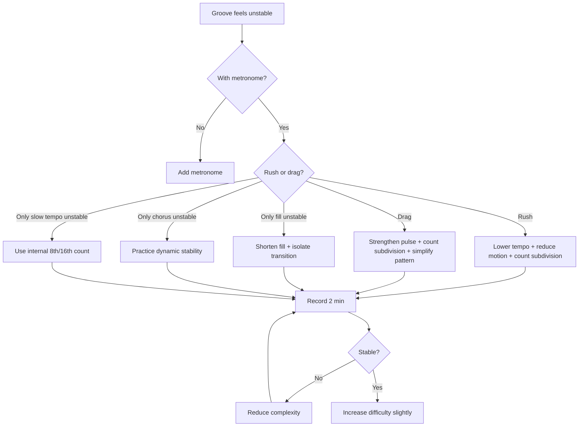

# learn-drum-cajon-part-007.md

# Part 007 — Metronome, Internal Clock, dan Time Stability

## Status Seri

- Seri: `learn-drum-cajon`
- Part: `007`
- Topik: Metronome, internal clock, dan stabilitas tempo
- Target akhir seri: mampu mengiringi penyanyi dengan drum dan/atau cajon secara stabil, musikal, dan sadar konteks
- Status: seri belum selesai
- Part sebelumnya: `learn-drum-cajon-part-006.md`
- Part berikutnya: `learn-drum-cajon-part-008.md`

---

## Tujuan Part Ini

Part ini adalah salah satu part paling penting dalam seluruh seri. Untuk mengiringi penyanyi, pemain drum/cajon yang sederhana tetapi stabil jauh lebih berharga daripada pemain yang banyak pattern tetapi waktunya goyah.

Setelah menyelesaikan part ini, kamu harus mampu:

1. memahami fungsi metronome sebagai cermin, bukan musuh musikalitas,
2. membedakan external clock dan internal clock,
3. mendeteksi rushing dan dragging,
4. melatih groove dengan click di berbagai mode,
5. menjaga tempo saat fill,
6. menjaga tempo saat dinamika berubah,
7. menjaga tempo saat lagu lambat,
8. memakai rekaman untuk mengevaluasi time,
9. membuat practice protocol untuk stabilitas tempo,
10. memahami bahwa time stability adalah bentuk kepercayaan musikal.

---

# 1. Kenapa Time Stability Adalah Skill Inti?

Dalam accompaniment, drummer/cajon player adalah salah satu sumber rasa aman bagi penyanyi dan pemain lain. Jika time kamu stabil, semua orang bisa bernapas di atas lagu. Jika time kamu goyah, semua orang merasa harus “menebak” di mana ketukan berikutnya.



Drummer/cajon yang baik bukan sekadar orang yang bisa memainkan pattern. Ia adalah orang yang membuat lagu terasa bisa dipercaya.

---

# 2. External Clock vs Internal Clock

## 2.1 External Clock

External clock adalah sumber waktu dari luar tubuh:

- metronome,
- click track,
- drummer lain,
- backing track,
- sequencer,
- loop,
- audience clap,
- conductor/worship leader.

Metronome adalah external clock paling sederhana.

## 2.2 Internal Clock

Internal clock adalah kemampuan tubuh dan telinga untuk menjaga waktu tanpa harus terus bergantung pada external click.

Internal clock terlihat ketika kamu bisa:

- tetap stabil saat metronome dimatikan sebentar,
- diam 1 bar lalu masuk lagi tepat,
- fill tanpa mempercepat,
- main verse pelan tanpa dragging,
- masuk chorus lebih besar tanpa rushing,
- mengikuti penyanyi tetapi tidak ikut kehilangan pulse.


Tujuan latihan metronome bukan membuat kamu kaku. Tujuannya membuat internal clock kamu makin jelas.

---

# 3. Metronome sebagai Cermin

Banyak pemula merasa metronome “mengganggu feel”. Biasanya bukan karena metronome buruk, tetapi karena metronome menunjukkan kesalahan yang selama ini tidak terdengar.

Metronome tidak membuat kamu musikal secara otomatis. Tetapi metronome menunjukkan:

- apakah beat kamu maju,
- apakah beat kamu terlambat,
- apakah fill kamu mempercepat,
- apakah chorus kamu naik tempo,
- apakah tempo lambat membuat kamu tidak sabar,
- apakah subdivision kamu rata.

Metronome adalah seperti test suite:



Metronome tidak menggantikan musikalitas. Ia membantu debugging.

---

# 4. Rushing dan Dragging

## 4.1 Rushing

Rushing berarti kamu cenderung lebih cepat dari pulse.

Gejala:

- kamu mendahului click,
- fill terasa “menabrak” chorus,
- penyanyi terasa dikejar,
- chorus tiba-tiba lebih cepat dari verse,
- groove makin lama makin sempit,
- kamu merasa ada dorongan panik.

Penyebab umum:

| Penyebab | Contoh |
|---|---|
| Nervous | tampil live, takut salah |
| Fill terlalu sulit | tangan mengejar pattern |
| Dinamika naik | main lebih keras lalu tempo naik |
| Tempo lambat | tidak sabar menunggu beat berikutnya |
| Tension | bahu/pergelangan kaku |
| Tidak menghitung subdivision | ruang antar beat tidak terukur |

## 4.2 Dragging

Dragging berarti kamu cenderung terlambat atau melambat.

Gejala:

- click terasa mendahului kamu,
- groove terasa berat,
- chorus kehilangan lift,
- penyanyi seperti menunggu kamu,
- kick atau bass cajon terasa jatuh terlambat,
- tempo menurun saat volume kecil.

Penyebab umum:

| Penyebab | Contoh |
|---|---|
| Fatigue | tangan/kaki mulai berat |
| Groove terlalu sulit | otak overload |
| Dinamika terlalu pelan | pulse ikut melemah |
| Tidak ada subdivision | jarak antar beat membesar |
| Kick/bass lemah | fondasi tidak jelas |
| Terlalu fokus teknik | lupa mendengar lagu |

---

# 5. Time Stability Bukan Berarti Kaku

Time yang stabil bukan berarti semua note harus terasa seperti mesin. Dalam musik, ada nuance, feel, microtiming, dan human placement.

Tetapi untuk 20 jam pertama, prioritasnya:

> stabil dulu, nuance nanti.

Tanpa stabilitas, “feel” sering hanya nama lain untuk timing yang tidak terkendali.

Urutan belajar:



Jangan melompat ke nuanced feel ketika basic stability belum ada.

---

# 6. Click Placement: Cara Melatih Metronome

## 6.1 Click di Setiap Beat

Ini mode awal.

```text
Click : 1   2   3   4
Count : 1   2   3   4
```

Gunakan untuk:

- mengenali tempo,
- melatih pattern baru,
- memperbaiki rushing/dragging besar,
- membangun rasa aman.

## 6.2 Click di 2 dan 4

Ini sangat berguna untuk feel pop/rock.

Jika metronome berbunyi hanya di 2 dan 4:

```text
Count : 1   2   3   4
Click :     C       C
```

Kamu harus merasakan beat 1 dan 3 sendiri.

Manfaat:

- memperkuat backbeat,
- melatih internal clock,
- membuat groove tidak terlalu bergantung pada click setiap beat.

## 6.3 Click Hanya di Beat 1

```text
Count : 1   2   3   4
Click : C
```

Ini lebih sulit. Kamu harus menjaga beat 2, 3, dan 4 sendiri.

Manfaat:

- melatih bar-level stability,
- mendeteksi apakah kamu makin cepat/lambat dalam satu bar.

## 6.4 Click Setiap 2 Bar

Mode lebih advanced untuk 20 jam pertama, tetapi berguna jika sudah stabil.

```text
Bar 1: click di beat 1
Bar 2: no click
Bar 3: click di beat 1
Bar 4: no click
```

Tujuan:

- internal clock tetap berjalan saat tidak ada referensi.

---

# 7. Metronome Ladder

Latihan tempo harus bertahap. Jangan langsung ke tempo lagu asli jika belum stabil.

## 7.1 Ladder Dasar

Gunakan ladder:

```text
60 BPM → 65 BPM → 70 BPM → 75 BPM → 80 BPM
```

Aturan naik:

- hanya naik jika bisa 2 menit stabil,
- tanpa fill,
- tanpa tension,
- tanpa kehilangan counting.

## 7.2 Ladder Turun

Kadang kamu harus turun tempo, bukan naik.

```text
80 BPM → 70 BPM → 60 BPM → 55 BPM
```

Tempo lambat menguji internal clock.

Jika kamu hanya bisa main cepat tetapi goyah di lambat, berarti kamu belum benar-benar stabil.

---

# 8. Latihan Metronome untuk Drum Kit

## 8.1 Drill 1 — Kick/Snare dengan Click Every Beat

Tempo: 70 BPM  
Durasi: 5 menit

```text
Click : C   C   C   C
Count : 1   2   3   4
Kick  : X       X
Snare :     X       X
```

Fokus:

- kick tepat di 1 dan 3,
- snare tepat di 2 dan 4,
- jangan mendahului click.

Acceptance:

- 2 menit tanpa tempo terasa bergeser.

---

## 8.2 Drill 2 — Tambah Hi-hat 8th

Tempo: 70 BPM  
Durasi: 5 menit

```text
Count : 1 & 2 & 3 & 4 &
Hat   : x x x x x x x x
Kick  : X       X
Snare :     X       X
```

Fokus:

- hi-hat tidak membuat tempo naik,
- kick/snare tetap solid,
- hi-hat lebih pelan dari snare.

---

## 8.3 Drill 3 — Click di 2 dan 4

Atur metronome agar click terasa di 2 dan 4. Cara sederhana: set tempo setengah dari target dan anggap click sebagai 2 dan 4.

Contoh target groove 80 BPM. Set metronome 40 BPM, lalu anggap:

```text
Count : 1   2   3   4
Click :     C       C
```

Fokus:

- beat 1 harus kamu rasakan sendiri,
- jangan menunggu click,
- snare harus menyatu dengan click.

---

## 8.4 Drill 4 — Fill Stability 1 Beat

Tempo: 70 BPM  
Durasi: 10 menit

```text
Bar 1: groove
Bar 2: groove
Bar 3: groove
Bar 4: groove sampai beat 3, fill di beat 4
Bar 5: kembali groove
```

Fill sederhana:

```text
Count : 1 & 2 & 3 & 4 &
Fill  :             S S
```

Atau:

```text
Count : 1 & 2 & 3 & 4 &
Fill  :             S T
```

Acceptance:

- beat 1 bar berikutnya tepat,
- tempo tidak naik,
- fill tidak membuat tubuh tegang.

---

# 9. Latihan Metronome untuk Cajon

## 9.1 Drill 1 — Bass/Slap dengan Click Every Beat

Tempo: 70 BPM  
Durasi: 5 menit

```text
Click : C   C   C   C
Count : 1   2   3   4
Bass  : B       B
Slap  :     S       S
```

Fokus:

- bass tidak mendahului beat,
- slap tepat di 2 dan 4,
- bass dan slap terpisah jelas.

---

## 9.2 Drill 2 — Tambah Touch 8th

Tempo: 70 BPM  
Durasi: 5 menit

```text
Count : 1 & 2 & 3 & 4 &
Touch : t t t t t t t t
Bass  : B       B
Slap  :     S       S
```

Fokus:

- touch ringan,
- tidak membuat tempo rush,
- tidak semua note sama keras.

---

## 9.3 Drill 3 — Click di 2 dan 4

Target 80 BPM, metronome 40 BPM.

```text
Count : 1   2   3   4
Click :     C       C
Bass  : B       B
Slap  :     S       S
```

Fokus:

- slap menyatu dengan click,
- bass 1 dan 3 tidak goyah,
- tubuh tetap merasakan semua beat.

---

## 9.4 Drill 4 — Silence Stability

Tempo: 70 BPM  
Durasi: 10 menit

```text
Bar 1: groove
Bar 2: groove
Bar 3: diam, tetap hitung
Bar 4: masuk lagi
```

Acceptance:

- masuk lagi tepat di beat 1,
- tidak mempercepat setelah diam,
- tidak panik saat kosong.

---

# 10. Dynamic Stability

Tempo sering berubah saat dinamika berubah.

Pemula biasanya:

- makin cepat saat main keras,
- makin lambat saat main pelan,
- rush saat chorus,
- drag saat bridge drop.

## 10.1 Drill — Same Tempo, Five Volumes

Pilih groove dasar.

Main 4 bar per level:

```text
Level 1: sangat pelan
Level 2: pelan
Level 3: sedang
Level 4: besar
Level 5: sangat besar
```

Metronome tetap.

Fokus:

- tempo tidak berubah,
- tubuh tidak tegang saat level 4/5,
- pulse tidak hilang saat level 1.

## 10.2 Verse/Chorus Stability

```text
Bar 1-4: verse soft
Bar 5-8: chorus bigger
Bar 9-12: verse soft
Bar 13-16: chorus bigger
```

Acceptance:

- chorus tidak mempercepat,
- verse setelah chorus tidak melambat ekstrem,
- dynamic berubah tetapi tempo tetap.

---

# 11. Slow Tempo Stability

Tempo lambat adalah ujian internal clock.

## 11.1 Kenapa Lambat Sulit?

Pada tempo lambat, ruang antar beat besar.

```text
60 BPM:
1           2           3           4
```

Jika kamu tidak mengisi ruang itu dengan subdivision internal, kamu akan:

- menunggu terlalu lama,
- masuk terlalu cepat,
- tidak yakin beat berikutnya,
- fill terburu-buru.

## 11.2 Internal 8th dan 16th

Saat main di 60 BPM, jangan hanya merasa:

```text
1   2   3   4
```

Rasakan:

```text
1 & 2 & 3 & 4 &
```

atau:

```text
1 e & a 2 e & a 3 e & a 4 e & a
```

Kamu tidak harus memainkan semua. Cukup rasakan.

## 11.3 Slow Groove Drill

Tempo: 55–60 BPM  
Durasi: 10 menit

Drum:

```text
Count : 1 & 2 & 3 & 4 &
Hat   : x x x x x x x x
Kick  : X       X
Snare :     X       X
```

Cajon:

```text
Count : 1 & 2 & 3 & 4 &
Touch : t t t t t t t t
Bass  : B       B
Slap  :     S       S
```

Fokus:

- jangan terburu-buru menuju snare/slap,
- biarkan ruang antar beat ada,
- napas tetap normal.

---

# 12. Sparse Click Drill

Sparse click adalah latihan internal clock.

## 12.1 Mode 1 — Click Every Beat

```text
C C C C
```

## 12.2 Mode 2 — Click on 2 and 4

```text
- C - C
```

## 12.3 Mode 3 — Click on 1

```text
C - - -
```

## 12.4 Mode 4 — Click Every 2 Bars

```text
Bar 1: C - - -
Bar 2: - - - -
Bar 3: C - - -
```

Jangan langsung mode 4. Gunakan bertahap.

---

# 13. Recording-Based Time Review

Metronome memberi feedback saat latihan. Rekaman memberi feedback setelahnya.

## 13.1 Cara Rekam

Gunakan HP.

Dua opsi:

1. rekam dengan metronome terdengar,
2. rekam tanpa metronome lalu bandingkan feeling.

Untuk debugging awal, biarkan metronome terdengar di rekaman.

## 13.2 Apa yang Didengar?

Dengarkan:

- apakah kick/bass mendahului click?
- apakah snare/slap terlambat?
- apakah fill mempercepat?
- apakah chorus naik tempo?
- apakah verse turun tempo?
- apakah hi-hat/touch tidak rata?
- apakah kamu tegang saat sulit?

## 13.3 Jangan Review Semua Sekaligus

Pilih satu error.

Contoh:

```md
Error utama:
- fill di bar 4 selalu rush

Correction:
- fill dipendekkan menjadi 1 beat
- tempo turun dari 80 ke 65 BPM
- counting keras saat fill
```

---

# 14. Time Debugging Algorithm



---

# 15. Common Timing Failure Scenarios

## 15.1 Fill Rush

Gejala:

- groove stabil,
- fill masuk,
- chorus terasa lebih cepat.

Penyebab:

- tangan panik,
- fill terlalu banyak note,
- tidak menghitung,
- tubuh tegang.

Solusi:

- fill 1 beat,
- gunakan snare/slap saja,
- count `3 & 4 &`,
- kembali beat 1.

## 15.2 Chorus Rush

Gejala:

- verse stabil,
- chorus naik 5–10 BPM tanpa sadar.

Penyebab:

- volume naik = energi naik = tempo ikut naik,
- nervous,
- crash terlalu agresif.

Solusi:

- verse/chorus metronome drill,
- chorus lebih besar tetapi gerak tetap ekonomis,
- napas saat masuk chorus.

## 15.3 Verse Drag

Gejala:

- setelah chorus, verse terasa turun terlalu banyak,
- tempo melemah.

Penyebab:

- dynamic turun terlalu drastis,
- internal pulse ikut turun,
- tangan terlalu lembut sampai kehilangan grid.

Solusi:

- tetap hitung 8th,
- gunakan kick/bass jelas,
- main pelan tetapi pulse kuat.

## 15.4 Slow Ballad Collapse

Gejala:

- tempo lambat terasa tidak pasti,
- fill terlalu cepat,
- penyanyi seperti menggantung.

Penyebab:

- tidak ada internal subdivision.

Solusi:

- count 16th dalam hati,
- pakai touch/hi-hat ringan,
- kurangi fill.

---

# 16. Time and the Singer

Penyanyi tidak selalu tepat di grid. Ini normal.

Tugas drummer/cajon:

- menjaga pulse,
- memberi ruang,
- tidak kaku memaksa vokal,
- tetapi juga tidak ikut kehilangan tempo.

Ada dua ekstrem:

## 16.1 Terlalu Kaku

Kamu tidak mendengar phrasing vokal. Semua dipaksa ke grid.

Akibat:

- lagu terasa mechanical,
- penyanyi tidak nyaman,
- emosi turun.

## 16.2 Terlalu Ikut Vokal

Setiap vokal melambat, kamu ikut melambat. Setiap vokal maju, kamu ikut maju.

Akibat:

- lagu kehilangan fondasi,
- pemain lain bingung,
- groove collapse.

Target:


---

# 17. Practicing with Songs

Metronome penting, tetapi kamu juga harus latihan dengan lagu.

## 17.1 Cara Latihan dengan Lagu

1. Pilih lagu sederhana.
2. Dengarkan tanpa bermain.
3. Tepuk pulse.
4. Tepuk backbeat.
5. Main groove paling sederhana.
6. Rekam.
7. Cek apakah kamu mengikuti tempo lagu atau melawan.

## 17.2 Jangan Langsung Meniru Drum Asli

Untuk awal, jangan harus meniru drum asli 100%.

Lebih baik:

- main skeleton,
- jaga tempo,
- ikuti section,
- jaga vokal.

Jika drum asli kompleks, sederhanakan.

---

# 18. Practice Protocol 30 Menit

## Sesi Time Stability

| Durasi | Latihan |
|---:|---|
| 5 menit | pulse clap dengan metronome |
| 5 menit | backbeat 2 dan 4 |
| 5 menit | groove basic click every beat |
| 5 menit | groove click 2 dan 4 |
| 5 menit | verse/chorus dynamic stability |
| 5 menit | rekam dan review |

## Sesi Fill Stability

| Durasi | Latihan |
|---:|---|
| 5 menit | basic groove |
| 5 menit | 1-beat fill |
| 5 menit | 1-bar fill sederhana |
| 5 menit | fill masuk chorus |
| 5 menit | slow tempo fill |
| 5 menit | rekam dan review |

## Sesi Slow Tempo

| Durasi | Latihan |
|---:|---|
| 5 menit | count 16th at 60 BPM |
| 5 menit | groove 60 BPM |
| 5 menit | groove 55 BPM |
| 5 menit | silence 1 bar |
| 5 menit | song ballad |
| 5 menit | review |

---

# 19. Self-Scoring Rubric

Nilai 1–5.

| Area | 1 | 3 | 5 |
|---|---|---|---|
| Click every beat | sering miss | cukup stabil | stabil 3 menit |
| Click 2 dan 4 | bingung | bisa 1 menit | stabil 3 menit |
| Slow tempo | collapse | cukup bisa | nyaman |
| Fill stability | selalu rush | kadang stabil | stabil |
| Dynamic stability | tempo berubah | sedikit berubah | tetap stabil |
| Silence entry | salah masuk | kadang tepat | tepat |
| Recording review | tidak tahu error | tahu sebagian | bisa diagnosis |

Target:

- minimal 3 di semua area,
- minimal 4 pada click every beat,
- minimal 4 pada basic groove stability.

---

# 20. Acceptance Criteria Part Ini

Kamu boleh lanjut ke Part 008 jika:

1. bisa memainkan groove dasar drum/cajon 2 menit dengan metronome setiap beat,
2. bisa tepuk atau memainkan backbeat dengan click di 2 dan 4,
3. bisa memainkan groove di 60 BPM tanpa rushing besar,
4. bisa memainkan verse soft dan chorus louder tanpa tempo berubah ekstrem,
5. bisa melakukan fill 1 beat lalu kembali ke beat 1,
6. bisa diam 1 bar lalu masuk lagi,
7. bisa menjelaskan apakah kamu lebih sering rushing atau dragging,
8. punya minimal satu rekaman untuk review time.

---

# 21. Ringkasan

Metronome bukan musuh feel. Metronome adalah alat debugging.

Time stability berarti:

- groove tidak rush,
- groove tidak drag,
- fill tidak merusak tempo,
- chorus tidak otomatis mempercepat,
- verse tidak otomatis melemah,
- slow tempo tetap punya subdivision internal,
- penyanyi merasa aman.

Prinsip utama:

> Pattern sederhana + time stabil lebih berguna daripada pattern kompleks + time goyah.

---

# 22. Latihan untuk Part Berikutnya

Sebelum lanjut ke Part 008, lakukan:

1. Groove basic 4/4 dengan metronome 70 BPM selama 3 menit.
2. Click 2 dan 4 selama 2 menit.
3. Slow groove 60 BPM selama 2 menit.
4. Verse/chorus dynamic drill 4 kali.
5. Fill 1 beat setiap 4 bar.
6. Rekam dan catat:
   - rushing?
   - dragging?
   - fill problem?
   - dynamic problem?

Part berikutnya membahas:

> independence minimum untuk drum kit: koordinasi tangan kanan, tangan kiri, kaki kanan, dan kaki kiri secukupnya untuk accompaniment, tanpa masuk ke independence ekstrem yang belum relevan.
