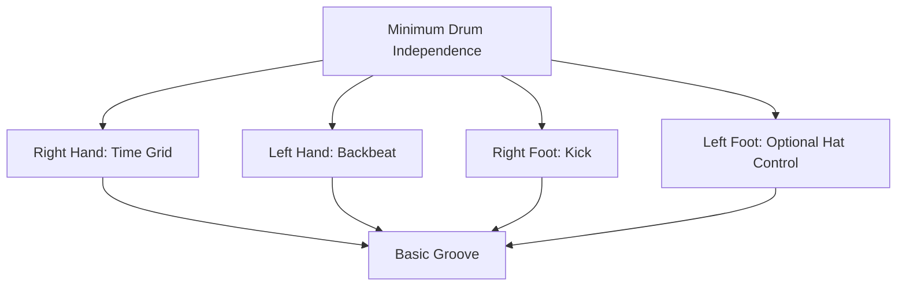
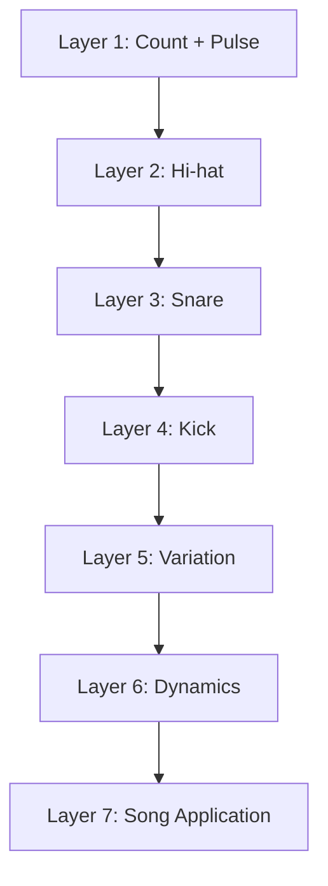
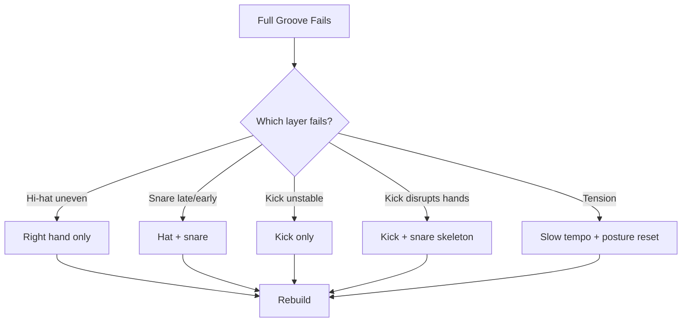
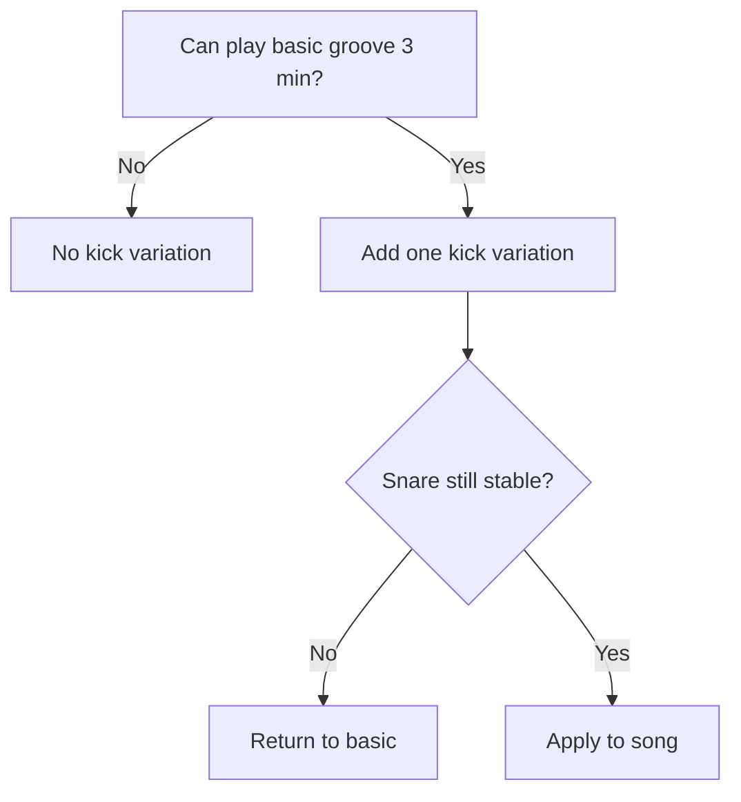
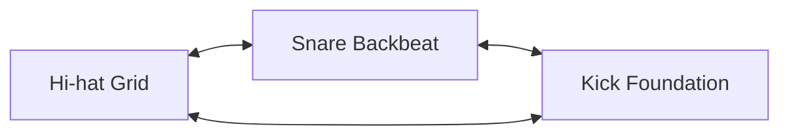

# learn-drum-cajon-part-008.md

# Part 008 — Independence Minimum untuk Drum Kit

## Status Seri

- Seri: `learn-drum-cajon`
- Part: `008`
- Topik: Independence minimum untuk drum kit
- Target akhir seri: mampu mengiringi penyanyi dengan drum dan/atau cajon secara stabil, musikal, dan sadar konteks
- Status: seri belum selesai
- Part sebelumnya: `learn-drum-cajon-part-007.md`
- Part berikutnya: `learn-drum-cajon-part-009.md`

---

## Tujuan Part Ini

Part ini membahas koordinasi minimum untuk memainkan drum kit secara fungsional. Kita tidak sedang mengejar independence tingkat lanjut seperti jazz coordination, linear drumming kompleks, atau polyrhythm. Targetnya lebih praktis:

> bisa memainkan groove drum kit dasar yang stabil untuk mengiringi penyanyi.

Setelah menyelesaikan part ini, kamu harus mampu:

1. memahami peran tiap limb dalam drum kit,
2. membangun groove dengan layering,
3. memainkan hi-hat sebagai grid,
4. memainkan snare di 2 dan 4,
5. memainkan kick di 1 dan 3,
6. menambah variasi kick sederhana,
7. menjaga kaki kiri/hi-hat foot secara minimal,
8. menghindari overload koordinasi,
9. melakukan debugging saat limb tertentu mengganggu tempo,
10. memainkan beberapa groove 4/4 dasar secara stabil.

---

# 1. Apa Itu Independence?

Independence dalam drum berarti kemampuan anggota tubuh memainkan peran berbeda secara bersamaan.

Drum kit biasanya melibatkan:

| Limb | Peran Umum |
|---|---|
| Tangan kanan | hi-hat/ride/subdivision |
| Tangan kiri | snare/backbeat |
| Kaki kanan | kick/fondasi |
| Kaki kiri | hi-hat pedal/time/texture |

Namun untuk 20 jam pertama, independence bukan berarti semua limb harus bebas total. Independence minimum berarti:

> setiap limb bisa menjalankan fungsi sederhana tanpa membuat limb lain collapse.



---

# 2. Jangan Mengejar Independence Ekstrem Terlalu Cepat

Independence ekstrem menarik, tetapi belum prioritas.

Contoh yang ditunda:

- tangan kanan ride jazz pattern,
- kaki kiri chick di offbeat kompleks,
- snare comping bebas,
- kick syncopation kompleks,
- polyrhythm,
- linear 16th note advanced.

Mengapa ditunda?

Karena untuk mengiringi penyanyi, kebutuhan awal adalah:

- groove stabil,
- backbeat jelas,
- kick sederhana,
- hi-hat rata,
- dynamics peka,
- fill aman.

Jika mengejar independence ekstrem terlalu cepat, risiko:

- timing rusak,
- tubuh tegang,
- frustrasi,
- tidak bisa main lagu penuh,
- terlalu banyak latihan teknik yang belum usable.

---

# 3. Mental Model: Layering

Cara terbaik membangun coordination adalah layering: mulai dari satu layer, lalu tambah satu per satu.



Jangan langsung memainkan full groove jika layer bawah belum stabil.

Rule:

> Jika groove penuh rusak, jangan ulang groove penuh terus. Turun ke layer yang rusak.

---

# 4. Peran Tangan Kanan: Hi-hat sebagai Grid

Untuk pemula drum kit, tangan kanan sering memainkan hi-hat 8th note.

```text
Count : 1 & 2 & 3 & 4 &
R.H.  : x x x x x x x x
```

Fungsi:

- menjaga subdivision,
- memberi time texture,
- membantu tubuh tetap di grid.

Kesalahan umum:

- tangan kanan terlalu keras,
- bahu kanan naik,
- hi-hat tidak rata,
- tangan kanan berhenti saat snare masuk,
- hi-hat mempercepat tempo.

## Drill 1 — Right Hand Only

Tempo: 70 BPM  
Durasi: 3 menit

```text
Count : 1 & 2 & 3 & 4 &
R.H.  : x x x x x x x x
```

Fokus:

- kecil,
- rata,
- pelan,
- bahu turun,
- counting keras.

Acceptance:

- 2 menit stabil tanpa tension.

---

# 5. Peran Tangan Kiri: Snare sebagai Backbeat

Tangan kiri biasanya memainkan snare di 2 dan 4.

```text
Count : 1 & 2 & 3 & 4 &
L.H.  :     S       S
```

Snare di 2 dan 4 adalah anchor besar dalam pop/rock.

## Drill 2 — Left Hand Backbeat Only

Tempo: 70 BPM  
Durasi: 3 menit

```text
Count : 1   2   3   4
L.H.  :     S       S
```

Fokus:

- jangan berubah menjadi 1 dan 3,
- suara konsisten,
- stroke tidak terlalu besar.

---

# 6. Tangan Kanan + Tangan Kiri

Sekarang gabungkan hi-hat dan snare.

```text
Count : 1 & 2 & 3 & 4 &
R.H.  : x x x x x x x x
L.H.  :     S       S
```

Ini tampak sederhana, tetapi banyak pemula mengalami:

- hi-hat berhenti saat snare,
- hi-hat menjadi lebih keras saat snare,
- snare telat,
- tangan silang tegang,
- counting hilang.

## Drill 3 — Hat + Snare

Tempo: 60–70 BPM  
Durasi: 5 menit

```text
Count : 1 & 2 & 3 & 4 &
Hat   : x x x x x x x x
Snare :     S       S
```

Fokus:

- hi-hat terus mengalir,
- snare masuk tepat di 2 dan 4,
- hi-hat tidak naik volume saat snare.

Acceptance:

- bisa 2 menit stabil.

---

# 7. Peran Kaki Kanan: Kick sebagai Fondasi

Kaki kanan memainkan kick. Pola awal paling sederhana:

```text
Count : 1   2   3   4
Kick  : K       K
```

Kick di 1 dan 3 memberi struktur.

Kesalahan umum:

- kick mendahului beat,
- kick lemah,
- badan ikut maju,
- kick mengganggu hi-hat,
- kick membuat snare terlambat.

## Drill 4 — Kick Only

Tempo: 70 BPM  
Durasi: 3 menit

```text
Count : 1   2   3   4
Kick  : K       K
```

Fokus:

- badan stabil,
- kaki tidak tegang,
- kick tepat dengan click.

---

# 8. Kick + Snare Skeleton

Sebelum full groove, gabungkan kick dan snare tanpa hi-hat.

```text
Count : 1   2   3   4
Kick  : K       K
Snare :     S       S
```

Ini adalah skeleton groove.

## Drill 5 — Kick + Snare

Tempo: 60–70 BPM  
Durasi: 5 menit

Fokus:

- kick dan snare bergantian stabil,
- jangan rush dari kick ke snare,
- jangan drag dari snare ke kick,
- hitung keras.

Acceptance:

- bisa 2 menit tanpa kehilangan 2 dan 4.

---

# 9. Full Basic Groove

Sekarang gabungkan:

- hi-hat 8th,
- kick 1 dan 3,
- snare 2 dan 4.

```text
Count : 1 & 2 & 3 & 4 &
Hat   : x x x x x x x x
Kick  : K       K
Snare :     S       S
```

## Drill 6 — Full Groove

Tempo: 60 BPM dulu, lalu 70 BPM.  
Durasi: 10 menit.

Tahapan:

1. 1 menit hi-hat saja,
2. tambah snare,
3. tambah kick,
4. main 2 menit,
5. berhenti,
6. ulang.

Acceptance:

- groove tidak collapse,
- hi-hat tetap rata,
- snare tepat,
- kick tidak rush.

---

# 10. Layer Debugging

Jika full groove rusak, jangan asal ulang.

Gunakan algoritma:



Prinsip:

> Debug limb yang rusak, bukan seluruh tubuh sekaligus.

---

# 11. Kick Variations Minimum

Setelah basic groove stabil, variasi pertama biasanya pada kick.

## Variation 1 — Kick di 1 dan 3

```text
Count : 1 & 2 & 3 & 4 &
Hat   : x x x x x x x x
Kick  : K       K
Snare :     S       S
```

## Variation 2 — Kick di 1, 2&, 3

```text
Count : 1 & 2 & 3 & 4 &
Hat   : x x x x x x x x
Kick  : K     K K
Snare :     S       S
```

Dibaca:

- kick di 1,
- kick di `&` setelah 2,
- kick di 3.

## Variation 3 — Kick di 1, 3, 3&

```text
Count : 1 & 2 & 3 & 4 &
Hat   : x x x x x x x x
Kick  : K       K K
Snare :     S       S
```

## Variation 4 — Four-on-the-floor

```text
Count : 1 & 2 & 3 & 4 &
Hat   : x x x x x x x x
Kick  : K   K   K   K
Snare :     S       S
```

Cocok untuk:

- pop anthem,
- worship,
- chorus besar,
- lagu yang butuh driving pulse.

## Variation 5 — Anticipation to Chorus

```text
Count : 1 & 2 & 3 & 4 &
Hat   : x x x x x x x x
Kick  : K       K     K
Snare :     S       S
```

Kick di `4&` bisa memberi dorongan menuju bar berikutnya.

Hati-hati: ini mudah rush.

---

# 12. Jangan Menambah Kick Jika Snare Belum Stabil

Kick variation sering membuat pemula kehilangan snare 2 dan 4.

Rule:



Snare/backbeat adalah anchor. Jangan mengorbankannya untuk kick variation.

---

# 13. Kaki Kiri: Hi-hat Pedal Minimum

Untuk 20 jam pertama, kaki kiri tidak wajib kompleks.

Fungsi kaki kiri:

- menjaga hi-hat closed,
- membuka/menutup hi-hat,
- chick di beat tertentu,
- membantu feel.

Prioritas awal:

1. bisa menjaga hi-hat closed,
2. bisa membuka sedikit untuk accent,
3. optional chick di 2 dan 4,
4. tunda pattern kompleks.

## 13.1 Closed Control

Pastikan kaki kiri cukup menutup hi-hat agar suara tight.

Jangan terlalu menekan sampai kaki tegang.

## 13.2 Simple Open Hat Accent

Contoh open di `&` setelah 4 menuju chorus:

```text
Count : 1 & 2 & 3 & 4 &
Hat   : x x x x x x x O
Kick  : K       K
Snare :     S       S
```

O = open accent.

Rule:

> Open hi-hat harus kembali closed tepat waktu.

## 13.3 Foot Chick Optional

Kaki kiri bisa chick di 2 dan 4 jika tidak mengganggu.

```text
Count : 1   2   3   4
LFoot :     x       x
```

Tetapi jika membuat koordinasi rusak, tunda.

---

# 14. Independence vs Interdependence

Dalam musik nyata, limb bukan benar-benar independen. Mereka saling membentuk groove.

Lebih akurat:

> Drum kit adalah sistem interdependent limbs.

Kick, snare, dan hi-hat harus saling mengunci.



Jika satu limb terlalu dominan, groove tidak seimbang.

Contoh:

- hi-hat terlalu keras membuat groove tajam,
- kick rush membuat snare terasa terlambat,
- snare terlalu keras membuat verse terlalu besar.

---

# 15. Coordination Failure Patterns

## 15.1 Hi-hat Stops on Snare

Gejala:

```text
Hat   : x x - x x x - x
Snare :     S       S
```

Penyebab:

- tangan kiri mengambil perhatian,
- tangan kanan belum otomatis,
- tempo terlalu cepat.

Correction:

- right hand only,
- hat + snare very slow,
- count out loud.

## 15.2 Kick Pulls Hi-hat

Gejala:

- hi-hat accent tidak sengaja saat kick,
- tempo naik setiap kick.

Penyebab:

- kaki kanan belum independen,
- tubuh menegang saat kick.

Correction:

- kick only,
- hat + kick,
- kecilkan gerak kaki.

## 15.3 Snare Late After Kick

Gejala:

- kick di 1 bagus,
- snare di 2 telat.

Penyebab:

- otak terlalu fokus kaki,
- tidak merasakan beat 2.

Correction:

- kick + snare skeleton,
- clap 2 dan 4,
- tempo turun.

## 15.4 Fill Destroys Groove

Gejala:

- groove stabil,
- fill masuk,
- beat 1 hilang.

Penyebab:

- fill terlalu sulit,
- tangan pindah tom terlalu jauh,
- tidak menghitung.

Correction:

- fill hanya snare,
- fill 1 beat,
- return-to-groove drill.

---

# 16. Coordination Drills Bertahap

## Drill A — Four Independent Layers as Separate Tests

Tempo: 60 BPM.

| Tahap | Pattern |
|---|---|
| 1 | hi-hat only |
| 2 | snare only |
| 3 | kick only |
| 4 | kick + snare |
| 5 | hi-hat + snare |
| 6 | hi-hat + kick |
| 7 | hi-hat + kick + snare |

Jangan lanjut tahap jika tahap sebelumnya belum stabil.

---

## Drill B — Hi-hat + Kick

```text
Count : 1 & 2 & 3 & 4 &
Hat   : x x x x x x x x
Kick  : K       K
```

Tujuan:

- kaki kanan tidak mengganggu tangan kanan.

---

## Drill C — Hi-hat + Snare

```text
Count : 1 & 2 & 3 & 4 &
Hat   : x x x x x x x x
Snare :     S       S
```

Tujuan:

- tangan kiri masuk tanpa mematikan grid tangan kanan.

---

## Drill D — Kick + Snare

```text
Count : 1   2   3   4
Kick  : K       K
Snare :     S       S
```

Tujuan:

- skeleton stabil tanpa distraction hi-hat.

---

## Drill E — Full Groove

```text
Count : 1 & 2 & 3 & 4 &
Hat   : x x x x x x x x
Kick  : K       K
Snare :     S       S
```

Tujuan:

- semua layer berjalan.

---

# 17. Groove Library Minimum Drum Kit

## Groove 1 — Basic Pop

```text
Count : 1 & 2 & 3 & 4 &
Hat   : x x x x x x x x
Kick  : K       K
Snare :     S       S
```

Use case:

- pop,
- acoustic band,
- latihan dasar,
- verse/chorus sederhana.

## Groove 2 — Pop Variation

```text
Count : 1 & 2 & 3 & 4 &
Hat   : x x x x x x x x
Kick  : K     K K
Snare :     S       S
```

Use case:

- chorus,
- lagu dengan sedikit dorongan,
- pop medium.

## Groove 3 — Four-on-the-floor

```text
Count : 1 & 2 & 3 & 4 &
Hat   : x x x x x x x x
Kick  : K   K   K   K
Snare :     S       S
```

Use case:

- anthem,
- worship chorus,
- pop driving.

## Groove 4 — Half-time Feel

```text
Count : 1 & 2 & 3 & 4 &
Hat   : x x x x x x x x
Kick  : K       K
Snare :         S
```

Snare di beat 3.

Use case:

- bridge besar,
- dramatic chorus,
- slow powerful section.

## Groove 5 — Sparse Verse

```text
Count : 1 & 2 & 3 & 4 &
Hat   : x   x   x   x
Kick  : K       K
Snare :     s       s
```

Use case:

- verse lembut,
- singer-focused section.

---

# 18. Dynamic Independence

Independence bukan hanya “bisa memainkan limb berbeda”. Independence juga berarti bisa mengatur volume limb berbeda.

Contoh balance:

```text
Hi-hat: level 2
Kick  : level 3
Snare : level 3
```

Pemula sering:

```text
Hi-hat: level 4
Kick  : level 2
Snare : level 5
```

Akibat:

- vokal tertutup,
- groove kasar,
- balance buruk.

## Drill — Limb Volume Balance

Main basic groove.

Set target:

| Limb | Level |
|---|---:|
| Hi-hat | 1 |
| Kick | 3 |
| Snare | 3 |

Lalu:

| Limb | Level |
|---|---:|
| Hi-hat | 2 |
| Kick | 2 |
| Snare | 2 |

Lalu:

| Limb | Level |
|---|---:|
| Hi-hat | 3 |
| Kick | 4 |
| Snare | 4 |

Tujuan:

- bisa mengontrol volume per limb,
- bukan semua ikut naik turun sembarangan.

---

# 19. Applying Independence to Songs

Untuk lagu sederhana, jangan mulai dengan pattern final. Buat drum plan.

```md
# Drum Groove Plan

Song:
Tempo:
Meter:

Verse:
- hi-hat: closed, 8th, level 1-2
- kick: 1 and 3
- snare: 2 and 4, level 2

Chorus:
- hi-hat: stronger or slightly open
- kick: variation 1
- snare: level 3
- crash: beat 1 only

Bridge:
- drop / half-time / build

Ending:
- agreed cue
```

Independence dipakai untuk mendukung form, bukan sekadar latihan koordinasi.

---

# 20. Common Mistakes

## 20.1 Menambah Kick Terlalu Cepat

Gejala:

- snare jadi telat,
- hi-hat tidak rata,
- groove collapse.

Solusi:

- kembali ke kick 1/3,
- main 3 menit stabil,
- tambah satu variasi saja.

## 20.2 Hi-hat Terlalu Dominan

Gejala:

- suara tajam,
- tangan kanan tegang,
- vokal tertutup.

Solusi:

- hi-hat level 1–2,
- latih soft 8th,
- rekam.

## 20.3 Snare Tidak Konsisten

Gejala:

- backbeat lemah,
- groove tidak punya anchor.

Solusi:

- snare 2/4 only,
- clap 2/4,
- stroke height control.

## 20.4 Kick Membuat Badan Goyang

Gejala:

- setiap kick tubuh maju,
- tempo ikut berubah.

Solusi:

- cek duduk,
- kick relaxation,
- heel-down/heel-up yang paling stabil.

## 20.5 Counting Hilang

Gejala:

- bisa main pattern tetapi tidak tahu beat,
- fill selalu salah.

Solusi:

- count out loud,
- turunkan tempo,
- main skeleton.

---

# 21. Debugging Guide

| Gejala | Layer Rusak | Correction |
|---|---|---|
| Hi-hat berhenti saat snare | hand coordination | hat + snare slow |
| Kick rush | right foot | kick only + metronome |
| Snare telat | left hand/backbeat | clap 2/4 + skeleton |
| Full groove collapse | overload | layering ulang |
| Fill rusak | transition | 1-beat fill |
| Vokal tertutup | dynamic balance | reduce hi-hat/snare |
| Tempo naik chorus | dynamic instability | verse/chorus drill |
| Kaki kiri mengganggu | too much independence | omit left foot |

---

# 22. Practice Protocol 30 Menit

## Sesi Coordination Foundation

| Durasi | Latihan |
|---:|---|
| 5 menit | hi-hat only |
| 5 menit | snare 2/4 |
| 5 menit | kick 1/3 |
| 5 menit | kick + snare |
| 5 menit | hat + snare |
| 5 menit | full groove |

## Sesi Groove Variation

| Durasi | Latihan |
|---:|---|
| 5 menit | basic groove |
| 5 menit | kick variation 1 |
| 5 menit | kick variation 2 |
| 5 menit | four-on-floor |
| 5 menit | sparse verse |
| 5 menit | record/review |

## Sesi Song Application

| Durasi | Latihan |
|---:|---|
| 5 menit | listen to song |
| 5 menit | clap backbeat |
| 5 menit | basic groove |
| 5 menit | verse dynamic |
| 5 menit | chorus dynamic |
| 5 menit | record/review |

---

# 23. Self-Scoring Rubric

Nilai 1–5:

| Area | 1 | 3 | 5 |
|---|---|---|---|
| Hi-hat grid | tidak rata | cukup stabil | stabil 3 menit |
| Snare 2/4 | sering salah | cukup tepat | natural |
| Kick 1/3 | goyah | cukup stabil | solid |
| Full groove | collapse | bisa 1 menit | bisa 3 menit |
| Kick variation | rusak | bisa pelan | stabil |
| Dynamic balance | semua keras | mulai kontrol | per limb terkendali |
| Song application | bingung | bisa section | musikal |

Target:

- minimal 3 semua area,
- minimal 4 untuk basic groove,
- minimal 4 untuk snare 2/4.

---

# 24. Mini Capstone Part Ini

Rekam 2 menit drum kit atau substitute setup:

Struktur:

```text
0:00–0:30 basic groove soft
0:30–1:00 basic groove medium
1:00–1:30 kick variation
1:30–2:00 verse/chorus contrast
```

Jika tidak punya drum kit:

- tangan kanan di meja/pad = hi-hat,
- tangan kiri di paha = snare,
- kaki kanan di lantai = kick.

Evaluasi:

| Pertanyaan | Ya/Tidak |
|---|---|
| Hi-hat/tangan kanan stabil? | |
| Snare/backbeat tepat? | |
| Kick tidak rush? | |
| Full groove tidak collapse? | |
| Dynamic bisa berubah? | |
| Counting tetap jelas? | |

---

# 25. Acceptance Criteria Part Ini

Kamu boleh lanjut jika:

1. bisa memainkan hi-hat 8th note 2 menit,
2. bisa memainkan snare di 2 dan 4 secara stabil,
3. bisa memainkan kick di 1 dan 3 secara stabil,
4. bisa menggabungkan kick/snare skeleton 2 menit,
5. bisa memainkan full basic groove minimal 2 menit,
6. bisa memainkan minimal 2 variasi kick sederhana,
7. bisa menjaga hi-hat lebih pelan daripada snare,
8. bisa menjelaskan layer mana yang rusak saat groove collapse,
9. bisa menerapkan basic groove ke satu lagu sederhana.

---

# 26. Ringkasan

Independence minimum bukan tentang kebebasan limb yang kompleks. Untuk accompaniment, independence minimum berarti:

- tangan kanan menjaga grid,
- tangan kiri menjaga backbeat,
- kaki kanan memberi fondasi,
- kaki kiri tidak mengganggu,
- semua limb tetap stabil dalam dynamic yang sesuai lagu.

Cara belajar terbaik adalah layering:

1. hi-hat,
2. snare,
3. kick,
4. kick + snare,
5. hi-hat + snare,
6. full groove,
7. kick variation,
8. song application.

Rule paling penting:

> Jangan menambah variasi sebelum groove dasar stabil.

---

# 27. Latihan untuk Part Berikutnya

Sebelum lanjut ke Part 009, lakukan:

1. Basic drum groove 3 menit di 70 BPM.
2. Kick/snare skeleton 3 menit.
3. Hat + snare 2 menit.
4. Coba dua kick variation.
5. Rekam dan diagnosis layer yang paling lemah.
6. Jika punya cajon, bandingkan:
   - drum independence = koordinasi limb,
   - cajon coordination = koordinasi tangan dan sound separation.

Part berikutnya membahas:

> hand coordination minimum untuk cajon: R/L sticking, bass-slap separation, alternating hands, touch/ghost control, dan pattern cajon 4/4 yang usable untuk accompaniment.
