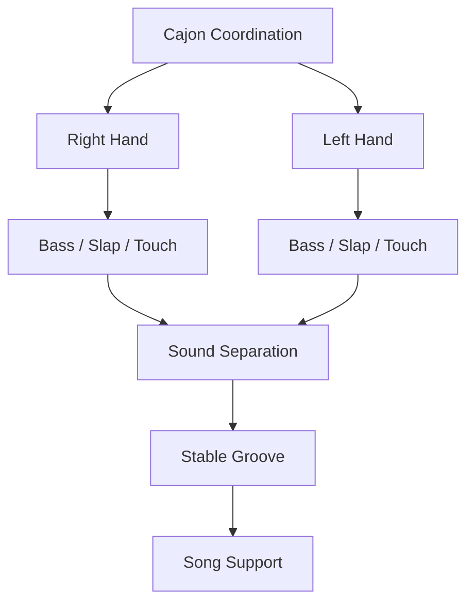
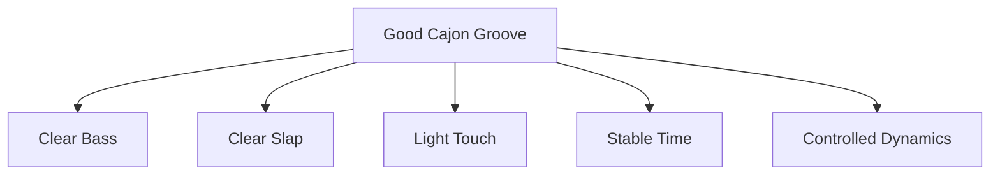
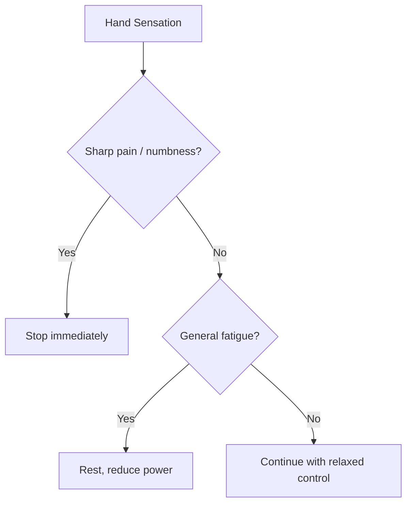
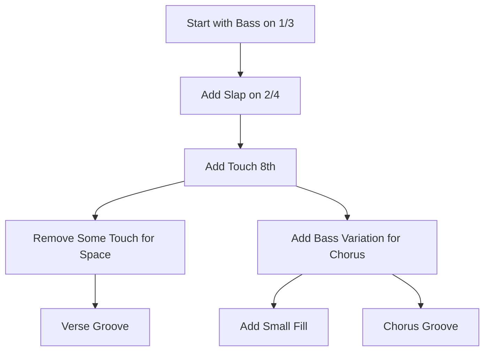
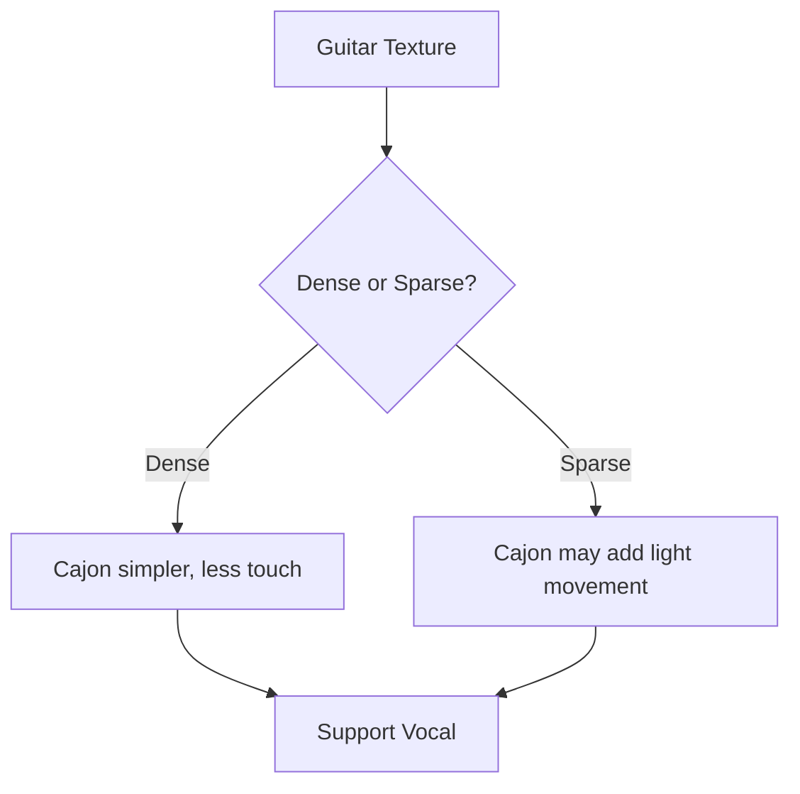

# learn-drum-cajon-part-009.md

# Part 009 — Hand Coordination Minimum untuk Cajon

## Status Seri

- Seri: `learn-drum-cajon`
- Part: `009`
- Topik: Koordinasi tangan minimum untuk cajon
- Target akhir seri: mampu mengiringi penyanyi dengan drum dan/atau cajon secara stabil, musikal, dan sadar konteks
- Status: seri belum selesai
- Part sebelumnya: `learn-drum-cajon-part-008.md`
- Part berikutnya: `learn-drum-cajon-part-010.md`

---

## Tujuan Part Ini

Part ini membahas koordinasi tangan untuk cajon. Setelah memahami suara dasar cajon—bass, slap, touch, ghost note—sekarang kita perlu membuat tangan kanan dan kiri mampu bekerja sebagai sistem rhythm yang stabil.

Targetnya bukan menjadi perkusionis cajon virtuoso. Targetnya adalah:

> mampu memainkan pattern cajon dasar untuk mengiringi penyanyi, dengan bass/slap jelas, touch ringan, tempo stabil, dan dinamika terkendali.

Setelah menyelesaikan part ini, kamu harus mampu:

1. memahami fungsi tangan kanan dan kiri dalam cajon,
2. memainkan bass dan slap secara terpisah,
3. memainkan alternating hand R/L dengan stabil,
4. menjaga bass/slap separation,
5. memainkan touch/ghost note tanpa membuat groove terlalu ramai,
6. membangun pattern cajon 4/4 secara bertahap,
7. memilih sticking yang nyaman,
8. menghindari hand fatigue dan pain,
9. melakukan debugging saat pattern cajon goyah,
10. menerapkan groove cajon sederhana untuk verse dan chorus.

---

# 1. Cajon Coordination Berbeda dari Drum Kit Independence

Pada drum kit, koordinasi melibatkan empat limb:

- tangan kanan,
- tangan kiri,
- kaki kanan,
- kaki kiri.

Pada cajon, koordinasi utama lebih terkonsentrasi di dua tangan. Ini terlihat lebih sederhana, tetapi ada tantangan berbeda:

- tangan yang sama bisa harus menghasilkan beberapa jenis suara,
- bass dan slap butuh titik kontak berbeda,
- touch harus ringan dan rata,
- ghost note harus tidak mengganggu,
- tangan langsung kontak dengan alat sehingga fatigue/pain lebih relevan,
- pattern mudah terdengar monoton jika dinamika buruk.



Drum kit memisahkan suara lewat instrumen berbeda. Cajon memisahkan suara lewat:

- area pukulan,
- bentuk tangan,
- release,
- volume,
- sticking,
- timing.

---

# 2. Prinsip Utama: Sound Separation Sebelum Pattern Complexity

Sebelum mempelajari banyak pattern, pastikan tiga suara utama berbeda:

| Suara | Fungsi | Harus Terdengar |
|---|---|---|
| Bass | kick | bulat, rendah, body |
| Slap | snare | tajam, jelas, backbeat |
| Touch | hi-hat/texture | ringan, kecil, rata |

Jika bass dan slap terdengar mirip, pattern apa pun akan kabur.

Jika touch terlalu keras, groove akan sesak.

Jika ghost note terlalu besar, backbeat hilang.

Rule:

> Cajon groove yang baik dimulai dari hierarki suara, bukan jumlah note.



---

# 3. Hand Assignment: Tangan Mana untuk Bass dan Slap?

Tidak ada satu aturan universal. Namun pemula perlu konsistensi agar tubuh membangun pattern.

Jika tangan kanan dominan, ada beberapa opsi.

---

## 3.1 Opsi A — Dominant Hand untuk Bass

```text
Bass : R
Slap : L
Touch: alternating
```

Contoh basic groove:

```text
Count : 1 & 2 & 3 & 4 &
Hand  : R L L R R L L R
Sound : B t S t B t S t
```

Kelebihan:

- bass kuat dan stabil,
- cocok jika tangan kanan lebih nyaman menghasilkan bass,
- backbeat dilatih oleh tangan kiri.

Risiko:

- slap kiri mungkin lemah,
- butuh latihan agar slap tetap jelas.

---

## 3.2 Opsi B — Dominant Hand untuk Slap

```text
Bass : L
Slap : R
Touch: alternating
```

Contoh:

```text
Count : 1 & 2 & 3 & 4 &
Hand  : L R R L L R R L
Sound : B t S t B t S t
```

Kelebihan:

- backbeat lebih kuat,
- slap lebih jelas,
- cocok jika tangan kanan lebih natural untuk aksen.

Risiko:

- bass kiri bisa lemah,
- groove kehilangan fondasi jika bass tidak dilatih.

---

## 3.3 Opsi C — Alternating Natural

```text
Count : 1 & 2 & 3 & 4 &
Hand  : R L R L R L R L
Sound : B t S t B t S t
```

Kelebihan:

- gerak seimbang,
- tangan tidak cepat lelah,
- cocok untuk flow 8th note.

Risiko:

- tangan kanan harus bisa bass dan slap,
- sound separation lebih sulit,
- titik kontak harus cepat berpindah.

---

## 3.4 Cara Memilih

Pakai decision table:

| Kondisi | Pilihan Awal |
|---|---|
| Bass kanan paling bagus | Opsi A |
| Slap kanan paling bagus | Opsi B |
| Ingin flow seimbang | Opsi C |
| Tangan kiri sangat lemah | dominan kanan untuk suara utama dulu |
| Ingin melatih simetri | alternating R/L |
| Pattern terasa sakit | ubah sticking atau kurangi power |

Rule:

> Pilih sticking yang stabil dan tidak menyakitkan, bukan yang terlihat paling “benar”.

---

# 4. Alternating Hands

Alternating berarti tangan kanan dan kiri bergantian.

```text
R L R L R L R L
```

Dalam counting 8th note:

```text
Count : 1 & 2 & 3 & 4 &
Hand  : R L R L R L R L
```

Alternating membantu:

- menjaga flow,
- mengurangi fatigue,
- membuat touch rata,
- mempersiapkan pattern lebih kompleks,
- menjaga motion economy.

Namun alternating hanya berguna jika suara tetap jelas.

---

## 4.1 Alternating Touch Drill

Durasi: 5 menit  
Tempo: 70 BPM

```text
Count : 1 & 2 & 3 & 4 &
Hand  : R L R L R L R L
Sound : t t t t t t t t
```

Fokus:

- semua touch ringan,
- volume rata,
- tangan tidak tegang,
- bahu turun,
- counting keras.

Acceptance:

- bisa 2 menit stabil tanpa salah R/L besar.

---

## 4.2 Alternating Accent Drill

Sekarang beri accent di angka:

```text
Count : 1 & 2 & 3 & 4 &
Hand  : R L R L R L R L
Sound : T t T t T t T t
```

T = touch accent sedikit lebih kuat  
t = touch kecil

Tujuan:

- tangan bisa membuat hierarki,
- tidak semua note sama.

---

## 4.3 Alternating Offbeat Drill

Accent di `&`:

```text
Count : 1 & 2 & 3 & 4 &
Hand  : R L R L R L R L
Sound : t T t T t T t T
```

Ini berguna untuk feel yang lebih bergerak, tetapi jangan dipakai terlalu awal jika time belum stabil.

---

# 5. Bass-Slap Skeleton

Sebelum touch atau ghost, kuasai skeleton.

```text
Count : 1   2   3   4
Bass  : B       B
Slap  :     S       S
```

Ini equivalent dari:

```text
Kick  : 1 dan 3
Snare : 2 dan 4
```

## 5.1 Drill — Skeleton 2 Menit

Tempo: 60 BPM dulu, lalu 70 BPM.

```text
Count : 1   2   3   4
Bass  : B       B
Slap  :     S       S
```

Fokus:

- bass bulat,
- slap jelas,
- timing stabil,
- tidak perlu touch dulu,
- counting keras.

Acceptance:

- bisa 2 menit tanpa bass/slap menjadi mirip,
- tidak rushing dari bass ke slap,
- tidak dragging dari slap ke bass.

---

# 6. Tambah Touch sebagai Grid

Setelah skeleton stabil, tambahkan touch 8th note.

```text
Count : 1 & 2 & 3 & 4 &
Touch : t t t t t t t t
Bass  : B       B
Slap  :     S       S
```

Masalah umum:

- touch terlalu keras,
- touch membuat tempo naik,
- bass/slap tertutup oleh touch,
- tangan bingung berpindah area,
- suara jadi ramai.

Rule:

> Touch adalah background grid. Bass dan slap tetap foreground.

---

## 6.1 Drill — Skeleton + Touch

Durasi: 5 menit  
Tempo: 60–70 BPM

```text
Count : 1 & 2 & 3 & 4 &
Sound : B t S t B t S t
```

Sticking contoh:

```text
Count : 1 & 2 & 3 & 4 &
Hand  : R L L R R L L R
Sound : B t S t B t S t
```

Atau:

```text
Count : 1 & 2 & 3 & 4 &
Hand  : R L R L R L R L
Sound : B t S t B t S t
```

Acceptance:

- touch tidak lebih keras dari slap,
- bass tetap jelas,
- pattern tidak rush.

---

# 7. Ghost Note Control

Ghost note memberi flow tetapi sering merusak pemula karena dimainkan terlalu keras.

Ghost note harus berada di level 1, sedangkan bass/slap utama level 2–3.

```text
Main notes: B / S = level 3
Ghost: g = level 1
```

## 7.1 Ghost Note Placement

Contoh ghost sederhana di `&` setelah 1 dan 3:

```text
Count : 1 & 2 & 3 & 4 &
Bass  : B       B
Slap  :     S       S
Ghost :   g       g
```

Contoh lebih aktif:

```text
Count : 1 & 2 & 3 & 4 &
Bass  : B       B
Slap  :     S       S
Ghost :   g   g   g   g
```

## 7.2 Ghost Note Drill

Durasi: 5 menit  
Tempo: 60 BPM

Tahap 1:

```text
Count : 1 & 2 & 3 & 4 &
Ghost :   g   g   g   g
```

Tahap 2:

```text
Count : 1 & 2 & 3 & 4 &
Slap  :     S       S
Ghost :   g   g   g   g
```

Tahap 3:

```text
Count : 1 & 2 & 3 & 4 &
Bass  : B       B
Slap  :     S       S
Ghost :   g   g   g   g
```

Acceptance:

- ghost tetap kecil,
- backbeat tetap dominan,
- tidak sakit.

---

# 8. Hand Fatigue dan Pain Management

Karena cajon dimainkan langsung dengan tangan, kamu harus peka terhadap fatigue.

## 8.1 Fatigue Normal

Normal:

- telapak terasa bekerja,
- otot lengan agak lelah,
- hilang setelah istirahat,
- tidak tajam,
- tidak kebas.

## 8.2 Pain Warning

Stop jika:

- jari sakit tajam,
- pergelangan menusuk,
- telapak terasa terbakar parah,
- kebas,
- nyeri sendi,
- sakit bertahan setelah latihan.



Rule:

> Cajon harus dimainkan dengan release dan kontrol, bukan dengan menghukum tangan.

---

# 9. Pattern Cajon Minimum

Berikut pattern yang cukup untuk banyak accompaniment awal.

---

## Pattern 1 — Basic 4/4 Skeleton

```text
Count : 1   2   3   4
Bass  : B       B
Slap  :     S       S
```

Use case:

- latihan dasar,
- verse sangat sederhana,
- lagu lambat,
- saat belum yakin.

---

## Pattern 2 — Basic Pop 8th

```text
Count : 1 & 2 & 3 & 4 &
Sound : B t S t B t S t
```

Use case:

- pop acoustic,
- worship kecil,
- singer + guitar,
- medium tempo.

---

## Pattern 3 — Sparse Verse

```text
Count : 1 & 2 & 3 & 4 &
Sound : B   s t B   s t
```

Ditulis lebih grid:

```text
Count : 1 & 2 & 3 & 4 &
Bass  : B       B
Slap  :     s       s
Touch :       t       t
```

Use case:

- verse lembut,
- lirik penting,
- vokal intimate.

---

## Pattern 4 — Stronger Chorus

```text
Count : 1 & 2 & 3 & 4 &
Sound : B t S t B B S t
```

Grid:

```text
Count : 1 & 2 & 3 & 4 &
Bass  : B       B B
Slap  :     S       S
Touch :   t   t     t
```

Use case:

- chorus,
- bagian yang perlu lift,
- acoustic pop lebih besar.

---

## Pattern 5 — Four-on-the-floor Cajon

```text
Count : 1 & 2 & 3 & 4 &
Bass  : B   B   B   B
Slap  :     S       S
Touch :   t   t   t   t
```

Use case:

- anthem,
- worship chorus,
- pop yang driving.

Hati-hati:

- jangan terlalu berat,
- bisa menutup vokal jika bass terlalu keras.

---

## Pattern 6 — Half-Time Cajon Feel

```text
Count : 1 & 2 & 3 & 4 &
Bass  : B       B
Slap  :         S
Touch : t t t t t t t t
```

Snare/slap terasa di beat 3.

Use case:

- bridge dramatic,
- chorus besar lambat,
- cinematic ballad.

---

## Pattern 7 — Offbeat Movement

```text
Count : 1 & 2 & 3 & 4 &
Bass  : B       B
Slap  :     S       S
Touch :   t   t   t   t
```

Use case:

- acoustic groove yang butuh gerak,
- gitar strumming tidak terlalu padat.

---

## Pattern 8 — Drop Pattern

```text
Count : 1 & 2 & 3 & 4 &
Bass  : B
Slap  :
Touch :       t       t
```

Use case:

- bridge drop,
- verse awal,
- bagian sangat lirikal.

---

# 10. Pattern Construction: Dari Skeleton ke Groove

Jangan hafal pattern secara buta. Pahami cara membangunnya.



Contoh:

## Step 1 — Skeleton

```text
B   S   B   S
```

## Step 2 — Add Touch

```text
B t S t B t S t
```

## Step 3 — Sparse Verse

```text
B   S t B   S t
```

## Step 4 — Chorus Variation

```text
B t S t B B S t
```

## Step 5 — Fill Before Chorus

```text
B t S t B t S S
```

Atau:

```text
B t S t B t B S
```

---

# 11. Coordination Debugging

## 11.1 Jika Bass Lemah

Kemungkinan:

- tangan non-dominan dipakai untuk bass,
- titik kontak salah,
- release buruk,
- terlalu fokus ke touch.

Correction:

- bass only 5 menit,
- bass di beat 1 dan 3,
- kurangi touch,
- coba pindah sticking.

## 11.2 Jika Slap Terlalu Keras

Kemungkinan:

- terlalu ingin backbeat terdengar,
- tangan tegang,
- ruangan kecil,
- tidak ada dynamic control.

Correction:

- slap level 1–2,
- rekam dari jarak pendengar,
- gunakan touch lebih kecil,
- latih verse groove.

## 11.3 Jika Touch Membuat Rush

Kemungkinan:

- tangan kecil terlalu cepat,
- counting hilang,
- bahu tegang.

Correction:

- touch only dengan metronome,
- tempo turun,
- ucapkan `1 & 2 & 3 & 4 &`,
- kurangi touch menjadi offbeat saja.

## 11.4 Jika Pattern Monoton

Kemungkinan:

- verse dan chorus sama,
- tidak ada density control,
- tidak ada dynamic arc.

Correction:

- verse sparse,
- chorus fuller,
- bridge drop,
- ending stop.

---

# 12. Dynamic Coordination

Koordinasi tidak hanya soal tangan kanan-kiri. Koordinasi juga soal volume antar suara.

Target balance umum:

| Sound | Verse | Chorus |
|---|---:|---:|
| Bass | 2 | 3 |
| Slap | 1–2 | 3 |
| Touch | 1 | 2 |
| Ghost | 0–1 | 1 |

Latihan:

```text
4 bar verse level kecil
4 bar chorus level sedang
ulang
```

Jangan mempercepat saat chorus.

---

# 13. Cajon dan Gitar Strumming

Cajon sering dipakai bersama gitar akustik. Kamu harus menghindari tabrakan density.

## 13.1 Jika Gitar Padat

Contoh gitar memainkan 16th strumming terus.

Strategi cajon:

- pattern lebih sederhana,
- touch dikurangi,
- bass/slap jelas,
- jangan ikut semua subdivision.

## 13.2 Jika Gitar Sparse

Contoh gitar fingerpicking atau strum jarang.

Strategi cajon:

- touch boleh memberi movement,
- ghost note halus,
- bass lembut,
- jangan terlalu dominan.



---

# 14. Cajon dan Piano

Piano bisa mengisi banyak ruang. Dengarkan tangan kiri piano.

Jika tangan kiri piano aktif di low register:

- jangan membuat bass cajon terlalu ramai,
- pakai bass di beat penting saja,
- slap tetap ringan.

Jika piano sparse:

- cajon boleh memberi pulse lebih jelas.

Rule:

> Jangan membuat low-end conflict dengan piano/bass.

---

# 15. Fill Cajon Minimum

Fill cajon harus pendek, jelas, dan kembali ke groove.

## Fill 1 — Double Slap di Beat 4

```text
Count : 1 & 2 & 3 & 4 &
Sound : B t S t B t S S
```

## Fill 2 — Bass-Slap Pickup

```text
Count : 1 & 2 & 3 & 4 &
Sound : B t S t B t B S
```

## Fill 3 — Stop Fill

```text
Count : 1 & 2 & 3 & 4 &
Sound : B t S t B   - -
```

Lalu masuk chorus di beat 1.

## Fill 4 — Touch Roll Simple

```text
Count : 1 & 2 & 3 & 4 &
Sound : B t S t B t t S
```

Rule:

> Fill cajon yang baik membuat section berikutnya jelas. Jika membuat tempo rusak, fill itu belum siap.

---

# 16. Latihan Fill Return

Durasi: 10 menit  
Tempo: 70 BPM

```text
Bar 1: basic groove
Bar 2: basic groove
Bar 3: basic groove
Bar 4: fill
Bar 5: basic groove
```

Gunakan satu fill saja selama 5 menit. Jangan ganti-ganti.

Acceptance:

- beat 1 bar 5 tepat,
- tidak rush,
- tidak tambah volume berlebihan.

---

# 17. Practice Protocol 30 Menit

## Sesi Coordination Foundation

| Durasi | Latihan |
|---:|---|
| 5 menit | alternating touch |
| 5 menit | bass only |
| 5 menit | slap only |
| 5 menit | bass/slap skeleton |
| 5 menit | skeleton + touch |
| 5 menit | rekam/review |

## Sesi Groove Library

| Durasi | Latihan |
|---:|---|
| 5 menit | basic pop |
| 5 menit | sparse verse |
| 5 menit | stronger chorus |
| 5 menit | four-on-floor |
| 5 menit | half-time |
| 5 menit | review |

## Sesi Song Application

| Durasi | Latihan |
|---:|---|
| 5 menit | dengarkan lagu |
| 5 menit | clap/tap backbeat |
| 5 menit | verse groove |
| 5 menit | chorus groove |
| 5 menit | fill into chorus |
| 5 menit | rekam/review |

---

# 18. Self-Scoring Rubric

Nilai 1–5.

| Area | 1 | 3 | 5 |
|---|---|---|---|
| Bass clarity | tidak jelas | cukup | bulat konsisten |
| Slap clarity | mirip bass/sakit | cukup | crisp terkontrol |
| Touch control | terlalu keras | cukup | ringan stabil |
| R/L coordination | sering kacau | cukup | natural |
| Time stability | goyah | cukup | stabil 3 menit |
| Dynamic contrast | datar | 2 level | jelas per section |
| Fill return | beat 1 hilang | kadang tepat | stabil |
| Song support | terlalu ramai | cukup | mendukung vokal |

Target sebelum lanjut:

- minimal 3 semua area,
- minimal 4 untuk bass/slap clarity,
- minimal 4 untuk basic groove.

---

# 19. Mini Capstone Part Ini

Rekam 2 menit cajon atau substitute cajon:

```text
0:00–0:30 Basic skeleton
0:30–1:00 Basic pop 8th
1:00–1:30 Sparse verse → stronger chorus
1:30–2:00 Fill setiap 4 bar
```

Review:

| Pertanyaan | Ya/Tidak |
|---|---|
| Bass dan slap berbeda? | |
| Touch tidak terlalu keras? | |
| Tempo stabil? | |
| Fill kembali ke beat 1? | |
| Tangan tidak sakit? | |
| Verse/chorus terasa berbeda? | |
| Cocok untuk vokal? | |

---

# 20. Common Mistakes

## 20.1 Terlalu Cepat Menambah Ghost Note

Jika skeleton belum stabil, ghost note hanya menambah noise.

Solusi:

- kembali ke bass/slap,
- tambahkan touch sedikit,
- ghost hanya setelah time stabil.

## 20.2 Tangan Dominan Menguasai Semua

Gejala:

- satu tangan sangat keras,
- tangan lain lemah,
- groove timpang.

Solusi:

- latih tangan non-dominan,
- gunakan sticking lebih sederhana,
- main volume level rendah.

## 20.3 Slap Jadi Pusat Semua

Gejala:

- slap terlalu tajam,
- vokal tertutup,
- lagu terasa agresif.

Solusi:

- slap level 2,
- lebih banyak touch/silence,
- dynamic map.

## 20.4 Bass Hilang di Chorus

Gejala:

- chorus ramai tetapi tidak punya body.

Solusi:

- bass di 1/3 tetap jelas,
- jangan terlalu fokus touch,
- latih bass consistency.

---

# 21. Debugging Guide

| Gejala | Layer Rusak | Correction |
|---|---|---|
| Bass dan slap mirip | sound separation | bass/slap contrast drill |
| Touch rush | subdivision control | touch-only metronome |
| Fill keluar tempo | transition | 1 fill, 10 menit |
| Tangan sakit | mechanics | reduce power, reset posture |
| Verse/chorus sama | dynamics | density contrast drill |
| Slap menutup vokal | volume balance | slap level 1–2 |
| Pattern terasa kosong | density kurang | tambah touch ringan |
| Pattern terasa sesak | density berlebih | kurangi ghost/touch |
| Groove goyah | overload | skeleton only |

---

# 22. Acceptance Criteria Part Ini

Kamu boleh lanjut ke Part 010 jika:

1. bisa memainkan alternating touch R/L selama 2 menit,
2. bisa memainkan bass/slap skeleton selama 2 menit,
3. bisa menambahkan touch tanpa menghilangkan bass/slap,
4. bisa memainkan minimal 4 pattern cajon dasar,
5. bisa memainkan fill 1 beat dan kembali ke beat 1,
6. bisa membedakan verse dan chorus dengan density/dynamics,
7. bisa mendiagnosis apakah problem ada di bass, slap, touch, sticking, atau tempo,
8. tidak mengalami pain tajam saat latihan,
9. bisa menerapkan satu pattern ke lagu sederhana.

---

# 23. Ringkasan

Koordinasi cajon minimum adalah kemampuan dua tangan untuk menghasilkan sistem groove yang jelas:

- bass sebagai kick,
- slap sebagai snare,
- touch sebagai hi-hat,
- ghost sebagai tekstur,
- silence sebagai ruang.

Prioritas:

1. sound separation,
2. time stability,
3. hand comfort,
4. dynamic hierarchy,
5. pattern variation,
6. fill return.

Jangan mengejar pattern ramai sebelum bass/slap jelas dan tempo stabil.

Rule paling penting:

> Cajon yang baik untuk penyanyi adalah cajon yang membuat vokal lebih kuat, bukan cajon yang mengisi semua ruang.

---

# 24. Latihan untuk Part Berikutnya

Sebelum lanjut ke Part 010, lakukan:

1. Basic cajon skeleton 3 menit.
2. Basic pop cajon 3 menit.
3. Sparse verse 2 menit.
4. Stronger chorus 2 menit.
5. Fill return setiap 4 bar selama 5 menit.
6. Rekam dan catat:
   - apakah bass jelas?
   - apakah slap terlalu keras?
   - apakah touch rush?
   - apakah groove cocok untuk vokal?

Part berikutnya membahas:

> groove 4/4 paling penting untuk mengiringi penyanyi, mencakup drum kit dan cajon, serta bagaimana memilih groove berdasarkan lagu, energi, dan format ensemble.
