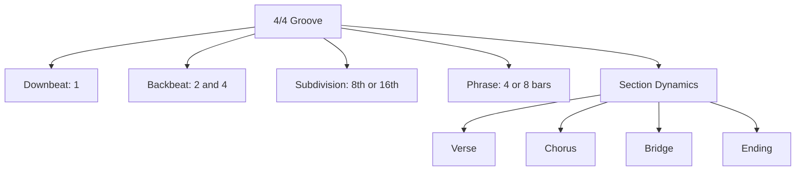
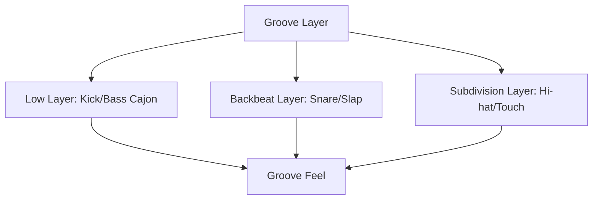
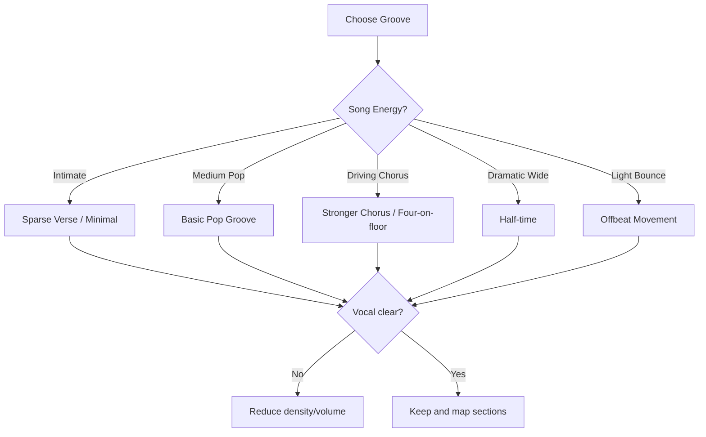
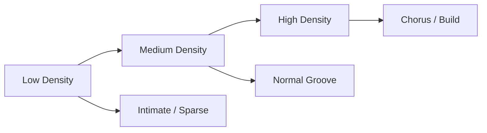
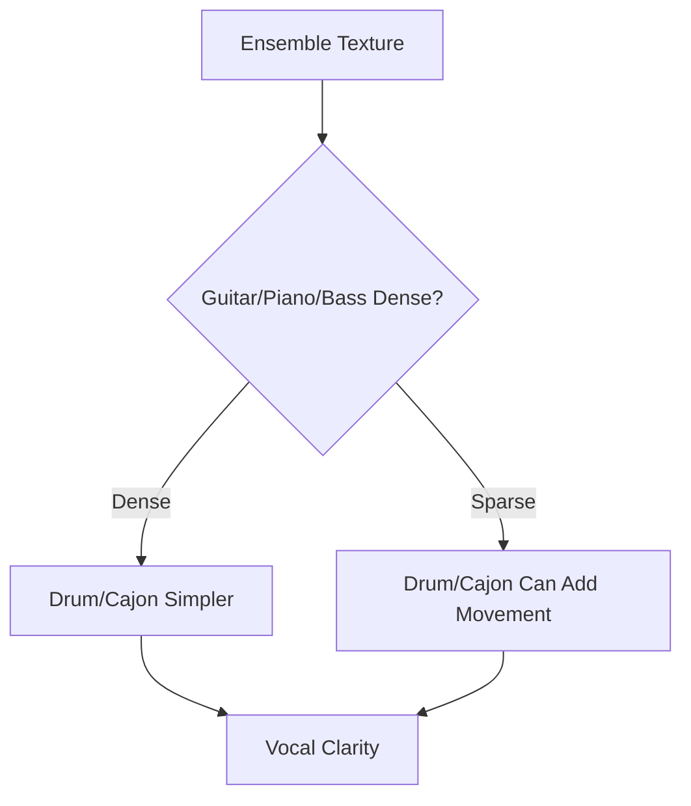

# learn-drum-cajon-part-010.md

# Part 010 — Groove 4/4 Paling Penting untuk Mengiringi Penyanyi

## Status Seri

- Seri: `learn-drum-cajon`
- Part: `010`
- Topik: Groove 4/4 paling penting untuk accompaniment
- Target akhir seri: mampu mengiringi penyanyi dengan drum dan/atau cajon secara stabil, musikal, dan sadar konteks
- Status: seri belum selesai
- Part sebelumnya: `learn-drum-cajon-part-009.md`
- Part berikutnya: `learn-drum-cajon-part-011.md`

---

## Tujuan Part Ini

Part ini mulai masuk ke vocabulary groove yang paling sering dipakai untuk mengiringi penyanyi. Fokusnya adalah **4/4**, karena mayoritas lagu pop, worship, acoustic, folk, rock ringan, dan singer-songwriter berada dalam 4/4 atau bisa diperlakukan dengan feel 4/4.

Setelah menyelesaikan part ini, kamu harus mampu:

1. memahami apa yang membuat groove 4/4 cocok untuk lagu,
2. memainkan basic pop groove pada drum kit dan cajon,
3. memainkan sparse verse groove,
4. memainkan stronger chorus groove,
5. memainkan four-on-the-floor,
6. memainkan half-time feel,
7. memahami straight vs light swing feel secara praktis,
8. memilih groove berdasarkan format ensemble,
9. membedakan groove untuk verse, chorus, bridge, dan final chorus,
10. menghindari overplaying saat mengiringi vokal.

---

# 1. Groove 4/4 sebagai Default Accompaniment

4/4 adalah meter yang paling sering kamu temui dalam lagu modern. Counting dasarnya:

```text
1 & 2 & 3 & 4 &
```

Dalam accompaniment, struktur paling umum:

- kick/bass di 1 dan/atau 3,
- snare/slap di 2 dan 4,
- hi-hat/touch sebagai subdivision,
- fill di akhir phrase,
- crash/accent di awal section penting.



---

# 2. Apa yang Membuat Groove Cocok?

Groove yang cocok bukan yang paling rumit. Groove yang cocok adalah groove yang memenuhi fungsi lagu.

Checklist:

| Pertanyaan | Jika Ya |
|---|---|
| Apakah tempo stabil? | lanjut |
| Apakah vokal tetap jelas? | lanjut |
| Apakah groove cocok mood lagu? | lanjut |
| Apakah verse/chorus berbeda? | lanjut |
| Apakah pattern tidak terlalu ramai? | lanjut |
| Apakah pemain lain bisa lock? | lanjut |
| Apakah fill kembali ke beat 1? | lanjut |

Jika salah satu gagal, groove harus disederhanakan.

---

# 3. Core 4/4 Architecture

Dalam 4/4, kamu bisa melihat groove sebagai kombinasi tiga layer:



## 3.1 Low Layer

Drum:

```text
Kick
```

Cajon:

```text
Bass
```

Fungsi:

- body,
- movement,
- downbeat,
- connection to bass/guitar/piano.

## 3.2 Backbeat Layer

Drum:

```text
Snare
```

Cajon:

```text
Slap
```

Fungsi:

- 2 dan 4,
- groove identity,
- response,
- energy.

## 3.3 Subdivision Layer

Drum:

```text
Hi-hat / Ride
```

Cajon:

```text
Touch / Ghost / Shaker
```

Fungsi:

- time grid,
- texture,
- movement,
- density.

---

# 4. Groove 1 — Basic Pop Groove

Ini adalah groove paling penting untuk 20 jam pertama.

## 4.1 Drum Kit

```text
Count : 1 & 2 & 3 & 4 &
Hat   : x x x x x x x x
Kick  : K       K
Snare :     S       S
```

## 4.2 Cajon

```text
Count : 1 & 2 & 3 & 4 &
Touch : t t t t t t t t
Bass  : B       B
Slap  :     S       S
```

Atau ditulis sebagai sequence:

```text
B t S t B t S t
```

## 4.3 Use Case

Cocok untuk:

- pop sederhana,
- acoustic set,
- worship verse/chorus kecil,
- singer-songwriter,
- lagu medium tempo,
- latihan awal.

## 4.4 Risiko

- jika terlalu datar, terasa membosankan,
- jika hi-hat/touch terlalu keras, vokal tertutup,
- jika kick/bass lemah, groove tipis.

## 4.5 Drill

Tempo: 70 BPM  
Durasi: 5 menit

1. Main 2 menit sangat pelan.
2. Main 2 menit medium.
3. Main 1 menit dengan sedikit chorus lift.

Acceptance:

- tempo stabil,
- backbeat jelas,
- subdivision tidak mendominasi.

---

# 5. Groove 2 — Sparse Verse Groove

Sparse groove dipakai saat verse butuh ruang.

## 5.1 Drum Kit

```text
Count : 1 & 2 & 3 & 4 &
Hat   : x   x   x   x
Kick  : K       K
Snare :     s       s
```

`s` = snare soft

Atau lebih ringan:

```text
Count : 1 & 2 & 3 & 4 &
Hat   : x       x
Kick  : K
Snare :         s
```

## 5.2 Cajon

```text
Count : 1 & 2 & 3 & 4 &
Bass  : B       B
Slap  :     s       s
Touch :   t       t
```

Atau:

```text
B   s t B   s t
```

## 5.3 Use Case

Cocok untuk:

- verse pertama,
- lirik penting,
- penyanyi solo,
- gitar fingerpicking,
- piano lembut,
- ruangan kecil.

## 5.4 Prinsip

Sparse bukan berarti lemah. Sparse berarti memilih note yang benar-benar perlu.

Rule:

> Jika vokal sedang bercerita, jangan terlalu banyak bicara lewat drum/cajon.

---

# 6. Groove 3 — Stronger Chorus Groove

Chorus biasanya butuh lift. Lift bisa dibuat dengan:

- volume sedikit naik,
- density naik,
- hi-hat/touch lebih aktif,
- kick/bass lebih bergerak,
- crash/accent di awal.

## 6.1 Drum Kit

```text
Count : 1 & 2 & 3 & 4 &
Hat   : x x x x x x x x
Kick  : K     K K
Snare :     S       S
```

Kick di:

- 1,
- `&` setelah 2,
- 3.

## 6.2 Cajon

```text
Count : 1 & 2 & 3 & 4 &
Touch : t t t t t t t t
Bass  : B     B B
Slap  :     S       S
```

Sequence:

```text
B t S B B t S t
```

## 6.3 Use Case

Cocok untuk:

- chorus pop,
- worship chorus,
- acoustic chorus yang lebih besar,
- bagian hook.

## 6.4 Risiko

- chorus rush,
- slap/snare terlalu keras,
- kick/bass variation membuat groove goyah.

Rule:

> Chorus boleh lebih besar, tetapi tidak boleh lebih cepat tanpa disengaja.

---

# 7. Groove 4 — Four-on-the-Floor

Four-on-the-floor berarti kick/bass di setiap beat.

## 7.1 Drum Kit

```text
Count : 1 & 2 & 3 & 4 &
Hat   : x x x x x x x x
Kick  : K   K   K   K
Snare :     S       S
```

## 7.2 Cajon

```text
Count : 1 & 2 & 3 & 4 &
Touch : t t t t t t t t
Bass  : B   B   B   B
Slap  :     S       S
```

## 7.3 Use Case

Cocok untuk:

- anthem,
- worship build,
- pop driving,
- chorus besar,
- lagu yang butuh forward motion.

## 7.4 Risiko

- terlalu berat untuk verse,
- bass menutup ruang,
- di cajon bisa melelahkan,
- jika terlalu keras, vokal tertutup.

Rule:

> Four-on-the-floor adalah tool energi, bukan default untuk semua lagu.

---

# 8. Groove 5 — Half-Time Feel

Half-time membuat lagu terasa lebih luas dan berat. Snare/slap berpindah rasa ke beat 3.

## 8.1 Drum Kit

```text
Count : 1 & 2 & 3 & 4 &
Hat   : x x x x x x x x
Kick  : K       K
Snare :         S
```

## 8.2 Cajon

```text
Count : 1 & 2 & 3 & 4 &
Touch : t t t t t t t t
Bass  : B       B
Slap  :         S
```

## 8.3 Use Case

Cocok untuk:

- bridge dramatic,
- final chorus cinematic,
- slow ballad besar,
- bagian yang butuh rasa luas,
- lagu dengan emotional weight.

## 8.4 Risiko

- penyanyi/pemain lain bingung jika tidak disepakati,
- terasa lambat jika groove lemah,
- backbeat hilang jika slap/snare tidak jelas.

Rule:

> Half-time harus terasa sebagai keputusan arrangement, bukan kesalahan backbeat.

---

# 9. Groove 6 — Backbeat Only / Minimal Groove

Kadang yang dibutuhkan hanya backbeat.

## 9.1 Drum Kit

```text
Count : 1   2   3   4
Kick  : K       K
Snare :     S       S
```

Tanpa hi-hat, atau hi-hat sangat jarang.

## 9.2 Cajon

```text
Count : 1   2   3   4
Bass  : B       B
Slap  :     S       S
```

## 9.3 Use Case

Cocok untuk:

- bagian sangat intimate,
- latihan singer,
- ruangan kecil,
- intro sederhana,
- verse yang tidak butuh movement.

## 9.4 Risiko

- terasa kosong jika lagu butuh movement,
- internal clock harus kuat,
- tempo bisa goyah karena note sedikit.

Rule:

> Semakin sedikit note yang dimainkan, semakin kuat internal clock harus bekerja.

---

# 10. Groove 7 — Offbeat Movement

Offbeat movement memberi rasa berjalan tanpa terlalu banyak kick.

## 10.1 Drum Kit

```text
Count : 1 & 2 & 3 & 4 &
Hat   : x x x x x x x x
Kick  : K       K
Snare :     S       S
Hat Accent:   >   >   >
```

Atau dengan offbeat hi-hat accent:

```text
Count : 1 & 2 & 3 & 4 &
Hat   : x X x X x X x X
Kick  : K       K
Snare :     S       S
```

## 10.2 Cajon

```text
Count : 1 & 2 & 3 & 4 &
Bass  : B       B
Slap  :     S       S
Touch :   t   t   t   t
```

## 10.3 Use Case

Cocok untuk:

- acoustic pop,
- folk-pop,
- lagu yang butuh light bounce,
- gitar strumming tidak terlalu padat.

## 10.4 Risiko

- offbeat terlalu keras,
- groove terasa gelisah,
- vokal terganggu.

---

# 11. Straight Feel vs Light Swing

## 11.1 Straight Feel

Straight 8th:

```text
1 & 2 & 3 & 4 &
```

Jarak antara `1` dan `&` sama.

Cocok untuk:

- pop modern,
- worship,
- rock ringan,
- acoustic pop.

## 11.2 Light Swing / Shuffle Feel

Triplet feel:

```text
1 trip let 2 trip let 3 trip let 4 trip let
```

Swing 8th kira-kira:

```text
1     let 2     let 3     let 4     let
```

Cocok untuk:

- bluesy song,
- country-ish,
- shuffle pop,
- lagu yang terasa mengayun.

Untuk 20 jam pertama, cukup kenali. Jangan masuk terlalu dalam.

---

# 12. Groove Selection Decision Tree



---

# 13. Groove by Section

## 13.1 Intro

Possible choices:

| Context | Groove |
|---|---|
| solo vocal intro | diam |
| guitar intro | touch/hi-hat light |
| band intro | basic groove |
| chorus-like intro | stronger groove |

## 13.2 Verse 1

Biasanya:

- sparse,
- controlled,
- vocal-forward,
- no crash,
- minimal fill.

Groove:

- sparse verse,
- minimal groove,
- basic pop soft.

## 13.3 Pre-Chorus

Pre-chorus biasanya build.

Strategi:

- tambah density sedikit,
- open hi-hat sedikit,
- touch lebih aktif,
- kick/bass sedikit lebih bergerak,
- fill kecil menuju chorus.

## 13.4 Chorus

Chorus biasanya lift.

Strategi:

- basic pop lebih besar,
- stronger chorus groove,
- four-on-floor jika cocok,
- crash/accent di awal,
- snare/slap lebih jelas.

## 13.5 Verse 2

Jangan selalu kembali persis seperti verse 1. Bisa sedikit lebih aktif.

Strategi:

- basic verse + touch,
- kick/bass sedikit variasi,
- tetap lebih kecil dari chorus.

## 13.6 Bridge

Bridge bisa:

- drop,
- build,
- half-time,
- sparse,
- tom/cajon texture.

## 13.7 Final Chorus

Final chorus biasanya paling besar.

Strategi:

- stronger groove,
- four-on-floor,
- ride/open hi-hat,
- cajon touch lebih aktif,
- tetap jaga vokal.

## 13.8 Ending

Ending harus jelas.

Strategi:

- stop,
- final accent,
- ring out,
- slow down jika disepakati,
- jangan fill random.

---

# 14. Groove Density

Density adalah jumlah note.



Contoh density rendah:

```text
B   S   B   S
```

Medium:

```text
B t S t B t S t
```

High:

```text
B t S t B B S t
```

Density harus mengikuti lagu.

Rule:

> Jangan pakai high density di bagian yang butuh lirik jelas dan ruang.

---

# 15. Groove Dynamics

Satu groove yang sama bisa menjadi banyak fungsi jika dynamics berubah.

Basic pop groove:

```text
B t S t B t S t
```

Bisa menjadi:

| Section | Cara Main |
|---|---|
| Verse | semua level kecil |
| Pre-chorus | touch lebih aktif |
| Chorus | bass/slap lebih jelas |
| Bridge | kurangi touch |
| Final | full level tetapi tetap controlled |

Jadi jangan selalu mencari pattern baru. Kadang yang dibutuhkan hanya dynamic baru.

---

# 16. Drum Kit vs Cajon Adaptation

## 16.1 Basic Pop

Drum:

```text
Hat   : x x x x x x x x
Kick  : K       K
Snare :     S       S
```

Cajon:

```text
Touch : t t t t t t t t
Bass  : B       B
Slap  :     S       S
```

## 16.2 Sparse Verse

Drum:

```text
Hat   : x   x   x   x
Kick  : K       K
Snare :     s       s
```

Cajon:

```text
Touch :   t       t
Bass  : B       B
Slap  :     s       s
```

## 16.3 Four-on-floor

Drum:

```text
Kick  : K   K   K   K
Snare :     S       S
Hat   : x x x x x x x x
```

Cajon:

```text
Bass  : B   B   B   B
Slap  :     S       S
Touch : t t t t t t t t
```

Cajon four-on-floor perlu hati-hati karena bisa melelahkan dan terlalu low-heavy.

---

# 17. Interaction dengan Gitar/Piano/Bass

## 17.1 Dengan Gitar Akustik

Jika gitar strumming 8th note:

- hi-hat/touch tidak perlu terlalu keras,
- lock dengan strumming,
- jangan menabrak accent gitar.

Jika gitar fingerpicking:

- cajon/drum bisa memberi pulse lebih jelas,
- tetap soft,
- jangan mengisi semua ruang.

## 17.2 Dengan Piano

Jika piano tangan kiri aktif:

- kick/bass jangan terlalu ramai,
- gunakan backbeat ringan,
- dengarkan chord rhythm.

Jika piano sparse:

- groove boleh lebih jelas.

## 17.3 Dengan Bass

Jika ada bass player:

- kick harus lock dengan bass,
- jangan membuat kick variation yang bertabrakan,
- groove harus terasa sebagai satu low-end system.



---

# 18. Practice: One Groove, Many Contexts

Pilih basic pop groove.

Mainkan dalam lima konteks:

## Context 1 — Soft Verse

- volume kecil,
- no fill,
- hi-hat/touch ringan.

## Context 2 — Normal Verse

- volume medium kecil,
- backbeat jelas.

## Context 3 — Pre-Chorus Build

- tambah sedikit density,
- mungkin open hat/touch lebih aktif.

## Context 4 — Chorus

- volume medium,
- kick/bass variation,
- backbeat lebih jelas.

## Context 5 — Bridge Drop

- kurangi note,
- maybe half-time/minimal.

Tujuan:

> Kamu belajar mengaransemen groove, bukan hanya memainkan pattern.

---

# 19. Practice: Groove Switching

Latihan 8 bar:

```text
Bar 1-4: sparse verse
Bar 5-8: basic pop
```

Lalu:

```text
Bar 1-4: basic pop
Bar 5-8: stronger chorus
```

Lalu:

```text
Bar 1-4: stronger chorus
Bar 5-8: half-time
```

Fokus:

- tempo tidak berubah,
- transition jelas,
- dynamic berubah,
- tidak panik saat pindah pattern.

---

# 20. Practice: Groove + Vocal Awareness

Gunakan lagu vokal.

Tahap:

1. main basic groove,
2. dengarkan vokal lebih keras dari instrumenmu,
3. kurangi volume saat kata penting,
4. fill hanya setelah frase,
5. rekam,
6. cek apakah lirik tetap jelas.

Jika tidak jelas:

- kurangi hi-hat/touch,
- kurangi snare/slap,
- sederhanakan kick/bass,
- jangan fill.

---

# 21. Practice Protocol 30 Menit

## Sesi Groove Vocabulary

| Durasi | Latihan |
|---:|---|
| 5 menit | basic pop |
| 5 menit | sparse verse |
| 5 menit | stronger chorus |
| 5 menit | four-on-floor |
| 5 menit | half-time |
| 5 menit | record/review |

## Sesi Section Application

| Durasi | Latihan |
|---:|---|
| 5 menit | verse groove |
| 5 menit | chorus groove |
| 5 menit | verse → chorus |
| 5 menit | chorus → verse |
| 5 menit | bridge drop |
| 5 menit | review |

## Sesi Song Application

| Durasi | Latihan |
|---:|---|
| 5 menit | listen and map song |
| 5 menit | clap backbeat |
| 5 menit | choose groove |
| 10 menit | play full song simplified |
| 5 menit | record/review |

---

# 22. Common Mistakes

## 22.1 Semua Section Pakai Groove yang Sama

Masalah:

- lagu tidak berkembang,
- chorus tidak terasa naik,
- verse terlalu besar.

Solusi:

- ubah dynamics,
- ubah density,
- bukan selalu pattern baru.

## 22.2 Chorus Selalu Rush

Masalah:

- energi naik membuat tempo naik.

Solusi:

- metronome verse/chorus drill,
- main chorus lebih besar tetapi relaxed.

## 22.3 Verse Terlalu Ramai

Masalah:

- lirik tidak jelas,
- penyanyi kehilangan ruang.

Solusi:

- sparse groove,
- kurangi touch/hi-hat,
- no fill.

## 22.4 Four-on-the-Floor Dipakai Terus

Masalah:

- lagu terlalu berat,
- tidak ada arc,
- vocalist tertutup.

Solusi:

- simpan untuk chorus/build,
- pakai basic/sparse untuk verse.

## 22.5 Half-Time Tidak Disepakati

Masalah:

- pemain lain bingung,
- lagu terasa salah.

Solusi:

- gunakan di bridge/final jika cocok,
- pastikan transition jelas.

---

# 23. Debugging Guide

| Gejala | Penyebab Kemungkinan | Correction |
|---|---|---|
| Groove terasa membosankan | dynamic datar | buat section map |
| Vokal tertutup | density/volume terlalu tinggi | sparse groove |
| Chorus tidak naik | verse terlalu besar | kecilkan verse |
| Tempo rush | dynamic instability | metronome drill |
| Groove tidak lock dengan gitar | subdivision conflict | kurangi touch/hat |
| Cajon terlalu tajam | slap terlalu keras | slap level 2 |
| Drum terlalu noisy | hi-hat/crash dominan | reduce cymbals |
| Fill merusak groove | fill belum stabil | 1-beat fill |
| Half-time membingungkan | cue kurang jelas | pakai hanya setelah disepakati |

---

# 24. Groove Selection Matrix

| Context | Drum Groove | Cajon Groove |
|---|---|---|
| Singer solo intimate | minimal/sparse | sparse bass/slap |
| Guitar vocal verse | sparse/basic soft | sparse verse |
| Guitar vocal chorus | basic/stronger | basic pop/stronger |
| Piano ballad | minimal/half-time soft | touch + soft slap |
| Full band verse | basic controlled | basic if acoustic |
| Full band chorus | stronger/four-floor | stronger if cajon audible |
| Worship build | four-floor/open hat | four-floor cajon carefully |
| Bridge drop | minimal/half-time | drop pattern |
| Final chorus | stronger/ride | stronger + touch |

---

# 25. Mini Capstone Part Ini

Pilih satu lagu 4/4. Buat arrangement sederhana:

```md
# 4/4 Groove Arrangement

Title:
Tempo:
Meter: 4/4
Instrument: drum / cajon / both

Intro:
Verse 1:
Pre-Chorus:
Chorus:
Verse 2:
Chorus 2:
Bridge:
Final Chorus:
Ending:
```

Isi setiap section dengan:

- groove,
- dynamic level,
- fill/accent,
- notes for vocal space.

Contoh:

```md
Verse 1:
- sparse verse
- level 2
- no fill
- keep vocal clear

Chorus:
- stronger chorus
- level 3
- accent beat 1
- no extra fill over vocal hook
```

Rekam minimal 2 menit.

---

# 26. Self-Scoring Rubric

Nilai 1–5:

| Area | 1 | 3 | 5 |
|---|---|---|---|
| Basic pop | goyah | cukup | stabil 3 menit |
| Sparse groove | kehilangan time | cukup | ruang bagus |
| Chorus groove | rush | cukup | lift stabil |
| Four-floor | berat/goyah | cukup | driving |
| Half-time | bingung | cukup | intentional |
| Section contrast | tidak ada | ada sedikit | jelas |
| Vocal support | tertutup | cukup | vokal aman |
| Groove choice | asal | cukup cocok | sangat kontekstual |

Target:

- minimal 3 semua area,
- minimal 4 untuk basic pop,
- minimal 4 untuk section contrast.

---

# 27. Acceptance Criteria Part Ini

Kamu boleh lanjut ke Part 011 jika:

1. bisa memainkan basic 4/4 groove drum atau cajon selama 3 menit,
2. bisa memainkan sparse verse groove,
3. bisa memainkan stronger chorus groove,
4. bisa memainkan four-on-the-floor secara terkendali,
5. bisa memainkan half-time feel sederhana,
6. bisa menjelaskan kapan tiap groove dipakai,
7. bisa membedakan verse/chorus lewat dynamics atau density,
8. bisa memilih groove berdasarkan vokal dan ensemble,
9. bisa membuat arrangement sederhana untuk satu lagu 4/4.

---

# 28. Ringkasan

Groove 4/4 adalah vocabulary utama untuk accompaniment.

Groove penting:

1. basic pop,
2. sparse verse,
3. stronger chorus,
4. four-on-the-floor,
5. half-time,
6. minimal/backbeat only,
7. offbeat movement.

Yang membuat groove bagus bukan kompleksitas, tetapi:

- stabilitas tempo,
- kecocokan dengan lagu,
- ruang untuk vokal,
- dynamic arc,
- transisi jelas,
- kemampuan lock dengan instrumen lain.

Rule paling penting:

> Pilih groove yang membuat lagu lebih kuat, bukan groove yang membuat kamu terlihat lebih sibuk.

---

# 29. Latihan untuk Part Berikutnya

Sebelum lanjut ke Part 011, lakukan:

1. Pilih satu lagu 4/4.
2. Buat section map.
3. Pilih groove untuk verse, chorus, bridge.
4. Rekam 2 menit.
5. Evaluasi:
   - apakah tempo stabil?
   - apakah vokal jelas?
   - apakah chorus naik?
   - apakah verse punya ruang?
   - apakah fill terlalu banyak?
6. Latih basic pop dan sparse verse masing-masing 3 menit.

Part berikutnya membahas:

> groove 6/8, 12/8, dan ballad feel: bagaimana mengiringi lagu lambat, mengayun, dan emosional tanpa rushing, overplaying, atau kehilangan ruang vokal.
