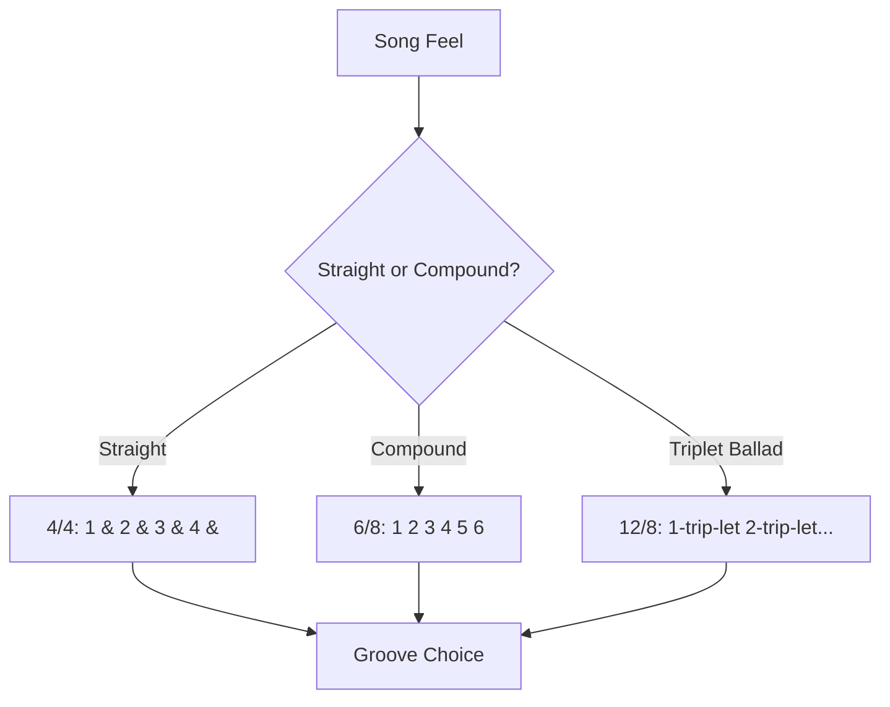
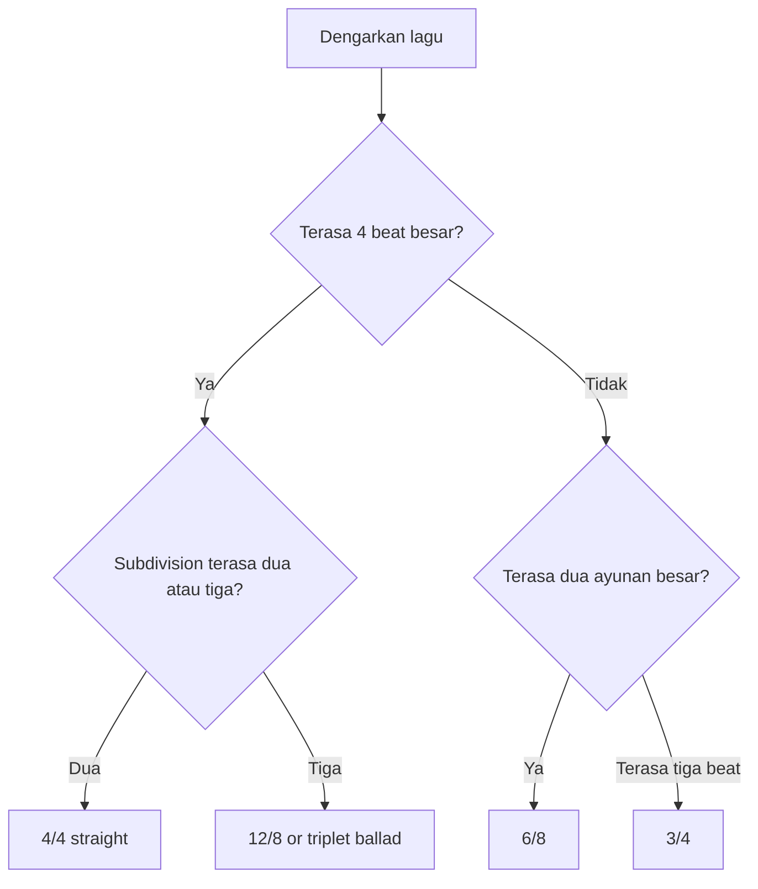
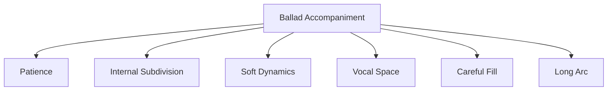
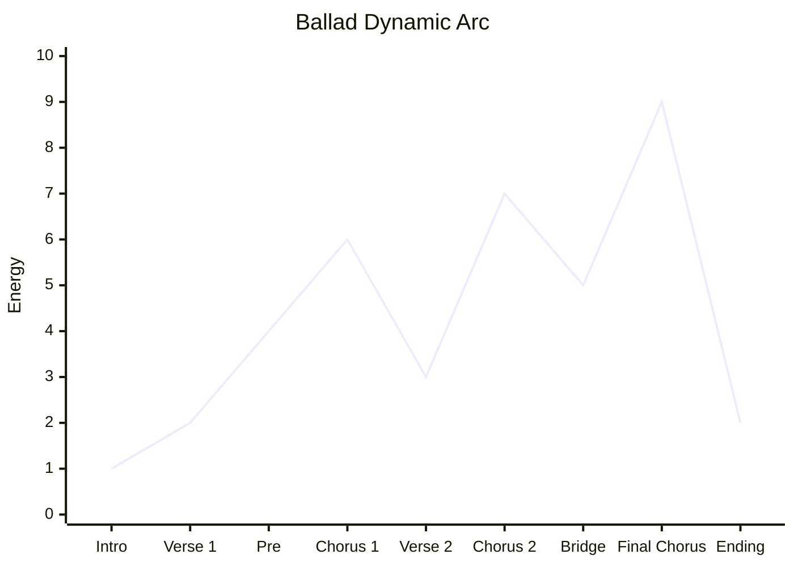

# learn-drum-cajon-part-011.md

# Part 011 — Groove 6/8, 12/8, dan Ballad Feel

## Status Seri

- Seri: `learn-drum-cajon`
- Part: `011`
- Topik: Groove 6/8, 12/8, dan ballad feel
- Target akhir seri: mampu mengiringi penyanyi dengan drum dan/atau cajon secara stabil, musikal, dan sadar konteks
- Status: seri belum selesai
- Part sebelumnya: `learn-drum-cajon-part-010.md`
- Part berikutnya: `learn-drum-cajon-part-012.md`

---

## Tujuan Part Ini

Part ini membahas feel yang sangat penting untuk mengiringi penyanyi: lagu lambat, ballad, 6/8, dan 12/8. Banyak lagu vokal yang emosional tidak berjalan dengan 4/4 straight biasa, melainkan terasa mengayun dalam kelompok tiga.

Setelah menyelesaikan part ini, kamu harus mampu:

1. membedakan 3/4, 6/8, dan 12/8 secara praktis,
2. menghitung 6/8 dengan aksen 1 dan 4,
3. menghitung 12/8 sebagai 4 beat besar dengan triplet feel,
4. memainkan groove 6/8 drum kit dasar,
5. memainkan groove 6/8 cajon dasar,
6. memainkan ballad 12/8 feel,
7. menjaga tempo lambat tanpa rushing,
8. memberi ruang untuk vokal pada lagu emosional,
9. membangun dynamic arc ballad,
10. menghindari fill berlebihan di lagu lambat.

---

# 1. Kenapa 6/8 dan Ballad Feel Penting?

Banyak pemula hanya belajar 4/4. Akibatnya, semua lagu dipaksa menjadi:

```text
1 & 2 & 3 & 4 &
```

Padahal beberapa lagu lebih alami dihitung sebagai:

```text
1 2 3 4 5 6
```

atau:

```text
1-trip-let 2-trip-let 3-trip-let 4-trip-let
```

Dalam accompaniment, salah membaca feel bisa membuat lagu:

- terasa kaku,
- kehilangan ayunan,
- terlalu square,
- vokal terasa tidak natural,
- fill masuk di tempat salah,
- chorus tidak punya emotional lift.



---

# 2. 3/4 vs 6/8 vs 12/8

## 2.1 3/4

3/4 memiliki tiga beat utama:

```text
1 2 3 | 1 2 3
```

Rasa:

```text
ONE two three
```

Biasanya terasa seperti waltz atau ayunan tiga.

Contoh aksen:

```text
1   2   3
>   -   -
```

## 2.2 6/8

6/8 memiliki enam hitungan kecil, tetapi biasanya terasa sebagai dua beat besar:

```text
1 2 3 4 5 6
ONE two three FOUR five six
```

Aksen utama:

```text
1 dan 4
```

Rasa besarnya:

```text
ONE ... FOUR ...
```

atau:

```text
DA-da-da DA-da-da
```

## 2.3 12/8

12/8 bisa dipahami sebagai 4 beat besar, masing-masing dibagi tiga:

```text
1 trip let 2 trip let 3 trip let 4 trip let
```

Rasa besarnya masih seperti 4/4, tetapi subdivision-nya triplet.

---

# 3. Cara Cepat Membedakan

Gunakan decision sederhana:



## 3.1 Tanda 6/8

Biasanya terasa:

```text
1-2-3 4-5-6
```

Dengan dua dorongan besar per bar.

## 3.2 Tanda 12/8

Biasanya terasa:

```text
1-trip-let 2-trip-let 3-trip-let 4-trip-let
```

Dengan snare/backbeat tetap bisa terasa di beat besar 2 dan 4.

## 3.3 Tanda 3/4

Biasanya terasa:

```text
1-2-3 1-2-3
```

Bukan dua kelompok tiga, tetapi tiga beat dalam satu bar.

---

# 4. Counting 6/8

## 4.1 Hitungan Dasar

```text
1 2 3 4 5 6
```

Aksen:

```text
1 2 3 4 5 6
>     >
```

Ucapkan:

```text
ONE two three FOUR five six
```

atau:

```text
DA da da DA da da
```

## 4.2 Body Pulse

Latihan tanpa alat:

1. Tap kaki di 1 dan 4.
2. Tepuk ringan semua enam hitungan.
3. Ucapkan `ONE two three FOUR five six`.
4. Lakukan 3 menit.

```text
Count : 1 2 3 4 5 6
Foot  : F     F
Clap  : x x x x x x
```

## 4.3 Jangan Menghitung 6/8 seperti 6 Beat Sama Kuat

Jika semua sama kuat:

```text
1 2 3 4 5 6
x x x x x x
```

lagu bisa terasa datar. 6/8 butuh dua gelombang besar.

---

# 5. Drum Kit 6/8 Basic Groove

## 5.1 Skeleton

```text
Count : 1 2 3 4 5 6
Kick  : K
Snare :       S
```

Kick di 1, snare di 4.

Ini memberi dua titik besar:

```text
1 = downbeat
4 = backbeat-like response
```

## 5.2 Add Hi-hat

```text
Count : 1 2 3 4 5 6
Hat   : x x x x x x
Kick  : K
Snare :       S
```

## 5.3 Add Kick on 5 or 6

Variation:

```text
Count : 1 2 3 4 5 6
Hat   : x x x x x x
Kick  : K       K
Snare :       S
```

Atau:

```text
Count : 1 2 3 4 5 6
Hat   : x x x x x x
Kick  : K         K
Snare :       S
```

Hati-hati: kick tambahan jangan membuat feel rush ke bar berikutnya.

---

# 6. Cajon 6/8 Basic Groove

## 6.1 Skeleton

```text
Count : 1 2 3 4 5 6
Bass  : B
Slap  :       S
```

## 6.2 Add Touch

```text
Count : 1 2 3 4 5 6
Touch : t t t t t t
Bass  : B
Slap  :       S
```

## 6.3 Slight Movement

```text
Count : 1 2 3 4 5 6
Touch : t t t t t t
Bass  : B       B
Slap  :       S
```

atau:

```text
Count : 1 2 3 4 5 6
Touch : t t t t t t
Bass  : B         B
Slap  :       S
```

---

# 7. 6/8 Groove Library

## 7.1 6/8 Minimal

Drum:

```text
Count : 1 2 3 4 5 6
Kick  : K
Snare :       S
Hat   : x x x x x x
```

Cajon:

```text
Count : 1 2 3 4 5 6
Bass  : B
Slap  :       S
Touch : t t t t t t
```

Use case:

- verse ballad,
- acoustic worship,
- slow emotional song.

## 7.2 6/8 Stronger

Drum:

```text
Count : 1 2 3 4 5 6
Kick  : K       K
Snare :       S
Hat   : x x x x x x
```

Cajon:

```text
Count : 1 2 3 4 5 6
Bass  : B       B
Slap  :       S
Touch : t t t t t t
```

Use case:

- chorus,
- build,
- bigger ballad section.

## 7.3 6/8 Sparse Verse

Drum:

```text
Count : 1 2 3 4 5 6
Kick  : K
Snare :       s
Hat   : x     x
```

Cajon:

```text
Count : 1 2 3 4 5 6
Bass  : B
Slap  :       s
Touch :   t     t
```

Use case:

- verse sangat lembut,
- singer-first,
- lirik penting.

## 7.4 6/8 Build

Drum:

```text
Count : 1 2 3 4 5 6
Snare : s s s s s s
Kick  : K
```

Atau gunakan tom/snare build pelan.

Cajon:

```text
Count : 1 2 3 4 5 6
Touch : t t t t t t
Bass  : B
Slap  :       S
```

Naikkan volume perlahan menuju chorus.

---

# 8. Counting 12/8

12/8 lebih mudah dipahami sebagai 4 beat besar, masing-masing punya triplet.

```text
1 trip let 2 trip let 3 trip let 4 trip let
```

Atau:

```text
1 la li 2 la li 3 la li 4 la li
```

Backbeat biasanya tetap terasa pada beat besar 2 dan 4.

```text
Big Beat : 1        2        3        4
Subdiv   : trip let trip let trip let trip let
Snare    :          S                 S
```

---

# 9. Drum Kit 12/8 Ballad Groove

## 9.1 Basic 12/8

```text
Count : 1 la li 2 la li 3 la li 4 la li
Hat   : x x x  x x x  x x x  x x x
Kick  : K             K
Snare :        S             S
```

## 9.2 Sparse 12/8

```text
Count : 1 la li 2 la li 3 la li 4 la li
Hat   : x      x      x      x
Kick  : K             K
Snare :        s             s
```

## 9.3 Chorus 12/8

```text
Count : 1 la li 2 la li 3 la li 4 la li
Hat   : x x x  x x x  x x x  x x x
Kick  : K      K      K      K
Snare :        S             S
```

---

# 10. Cajon 12/8 Ballad Groove

## 10.1 Basic 12/8

```text
Count : 1 la li 2 la li 3 la li 4 la li
Touch : t t t  t t t  t t t  t t t
Bass  : B             B
Slap  :        S             S
```

## 10.2 Sparse 12/8

```text
Count : 1 la li 2 la li 3 la li 4 la li
Touch : t      t      t      t
Bass  : B             B
Slap  :        s             s
```

## 10.3 Stronger 12/8

```text
Count : 1 la li 2 la li 3 la li 4 la li
Touch : t t t  t t t  t t t  t t t
Bass  : B      B      B      B
Slap  :        S             S
```

---

# 11. Ballad Feel: Yang Sulit Bukan Pattern, Tapi Ruang

Lagu ballad menuntut:

- tempo lambat,
- ruang besar antar beat,
- vokal emosional,
- dinamika halus,
- fill minim,
- timing stabil,
- kesabaran.

Pemula sering salah karena:

- tidak sabar menunggu beat,
- fill terlalu banyak,
- main terlalu keras,
- chorus langsung rush,
- tidak menghitung subdivision,
- semua section terasa sama.

Ballad membutuhkan kontrol ego.



---

# 12. Slow Tempo Stability

Pada tempo lambat, internal subdivision wajib hidup.

Jika lagu 6/8 lambat:

```text
1 2 3 4 5 6
```

Jangan hanya merasa:

```text
1       4
```

Rasakan semua subdivision kecil.

Jika lagu 12/8:

```text
1 la li 2 la li 3 la li 4 la li
```

Jangan hanya menunggu beat 2, 3, 4.

---

# 13. Vocal Space dalam Ballad

Pada ballad, vokal biasanya membawa emosi utama. Drum/cajon harus sangat hati-hati.

## 13.1 Jangan Fill di Atas Kata Penting

Buruk:

```text
Vocal: "Aku tak sanggup..."
Drum : fill tom ramai tepat di atas "sanggup"
```

Baik:

```text
Vocal: "Aku tak sanggup..."
Drum : groove lembut, fill kecil setelah frase selesai
```

## 13.2 Gunakan Silence

Kadang bagian terbaik adalah tidak bermain.

Contoh:

```text
Verse first line: no drum/cajon
Second line: touch only
Pre-chorus: bass/slap masuk
Chorus: full groove
```

## 13.3 Ikuti Napas Penyanyi

Pada lagu lambat, napas penyanyi sangat terdengar. Kamu bisa memberi respons kecil setelah napas atau akhir frase, tetapi jangan terlalu sering.

---

# 14. Dynamic Arc untuk Ballad

Ballad sering punya arc panjang.



Jangan main besar dari awal. Simpan energi.

## 14.1 Verse 1

- sangat soft,
- bisa touch only,
- no crash,
- no fill besar.

## 14.2 Chorus 1

- naik,
- backbeat jelas,
- masih simpan final energy.

## 14.3 Verse 2

- turun lagi, tetapi bisa sedikit lebih aktif dari verse 1.

## 14.4 Bridge

- drop atau build,
- tergantung lagu.

## 14.5 Final Chorus

- paling besar,
- tetapi tetap tidak menutup vokal.

---

# 15. Fill dalam 6/8 dan Ballad

Fill di 6/8 harus mengikuti feel 1-2-3-4-5-6.

## 15.1 Fill 6/8 Sederhana

Drum:

```text
Count : 1 2 3 4 5 6
Groove: K     S
Fill  :         S S S
```

Cajon:

```text
Count : 1 2 3 4 5 6
Groove: B     S
Fill  :         t t S
```

## 15.2 Fill Menuju Beat 1

Tujuan fill adalah kembali ke beat 1 section berikutnya.

```text
Bar 1: groove
Bar 2: fill at 4-5-6
Next : beat 1 masuk chorus
```

## 15.3 Jangan Fill Terlalu Panjang

Di lagu lambat, fill panjang terdengar sangat jelas. Jika timing belum stabil, pakai fill pendek.

Rule:

> Di ballad, fill kecil yang tepat lebih kuat daripada fill panjang yang mengganggu emosi.

---

# 16. Groove Switching 6/8

Latihan:

```text
Bar 1-4: sparse 6/8
Bar 5-8: stronger 6/8
Bar 9-12: sparse 6/8
Bar 13-16: stronger 6/8
```

Fokus:

- tempo tidak naik saat stronger,
- feel 1 dan 4 tetap jelas,
- touch/hi-hat tidak terlalu keras.

---

# 17. Practice Drills

## Drill A — Count 6/8

Durasi: 5 menit

```text
1 2 3 4 5 6
```

Tepuk kuat di 1 dan 4.

```text
Count : 1 2 3 4 5 6
Clap  : X     X
```

## Drill B — Drum/Cajon 6/8 Skeleton

Durasi: 5 menit

```text
Count : 1 2 3 4 5 6
Kick/Bass : K/B
Snare/Slap:       S
```

## Drill C — Add Subdivision

Durasi: 5 menit

Drum:

```text
Hat : x x x x x x
```

Cajon:

```text
Touch : t t t t t t
```

## Drill D — 12/8 Count

Durasi: 5 menit

```text
1 la li 2 la li 3 la li 4 la li
```

Tepuk di beat besar 1, 2, 3, 4.

## Drill E — Ballad Dynamic

Durasi: 10 menit

```text
4 bar soft
4 bar medium
4 bar soft
4 bar bigger
```

---

# 18. Practice Protocol 30 Menit

## Sesi 6/8 Foundation

| Durasi | Latihan |
|---:|---|
| 5 menit | count 6/8 |
| 5 menit | clap 1 dan 4 |
| 5 menit | skeleton 6/8 |
| 5 menit | add subdivision |
| 5 menit | sparse vs stronger |
| 5 menit | record/review |

## Sesi 12/8 Ballad

| Durasi | Latihan |
|---:|---|
| 5 menit | count 12/8 |
| 5 menit | basic 12/8 groove |
| 5 menit | sparse 12/8 |
| 5 menit | stronger 12/8 |
| 5 menit | fill into beat 1 |
| 5 menit | record/review |

## Sesi Song Application

| Durasi | Latihan |
|---:|---|
| 5 menit | listen and identify feel |
| 5 menit | clap pulse |
| 5 menit | choose groove |
| 10 menit | play full section map |
| 5 menit | review vocal space |

---

# 19. Song Mapping Template

```md
# 6/8 or 12/8 Song Map

Title:
Meter: 6/8 / 12/8 / 3/4 / uncertain
Tempo:
Mood:

## Count
- 6/8: 1 2 3 4 5 6
- 12/8: 1 la li 2 la li 3 la li 4 la li

## Section Plan
Intro:
Verse 1:
Pre-Chorus:
Chorus 1:
Verse 2:
Chorus 2:
Bridge:
Final Chorus:
Ending:

## Dynamic Arc
Intro:
Verse:
Chorus:
Bridge:
Final:

## Fill Rules
- fill only after vocal phrase
- fill into beat 1
- no long fill unless stable
```

---

# 20. Common Mistakes

## 20.1 Memaksa 6/8 Menjadi 4/4 Straight

Gejala:

- lagu terasa kaku,
- ayunan hilang.

Solusi:

- hitung 1-2-3-4-5-6,
- aksen 1 dan 4,
- dengarkan wave besar.

## 20.2 Semua Hitungan Sama Kuat

Gejala:

- groove datar,
- feel tidak mengayun.

Solusi:

- accent 1 dan 4,
- main 2 kelompok tiga.

## 20.3 Chorus Rush

Gejala:

- begitu chorus masuk, tempo naik.

Solusi:

- dynamic drill dengan metronome,
- main lebih besar tapi tetap relaxed.

## 20.4 Fill Terlalu Ramai

Gejala:

- emosi vokal terganggu,
- beat 1 hilang.

Solusi:

- fill hanya 4-5-6,
- pakai 3 note saja,
- kembali beat 1.

## 20.5 Touch/Hi-hat Terlalu Keras

Gejala:

- ballad terasa berisik,
- vokal tenggelam.

Solusi:

- level 1–2,
- kurangi subdivision yang dimainkan,
- tetap rasakan subdivision internal.

---

# 21. Debugging Guide

| Gejala | Penyebab Kemungkinan | Correction |
|---|---|---|
| 6/8 terasa datar | aksen 1/4 lemah | clap 1 and 4 |
| Tempo lambat goyah | internal subdivision lemah | count all six/triplets |
| Chorus rush | dynamic naik tanpa kontrol | verse/chorus metronome |
| Fill keluar | fill terlalu panjang | 3-note fill |
| Vokal tertutup | terlalu ramai | sparse groove |
| 12/8 bingung | beat besar tidak terasa | tap 1/2/3/4 besar |
| Cajon slap kasar | dynamic terlalu besar | slap level 2 |
| Drum cymbal noisy | hi-hat/ride terlalu keras | reduce cymbal density |

---

# 22. Self-Scoring Rubric

Nilai 1–5.

| Area | 1 | 3 | 5 |
|---|---|---|---|
| Count 6/8 | bingung | cukup | natural |
| Accent 1/4 | datar | cukup | jelas |
| 6/8 groove | goyah | cukup | stabil |
| 12/8 count | bingung | cukup | natural |
| Ballad dynamics | datar | ada 2 level | arc jelas |
| Slow tempo | rush/drag | cukup | stabil |
| Fill return | beat 1 hilang | kadang tepat | tepat |
| Vocal space | tertutup | cukup | aman |

Target:

- minimal 3 semua area,
- minimal 4 untuk 6/8 count,
- minimal 4 untuk slow tempo stability.

---

# 23. Mini Capstone Part Ini

Rekam 2 menit:

```text
0:00–0:30 6/8 sparse
0:30–1:00 6/8 stronger
1:00–1:30 12/8 ballad basic
1:30–2:00 fill into chorus + ending
```

Jika hanya punya cajon, gunakan bass/slap/touch. Jika hanya drum substitute, gunakan tangan/kaki di permukaan berbeda.

Review:

| Pertanyaan | Ya/Tidak |
|---|---|
| Feel 6/8 jelas? | |
| Aksen 1 dan 4 terasa? | |
| 12/8 terasa triplet? | |
| Tempo lambat stabil? | |
| Fill kembali ke beat 1? | |
| Vokal punya ruang? | |
| Dynamics tidak datar? | |

---

# 24. Acceptance Criteria Part Ini

Kamu boleh lanjut ke Part 012 jika:

1. bisa menghitung 6/8 selama 2 menit,
2. bisa menepuk aksen 1 dan 4,
3. bisa memainkan groove 6/8 drum atau cajon minimal 2 menit,
4. bisa menghitung 12/8 sebagai 4 beat besar dengan triplet subdivision,
5. bisa memainkan satu groove ballad 12/8,
6. bisa membedakan sparse verse dan stronger chorus,
7. bisa memainkan fill pendek menuju beat 1,
8. bisa menjaga tempo lambat tanpa rushing besar,
9. bisa menjelaskan kapan lagu lebih cocok 6/8/12/8 daripada 4/4 straight.

---

# 25. Ringkasan

6/8 dan 12/8 penting karena banyak lagu vokal emosional hidup di feel berayun, bukan 4/4 straight.

Kunci 6/8:

```text
1 2 3 4 5 6
ONE two three FOUR five six
```

Kunci 12/8:

```text
1 la li 2 la li 3 la li 4 la li
```

Untuk ballad:

- main sabar,
- jaga internal subdivision,
- jangan fill berlebihan,
- beri ruang vokal,
- bangun dynamic arc,
- simpan energi untuk final chorus.

Rule paling penting:

> Lagu lambat tidak membutuhkan lebih banyak note; lagu lambat membutuhkan time, ruang, dan kontrol emosi yang lebih baik.

---

# 26. Latihan untuk Part Berikutnya

Sebelum lanjut ke Part 012, lakukan:

1. Count 6/8 selama 5 menit.
2. Main 6/8 skeleton 3 menit.
3. Main 12/8 ballad groove 3 menit.
4. Latih fill 3 note menuju beat 1.
5. Rekam sparse → stronger transition.
6. Catat apakah kamu:
   - rushing di chorus,
   - terlalu keras,
   - terlalu banyak touch/hi-hat,
   - kehilangan aksen 1 dan 4.

Part berikutnya membahas:

> dynamics: pelan, besar, naik, turun, dan diam sebagai sistem kontrol energi untuk mengiringi penyanyi.
