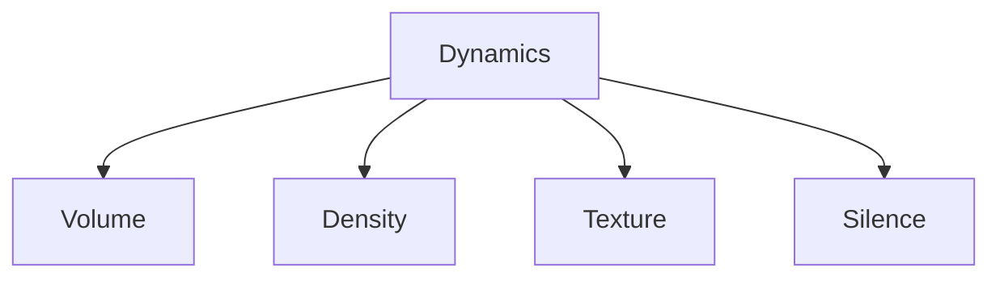
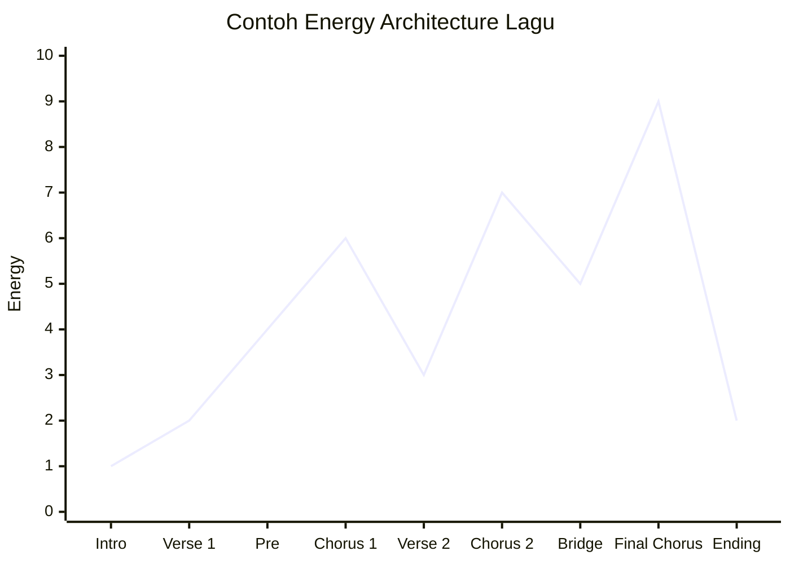
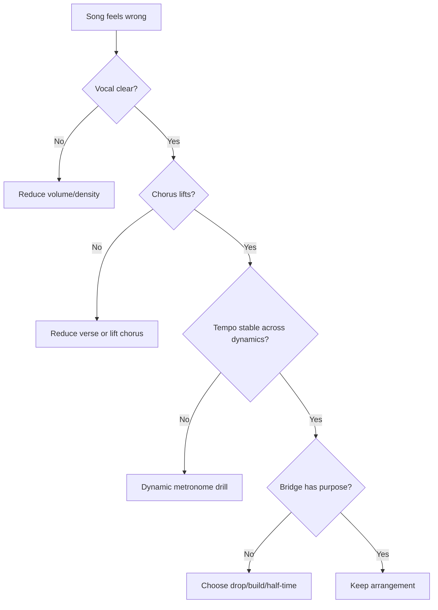

# learn-drum-cajon-part-012.md

# Part 012 — Dynamics: Pelan, Besar, Naik, Turun, Diam

## Status Seri

- Seri: `learn-drum-cajon`
- Part: `012`
- Topik: Dynamics sebagai kontrol energi lagu
- Target akhir seri: mampu mengiringi penyanyi dengan drum dan/atau cajon secara stabil, musikal, dan sadar konteks
- Status: seri belum selesai
- Part sebelumnya: `learn-drum-cajon-part-011.md`
- Part berikutnya: `learn-drum-cajon-part-013.md`

---

## Tujuan Part Ini

Part ini membahas salah satu kemampuan paling penting dalam accompaniment: dynamics. Banyak drummer/cajon player pemula terlalu fokus pada pattern, padahal yang membuat permainan terasa musikal sering kali bukan pattern baru, tetapi **cara pattern yang sama dimainkan dengan energi berbeda**.

Setelah menyelesaikan part ini, kamu harus mampu:

1. memahami dynamics sebagai volume, density, texture, dan silence,
2. memainkan satu groove dalam beberapa level energi,
3. membedakan verse, chorus, bridge, dan final chorus melalui dynamics,
4. menaikkan energi tanpa rushing,
5. menurunkan energi tanpa dragging,
6. menggunakan silence sebagai keputusan musikal,
7. membuat dynamic map untuk lagu,
8. menghindari menutup vokal,
9. mengontrol hi-hat/touch/snare/slap agar tidak terlalu keras,
10. melihat dynamics sebagai arsitektur energi lagu.

---

# 1. Dynamics Bukan Hanya Keras dan Pelan

Banyak pemula mengira dynamics berarti:

```text
pelan atau keras
```

Padahal dynamics dalam accompaniment mencakup empat dimensi:



## 1.1 Volume

Seberapa keras kamu memainkan suara.

Contoh:

- snare level 2 di verse,
- snare level 3 di chorus,
- crash level 4 di awal final chorus.

## 1.2 Density

Seberapa banyak note yang dimainkan.

Sparse:

```text
B   S   B   S
```

Fuller:

```text
B t S t B t S t
```

More driving:

```text
B t S t B B S t
```

## 1.3 Texture

Jenis suara yang dipakai.

Drum:

- closed hi-hat,
- open hi-hat,
- ride,
- rim click,
- snare center,
- tom,
- crash.

Cajon:

- bass,
- slap,
- touch,
- ghost,
- muted tone,
- finger roll,
- silence.

## 1.4 Silence

Diam bukan tidak bermain. Diam adalah bagian dari arrangement.

Silence bisa membuat:

- chorus lebih kuat,
- vokal lebih intim,
- lyric lebih jelas,
- tension meningkat,
- ending lebih tegas.

---

# 2. Dynamics sebagai Energy Architecture

Lagu punya perjalanan energi. Drummer/cajon player harus membantu perjalanan itu.



Jika kamu bermain level 7 dari awal, lagu kehilangan tempat untuk naik.

Kesalahan umum:

```text
Intro level 7
Verse level 7
Chorus level 8
Bridge level 8
Final chorus level 8
```

Hasilnya datar dan melelahkan.

Lebih baik:

```text
Intro level 1
Verse level 2
Pre level 4
Chorus level 6
Verse 2 level 3
Chorus 2 level 7
Bridge level 5
Final chorus level 9
Ending level 2
```

---

# 3. Dynamic Level System

Gunakan level 1–5 untuk latihan awal.

| Level | Deskripsi | Konteks |
|---:|---|---|
| 1 | sangat pelan | intro, verse intimate, bridge drop |
| 2 | pelan | verse normal, acoustic set |
| 3 | sedang | chorus kecil, full verse |
| 4 | besar | chorus kuat, build |
| 5 | sangat besar | final chorus, accent khusus |

Untuk accompaniment, sebagian besar permainan ada di level 1–4. Level 5 jarang dan harus punya alasan.

---

# 4. Volume Control

## 4.1 Drum Kit Volume

Elemen yang paling sering terlalu keras:

1. hi-hat,
2. snare,
3. crash,
4. ride wash.

Elemen yang sering terlalu lemah:

1. kick,
2. ghost note control,
3. rim/tap consistency.

Balance awal:

| Elemen | Verse | Chorus |
|---|---:|---:|
| Kick | 2 | 3 |
| Snare | 2 | 3 |
| Hi-hat | 1 | 2 |
| Crash | 0 | 3–4 only marker |
| Ride | 0 | 2–3 if needed |

## 4.2 Cajon Volume

Elemen yang paling sering terlalu keras:

1. slap,
2. touch,
3. ghost note.

Elemen yang sering terlalu lemah:

1. bass,
2. muted/touch nuance.

Balance awal:

| Elemen | Verse | Chorus |
|---|---:|---:|
| Bass | 2 | 3 |
| Slap | 1–2 | 3 |
| Touch | 1 | 2 |
| Ghost | 0–1 | 1 |
| Accent | 0 | 3–4 only marker |

---

# 5. Density Control

Density adalah jumlah aktivitas rhythm.

## 5.1 Low Density

Drum:

```text
Count : 1   2   3   4
Kick  : K       K
Snare :     s       s
```

Cajon:

```text
Count : 1   2   3   4
Bass  : B       B
Slap  :     s       s
```

Cocok untuk:

- verse,
- lirik penting,
- ruangan kecil,
- intro,
- bagian intimate.

## 5.2 Medium Density

Drum:

```text
Count : 1 & 2 & 3 & 4 &
Hat   : x x x x x x x x
Kick  : K       K
Snare :     S       S
```

Cajon:

```text
Count : 1 & 2 & 3 & 4 &
Touch : t t t t t t t t
Bass  : B       B
Slap  :     S       S
```

Cocok untuk:

- verse 2,
- chorus kecil,
- normal pop.

## 5.3 High Density

Drum:

```text
Count : 1 & 2 & 3 & 4 &
Hat   : x x x x x x x x
Kick  : K   K   K   K
Snare :     S       S
```

Cajon:

```text
Count : 1 & 2 & 3 & 4 &
Touch : t t t t t t t t
Bass  : B   B   B   B
Slap  :     S       S
```

Cocok untuk:

- chorus besar,
- build,
- final chorus,
- anthem.

Risiko:

- cepat melelahkan,
- vokal tertutup,
- tidak ada ruang,
- tempo rush.

---

# 6. Texture Control

Texture bisa mengubah energi tanpa mengubah pattern dasar.

## 6.1 Drum Texture

| Texture | Rasa | Use Case |
|---|---|---|
| Closed hi-hat | tight, controlled | verse |
| Open hi-hat | lift, energetic | pre/chorus |
| Ride | wide, flowing | chorus/bridge |
| Rim click | intimate | verse/ballad |
| Snare center | clear | normal backbeat |
| Tom | movement | fill/build |
| Crash | marker | section start |

## 6.2 Cajon Texture

| Texture | Rasa | Use Case |
|---|---|---|
| Bass | body | foundation |
| Slap | clear backbeat | chorus/backbeat |
| Touch | light movement | verse/medium groove |
| Ghost | subtle flow | groove nuance |
| Muted tone | dry/intimate | soft section |
| Finger roll | build/tension | transition |
| Silence | space/tension | drop/ending |

---

# 7. Silence as Arrangement

Silence adalah salah satu dynamics paling kuat.

## 7.1 Fungsi Silence

Silence bisa:

- memberi ruang lirik,
- membuat chorus masuk lebih besar,
- menandai stop,
- membangun tension,
- membuat ending jelas,
- memberi penyanyi momen.

## 7.2 Contoh Silence

```text
Bar 1: groove
Bar 2: groove
Bar 3: groove
Bar 4: stop on beat 4
Bar 5: chorus starts
```

Atau:

```text
Verse first line: no drum/cajon
Verse second line: touch only
Pre-chorus: groove enters
Chorus: full groove
```

## 7.3 Pemula Takut Diam

Pemula takut diam karena merasa:

- tidak berkontribusi,
- akan kehilangan tempo,
- kosong,
- terlihat tidak bisa.

Pemain matang tahu:

> Tidak bermain pada momen yang tepat adalah bagian dari bermain.

---

# 8. Dynamic Arc per Section

## 8.1 Intro

Tujuan:

- memperkenalkan mood,
- jangan langsung habiskan energi.

Pilihan:

- diam,
- touch only,
- hi-hat light,
- bass/kick sangat jarang,
- no crash kecuali intro memang besar.

## 8.2 Verse 1

Tujuan:

- vokal/lirik jelas,
- audience masuk cerita.

Strategi:

- level 1–2,
- density rendah,
- no fill besar,
- backbeat soft.

## 8.3 Pre-Chorus

Tujuan:

- memberi rasa naik menuju chorus.

Strategi:

- tambah density,
- sedikit open hi-hat,
- touch lebih aktif,
- snare/slap sedikit tegas,
- fill pendek menuju chorus.

## 8.4 Chorus

Tujuan:

- hook terasa lebih besar.

Strategi:

- level 3–4,
- backbeat jelas,
- kick/bass lebih aktif,
- crash/accent di beat 1,
- tetap jaga vokal.

## 8.5 Verse 2

Tujuan:

- kembali memberi ruang,
- tapi tidak harus sekecil verse 1.

Strategi:

- level 2–3,
- tambah sedikit movement,
- tetap lebih kecil dari chorus.

## 8.6 Bridge

Bridge bisa:

1. drop,
2. build,
3. half-time,
4. sparse,
5. tension.

Pilih berdasarkan lagu.

## 8.7 Final Chorus

Tujuan:

- puncak energi.

Strategi:

- level 4–5,
- texture lebih luas,
- density lebih tinggi,
- tetapi tetap controlled.

## 8.8 Ending

Tujuan:

- jelas dan meyakinkan.

Strategi:

- stop,
- ring out,
- drop,
- final accent,
- ritardando jika disepakati.

---

# 9. Dynamic Map Template

Gunakan template ini untuk setiap lagu.

```md
# Dynamic Map

Title:
Tempo:
Meter:
Mood:

| Section | Energy 1-10 | Volume | Density | Texture | Notes |
|---|---:|---|---|---|---|
| Intro | | | | | |
| Verse 1 | | | | | |
| Pre-Chorus | | | | | |
| Chorus 1 | | | | | |
| Verse 2 | | | | | |
| Chorus 2 | | | | | |
| Bridge | | | | | |
| Final Chorus | | | | | |
| Ending | | | | | |
```

Contoh:

```md
| Verse 1 | 2 | soft | low | cajon touch + soft slap | leave vocal space |
| Chorus 1 | 6 | medium | medium | stronger slap + full touch | no overfill |
| Bridge | 3 | soft | low | bass only / silence | emotional drop |
| Final Chorus | 9 | big | high | full groove | maintain tempo |
```

---

# 10. Naik Energi Tanpa Rushing

Pemula sering mempercepat saat energi naik.

Kenapa?

- tubuh tegang,
- stroke lebih besar,
- napas tertahan,
- excitement,
- crash terlalu agresif,
- fill terlalu banyak.

## 10.1 Drill — Lift Without Speeding

Metronome 70 BPM.

```text
Bar 1-4: level 2
Bar 5-8: level 3
Bar 9-12: level 4
Bar 13-16: level 2
```

Fokus:

- tempo tetap,
- volume naik,
- density boleh naik sedikit,
- tubuh tetap rileks.

## 10.2 Checklist

Saat naik energi:

- bahu turun?
- napas normal?
- hi-hat/touch tidak makin liar?
- kick/bass tidak mendahului?
- fill tidak terlalu panjang?

---

# 11. Turun Energi Tanpa Dragging

Saat bagian turun, tempo sering ikut melambat. Ini salah jika tidak disengaja.

## 11.1 Drill — Drop Without Dragging

Metronome 70 BPM.

```text
Bar 1-4: level 4
Bar 5-8: level 2
Bar 9-12: level 1
Bar 13-16: level 3
```

Fokus:

- dynamic turun,
- pulse tetap hidup,
- subdivision tetap terasa,
- tidak kehilangan beat 1.

## 11.2 Strategi

Untuk turun energi:

- kurangi density,
- bukan memperlambat tempo,
- kecilkan stroke,
- tetap hitung subdivision,
- pertahankan kick/bass penting.

---

# 12. Drum Kit Dynamic Drills

## Drill 1 — Snare Level

```text
Count : 1   2   3   4
Snare :     S       S
```

Main level 1–5.

## Drill 2 — Hi-hat Control

```text
Count : 1 & 2 & 3 & 4 &
Hat   : x x x x x x x x
```

Main:

- level 1,
- level 2,
- level 3.

Hi-hat jangan dominan.

## Drill 3 — Groove Level

```text
Count : 1 & 2 & 3 & 4 &
Hat   : x x x x x x x x
Kick  : K       K
Snare :     S       S
```

Main:

- 4 bar level 1,
- 4 bar level 2,
- 4 bar level 3,
- 4 bar level 4.

## Drill 4 — Texture Switch

```text
Verse: closed hi-hat
Chorus: slightly open hi-hat
Bridge: rim click or sparse
Final: ride or stronger hat
```

---

# 13. Cajon Dynamic Drills

## Drill 1 — Slap Level

```text
Count : 1   2   3   4
Slap  :     S       S
```

Main level 1–5.

Fokus:

- level 5 tidak menyakitkan,
- level 1 tetap jelas,
- level 2 cocok untuk verse.

## Drill 2 — Bass Level

```text
Count : 1   2   3   4
Bass  : B       B
```

Main level 1–5.

Fokus:

- bass tetap bulat,
- tidak menekan panel,
- release tetap ada.

## Drill 3 — Touch Level

```text
Count : 1 & 2 & 3 & 4 &
Touch : t t t t t t t t
```

Main hanya level 1–3. Touch tidak perlu level 5.

## Drill 4 — Density Switch

```text
Verse:
B   s   B   s

Chorus:
B t S t B t S t

Final:
B t S t B B S t
```

---

# 14. One Groove, Five Dynamics

Pilih basic 4/4 groove. Mainkan lima versi.

## Version 1 — Whisper

- volume sangat kecil,
- density minimal,
- no fill.

## Version 2 — Intimate Verse

- bass/kick lembut,
- slap/snare soft,
- touch/hat ringan.

## Version 3 — Normal Groove

- semua jelas,
- tetap terkendali.

## Version 4 — Chorus

- backbeat lebih kuat,
- density naik sedikit,
- accent section.

## Version 5 — Final Chorus

- paling besar,
- tetapi tetap tidak rushing,
- tidak menutup vokal.

Tujuan:

> Kamu belajar bahwa pattern yang sama bisa hidup dalam banyak energi.

---

# 15. Dynamics dan Vokal

Vokal adalah constraint utama.

## 15.1 Saat Vokal Lembut

Lakukan:

- turunkan volume,
- kurangi density,
- hindari crash/slap keras,
- gunakan touch/rim,
- beri ruang.

## 15.2 Saat Vokal Naik

Lakukan:

- naikkan energi,
- backbeat lebih jelas,
- jangan langsung full power,
- tetap dengar artikulasi.

## 15.3 Saat Vokal Menyampaikan Kata Penting

Lakukan:

- jangan fill,
- jangan crash,
- jangan slap keras,
- pertahankan groove sederhana.

## 15.4 Saat Ada Jeda Vokal

Boleh:

- fill kecil,
- accent ringan,
- build,
- response.

Tetapi jangan selalu. Kadang jeda memang harus kosong.

---

# 16. Dynamic Relationship dengan Instrumen Lain

## 16.1 Gitar Akustik

Jika gitar strumming besar, kamu tidak perlu menambah density terlalu banyak.

Jika gitar fingerpicking, kamu bisa memberi pulse, tetapi tetap soft.

## 16.2 Piano

Jika piano memainkan chord penuh, drum/cajon harus memberi ruang.

Jika piano sparse, drum/cajon boleh memberi movement.

## 16.3 Bass

Jika ada bass, kick harus lock. Jangan menambah kick padat jika bass memainkan line kompleks.

## 16.4 Full Band

Dynamic harus disepakati. Jangan membuat chorus terlalu besar sebelum band siap.

---

# 17. Dynamic Anti-Patterns

## 17.1 Flatline Dynamics

Semua section sama.

```text
Verse = Chorus = Bridge = Final
```

Akibat:

- lagu membosankan,
- chorus tidak terasa,
- emosi tidak bergerak.

Solusi:

- dynamic map,
- level 1–5,
- density contrast.

## 17.2 Always Loud

Semua dimainkan besar.

Akibat:

- penyanyi tertutup,
- audience lelah,
- final chorus tidak punya impact.

Solusi:

- mulai lebih kecil,
- simpan energi,
- gunakan level 5 jarang.

## 17.3 Fake Build

Volume naik, tetapi tempo juga naik dan groove berantakan.

Solusi:

- metronome,
- build dengan density bertahap,
- jangan fill berlebihan.

## 17.4 Over-Soft Collapse

Bermain pelan sampai pulse hilang.

Solusi:

- tetap hitung subdivision,
- jaga kick/bass penting,
- main kecil tetapi intentional.

---

# 18. Dynamic Debugging Algorithm



---

# 19. Practice Protocol 30 Menit

## Sesi Dynamic Control

| Durasi | Latihan |
|---:|---|
| 5 menit | single sound level 1–5 |
| 5 menit | groove level 1–3 |
| 5 menit | groove level 4–5 |
| 5 menit | lift without rushing |
| 5 menit | drop without dragging |
| 5 menit | record/review |

## Sesi Section Dynamics

| Durasi | Latihan |
|---:|---|
| 5 menit | intro/verse soft |
| 5 menit | pre-chorus build |
| 5 menit | chorus |
| 5 menit | bridge drop |
| 5 menit | final chorus |
| 5 menit | ending |

## Sesi Song Map

| Durasi | Latihan |
|---:|---|
| 5 menit | choose song |
| 5 menit | fill dynamic map |
| 10 menit | play full structure |
| 5 menit | record |
| 5 menit | review vocal clarity |

---

# 20. Common Mistakes

## 20.1 Hi-hat/Touch Terlalu Keras

Gejala:

- suara atas mendominasi,
- vokal kurang jelas,
- groove terasa nervous.

Correction:

- hi-hat/touch level 1–2,
- rekam dari jarak pendengar,
- kurangi density.

## 20.2 Snare/Slap Terlalu Besar di Verse

Gejala:

- verse terasa seperti chorus,
- lirik kehilangan intimasi.

Correction:

- backbeat level 1–2,
- gunakan rim/touch/muted tone,
- simpan full slap/snare untuk chorus.

## 20.3 Tidak Ada Perbedaan Verse dan Chorus

Gejala:

- lagu datar.

Correction:

- verse lebih kecil,
- chorus lebih dense,
- accent di beat 1 chorus.

## 20.4 Build Terlalu Cepat

Gejala:

- lagu mencapai puncak terlalu awal.

Correction:

- buat energy map,
- simpan level 5 untuk final,
- naik bertahap.

## 20.5 Diam Dianggap Salah

Gejala:

- semua ruang diisi,
- lagu sesak.

Correction:

- latihan silence bar,
- stop before chorus,
- leave vocal phrase empty.

---

# 21. Debugging Guide

| Gejala | Penyebab Kemungkinan | Correction |
|---|---|---|
| Vokal tertutup | volume/density tinggi | reduce hat/slap/snare |
| Lagu datar | no dynamic map | build section levels |
| Chorus rush | excitement/tension | lift without speeding drill |
| Bridge tidak jelas | no role decision | choose drop/build |
| Verse terlalu besar | start level too high | level 1–2 verse |
| Final chorus lemah | energy used too early | save level 4–5 |
| Cajon kasar | slap too hard | slap level drill |
| Drum noisy | cymbal overuse | limit crash/ride |
| Tempo drop saat soft | pulse weak | count subdivision |

---

# 22. Self-Scoring Rubric

Nilai 1–5.

| Area | 1 | 3 | 5 |
|---|---|---|---|
| Volume control | satu level | 3 level | 5 level |
| Density control | tidak sadar | bisa sparse/full | sangat terarah |
| Texture choice | asal | cukup cocok | mendukung section |
| Silence | takut diam | kadang pakai | intentional |
| Lift stability | rush | cukup | stabil |
| Drop stability | drag | cukup | stabil |
| Vocal support | tertutup | cukup | jelas |
| Dynamic map | tidak ada | sederhana | lengkap |

Target:

- minimal 3 semua area,
- minimal 4 untuk vocal support,
- minimal 4 untuk lift/drop stability.

---

# 23. Mini Capstone Part Ini

Pilih satu groove 4/4 atau 6/8. Rekam 3 menit:

```text
0:00–0:30 intro level 1
0:30–1:00 verse level 2
1:00–1:30 chorus level 3
1:30–2:00 bridge drop level 1
2:00–2:30 final chorus level 4
2:30–3:00 ending level 2/stop
```

Evaluasi:

| Pertanyaan | Ya/Tidak |
|---|---|
| Verse lebih kecil dari chorus? | |
| Final chorus paling besar? | |
| Tempo tidak rush saat naik? | |
| Tempo tidak drag saat turun? | |
| Ada ruang untuk vokal? | |
| Silence dipakai dengan sengaja? | |
| Texture berubah sesuai section? | |

---

# 24. Acceptance Criteria Part Ini

Kamu boleh lanjut ke Part 013 jika:

1. bisa memainkan satu suara dalam minimal 5 level volume,
2. bisa memainkan satu groove dalam minimal 3 level dynamics,
3. bisa membuat verse lebih kecil dari chorus,
4. bisa membuat chorus lebih besar tanpa rushing,
5. bisa membuat bridge drop tanpa dragging,
6. bisa memakai silence 1 bar dan masuk lagi tepat,
7. bisa membuat dynamic map untuk satu lagu,
8. bisa menjelaskan perbedaan volume, density, texture, dan silence,
9. bisa menjaga vokal tetap jelas dalam rekaman.

---

# 25. Ringkasan

Dynamics adalah sistem kontrol energi lagu.

Dynamics bukan hanya:

```text
keras/pelan
```

Tetapi:

1. volume,
2. density,
3. texture,
4. silence.

Untuk accompaniment, dynamics menentukan:

- apakah verse terasa intim,
- apakah chorus terasa naik,
- apakah bridge punya fungsi,
- apakah final chorus punya impact,
- apakah vokal tetap jelas,
- apakah lagu punya perjalanan emosi.

Rule paling penting:

> Jangan main besar karena kamu bisa. Main besar hanya ketika lagu membutuhkan energi besar.

---

# 26. Latihan untuk Part Berikutnya

Sebelum lanjut ke Part 013, lakukan:

1. Buat dynamic map untuk satu lagu.
2. Rekam satu groove dalam 5 level volume.
3. Latih verse → chorus tanpa rushing.
4. Latih chorus → bridge drop tanpa dragging.
5. Pakai silence 1 bar lalu masuk lagi.
6. Review:
   - apakah vokal jelas?
   - apakah section berbeda?
   - apakah final chorus punya ruang untuk naik?

Part berikutnya membahas:

> song form: intro, verse, pre-chorus, chorus, bridge, ending, phrase 4/8 bar, cue, dan cara membuat chart sederhana agar tidak tersesat saat mengiringi penyanyi.
