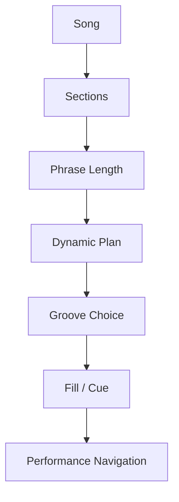
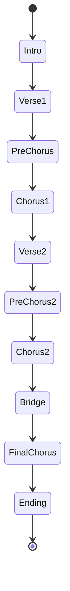
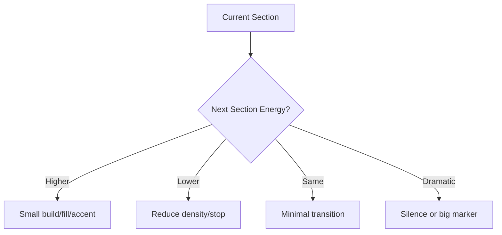
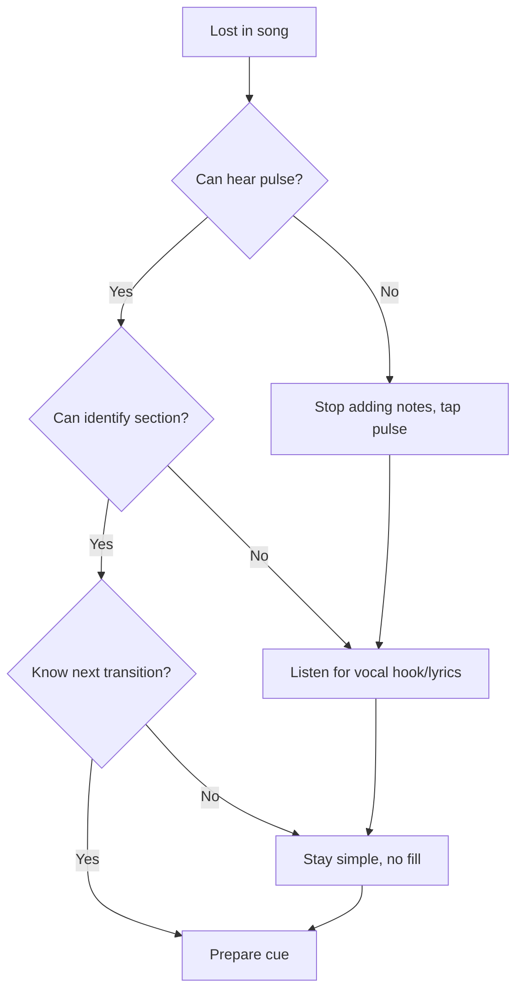

# learn-drum-cajon-part-013.md

# Part 013 — Song Form: Intro, Verse, Pre-Chorus, Chorus, Bridge, Ending

## Status Seri

- Seri: `learn-drum-cajon`
- Part: `013`
- Topik: Song form dan navigasi struktur lagu
- Target akhir seri: mampu mengiringi penyanyi dengan drum dan/atau cajon secara stabil, musikal, dan sadar konteks
- Status: seri belum selesai
- Part sebelumnya: `learn-drum-cajon-part-012.md`
- Part berikutnya: `learn-drum-cajon-part-014.md`

---

## Tujuan Part Ini

Part ini membahas skill yang sering diremehkan oleh pemula: **tahu posisi lagu**. Banyak pemain drum/cajon bisa memainkan groove, tetapi gagal saat mengiringi karena tidak tahu kapan masuk, kapan naik, kapan berhenti, kapan fill, dan kapan ending.

Setelah menyelesaikan part ini, kamu harus mampu:

1. memahami fungsi intro, verse, pre-chorus, chorus, bridge, instrumental, tag, dan ending,
2. menghitung phrase 4 bar dan 8 bar,
3. membuat song map sederhana,
4. membaca cue dari penyanyi atau pemain lain,
5. menentukan groove per section,
6. menentukan dynamic level per section,
7. menentukan fill/accent yang aman,
8. tidak tersesat saat lagu berjalan,
9. recover jika salah hitung,
10. membuat chart sederhana untuk drum/cajon accompaniment.

---

# 1. Kenapa Song Form Penting?

Groove yang bagus tidak cukup jika kamu tidak tahu struktur lagu.

Contoh masalah:

- groove stabil, tetapi masuk chorus terlambat,
- fill bagus, tetapi dimainkan di tengah verse,
- crash dimainkan bukan di awal section,
- bridge datang tetapi kamu tetap chorus groove,
- ending berhenti mendadak karena tidak tahu cue,
- penyanyi mengulang chorus tetapi kamu sudah berhenti.

Song form adalah peta.



Tanpa peta, kamu hanya berjalan sambil berharap tidak tersesat.

---

# 2. Song Form sebagai State Machine

Sebagai software engineer, pikirkan lagu sebagai state machine.



Setiap state punya:

- groove,
- dynamic level,
- density,
- texture,
- fill rule,
- cue keluar,
- risiko error.

Contoh:

| Section | Role | Drum/Cajon Strategy |
|---|---|---|
| Intro | setup mood | diam/light |
| Verse | cerita/lirik | sparse |
| Pre-Chorus | build | naik sedikit |
| Chorus | hook | lebih besar |
| Bridge | kontras | drop/build/half-time |
| Final Chorus | puncak | terbesar |
| Ending | closure | stop/ring/tag |

---

# 3. Section Umum dalam Lagu

## 3.1 Intro

Intro adalah awal lagu sebelum vokal utama masuk.

Fungsi intro:

- menetapkan tempo,
- menetapkan mood,
- memberi penyanyi tempat masuk,
- memperkenalkan motif,
- memberi audience konteks.

Strategi drum/cajon:

| Intro Type | Strategy |
|---|---|
| vocal pickup | diam atau count-in sangat halus |
| gitar/piano intro | touch/hi-hat ringan |
| full band intro | basic groove |
| chorus-like intro | groove lebih besar |
| rubato intro | jangan masuk sampai tempo jelas |

Kesalahan umum:

- masuk terlalu cepat,
- terlalu ramai dari awal,
- crash tanpa alasan,
- tidak tahu kapan vokal masuk.

---

## 3.2 Verse

Verse biasanya bagian cerita. Lirik penting. Energi biasanya lebih kecil daripada chorus.

Fungsi verse:

- menyampaikan narasi,
- membangun mood,
- memberi ruang vokal,
- mempersiapkan chorus.

Strategi:

- sparse groove,
- volume level 1–2,
- fill minimal,
- no crash,
- dengarkan vocal phrasing.

Drum:

```text
closed hi-hat / light backbeat / simple kick
```

Cajon:

```text
bass soft / slap soft / touch sparse
```

---

## 3.3 Pre-Chorus

Pre-chorus adalah jembatan menuju chorus. Tidak semua lagu punya pre-chorus.

Fungsi:

- menaikkan tension,
- memperjelas arah ke chorus,
- menambah energi,
- memberi rasa “sebentar lagi hook”.

Strategi:

- tambah density sedikit,
- touch/hi-hat lebih aktif,
- kick/bass sedikit lebih bergerak,
- fill pendek menuju chorus,
- jangan langsung sebesar chorus.


---

## 3.4 Chorus

Chorus adalah hook utama. Biasanya bagian paling mudah diingat.

Fungsi:

- membawa pesan utama,
- memberi lift,
- menjadi titik energi lagu,
- sering diulang.

Strategi:

- backbeat lebih jelas,
- volume level 3–4,
- kick/bass lebih aktif,
- crash/accent di awal chorus jika cocok,
- tetap jaga vokal.

Kesalahan umum:

- chorus rush,
- terlalu banyak fill,
- cymbal/slap menutup vokal,
- semua chorus dimainkan sama tanpa perkembangan.

---

## 3.5 Verse 2

Verse 2 sering kembali lebih kecil dari chorus, tetapi tidak selalu sekecil verse 1.

Strategi:

- kembali turun,
- tetapi bisa tambah sedikit movement,
- jangan langsung full chorus energy,
- tetap beri ruang.

Contoh dynamic:

```text
Verse 1: level 2
Chorus 1: level 6
Verse 2: level 3
Chorus 2: level 7
```

---

## 3.6 Bridge

Bridge adalah bagian kontras.

Fungsi bridge:

- memberi variasi,
- memecah repetisi,
- membuat final chorus lebih berdampak,
- memberi perspektif emosional baru.

Bridge bisa:

1. drop,
2. build,
3. half-time,
4. instrumental,
5. breakdown,
6. silence/tension.

Strategi drum/cajon:

| Bridge Type | Strategy |
|---|---|
| Drop | kurangi density, maybe silence |
| Build | naik bertahap |
| Half-time | snare/slap terasa di 3 |
| Instrumental | boleh sedikit lebih aktif |
| Breakdown | rhythm minimal |
| Emotional | jangan overplay |

---

## 3.7 Instrumental / Interlude

Bagian tanpa vokal, sering setelah chorus atau sebelum verse.

Fungsi:

- memberi napas,
- transisi,
- solo pendek,
- motif musik.

Strategi:

- boleh sedikit lebih aktif karena tidak ada vokal,
- tetap jangan kehilangan form,
- siapkan masuk vokal berikutnya,
- fill tetap harus mengarah.

---

## 3.8 Tag

Tag adalah pengulangan pendek, biasanya bagian akhir chorus atau frasa terakhir.

Contoh:

```text
ulang 2 bar terakhir chorus
ulang kalimat terakhir 2x
```

Strategi:

- dengarkan cue leader,
- jangan langsung ending,
- jaga groove,
- bisa turunkan atau naikkan sesuai konteks.

---

## 3.9 Ending

Ending harus jelas.

Jenis ending:

| Ending Type | Penjelasan | Strategy |
|---|---|---|
| Stop ending | semua berhenti bersama | cue jelas |
| Ring out | chord/suara terakhir dibiarkan | crash/accent lalu diam |
| Fade-like | energi turun | kurangi density |
| Tag ending | ulang phrase | ikuti repeat |
| Ritardando | tempo melambat | ikuti leader |
| Button ending | accent pendek final | stop tegas |

Kesalahan umum:

- tidak tahu ending type,
- fill terlalu panjang sebelum ending,
- crash terlambat,
- berhenti sendiri,
- tidak mengikuti penyanyi.

---

# 4. Phrase: 4 Bar dan 8 Bar

Banyak lagu pop bergerak dalam phrase 4 atau 8 bar.

## 4.1 Counting 4 Bar

```text
Bar 1: 1 2 3 4
Bar 2: 2 2 3 4
Bar 3: 3 2 3 4
Bar 4: 4 2 3 4
```

Atau:

```text
1 2 3 4 | 2 2 3 4 | 3 2 3 4 | 4 2 3 4
```

## 4.2 Counting 8 Bar

```text
1 2 3 4 | 2 2 3 4 | 3 2 3 4 | 4 2 3 4 |
5 2 3 4 | 6 2 3 4 | 7 2 3 4 | 8 2 3 4
```

Fill sering muncul di:

- bar 4,
- bar 8,
- sebelum chorus,
- sebelum bridge,
- sebelum ending.

---

# 5. Phrase Awareness Drill

## Drill 1 — Clap Every Bar 1

Metronome 70 BPM.

1. Hitung 4 bar.
2. Tepuk hanya beat 1 setiap bar.
3. Di bar ke-4, tepuk lebih kuat.

```text
Bar 1: X - - -
Bar 2: X - - -
Bar 3: X - - -
Bar 4: X! - - -
```

## Drill 2 — Fill at Bar 4

```text
Bar 1: groove
Bar 2: groove
Bar 3: groove
Bar 4: fill
Bar 5: kembali groove
```

## Drill 3 — No Fill Until Bar 8

Latih menahan diri.

```text
Bar 1-7: groove saja
Bar 8: fill kecil
Bar 9: new section
```

Tujuan:

> Kamu belajar bahwa fill adalah navigasi form, bukan kebiasaan tiap dua bar.

---

# 6. Song Map

Song map adalah peta struktur lagu.

Format sederhana:

```md
# Song Map

Title:
Tempo:
Meter:
Key:
Mood:

Intro: 4 bar
Verse 1: 8 bar
Pre-Chorus: 4 bar
Chorus 1: 8 bar
Verse 2: 8 bar
Pre-Chorus 2: 4 bar
Chorus 2: 8 bar
Bridge: 8 bar
Final Chorus: 8 bar
Ending: stop
```

Untuk drummer/cajon player, tambahkan:

```md
Groove:
Dynamic:
Fill:
Cue:
Risk:
```

---

# 7. Drum/Cajon Section Plan

Template:

```md
## Section Plan

| Section | Bars | Groove | Dynamic | Texture | Fill/Cue | Notes |
|---|---:|---|---:|---|---|---|
| Intro | | | | | | |
| Verse 1 | | | | | | |
| Pre | | | | | | |
| Chorus | | | | | | |
| Verse 2 | | | | | | |
| Bridge | | | | | | |
| Final | | | | | | |
| Ending | | | | | | |
```

Contoh:

```md
| Verse 1 | 8 | sparse 4/4 | 2 | closed hat / light touch | no fill | vocal clear |
| Pre | 4 | basic build | 4 | more subdivision | small fill bar 4 | prepare chorus |
| Chorus | 8 | stronger 4/4 | 6 | full backbeat | crash/accent beat 1 | do not rush |
```

---

# 8. Cue: Sinyal Masuk, Naik, Turun, Berhenti

Cue bisa datang dari:

- penyanyi,
- guitarist,
- pianist,
- bassist,
- worship leader,
- conductor,
- lyric,
- chord change,
- body movement,
- eye contact.

## 8.1 Cue dari Penyanyi

Penyanyi bisa memberi cue lewat:

- napas besar,
- gerakan tangan,
- mata,
- mendekat/menjauh mic,
- mengulang lirik,
- berhenti bernyanyi,
- memperpanjang kata.

## 8.2 Cue dari Gitar/Piano

Cue umum:

- chord progression menuju chorus,
- strumming lebih besar,
- stop sebelum chorus,
- arpeggio intro selesai,
- ritardando,
- final chord shape.

## 8.3 Cue dari Lirik

Gunakan lyric anchor:

```md
Verse ends at: "..."
Chorus starts at: "..."
Bridge cue: "..."
Ending cue: repeat "..."
```

Lyric anchor sangat berguna jika kamu belum lancar membaca chart.

---

# 9. Count-In

Count-in memberi tempo sebelum lagu mulai.

Contoh count-in 4/4:

```text
1 2 3 4
```

Atau:

```text
1 2, 1 2 3 4
```

Untuk lagu lambat, count-in harus sesuai feel.

6/8:

```text
1 2 3 4 5 6
```

atau cukup dua pulse besar:

```text
1 ... 4 ...
```

Count-in buruk bisa membuat semua orang masuk dengan feel salah.

Rule:

> Count-in harus memberi tempo, meter, dan energi awal.

---

# 10. Masuk Setelah Intro

Masalah umum: tidak tahu kapan drum/cajon masuk.

Pilihan masuk:

| Entry Type | Strategy |
|---|---|
| dari awal | count-in lalu groove |
| setelah 2 bar | dengar phrase intro |
| saat vokal masuk | soft support |
| saat pre-chorus | build |
| saat chorus | strong entrance |
| setelah rubato | tunggu tempo jelas |

Jika intro rubato, jangan paksa click imajiner sampai penyanyi/pemain chordal menetapkan tempo.

---

# 11. Section Transition

Transisi antar section bisa dibuat dengan:

- fill,
- crash,
- open hi-hat,
- stronger slap,
- stop,
- silence,
- bass/kick pickup,
- cymbal swell,
- density change.



Jangan selalu fill. Kadang transisi terbaik adalah mengurangi.

---

# 12. Recovery Jika Tersesat

Semua pemain pernah tersesat. Skill penting adalah recover.

## 12.1 Jangan Berhenti Mendadak

Jika salah, jangan langsung berhenti kecuali semua berhenti.

Lakukan:

1. sederhanakan pattern,
2. cari pulse,
3. dengar vokal,
4. cari beat 1 berikutnya,
5. kembali ke backbeat,
6. hindari fill sampai yakin.

## 12.2 Anchor Recovery

Anchor utama:

- beat 1,
- backbeat 2 dan 4,
- lyric cue,
- chord change,
- chorus hook,
- final line.

## 12.3 Emergency Pattern

Drum:

```text
Kick  : 1 dan 3
Snare : 2 dan 4
Hat   : optional
```

Cajon:

```text
Bass  : 1 dan 3
Slap  : 2 dan 4
Touch : optional
```

Jika tersesat, kembali ke skeleton.

---

# 13. Form Debugging



Rule:

> Saat tidak yakin form, jangan fill. Groove sederhana lebih aman.

---

# 14. Chart Sederhana untuk Drum/Cajon

Kamu tidak perlu notasi penuh untuk mulai. Gunakan shorthand.

## 14.1 Simbol

| Simbol | Arti |
|---|---|
| V | Verse |
| PC | Pre-Chorus |
| C | Chorus |
| B | Bridge |
| Int | Intro/Interlude |
| Tag | Repeat ending phrase |
| Stop | berhenti |
| Fill | fill pendek |
| Build | naik |
| Drop | turun |
| x4 | 4 bar |
| x8 | 8 bar |

## 14.2 Contoh Chart

```text
Intro x4: touch only
V1 x8: sparse, no fill
PC x4: build, fill bar 4
C1 x8: stronger, crash/accent beat 1
V2 x8: sparse + touch
PC x4: build
C2 x8: stronger
Bridge x8: drop first 4, build next 4
Final C x8: biggest
Ending: stop on final word
```

---

# 15. Chart dengan Lyric Anchor

```md
# Song Chart with Lyric Anchors

Intro x4
V1 x8 — starts "..."
PC x4 — starts "..."
C x8 — hook "..."
V2 x8 — starts "..."
Bridge x8 — lyric "..."
Final C x8
Ending — stop on "..."
```

Lyric anchor sangat berguna untuk accompaniment penyanyi karena kamu bisa mendengar posisi lagu tanpa menghitung terus-menerus secara kaku.

---

# 16. Drum/Cajon Arrangement Example

## 16.1 Lagu 4/4 Pop Acoustic

```md
Title:
Meter: 4/4
Tempo: medium slow
Mood: intimate → uplifting

Intro x4:
- cajon touch only / drum closed hat light
- level 1

Verse 1 x8:
- sparse groove
- level 2
- no fill

Pre-Chorus x4:
- add touch/hat density
- level 4
- small fill in bar 4

Chorus 1 x8:
- basic pop stronger
- level 6
- accent beat 1
- no extra fill over vocal hook

Verse 2 x8:
- reset to level 3
- slightly more active than verse 1

Chorus 2 x8:
- level 7

Bridge x8:
- first 4 bars drop
- next 4 build

Final Chorus x8:
- level 8–9
- stronger groove
- fill only at phrase end

Ending:
- stop with vocalist
```

---

# 17. Latihan: Membuat Song Map dari Lagu Nyata

Langkah:

1. Pilih satu lagu.
2. Dengarkan tanpa bermain.
3. Tulis section.
4. Hitung bar tiap section.
5. Tulis lyric anchor.
6. Tentukan dynamic level.
7. Tentukan groove.
8. Tentukan fill/accent.
9. Main dengan lagu.
10. Rekam dan revisi chart.

---

# 18. Latihan: Section Counting

Pilih metronome 70 BPM.

Latihan:

```text
8 bar verse
4 bar pre
8 bar chorus
```

Main skeleton groove. Ucapkan section:

```text
Verse 1...
Bar 1...
Bar 2...
...
Pre...
Chorus...
```

Tujuan:

- membangun navigasi internal,
- tidak hanya mengikuti backing track.

---

# 19. Latihan: Cue Response

Minta teman memberi cue tangan, atau gunakan simulasi sendiri.

Cue:

- tangan naik = build,
- tangan turun = drop,
- tangan mengepal = stop,
- menunjuk = masuk,
- dua jari = ulang 2 bar.

Jika latihan sendiri:

1. tulis cue di chart,
2. main lagu,
3. ikuti cue tertulis,
4. rekam.

---

# 20. Common Mistakes

## 20.1 Tidak Menghitung Bar

Gejala:

- fill acak,
- chorus masuk salah,
- ending kacau.

Correction:

- count 4/8 bar,
- buat chart,
- lyric anchor.

## 20.2 Semua Transisi Diisi Fill

Gejala:

- lagu terlalu ramai,
- vokal terganggu,
- fill kehilangan makna.

Correction:

- gunakan silence/drop/accent,
- fill hanya saat membantu.

## 20.3 Tidak Tahu Ending

Gejala:

- berhenti beda waktu,
- crash terlambat,
- penyanyi bingung.

Correction:

- sepakati ending sebelum main,
- tulis ending type di chart.

## 20.4 Masuk Terlalu Awal

Gejala:

- intro belum selesai,
- penyanyi belum siap.

Correction:

- hitung intro,
- tunggu cue,
- gunakan lyric/chord anchor.

## 20.5 Tidak Recovery Saat Salah

Gejala:

- berhenti,
- panik,
- fill random.

Correction:

- emergency skeleton,
- dengar vokal,
- cari beat 1.

---

# 21. Debugging Guide

| Gejala | Penyebab Kemungkinan | Correction |
|---|---|---|
| Miss chorus | tidak tahu phrase | count 8 bar |
| Fill salah tempat | no section map | chart fill points |
| Ending kacau | ending tidak disepakati | define ending type |
| Bridge berantakan | tidak tahu role bridge | drop/build decision |
| Tersesat | terlalu banyak note | emergency skeleton |
| Masuk salah | intro tidak dihitung | count intro bars |
| Chorus tidak naik | dynamic map tidak ada | assign energy levels |
| Vokal terganggu | fill over lyric | use lyric anchors |
| Band tidak lock | cue tidak jelas | agree count-in/cues |

---

# 22. Practice Protocol 30 Menit

## Sesi Form Awareness

| Durasi | Latihan |
|---:|---|
| 5 menit | dengarkan lagu |
| 5 menit | tulis section |
| 5 menit | hitung bar |
| 5 menit | lyric anchor |
| 5 menit | dynamic map |
| 5 menit | play simplified |

## Sesi Section Navigation

| Durasi | Latihan |
|---:|---|
| 5 menit | 8 bar verse |
| 5 menit | 4 bar pre |
| 5 menit | 8 bar chorus |
| 5 menit | bridge drop/build |
| 5 menit | ending |
| 5 menit | record/review |

## Sesi Recovery

| Durasi | Latihan |
|---:|---|
| 5 menit | basic groove |
| 5 menit | intentionally stop touch/hat |
| 5 menit | return to skeleton |
| 5 menit | find beat 1 |
| 5 menit | no fill when unsure |
| 5 menit | review |

---

# 23. Self-Scoring Rubric

Nilai 1–5.

| Area | 1 | 3 | 5 |
|---|---|---|---|
| Section recognition | bingung | cukup | jelas |
| Bar counting | sering hilang | bisa 4 bar | bisa 8/16 bar |
| Chart making | tidak ada | sederhana | lengkap |
| Cue reading | tidak peka | cukup | responsif |
| Transition | acak | cukup | musikal |
| Ending | sering kacau | cukup | jelas |
| Recovery | panik | bisa kembali | tenang |
| Vocal awareness | menabrak | cukup | peka |

Target:

- minimal 3 semua area,
- minimal 4 untuk chart dan recovery.

---

# 24. Mini Capstone Part Ini

Pilih satu lagu. Buat chart lengkap:

```md
Title:
Tempo:
Meter:

Intro:
Verse 1:
Pre:
Chorus:
Verse 2:
Pre:
Chorus:
Bridge:
Final Chorus:
Ending:

Dynamic Map:
Groove Map:
Fill Points:
Cue Points:
Lyric Anchors:
Risk Areas:
```

Lalu rekam 2–3 menit mengiringi lagu tersebut dengan drum/cajon/substitute.

Review:

| Pertanyaan | Ya/Tidak |
|---|---|
| Section tidak terlewat? | |
| Fill hanya di tempat yang perlu? | |
| Chorus masuk tepat? | |
| Dynamic mengikuti form? | |
| Ending jelas? | |
| Recovery aman jika salah? | |
| Vokal tetap jadi pusat? | |

---

# 25. Acceptance Criteria Part Ini

Kamu boleh lanjut ke Part 014 jika:

1. bisa menjelaskan fungsi intro, verse, pre-chorus, chorus, bridge, ending,
2. bisa menghitung phrase 4 bar dan 8 bar,
3. bisa membuat song map sederhana,
4. bisa membuat drum/cajon section plan,
5. bisa menentukan fill point,
6. bisa menentukan dynamic level per section,
7. bisa menjelaskan ending type,
8. bisa menggunakan emergency skeleton saat tersesat,
9. bisa mengiringi satu lagu dengan chart sederhana.

---

# 26. Ringkasan

Song form adalah peta. Tanpa peta, groove bagus tetap bisa salah tempat.

Skill utama:

- tahu section,
- hitung phrase,
- baca cue,
- buat chart,
- tentukan dynamic,
- tentukan fill,
- tahu ending,
- recover saat salah.

Sebagai drummer/cajon player, kamu bukan hanya memainkan rhythm. Kamu membantu lagu berpindah state dengan jelas.

Rule paling penting:

> Jika kamu tidak tahu posisi lagu, sederhanakan. Jangan fill saat tersesat.

---

# 27. Latihan untuk Part Berikutnya

Sebelum lanjut ke Part 014, lakukan:

1. Buat song map untuk satu lagu.
2. Hitung bar tiap section.
3. Tandai fill point.
4. Tandai lyric anchor.
5. Tentukan dynamic level.
6. Latih emergency skeleton.
7. Rekam dan cek:
   - apakah kamu tahu posisi lagu?
   - apakah fill terlalu banyak?
   - apakah ending jelas?

Part berikutnya membahas:

> fill sebagai transisi, bukan pamer: fill 1 beat, 2 beat, 1 bar, silence fill, drum fill, cajon fill, dan cara kembali ke groove tanpa merusak tempo.
