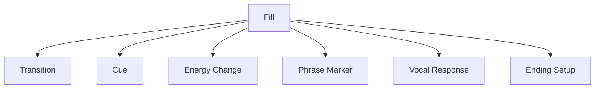
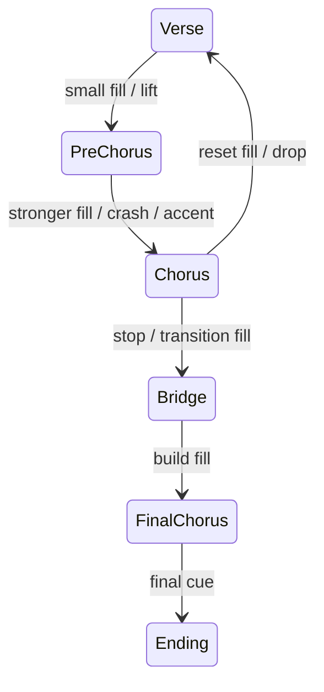
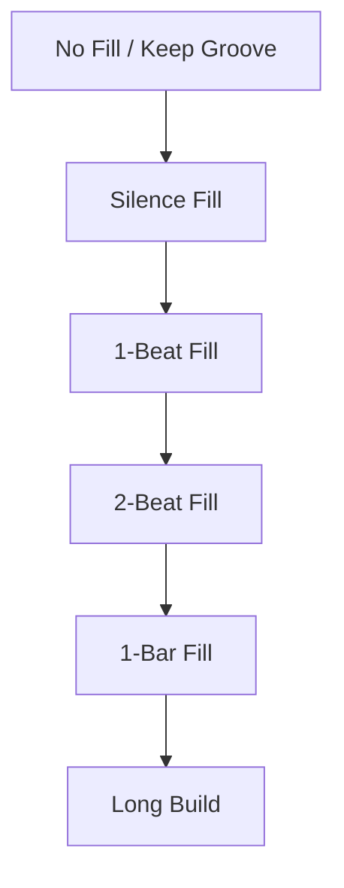
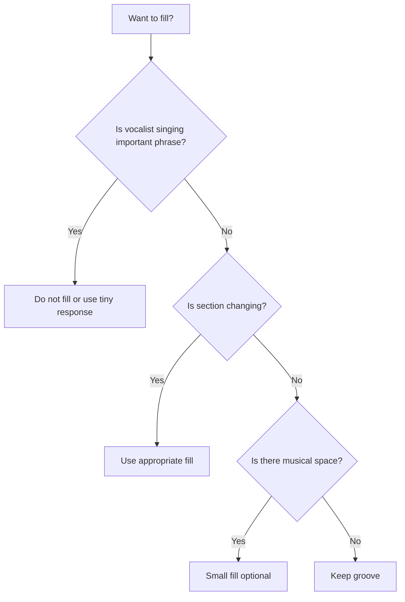
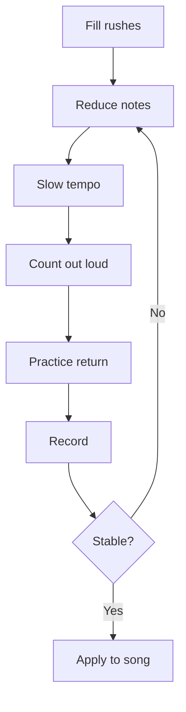

# learn-drum-cajon-part-014.md

# Part 014 — Fill: Transisi, Bukan Pamer

## Status Seri

- Seri: `learn-drum-cajon`
- Part: `014`
- Topik: Fill sebagai alat transisi
- Target akhir seri: mampu mengiringi penyanyi dengan drum dan/atau cajon secara stabil, musikal, dan sadar konteks
- Status: seri belum selesai
- Part sebelumnya: `learn-drum-cajon-part-013.md`
- Part berikutnya: `learn-drum-cajon-part-015.md`

---

## Tujuan Part Ini

Part ini membahas fill. Fill sering menjadi bagian yang paling menggoda bagi pemula, tetapi juga paling sering merusak lagu. Dalam accompaniment, fill bukan tempat pamer. Fill adalah alat komunikasi.

Setelah menyelesaikan part ini, kamu harus mampu:

1. memahami fungsi fill sebagai transisi,
2. membedakan fill musikal dan fill ego,
3. memainkan fill 1 beat,
4. memainkan fill 2 beat,
5. memainkan fill 1 bar sederhana,
6. memainkan fill drum kit dan cajon,
7. memakai silence sebagai fill,
8. menghindari fill di atas vokal penting,
9. kembali ke groove setelah fill,
10. menjaga tempo agar tidak rush saat fill.

---

# 1. Definisi Fill

Fill adalah variasi rhythm pendek yang biasanya digunakan untuk:

- menandai akhir phrase,
- menuju section baru,
- menaikkan energi,
- menurunkan energi,
- memberi cue,
- mengisi ruang setelah frase vokal,
- memberi closure sebelum ending.

Fill bukan:

- hiasan random,
- solo mini setiap 2 bar,
- bukti kemampuan teknik,
- tempat melampiaskan kebosanan,
- pengganti groove yang stabil.



---

# 2. Fill sebagai State Transition

Lagu bergerak dari satu state ke state lain:



Fill yang baik memberi informasi:

- “chorus akan masuk”,
- “energi naik”,
- “bagian turun”,
- “kita berhenti”,
- “phrase selesai”,
- “ulang lagi”.

Fill buruk tidak memberi informasi dan hanya mengganggu.

---

# 3. Hierarki Fill untuk Pemula

Mulai dari yang paling aman.



Untuk 20 jam pertama, prioritas:

1. no fill,
2. silence fill,
3. 1-beat fill,
4. 2-beat fill,
5. 1-bar fill sederhana.

Tunda:

- fill cepat,
- fill linear kompleks,
- tom run panjang,
- 16th note high-speed,
- odd grouping,
- gospel chops,
- flashy cajon rolls.

---

# 4. Rule Utama Fill

## 4.1 Fill Harus Kembali ke Beat 1

Fill yang tidak kembali ke beat 1 adalah risiko besar.

```text
Bar 4: fill
Bar 5 beat 1: new section
```

Jika beat 1 hilang, penyanyi dan pemain lain terganggu.

## 4.2 Fill Jangan Menabrak Vokal Penting

Jangan fill di atas:

- kata kunci,
- nada tinggi,
- akhir kalimat emosional,
- lyric hook,
- bagian sangat intimate.

Lebih aman fill:

- setelah frase vokal selesai,
- di bar terakhir sebelum chorus,
- saat ada ruang instrumental,
- setelah penyanyi mengambil napas.

## 4.3 Fill Harus Sesuai Dinamika

Verse soft tidak butuh fill besar.

Chorus besar boleh butuh fill lebih kuat.

Bridge drop mungkin butuh silence, bukan fill ramai.

## 4.4 Fill Harus Sesuai Skill Saat Ini

Jika fill membuat tempo goyah, fill itu belum siap.

Rule:

> Fill sederhana tepat waktu lebih baik daripada fill keren yang membuat lagu rusak.

---

# 5. Fill Placement

## 5.1 Akhir 4 Bar

```text
Bar 1: groove
Bar 2: groove
Bar 3: groove
Bar 4: fill
Bar 5: next phrase
```

## 5.2 Akhir 8 Bar

```text
Bar 1-7: groove
Bar 8: fill
Bar 9: next section
```

## 5.3 Sebelum Chorus

Fill memberi lift.

## 5.4 Sebelum Bridge

Fill bisa memberi kontras atau stop.

## 5.5 Sebelum Ending

Fill harus mengikuti ending type.

Jangan fill hanya karena kamu bosan.

---

# 6. Silence Fill

Silence fill adalah berhenti sejenak sebagai transisi.

Contoh 4/4:

```text
Count : 1 & 2 & 3 & 4 &
Groove: X x X x X x - -
Next  : 1
```

Atau:

```text
Bar 4 beat 4: stop
Bar 5 beat 1: chorus accent
```

Silence fill sangat efektif untuk:

- masuk chorus,
- bridge drop,
- ending,
- dramatic lyric,
- acoustic arrangement.

## Drill — Silence Fill

Tempo: 70 BPM.

```text
Bar 1: groove
Bar 2: groove
Bar 3: groove
Bar 4: stop on beat 4
Bar 5: groove/accent
```

Acceptance:

- tetap hitung saat diam,
- masuk beat 1 tepat,
- tidak panik.

---

# 7. Fill 1 Beat

Fill 1 beat adalah fill paling aman setelah silence.

Biasanya dimainkan di beat 4 sebelum section baru.

## 7.1 Drum Fill 1 Beat

### Fill A — Snare 8th

```text
Count : 1 & 2 & 3 & 4 &
Fill  :             S S
```

### Fill B — Snare-Tom

```text
Count : 1 & 2 & 3 & 4 &
Fill  :             S T
```

### Fill C — Two Snare Hits then Crash

```text
Bar 4: beat 4 & = S S
Bar 5: beat 1 = Crash + groove
```

## 7.2 Cajon Fill 1 Beat

### Fill A — Double Slap

```text
Count : 1 & 2 & 3 & 4 &
Fill  :             S S
```

### Fill B — Bass Slap

```text
Count : 1 & 2 & 3 & 4 &
Fill  :             B S
```

### Fill C — Touch Slap

```text
Count : 1 & 2 & 3 & 4 &
Fill  :             t S
```

## 7.3 Drill Fill 1 Beat

```text
Bar 1-3: groove
Bar 4: groove until beat 3, fill at 4 &
Bar 5: return groove
```

Acceptance:

- beat 1 bar 5 tepat,
- fill tidak rush,
- volume sesuai section.

---

# 8. Fill 2 Beat

Fill 2 beat biasanya dimainkan di beat 3 dan 4.

## 8.1 Drum Fill 2 Beat

### Fill A — Snare 8th Notes

```text
Count : 1 & 2 & 3 & 4 &
Fill  :         S S S S
```

### Fill B — Snare to Tom

```text
Count : 1 & 2 & 3 & 4 &
Fill  :         S S T T
```

### Fill C — Snare Tom Floor

```text
Count : 1 & 2 & 3 & 4 &
Fill  :         S T T F
```

## 8.2 Cajon Fill 2 Beat

### Fill A — Slap Touch Slap Touch

```text
Count : 1 & 2 & 3 & 4 &
Fill  :         S t S t
```

### Fill B — Bass Slap Bass Slap

```text
Count : 1 & 2 & 3 & 4 &
Fill  :         B S B S
```

### Fill C — Touch Touch Bass Slap

```text
Count : 1 & 2 & 3 & 4 &
Fill  :         t t B S
```

## 8.3 Drill Fill 2 Beat

Tempo: 60–70 BPM.

```text
Bar 1: groove
Bar 2: groove
Bar 3: groove
Bar 4: fill on beats 3 and 4
Bar 5: next section
```

Acceptance:

- tidak mempercepat,
- tidak terlalu keras kecuali menuju chorus besar,
- beat 1 bar berikutnya solid.

---

# 9. Fill 1 Bar

Fill 1 bar lebih berisiko. Pakai jika:

- groove dasar stabil,
- phrase memang butuh transisi besar,
- tidak ada vokal penting,
- kamu bisa kembali ke beat 1.

## 9.1 Drum Fill 1 Bar Sederhana

### Fill A — All Snare 8th

```text
Count : 1 & 2 & 3 & 4 &
Fill  : S S S S S S S S
```

### Fill B — Snare to Tom

```text
Count : 1 & 2 & 3 & 4 &
Fill  : S S S S T T T T
```

### Fill C — Down the Toms

```text
Count : 1 & 2 & 3 & 4 &
Fill  : S S T T T T F F
```

## 9.2 Cajon Fill 1 Bar

### Fill A — Bass Slap Alternating

```text
Count : 1 & 2 & 3 & 4 &
Fill  : B S B S B S B S
```

### Fill B — Touch Build to Slap

```text
Count : 1 & 2 & 3 & 4 &
Fill  : t t t t B t S S
```

### Fill C — Sparse Dramatic

```text
Count : 1 & 2 & 3 & 4 &
Fill  : B   -   S   - 
```

## 9.3 Rule

Untuk 20 jam pertama, fill 1 bar harus tetap sederhana. Jangan gunakan jika 1-beat dan 2-beat fill belum stabil.

---

# 10. Fill 6/8

Fill 6/8 harus mengikuti feel:

```text
1 2 3 4 5 6
```

## 10.1 6/8 Fill Minimal

Drum:

```text
Count : 1 2 3 4 5 6
Fill  :       S S S
```

Cajon:

```text
Count : 1 2 3 4 5 6
Fill  :       t t S
```

## 10.2 6/8 Fill Full Bar

Drum:

```text
Count : 1 2 3 4 5 6
Fill  : S S S T T T
```

Cajon:

```text
Count : 1 2 3 4 5 6
Fill  : B t S B t S
```

## 10.3 Risiko

- membuat 6/8 terasa seperti 4/4,
- rush ke beat 1,
- terlalu banyak note di lagu lambat.

Rule:

> Di 6/8, rasakan dua gelombang: 1-2-3 dan 4-5-6.

---

# 11. Fill dan Dynamics

Fill harus mengikuti energi section.

## 11.1 Menuju Chorus

Boleh:

- sedikit lebih kuat,
- fill 1–2 beat,
- crash/accent di beat 1,
- cajon slap lebih tegas.

## 11.2 Menuju Verse

Biasanya:

- fill lebih kecil,
- bisa silence,
- energi reset.

## 11.3 Menuju Bridge Drop

Sering lebih baik:

- stop,
- silence,
- fill pendek,
- cymbal choke,
- cajon muted stop.

## 11.4 Menuju Final Chorus

Boleh:

- fill lebih besar,
- build,
- tom/cajon roll sederhana,
- tetapi tetap jangan rush.

---

# 12. Fill dan Vokal

## 12.1 Vocal-Safe Fill Rule

Gunakan rule:



## 12.2 Fill Setelah Frase

Lebih aman:

```text
Vokal selesai frase → fill kecil → section baru
```

Bukan:

```text
fill di tengah kata penting
```

## 12.3 Respons, Bukan Gangguan

Fill bisa seperti respons percakapan. Jika penyanyi sedang bicara, jangan menyela.

---

# 13. Return-to-Groove

Ini skill paling penting dalam fill.

Latihan:

```text
Groove → Fill → Groove
```

Bukan hanya:

```text
Fill
```

Pemula sering melatih fill secara terpisah, lalu gagal saat menghubungkan ke groove.

## 13.1 Return Drill

Tempo 70 BPM.

```text
Bar 1: groove
Bar 2: groove
Bar 3: groove
Bar 4: fill
Bar 5: groove
```

Ulang 10 kali dengan fill yang sama.

Acceptance:

- bar 5 beat 1 tepat,
- groove setelah fill tidak berubah tempo,
- tubuh tetap rileks.

---

# 14. Fill Timing: Jangan Rush

Fill sering rush karena:

- tangan bergerak lebih cepat,
- pattern belum familiar,
- tubuh tegang,
- ingin segera selesai,
- tidak menghitung,
- fill terlalu banyak note.

Correction:

1. kurangi jumlah note,
2. turunkan tempo,
3. hitung keras,
4. gunakan metronome,
5. latihan fill + return,
6. rekam.



---

# 15. Fill Vocabulary Minimum

## 15.1 Drum Kit Fill Vocabulary

| Fill | Count | Use |
|---|---|---|
| Snare 4& | `4 &` | small transition |
| Snare-Tom | `4 &` | small lift |
| Snare 3&4& | `3 & 4 &` | medium transition |
| Snare-Tom-Floor | `3 & 4 &` | chorus entry |
| All snare 1 bar | full bar | build |
| Silence | beat 4 stop | dramatic |

## 15.2 Cajon Fill Vocabulary

| Fill | Count | Use |
|---|---|---|
| Double slap | `4 &` | small transition |
| Bass-slap | `4 &` | lift |
| Touch-slap | `4 &` | soft transition |
| B S B S | `3 & 4 &` | medium |
| t t B S | `3 & 4 &` | build |
| Silence | stop | dramatic/drop |

---

# 16. Fill Placement Practice Map

Latihan 16 bar:

```text
Bar 1-3: groove
Bar 4: small fill
Bar 5-7: groove
Bar 8: medium fill
Bar 9-11: groove softer
Bar 12: silence fill
Bar 13-15: groove bigger
Bar 16: ending fill
```

Tujuan:

- fill punya fungsi berbeda,
- bukan semua fill sama,
- dynamics mengikuti form.

---

# 17. Fill Decision Matrix

| Situation | Fill Choice |
|---|---|
| Verse to verse | no fill / tiny fill |
| Verse to pre | small fill |
| Pre to chorus | medium fill/accent |
| Chorus to verse | reset fill / silence |
| Chorus to bridge drop | stop/silence |
| Bridge to final chorus | build fill |
| Ending stop | short cue |
| Vocal phrase important | no fill |
| Unsure form | no fill |
| Tempo unstable | no fill |

---

# 18. Practice Protocol 30 Menit

## Sesi Fill Foundation

| Durasi | Latihan |
|---:|---|
| 5 menit | groove only |
| 5 menit | silence fill |
| 5 menit | 1-beat fill |
| 5 menit | 2-beat fill |
| 5 menit | return-to-groove |
| 5 menit | record/review |

## Sesi Drum/Cajon Fill Application

| Durasi | Latihan |
|---:|---|
| 5 menit | choose one fill |
| 5 menit | repeat every 4 bars |
| 5 menit | repeat every 8 bars |
| 5 menit | verse to chorus |
| 5 menit | chorus to bridge |
| 5 menit | review timing |

## Sesi Vocal-Safe Fill

| Durasi | Latihan |
|---:|---|
| 5 menit | listen to song |
| 5 menit | mark vocal phrases |
| 5 menit | mark fill-safe spots |
| 10 menit | play with fills only at safe spots |
| 5 menit | review vocal clarity |

---

# 19. Common Mistakes

## 19.1 Fill Terlalu Sering

Gejala:

- lagu terasa ramai,
- fill tidak bermakna,
- penyanyi terganggu.

Correction:

- fill hanya akhir 4/8 bar,
- no fill saat tidak ada transisi,
- gunakan silence.

## 19.2 Fill Terlalu Panjang

Gejala:

- beat 1 hilang,
- tempo rush,
- section rusak.

Correction:

- fill 1 beat,
- lalu 2 beat,
- tunda 1 bar fill.

## 19.3 Fill Terlalu Keras

Gejala:

- mengejutkan,
- menutup vokal,
- dynamic tidak cocok.

Correction:

- level fill sesuai section,
- verse fill level 1–2,
- chorus fill level 3–4.

## 19.4 Tidak Kembali Groove

Gejala:

- setelah fill, pattern berubah kacau,
- tempo tidak stabil.

Correction:

- return-to-groove drill,
- fokus beat 1,
- fill lebih sederhana.

## 19.5 Fill Saat Tersesat

Gejala:

- makin kacau.

Correction:

- jangan fill saat tidak yakin,
- emergency skeleton.

---

# 20. Debugging Guide

| Gejala | Penyebab Kemungkinan | Correction |
|---|---|---|
| Fill rush | terlalu banyak note | kurangi note |
| Beat 1 hilang | fill terlalu panjang | 1-beat fill |
| Vokal tertutup | fill di atas lyric | mark vocal-safe spots |
| Fill tidak bermakna | terlalu sering | fill only transitions |
| Dynamic janggal | fill terlalu keras | level control |
| Cajon hand sakit | fill dipukul brutal | reduce power |
| Tom fill kacau | movement terlalu besar | snare-only fill |
| 6/8 fill terasa salah | counting 6/8 hilang | count 1-6 |
| Setelah fill groove rusak | return lemah | return drill |

---

# 21. Self-Scoring Rubric

Nilai 1–5.

| Area | 1 | 3 | 5 |
|---|---|---|---|
| Silence fill | salah masuk | cukup | tepat |
| 1-beat fill | rush | cukup | stabil |
| 2-beat fill | goyah | cukup | stabil |
| 1-bar fill | kacau | cukup | terkendali |
| Return groove | sering gagal | cukup | solid |
| Vocal awareness | menabrak | cukup | aman |
| Dynamic fit | terlalu keras | cukup | sesuai |
| Fill placement | acak | cukup | musikal |

Target:

- minimal 3 semua area,
- minimal 4 untuk 1-beat fill,
- minimal 4 untuk return groove,
- minimal 4 untuk vocal awareness.

---

# 22. Mini Capstone Part Ini

Pilih satu groove 4/4 atau 6/8. Rekam 3 menit:

```text
0:00–0:30 groove only
0:30–1:00 1-beat fill every 4 bars
1:00–1:30 2-beat fill every 8 bars
1:30–2:00 silence fill into section
2:00–2:30 dynamic fill into chorus
2:30–3:00 ending fill/stop
```

Review:

| Pertanyaan | Ya/Tidak |
|---|---|
| Fill kembali ke beat 1? | |
| Tempo tidak rush? | |
| Fill tidak terlalu sering? | |
| Fill tidak menabrak vokal? | |
| Fill sesuai dynamics? | |
| Silence fill tepat? | |
| Ending jelas? | |

---

# 23. Acceptance Criteria Part Ini

Kamu boleh lanjut ke Part 015 jika:

1. bisa menjelaskan fill sebagai transisi,
2. bisa memainkan silence fill,
3. bisa memainkan fill 1 beat,
4. bisa memainkan fill 2 beat,
5. bisa memainkan fill 1 bar sederhana,
6. bisa memainkan minimal 3 fill drum atau cajon,
7. bisa kembali ke groove setelah fill,
8. bisa menjaga tempo saat fill,
9. bisa menentukan fill-safe spot berdasarkan vocal phrase,
10. bisa memilih no fill saat tidak diperlukan.

---

# 24. Ringkasan

Fill adalah alat komunikasi. Fill yang baik:

- menandai phrase,
- memberi cue,
- membantu transisi,
- menaikkan atau menurunkan energi,
- tidak menabrak vokal,
- kembali ke beat 1,
- sesuai dynamics,
- tidak dimainkan terlalu sering.

Urutan aman:

1. no fill,
2. silence fill,
3. 1-beat fill,
4. 2-beat fill,
5. 1-bar fill sederhana.

Rule paling penting:

> Fill terbaik adalah fill yang membuat section berikutnya terasa jelas, bukan fill yang membuat pemainnya terlihat sibuk.

---

# 25. Latihan untuk Part Berikutnya

Sebelum lanjut ke Part 015, lakukan:

1. Latih silence fill 10 kali.
2. Latih 1-beat fill setiap 4 bar.
3. Latih 2-beat fill setiap 8 bar.
4. Rekam fill dan cek rushing.
5. Tandai fill-safe spots dalam satu lagu.
6. Pilih 3 fill favorit yang paling stabil.
7. Catat:
   - fill mana yang rush?
   - fill mana yang menabrak vokal?
   - fill mana yang paling musikal?

Part berikutnya membahas:

> rudiments minimum yang benar-benar berguna: single stroke, double stroke, paradiddle, flam, drag sederhana, accent control, dan cara mengubah rudiment menjadi groove/fill yang usable.
