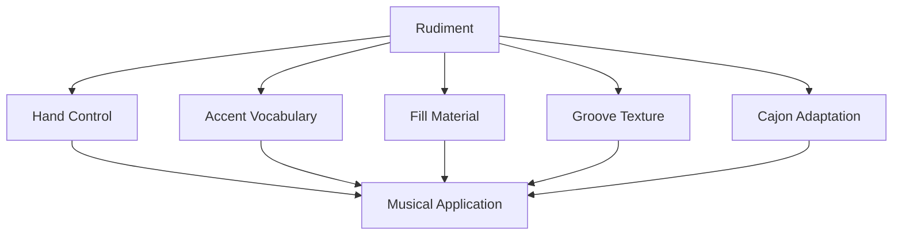
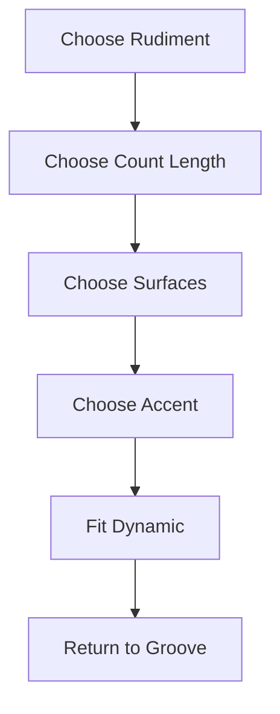

# learn-drum-cajon-part-015.md

# Part 015 — Rudiments Minimum yang Benar-Benar Berguna

## Status Seri

- Seri: `learn-drum-cajon`
- Part: `015`
- Topik: Rudiments minimum untuk drum dan cajon accompaniment
- Target akhir seri: mampu mengiringi penyanyi dengan drum dan/atau cajon secara stabil, musikal, dan sadar konteks
- Status: seri belum selesai
- Part sebelumnya: `learn-drum-cajon-part-014.md`
- Part berikutnya: `learn-drum-cajon-part-016.md`

---

## Tujuan Part Ini

Part ini membahas rudiments, tetapi dengan batasan sangat jelas. Kita tidak sedang mengejar semua rudiment atau menjadi pemain marching/snare specialist. Kita hanya mengambil rudiment yang paling berguna untuk:

- groove,
- fill,
- accent,
- control,
- hand balance,
- cajon vocabulary,
- dynamic nuance,
- return-to-groove.

Setelah menyelesaikan part ini, kamu harus mampu:

1. memahami rudiment sebagai vocabulary, bukan hafalan kosong,
2. memainkan single stroke,
3. memainkan double stroke sederhana,
4. memainkan paradiddle dasar,
5. memainkan flam sederhana,
6. memainkan drag sederhana,
7. mengontrol accent,
8. mengubah rudiment menjadi fill 1 beat, 2 beat, dan 1 bar,
9. menerapkan rudiment ke cajon,
10. tahu rudiment mana yang harus ditunda dulu.

---

# 1. Apa Itu Rudiment?

Rudiment adalah pola dasar sticking atau pukulan yang menjadi bahan baku permainan drum/percussion.

Contoh:

```text
Single stroke:
R L R L R L R L

Double stroke:
R R L L R R L L

Paradiddle:
R L R R L R L L
```

Rudiment seperti vocabulary dalam bahasa.

Namun vocabulary tidak otomatis membuatmu bisa berbicara musikal. Kamu harus tahu:

- kapan dipakai,
- seberapa keras,
- di section apa,
- apakah mengganggu vokal,
- apakah kembali ke groove,
- apakah sesuai dynamics.



Rule:

> Rudiment bukan tujuan. Rudiment adalah bahan mentah untuk membuat groove dan fill lebih terkendali.

---

# 2. Kenapa Tidak Belajar Semua Rudiment Dulu?

Karena target kita adalah accompaniment dalam 20 jam pertama. Semua rudiment standar memang berguna dalam perjalanan panjang, tetapi tidak semuanya berguna di awal.

Jika kamu mencoba menghafal terlalu banyak rudiment:

- waktu latihan habis untuk teknik terpisah,
- groove tetap belum stabil,
- fill tetap rush,
- tidak bisa mengiringi lagu penuh,
- frustrasi karena terlalu banyak vocabulary tanpa konteks.

Untuk 20 jam pertama, prioritas rudiment:

| Rudiment | Prioritas | Alasan |
|---|---:|---|
| Single stroke | sangat tinggi | dasar fill dan hand balance |
| Double stroke | tinggi | flow dan fill |
| Paradiddle | tinggi | accent dan movement |
| Flam | sedang | accent/impact |
| Drag sederhana | sedang | texture/fill |
| Roll panjang | rendah awal | mudah rush |
| Complex hybrid rudiments | tunda | belum relevan |
| Fast chops | tunda | bukan target accompaniment |

---

# 3. Prinsip Latihan Rudiment

## 3.1 Lambat Dulu

Rudiment yang dimainkan cepat tetapi tidak rata tidak berguna.

Mulai di:

```text
50–60 BPM
```

Naik hanya jika:

- tangan rileks,
- suara rata,
- accent jelas,
- tempo tidak rush,
- bisa kembali ke groove.

## 3.2 Pakai Metronome

Rudiment harus dilatih dengan time.

Tanpa metronome, kamu mungkin merasa rapi padahal spacing tidak rata.

## 3.3 Jangan Lupa Dynamics

Latihan rudiment bukan hanya:

```text
R L R L
```

Tetapi:

```text
R l R l
```

dengan accent dan tap.

## 3.4 Selalu Hubungkan ke Musik

Setiap rudiment harus diuji:

- bisa jadi fill?
- bisa jadi groove texture?
- bisa dipakai di cajon?
- bisa masuk lagu?
- bisa kembali ke beat 1?

---

# 4. Single Stroke

## 4.1 Definisi

Single stroke adalah pukulan bergantian:

```text
R L R L R L R L
```

Ini rudiment paling dasar dan paling penting.

Fungsi:

- fill sederhana,
- hand balance,
- speed foundation,
- 8th note,
- 16th note,
- cajon alternating touch,
- tom movement.

---

## 4.2 Single Stroke 8th Note

```text
Count : 1 & 2 & 3 & 4 &
Hand  : R L R L R L R L
```

Latihan:

1. metronome 60 BPM,
2. main 8th note,
3. semua pukulan rata,
4. bahu turun,
5. 2 menit.

Acceptance:

- tidak ada tangan yang lebih keras tanpa sengaja,
- spacing rata,
- tidak tension.

---

## 4.3 Single Stroke 16th Note

```text
Count : 1 e & a 2 e & a 3 e & a 4 e & a
Hand  : R L R L R L R L R L R L R L R L
```

Latihan:

- mulai 50 BPM,
- jangan mengejar speed,
- fokus rata.

Untuk accompaniment awal, 16th note single stroke berguna untuk fill pendek, bukan untuk pamer speed.

---

## 4.4 Single Stroke Accent

Accent di beat:

```text
Count : 1 e & a 2 e & a 3 e & a 4 e & a
Hand  : R l r l R l r l R l r l R l r l
Accent: >       >       >       >
```

`R` besar = accent  
`r/l` kecil = tap

Fungsi:

- dynamic control,
- fill yang punya shape,
- cajon slap/touch hierarchy.

---

## 4.5 Aplikasi Drum Kit

Fill 1 beat:

```text
Count : 1 & 2 & 3 & 4 &
Fill  :             R L
```

Fill 2 beat:

```text
Count : 1 & 2 & 3 & 4 &
Fill  :         R L R L
```

Fill 1 bar 8th:

```text
Count : 1 & 2 & 3 & 4 &
Fill  : R L R L R L R L
```

Tom movement:

```text
R L = snare
R L = high tom
R L = floor tom
R L = snare/crash setup
```

---

## 4.6 Aplikasi Cajon

Basic touch alternating:

```text
Count : 1 & 2 & 3 & 4 &
Hand  : R L R L R L R L
Sound : t t t t t t t t
```

Fill 1 beat:

```text
Count : 1 & 2 & 3 & 4 &
Sound :             t S
Hand  :             R L
```

Fill 2 beat:

```text
Count : 1 & 2 & 3 & 4 &
Sound :         B S t S
Hand  :         R L R L
```

---

# 5. Double Stroke

## 5.1 Definisi

Double stroke adalah dua pukulan tiap tangan:

```text
R R L L R R L L
```

Fungsi:

- flow,
- roll pendek,
- fill lembut,
- ghost note control,
- cajon touch roll,
- economy of motion.

---

## 5.2 Double Stroke Dasar

```text
Count : 1 & 2 & 3 & 4 &
Hand  : R R L L R R L L
```

Latihan:

- metronome 50–60 BPM,
- pukulan kedua jangan hilang,
- jangan tegang,
- jangan terlalu cepat.

Kesalahan umum:

| Kesalahan | Dampak |
|---|---|
| pukulan kedua lemah | double tidak rata |
| tangan menekan | rebound mati |
| terlalu cepat | spacing rusak |
| bahu tegang | fatigue |

---

## 5.3 Double Stroke sebagai Fill

Drum fill:

```text
Count : 1 & 2 & 3 & 4 &
Fill  :         R R L L
```

Cajon fill:

```text
Count : 1 & 2 & 3 & 4 &
Sound :         t t S S
Hand  :         R R L L
```

atau:

```text
Sound :         B B S S
```

Hati-hati: `B B S S` bisa terlalu berat jika dimainkan keras.

---

## 5.4 Double Stroke untuk Build

Build sederhana:

```text
Bar 1: R R L L R R L L soft
Bar 2: R R L L R R L L medium
Bar 3: R R L L R R L L bigger
Bar 4: fill into chorus
```

Untuk drum bisa di snare.  
Untuk cajon bisa touch/slap campuran.

Rule:

> Build harus naik volume tanpa mempercepat tempo.

---

# 6. Paradiddle

## 6.1 Definisi

Paradiddle dasar:

```text
R L R R L R L L
```

Dibagi:

```text
Para-diddle
R L R R
L R L L
```

Fungsi:

- membuat tangan bergantian lead,
- membangun accent,
- fill lebih smooth,
- pindah permukaan,
- variasi cajon bass/slap,
- koordinasi kanan-kiri.

---

## 6.2 Paradiddle 8th Note

```text
Count : 1 & 2 & 3 & 4 &
Hand  : R L R R L R L L
```

Latihan:

- metronome 60 BPM,
- accent di awal grup R dan L,
- pukulan double jangan rush.

Accent:

```text
Hand  : R l r r L r l l
Accent: >       >
```

---

## 6.3 Paradiddle sebagai Fill Drum

Contoh 1 bar:

```text
Count : 1 & 2 & 3 & 4 &
Hand  : R L R R L R L L
```

Mapping:

```text
R pertama: snare accent
L: snare tap
R R: tom/tom
L pertama grup kedua: snare/tom accent
```

Sederhana:

```text
R L R R = snare snare tom tom
L R L L = snare tom floor floor
```

---

## 6.4 Paradiddle sebagai Fill Cajon

Mapping sederhana:

```text
Hand  : R L R R L R L L
Sound : B t S S B t S S
```

Atau lebih soft:

```text
Sound : B t t t S t t t
```

Paradiddle bisa membantu membuat accent tanpa terlalu banyak note keras.

---

## 6.5 Paradiddle untuk Groove Texture

Drum:

- R di hi-hat,
- L di snare ghost,
- accent tertentu menjadi backbeat.

Cajon:

- R/L alternating di touch,
- accent menjadi bass/slap.

Namun untuk 20 jam pertama, gunakan paradiddle terutama untuk fill dan coordination, bukan groove kompleks.

---

# 7. Flam

## 7.1 Definisi

Flam adalah dua pukulan sangat dekat: grace note kecil sebelum main note.

```text
lR atau rL
```

Artinya:

- satu tangan memainkan note kecil,
- tangan lain memainkan note utama,
- terdengar seperti satu pukulan lebih tebal.

Fungsi:

- accent besar,
- section marker,
- fill ending,
- snare impact,
- cajon slap accent.

---

## 7.2 Flam Dasar

Drum:

```text
small left + main right = flam right
small right + main left = flam left
```

Cajon:

- touch kecil + slap utama,
- bass kecil + slap utama,
- finger grace + slap.

## 7.3 Latihan Flam

1. main grace note sangat kecil,
2. main note utama jelas,
3. jangan terlalu jauh jaraknya,
4. jangan jadi dua note terpisah,
5. jangan terlalu keras di grace note.

Pattern:

```text
Count : 1   2   3   4
Flam  : F       F
```

## 7.4 Aplikasi Flam

Drum:

- flam di snare sebelum chorus,
- flam di beat 1 section baru,
- flam sebagai fill ending.

Cajon:

- soft touch + slap untuk accent,
- flam slap di awal chorus,
- flam sebelum stop ending.

Rule:

> Flam adalah accent. Jangan dipakai terus-menerus di accompaniment awal.

---

# 8. Drag Sederhana

## 8.1 Definisi

Drag adalah grace double kecil sebelum main note.

Sederhana:

```text
rrL atau llR
```

Fungsi:

- texture,
- fill nuance,
- pickup,
- snare/cajon ornament,
- build halus.

Untuk 20 jam pertama, drag optional. Tetapi berguna untuk menambah rasa tanpa fill panjang.

---

## 8.2 Drag Dasar

Latihan drum:

```text
rrL
llR
```

Grace notes kecil, main note jelas.

Latihan cajon:

```text
ttS
ttB
```

Touch-touch-slap atau touch-touch-bass.

## 8.3 Aplikasi Drag

Cajon fill:

```text
Count : 1 & 2 & 3 & 4 &
Fill  :             t t S
```

Drum fill:

```text
Count : 1 & 2 & 3 & 4 &
Fill  :             r r L
```

Rule:

> Drag harus kecil. Jika grace note terlalu besar, groove jadi ramai.

---

# 9. Accent Control

Accent adalah inti musikal dari rudiment.

Tanpa accent, rudiment terdengar seperti latihan mekanik.

## 9.1 Accent di Awal Beat

```text
Count : 1 e & a 2 e & a
Hand  : R l r l R l r l
Accent: >       >
```

## 9.2 Accent di Backbeat

```text
Count : 1 e & a 2 e & a 3 e & a 4 e & a
Accent:         >               >
```

Backbeat accent membantu groove terasa pop.

## 9.3 Accent untuk Cajon

Cajon:

```text
accent = slap/bass lebih jelas
tap = touch/ghost
```

Contoh:

```text
Count : 1 & 2 & 3 & 4 &
Sound : B t S t B t S t
Accent: >   >   >   >
```

Bass dan slap adalah note utama. Touch harus kecil.

---

# 10. Rudiment ke Fill

Framework:



Contoh:

## 10.1 Single Stroke Fill

Rudiment:

```text
R L R L
```

Count:

```text
3 & 4 &
```

Drum mapping:

```text
Snare Snare Tom Tom
```

Cajon mapping:

```text
B S t S
```

## 10.2 Double Stroke Fill

Rudiment:

```text
R R L L
```

Count:

```text
3 & 4 &
```

Drum:

```text
Snare Snare Tom Tom
```

Cajon:

```text
t t S S
```

## 10.3 Paradiddle Fill

Rudiment:

```text
R L R R L R L L
```

Count:

```text
1 & 2 & 3 & 4 &
```

Drum:

```text
Snare tap tom tom / snare tap floor floor
```

Cajon:

```text
B t S S / B t S S
```

---

# 11. Rudiment ke Groove

Rudiment juga bisa menjadi groove texture, tetapi ini jangan terlalu cepat.

## 11.1 Single Stroke as Hi-hat/Touch

Drum:

```text
R hand plays hi-hat 8th
L hand snare 2/4
```

Cajon:

```text
R L alternating touch
accent becomes bass/slap
```

## 11.2 Paradiddle as Texture

Cajon example:

```text
Count : 1 & 2 & 3 & 4 &
Hand  : R L R R L R L L
Sound : B t t t S t t t
```

Ini bisa menjadi groove halus, tetapi harus dijaga agar backbeat tetap jelas.

---

# 12. Rudiment Dynamics

Latih setiap rudiment dalam tiga level.

## 12.1 Soft

- untuk verse,
- ghost,
- touch,
- low-energy fill.

## 12.2 Medium

- normal fill,
- pre-chorus,
- chorus kecil.

## 12.3 Loud

- final chorus,
- strong transition,
- ending accent.

Rule:

> Rudiment yang hanya bisa dimainkan keras belum siap untuk accompaniment.

---

# 13. Rudiment Tempo Ladder

Gunakan ladder:

```text
50 BPM → 60 BPM → 70 BPM → 80 BPM
```

Untuk setiap tempo:

- single stroke 1 menit,
- double stroke 1 menit,
- paradiddle 1 menit,
- accent drill 1 menit.

Jangan naik tempo jika:

- tangan tegang,
- spacing rusak,
- accent hilang,
- kamu tidak bisa menghitung.

---

# 14. Rudiment Practice Protocol 30 Menit

## Sesi Teknik Dasar

| Durasi | Latihan |
|---:|---|
| 5 menit | single stroke 8th |
| 5 menit | single stroke 16th slow |
| 5 menit | double stroke |
| 5 menit | paradiddle |
| 5 menit | accent control |
| 5 menit | record/review |

## Sesi Rudiment to Fill

| Durasi | Latihan |
|---:|---|
| 5 menit | single stroke fill |
| 5 menit | double stroke fill |
| 5 menit | paradiddle fill |
| 5 menit | flam accent |
| 5 menit | fill return |
| 5 menit | review timing |

## Sesi Cajon Application

| Durasi | Latihan |
|---:|---|
| 5 menit | alternating touch |
| 5 menit | B/S single stroke fill |
| 5 menit | double touch/slap |
| 5 menit | paradiddle cajon |
| 5 menit | flam slap |
| 5 menit | record/review |

---

# 15. Rudiment untuk Drum Kit vs Cajon

| Rudiment | Drum Kit Use | Cajon Use |
|---|---|---|
| Single stroke | snare/tom fill | touch/slap/bass fill |
| Double stroke | snare roll/build | touch roll |
| Paradiddle | smooth fill/accents | bass/slap/touch pattern |
| Flam | snare accent | slap accent |
| Drag | grace texture | touch-touch-slap |

---

# 16. Common Mistakes

## 16.1 Mengejar Speed

Gejala:

- tangan tegang,
- timing tidak rata,
- sound kasar,
- fill rush.

Correction:

- turun tempo,
- main lebih kecil,
- metronome,
- dynamic control.

## 16.2 Rudiment Tidak Dihubungkan ke Lagu

Gejala:

- bisa latihan pad,
- tidak bisa pakai saat lagu.

Correction:

- setiap rudiment harus jadi fill,
- latihan groove → fill → groove,
- pakai section map.

## 16.3 Semua Note Sama Keras

Gejala:

- tidak musikal,
- groove datar,
- cajon terlalu ramai.

Correction:

- accent control,
- ghost note level 1,
- main notes level 3.

## 16.4 Flam Terlalu Lebar

Gejala:

- flam terdengar seperti dua note salah.

Correction:

- dekatkan grace note,
- kecilkan grace note,
- main lambat.

## 16.5 Double Stroke Tidak Rata

Gejala:

- pukulan kedua hilang,
- roll timpang.

Correction:

- tempo turun,
- gunakan rebound,
- jangan menekan.

---

# 17. Debugging Guide

| Gejala | Penyebab Kemungkinan | Correction |
|---|---|---|
| Single stroke tidak rata | hand imbalance | slow R/L with metronome |
| Double stroke lemah | rebound mati | loosen grip |
| Paradiddle kacau | sticking belum internal | count + slow |
| Fill rush | rudiment terlalu cepat | reduce notes |
| Flam terdengar dobel | grace note terlalu jauh | closer flam |
| Cajon hand sakit | power berlebihan | reduce volume |
| Accent hilang | semua note sama | accent drill |
| Tidak bisa pakai di lagu | no application | groove-fill-groove |
| Tempo rusak setelah fill | return lemah | return drill |

---

# 18. Mini Vocabulary: 12 Fill dari Rudiment

## Drum Kit

| No | Fill | Count |
|---:|---|---|
| 1 | Snare single R L | 4 & |
| 2 | Snare-tom R L | 4 & |
| 3 | R L R L on snare | 3 & 4 & |
| 4 | R L R L on snare/tom | 3 & 4 & |
| 5 | R R L L | 3 & 4 & |
| 6 | Paradiddle 1 bar | 1 & 2 & 3 & 4 & |
| 7 | Flam snare on 4 | 4 |
| 8 | Drag into 4 | & 4 |
| 9 | Silence on 4 | 4 |
| 10 | Snare build 8th | 1 & 2 & 3 & 4 & |
| 11 | Tom descent simple | 3 & 4 & |
| 12 | Flam + crash beat 1 | next section |

## Cajon

| No | Fill | Count |
|---:|---|---|
| 1 | t S | 4 & |
| 2 | B S | 4 & |
| 3 | S S | 4 & |
| 4 | B S B S | 3 & 4 & |
| 5 | t t S S | 3 & 4 & |
| 6 | B t S S | 3 & 4 & |
| 7 | B t S S B t S S | 1 bar |
| 8 | flam slap | 4 |
| 9 | t t S drag | 4 |
| 10 | silence fill | beat 4 |
| 11 | touch build | 1 bar |
| 12 | bass-slap ending | final bar |

---

# 19. Rudiment Application to Song Form

Gunakan rudiment berdasarkan section:

| Section | Rudiment Use |
|---|---|
| Verse | minimal, soft single/touch |
| Pre-Chorus | small single/double fill |
| Chorus | stronger single/paradiddle fill |
| Bridge Drop | silence/flam soft |
| Bridge Build | double stroke build |
| Final Chorus | bigger fill but stable |
| Ending | flam/stop/accent |

---

# 20. Practice: Groove → Rudiment → Groove

Latihan utama part ini:

```text
Bar 1: groove
Bar 2: groove
Bar 3: groove
Bar 4: rudiment fill
Bar 5: groove
```

Lakukan dengan:

1. single stroke fill,
2. double stroke fill,
3. paradiddle fill,
4. flam accent,
5. drag fill.

Acceptance:

- bar 5 beat 1 tepat,
- fill tidak rush,
- dynamics sesuai,
- vokal imajiner tetap punya ruang.

---

# 21. Self-Scoring Rubric

Nilai 1–5.

| Area | 1 | 3 | 5 |
|---|---|---|---|
| Single stroke | tidak rata | cukup | stabil |
| Double stroke | pukulan kedua hilang | cukup | rata |
| Paradiddle | sticking kacau | cukup | lancar |
| Flam | terlalu lebar | cukup | tebal rapi |
| Drag | berantakan | cukup | halus |
| Accent | datar | cukup | jelas |
| Fill application | tidak bisa | cukup | musikal |
| Return groove | sering gagal | cukup | solid |

Target:

- minimal 3 semua area,
- minimal 4 single stroke,
- minimal 4 return groove,
- minimal 4 accent control.

---

# 22. Mini Capstone Part Ini

Rekam 3 menit:

```text
0:00–0:30 groove only
0:30–1:00 single stroke fill every 4 bars
1:00–1:30 double stroke fill every 4 bars
1:30–2:00 paradiddle fill every 8 bars
2:00–2:30 flam/drag accent into chorus
2:30–3:00 choose best fill and play musically
```

Review:

| Pertanyaan | Ya/Tidak |
|---|---|
| Rudiment rata? | |
| Accent jelas? | |
| Fill tidak rush? | |
| Beat 1 setelah fill tepat? | |
| Dynamics sesuai? | |
| Tidak terlalu banyak fill? | |
| Bisa diterapkan ke lagu? | |

---

# 23. Acceptance Criteria Part Ini

Kamu boleh lanjut ke Part 016 jika:

1. bisa memainkan single stroke 2 menit,
2. bisa memainkan double stroke sederhana,
3. bisa memainkan paradiddle dasar,
4. bisa memainkan flam sederhana,
5. bisa memainkan drag sederhana atau touch-touch-slap,
6. bisa membuat minimal 3 fill dari rudiment,
7. bisa menerapkan rudiment ke cajon,
8. bisa mengontrol accent,
9. bisa melakukan groove → fill → groove tanpa kehilangan beat 1,
10. tahu rudiment mana yang harus ditunda dulu.

---

# 24. Ringkasan

Rudiment adalah vocabulary. Untuk accompaniment, vocabulary harus digunakan dengan taste.

Rudiment minimum:

1. single stroke,
2. double stroke,
3. paradiddle,
4. flam,
5. drag sederhana,
6. accent control.

Gunakan rudiment untuk:

- fill,
- accent,
- hand balance,
- dynamic control,
- cajon texture,
- build,
- transition.

Jangan gunakan rudiment untuk membuktikan kemampuan. Gunakan rudiment untuk membuat lagu lebih jelas.

Rule paling penting:

> Rudiment yang tidak bisa kembali ke groove belum siap dipakai di lagu.

---

# 25. Latihan untuk Part Berikutnya

Sebelum lanjut ke Part 016, lakukan:

1. Single stroke 5 menit.
2. Double stroke 5 menit.
3. Paradiddle 5 menit.
4. Accent control 5 menit.
5. Buat 3 fill dari rudiment.
6. Rekam groove → fill → groove.
7. Dengarkan apakah fill mendukung lagu atau hanya terdengar seperti latihan.

Part berikutnya membahas:

> listening skill: cara mendengar lagu seperti drummer/cajon player, mengenali pulse, form, kick/snare/slap placement, dynamics, vocal phrasing, dan memilih groove berdasarkan referensi.
