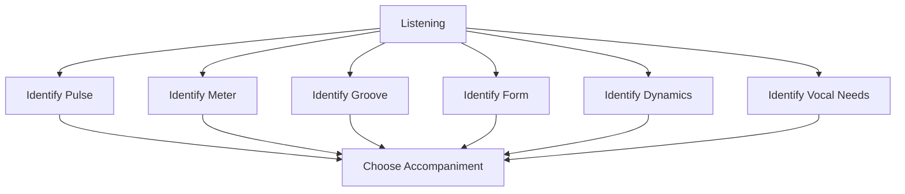
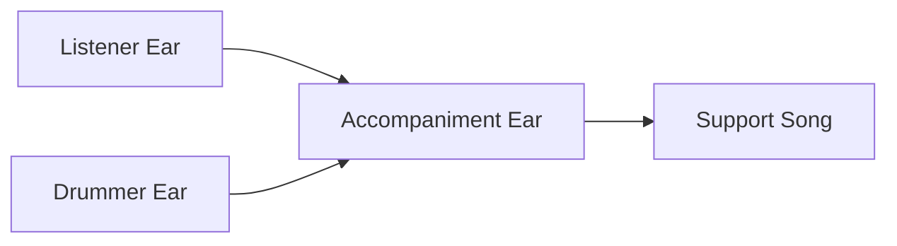
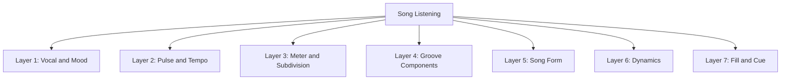
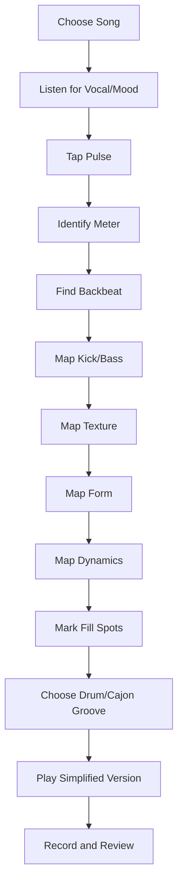
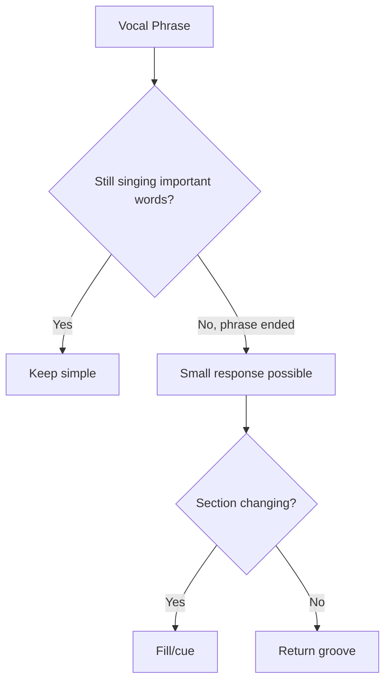
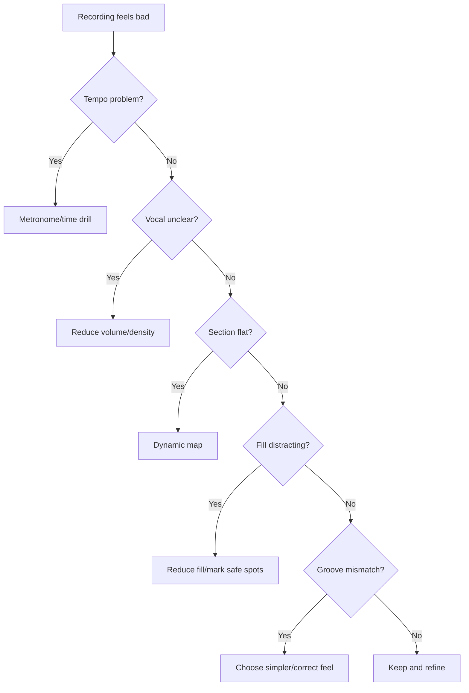

# learn-drum-cajon-part-016.md

# Part 016 — Listening Skill: Mendengar Lagu seperti Drummer

## Status Seri

- Seri: `learn-drum-cajon`
- Part: `016`
- Topik: Listening skill untuk drummer/cajon player
- Target akhir seri: mampu mengiringi penyanyi dengan drum dan/atau cajon secara stabil, musikal, dan sadar konteks
- Status: seri belum selesai
- Part sebelumnya: `learn-drum-cajon-part-015.md`
- Part berikutnya: `learn-drum-cajon-part-017.md`

---

## Tujuan Part Ini

Part ini membahas kemampuan mendengar. Drummer/cajon player yang baik bukan hanya punya tangan/kaki yang bisa bermain. Ia punya telinga yang bisa menangkap:

- pulse,
- meter,
- subdivision,
- groove,
- section,
- dynamic arc,
- vocal phrasing,
- ruang,
- cue,
- energi lagu.

Setelah menyelesaikan part ini, kamu harus mampu:

1. mendengar pulse lagu,
2. membedakan 4/4, 6/8, dan 12/8 secara praktis,
3. mengenali backbeat,
4. mendengar kick/bass placement,
5. mendengar snare/slap placement,
6. mendengar density dan dynamics,
7. membuat drum/cajon map dari lagu,
8. memilih groove berdasarkan referensi,
9. mendengar apakah kamu rushing/dragging dalam rekaman,
10. mendengar lagu dengan vocal-first mindset.

---

# 1. Kenapa Listening Skill Lebih Penting dari Banyak Pattern?

Banyak pemula mengumpulkan pattern:

- pop groove,
- rock groove,
- worship groove,
- cajon groove,
- fill,
- 6/8 pattern,
- half-time pattern.

Tetapi saat bertemu lagu nyata, mereka tetap bingung:

- pattern mana yang dipakai?
- kapan masuk?
- seberapa keras?
- kapan fill?
- apakah lagu 4/4 atau 6/8?
- apakah vokal butuh ruang?
- apakah chorus harus besar?

Jawabannya datang dari listening skill.



Pattern adalah solusi. Listening adalah diagnosis.

Tanpa diagnosis, solusi mudah salah.

---

# 2. Mendengar seperti Pendengar vs seperti Drummer

## 2.1 Mendengar seperti Pendengar Umum

Pendengar umum biasanya mendengar:

- melodi,
- lirik,
- emosi,
- hook,
- suara penyanyi,
- mood.

Ini penting. Jangan hilangkan perspektif ini.

## 2.2 Mendengar seperti Drummer/Cajon Player

Drummer/cajon player harus mendengar layer tambahan:

- tempo,
- meter,
- beat 1,
- backbeat,
- subdivision,
- kick pattern,
- snare/slap pattern,
- cymbal/touch texture,
- fill placement,
- section transition,
- dynamic contour.

## 2.3 Mendengar seperti Pengiring

Pengiring harus menggabungkan keduanya:



Jika hanya memakai drummer ear, kamu bisa terlalu teknis.  
Jika hanya memakai listener ear, kamu bisa tidak tahu apa yang harus dimainkan.

---

# 3. Listening Layers

Dengarkan lagu dalam beberapa lapisan.



Jangan mencoba mendengar semua sekaligus di awal. Dengarkan lagu beberapa kali dengan fokus berbeda.

---

# 4. Putaran Listening 1 — Vokal dan Mood

Pertama, dengarkan sebagai pendengar.

Catat:

- lagu terasa sedih, bahagia, tegang, intim, megah, ringan?
- vokal lembut atau besar?
- lirik padat atau banyak ruang?
- bagian mana paling emosional?
- bagian mana tidak boleh diganggu?
- apakah lagu perlu groove yang banyak atau sedikit?

Template:

```md
## Vocal and Mood Notes

Mood:
Vocal intensity:
Important lyric moments:
Sections needing space:
Sections needing lift:
Overall energy:
```

Pertanyaan utama:

> Jika saya bermain drum/cajon, bagaimana agar vokal terdengar lebih kuat?

---

# 5. Putaran Listening 2 — Pulse dan Tempo

Dengarkan ulang. Jangan fokus lirik. Fokus pada detak.

Latihan:

1. Tap kaki.
2. Cari pulse yang paling natural.
3. Hitung 1-2-3-4 atau 1-2-3-4-5-6.
4. Cek apakah pulse tetap sama sepanjang lagu.
5. Catat apakah lagu terasa lambat, medium, atau cepat.

Template:

```md
## Pulse Notes

Approx tempo:
Pulse feel:
Slow / medium / fast:
Any tempo changes:
Feels stable or rubato:
```

## 5.1 Rubato

Rubato berarti tempo lebih bebas, sering di intro atau ending.

Jika intro rubato:

- jangan masuk groove terlalu cepat,
- tunggu tempo stabil,
- ikuti cue penyanyi/piano/gitar.

---

# 6. Putaran Listening 3 — Meter dan Subdivision

Tentukan apakah lagu terasa:

- 4/4 straight,
- 6/8,
- 12/8,
- 3/4,
- shuffle/light swing.

## 6.1 Tes 4/4

Coba hitung:

```text
1 & 2 & 3 & 4 &
```

Jika terasa natural, kemungkinan 4/4 straight.

## 6.2 Tes 6/8

Coba hitung:

```text
1 2 3 4 5 6
```

Jika terasa dua gelombang besar:

```text
ONE two three FOUR five six
```

kemungkinan 6/8.

## 6.3 Tes 12/8

Coba hitung:

```text
1 la li 2 la li 3 la li 4 la li
```

Jika terasa 4 beat besar tetapi masing-masing mengayun tiga, kemungkinan 12/8.

Template:

```md
## Meter Notes

Likely meter:
Counting:
Subdivision:
Straight / triplet / swing:
Confidence:
```

---

# 7. Putaran Listening 4 — Backbeat

Cari snare atau clap feel.

Dalam 4/4, backbeat biasanya di:

```text
2 dan 4
```

Latihan:

1. Putar lagu.
2. Tepuk 2 dan 4.
3. Jika terasa natural, backbeat jelas.
4. Jika terasa aneh, mungkin lagu half-time, 6/8, atau pola lain.

## 7.1 Half-Time Detection

Dalam half-time, snare terasa di beat 3.

```text
Count : 1 & 2 & 3 & 4 &
Snare :         S
```

Rasa lagu menjadi lebih lebar.

Template:

```md
## Backbeat Notes

Snare/slap feel:
2 and 4 / beat 3 / 6-8 beat 4 / unclear:
Backbeat intensity:
Verse backbeat:
Chorus backbeat:
```

---

# 8. Putaran Listening 5 — Kick/Bass Placement

Dengarkan low-end.

Pertanyaan:

- kick/bass muncul di beat 1?
- ada kick di 3?
- ada kick tambahan di `&`?
- chorus punya kick lebih padat?
- verse lebih sederhana?
- apakah kick lock dengan bass guitar?
- jika cajon, bass tone bisa meniru bagian mana?

Template:

```md
## Kick/Bass Notes

Basic kick/bass pattern:
Verse:
Chorus:
Any anticipations:
Any four-on-floor:
Low-end density:
```

## 8.1 Cara Menirukan Kick dengan Mulut

Gunakan:

```text
boom = kick/bass
ka = snare/slap
ts = hi-hat/touch
```

Contoh:

```text
boom ts ka ts boom ts ka ts
```

Ini membantu sebelum memainkan alat.

---

# 9. Putaran Listening 6 — Hi-hat/Touch Texture

Dengarkan bagian atas rhythm.

Pertanyaan:

- hi-hat 8th atau 16th?
- closed atau open?
- ride masuk di chorus?
- cajon touch/shaker terasa?
- verse sparse atau penuh?
- chorus lebih padat?
- cymbal terlalu besar atau halus?

Template:

```md
## Subdivision Texture Notes

Verse texture:
Chorus texture:
Bridge texture:
Closed/open/ride/touch/shaker:
Density:
```

Jika kamu mengiringi dengan cajon, hi-hat di lagu asli bisa diterjemahkan menjadi:

- touch,
- shaker,
- finger tap,
- atau tidak dimainkan jika terlalu ramai.

---

# 10. Putaran Listening 7 — Song Form

Tulis struktur lagu.

Gunakan format:

```md
Intro:
Verse 1:
Pre-Chorus:
Chorus 1:
Verse 2:
Pre-Chorus 2:
Chorus 2:
Bridge:
Final Chorus:
Ending:
```

Dengarkan:

- berapa bar intro?
- kapan vokal masuk?
- apakah ada pre-chorus?
- apakah chorus diulang?
- apakah bridge drop atau build?
- ending stop atau fade/tag?

Template:

```md
## Form Notes

Intro:
V1:
Pre:
C1:
V2:
C2:
Bridge:
Final:
Ending:
Lyric anchors:
```

---

# 11. Putaran Listening 8 — Dynamics

Dengarkan energi.

Beri angka 1–10.

```md
Intro: 1
Verse 1: 2
Pre: 4
Chorus 1: 6
Verse 2: 3
Chorus 2: 7
Bridge: 4
Final Chorus: 9
Ending: 2
```

Pertanyaan:

- bagian mana paling kecil?
- bagian mana paling besar?
- apakah chorus pertama sudah full?
- apakah final chorus lebih besar?
- apakah bridge drop?
- apakah drummer/cajon player diam di bagian tertentu?

Dynamics membantu memilih groove.

---

# 12. Putaran Listening 9 — Fill dan Cue

Dengarkan fill.

Catat:

- fill terjadi di akhir 4 bar?
- akhir 8 bar?
- sebelum chorus?
- sebelum bridge?
- sebelum final chorus?
- apakah fill besar atau kecil?
- apakah fill menabrak vokal?
- apakah ada silence fill?

Template:

```md
## Fill Notes

Fill before chorus:
Fill before bridge:
Fill before final chorus:
Ending cue:
Vocal-safe fill spots:
Fill size:
```

Rule:

> Jangan meniru semua fill. Ambil fungsi fill-nya dulu.

---

# 13. Active Listening Workflow

Gunakan workflow ini untuk satu lagu.



---

# 14. Drum/Cajon Translation

Jika lagu asli punya drum kit, kamu bisa menerjemahkannya ke cajon.

## 14.1 Drum to Cajon

| Drum Original | Cajon Translation |
|---|---|
| Kick | Bass |
| Snare | Slap |
| Hi-hat 8th | Touch 8th |
| Hi-hat 16th | touch/shaker, maybe simplify |
| Ride | fuller touch/shaker |
| Crash | slap accent/silence/accent |
| Tom fill | bass/slap fill |
| Ghost notes | light touch |

## 14.2 Cajon to Drum

| Cajon Original | Drum Translation |
|---|---|
| Bass | Kick |
| Slap | Snare |
| Touch | Hi-hat |
| Finger roll | snare/tom build |
| Muted tone | rim/tap |
| Strong slap accent | crash/snare accent |

---

# 15. Simplification Skill

Listening bukan berarti meniru semua. Sering kali kamu harus menyederhanakan.

## 15.1 Jika Drum Asli Terlalu Kompleks

Ambil:

- kick utama,
- snare/backbeat,
- hi-hat feel,
- section dynamics,
- fill function.

Tinggalkan:

- ghost note kompleks,
- fast fill,
- cymbal nuance,
- syncopation berlebihan.

## 15.2 Simplified Map

Contoh drum asli:

```text
Kick banyak syncopation
Snare ghost kompleks
Hi-hat 16th
Fill tom cepat
```

Simplified accompaniment:

```text
Kick 1/3 plus one anticipation
Snare 2/4
Hi-hat/touch 8th
Fill 1 beat
```

Rule:

> Lebih baik memainkan versi sederhana yang stabil daripada versi asli yang rusak.

---

# 16. Listening for Space

Ruang adalah bagian penting.

Dengarkan:

- kapan drummer diam?
- kapan cajon tidak main?
- kapan hi-hat berhenti?
- kapan crash tidak dipakai?
- kapan hanya vokal dan piano?
- kapan bass/kick hilang?
- kapan chorus masuk setelah silence?

Template:

```md
## Space Notes

Sections with no drums:
Sections with only light texture:
Important vocal spaces:
Possible silence fills:
Where not to play:
```

---

# 17. Listening for Vocal Phrasing

Penyanyi sering bernyanyi melawan grid secara halus.

Dengarkan:

- apakah vokal masuk sebelum beat?
- setelah beat?
- menahan kata?
- punya banyak jeda?
- padat tanpa jeda?
- bernapas sebelum chorus?
- menekankan kata tertentu?

Drummer/cajon harus tahu kapan:

- keep groove,
- reduce fill,
- leave space,
- respond after phrase.



---

# 18. Listening for Ensemble Density

Dengarkan instrumen lain.

## 18.1 Gitar Padat

Jika gitar strumming padat:

- drum/cajon tidak perlu terlalu banyak subdivision,
- backbeat cukup,
- touch/hi-hat lebih kecil.

## 18.2 Piano Padat

Jika piano memainkan chord besar:

- jaga ruang,
- kick/bass sederhana,
- jangan banyak tom/cajon fill.

## 18.3 Bass Aktif

Jika bass aktif:

- kick jangan terlalu syncopated,
- lock dengan bass,
- jangan low-end berantakan.

Template:

```md
## Ensemble Density

Guitar:
Piano:
Bass:
Other percussion:
Implication for drum/cajon:
```

---

# 19. Transcribing Without Notation

Kamu tidak perlu notasi formal penuh. Gunakan shorthand.

## 19.1 Drum Shorthand

```text
K = kick
S = snare
H = hi-hat
C = crash
T = tom
- = rest
```

Example:

```text
Count : 1 & 2 & 3 & 4 &
H     : x x x x x x x x
K     : K       K
S     :     S       S
```

## 19.2 Cajon Shorthand

```text
B = bass
S = slap
t = touch
g = ghost
- = rest
```

Example:

```text
Count : 1 & 2 & 3 & 4 &
Sound : B t S t B t S t
```

---

# 20. Listening Exercise: One Song, Nine Passes

Pilih satu lagu. Dengarkan 9 kali.

| Pass | Fokus | Output |
|---:|---|---|
| 1 | mood/vocal | mood notes |
| 2 | pulse | tempo feel |
| 3 | meter | 4/4/6/8/12/8 |
| 4 | backbeat | snare/slap placement |
| 5 | kick/bass | low pattern |
| 6 | texture | hi-hat/touch |
| 7 | form | section map |
| 8 | dynamics | energy map |
| 9 | fill/cue | transition map |

Ini terdengar banyak, tetapi sangat efektif. Setelah beberapa lagu, telingamu mulai otomatis mendengar layer-layer ini.

---

# 21. Listening Exercise: Compare Verse and Chorus

Dengarkan verse dan chorus.

Catat:

| Elemen | Verse | Chorus |
|---|---|---|
| Volume | | |
| Density | | |
| Kick/Bass | | |
| Snare/Slap | | |
| Hi-hat/Touch | | |
| Cymbal/Accent | | |
| Vocal intensity | | |
| Fill | | |

Pertanyaan utama:

> Apa yang berubah sehingga chorus terasa lebih besar?

Kadang jawabannya bukan pattern baru, tetapi:

- snare lebih tegas,
- hi-hat lebih terbuka,
- bass/kick lebih aktif,
- vokal lebih besar,
- instrument lain lebih padat.

---

# 22. Listening Exercise: Find Fill-Safe Spots

Dengarkan lagu dan tandai:

- akhir frase vokal,
- akhir 4 bar,
- akhir 8 bar,
- sebelum chorus,
- sebelum bridge,
- sebelum final chorus,
- ruang instrumental.

Tulis:

```md
Fill-safe spots:
1.
2.
3.

No-fill spots:
1.
2.
3.
```

No-fill spots biasanya:

- kata penting,
- nada tinggi,
- lirik emosional,
- verse intimate,
- vocal pickup.

---

# 23. Listening Exercise: Rebuild Groove from Memory

Langkah:

1. Dengarkan 30 detik lagu.
2. Stop.
3. Tepuk pulse.
4. Ucapkan pattern:
   ```text
   boom ts ka ts...
   ```
5. Mainkan versi sederhana.
6. Dengarkan ulang.
7. Koreksi.

Tujuannya:

- membangun internal representation,
- bukan hanya ikut audio.

---

# 24. Listening to Your Own Recording

Mendengar lagu orang lain penting. Mendengar rekaman diri sendiri lebih penting.

## 24.1 Apa yang Didengar?

Dengarkan 4 kali:

1. timing,
2. sound balance,
3. dynamics,
4. vocal support.

## 24.2 Timing Review

Pertanyaan:

- apakah tempo naik?
- apakah fill rush?
- apakah verse drag?
- apakah chorus rush?
- apakah beat 1 jelas?

## 24.3 Sound Review

Pertanyaan:

- hi-hat/touch terlalu keras?
- snare/slap terlalu besar?
- bass/kick jelas?
- crash/accent berlebihan?

## 24.4 Musical Review

Pertanyaan:

- apakah groove cocok lagu?
- apakah vokal punya ruang?
- apakah section terasa berbeda?
- apakah fill membantu?

---

# 25. Listening Debugging



---

# 26. Reference Library

Buat library referensi berdasarkan archetype, bukan hanya lagu favorit.

```md
# Reference Library

## 4/4 Basic Pop
- Song:
- Groove notes:

## Sparse Acoustic
- Song:
- Groove notes:

## Four-on-the-floor
- Song:
- Groove notes:

## Half-time
- Song:
- Groove notes:

## 6/8 Ballad
- Song:
- Groove notes:

## 12/8 Ballad
- Song:
- Groove notes:

## Cajon Acoustic
- Song:
- Groove notes:
```

Untuk setiap lagu, catat:

- tempo,
- meter,
- groove,
- dynamic arc,
- fill style,
- vocal space.

---

# 27. Common Mistakes

## 27.1 Mendengar Drum Saja

Masalah:

- kamu lupa vokal,
- fill menabrak lirik,
- pattern terlalu ramai.

Correction:

- pass pertama selalu vocal/mood,
- baru rhythm.

## 27.2 Meniru Terlalu Detail

Masalah:

- skill belum cukup,
- groove rusak,
- timing hancur.

Correction:

- simplify,
- ambil fungsi, bukan semua note.

## 27.3 Salah Meter

Masalah:

- 6/8 dipaksa 4/4,
- ballad hilang feel.

Correction:

- count multiple ways,
- cari feel yang paling natural.

## 27.4 Tidak Mendengar Dynamics

Masalah:

- semua section dimainkan sama.

Correction:

- energy map 1–10.

## 27.5 Tidak Mendengar Diri Sendiri

Masalah:

- merasa stabil padahal rush,
- merasa pelan padahal menutup vokal.

Correction:

- rekam,
- dengarkan dari perspektif pendengar.

---

# 28. Debugging Guide

| Gejala | Listening Failure | Correction |
|---|---|---|
| Groove salah feel | meter/subdivision tidak didengar | count 4/4 vs 6/8 |
| Vokal tertutup | vocal layer diabaikan | vocal-first pass |
| Fill salah tempat | form tidak didengar | map phrase |
| Chorus datar | dynamics tidak didengar | energy map |
| Kick berantakan | low pattern tidak didengar | isolate kick/bass |
| Cajon terlalu ramai | density tidak didengar | reduce touch |
| Drum terlalu kaku | mood tidak didengar | listen as audience |
| Tidak bisa memilih groove | no archetype library | build references |

---

# 29. Practice Protocol 30 Menit

## Sesi Active Listening

| Durasi | Latihan |
|---:|---|
| 5 menit | vocal/mood |
| 5 menit | pulse/meter |
| 5 menit | backbeat/kick |
| 5 menit | texture/density |
| 5 menit | form/dynamics |
| 5 menit | choose groove |

## Sesi Play by Listening

| Durasi | Latihan |
|---:|---|
| 5 menit | listen section |
| 5 menit | clap pulse/backbeat |
| 5 menit | play skeleton |
| 5 menit | add groove |
| 5 menit | add dynamics |
| 5 menit | record/review |

## Sesi Self-Recording Review

| Durasi | Latihan |
|---:|---|
| 5 menit | record groove |
| 5 menit | review timing |
| 5 menit | review sound |
| 5 menit | review dynamics |
| 5 menit | review vocal space |
| 5 menit | write correction |

---

# 30. Listening Worksheet

```md
# Listening Worksheet

Title:
Artist/Version:
Tempo:
Meter:
Mood:

## Vocal/Mood
- 

## Pulse
- 

## Meter/Subdivision
- 

## Backbeat
- 

## Kick/Bass
- 

## Hi-hat/Touch Texture
- 

## Song Form
- Intro:
- Verse:
- Pre:
- Chorus:
- Bridge:
- Ending:

## Dynamics
- Intro:
- Verse:
- Chorus:
- Bridge:
- Final:

## Fill/Cue
- 

## Drum/Cajon Translation
- 

## Simplified Groove Choice
- 

## Risk Areas
- 

## Practice Notes
- 
```

---

# 31. Self-Scoring Rubric

Nilai 1–5.

| Area | 1 | 3 | 5 |
|---|---|---|---|
| Pulse detection | sulit | cukup | cepat |
| Meter detection | sering salah | cukup | akurat |
| Backbeat detection | bingung | cukup | jelas |
| Kick/bass hearing | tidak dengar | cukup | bisa map |
| Texture hearing | tidak sadar | cukup | detail |
| Form mapping | bingung | cukup | lengkap |
| Dynamics | tidak sadar | cukup | jelas |
| Fill-safe spots | tidak tahu | cukup | tepat |
| Self-review | subjektif | cukup | diagnostik |

Target:

- minimal 3 semua area,
- minimal 4 untuk pulse,
- minimal 4 untuk form,
- minimal 4 untuk vocal awareness.

---

# 32. Mini Capstone Part Ini

Pilih satu lagu dan buat full listening worksheet.

Lalu:

1. pilih drum/cajon groove,
2. sederhanakan jika perlu,
3. mainkan 2–3 menit,
4. rekam,
5. review dengan 4 fokus:
   - timing,
   - sound,
   - dynamics,
   - vocal support.

Output:

```md
# Capstone Listening Result

Song:
Chosen groove:
Why this groove:
Simplified from:
Section plan:
Fill plan:
Problems found in recording:
Correction drill:
```

---

# 33. Acceptance Criteria Part Ini

Kamu boleh lanjut ke Part 017 jika:

1. bisa mendeteksi pulse lagu,
2. bisa membedakan 4/4 dan 6/8 pada lagu sederhana,
3. bisa menemukan backbeat,
4. bisa menulis kick/bass pattern sederhana,
5. bisa menulis snare/slap placement,
6. bisa membuat song form map,
7. bisa membuat dynamic map,
8. bisa menentukan fill-safe spots,
9. bisa menerjemahkan drum kit ke cajon atau sebaliknya,
10. bisa mengevaluasi rekaman diri dengan minimal satu correction drill.

---

# 34. Ringkasan

Listening adalah skill diagnosis. Pattern adalah solusi. Tanpa diagnosis, kamu akan memilih pattern secara acak.

Drummer/cajon player harus mendengar:

1. vocal/mood,
2. pulse,
3. meter,
4. subdivision,
5. backbeat,
6. kick/bass,
7. texture,
8. form,
9. dynamics,
10. fill/cue,
11. space.

Untuk accompaniment, listening terbaik adalah vocal-first. Dengarkan lagu sebagai pendengar, lalu sebagai drummer, lalu sebagai pengiring.

Rule paling penting:

> Jangan bertanya “pattern apa yang saya bisa mainkan?” terlebih dahulu. Tanyakan “apa yang lagu ini butuhkan?”

---

# 35. Latihan untuk Part Berikutnya

Sebelum lanjut ke Part 017, lakukan:

1. Pilih satu lagu vokal.
2. Isi listening worksheet.
3. Buat simplified drum/cajon groove.
4. Tandai fill-safe spots.
5. Rekam 2 menit.
6. Review timing, sound, dynamics, vocal support.
7. Tulis satu correction drill.

Part berikutnya membahas:

> mengiringi penyanyi solo: sensitivity, space, breath, vocal phrasing, rubato intro, cue visual, dan cara membuat penyanyi merasa aman.
