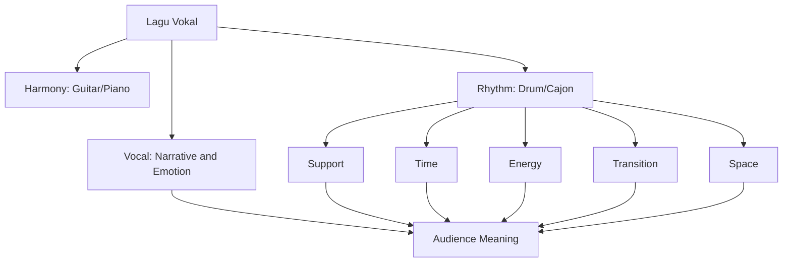
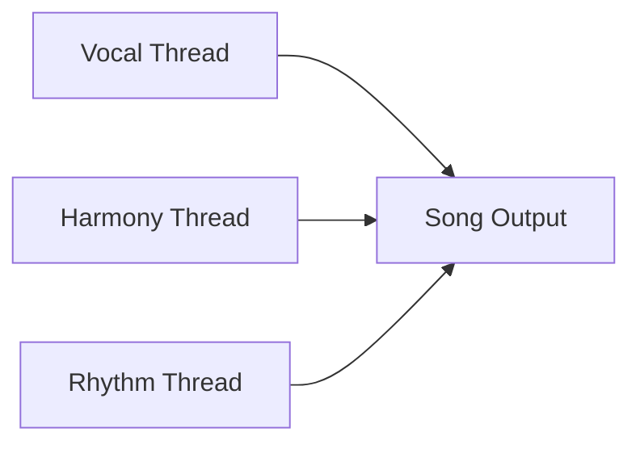
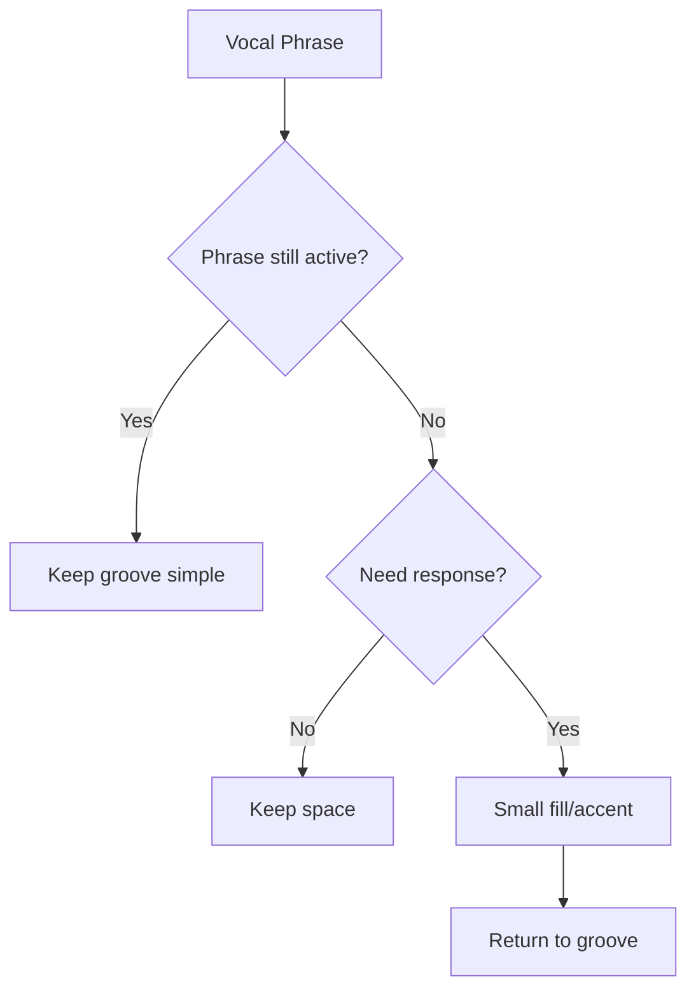
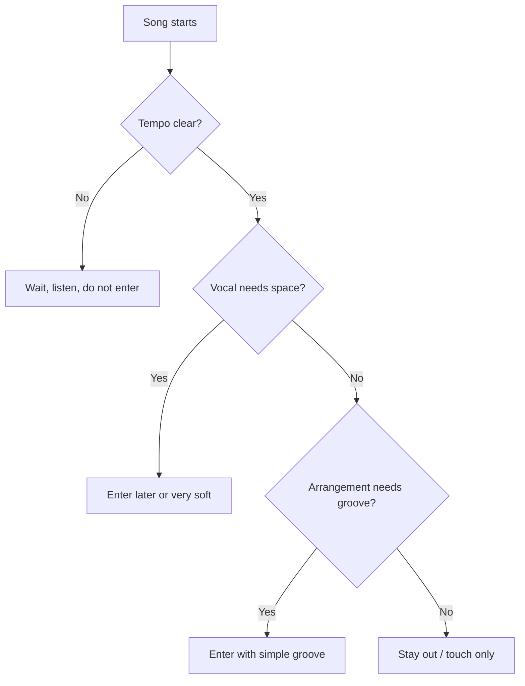
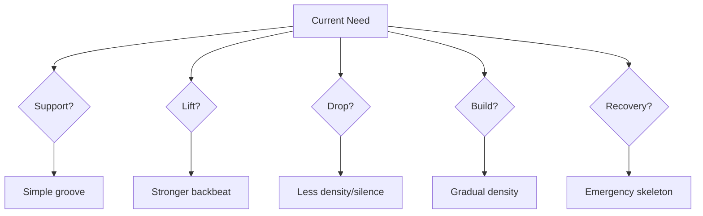

# learn-drum-cajon-part-017.md

# Part 017 — Mengiringi Penyanyi Solo: Sensitivity, Space, dan Breath

## Status Seri

- Seri: `learn-drum-cajon`
- Part: `017`
- Topik: Mengiringi penyanyi solo dengan drum/cajon
- Target akhir seri: mampu mengiringi penyanyi dengan drum dan/atau cajon secara stabil, musikal, dan sadar konteks
- Status: seri belum selesai
- Part sebelumnya: `learn-drum-cajon-part-016.md`
- Part berikutnya: `learn-drum-cajon-part-018.md`

---

## Tujuan Part Ini

Part ini membahas situasi paling sensitif dalam accompaniment: mengiringi penyanyi. Bisa dalam format:

- penyanyi solo + cajon,
- penyanyi + drum kit ringan,
- penyanyi + gitar + cajon,
- penyanyi + piano + drum/cajon,
- rehearsal vokal,
- acoustic performance,
- worship/acoustic set,
- cafe gig.

Fokus utama:

> membuat penyanyi merasa aman, terdengar jelas, dan emosinya terbantu.

Setelah menyelesaikan part ini, kamu harus mampu:

1. memahami vokal sebagai pusat lagu,
2. membaca phrasing penyanyi,
3. memberi ruang napas,
4. menghindari fill yang menabrak lirik,
5. menyesuaikan dinamika dengan intensitas vokal,
6. mendukung rubato intro,
7. merespons cue visual,
8. menentukan kapan harus masuk,
9. menentukan kapan harus diam,
10. recover tanpa membuat penyanyi panik.

---

# 1. Prinsip Utama: Vocal-First Accompaniment

Dalam lagu vokal, drum/cajon bukan pusat narasi. Penyanyi membawa:

- lirik,
- melodi,
- emosi,
- artikulasi,
- cerita,
- phrasing,
- intensitas.

Drum/cajon membawa:

- waktu,
- groove,
- energi,
- transisi,
- ruang,
- aksen,
- stabilitas.



Jika drum/cajon menutup vokal, maka accompaniment gagal walaupun pattern benar.

Rule:

> Jika pendengar tidak bisa menangkap lirik karena permainanmu, kamu sedang mengganggu lagu.

---

# 2. Apa yang Dibutuhkan Penyanyi dari Drummer/Cajon Player?

Penyanyi biasanya membutuhkan:

1. tempo yang bisa dipercaya,
2. volume yang tidak menutup,
3. ruang untuk phrasing,
4. cue yang jelas,
5. transisi yang aman,
6. tidak dikejar,
7. tidak ditinggal,
8. tidak dikagetkan fill acak,
9. ending yang disepakati,
10. recovery yang tenang saat ada kesalahan.

## 2.1 Penyanyi Butuh Aman

Aman berarti:

- tahu di mana beat 1,
- tahu kapan chorus masuk,
- tidak harus melawan volume,
- bisa bernapas,
- bisa sedikit fleksibel tanpa groove collapse.

## 2.2 Penyanyi Butuh Ruang

Ruang berarti:

- tidak semua jeda diisi fill,
- backbeat tidak terlalu keras,
- touch/hi-hat tidak menutup konsonan,
- tidak ada crash/slap tajam di atas kata penting.

## 2.3 Penyanyi Butuh Respons

Respons bukan selalu fill. Respons bisa berupa:

- menahan,
- turun volume,
- menaikkan energi,
- stop,
- memberi accent kecil,
- tetap stabil.

---

# 3. Vokal sebagai Primary Thread

Gunakan mental model concurrency:



Vocal thread adalah thread utama. Rhythm thread tidak boleh:

- block vocal thread,
- starve vocal thread,
- spam event,
- create race condition,
- override emotional state.

Dalam bahasa musikal:

- jangan menutup vokal,
- jangan mengganggu phrasing,
- jangan fill di tempat salah,
- jangan terlalu keras,
- jangan mengubah tempo tanpa alasan.

---

# 4. Breath Awareness

Penyanyi bernapas. Napas adalah cue musikal.

Penyanyi bernapas untuk:

- masuk frase baru,
- mempersiapkan nada tinggi,
- memulai chorus,
- menahan emosi,
- memberi ruang dramatis,
- mengakhiri section.

## 4.1 Jenis Napas

| Jenis Napas | Makna Potensial |
|---|---|
| napas kecil | frase biasa |
| napas besar | bagian penting/chorus/nada tinggi |
| napas tertahan | tension/emotional moment |
| napas sebelum masuk | cue entry |
| napas setelah frase | ruang respons |

## 4.2 Cara Merespons Napas

Jika napas besar menuju chorus:

- boleh fill kecil,
- boleh naik dynamics,
- boleh memberi accent beat 1,
- jangan fill terlalu panjang.

Jika napas dalam bagian intimate:

- turunkan volume,
- jangan isi semua ruang,
- biarkan emosi muncul.

Jika penyanyi mengambil napas setelah frase:

- boleh respons kecil,
- tetapi tidak wajib.

Rule:

> Napas penyanyi adalah bagian dari time dan phrase, bukan gangguan.

---

# 5. Vocal Phrasing

Phrasing adalah cara penyanyi membagi kalimat musikal.

Penyanyi bisa:

- masuk sedikit sebelum beat,
- masuk sedikit setelah beat,
- menahan kata melewati bar,
- mempercepat kata pendek,
- memberi jeda dramatis,
- mengulang hook,
- memperpanjang ending.

Drum/cajon harus tetap menjaga pulse sambil memberi ruang.



## 5.1 Jangan Menabrak Frase Aktif

Frase aktif adalah saat penyanyi masih menyampaikan makna.

Contoh:

```text
"Aku ingin pulang..."
```

Jangan isi fill besar di tengah:

```text
"Aku ingin [FILL RAMAI] pulang..."
```

Lebih baik:

```text
"Aku ingin pulang..." [fill kecil setelah frase]
```

---

# 6. Lyric Sensitivity

Tidak semua kata punya bobot yang sama.

Kata penting biasanya:

- judul lagu,
- hook,
- kata emosional,
- kata akhir kalimat,
- kata dengan nada tinggi,
- kata yang diulang,
- kata yang didiamkan setelahnya.

Drum/cajon harus menghindari menabrak kata-kata ini.

## 6.1 Latihan Lyric Marking

Ambil lirik lagu. Tandai:

```md
[SPACE] bagian yang harus dibiarkan
[FILL SAFE] bagian setelah frase
[LIFT] menuju chorus
[DROP] bagian intimate
[STOP] ending/diam
```

Contoh:

```text
Aku ingin pulang [FILL SAFE]
ke rumah yang hilang [SPACE]
namamu masih tinggal [LIFT]
di dadaku yang paling dalam [CHORUS]
```

---

# 7. Volume terhadap Vokal

## 7.1 Rule Dasar

Vokal harus tetap terdengar jelas. Drum/cajon harus berada di bawah atau di sekitar vokal, bukan di atasnya.

Dalam acoustic setting:

| Instrumen | Risiko |
|---|---|
| Cajon slap | menutup artikulasi |
| Hi-hat | menusuk high frequency |
| Snare | terlalu tajam |
| Crash | menutup kata |
| Ride wash | membuat vokal kabur |
| Bass cajon/kick | bisa mengaburkan low vocal/piano |

## 7.2 Rekam dari Posisi Pendengar

Jangan hanya mendengar dari posisi pemain. Rekam dari depan, tempat pendengar.

Checklist:

| Pertanyaan | Ya/Tidak |
|---|---|
| Lirik jelas? | |
| Slap/snare terlalu keras? | |
| Hi-hat/touch terlalu ramai? | |
| Fill menabrak vocal? | |
| Chorus naik tapi vokal tetap aman? | |
| Verse cukup intimate? | |

---

# 8. Kapan Harus Masuk?

Tidak semua lagu butuh drum/cajon dari awal.

## 8.1 Entry Options

| Entry | Cocok untuk |
|---|---|
| dari awal | lagu sudah tempo jelas dan butuh groove |
| setelah intro | gitar/piano intro |
| setelah vokal line pertama | intimate verse |
| saat pre-chorus | build |
| saat chorus | dramatic lift |
| setelah rubato | intro bebas tempo |

## 8.2 Decision Tree Entry



Rule:

> Masuk terlambat dengan aman lebih baik daripada masuk cepat tetapi merusak mood.

---

# 9. Rubato Intro

Rubato adalah bagian tempo bebas, sering di intro ballad atau worship.

Contoh:

- piano intro bebas,
- penyanyi masuk tanpa strict tempo,
- gitar fingerstyle melambat/menahan,
- vocal pickup sebelum groove.

## 9.1 Cara Mengiringi Rubato

Jangan langsung memaksakan groove.

Lakukan:

1. dengarkan penyanyi/piano/gitar,
2. cari kapan tempo mulai stabil,
3. tunggu cue,
4. masuk sederhana,
5. jangan fill di awal masuk.

## 9.2 Cue Masuk Setelah Rubato

Cue bisa berupa:

- penyanyi mengangguk,
- gitar mulai strumming regular,
- piano mulai pattern steady,
- lyric masuk ke verse,
- leader menghitung,
- napas besar.

Rule:

> Pada rubato, time bukan dipegang metronome internalmu sendiri. Time muncul dari kesepakatan bersama.

---

# 10. Kapan Harus Diam?

Diam adalah skill accompaniment.

Kamu harus mempertimbangkan diam saat:

- lirik sangat penting,
- verse pertama sangat intimate,
- bridge drop,
- sebelum final chorus,
- setelah kata emosional,
- ending,
- penyanyi ingin rubato,
- pemain chordal sedang solo intro,
- kamu tidak yakin form.

## 10.1 Diam Tanpa Kehilangan Time

Latihan:

```text
Bar 1: groove
Bar 2: groove
Bar 3: diam
Bar 4: diam
Bar 5: masuk lagi
```

Tetap hitung dalam hati.

## 10.2 Diam sebagai Fill

Sebelum chorus:

```text
Bar 4 beat 4: stop
Bar 5 beat 1: chorus masuk
```

Ini sering lebih kuat daripada fill ramai.

---

# 11. Fill untuk Penyanyi

Fill dalam accompaniment vokal harus sangat selektif.

## 11.1 Fill Aman

Fill aman biasanya:

- setelah frase vokal selesai,
- di akhir 4/8 bar,
- sebelum chorus,
- sebelum bridge,
- pada ruang instrumental.

## 11.2 Fill Berbahaya

Fill berbahaya biasanya:

- di atas kata penting,
- di tengah nada panjang,
- saat vokal lembut,
- saat penyanyi mengambil napas kecil,
- saat kamu tidak yakin form,
- saat tempo belum stabil.

## 11.3 Fill Size

| Context | Fill Size |
|---|---|
| intimate verse | none / tiny |
| verse to pre | small |
| pre to chorus | medium |
| chorus to verse | reset/small |
| bridge drop | silence |
| bridge to final | build |
| ending | cue |

---

# 12. Visual Cue

Penyanyi sering memberi cue visual.

Perhatikan:

| Cue | Makna Mungkin |
|---|---|
| kontak mata | siap masuk/berubah |
| tangan naik | build |
| tangan turun | drop |
| tangan mengepal | stop |
| mengangguk | masuk/lanjut |
| menjauh dari mic | vokal akan besar |
| mendekat ke mic | vokal akan lembut |
| badan berbalik ke band | cue transition |
| senyum/kaget | ada kesalahan, recover |

Jangan menatap terus-menerus sampai canggung, tetapi biasakan peripheral awareness.

---

# 13. Komunikasi Sebelum Main

Sebelum rehearsal/performance, tanyakan hal penting.

## 13.1 Pertanyaan Minimum

```text
Tempo-nya seperti versi mana?
Intro berapa bar?
Aku masuk dari awal atau chorus?
Chorus pertama full atau ditahan?
Bridge drop atau build?
Ending stop, tag, atau ritard?
Ada bagian rubato?
Fill boleh seberapa ramai?
```

## 13.2 Untuk Penyanyi Solo

Tanyakan:

```text
Kamu mau verse pertama kosong atau masuk cajon/drum?
Kalau aku terlalu keras, kasih cue ya.
Ending ikut kamu atau fixed?
Bagian mana yang kamu mau ditahan?
```

Ini membuat penyanyi merasa aman.

---

# 14. Accompaniment Modes

## 14.1 Support Mode

Tujuan:

- menjaga waktu,
- tidak menonjol.

Pattern:

- basic/sparse,
- no fill,
- dynamics kecil.

## 14.2 Lift Mode

Tujuan:

- menaikkan chorus/pre-chorus.

Pattern:

- density naik,
- backbeat jelas,
- fill kecil.

## 14.3 Drop Mode

Tujuan:

- memberi ruang/tension.

Pattern:

- silence,
- bass only,
- touch only,
- rim/tap.

## 14.4 Build Mode

Tujuan:

- naik bertahap menuju puncak.

Pattern:

- density bertambah,
- volume naik,
- fill build,
- tetap tempo stabil.

## 14.5 Recovery Mode

Tujuan:

- menyelamatkan lagu saat salah.

Pattern:

- emergency skeleton,
- no fill,
- dengar vokal,
- cari beat 1.



---

# 15. Mengiringi Penyanyi + Cajon

Cajon sangat umum untuk singer accompaniment.

## 15.1 Strength

- natural acoustic sound,
- volume relatif mudah,
- cocok untuk intimate setting,
- bisa menggantikan kick/snare,
- tidak butuh setup besar.

## 15.2 Risk

- slap terlalu tajam,
- touch terlalu ramai,
- bass hilang,
- tangan sakit,
- groove monoton.

## 15.3 Strategy

Verse:

```text
Bass soft
Slap soft
Touch sparse
```

Chorus:

```text
Bass clearer
Slap level 3
Touch fuller
```

Bridge:

```text
Drop to touch/bass only or silence
```

Final:

```text
Stronger but still vocal-safe
```

Rule:

> Cajon harus terasa seperti lantai yang hangat di bawah vokal, bukan seperti seseorang mengetuk kotak di depan vokal.

---

# 16. Mengiringi Penyanyi + Drum Kit

Drum kit lebih riskan karena volume.

## 16.1 Strategy

Untuk acoustic vocal:

- gunakan stick ringan/rod/brush jika ada,
- closed hi-hat lembut,
- snare level 1–2,
- rim click untuk verse,
- crash minimal,
- kick tidak berlebihan.

Untuk full band:

- lock dengan bass,
- snare jelas,
- hi-hat tidak menusuk,
- tetap dengar vokal.

## 16.2 Drum Kit Soft Options

| Need | Option |
|---|---|
| soft verse | rim click |
| subtle pulse | closed hat light |
| low support | kick light |
| no snare harshness | cross-stick/rim |
| build | snare/tom crescendo |
| chorus | full backbeat |

---

# 17. Latihan: Vocal-First Playthrough

Pilih satu lagu vokal.

Tahap:

1. dengarkan vokal saja,
2. tandai lyric penting,
3. tandai napas besar,
4. main groove sangat sederhana,
5. turunkan volume saat lyric penting,
6. fill hanya setelah frase,
7. rekam.

Review:

| Pertanyaan | Ya/Tidak |
|---|---|
| Lirik terdengar jelas? | |
| Fill tidak menabrak? | |
| Verse cukup kecil? | |
| Chorus naik? | |
| Napas penyanyi terasa dihormati? | |
| Ending mengikuti vokal? | |

---

# 18. Latihan: Breath Cue Simulation

Putar lagu. Tanpa alat, lakukan:

1. angkat tangan setiap penyanyi mengambil napas besar,
2. tepuk kecil setelah frase selesai,
3. jangan tepuk saat kata penting,
4. catat fill-safe spots.

Lalu mainkan cajon/drum:

- fill hanya di spot yang kamu tandai,
- tidak fill di tempat lain.

---

# 19. Latihan: Three-Level Vocal Support

Pilih satu groove.

Mainkan:

## Level 1 — Under Vocal

- sangat pelan,
- hampir tidak mengganggu,
- cocok untuk verse.

## Level 2 — With Vocal

- jelas tetapi masih di bawah vokal,
- cocok untuk normal section.

## Level 3 — Lift Vocal

- lebih kuat,
- mendukung chorus,
- tetap tidak menutup.

Tujuan:

> Volume drum/cajon harus mengangkat vokal, bukan melawannya.

---

# 20. Latihan: Rubato Entry

Simulasikan rubato:

1. mainkan intro bebas tanpa metronome di gitar/piano track atau nyanyian,
2. tentukan cue masuk,
3. masuk dengan groove sangat sederhana,
4. jangan fill di entry pertama,
5. stabilkan tempo setelah masuk.

Jika latihan sendiri:

- nyanyikan line bebas,
- lalu hitung masuk,
- mainkan groove.

---

# 21. Latihan: Emergency Recovery

Simulasi salah:

1. main groove,
2. sengaja berhenti satu beat,
3. kembali ke skeleton,
4. cari beat 1,
5. jangan fill 2 bar berikutnya,
6. lanjut.

Drum emergency:

```text
Kick  : 1 dan 3
Snare : 2 dan 4
Hat   : optional
```

Cajon emergency:

```text
Bass  : 1 dan 3
Slap  : 2 dan 4
Touch : optional
```

---

# 22. Common Mistakes

## 22.1 Memperlakukan Penyanyi seperti Metronome

Penyanyi bukan metronome. Phrasing vokal bisa fleksibel.

Solusi:

- jaga pulse,
- tetapi beri ruang,
- jangan memaksa setiap syllable ke grid.

## 22.2 Mengisi Semua Jeda

Gejala:

- penyanyi tidak punya napas,
- lagu sesak.

Solusi:

- biarkan beberapa jeda kosong,
- fill hanya setelah frase penting.

## 22.3 Terlalu Keras

Gejala:

- penyanyi menaikkan suara,
- lirik tidak jelas.

Solusi:

- rekam dari depan,
- main 30% lebih pelan,
- kurangi slap/snare/hi-hat.

## 22.4 Masuk Saat Rubato Belum Selesai

Gejala:

- groove terasa memaksa,
- penyanyi/piano belum siap.

Solusi:

- tunggu cue,
- masuk saat tempo stabil.

## 22.5 Panik Saat Penyanyi Mengubah Form

Gejala:

- penyanyi ulang chorus,
- kamu sudah ending.

Solusi:

- dengar cue,
- stay simple,
- jangan fill besar sampai yakin.

---

# 23. Debugging Guide

| Gejala | Kemungkinan Penyebab | Correction |
|---|---|---|
| Vokal tertutup | volume/density tinggi | reduce slap/snare/hat |
| Penyanyi terasa dikejar | rushing | slow/internal pulse drill |
| Lagu terasa kosong | terlalu sedikit support | add light touch/hat |
| Fill mengganggu | fill over phrase | mark lyric-safe spots |
| Entry salah | cue tidak jelas | define entry |
| Rubato kacau | masuk terlalu cepat | wait for tempo cue |
| Ending beda | ending tidak disepakati | define ending type |
| Penyanyi tidak nyaman | terlalu fokus diri | vocal-first listening |
| Groove collapse saat vokal fleksibel | internal clock lemah | metronome + vocal track |

---

# 24. Practice Protocol 30 Menit

## Sesi Vocal Sensitivity

| Durasi | Latihan |
|---:|---|
| 5 menit | listen vocal only |
| 5 menit | mark lyric/breath |
| 5 menit | play very soft groove |
| 5 menit | add chorus lift |
| 5 menit | fill only after phrase |
| 5 menit | record/review |

## Sesi Space Control

| Durasi | Latihan |
|---:|---|
| 5 menit | groove sparse |
| 5 menit | silence after phrase |
| 5 menit | no-fill verse |
| 5 menit | small-fill prechorus |
| 5 menit | bridge drop |
| 5 menit | review vocal clarity |

## Sesi Recovery and Cue

| Durasi | Latihan |
|---:|---|
| 5 menit | count-in |
| 5 menit | rubato entry simulation |
| 5 menit | visual cue simulation |
| 5 menit | emergency skeleton |
| 5 menit | ending types |
| 5 menit | review |

---

# 25. Vocal Accompaniment Worksheet

```md
# Vocal Accompaniment Worksheet

Song:
Singer:
Tempo:
Meter:
Mood:

## Vocal Notes
Important lyric:
Highest intensity:
Softest section:
Breath cues:
Rubato parts:

## Entry Plan
Start:
Instrument enters:
Cue:

## Section Dynamics
Intro:
Verse:
Pre:
Chorus:
Bridge:
Final:
Ending:

## Fill Rules
No-fill zones:
Fill-safe zones:
Max fill size:

## Volume Notes
Drum/cajon risk:
How to stay under vocal:

## Recovery Plan
If lost:
If singer repeats:
If ending changes:
```

---

# 26. Self-Scoring Rubric

Nilai 1–5.

| Area | 1 | 3 | 5 |
|---|---|---|---|
| Vocal clarity | tertutup | cukup | sangat jelas |
| Breath awareness | tidak sadar | cukup | peka |
| Fill restraint | terlalu banyak | cukup | tepat |
| Entry | sering salah | cukup | aman |
| Rubato handling | memaksa | cukup | sabar |
| Dynamics | datar | cukup | mendukung vokal |
| Cue response | lambat | cukup | responsif |
| Recovery | panik | cukup | tenang |
| Ending | tidak jelas | cukup | meyakinkan |

Target:

- minimal 3 semua area,
- minimal 4 untuk vocal clarity,
- minimal 4 untuk fill restraint,
- minimal 4 untuk recovery.

---

# 27. Mini Capstone Part Ini

Pilih satu lagu vokal dan rekam 3 menit accompaniment.

Struktur evaluasi:

```text
0:00–0:30 intro/entry
0:30–1:00 verse soft
1:00–1:30 pre/chorus lift
1:30–2:00 verse reset or bridge
2:00–2:30 final lift
2:30–3:00 ending
```

Review:

| Pertanyaan | Ya/Tidak |
|---|---|
| Penyanyi/vokal tetap pusat? | |
| Volume aman? | |
| Fill tidak menabrak lirik? | |
| Napas/frase dihormati? | |
| Entry tidak memaksa? | |
| Chorus naik tanpa rushing? | |
| Ending jelas? | |
| Jika salah, recovery tenang? | |

---

# 28. Acceptance Criteria Part Ini

Kamu boleh lanjut ke Part 018 jika:

1. bisa menjelaskan vocal-first accompaniment,
2. bisa menandai breath cue dalam lagu,
3. bisa menandai no-fill zone,
4. bisa menentukan fill-safe spot,
5. bisa memainkan verse soft tanpa menutup vokal,
6. bisa menaikkan chorus tanpa rushing,
7. bisa memakai silence sebagai ruang vokal,
8. bisa menangani rubato entry sederhana,
9. bisa membuat vocal accompaniment worksheet,
10. bisa recover dengan emergency skeleton saat tersesat.

---

# 29. Ringkasan

Mengiringi penyanyi adalah latihan sensitivity.

Skill utama:

- mendengar vokal,
- menghormati napas,
- membaca phrasing,
- mengontrol volume,
- menahan fill,
- memilih entry,
- mengikuti cue,
- menggunakan silence,
- recover dengan tenang.

Drum/cajon yang baik membuat penyanyi:

- merasa aman,
- terdengar jelas,
- lebih ekspresif,
- tidak perlu melawan volume,
- bisa membangun emosi.

Rule paling penting:

> Penyanyi bukan pengiring drum/cajon. Drum/cajon adalah pengiring penyanyi.

---

# 30. Latihan untuk Part Berikutnya

Sebelum lanjut ke Part 018, lakukan:

1. Isi vocal accompaniment worksheet untuk satu lagu.
2. Tandai breath cue.
3. Tandai no-fill zone dan fill-safe zone.
4. Rekam accompaniment 3 menit.
5. Review dari perspektif vokal:
   - apakah lirik jelas?
   - apakah fill sopan?
   - apakah volume aman?
   - apakah ending mengikuti penyanyi?

Part berikutnya membahas:

> bermain dengan gitar, piano, dan bass: locking, role separation, density conflict, rhythmic agreement, dan cara membuat ensemble terdengar rapi.
