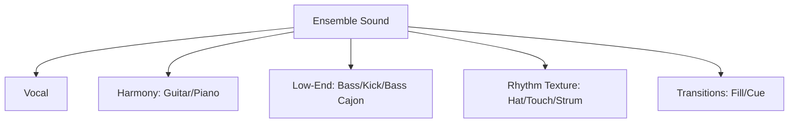
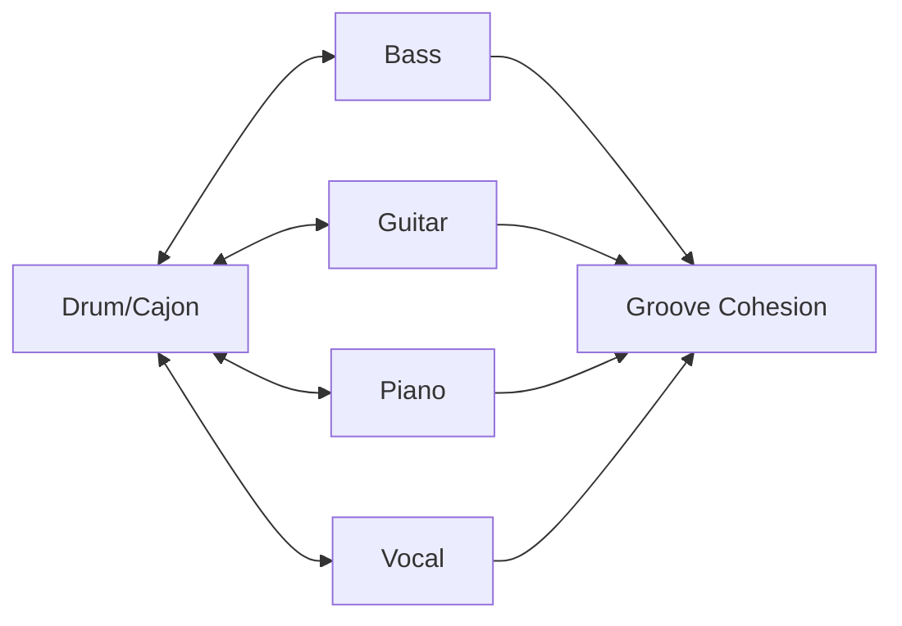
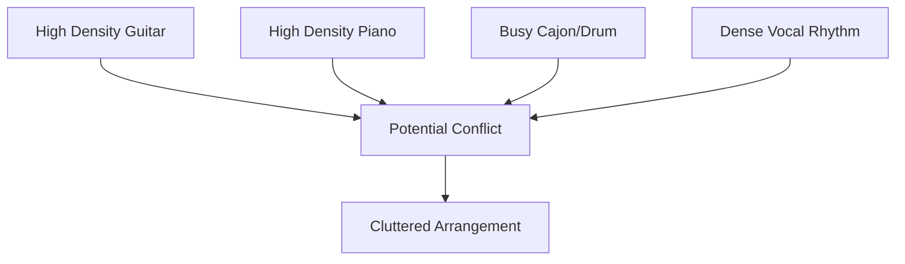
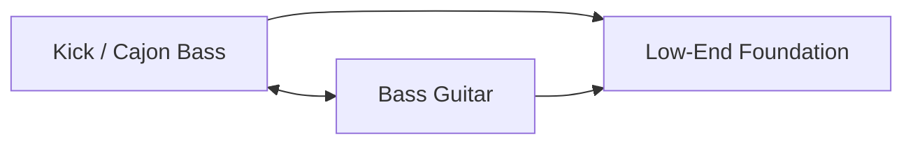
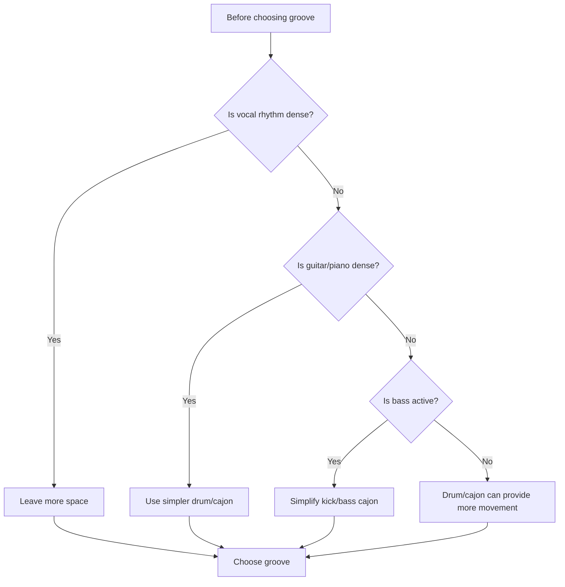

# learn-drum-cajon-part-018.md

# Part 018 — Bermain dengan Gitar/Piano/Bass: Locking dan Role Separation

## Status Seri

- Seri: `learn-drum-cajon`
- Part: `018`
- Topik: Bermain dalam ensemble dengan gitar, piano, dan bass
- Target akhir seri: mampu mengiringi penyanyi dengan drum dan/atau cajon secara stabil, musikal, dan sadar konteks
- Status: seri belum selesai
- Part sebelumnya: `learn-drum-cajon-part-017.md`
- Part berikutnya: `learn-drum-cajon-part-019.md`

---

## Tujuan Part Ini

Part ini membahas bagaimana drum/cajon bekerja bersama instrumen lain. Dalam accompaniment nyata, kamu jarang bermain sendirian. Kamu harus berinteraksi dengan:

- gitar akustik,
- gitar elektrik,
- piano/keyboard,
- bass,
- penyanyi,
- backing track,
- percussion lain.

Masalah utama ensemble bukan selalu skill individu. Sering kali masalahnya adalah **role collision**: semua orang mengisi ruang yang sama.

Setelah menyelesaikan part ini, kamu harus mampu:

1. memahami konsep locking,
2. membedakan role drum/cajon dengan gitar, piano, dan bass,
3. menghindari rhythmic density conflict,
4. mengunci kick/bass cajon dengan bass,
5. mengunci hi-hat/touch dengan strumming gitar,
6. memberi ruang untuk piano comping,
7. memilih groove berdasarkan ensemble texture,
8. mengurangi permainan saat instrumen lain padat,
9. berkomunikasi dalam rehearsal,
10. membuat arrangement yang tidak saling menabrak.

---

# 1. Ensemble sebagai Sistem

Dalam ensemble, setiap instrumen adalah layer. Jika semua layer bergerak terlalu banyak di area yang sama, lagu menjadi sesak.



Tujuan drum/cajon bukan hanya bermain benar sendiri. Tujuannya adalah membuat seluruh sistem terdengar rapi.

Rule:

> Ensemble yang baik bukan kumpulan pemain yang masing-masing sibuk. Ensemble yang baik adalah pembagian peran yang saling melengkapi.

---

# 2. Locking

## 2.1 Definisi Locking

Locking berarti dua atau lebih instrumen terasa menyatu secara timing, accent, dan intention.

Contoh:

- kick lock dengan bass,
- cajon bass lock dengan gitar bass note,
- hi-hat lock dengan strumming,
- snare/slap lock dengan accent band,
- fill lock dengan chord change.

Locking bukan berarti memainkan note yang sama terus-menerus. Locking berarti saling sadar.



## 2.2 Locking vs Following

Following berarti kamu hanya mengejar orang lain. Locking berarti kalian saling membentuk groove.

Jika kamu hanya follow gitar yang timing-nya goyah, kamu ikut goyah.

Jika kamu lock dengan ensemble, kamu menjaga pulse sambil menyesuaikan feel.

---

# 3. Role Separation

Role separation berarti tiap instrumen tahu ruangnya.

## 3.1 Layer Umum

| Layer | Instrumen Umum | Fungsi |
|---|---|---|
| Vocal | singer | melody, lyric |
| Harmony | guitar/piano | chord, color |
| Low-end | bass, kick, bass cajon | foundation |
| Backbeat | snare, slap, clap | groove identity |
| Subdivision | hi-hat, touch, strumming | movement |
| Transition | fill, chord push, vocal cue | section change |

Masalah muncul jika semua mengisi subdivision padat.

Contoh conflict:

```text
Gitar strumming 16th padat
Piano comping rhythm padat
Cajon touch 16th padat
Vocal syllables padat
```

Hasil: sesak.

---

# 4. Density Conflict

Density conflict terjadi saat terlalu banyak instrumen memainkan terlalu banyak note pada waktu yang sama.



Solusi:

- satu instrumen padat, yang lain sederhana,
- kurangi touch/hi-hat,
- kurangi fill,
- gunakan ruang,
- bagi register dan rhythm.

Rule:

> Jika gitar/piano sudah penuh, drum/cajon harus lebih selektif.

---

# 5. Bermain dengan Gitar Akustik

Gitar akustik sering menjadi partner utama cajon.

## 5.1 Gitar sebagai Subdivision Engine

Gitar strumming sering memainkan subdivision:

```text
1 & 2 & 3 & 4 &
D   D U   U D U
```

Jika gitar sudah mengisi 8th/16th note, cajon/drum tidak perlu memainkan subdivision terlalu keras.

## 5.2 Lock dengan Strumming

Dengarkan:

- accent strum,
- downstroke besar,
- muted strum,
- chord change,
- stop,
- pickup sebelum chorus.

Cajon/drum bisa lock dengan:

- bass/kick pada chord change,
- slap/snare pada backbeat,
- touch/hi-hat mengikuti atau melengkapi strum.

## 5.3 Jika Gitar Strumming Padat

Strategi drum/cajon:

- kurangi touch/hi-hat,
- fokus bass/slap atau kick/snare,
- no fill di antara strum padat,
- jaga vokal.

Cajon:

```text
Bass  : 1 dan 3
Slap  : 2 dan 4
Touch : sparse
```

Drum:

```text
Kick/snare simple
Hi-hat soft or quarter note
```

## 5.4 Jika Gitar Fingerpicking

Strategi:

- cajon boleh memberi pulse lebih jelas,
- touch ringan bisa membantu flow,
- jangan terlalu keras,
- jaga ruang vokal.

Cajon:

```text
Touch soft 8th
Bass/slap soft
```

Drum:

```text
rim click / closed hat light / kick soft
```

---

# 6. Bermain dengan Gitar Elektrik

Gitar elektrik bisa punya beberapa peran:

- rhythm strumming,
- ambient pad,
- lead line,
- riff,
- power chord,
- delay texture.

## 6.1 Jika Gitar Elektrik Ambient

Drum/cajon boleh memberi groove lebih jelas karena gitar tidak padat rhythm.

Strategi:

- stable pulse,
- backbeat controlled,
- build dynamics.

## 6.2 Jika Gitar Elektrik Riff-Based

Jika gitar memainkan riff rhythm kuat, drum harus lock dengan riff.

Pertanyaan:

- riff accent di mana?
- kick perlu mengikuti accent?
- snare tetap 2/4?
- apakah hi-hat harus sederhana?

Rule:

> Jangan membuat kick pattern yang melawan riff utama kecuali memang arrangement-nya begitu.

## 6.3 Jika Gitar Solo/Lead

Drum/cajon harus:

- menjaga groove,
- jangan fill terlalu banyak,
- beri ruang lead,
- accent section seperlunya.

---

# 7. Bermain dengan Piano/Keyboard

Piano punya range sangat luas. Ia bisa menjadi:

- chord pad,
- rhythmic comping,
- bass line,
- melodic fill,
- arpeggio,
- lead,
- orchestral texture.

Karena itu, piano mudah bertabrakan dengan drum/cajon jika semua padat.

## 7.1 Dengarkan Tangan Kiri Piano

Tangan kiri sering mengisi low-end.

Jika tangan kiri piano aktif:

- kick/bass cajon harus sederhana,
- jangan terlalu banyak low hit,
- lock di downbeat penting,
- beri ruang.

Jika tangan kiri minimal:

- kick/bass cajon boleh lebih jelas.

## 7.2 Dengarkan Tangan Kanan Piano

Tangan kanan bisa mengisi rhythm dan melody.

Jika tangan kanan banyak fill:

- drum/cajon fill harus dikurangi,
- jangan menabrak piano fill,
- jaga groove.

## 7.3 Piano Ballad

Strategi:

- drum/cajon masuk belakangan,
- dynamics sangat kecil,
- banyak ruang,
- ride/hi-hat/cajon touch hati-hati,
- fill sangat selektif.

## 7.4 Piano Worship/Anthem

Strategi:

- ikuti build,
- jangan full terlalu cepat,
- lock with left hand/bass,
- gunakan dynamic arc.

---

# 8. Bermain dengan Bass

Bass adalah partner paling penting untuk drum kit, dan juga relevan untuk cajon jika ada bass player.

## 8.1 Kick dan Bass

Kick dan bass bersama membentuk low-end groove.



Jika kick dan bass tidak lock:

- lagu terasa goyah,
- low-end keruh,
- groove tidak solid,
- penyanyi merasa tidak aman.

## 8.2 Haruskah Kick Mengikuti Bass?

Tidak selalu 100%, tetapi harus sadar.

Pilihan:

| Approach | Kapan Dipakai |
|---|---|
| kick mengikuti bass utama | pop/rock tight |
| kick hanya downbeat | acoustic/simple |
| kick lebih sparse dari bass | bass line aktif |
| kick four-on-floor | anthem/dance/worship |
| kick accent chord changes | arrangement tertentu |

## 8.3 Jika Bass Aktif

Jika bass memainkan banyak note:

- kick jangan terlalu banyak,
- snare/backbeat tetap stabil,
- hi-hat/touch jaga time,
- dengarkan accent utama bass.

## 8.4 Jika Bass Sederhana

Jika bass simple root notes:

- kick bisa lock dengan root,
- groove terasa solid,
- boleh tambah kick variation sedikit.

---

# 9. Drum/Cajon dengan Tanpa Bass Player

Jika tidak ada bass player, kick/bass cajon menjadi lebih penting sebagai low foundation.

## 9.1 Acoustic Without Bass

Format:

- vocal + guitar + cajon,
- vocal + piano + cajon,
- vocal + guitar + drum light.

Strategi:

- bass cajon/kick harus jelas,
- jangan terlalu lemah,
- tetap jangan berlebihan,
- lock dengan chord changes.

## 9.2 Cajon Bass Role

Bass cajon bisa membantu gitar/piano terasa punya ground.

Contoh:

```text
Bass on chord changes
Slap on 2/4
Touch sparse
```

---

# 10. Bermain dengan Backing Track atau Loop

Jika ada backing track, loop, atau click, kamu harus lebih disiplin.

## 10.1 Track sebagai Fixed Timeline

Backing track tidak akan menyesuaikan kamu. Kamu harus lock ke track.

Risiko:

- fill membuat kamu keluar,
- tempo internal melawan track,
- dynamic tidak cocok,
- kamu tidak dengar track cukup jelas.

## 10.2 Strategy

- gunakan in-ear/click jika ada,
- main lebih sederhana,
- jangan fill panjang,
- dengar cue track,
- ikuti arrangement fixed.

---

# 11. Communication in Rehearsal

Ensemble rapi sering lahir dari komunikasi sederhana.

## 11.1 Pertanyaan untuk Gitaris

```text
Strumming verse padat atau ringan?
Chorus kamu buka lebih besar?
Ada stop sebelum chorus?
Intro berapa bar?
Aku lock ke accent mana?
```

## 11.2 Pertanyaan untuk Pianis

```text
Tangan kiri kamu aktif atau minimal?
Bridge drop atau build?
Ada piano fill yang harus aku beri ruang?
Chorus pertama full atau ditahan?
```

## 11.3 Pertanyaan untuk Bassist

```text
Kick ikut bass line atau cukup downbeat?
Ada accent penting?
Chorus four-on-floor atau tidak?
Bridge bass drop atau tetap jalan?
```

## 11.4 Pertanyaan untuk Penyanyi

```text
Bagian mana yang butuh ruang?
Ending ikut kamu atau fixed?
Kalau aku terlalu keras, kasih cue.
```

---

# 12. Ensemble Arrangement Matrix

| Ensemble | Drum/Cajon Strategy |
|---|---|
| Vocal only + cajon | sangat sensitif, soft, banyak ruang |
| Vocal + guitar + cajon | lock dengan strumming, jangan terlalu padat |
| Vocal + piano + cajon | dengar tangan kiri, hindari low conflict |
| Vocal + guitar + drum | drum light, hi-hat hati-hati |
| Full band + drum | lock kick-bass, dynamic band |
| Full band acoustic + cajon | cajon lebih jelas tapi tetap vocal-safe |
| Worship band | build bertahap, cue leader |
| Cafe acoustic | volume kecil, groove hangat |

---

# 13. Role Collision Scenarios

## 13.1 Gitar Padat + Cajon Padat

Gejala:

- lagu terasa ramai,
- vokal hilang,
- rhythm tidak jelas.

Solusi:

- cajon sparse,
- touch dikurangi,
- bass/slap utama saja.

## 13.2 Piano Fill + Drum Fill Bersamaan

Gejala:

- transisi berantakan,
- terlalu banyak informasi.

Solusi:

- siapa yang fill disepakati,
- drummer fill lebih kecil,
- dengar piano.

## 13.3 Bass Line Aktif + Kick Aktif

Gejala:

- low-end keruh,
- groove tidak lock.

Solusi:

- kick ikut accent utama saja,
- kurangi kick variation.

## 13.4 Vocal Padat + Hi-hat/Touch Padat

Gejala:

- lirik tidak jelas,
- high-frequency clutter.

Solusi:

- hi-hat/touch level 1,
- gunakan quarter/subdivision lebih jarang.

---

# 14. Ensemble Density Decision Tree



---

# 15. Locking Drills

## Drill 1 — Lock with Guitar Strum

Use metronome or guitar loop.

1. Clap backbeat.
2. Add cajon bass/slap or drum kick/snare.
3. Match guitar accent.
4. Reduce touch/hi-hat if cluttered.

## Drill 2 — Lock with Bass

Use bass loop/backing track.

1. Listen bass pattern.
2. Mark root/downbeat.
3. Play kick/bass cajon on main bass accents.
4. Keep snare/slap steady.

## Drill 3 — Lock with Piano

Use piano accompaniment.

1. Identify left hand rhythm.
2. Avoid low-end conflict.
3. Add simple groove.
4. Leave space for piano fills.

---

# 16. Role Separation Drills

## Drill A — One Dense, One Sparse

If guitar/piano is dense, play sparse.

```text
Guitar: dense 8th/16th
Cajon : bass/slap only
```

## Drill B — Trade Density

4 bars:

```text
Guitar/piano dense, drum/cajon sparse
```

Next 4 bars:

```text
Guitar/piano sparse, drum/cajon fuller
```

## Drill C — No-Fill When Others Fill

Play song. Every time piano/guitar does fill, you do not fill.

Tujuan:

- menghindari collision.

---

# 17. Groove Selection by Ensemble

## 17.1 Vocal + Guitar

Verse:

```text
sparse cajon/drum
```

Chorus:

```text
basic pop / stronger
```

If guitar strumming full:

```text
reduce touch/hi-hat
```

## 17.2 Vocal + Piano

Verse:

```text
minimal / soft
```

Chorus:

```text
basic groove with controlled backbeat
```

If piano left hand active:

```text
simple kick/bass cajon
```

## 17.3 Vocal + Bass + Guitar

Drum kit:

```text
kick locks bass
snare 2/4
hat supports strum
```

Cajon:

```text
bass less busy if bass guitar active
slap backbeat
touch sparse
```

## 17.4 Full Band

Drum:

```text
foundation role stronger
dynamic arc larger
cymbal controlled
```

Cajon:

```text
may need stronger slap/bass
avoid being swallowed
still vocal-safe
```

---

# 18. Frequency Awareness

Walau kita tidak masuk mixing detail, kamu perlu sadar ruang frekuensi.

| Area | Instrumen |
|---|---|
| low | kick, bass, cajon bass, piano left |
| mid | vocal body, guitar, piano, snare body |
| high | vocal consonants, hi-hat, cymbal, cajon slap attack |

Masalah:

- hi-hat/slap menutup vocal consonants,
- kick/bass cajon bertabrakan dengan bass/piano left,
- crash menutup hook.

Rule:

> Jika lirik tidak jelas, kurangi high-frequency rhythm dulu: hi-hat, cymbal, slap, touch.

---

# 19. Timing Hierarchy dalam Ensemble

Siapa yang jadi referensi time?

Tergantung konteks:

| Context | Time Reference |
|---|---|
| full band with drummer | drummer/click |
| acoustic singer-led | vocal/guitar/piano shared |
| worship rubato intro | leader/piano/vocal |
| backing track | track/click |
| no drummer, cajon only | cajon + vocal/guitar |

Drum/cajon harus bisa menjadi stabil tanpa memaksa.

---

# 20. Rehearsal Protocol

## 20.1 First Pass

Main lagu sekali dengan groove sederhana. Jangan banyak fill.

Tujuan:

- memahami form,
- mendengar density,
- melihat cue.

## 20.2 Discuss

Bahas:

- tempo,
- entry,
- dynamics,
- bridge,
- ending,
- fill points.

## 20.3 Second Pass

Main dengan arrangement lebih jelas.

## 20.4 Record

Rekam rehearsal.

Review:

- vokal jelas?
- bass/kick lock?
- gitar/cajon clutter?
- piano/drum fill collision?
- chorus naik?
- ending jelas?

---

# 21. Ensemble Chart Template

```md
# Ensemble Arrangement Chart

Song:
Tempo:
Meter:
Singer:
Instruments:

## Roles
Vocal:
Guitar:
Piano:
Bass:
Drum/Cajon:

## Section Plan
| Section | Vocal | Guitar/Piano | Bass | Drum/Cajon | Notes |
|---|---|---|---|---|---|
| Intro | | | | | |
| Verse | | | | | |
| Pre | | | | | |
| Chorus | | | | | |
| Bridge | | | | | |
| Final | | | | | |
| Ending | | | | | |

## Collision Risks
- 

## Agreements
Entry:
Build:
Drop:
Fills:
Ending:
```

---

# 22. Communication Phrases

Gunakan bahasa rehearsal yang praktis.

```text
Aku akan main lebih sparse di verse karena gitar sudah padat.
Kick/cajon bass aku lock ke bass di beat 1 dan 3.
Di bridge aku drop dulu, nanti build 4 bar terakhir.
Kalau piano mau fill di pre-chorus, aku tahan fill.
Chorus pertama aku tidak full dulu, final chorus baru paling besar.
Ending kita stop di kata terakhir atau ring out?
```

Komunikasi seperti ini membuat ensemble lebih rapi.

---

# 23. Common Mistakes

## 23.1 Semua Orang Ingin Mengisi

Gejala:

- arrangement penuh,
- vokal hilang.

Correction:

- role separation,
- one dense, others sparse.

## 23.2 Kick Tidak Lock dengan Bass

Gejala:

- low-end goyah.

Correction:

- dengar bass,
- simplify kick,
- agree accents.

## 23.3 Cajon Meniru Gitar Terlalu Banyak

Gejala:

- rhythm clutter.

Correction:

- kurangi touch,
- bass/slap saja.

## 23.4 Drum Fill dan Piano Fill Bersamaan

Gejala:

- transisi chaos.

Correction:

- tentukan siapa fill,
- drummer/cajon lebih kecil.

## 23.5 Tidak Mendengar Vokal Karena Fokus Locking

Gejala:

- ensemble tight tapi vokal tertutup.

Correction:

- vocal remains primary,
- reduce high-frequency rhythm.

---

# 24. Debugging Guide

| Gejala | Penyebab Kemungkinan | Correction |
|---|---|---|
| Lagu sesak | density conflict | reduce one layer |
| Low-end keruh | kick/bass/piano conflict | simplify low rhythm |
| Vokal tertutup | hat/slap/cymbal high clutter | reduce highs |
| Groove tidak lock | timing disagreement | isolate bass/kick |
| Fill collision | multiple fills | assign fill owner |
| Chorus datar | no dynamic agreement | map section energy |
| Bridge kacau | no role decision | choose drop/build |
| Ending kacau | no ending agreement | define ending |
| Gitar dan cajon tabrakan | both strumming/touch dense | cajon sparse |

---

# 25. Practice Protocol 30 Menit

## Sesi Locking

| Durasi | Latihan |
|---:|---|
| 5 menit | clap with guitar/piano/bass loop |
| 5 menit | skeleton groove |
| 5 menit | lock low-end |
| 5 menit | lock backbeat |
| 5 menit | add subdivision carefully |
| 5 menit | record/review |

## Sesi Role Separation

| Durasi | Latihan |
|---:|---|
| 5 menit | dense guitar + sparse drum/cajon |
| 5 menit | sparse guitar + fuller drum/cajon |
| 5 menit | active bass + simple kick |
| 5 menit | piano fill + no drum fill |
| 5 menit | vocal space |
| 5 menit | review |

## Sesi Ensemble Simulation

| Durasi | Latihan |
|---:|---|
| 5 menit | choose backing track |
| 5 menit | identify roles |
| 5 menit | choose groove |
| 5 menit | play verse |
| 5 menit | play chorus/bridge |
| 5 menit | record/review |

---

# 26. Self-Scoring Rubric

Nilai 1–5.

| Area | 1 | 3 | 5 |
|---|---|---|---|
| Lock with guitar | conflict | cukup | tight |
| Lock with bass | goyah | cukup | solid |
| Piano space | menabrak | cukup | peka |
| Density control | terlalu ramai | cukup | intentional |
| Vocal clarity | tertutup | cukup | jelas |
| Fill coordination | collision | cukup | rapi |
| Dynamic agreement | datar | cukup | section jelas |
| Communication | tidak jelas | cukup | efektif |

Target:

- minimal 3 semua area,
- minimal 4 untuk vocal clarity,
- minimal 4 untuk density control,
- minimal 4 untuk lock with bass/guitar sesuai konteks.

---

# 27. Mini Capstone Part Ini

Pilih backing track atau lagu dengan gitar/piano/bass. Buat ensemble arrangement chart.

Lalu rekam 3 menit:

```text
0:00–0:30 intro/verse sparse
0:30–1:00 lock with guitar/piano
1:00–1:30 chorus lift
1:30–2:00 bridge drop or build
2:00–2:30 final chorus
2:30–3:00 ending
```

Review:

| Pertanyaan | Ya/Tidak |
|---|---|
| Drum/cajon tidak menabrak gitar/piano? | |
| Low-end tidak keruh? | |
| Vokal tetap jelas? | |
| Groove lock? | |
| Fill tidak tabrakan? | |
| Dynamics section jelas? | |
| Ending disepakati/terasa jelas? | |

---

# 28. Acceptance Criteria Part Ini

Kamu boleh lanjut ke Part 019 jika:

1. bisa menjelaskan locking,
2. bisa menjelaskan role separation,
3. bisa menghindari density conflict,
4. bisa menyesuaikan cajon/drum dengan gitar strumming padat,
5. bisa menyesuaikan groove dengan piano aktif,
6. bisa menjelaskan relasi kick/bass dengan bass player,
7. bisa membuat ensemble arrangement chart,
8. bisa menentukan kapan harus mengurangi touch/hi-hat,
9. bisa menghindari fill collision,
10. bisa berkomunikasi rehearsal dengan jelas.

---

# 29. Ringkasan

Bermain dengan gitar, piano, dan bass adalah soal pembagian peran.

Konsep utama:

- locking,
- role separation,
- density control,
- low-end agreement,
- vocal space,
- fill coordination,
- dynamic agreement.

Jika instrumen lain padat, kamu harus lebih sederhana. Jika instrumen lain sparse, kamu boleh memberi movement. Jika bass aktif, kick/bass cajon harus lebih selektif. Jika vokal padat, high-frequency rhythm harus dikurangi.

Rule paling penting:

> Jangan hanya bertanya “apa yang saya mainkan?” Tanyakan “ruang mana yang belum diisi, dan ruang mana yang harus saya biarkan kosong?”

---

# 30. Latihan untuk Part Berikutnya

Sebelum lanjut ke Part 019, lakukan:

1. Pilih satu lagu dengan gitar/piano/bass.
2. Isi ensemble arrangement chart.
3. Tandai collision risks.
4. Mainkan versi sparse.
5. Mainkan versi fuller.
6. Rekam dan review:
   - apakah vokal jelas?
   - apakah gitar/piano bertabrakan dengan touch/hi-hat?
   - apakah kick/bass lock?
   - apakah fill collision terjadi?

Part berikutnya membahas:

> drum kit vs cajon: kapan memakai yang mana berdasarkan venue, volume, genre, mood, setup, ensemble, dan kebutuhan penyanyi.
