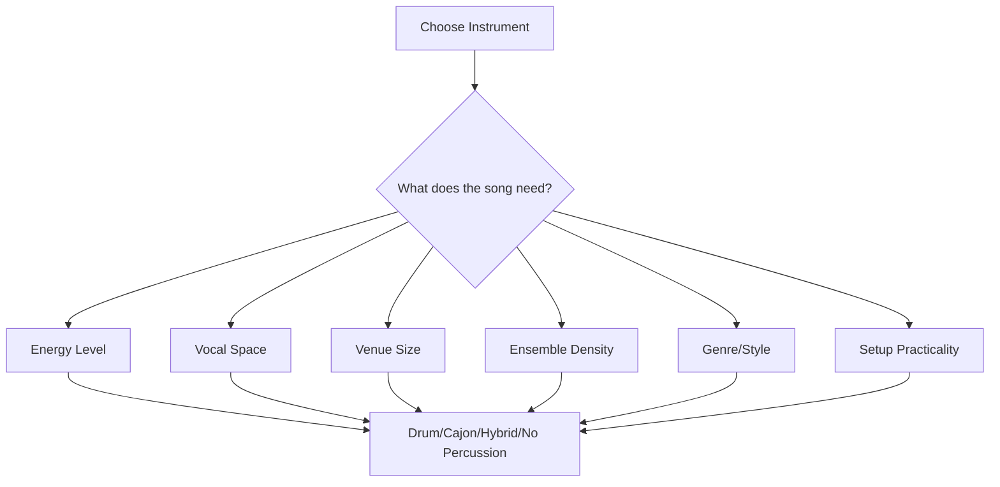
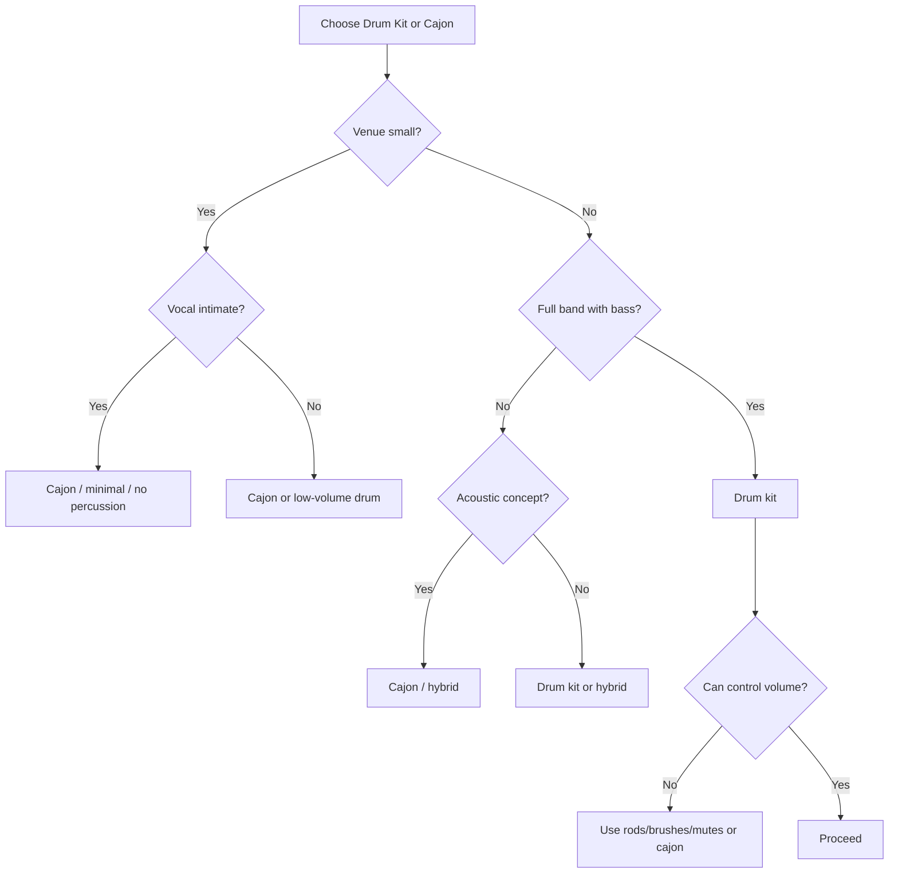

# learn-drum-cajon-part-019.md

# Part 019 — Drum Kit vs Cajon: Kapan Memakai yang Mana

## Status Seri

- Seri: `learn-drum-cajon`
- Part: `019`
- Topik: Memilih drum kit atau cajon berdasarkan konteks musikal
- Target akhir seri: mampu mengiringi penyanyi dengan drum dan/atau cajon secara stabil, musikal, dan sadar konteks
- Status: seri belum selesai
- Part sebelumnya: `learn-drum-cajon-part-018.md`
- Part berikutnya: `learn-drum-cajon-part-020.md`

---

## Tujuan Part Ini

Part ini membahas keputusan praktis: kapan memakai drum kit, kapan memakai cajon, kapan memakai hybrid setup, dan kapan sebaiknya tidak memainkan percussion sama sekali.

Banyak pemula berpikir pilihan instrumen hanya soal ketersediaan alat:

> “Ada drum, pakai drum. Ada cajon, pakai cajon.”

Padahal pilihan instrumen memengaruhi:

- volume,
- energi,
- texture,
- ruang vokal,
- genre,
- setup panggung,
- transport,
- sound system,
- rehearsal flow,
- expectation audience,
- rasa emosional lagu.

Setelah menyelesaikan part ini, kamu harus mampu:

1. membandingkan fungsi drum kit dan cajon,
2. memilih alat berdasarkan venue,
3. memilih alat berdasarkan genre,
4. memilih alat berdasarkan format ensemble,
5. memilih alat berdasarkan penyanyi,
6. memahami risiko volume drum kit,
7. memahami risiko monoton/keras pada cajon,
8. menentukan hybrid setup sederhana,
9. membuat decision matrix,
10. memilih alat yang membuat lagu lebih baik, bukan sekadar yang terlihat keren.

---

# 1. Prinsip Utama: Instrumen Dipilih Berdasarkan Fungsi Lagu

Pertanyaan pertama bukan:

> “Saya ingin main drum atau cajon?”

Pertanyaan pertama:

> “Apa yang dibutuhkan lagu, penyanyi, ruangan, dan ensemble?”



Drum kit dan cajon sama-sama bisa mengiringi penyanyi, tetapi masing-masing punya karakter, batas, dan risiko.

---

# 2. Drum Kit: Kekuatan dan Risiko

## 2.1 Kekuatan Drum Kit

Drum kit unggul dalam:

- dynamic range besar,
- energi full band,
- separation suara jelas,
- kick/snare/hat/cymbal lengkap,
- genre pop/rock/worship/band,
- chorus besar,
- build panjang,
- live performance besar,
- arrangement dengan bass.

Drum kit bisa membuat lagu terasa:

- powerful,
- solid,
- wide,
- energetic,
- anthemic,
- driving.

## 2.2 Risiko Drum Kit

Drum kit juga mudah merusak accompaniment jika tidak dikontrol.

Risiko utama:

| Risiko | Dampak |
|---|---|
| terlalu keras | vokal tertutup |
| hi-hat/cymbal tajam | lirik tidak jelas |
| snare terlalu agresif | lagu kehilangan intimacy |
| crash terlalu sering | arrangement berisik |
| setup rumit | rehearsal lambat |
| butuh ruang | tidak cocok venue kecil |
| membutuhkan sound control | sulit di ruangan buruk |

Rule:

> Drum kit memberi power, tetapi power tanpa kontrol akan menindas vokal.

---

# 3. Cajon: Kekuatan dan Risiko

## 3.1 Kekuatan Cajon

Cajon unggul dalam:

- acoustic setting,
- singer-songwriter,
- cafe,
- ruangan kecil,
- portability,
- setup cepat,
- volume lebih terkendali,
- mood intimate,
- format gitar/piano/vokal,
- rehearsal sederhana.

Cajon bisa membuat lagu terasa:

- hangat,
- organik,
- dekat,
- sederhana,
- intimate,
- earthy,
- acoustic.

## 3.2 Risiko Cajon

Cajon juga punya masalah.

| Risiko | Dampak |
|---|---|
| slap terlalu tajam | vokal tertutup |
| bass tidak jelas | groove tipis |
| pattern monoton | lagu datar |
| touch terlalu ramai | vocal space hilang |
| tangan sakit | kualitas turun |
| dynamic range terbatas | chorus kurang besar |
| low-end tidak sekuat drum | full band bisa tenggelam |

Rule:

> Cajon bukan otomatis lebih aman dari drum kit. Cajon slap yang tidak terkontrol bisa sama mengganggunya dengan snare keras.

---

# 4. Pemetaan Fungsi Drum Kit dan Cajon

| Fungsi | Drum Kit | Cajon |
|---|---|---|
| Low foundation | kick | bass tone |
| Backbeat | snare | slap |
| Subdivision | hi-hat/ride | touch/ghost/shaker |
| Section marker | crash | accent/slap/silence |
| Fill color | tom/snare | bass/slap/touch movement |
| Big build | snare/tom/cymbal | touch roll/slap build |
| Soft texture | rim click/brush/hat | touch/muted tone |
| Full energy | high | medium |
| Acoustic warmth | medium | high |

---

# 5. Decision by Venue

## 5.1 Kamar / Latihan Rumah

Pilihan aman:

- cajon,
- practice pad,
- low-volume drum setup,
- tabletop substitute,
- electronic drum jika ada.

Drum kit akustik sering terlalu keras.

## 5.2 Cafe Kecil

Biasanya lebih cocok:

- cajon,
- brushes/rods jika drum kit,
- minimal percussion,
- shaker ringan.

Risiko drum kit:

- terlalu besar,
- audience dekat,
- vokal tenggelam,
- cymbal menusuk.

## 5.3 Ruangan Ibadah Kecil / Acoustic Worship

Biasanya cocok:

- cajon,
- light drum kit,
- rods/brushes,
- hybrid cajon + shaker.

Yang penting:

- vokal dan leader jelas,
- dynamic build tidak terlalu cepat,
- volume aman.

## 5.4 Hall / Stage Sedang

Bisa memakai:

- drum kit,
- cajon jika acoustic concept,
- hybrid percussion,
- mic support.

Jika ada full band, drum kit sering lebih efektif.

## 5.5 Outdoor / Large Stage

Biasanya drum kit lebih cocok jika:

- full band,
- butuh projection,
- ada sound system,
- genre energetic.

Cajon bisa dipakai jika:

- acoustic set,
- mic cajon tersedia,
- arrangement memang intimate.

---

# 6. Decision by Genre

| Genre/Context | Lebih Cocok | Catatan |
|---|---|---|
| acoustic pop | cajon / light drum | tergantung venue |
| singer-songwriter | cajon | vocal-first |
| cafe acoustic | cajon | volume kecil |
| pop full band | drum kit | dynamic range |
| rock ringan | drum kit | snare/kick penting |
| worship acoustic | cajon / light drum | build controlled |
| worship full band | drum kit | lock with bass |
| ballad intimate | cajon / rim drum | banyak ruang |
| cinematic ballad | drum light / cajon hybrid | texture penting |
| folk | cajon / percussion | organic |
| blues/shuffle | drum kit | ride/snare feel |
| EDM/pop anthem | drum kit/electronic | four-on-floor |
| rehearsal vocal | cajon/light tap | jangan overplay |

---

# 7. Decision by Ensemble

## 7.1 Penyanyi Solo

Pilihan umum:

- cajon sangat soft,
- atau tidak ada percussion di awal,
- drum kit jarang kecuali konsep besar.

Strategi:

- fokus vokal,
- banyak ruang,
- fill hampir tidak ada.

## 7.2 Penyanyi + Gitar

Cajon sering ideal.

Karena gitar sudah membawa harmony dan rhythm, cajon cukup:

- bass,
- slap,
- touch ringan,
- sparse fill.

Drum kit bisa dipakai jika:

- venue lebih besar,
- genre lebih energetic,
- drummer bisa main soft.

## 7.3 Penyanyi + Piano

Cajon atau light drum cocok, tetapi harus hati-hati dengan low-end piano.

Strategi:

- dengarkan tangan kiri piano,
- bass/kick tidak terlalu ramai,
- slap/snare tidak menabrak vocal.

## 7.4 Full Band dengan Bass

Drum kit biasanya lebih cocok.

Alasan:

- kick lock dengan bass,
- snare memberi backbeat kuat,
- cymbal memberi section marker,
- dynamic range lebih luas.

Cajon tetap bisa jika konsep acoustic full band, tetapi perlu mic dan arrangement yang mendukung.

## 7.5 Band Tanpa Bass

Cajon bass/kick menjadi lebih penting.

Pilihan:

- cajon untuk acoustic,
- light drum kit untuk pop,
- hybrid cajon + kick pedal jika ada.

---

# 8. Decision by Vocal Needs

Pilih alat berdasarkan kebutuhan penyanyi.

## 8.1 Vokal Lembut / Intimate

Lebih cocok:

- cajon soft,
- rim click,
- brushes/rods,
- no percussion in intro.

Hindari:

- snare keras,
- crash,
- slap tajam,
- hi-hat ramai.

## 8.2 Vokal Powerful

Bisa cocok:

- drum kit,
- cajon lebih kuat,
- full backbeat.

Tetap hati-hati:

- vokal powerful bukan alasan untuk overplay.

## 8.3 Vokal Banyak Lirik Cepat

Butuh ruang frekuensi dan rhythm.

Strategi:

- kurangi hi-hat/touch,
- kurangi fill,
- backbeat sederhana.

## 8.4 Vokal Ballad Panjang

Butuh:

- sustain emosi,
- slow tempo stability,
- fill minim,
- dynamic arc panjang.

Cocok:

- cajon soft,
- drum kit dengan rim/brush/hat light,
- hybrid texture.

---

# 9. Decision by Dynamic Arc

Jika lagu butuh dynamic arc besar:

```text
intro kecil → verse kecil → chorus besar → bridge build → final chorus sangat besar
```

Drum kit lebih mudah memberi range besar.

Jika lagu butuh intimacy konsisten:

```text
vokal dekat → groove hangat → chorus tetap organic
```

Cajon lebih cocok.

Jika lagu butuh mulai intimate lalu besar, pertimbangkan hybrid:

- verse cajon/touch,
- chorus drum kit ringan,
- atau drum kit dengan rods/brushes,
- atau cajon + shaker + tambourine.

---

# 10. Hybrid Setup

Hybrid setup adalah kombinasi sederhana.

## 10.1 Cajon + Shaker

Cocok untuk:

- acoustic pop,
- folk,
- worship kecil.

Fungsi:

- cajon: bass/slap,
- shaker: subdivision.

Risiko:

- terlalu ramai jika shaker nonstop.

## 10.2 Cajon + Foot Tambourine

Cocok untuk:

- acoustic set,
- singer + guitar.

Risiko:

- coordination overload,
- tambourine bisa terlalu bright.

## 10.3 Cajon + Kick Pedal

Cocok jika:

- butuh bass lebih stabil,
- tangan ingin fokus slap/touch.

Risiko:

- setup lebih rumit,
- feel bisa terlalu mechanical jika tidak hati-hati.

## 10.4 Drum Kit Low-Volume

Options:

- rods,
- brushes,
- towels/mutes,
- light sticks,
- smaller cymbals,
- rim click.

Cocok untuk:

- venue kecil tapi butuh drum kit feel.

## 10.5 Minimal Percussion

Kadang cukup:

- shaker,
- tambourine,
- hand clap,
- stomp,
- no percussion.

Rule:

> Hybrid bukan berarti tambah semua. Hybrid berarti memilih elemen minimum yang dibutuhkan lagu.

---

# 11. Decision Matrix

Gunakan matrix berikut.

| Faktor | Drum Kit | Cajon | Hybrid/No Percussion |
|---|---|---|---|
| Venue besar | bagus | perlu mic | bagus jika konsep |
| Venue kecil | risiko | bagus | bagus |
| Full band | bagus | tergantung | bagus |
| Acoustic duo | terlalu besar | bagus | bagus |
| Vokal lembut | risiko | bagus jika soft | no percussion bisa |
| Lagu anthem | bagus | terbatas | hybrid bagus |
| Ballad intimate | light drum/cajon | bagus | no percussion di awal |
| Setup cepat | kurang | bagus | bagus |
| Dynamic range besar | sangat bagus | medium | tergantung |
| Portability | buruk | bagus | bagus |
| Sound system terbatas | risiko | lebih aman | bagus |

---

# 12. Decision Tree



---

# 13. Sound System Considerations

## 13.1 Drum Kit

Drum kit bisa sangat keras tanpa mic. Dengan mic, kontrol sound engineer juga penting.

Jika sound system buruk:

- cymbal bisa terlalu keras,
- snare bisa menyakitkan,
- kick tidak balance,
- stage volume tinggi.

## 13.2 Cajon

Cajon sering butuh mic agar bass terdengar di venue sedang/besar.

Tanpa mic:

- slap terdengar,
- bass hilang,
- pemain cenderung memukul lebih keras,
- tangan cepat sakit.

Rule:

> Jika cajon tidak terdengar, jangan memukul brutal. Perbaiki amplification atau arrangement.

---

# 14. Practical Constraints

## 14.1 Transport

Drum kit:

- berat,
- banyak hardware,
- butuh waktu setup.

Cajon:

- mudah dibawa,
- setup cepat,
- cocok rehearsal.

## 14.2 Setup Time

Jika setup sangat terbatas, cajon lebih praktis.

## 14.3 Noise Limit

Jika ada batas kebisingan, cajon atau low-volume setup lebih aman.

## 14.4 Skill Level

Jika kamu belum bisa kontrol drum kit volume, cajon mungkin lebih aman.  
Jika cajon slap kamu belum terkontrol, minimal percussion mungkin lebih aman.

---

# 15. Kapan Tidak Perlu Drum/Cajon?

Ini penting.

Tidak semua lagu butuh percussion.

Jangan main jika:

- intro sangat intimate,
- penyanyi ingin a cappella feel,
- piano/gitar sudah cukup,
- lyric sangat fragile,
- ruangan terlalu kecil,
- kamu tidak bisa main cukup pelan,
- kamu tidak tahu form,
- percussion membuat lagu lebih buruk.

Rule:

> Tidak bermain adalah pilihan musikal yang valid.

---

# 16. Use Case Examples

## 16.1 Acoustic Cafe: Vocal + Guitar

Pilihan:

- cajon.

Strategy:

- verse sparse,
- chorus basic pop,
- no loud slap,
- fill kecil.

## 16.2 Worship Full Band

Pilihan:

- drum kit.

Strategy:

- lock with bass,
- dynamic build,
- avoid full power too early,
- follow leader cue.

## 16.3 Ballad Piano Vocal

Pilihan:

- no percussion at first,
- cajon soft later,
- drum rim/brush optional.

Strategy:

- enter after verse,
- touch/rim,
- fill minimal.

## 16.4 Pop Band Outdoor

Pilihan:

- drum kit.

Strategy:

- full groove,
- kick-bass lock,
- clear snare,
- controlled cymbals.

## 16.5 Rehearsal with Singer

Pilihan:

- cajon soft,
- practice pad,
- hand clap,
- no full drum.

Strategy:

- help timing,
- do not overpower.

---

# 17. Instrument Switching Within a Set

Dalam satu set lagu, kamu bisa memakai kombinasi:

| Lagu | Pilihan |
|---|---|
| opening acoustic | cajon |
| ballad intimate | no percussion/soft cajon |
| upbeat pop | drum kit |
| worship build | drum kit |
| folk song | cajon + shaker |
| closing anthem | drum kit |

Jika hanya satu alat tersedia, adaptasi dynamics.

---

# 18. Drum Kit Adaptasi agar Lebih Acoustic

Jika harus memakai drum kit di setting kecil:

- main lebih pelan,
- closed hi-hat,
- rim click,
- kick soft,
- no crash di verse,
- pakai rods/brushes jika ada,
- gunakan tom/cymbal sangat selektif,
- pilih sparse groove.

Drum kit acoustic mode:

```text
Verse:
rim click + soft kick + closed hat

Chorus:
snare light + slightly stronger hat

Bridge:
minimal / tom soft / silence
```

---

# 19. Cajon Adaptasi agar Lebih Besar

Jika cajon perlu terasa lebih besar:

- bass lebih jelas,
- slap level 3,
- touch lebih aktif,
- tambah shaker,
- mic cajon jika ada,
- gunakan four-on-floor cajon dengan hati-hati,
- fill lebih jelas di transition.

Namun jangan memukul lebih keras terus-menerus.

---

# 20. Mistakes dalam Memilih Instrumen

## 20.1 Memakai Drum Kit di Ruangan Terlalu Kecil

Akibat:

- vokal kalah,
- audience lelah,
- sound kasar.

Correction:

- cajon,
- low-volume setup,
- rods/brushes,
- minimal.

## 20.2 Memakai Cajon untuk Lagu yang Butuh Power Besar

Akibat:

- chorus tidak naik,
- pemain memukul terlalu keras,
- tangan sakit,
- bass tetap kurang.

Correction:

- drum kit,
- mic cajon,
- hybrid,
- arrangement ulang.

## 20.3 Memilih Berdasarkan Ego

Akibat:

- alat tidak cocok,
- lagu kalah oleh pemain.

Correction:

- pilih berdasarkan lagu.

## 20.4 Tidak Memikirkan Venue

Akibat:

- volume tidak cocok,
- setup ribet,
- sound tidak balance.

Correction:

- cek venue,
- cek sound system,
- cek ensemble.

---

# 21. Debugging Guide

| Gejala | Kemungkinan Salah Pilihan | Solusi |
|---|---|---|
| Vokal tertutup | drum terlalu besar | cajon/low-volume |
| Chorus kurang impact | cajon terlalu kecil | drum/hybrid/mic |
| Lagu terlalu ramai | texture berlebihan | minimal/no percussion |
| Bass cajon hilang | no mic/poor technique | mic/cari sweet spot |
| Drum terlalu noisy | cymbal/snare excess | rods/rim/less cymbal |
| Setup lama | drum kit tidak praktis | cajon/hybrid |
| Acoustic mood rusak | alat terlalu agresif | softer texture |
| Full band kurang solid | cajon tidak cukup | drum kit |

---

# 22. Practice: Same Song, Two Instruments

Pilih satu lagu 4/4.

Mainkan versi drum kit:

```md
Verse: closed hat + kick/snare soft
Chorus: stronger groove
Bridge: drop/build
```

Mainkan versi cajon:

```md
Verse: sparse bass/slap
Chorus: basic pop cajon
Bridge: touch/silence
```

Bandingkan:

| Pertanyaan | Drum Kit | Cajon |
|---|---|---|
| Vokal jelas? | | |
| Chorus naik? | | |
| Mood cocok? | | |
| Volume aman? | | |
| Setup praktis? | | |
| Groove stabil? | | |

---

# 23. Practice: Instrument Decision Worksheet

```md
# Instrument Decision Worksheet

Song:
Venue:
Audience size:
Ensemble:
Singer style:
Genre:
Mood:
Need dynamic range:
Need intimacy:
Sound system:
Setup time:
Noise limit:

## Options
Drum kit:
Cajon:
Hybrid:
No percussion:

## Risks
Drum kit risk:
Cajon risk:
Hybrid risk:

## Decision
Chosen instrument:
Reason:
Backup plan:
```

---

# 24. Self-Scoring Rubric

Nilai 1–5.

| Area | 1 | 3 | 5 |
|---|---|---|---|
| Venue awareness | tidak dipikir | cukup | jelas |
| Vocal fit | sering tertutup | cukup | aman |
| Genre fit | asal | cukup | tepat |
| Dynamic fit | kurang | cukup | cocok |
| Ensemble fit | conflict | cukup | rapi |
| Practicality | ribet | cukup | realistis |
| Backup plan | tidak ada | ada | matang |
| Ego control | pilih favorit | cukup | pilih kebutuhan lagu |

Target:

- minimal 3 semua area,
- minimal 4 untuk vocal fit,
- minimal 4 untuk venue awareness,
- minimal 4 untuk ego control.

---

# 25. Mini Capstone Part Ini

Pilih 3 lagu:

1. lagu intimate,
2. lagu medium pop,
3. lagu besar/anthem.

Untuk masing-masing, isi:

```md
Song:
Best instrument:
Why:
Risk:
Arrangement:
Backup:
```

Lalu rekam minimal 1 lagu dalam dua versi:

- drum/substitute version,
- cajon version.

Review mana yang lebih cocok dan kenapa.

---

# 26. Acceptance Criteria Part Ini

Kamu boleh lanjut ke Part 020 jika:

1. bisa menjelaskan kekuatan dan risiko drum kit,
2. bisa menjelaskan kekuatan dan risiko cajon,
3. bisa memilih alat berdasarkan venue,
4. bisa memilih alat berdasarkan ensemble,
5. bisa memilih alat berdasarkan vokal,
6. bisa membuat instrument decision worksheet,
7. bisa menjelaskan kapan tidak perlu percussion,
8. bisa membuat versi drum dan cajon untuk lagu yang sama,
9. bisa memilih alat berdasarkan kebutuhan lagu, bukan ego,
10. bisa punya backup plan jika alat tidak cocok.

---

# 27. Ringkasan

Drum kit dan cajon bukan alat yang saling menggantikan secara sempurna. Keduanya punya fungsi.

Drum kit unggul untuk:

- full band,
- dynamic besar,
- energi,
- kick/snare/cymbal separation,
- stage besar.

Cajon unggul untuk:

- acoustic,
- intimate,
- setup cepat,
- venue kecil,
- singer-focused performance.

Hybrid berguna jika butuh sebagian dari keduanya. No percussion juga valid jika lagu membutuhkan ruang.

Rule paling penting:

> Pilih alat yang membuat lagu dan penyanyi lebih baik, bukan alat yang paling ingin kamu mainkan.

---

# 28. Latihan untuk Part Berikutnya

Sebelum lanjut ke Part 020, lakukan:

1. Isi instrument decision worksheet untuk satu lagu.
2. Buat versi drum dan versi cajon.
3. Rekam dua versi jika memungkinkan.
4. Bandingkan:
   - mana yang lebih vocal-safe?
   - mana yang lebih cocok venue?
   - mana yang lebih cocok dynamic arc?
   - mana yang paling realistis dimainkan?
5. Pilih satu untuk latihan 20-hour plan.

Part berikutnya membahas:

> practice architecture 20 jam: pembagian jam, urutan latihan, milestone, deliberate practice loop, tracking, recording, dan cara memastikan latihan mengarah ke performa nyata.
