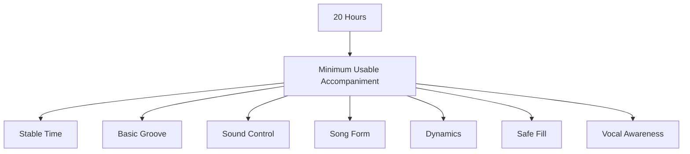
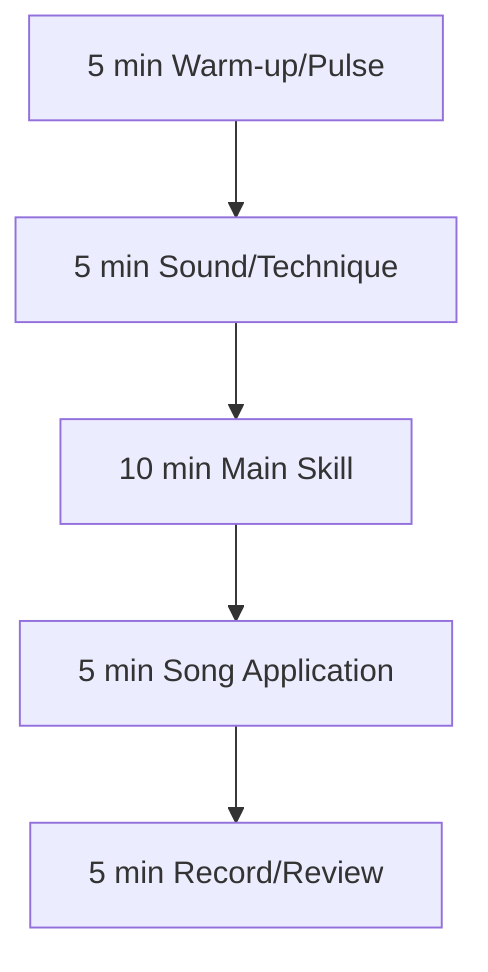
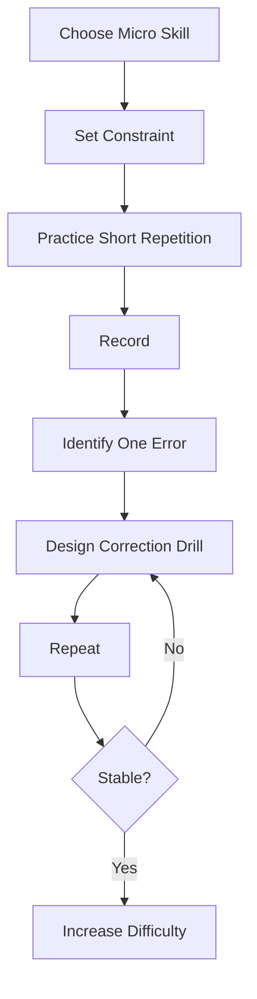
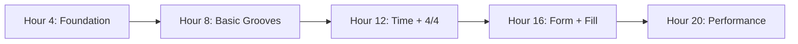

# learn-drum-cajon-part-020.md

# Part 020 — Practice Architecture 20 Jam

## Status Seri

- Seri: `learn-drum-cajon`
- Part: `020`
- Topik: Arsitektur latihan 20 jam untuk drum/cajon accompaniment
- Target akhir seri: mampu mengiringi penyanyi dengan drum dan/atau cajon secara stabil, musikal, dan sadar konteks
- Status: seri belum selesai
- Part sebelumnya: `learn-drum-cajon-part-019.md`
- Part berikutnya: `learn-drum-cajon-part-021.md`

---

## Tujuan Part Ini

Part ini mengubah semua materi sebelumnya menjadi sistem latihan 20 jam yang konkret. Tanpa arsitektur latihan, kamu mudah terjebak:

- latihan apa saja yang terasa menarik,
- terlalu banyak menonton tutorial,
- terlalu cepat mengejar fill,
- mengulang pattern yang sudah bisa,
- menghindari bagian yang sulit,
- tidak merekam,
- tidak punya ukuran progress.

Setelah menyelesaikan part ini, kamu harus mampu:

1. menyusun target 20 jam,
2. membagi latihan menjadi blok,
3. membuat milestone,
4. membuat deliberate practice loop,
5. melacak error,
6. memilih lagu capstone,
7. mengatur porsi drum kit dan cajon,
8. menghindari practice trap,
9. membuat weekly plan,
10. mengukur readiness untuk mengiringi penyanyi.

---

# 1. Filosofi 20 Jam

20 jam bukan angka ajaib. 20 jam tidak membuat kamu menjadi drummer/cajon player profesional. Tetapi 20 jam latihan terstruktur cukup untuk melewati fase awal yang paling kacau dan membangun kemampuan minimum yang usable.

Target kita:

> mampu mengiringi penyanyi pada lagu sederhana dengan tempo stabil, groove dasar, dinamika section, fill aman, dan awareness vokal.

Bukan target kita:

- solo drum,
- fill cepat,
- semua rudiment,
- semua genre,
- professional session playing,
- advanced independence,
- semua teknik cajon.



---

# 2. Practice Architecture Overview

20 jam dibagi menjadi 5 fase:

| Fase | Jam | Fokus |
|---|---:|---|
| Phase 1 | 0–4 | rhythm, body, sound |
| Phase 2 | 4–8 | basic drum/cajon coordination |
| Phase 3 | 8–12 | groove, metronome, 4/4 |
| Phase 4 | 12–16 | 6/8, dynamics, fills, song form |
| Phase 5 | 16–20 | repertoire, recording, mock performance |

```mermaid
gantt
    title 20-Hour Drum/Cajon Practice Architecture
    dateFormat  X
    axisFormat %s

    section Phase 1
    Rhythm and Pulse       :0, 2
    Body and Sound         :2, 4

    section Phase 2
    Drum Coordination      :4, 6
    Cajon Coordination     :6, 8

    section Phase 3
    Metronome Stability    :8, 10
    4/4 Groove Vocabulary  :10, 12

    section Phase 4
    6/8 and Ballad         :12, 13
    Dynamics and Form      :13, 15
    Safe Fills             :15, 16

    section Phase 5
    Song Application       :16, 18
    Mock Performance       :18, 19
    Final Recording        :19, 20
```



---

# 3. Output Akhir 20 Jam

Di akhir 20 jam, kamu harus punya:

1. minimal 3 rekaman lagu,
2. minimal 1 lagu 4/4,
3. minimal 1 lagu 6/8 atau 12/8,
4. minimal 1 lagu dengan dynamic build,
5. satu song chart per lagu,
6. practice log,
7. daftar error umum pribadi,
8. 3 groove paling stabil,
9. 3 fill paling aman,
10. satu evaluasi final.

## 3.1 Performance Standard

| Area | Standar |
|---|---|
| Tempo | stabil cukup untuk lagu penuh |
| Groove | sederhana tapi tidak collapse |
| Dynamics | verse/chorus berbeda |
| Fill | pendek dan kembali beat 1 |
| Song form | tidak tersesat |
| Vocal support | tidak menutup vokal |
| Recovery | tidak panik saat salah |
| Sound | bass/slap/snare/kick cukup jelas |
| Reflection | tahu error utama |

---

# 4. Phase 1: Jam 0–4 — Rhythm, Body, Sound

## 4.1 Jam 0–1: Baseline dan Pulse

Fokus:

- rekam baseline,
- tepuk pulse,
- backbeat,
- counting 4/4.

Latihan:

```text
5 min: clap quarter note
5 min: clap 2 and 4
5 min: count 1 & 2 & 3 & 4 &
5 min: rest 1 bar and enter
5 min: record
5 min: review
```

Output:

- baseline recording,
- tahu apakah rushing/dragging,
- practice log mulai.

## 4.2 Jam 1–2: Meter dan Subdivision

Fokus:

- 4/4,
- 6/8,
- 12/8,
- subdivision.

Latihan:

```text
count 4/4
count 6/8
count 12/8
tap backbeat
tap 1 and 4 in 6/8
```

Output:

- bisa membedakan 4/4 dan 6/8 secara dasar.

## 4.3 Jam 2–3: Body Mechanics

Fokus:

- posture,
- relaxation,
- grip/tangan,
- tension detection.

Latihan:

- video posture,
- relaxed stroke,
- cajon bass/slap contact,
- tension reset.

Output:

- tahu tension habit pribadi.

## 4.4 Jam 3–4: Sound Production

Fokus:

- drum: kick/snare/hi-hat,
- cajon: bass/slap/touch.

Output:

- bisa menghasilkan suara dasar yang berbeda.

---

# 5. Phase 2: Jam 4–8 — Coordination

## 5.1 Jam 4–5: Drum Skeleton

Fokus:

```text
Kick 1/3
Snare 2/4
Hi-hat 8th
```

Latihan:

- kick only,
- snare only,
- hat only,
- kick + snare,
- full basic groove.

Output:

- basic drum groove 1–2 menit.

## 5.2 Jam 5–6: Drum Variation

Fokus:

- kick variation,
- dynamic balance,
- no fill yet.

Latihan:

- basic pop,
- four-on-floor,
- sparse verse,
- hi-hat soft control.

Output:

- 2 drum grooves usable.

## 5.3 Jam 6–7: Cajon Skeleton

Fokus:

```text
Bass 1/3
Slap 2/4
Touch 8th
```

Latihan:

- bass search,
- slap search,
- bass/slap skeleton,
- add touch.

Output:

- basic cajon groove 1–2 menit.

## 5.4 Jam 7–8: Cajon Variation

Fokus:

- sparse verse,
- stronger chorus,
- hand coordination,
- fill not yet heavy.

Output:

- 2 cajon grooves usable.

---

# 6. Phase 3: Jam 8–12 — Time Stability dan 4/4 Groove

## 6.1 Jam 8–9: Metronome Every Beat

Fokus:

- 70 BPM,
- basic groove,
- click every beat.

Latihan:

- drum groove with click,
- cajon groove with click,
- record and review.

Output:

- bisa main 2 menit dengan click.

## 6.2 Jam 9–10: Sparse Click dan Slow Tempo

Fokus:

- click 2 dan 4,
- tempo 60 BPM,
- silence entry.

Output:

- internal clock mulai kuat.

## 6.3 Jam 10–11: 4/4 Groove Library

Fokus:

- basic pop,
- sparse verse,
- stronger chorus,
- four-on-floor,
- half-time.

Output:

- tahu kapan tiap groove dipakai.

## 6.4 Jam 11–12: Groove Switching

Fokus:

- verse → chorus,
- chorus → verse,
- bridge drop.

Output:

- bisa berpindah groove tanpa tempo collapse.

---

# 7. Phase 4: Jam 12–16 — 6/8, Dynamics, Form, Fill

## 7.1 Jam 12–13: 6/8 dan Ballad Feel

Fokus:

- count 6/8,
- count 12/8,
- ballad groove,
- slow time.

Output:

- satu groove 6/8 atau 12/8.

## 7.2 Jam 13–14: Dynamics

Fokus:

- level 1–5,
- verse/chorus difference,
- lift without rushing,
- drop without dragging.

Output:

- dynamic map sederhana.

## 7.3 Jam 14–15: Song Form

Fokus:

- intro,
- verse,
- chorus,
- bridge,
- ending,
- phrase 4/8 bar.

Output:

- song chart pertama.

## 7.4 Jam 15–16: Safe Fill

Fokus:

- silence fill,
- 1-beat fill,
- 2-beat fill,
- return-to-groove.

Output:

- 3 fill aman.

---

# 8. Phase 5: Jam 16–20 — Song Application dan Performance

## 8.1 Jam 16–17: Lagu 1 — 4/4

Pilih lagu 4/4 sederhana.

Fokus:

- song chart,
- basic groove,
- verse/chorus dynamics,
- 1 fill.

Output:

- recording lagu 1.

## 8.2 Jam 17–18: Lagu 2 — 6/8 atau Ballad

Pilih lagu 6/8/12/8/ballad.

Fokus:

- slow tempo,
- vocal space,
- minimal fill.

Output:

- recording lagu 2.

## 8.3 Jam 18–19: Lagu 3 — Dynamic Build

Pilih lagu yang punya:

- verse kecil,
- chorus besar,
- bridge/drop/build,
- final chorus.

Output:

- recording lagu 3.

## 8.4 Jam 19–20: Final Mock Performance

Main 3 lagu seolah performance.

Aturan:

- jangan berhenti jika salah,
- pakai chart,
- rekam,
- evaluasi.

Output:

- final recording,
- final error report,
- next roadmap.

---

# 9. Daily Practice Unit 30–45 Menit

## 9.1 Format 30 Menit



Detail:

| Durasi | Fokus |
|---:|---|
| 5 menit | pulse/counting |
| 5 menit | sound/coordination |
| 10 menit | skill utama |
| 5 menit | lagu |
| 5 menit | rekam/review |

## 9.2 Format 45 Menit

| Durasi | Fokus |
|---:|---|
| 5 menit | warm-up |
| 5 menit | metronome |
| 10 menit | technique/coordination |
| 10 menit | groove/dynamics |
| 10 menit | song application |
| 5 menit | review/log |

Rule:

> Setiap sesi harus menghasilkan satu correction note.

---

# 10. Deliberate Practice Loop

Latihan efektif tidak hanya mengulang.



Contoh:

- Micro skill: fill 1 beat.
- Constraint: 70 BPM, setiap 4 bar.
- Practice: 5 menit.
- Record: HP.
- Error: fill rush.
- Correction: fill hanya 2 note, tempo 60 BPM.
- Repeat.
- Increase: kembali 70 BPM.

---

# 11. Practice Log

Gunakan log standar.

```md
# Practice Log

Date:
Session number:
Duration:
Instrument:
Tempo:
Main focus:

## Exercises
- 

## What improved
- 

## Main error
- 

## Evidence from recording
- 

## Correction drill
- 

## Next session focus
- 
```

Contoh:

```md
# Practice Log

Date: 2026-06-25
Duration: 35 min
Instrument: cajon
Tempo: 70 BPM
Main focus: bass/slap groove + fill

## Exercises
- bass/slap skeleton 5 min
- touch 8th 5 min
- basic pop 10 min
- fill 1 beat 10 min
- record 5 min

## What improved
- slap clearer
- touch lighter

## Main error
- fill rush before chorus

## Evidence
- beat 1 after fill landed early

## Correction drill
- 1-beat fill at 60 BPM, count out loud

## Next
- return-to-groove drill
```

---

# 12. Error Tracking

Buat daftar error berulang.

```md
# Error Tracker

| Date | Error | Context | Cause | Correction | Status |
|---|---|---|---|---|---|
| | fill rush | chorus transition | too many notes | 1-beat fill | open |
| | verse too loud | acoustic song | slap level high | level 2 slap | fixed |
```

Kategori error:

- timing,
- sound,
- dynamics,
- form,
- fill,
- vocal space,
- coordination,
- tension,
- instrument choice.

---

# 13. Milestones

## Milestone 1 — Jam 4

Kamu harus bisa:

- count 4/4,
- count 6/8 dasar,
- menghasilkan drum/cajon sound dasar,
- tahu tension habit.

## Milestone 2 — Jam 8

Kamu harus bisa:

- basic drum groove,
- basic cajon groove,
- sparse verse,
- simple chorus.

## Milestone 3 — Jam 12

Kamu harus bisa:

- main dengan metronome,
- basic 4/4 groove library,
- groove switching.

## Milestone 4 — Jam 16

Kamu harus bisa:

- 6/8/ballad groove,
- dynamic map,
- song chart,
- safe fills.

## Milestone 5 — Jam 20

Kamu harus bisa:

- 3 lagu,
- recording,
- review,
- readiness assessment.



---

# 14. Song Selection for 20 Hours

Pilih 3 lagu capstone.

## 14.1 Lagu 1 — 4/4 Basic

Kriteria:

- tempo medium,
- structure jelas,
- tidak terlalu banyak syncopation,
- vocal jelas,
- verse/chorus berbeda.

## 14.2 Lagu 2 — Ballad/6/8/12/8

Kriteria:

- tempo lambat,
- emotional,
- butuh ruang,
- tidak banyak fill cepat.

## 14.3 Lagu 3 — Dynamic Build

Kriteria:

- verse kecil,
- chorus besar,
- bridge/drop/build,
- final chorus.

Template:

```md
# Capstone Songs

## Song 1: 4/4 Basic
Title:
Reason:
Risk:

## Song 2: Ballad/6-8/12-8
Title:
Reason:
Risk:

## Song 3: Dynamic Build
Title:
Reason:
Risk:
```

---

# 15. Practice Allocation Drum vs Cajon

Karena targetnya drum dan/atau cajon, ada tiga mode.

## 15.1 Mode A — Balanced

Jika ingin dua-duanya:

| Area | Porsi |
|---|---:|
| rhythm/metronome | 25% |
| drum kit | 30% |
| cajon | 30% |
| song/recording | 15% |

## 15.2 Mode B — Cajon First

Jika goal utama acoustic accompaniment:

| Area | Porsi |
|---|---:|
| rhythm/metronome | 25% |
| cajon | 45% |
| drum kit/substitute | 15% |
| song/recording | 15% |

## 15.3 Mode C — Drum Kit First

Jika goal utama full band:

| Area | Porsi |
|---|---:|
| rhythm/metronome | 25% |
| drum kit | 45% |
| cajon | 15% |
| song/recording | 15% |

Rule:

> Pilih mode berdasarkan performance target, bukan rasa penasaran sesaat.

---

# 16. Weekly Plan Example

## Jika Latihan 30 Menit per Hari

20 jam = 40 sesi × 30 menit.

Contoh 6 minggu lebih:

```text
Week 1: foundation rhythm/body/sound
Week 2: drum and cajon basic grooves
Week 3: metronome and 4/4 vocabulary
Week 4: 6/8, dynamics, form, fill
Week 5: song 1 and song 2
Week 6: song 3 and mock performance
```

## Jika Latihan 45 Menit per Hari

20 jam = sekitar 27 sesi.

Contoh 4 minggu:

```text
Week 1: foundation + basic grooves
Week 2: metronome + groove vocabulary
Week 3: dynamics + form + fill
Week 4: songs + recording + mock performance
```

## Jika Latihan 1 Jam per Hari

20 jam = 20 sesi.

Contoh:

```text
Day 1-4: foundation
Day 5-8: coordination
Day 9-12: grooves/metronome
Day 13-16: dynamics/form/fill
Day 17-20: songs/performance
```

---

# 17. Practice Constraints

Constraint membuat latihan fokus.

Contoh constraint:

- no fill,
- only 1 fill,
- metronome 70 BPM,
- snare/slap level 2,
- hi-hat/touch level 1,
- verse must be softer than chorus,
- no crash,
- only bass/slap skeleton,
- count out loud,
- record every take.

Constraint mencegah latihan menjadi random.

---

# 18. What Not to Practice Yet

Untuk menjaga fokus 20 jam, tunda:

- fast drum fills,
- double pedal,
- advanced jazz comping,
- polyrhythm,
- odd meter,
- complex Latin patterns,
- all 40 rudiments,
- advanced brush technique,
- gospel chops,
- drum solo,
- cajon virtuoso rolls,
- complex hand percussion traditions.

Bukan berarti hal-hal itu tidak berguna. Hanya belum prioritas.

---

# 19. Practice Traps

## 19.1 Tutorial Binge

Menonton banyak tutorial terasa produktif tetapi tidak membangun skill jika tidak dipraktikkan.

Rule:

```text
1 tutorial → 3 practice sessions
```

## 19.2 Pattern Collecting

Mengumpulkan 20 pattern tetapi tidak ada yang stabil.

Correction:

- pilih 3 groove,
- main 3 menit stabil,
- apply to song.

## 19.3 Avoiding Recording

Tidak merekam karena takut mendengar kesalahan.

Correction:

- rekaman adalah data,
- bukan judgement.

## 19.4 Playing What You Already Can

Terus memainkan groove yang sudah nyaman.

Correction:

- pilih satu error,
- latih yang lemah.

## 19.5 Fill Addiction

Fill terlalu banyak.

Correction:

- no fill session,
- fill only every 8 bar.

---

# 20. Recording Strategy

## 20.1 Rekam Audio

Untuk:

- timing,
- balance,
- dynamics,
- vocal clarity.

## 20.2 Rekam Video

Untuk:

- posture,
- tension,
- sticking,
- body movement,
- hand pain risk.

## 20.3 Naming File

Gunakan format:

```text
YYYY-MM-DD_song_skill_take01.mp3
YYYY-MM-DD_cajon_basic-pop_70bpm_take01.mp4
YYYY-MM-DD_drum_fill-return_60bpm_take02.mp4
```

## 20.4 Review Cadence

- setiap sesi: review 1 rekaman pendek,
- setiap minggu: review 1 rekaman lagu penuh,
- akhir 20 jam: review 3 lagu.

---

# 21. Feedback Questions

Setelah rekaman, jawab:

```md
## Feedback

Timing:
- 

Sound:
- 

Dynamics:
- 

Form:
- 

Fill:
- 

Vocal support:
- 

Main issue:
- 

Correction drill:
- 
```

Jangan menulis terlalu banyak. Pilih satu error utama.

---

# 22. Readiness Checklist

Kamu siap mengiringi penyanyi sederhana jika:

| Checklist | Ya/Tidak |
|---|---|
| bisa menjaga tempo 3 menit | |
| bisa main basic 4/4 | |
| bisa main 6/8/ballad sederhana | |
| bisa verse lebih kecil dari chorus | |
| bisa fill 1 beat aman | |
| bisa berhenti/diam dan masuk lagi | |
| bisa membaca section chart | |
| bisa mendengar vokal | |
| bisa tidak panik saat salah | |
| bisa main lebih pelan saat diminta | |

Jika banyak “Tidak”, bukan gagal. Itu hanya backlog latihan.

---

# 23. 20-Hour Dashboard

Gunakan dashboard:

```md
# 20-Hour Dashboard

Total hours completed:
Current phase:
Current focus:
Capstone songs:
Main recurring error:
Best stable groove:
Best safe fill:
Next recording date:

## Skill Scores 1-5
Pulse:
Metronome:
Drum groove:
Cajon groove:
Dynamics:
Song form:
Fill:
Listening:
Vocal support:
Performance recovery:
```

Update setiap 2–3 jam latihan.

---

# 24. Example Full 20-Hour Plan

```md
Hour 1: baseline, pulse, 4/4 count
Hour 2: subdivision, 6/8/12/8 awareness
Hour 3: body mechanics, posture, relaxation
Hour 4: sound production drum/cajon

Hour 5: drum kick/snare/hat skeleton
Hour 6: drum basic groove + variation
Hour 7: cajon bass/slap/touch skeleton
Hour 8: cajon basic groove + variation

Hour 9: metronome every beat
Hour 10: click 2/4 + slow tempo
Hour 11: 4/4 groove library
Hour 12: groove switching

Hour 13: 6/8 and 12/8 groove
Hour 14: dynamics level 1-5
Hour 15: song form and charting
Hour 16: safe fills and return

Hour 17: song 1 recording
Hour 18: song 2 recording
Hour 19: song 3 recording
Hour 20: mock performance and final review
```

---

# 25. Example Session Plan

```md
# Session Plan

Session:
Duration: 45 min
Focus: fill return

## Warm-up
5 min: pulse + count

## Technique
5 min: single stroke / cajon touch

## Main Drill
10 min: 1-beat fill every 4 bars

## Constraint
- metronome 70 BPM
- no fill longer than 1 beat
- count out loud

## Song Application
15 min: apply to chorus transition

## Recording
5 min: record take

## Review
5 min: identify one error
```

---

# 26. How to Know You Are Improving

Improvement signs:

- fewer stops,
- less panic,
- more stable tempo,
- groove feels boring but solid,
- fills become smaller but more accurate,
- you hear errors faster,
- you play softer with control,
- you leave more space,
- you can explain why choosing a groove,
- recordings become less embarrassing.

Notice:

> Often, improvement sounds less impressive but more musical.

---

# 27. When to Increase Difficulty

Increase difficulty only if:

- current tempo stable,
- current groove stable 3 minutes,
- dynamics controlled,
- no pain,
- fill returns to beat 1,
- recording confirms improvement.

Increase one variable only:

| Variable | Example |
|---|---|
| tempo | 70 → 75 BPM |
| density | add touch/hat |
| fill | 1 beat → 2 beat |
| dynamics | add verse/chorus contrast |
| form | 4 bar → full song |
| instrument | cajon → drum kit |

Do not increase tempo, fill, dynamics, and song complexity at the same time.

---

# 28. When to Simplify

Simplify if:

- tempo rushes,
- body tense,
- vocal covered,
- fill fails,
- form lost,
- pain appears,
- recording sounds chaotic.

Simplification options:

- remove fill,
- remove touch/hi-hat,
- return to skeleton,
- lower tempo,
- reduce volume,
- shorten song section,
- use metronome,
- use one groove only.

Rule:

> Simplifying is not regression. Simplifying is debugging.

---

# 29. Practice with Limited Equipment

## 29.1 No Drum Kit

Use:

- tabletop = hi-hat,
- thigh = snare,
- foot = kick,
- pillow/pad = quiet surface.

## 29.2 No Cajon

Use:

- box,
- table,
- thighs,
- muted surface.

## 29.3 No Instrument at All

Practice:

- counting,
- clapping backbeat,
- tapping pulse,
- listening worksheet,
- song chart,
- vocal phrasing,
- metronome.

Skill is not blocked by lack of perfect gear.

---

# 30. Practice Environment Setup

Prepare:

- metronome app,
- recording device,
- notebook/practice log,
- playlist,
- headphones,
- water,
- timer,
- comfortable seat,
- ear protection for drum kit.

Remove barriers:

- keep sticks ready,
- keep cajon accessible,
- create practice folder,
- preselect songs,
- set recurring practice time.

---

# 31. Psychological Strategy

The first hours can feel awkward.

Common feelings:

- “I sound bad.”
- “My limbs do not obey.”
- “This is too slow.”
- “I want to play something cooler.”
- “Recording myself is painful.”

Response:

- sounding bad is data,
- slow is where control is built,
- cool is less useful than stable,
- recording reveals truth,
- small progress compounds.

---

# 32. Practice Contract

```md
# 20-Hour Drum/Cajon Practice Contract

I am not trying to become a professional drummer in 20 hours.
I am trying to become reliable enough to accompany a singer.

I will prioritize:
- time stability
- vocal support
- simple groove
- dynamics
- safe fills
- song form
- recording review

I will avoid:
- overplaying
- fill addiction
- speed chasing
- tutorial bingeing
- ignoring recordings
- playing too loud
- practicing without a goal

My capstone:
- Song 1:
- Song 2:
- Song 3:

My schedule:
- 

My main risk:
- 

My correction habit:
- 
```

---

# 33. Mini Capstone Part Ini

Buat dokumen:

```md
# My 20-Hour Drum/Cajon Plan

Mode:
- Balanced / Cajon-first / Drum-first

Schedule:
- 

Capstone songs:
1.
2.
3.

Current baseline:
- 

Target by hour 4:
- 

Target by hour 8:
- 

Target by hour 12:
- 

Target by hour 16:
- 

Target by hour 20:
- 

Practice log location:
- 

Recording folder:
- 

Main constraints:
- 

Risk management:
- 

Definition of success:
- 
```

---

# 34. Acceptance Criteria Part Ini

Kamu boleh lanjut ke Part 021 jika:

1. sudah memilih mode latihan: balanced/cajon-first/drum-first,
2. sudah memilih 3 lagu capstone sementara,
3. sudah membuat practice contract,
4. sudah membuat 20-hour dashboard,
5. sudah tahu milestone jam 4/8/12/16/20,
6. sudah tahu format practice log,
7. sudah tahu satu error utama yang ingin diperbaiki,
8. sudah menyiapkan recording workflow,
9. sudah tahu apa yang tidak akan dipelajari dulu,
10. bisa menjelaskan bahwa latihan harus mengarah ke performance, bukan hanya pattern.

---

# 35. Ringkasan

Practice architecture membuat latihan tidak acak.

20 jam dibagi menjadi:

1. foundation,
2. coordination,
3. groove/time,
4. dynamics/form/fill,
5. song/performance.

Setiap sesi harus punya:

- fokus,
- constraint,
- metronome/recording,
- review,
- correction drill.

Target akhir bukan menjadi hebat, tetapi menjadi cukup reliable untuk mengiringi penyanyi.

Rule paling penting:

> Latihan yang baik bukan yang terasa paling seru, tetapi yang paling jelas mengubah error menjadi skill.

---

# 36. Latihan untuk Part Berikutnya

Sebelum lanjut ke Part 021, lakukan:

1. Buat `My 20-Hour Drum/Cajon Plan`.
2. Pilih 3 lagu capstone.
3. Tentukan mode latihan.
4. Buat practice log.
5. Rekam baseline 1 menit:
   - clap backbeat,
   - basic cajon/drum skeleton,
   - basic groove jika bisa.
6. Tulis error utama.

Part berikutnya membahas:

> latihan harian 30–45 menit: template sesi praktis, variasi latihan per hari, cara menghindari bosan, dan cara memastikan setiap sesi menghasilkan progress nyata.
