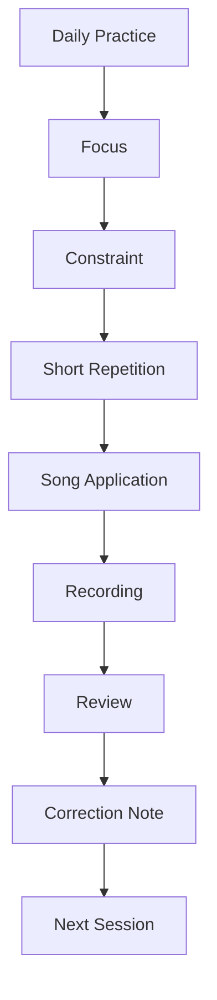
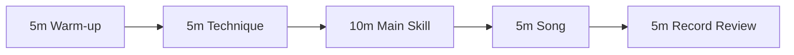
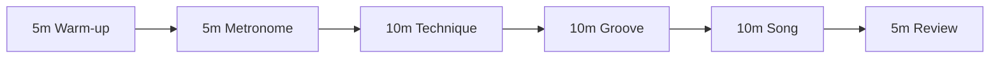
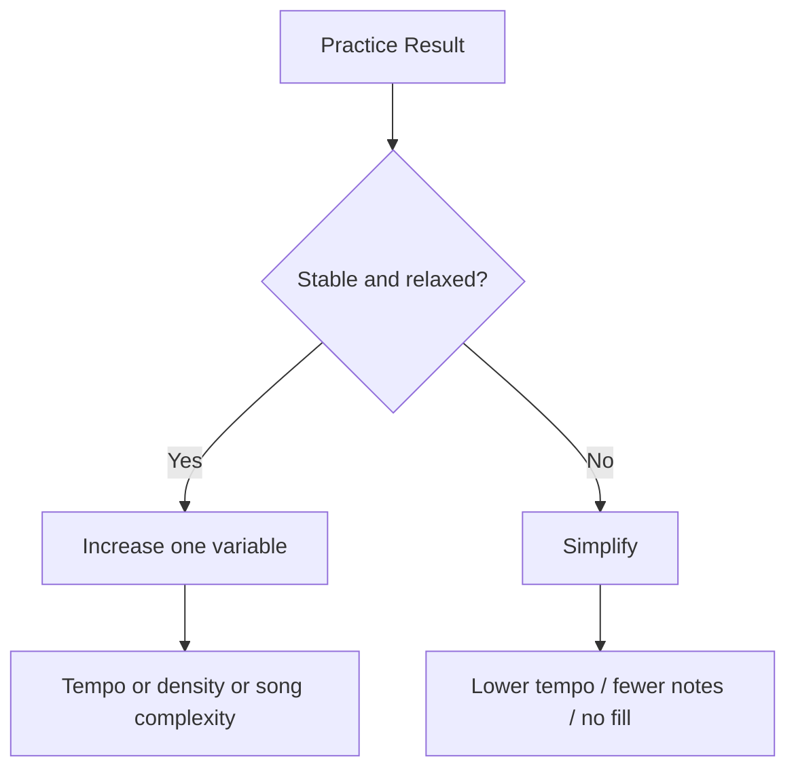
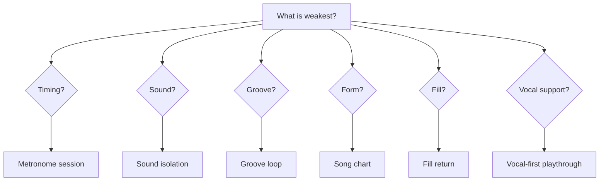

# learn-drum-cajon-part-021.md

# Part 021 — Latihan Harian 30–45 Menit

## Status Seri

- Seri: `learn-drum-cajon`
- Part: `021`
- Topik: Template latihan harian 30–45 menit
- Target akhir seri: mampu mengiringi penyanyi dengan drum dan/atau cajon secara stabil, musikal, dan sadar konteks
- Status: seri belum selesai
- Part sebelumnya: `learn-drum-cajon-part-020.md`
- Part berikutnya: `learn-drum-cajon-part-022.md`

---

## Tujuan Part Ini

Part ini mengubah seluruh konsep latihan menjadi sesi harian yang konkret. Banyak orang gagal bukan karena tidak punya waktu, tetapi karena setiap kali latihan mereka bingung:

- mulai dari mana,
- latihan apa dulu,
- kapan pakai metronome,
- kapan main lagu,
- kapan rekam,
- kapan naik tempo,
- kapan mengulang,
- kapan berhenti,
- bagaimana tahu latihan hari ini berhasil.

Part ini menjawab itu.

Setelah menyelesaikan part ini, kamu harus mampu:

1. menjalankan sesi latihan 30 menit,
2. menjalankan sesi latihan 45 menit,
3. memilih fokus harian,
4. membagi latihan ke warm-up, technique, groove, song, review,
5. memakai metronome dan recording secara konsisten,
6. menghindari latihan random,
7. membuat rotasi latihan drum dan cajon,
8. menghindari bosan tanpa kehilangan fokus,
9. membuat progress mingguan,
10. menutup setiap sesi dengan correction drill.

---

# 1. Prinsip Latihan Harian

Latihan harian yang baik tidak harus panjang. Tetapi harus jelas.

Sesi 30 menit yang fokus lebih berguna daripada 2 jam main acak.

Prinsip:

1. selalu punya fokus,
2. selalu ada constraint,
3. selalu ada metronome atau reference,
4. selalu ada aplikasi ke lagu,
5. selalu ada rekaman pendek,
6. selalu ada review,
7. selalu ada satu correction note.



Tanpa review, latihan berubah menjadi repetisi kebiasaan lama.

---

# 2. Struktur Sesi 30 Menit

Template utama:

| Durasi | Blok | Tujuan |
|---:|---|---|
| 5 menit | Warm-up + pulse | tubuh dan time siap |
| 5 menit | Sound/technique | suara bersih |
| 10 menit | Main skill | skill utama hari itu |
| 5 menit | Song application | masuk konteks lagu |
| 5 menit | Record + review | feedback loop |



Sesi ini cocok jika:

- hari kerja padat,
- energi sedang,
- ingin konsisten,
- latihan hampir setiap hari.

---

# 3. Struktur Sesi 45 Menit

Template lebih panjang:

| Durasi | Blok | Tujuan |
|---:|---|---|
| 5 menit | Warm-up | tubuh siap |
| 5 menit | Pulse/metronome | time anchor |
| 10 menit | Technique/coordination | kontrol fisik |
| 10 menit | Groove/dynamics | musical function |
| 10 menit | Song application | konteks nyata |
| 5 menit | Record/review | koreksi |



Sesi ini cocok jika:

- punya waktu lebih,
- sedang mengejar milestone,
- ingin latihan lagu capstone,
- butuh rekaman lebih panjang.

---

# 4. Anatomy of a Good Practice Session

Sesi latihan yang baik harus bisa dijelaskan dalam satu kalimat:

> Hari ini saya melatih X, pada tempo Y, dengan constraint Z, agar error A membaik.

Contoh:

```text
Hari ini saya melatih cajon fill 1 beat di 70 BPM, hanya memakai B-S, agar fill tidak rushing sebelum chorus.
```

Contoh lain:

```text
Hari ini saya melatih drum basic pop groove dengan hi-hat level 1, agar vokal tidak tertutup.
```

Jika kamu tidak bisa menjelaskan fokus latihan, kemungkinan latihanmu terlalu random.

---

# 5. Warm-Up 5 Menit

Warm-up bukan untuk pamer speed. Warm-up untuk:

- membangunkan tubuh,
- mengecek tension,
- masuk ke pulse,
- menyiapkan sound,
- menghindari memulai dengan gerakan kasar.

## 5.1 Warm-Up Tanpa Alat

Durasi: 2 menit

- putar pergelangan tangan,
- buka tutup jari,
- turunkan bahu,
- tarik napas,
- tap kaki quarter note.

## 5.2 Pulse Warm-Up

Durasi: 2 menit

Metronome 70 BPM.

```text
1 2 3 4
```

Lalu:

```text
1 & 2 & 3 & 4 &
```

## 5.3 Backbeat Warm-Up

Durasi: 1 menit

Tepuk hanya 2 dan 4.

```text
Count : 1   2   3   4
Clap  :     X       X
```

Acceptance:

- badan rileks,
- counting jelas,
- backbeat tidak berubah ke 1 dan 3.

---

# 6. Technique Block 5–10 Menit

Technique block harus kecil dan spesifik.

Pilihan technique:

| Fokus | Drum | Cajon |
|---|---|---|
| sound | kick/snare/hat | bass/slap/touch |
| coordination | hat+snare+kick | R/L sticking |
| dynamics | snare/hat level | slap/touch level |
| rudiment | single/double/paradiddle | touch/slap rudiment |
| fill | snare/tom | B/S/t fill |
| timing | metronome | metronome |

## 6.1 Jangan Latihan Teknik Tanpa Konteks

Teknik harus berakhir di aplikasi.

Contoh salah:

```text
10 menit single stroke lalu selesai.
```

Contoh benar:

```text
5 menit single stroke
5 menit single stroke menjadi fill 1 beat
5 menit apply ke lagu
```

Rule:

> Teknik yang tidak pernah masuk groove akan tetap menjadi latihan, bukan skill musik.

---

# 7. Main Skill Block 10 Menit

Ini inti sesi.

Pilih satu fokus saja.

Contoh fokus:

- basic 4/4 groove,
- sparse verse,
- stronger chorus,
- 6/8 groove,
- fill return,
- dynamic lift,
- song form,
- vocal space,
- cajon bass/slap separation,
- drum kick variation.

## 7.1 Format Main Skill

```md
Skill:
Tempo:
Duration:
Constraint:
Success criteria:
```

Contoh:

```md
Skill: fill 1 beat
Tempo: 70 BPM
Duration: 10 min
Constraint: hanya S-S atau B-S
Success: kembali beat 1 tepat 8 dari 10 kali
```

## 7.2 Repetition Design

Jangan hanya main terus. Buat loop kecil.

Contoh fill return:

```text
Bar 1: groove
Bar 2: groove
Bar 3: groove
Bar 4: fill
Bar 5: groove
```

Ulang 10 kali.

---

# 8. Song Application Block 5–10 Menit

Ini bagian yang menghubungkan latihan ke tujuan nyata: mengiringi penyanyi.

Pilih satu section lagu, bukan selalu full song.

## 8.1 Section Application

Contoh:

```text
Hari ini hanya verse → chorus.
```

Atau:

```text
Hari ini hanya bridge drop → final chorus.
```

Atau:

```text
Hari ini hanya intro rubato → groove masuk.
```

## 8.2 Full Song Tidak Selalu Perlu

Full song berguna, tetapi jika terlalu sering, kamu hanya mengulang error.

Gunakan full song saat:

- mengecek endurance,
- mengecek form,
- mock performance,
- final recording.

Gunakan section loop saat:

- memperbaiki error spesifik,
- fill,
- dynamics,
- transition,
- entry/ending.

---

# 9. Record + Review 5 Menit

Minimal rekam 60–120 detik.

Jangan menunggu “sudah bagus” baru rekam. Rekaman adalah alat diagnosis.

## 9.1 Apa yang Direkam?

Pilih salah satu:

- groove 2 menit,
- fill loop 1 menit,
- verse → chorus,
- full song excerpt,
- posture video,
- sound check.

## 9.2 Review Cepat

Jawab 3 pertanyaan:

```md
1. Apa yang paling membaik?
2. Apa error paling jelas?
3. Apa correction drill besok?
```

Jangan review semuanya. Pilih satu.

---

# 10. Daily Practice Template

Gunakan format ini.

```md
# Daily Practice

Date:
Duration:
Instrument:
Focus:
Tempo:
Constraint:

## 1. Warm-up
- 

## 2. Technique
- 

## 3. Main Skill
- 

## 4. Song Application
- 

## 5. Recording
File:
Observation:

## Error of the Day
- 

## Correction Drill for Next Session
- 

## Score 1-5
Time:
Sound:
Dynamics:
Form:
Vocal Support:
```

---

# 11. Contoh Sesi 30 Menit — Cajon Basic Groove

```md
Duration: 30 min
Instrument: Cajon
Focus: bass/slap separation + basic pop groove
Tempo: 70 BPM
Constraint: touch harus level 1

0-5 min:
- count 1 & 2 & 3 & 4 &
- clap 2 and 4

5-10 min:
- bass only 1/3
- slap only 2/4

10-20 min:
- B t S t B t S t
- 5 min slow
- 5 min with metronome

20-25 min:
- apply to verse/chorus song

25-30 min:
- record 1 min
- review bass/slap clarity
```

Correction examples:

- jika slap terlalu keras: slap level 2 drill,
- jika touch rush: touch-only metronome,
- jika bass lemah: bass search drill.

---

# 12. Contoh Sesi 30 Menit — Drum Basic Groove

```md
Duration: 30 min
Instrument: Drum/Substitute
Focus: basic pop groove
Tempo: 70 BPM
Constraint: hi-hat level 1-2

0-5 min:
- pulse + backbeat clap

5-10 min:
- kick 1/3
- snare 2/4
- hi-hat 8th soft

10-20 min:
- full groove
- 2 min no fill
- 2 min repeat
- 2 min click 2 and 4

20-25 min:
- verse soft → chorus medium

25-30 min:
- record and review hi-hat balance
```

---

# 13. Contoh Sesi 45 Menit — Fill Return

```md
Duration: 45 min
Instrument: Drum or Cajon
Focus: fill return
Tempo: 65 BPM
Constraint: fill maksimal 1 beat

0-5:
- warm-up + pulse

5-10:
- single stroke / touch alternating

10-20:
- groove only
- no fill
- check time

20-30:
- fill at beat 4&
- return beat 1
- repeat 10 times

30-40:
- apply verse → chorus
- fill only before chorus

40-45:
- record and review
```

Success:

```text
8 dari 10 fill kembali ke beat 1 dengan stabil.
```

---

# 14. Contoh Sesi 45 Menit — 6/8 Ballad

```md
Duration: 45 min
Instrument: Cajon/Drum
Focus: 6/8 ballad feel
Tempo: 60 BPM
Constraint: no fill longer than 3 notes

0-5:
- count 1 2 3 4 5 6
- accent 1 and 4

5-10:
- skeleton: bass/kick 1, slap/snare 4

10-20:
- add touch/hat all six counts
- keep level 1-2

20-30:
- sparse verse → stronger chorus

30-40:
- apply to ballad section
- leave vocal space

40-45:
- record/review
```

---

# 15. Rotasi Latihan Mingguan

## 15.1 Balanced Mode

Untuk belajar drum dan cajon berimbang.

| Hari | Fokus |
|---|---|
| Senin | rhythm + drum basic |
| Selasa | cajon sound + groove |
| Rabu | metronome + time |
| Kamis | dynamics + song form |
| Jumat | fill + rudiment |
| Sabtu | song application |
| Minggu | review / light practice |

## 15.2 Cajon-First Mode

| Hari | Fokus |
|---|---|
| Senin | cajon bass/slap |
| Selasa | cajon groove 4/4 |
| Rabu | time + metronome |
| Kamis | vocal accompaniment |
| Jumat | fill cajon |
| Sabtu | song recording |
| Minggu | listening/chart |

## 15.3 Drum-First Mode

| Hari | Fokus |
|---|---|
| Senin | kick/snare/hat |
| Selasa | drum groove 4/4 |
| Rabu | metronome/sparse click |
| Kamis | dynamics |
| Jumat | fill/rudiment |
| Sabtu | song recording |
| Minggu | cajon/light percussion |

---

# 16. Latihan Saat Energi Rendah

Tidak semua hari kamu punya energi tinggi. Jangan skip total jika masih bisa latihan ringan.

## 16.1 10-Minute Minimum

```text
2 min pulse
2 min backbeat
2 min basic groove
2 min song listening
2 min log/review
```

## 16.2 No-Instrument Practice

Jika tidak bisa berisik:

- clap backbeat,
- tap foot,
- count 6/8,
- isi listening worksheet,
- buat song chart,
- review rekaman lama.

## 16.3 Recovery Day

Fokus:

- stretching,
- listening,
- song form,
- dynamics map,
- mental practice.

Rule:

> Konsistensi tidak selalu berarti latihan keras. Konsistensi berarti tetap menjaga loop belajar.

---

# 17. Latihan Saat Bosan

Bosan sering muncul karena:

- latihan terlalu repetitif,
- tidak ada lagu,
- tidak ada feedback,
- tidak ada milestone,
- terlalu sulit,
- terlalu mudah.

Solusi:

## 17.1 Ubah Constraint, Bukan Fokus

Jika fokus hari ini basic groove, variasikan:

- tempo,
- dynamics,
- instrument,
- section,
- metronome placement,
- recording angle.

Tetap fokus basic groove.

## 17.2 Gunakan Song Context

Mainkan pattern dalam lagu, bukan hanya loop kosong.

## 17.3 Micro-Challenge

Contoh:

```text
Bisakah saya main 2 menit tanpa hi-hat/touch terlalu keras?
Bisakah saya fill 10 kali tanpa rush?
Bisakah saya membuat verse level 2 dan chorus level 4?
```

---

# 18. Latihan dengan Metronome

## 18.1 Jangan Selalu Mode Sama

Rotasi:

| Mode | Fungsi |
|---|---|
| click every beat | basic stability |
| click 2 and 4 | internal groove |
| click beat 1 | bar stability |
| slow tempo | patience |
| no click + recording | real-world check |

## 18.2 Metronome Protocol

```text
2 min click every beat
2 min click 2 and 4
1 min no click but record
```

Ini bisa menjadi bagian dari sesi 30 menit.

---

# 19. Latihan dengan Lagu

## 19.1 Jangan Selalu Full Track

Latih:

- intro only,
- verse only,
- verse → chorus,
- chorus → bridge,
- ending only,
- fill-safe spots.

## 19.2 Play-Along Rules

Saat play-along:

1. jangan meniru semua detail,
2. main versi sederhana,
3. jaga vokal,
4. tandai section,
5. rekam.

## 19.3 Vocal Track Priority

Kalau bisa, gunakan lagu dengan vokal jelas. Tujuanmu accompaniment, bukan drum cover instrumental.

---

# 20. Recording Cadence

## 20.1 Harian

Rekam 1 menit.

## 20.2 Mingguan

Rekam 1 lagu atau 1 section panjang.

## 20.3 Akhir Fase

Rekam milestone:

- jam 4: sound/pulse,
- jam 8: basic groove,
- jam 12: 4/4 groove,
- jam 16: form/fill,
- jam 20: 3 lagu.

---

# 21. Review Method: 4 Pass

Dengarkan rekaman 4 kali.

## Pass 1 — Timing

- rush?
- drag?
- fill rush?
- chorus rush?

## Pass 2 — Sound

- kick/bass jelas?
- snare/slap terlalu keras?
- hi-hat/touch terlalu keras?

## Pass 3 — Dynamics

- verse/chorus beda?
- bridge punya fungsi?
- final chorus naik?

## Pass 4 — Vocal Support

- lirik jelas?
- fill menabrak?
- ada ruang?

---

# 22. Progression Rules

Naikkan kesulitan jika:

- bisa 3 menit stabil,
- rekaman terdengar cukup,
- tidak tegang,
- fill kembali beat 1,
- dynamics terkontrol.

Turunkan kesulitan jika:

- rush/drag besar,
- tangan/kaki sakit,
- vocal tertutup,
- form hilang,
- fill gagal lebih dari 50%,
- tension muncul.



---

# 23. One Variable Rule

Jangan menaikkan banyak hal sekaligus.

Salah:

```text
tempo lebih cepat + fill lebih panjang + chorus lebih keras + lagu lebih sulit
```

Benar:

```text
hanya tempo 70 → 75 BPM
```

atau:

```text
hanya fill 1 beat → 2 beat
```

atau:

```text
hanya verse soft → chorus medium
```

---

# 24. Practice Menu

Gunakan menu ini saat memilih fokus.

## Time

- pulse clap,
- backbeat clap,
- metronome every beat,
- click 2 and 4,
- slow tempo,
- silence entry.

## Sound

- kick/snare/hat,
- bass/slap/touch,
- volume levels,
- sound separation.

## Coordination

- drum skeleton,
- cajon R/L,
- kick variation,
- touch control.

## Groove

- basic 4/4,
- sparse verse,
- stronger chorus,
- four-on-floor,
- half-time,
- 6/8.

## Dynamics

- level 1–5,
- lift,
- drop,
- texture switch,
- silence.

## Form

- section map,
- 4/8 bar counting,
- lyric anchor,
- ending.

## Fill

- silence,
- 1 beat,
- 2 beat,
- 1 bar,
- return.

## Listening

- vocal pass,
- pulse pass,
- form pass,
- dynamics pass.

---

# 25. Practice Plan Generator

Gunakan logika ini:



Setiap hari pilih weakest area, bukan yang paling menyenangkan.

---

# 26. Weekly Review

Setiap akhir minggu, jawab:

```md
# Weekly Review

Total practice time:
Best recording:
Worst recurring error:
Most improved skill:
Weakest skill:
Next week's focus:
Capstone song progress:
Tempo range:
Best groove:
Safest fill:
```

Jangan terlalu panjang. Tujuannya direction.

---

# 27. Example Week — Cajon First

## Day 1

Focus: bass/slap separation  
Output: bass/slap 2 min

## Day 2

Focus: basic pop cajon  
Output: B t S t B t S t 3 min

## Day 3

Focus: metronome  
Output: click 2/4

## Day 4

Focus: dynamics  
Output: verse/chorus contrast

## Day 5

Focus: fill  
Output: 1-beat fill stable

## Day 6

Focus: song  
Output: record one section

## Day 7

Focus: listening/review  
Output: chart revised

---

# 28. Example Week — Drum First

## Day 1

Focus: kick/snare/hat skeleton

## Day 2

Focus: basic drum groove

## Day 3

Focus: kick variations

## Day 4

Focus: dynamic balance

## Day 5

Focus: fill return

## Day 6

Focus: song form

## Day 7

Focus: recording review

---

# 29. How to Practice Without Getting Too Mechanical

Karena kamu software engineer, ada risiko latihan terlalu mekanis.

Agar tetap musikal:

1. selalu kaitkan ke lagu,
2. dengarkan vokal,
3. gunakan dynamics,
4. rekam dari perspektif pendengar,
5. jangan hanya mengejar akurasi grid,
6. beri ruang,
7. nyanyikan melody saat main,
8. tanyakan “apakah lagu lebih baik?”

Latihan mechanical membangun kontrol. Tetapi aplikasi musikal membangun taste.

---

# 30. Common Mistakes

## 30.1 Latihan Tanpa Fokus

Gejala:

- main random 30 menit,
- tidak tahu progress.

Solusi:

- tulis fokus sebelum mulai.

## 30.2 Tidak Rekam

Gejala:

- merasa sudah bagus,
- error berulang.

Solusi:

- rekam 1 menit setiap sesi.

## 30.3 Terlalu Banyak Materi

Gejala:

- banyak pattern,
- tidak ada yang stabil.

Solusi:

- 1 skill per sesi.

## 30.4 Tidak Aplikasi ke Lagu

Gejala:

- bisa latihan, bingung di lagu.

Solusi:

- setiap sesi ada song block.

## 30.5 Latihan Terlalu Cepat

Gejala:

- tension,
- rush,
- fill rusak.

Solusi:

- turunkan tempo,
- count out loud.

---

# 31. Debugging Guide

| Gejala | Penyebab Kemungkinan | Correction |
|---|---|---|
| tidak ada progress | latihan random | daily template |
| tetap rush | tidak pakai metronome/record | time session |
| sound kasar | tidak isolate sound | sound block |
| fill gagal | tidak latihan return | fill return |
| lagu kacau | tidak chart | form session |
| vokal tertutup | tidak review vocal | vocal-first recording |
| bosan | tidak ada context | song application |
| terlalu mechanical | kurang listening | vocal/mood pass |
| cepat lelah | tension | body reset |

---

# 32. Self-Scoring Rubric

Nilai 1–5.

| Area | 1 | 3 | 5 |
|---|---|---|---|
| consistency | jarang | cukup | rutin |
| focus | random | cukup | spesifik |
| recording | tidak | kadang | tiap sesi |
| review | tidak | cukup | jelas |
| correction | tidak ada | ada | tepat |
| song application | jarang | cukup | tiap sesi |
| metronome | jarang | cukup | terstruktur |
| progress tracking | tidak | cukup | rapi |

Target:

- minimal 3 semua area,
- minimal 4 untuk focus,
- minimal 4 untuk recording/review.

---

# 33. Mini Capstone Part Ini

Buat rencana 7 hari latihan.

```md
# 7-Day Practice Plan

Mode:
Capstone song:
Main weakness:

## Day 1
Focus:
Session template:
Recording target:

## Day 2
Focus:
Session template:
Recording target:

## Day 3
Focus:
Session template:
Recording target:

## Day 4
Focus:
Session template:
Recording target:

## Day 5
Focus:
Session template:
Recording target:

## Day 6
Focus:
Session template:
Recording target:

## Day 7
Review:
Best take:
Main error:
Next focus:
```

Lalu jalankan minimal hari pertama.

---

# 34. Acceptance Criteria Part Ini

Kamu boleh lanjut ke Part 022 jika:

1. bisa menjalankan template 30 menit,
2. bisa menjalankan template 45 menit,
3. punya daily practice log,
4. punya rencana 7 hari,
5. tahu fokus sesi berikutnya,
6. tahu cara memilih weakest area,
7. merekam minimal 1 menit,
8. menulis satu correction note,
9. bisa menghindari latihan random,
10. bisa menghubungkan latihan teknik ke lagu.

---

# 35. Ringkasan

Latihan harian yang baik adalah sistem kecil:

1. warm-up,
2. technique,
3. main skill,
4. song application,
5. record/review.

Setiap sesi harus punya:

- fokus,
- tempo,
- constraint,
- recording,
- correction.

Jangan mengejar banyak hal dalam satu sesi. Pilih satu error, latih, rekam, review, perbaiki.

Rule paling penting:

> Latihan yang tidak menghasilkan feedback hanya mengulang kebiasaan. Latihan yang menghasilkan feedback membangun skill.

---

# 36. Latihan untuk Part Berikutnya

Sebelum lanjut ke Part 022, lakukan:

1. Buat rencana latihan 7 hari.
2. Jalankan satu sesi 30 menit.
3. Rekam 1 menit.
4. Review dengan 4 pass:
   - timing,
   - sound,
   - dynamics,
   - vocal support.
5. Tulis error utama.

Part berikutnya membahas:

> error model: diagnosis kesalahan pemula dalam timing, sound, dynamics, fill, form, listening, body tension, dan bagaimana memilih correction drill yang tepat.
