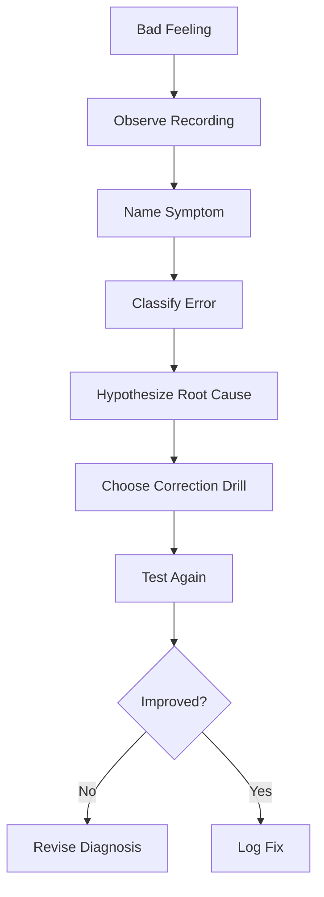
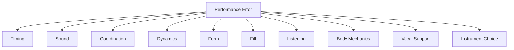
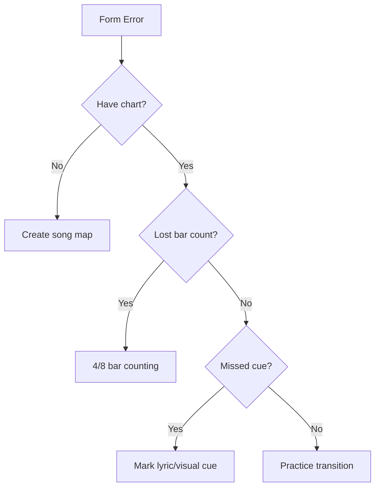
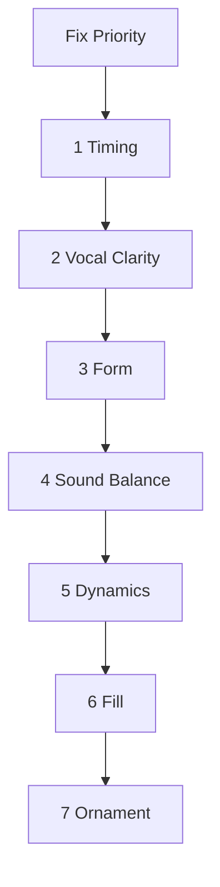
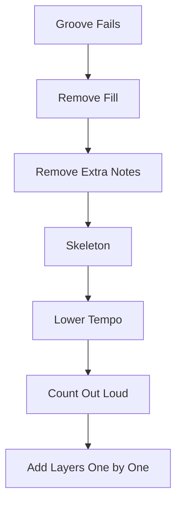

# learn-drum-cajon-part-022.md

# Part 022 — Error Model: Diagnosis Kesalahan Pemula

## Status Seri

- Seri: `learn-drum-cajon`
- Part: `022`
- Topik: Error model dan diagnosis kesalahan pemula
- Target akhir seri: mampu mengiringi penyanyi dengan drum dan/atau cajon secara stabil, musikal, dan sadar konteks
- Status: seri belum selesai
- Part sebelumnya: `learn-drum-cajon-part-021.md`
- Part berikutnya: `learn-drum-cajon-part-023.md`

---

## Tujuan Part Ini

Part ini adalah debugging manual untuk belajar drum/cajon. Sebagai software engineer, kamu tahu bahwa memperbaiki bug butuh diagnosis. Hal yang sama berlaku di musik.

Pemula sering berkata:

> “Saya kurang latihan.”

Itu benar, tetapi tidak cukup presisi. Pertanyaan yang lebih berguna:

- error timing?
- error sound?
- error coordination?
- error dynamics?
- error form?
- error fill?
- error listening?
- error body tension?
- error instrument choice?
- error vocal awareness?

Setelah menyelesaikan part ini, kamu harus mampu:

1. mengklasifikasikan error,
2. menemukan gejala yang terdengar,
3. menebak akar penyebab,
4. memilih correction drill,
5. membedakan symptom dan root cause,
6. menggunakan rekaman sebagai data,
7. tidak memperbaiki semuanya sekaligus,
8. membuat error tracker,
9. tahu kapan menyederhanakan,
10. mengubah error menjadi practice plan.

---

# 1. Error Model: Dari “Saya Jelek” ke Diagnosis Spesifik

Pemula sering membuat generalisasi:

```text
Saya jelek main drum.
Saya tidak berbakat.
Saya timing-nya buruk.
Saya tangan kiri lemah.
Saya selalu gagal.
```

Ini tidak membantu.

Diagnosis yang lebih baik:

```text
Saya rushing saat fill 1 beat menuju chorus di 70 BPM.
Cajon slap saya terlalu keras di verse.
Hi-hat tangan kanan terlalu dominan dan menutup vokal.
Saya kehilangan beat 1 setelah silence fill.
Saya tidak tahu bridge masuk setelah chorus kedua.
```

Diagnosis spesifik membuat correction spesifik.



---

# 2. Kategori Error Utama



Kategori:

1. timing error,
2. sound error,
3. coordination error,
4. dynamics error,
5. form error,
6. fill error,
7. listening error,
8. body mechanics error,
9. vocal support error,
10. instrument/context error.

Jangan perbaiki semua sekaligus. Pilih kategori paling merusak lagu.

---

# 3. Symptom vs Root Cause

Symptom adalah yang terdengar/terlihat. Root cause adalah penyebab.

Contoh:

| Symptom | Root Cause Mungkin |
|---|---|
| fill rush | fill terlalu banyak note |
| chorus terlalu cepat | dynamic naik tanpa kontrol |
| slap terlalu keras | tangan tegang / volume blindness |
| vokal tertutup | hi-hat/slap/cymbal terlalu dominan |
| beat 1 hilang | phrase counting lemah |
| tangan sakit | teknik cajon terlalu brutal |
| groove monoton | tidak ada dynamic map |
| lagu sesak | density conflict |
| form kacau | tidak ada song chart |

Satu symptom bisa punya banyak root cause. Karena itu perlu test.

---

# 4. Timing Error

Timing error adalah error paling penting karena memengaruhi semua orang.

## 4.1 Rushing

Gejala:

- kamu mendahului metronome,
- fill mempercepat,
- chorus naik tempo,
- penyanyi terasa dikejar,
- groove makin sempit.

Root cause:

- nervous,
- fill terlalu sulit,
- tidak menghitung subdivision,
- tension,
- main terlalu keras,
- tempo lambat membuat tidak sabar.

Correction drill:

| Penyebab | Drill |
|---|---|
| fill rush | 1-beat fill at 60 BPM |
| chorus rush | lift without speeding |
| tempo lambat rush | 16th internal count |
| tension | body reset + slow |
| no subdivision | count out loud |

## 4.2 Dragging

Gejala:

- kamu tertinggal dari click,
- verse melemah,
- groove berat,
- chorus tidak lift,
- penyanyi seperti menunggu.

Root cause:

- fatigue,
- pattern terlalu sulit,
- dynamic terlalu kecil sampai pulse hilang,
- kick/bass lemah,
- subdivision tidak terasa.

Correction drill:

- main lebih sederhana,
- kuatkan pulse kaki,
- count 8th/16th,
- kick/bass on 1 and 3,
- short recording at 60 BPM.

## 4.3 Uneven Subdivision

Gejala:

- hi-hat/touch tidak rata,
- groove terasa pincang,
- 8th note seperti long-short tanpa disengaja.

Correction:

- touch/hat only,
- metronome slow,
- count `1 & 2 & 3 & 4 &`,
- record close.

---

# 5. Sound Error

Sound error membuat pattern benar terdengar buruk.

## 5.1 Drum Sound Error

| Gejala | Root Cause | Correction |
|---|---|---|
| hi-hat terlalu keras | tangan kanan dominan | hi-hat level 1 drill |
| snare terlalu keras | stroke terlalu tinggi | snare level 1–5 |
| kick lemah | pedal control | kick-only drill |
| crash berlebihan | marker tidak sadar | crash only section starts |
| ride wash menutup vokal | volume/texture salah | use closed hat/rim |

## 5.2 Cajon Sound Error

| Gejala | Root Cause | Correction |
|---|---|---|
| bass tidak jelas | titik kontak salah | bass search |
| slap terlalu tajam | power berlebih | slap level 2 |
| bass/slap mirip | separation buruk | contrast drill |
| touch terlalu ramai | volume hierarchy buruk | touch level 1 |
| ghost note mengganggu | terlalu keras | ghost hierarchy |

## 5.3 Sound Review

Dengarkan rekaman dari posisi pendengar.

Pertanyaan:

- apakah vokal jelas?
- apakah hi-hat/touch tajam?
- apakah slap/snare terlalu keras?
- apakah kick/bass cukup?
- apakah crash/accent mengejutkan?

---

# 6. Coordination Error

Coordination error terjadi saat anggota tubuh/tangan tidak bekerja stabil bersama.

## 6.1 Drum Coordination

Gejala umum:

| Gejala | Layer Rusak |
|---|---|
| hi-hat berhenti saat snare | tangan kanan belum otomatis |
| kick membuat hi-hat rush | kaki kanan mengganggu tangan |
| snare telat setelah kick | backbeat belum internal |
| full groove collapse | overload |
| kaki kiri mengganggu | terlalu cepat tambah layer |

Correction:

- isolate layer,
- rebuild with layering,
- lower tempo,
- remove left foot,
- count out loud.

## 6.2 Cajon Coordination

Gejala umum:

| Gejala | Layer Rusak |
|---|---|
| touch rush | alternating hand belum stabil |
| bass hilang saat slap masuk | sound/hand focus conflict |
| slap sakit | mechanics |
| fill kacau | sticking belum stabil |
| ghost terlalu keras | dynamic hierarchy |

Correction:

- skeleton only,
- touch-only metronome,
- bass/slap contrast,
- reduce ghost,
- choose simpler sticking.

---

# 7. Dynamics Error

Dynamics error membuat lagu datar atau terlalu agresif.

## 7.1 Flat Dynamics

Gejala:

- verse dan chorus sama,
- final chorus tidak berdampak,
- lagu membosankan.

Root cause:

- tidak ada dynamic map,
- terlalu fokus pattern,
- volume level tidak dilatih.

Correction:

- energy map 1–10,
- one groove five dynamics,
- verse level 2, chorus level 4.

## 7.2 Always Loud

Gejala:

- vokal tertutup,
- audience lelah,
- chorus tidak punya ruang naik.

Correction:

- start at level 1–2,
- record from listener position,
- reduce snare/slap/hat.

## 7.3 Build Rush

Gejala:

- semakin keras semakin cepat.

Correction:

- lift without speeding drill,
- metronome,
- breathe,
- reduce stroke tension.

## 7.4 Drop Drag

Gejala:

- bagian pelan ikut melambat.

Correction:

- drop without dragging drill,
- internal subdivision,
- keep kick/bass pulse.

---

# 8. Form Error

Form error berarti kamu tidak tahu posisi lagu.

Gejala:

- chorus missed,
- fill salah tempat,
- bridge bingung,
- ending kacau,
- crash/accent di tempat salah,
- masuk terlalu awal.

Root cause:

- tidak ada chart,
- tidak menghitung bar,
- tidak tahu lyric anchor,
- tidak mendengar cue,
- terlalu fokus pattern.

Correction:

- song map,
- count 4/8 bar,
- lyric anchors,
- section-only practice,
- emergency skeleton.



---

# 9. Fill Error

Fill error sangat umum.

## 9.1 Fill Rush

Gejala:

- fill masuk, tempo naik.

Correction:

- reduce notes,
- 1-beat fill,
- 60 BPM,
- count out loud.

## 9.2 Fill Too Often

Gejala:

- lagu ramai,
- fill tidak bermakna.

Correction:

- fill only every 8 bars,
- no-fill session,
- fill-safe spot map.

## 9.3 Fill Too Long

Gejala:

- beat 1 hilang.

Correction:

- silence fill,
- 1-beat fill,
- return-to-groove.

## 9.4 Fill Over Vocal

Gejala:

- lirik tertutup.

Correction:

- lyric marking,
- fill after phrase,
- vocal-first listening.

## 9.5 Fill Dynamic Mismatch

Gejala:

- verse soft, fill keras tiba-tiba.

Correction:

- fill level control,
- verse fill level 1–2,
- chorus fill level 3–4.

---

# 10. Listening Error

Listening error terjadi saat kamu tidak mendengar kebutuhan lagu.

Gejala:

- salah meter,
- groove tidak cocok,
- overplay,
- tidak tahu dynamics,
- tidak mendengar vokal,
- tidak lock dengan gitar/piano/bass.

Root cause:

- langsung main tanpa mendengar,
- hanya fokus drum,
- tidak membuat listening worksheet,
- tidak mendengar ensemble density.

Correction:

- 9-pass listening,
- vocal-first pass,
- pulse/meter pass,
- form map,
- dynamics map,
- ensemble density map.

---

# 11. Body Mechanics Error

Body error sering muncul sebagai timing/sound error.

## 11.1 Tension

Gejala:

- bahu naik,
- tangan cepat lelah,
- tempo rush,
- fill kasar,
- grip keras.

Correction:

- tension reset,
- lower tempo,
- smaller motion,
- video review.

## 11.2 Pain

Gejala:

- sakit tajam,
- kebas,
- pergelangan nyeri,
- jari sakit.

Correction:

- stop,
- check technique,
- reduce power,
- rest,
- do not push.

## 11.3 Poor Posture

Gejala:

- punggung sakit,
- kick/cajon bass sulit,
- body unstable.

Correction:

- setup check,
- seat height,
- foot placement,
- posture video.

---

# 12. Vocal Support Error

Karena target kita accompaniment, vocal support error sangat penting.

## 12.1 Vocal Covered

Gejala:

- lirik tidak jelas,
- penyanyi melawan volume.

Root cause:

- hi-hat/slap/snare terlalu keras,
- fill over phrase,
- density tinggi.

Correction:

- reduce high-frequency rhythm,
- vocal-first recording,
- no fill during lyric.

## 12.2 Singer Feels Chased

Gejala:

- penyanyi terlihat tidak nyaman,
- phrasing terasa dikejar.

Root cause:

- rushing,
- too rigid,
- not leaving space.

Correction:

- slow metronome,
- vocal phrasing practice,
- keep pulse but reduce density.

## 12.3 Not Following Cue

Gejala:

- penyanyi ingin drop, kamu tetap full,
- ending berbeda.

Correction:

- visual cue awareness,
- rehearsal communication,
- chart cue.

---

# 13. Instrument Choice Error

Kadang masalah bukan pattern, tetapi alat yang tidak cocok.

Gejala:

- drum terlalu keras untuk ruangan,
- cajon tidak cukup besar untuk full band,
- slap cajon tajam di vocal intimate,
- drum kit setup terlalu ribet,
- no mic cajon membuat bass hilang.

Correction:

- choose cajon/light setup,
- use rods/brushes,
- mic cajon,
- simplify,
- no percussion.

---

# 14. Error Priority: Mana yang Diperbaiki Dulu?

Tidak semua error sama penting.

Prioritas:



Jika timing rusak, perbaiki timing dulu.

Jika vokal tertutup, perbaiki volume/density sebelum fill.

Jika form kacau, jangan tambah pattern.

Rule:

> Error yang merusak lagu diperbaiki sebelum error yang hanya membuatmu merasa kurang keren.

---

# 15. Diagnostic Checklist

Setelah rekaman, jawab urut:

## 15.1 Timing

- rush?
- drag?
- fill rush?
- chorus rush?
- slow tempo collapse?

## 15.2 Vocal

- lirik jelas?
- fill menabrak?
- volume aman?

## 15.3 Form

- section tepat?
- fill di tempat benar?
- ending jelas?

## 15.4 Sound

- kick/bass jelas?
- snare/slap terlalu keras?
- hi-hat/touch terlalu dominan?

## 15.5 Dynamics

- verse/chorus beda?
- bridge punya fungsi?
- final chorus punya puncak?

## 15.6 Fill

- terlalu sering?
- terlalu panjang?
- kembali beat 1?

---

# 16. Correction Drill Library

## 16.1 Timing Drills

| Error | Drill |
|---|---|
| rushing | slow groove 60 BPM |
| dragging | pulse + kick/bass anchor |
| fill rush | 1-beat fill loop |
| chorus rush | lift without speeding |
| silence entry wrong | rest 1 bar entry |

## 16.2 Sound Drills

| Error | Drill |
|---|---|
| hi-hat loud | hat level 1 |
| slap loud | slap level 2 |
| bass weak | bass search |
| snare harsh | snare level ladder |
| touch noisy | touch-only light |

## 16.3 Form Drills

| Error | Drill |
|---|---|
| miss chorus | 8-bar count |
| lost bridge | section map |
| ending wrong | ending-only rehearsal |
| cue missed | lyric anchor |
| intro wrong | count-in/entry drill |

## 16.4 Fill Drills

| Error | Drill |
|---|---|
| fill rush | reduce notes |
| fill too often | no-fill session |
| fill too long | 1-beat fill |
| fill over vocal | fill-safe map |
| no return | groove-fill-groove |

---

# 17. Error Tracker

Gunakan tabel:

```md
# Error Tracker

| Date | Recording | Symptom | Category | Root Cause Hypothesis | Correction Drill | Result |
|---|---|---|---|---|---|---|
| | | | | | | |
```

Contoh:

```md
| 2026-06-25 | cajon_take03 | fill rush before chorus | timing/fill | too many notes | 1-beat fill 60 BPM | improved |
```

---

# 18. Root Cause Hypothesis

Gunakan format:

```md
Symptom:
Category:
Likely root cause:
Alternative root cause:
Test:
Correction:
```

Contoh:

```md
Symptom:
- Chorus always rushes.

Category:
- timing/dynamics

Likely root cause:
- I play louder with tension.

Alternative:
- fill before chorus rushes and pulls tempo.

Test:
- play chorus lift without fill.

Correction:
- lift without speeding drill, no fill.
```

---

# 19. A/B Testing Corrections

Sebagai engineer, pakai A/B test.

Contoh:

Problem: chorus rush.

Take A:

```text
chorus with fill
```

Take B:

```text
chorus no fill
```

Jika Take B stabil, fill penyebabnya.

Problem: vokal tertutup.

Take A:

```text
touch/hi-hat 8th full
```

Take B:

```text
touch/hi-hat sparse
```

Jika vokal jelas di B, density penyebabnya.

---

# 20. Simplification as Debugging

Simplify bukan mundur.

Jika groove gagal:

1. remove fill,
2. remove touch/hat,
3. skeleton only,
4. lower tempo,
5. count out loud,
6. re-add layers.



---

# 21. Error Case Studies

## 21.1 Case: Cajon Slap Terlalu Keras

Symptom:

- vokal tertutup,
- rekaman tajam,
- verse terasa agresif.

Category:

- sound/vocal support.

Root cause:

- slap level terlalu tinggi,
- tidak sadar perspektif pendengar.

Correction:

- slap level 1–2,
- record from front,
- sparse verse groove.

## 21.2 Case: Fill Rush Menuju Chorus

Symptom:

- groove stabil,
- fill masuk,
- chorus lebih cepat.

Category:

- timing/fill.

Root cause:

- fill terlalu banyak note,
- tension.

Correction:

- silence fill,
- 1-beat fill,
- count 3 & 4 &.

## 21.3 Case: Bridge Kacau

Symptom:

- tidak tahu harus main apa,
- dynamics tidak jelas.

Category:

- form/dynamics.

Root cause:

- bridge role tidak diputuskan.

Correction:

- decide drop/build/half-time,
- chart bridge,
- rehearse bridge only.

## 21.4 Case: Drum Hi-hat Menutup Vokal

Symptom:

- lirik tidak jelas,
- high frequency ramai.

Category:

- sound/vocal.

Root cause:

- right hand too loud.

Correction:

- hi-hat level 1,
- quarter hat instead of 8th,
- record from audience.

---

# 22. Debug Session Template

```md
# Debug Session

Recording:
Main symptom:
Category:
Hypothesis:
Test drill:
Result:
Next action:

## Before
- 

## After
- 

## Decision
- fixed / improved / needs more work / wrong diagnosis
```

---

# 23. Practice Protocol: Error-Driven Session

Durasi 30 menit.

| Durasi | Aktivitas |
|---:|---|
| 5 menit | dengar rekaman lama |
| 5 menit | pilih satu error |
| 5 menit | isolate error |
| 10 menit | correction drill |
| 5 menit | rekam ulang |

Contoh:

```text
Error: fill rush
Drill: groove 3 bar + fill 1 beat + return
Tempo: 60 BPM
```

---

# 24. Error Severity

Klasifikasikan severity.

| Severity | Contoh |
|---|---|
| Critical | tempo collapse, vocal tertutup, form hilang |
| High | fill rush, chorus rush, ending kacau |
| Medium | sound kurang konsisten, dynamics kurang jelas |
| Low | fill kurang keren, ornament kurang variatif |

Perbaiki critical dulu.

Jangan memperbaiki ornament jika vocal tertutup.

---

# 25. When Error Is Actually Arrangement Issue

Kadang kamu menyalahkan skill, padahal arrangement tidak cocok.

Contoh:

- cajon dimainkan di full band tanpa mic,
- drum kit dipakai di cafe kecil,
- semua instrumen fill bersamaan,
- penyanyi ingin rubato tetapi drummer memaksa click,
- gitar strumming padat dan cajon touch padat.

Correction:

- ubah arrangement,
- pilih alat lain,
- kurangi density,
- sepakati cue,
- ubah entry.

---

# 26. Common Meta-Mistakes

## 26.1 Memperbaiki Terlalu Banyak Sekaligus

Masalah:

- tidak tahu mana yang membuat improvement.

Correction:

- one error per session.

## 26.2 Mengabaikan Rekaman

Masalah:

- diagnosis berdasarkan perasaan.

Correction:

- recording is source of truth.

## 26.3 Terlalu Keras pada Diri Sendiri

Masalah:

- “saya buruk” bukan diagnosis.

Correction:

- gunakan symptom language.

## 26.4 Menambah Complexity untuk Menutupi Error

Masalah:

- fill tambah banyak agar groove terasa menarik,
- padahal timing rusak.

Correction:

- simplify.

---

# 27. Debugging Language

Gunakan bahasa ini:

Buruk:

```text
Saya payah.
```

Baik:

```text
Saya rushing saat fill 2 beat di bar 8.
```

Buruk:

```text
Groove saya jelek.
```

Baik:

```text
Hi-hat saya terlalu keras dan snare telat di beat 4.
```

Buruk:

```text
Cajon saya tidak enak.
```

Baik:

```text
Bass dan slap belum terpisah, touch terlalu keras.
```

Bahasa presisi mempercepat perbaikan.

---

# 28. Error-to-Practice Mapping

| Error | Next Practice Focus |
|---|---|
| rush fill | fill return |
| drag verse | pulse/subdivision |
| vocal covered | dynamics/sound |
| miss chorus | song form |
| slap pain | body mechanics |
| hi-hat loud | limb balance |
| cajon monoton | dynamics/density |
| groove clutter | role separation |
| wrong instrument | instrument decision |
| nervous stop | recovery drill |

---

# 29. Self-Scoring Rubric

Nilai 1–5.

| Area | 1 | 3 | 5 |
|---|---|---|---|
| symptom naming | vague | cukup | spesifik |
| category | tidak tahu | cukup | jelas |
| root cause | asal | cukup | testable |
| correction drill | random | cukup | tepat |
| recording use | tidak | kadang | selalu |
| one-error focus | sulit | cukup | disiplin |
| improvement tracking | tidak | cukup | jelas |
| emotional control | self-blame | cukup | diagnostic |

Target:

- minimal 3 semua area,
- minimal 4 untuk symptom naming,
- minimal 4 untuk correction drill.

---

# 30. Mini Capstone Part Ini

Ambil satu rekaman lama. Buat error report.

```md
# Error Report

Recording:
Date:
Context:

## Observed Symptoms
1.
2.
3.

## Primary Error
- 

## Category
- timing / sound / dynamics / form / fill / listening / body / vocal / instrument

## Root Cause Hypothesis
- 

## Correction Drill
- 

## Test Plan
- 

## Success Criteria
- 

## Next Recording
- 
```

Lalu lakukan correction drill 10 menit dan rekam ulang.

---

# 31. Acceptance Criteria Part Ini

Kamu boleh lanjut ke Part 023 jika:

1. bisa membedakan symptom dan root cause,
2. bisa mengklasifikasikan error,
3. bisa menggunakan rekaman sebagai data,
4. bisa membuat error tracker,
5. bisa memilih correction drill,
6. bisa memprioritaskan timing/vocal/form sebelum ornament,
7. bisa menjalankan error-driven practice session,
8. bisa menyederhanakan saat error terlalu kompleks,
9. bisa membuat error report,
10. bisa memperbaiki satu error kecil secara terukur.

---

# 32. Ringkasan

Belajar drum/cajon akan jauh lebih cepat jika kamu berhenti berkata:

```text
Saya kurang latihan.
```

dan mulai berkata:

```text
Saya rushing di fill 1 beat menuju chorus karena fill terlalu banyak note dan saya tidak menghitung subdivision.
```

Error model membantu mengubah rasa frustrasi menjadi practice plan.

Kategori utama:

1. timing,
2. sound,
3. coordination,
4. dynamics,
5. form,
6. fill,
7. listening,
8. body mechanics,
9. vocal support,
10. instrument choice.

Rule paling penting:

> Jangan memperbaiki perasaan. Perbaiki error yang bisa diamati.

---

# 33. Latihan untuk Part Berikutnya

Sebelum lanjut ke Part 023, lakukan:

1. Ambil satu rekaman latihan.
2. Tulis 3 symptom.
3. Pilih 1 primary error.
4. Klasifikasikan error.
5. Tulis root cause hypothesis.
6. Pilih correction drill.
7. Latih 10 menit.
8. Rekam ulang.
9. Bandingkan before/after.

Part berikutnya membahas:

> repertoire minimum: memilih 10 lagu latihan yang membangun skill accompaniment, bukan sekadar lagu favorit.
