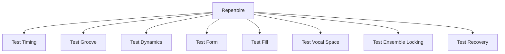
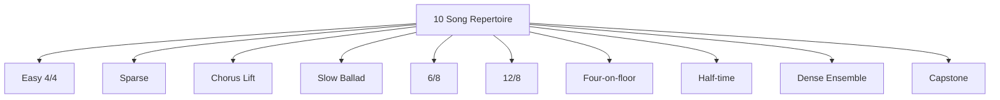
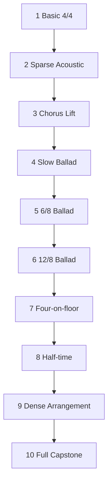

# learn-drum-cajon-part-023.md

# Part 023 — Repertoire Minimum: 10 Lagu untuk Latihan Mengiringi

## Status Seri

- Seri: `learn-drum-cajon`
- Part: `023`
- Topik: Repertoire minimum untuk latihan accompaniment
- Target akhir seri: mampu mengiringi penyanyi dengan drum dan/atau cajon secara stabil, musikal, dan sadar konteks
- Status: seri belum selesai
- Part sebelumnya: `learn-drum-cajon-part-022.md`
- Part berikutnya: `learn-drum-cajon-part-024.md`

---

## Tujuan Part Ini

Part ini membahas repertoire minimum: daftar lagu latihan yang sengaja dipilih untuk membangun kemampuan mengiringi penyanyi, bukan sekadar daftar lagu favorit.

Dalam konteks belajar drum/cajon, repertoire berfungsi seperti test suite. Setiap lagu menguji kemampuan berbeda:

- tempo stabil,
- groove 4/4,
- groove 6/8/12/8,
- dynamics,
- form,
- fill,
- vocal space,
- restraint,
- ensemble locking,
- endurance,
- recovery.

Setelah menyelesaikan part ini, kamu harus mampu:

1. memahami kenapa repertoire harus dipilih strategis,
2. memilih 10 lagu latihan berdasarkan skill target,
3. menghindari lagu yang terlalu sulit di awal,
4. membuat song brief untuk tiap lagu,
5. menentukan groove drum/cajon untuk tiap lagu,
6. menentukan dynamic map,
7. menentukan fill-safe spots,
8. memilih lagu capstone,
9. membuat progresi dari mudah ke sulit,
10. menggunakan repertoire untuk mengukur readiness.

---

# 1. Repertoire sebagai Test Suite

Sebagai software engineer, bayangkan 10 lagu ini sebagai test suite. Satu lagu bukan sekadar “lagu untuk dimainkan”, tetapi skenario pengujian.



Kalau kamu hanya memilih lagu favorit, ada risiko:

- semua lagunya feel sama,
- semua 4/4 medium,
- tidak ada 6/8/ballad,
- tidak ada dynamic build,
- tidak ada bridge/drop,
- tidak melatih listening,
- tidak melatih restraint,
- hanya melatih hal yang sudah nyaman.

Repertoire yang baik harus membuatmu bertemu variasi masalah secara terkontrol.

---

# 2. Kriteria Lagu Latihan yang Baik

Untuk 20 jam pertama, lagu latihan yang baik memiliki:

1. tempo tidak terlalu cepat,
2. struktur jelas,
3. vokal jelas,
4. chord/groove tidak terlalu kompleks,
5. verse/chorus bisa dibedakan,
6. ada ruang untuk drum/cajon,
7. tidak terlalu banyak syncopation sulit,
8. bisa dimainkan dengan pattern sederhana,
9. bisa dilatih dengan metronome,
10. punya versi referensi yang mudah didengar.

## 2.1 Hindari Dulu Lagu yang Terlalu Sulit

Tunda dulu lagu dengan:

- tempo sangat cepat,
- drum fill kompleks,
- banyak perubahan meter,
- prog/technical arrangement,
- ghost note advanced,
- shuffle cepat,
- Latin groove otentik kompleks,
- odd time signature,
- syncopation bass/kick padat,
- ending sangat bebas tanpa cue jelas.

Bukan berarti lagu-lagu ini buruk. Hanya belum ideal untuk 20 jam pertama.

---

# 3. Struktur 10 Lagu Minimum

Kita akan memakai 10 kategori lagu, bukan hanya 10 judul. Judul bisa kamu sesuaikan dengan selera, bahasa, dan konteks performance.

10 kategori:

| No | Kategori | Skill yang Diuji |
|---:|---|---|
| 1 | 4/4 basic pop medium | basic groove |
| 2 | sparse acoustic verse-heavy | restraint |
| 3 | 4/4 chorus lift | dynamics |
| 4 | slow ballad 4/4 | slow time |
| 5 | 6/8 ballad | compound feel |
| 6 | 12/8/triplet ballad | triplet subdivision |
| 7 | four-on-the-floor pop/worship | driving pulse |
| 8 | half-time bridge/anthem | wide feel |
| 9 | guitar/piano dense arrangement | role separation |
| 10 | full capstone dynamic song | complete performance |



---

# 4. Cara Memilih Judul Lagu

Karena selera, bahasa, dan konteks performance berbeda, gunakan kriteria ini.

## 4.1 Pilih Lagu yang Mungkin Kamu Iringi Nyata

Jika targetmu mengiringi penyanyi, pilih lagu yang benar-benar mungkin dinyanyikan:

- lagu pop populer,
- lagu Indonesia,
- lagu worship jika konteksmu worship,
- lagu acoustic singer-songwriter,
- lagu yang penyanyinya kamu kenal suka,
- lagu yang sering muncul di acara.

## 4.2 Pilih Lagu yang Bisa Disederhanakan

Lagu bagus untuk latihan jika tetap terdengar utuh walaupun drum/cajon disederhanakan.

Pertanyaan:

```text
Jika saya hanya main bass 1/3 dan slap 2/4, apakah lagu masih berjalan?
```

Jika ya, lagu cocok.

## 4.3 Pilih Lagu dengan Vokal Jelas

Karena target accompaniment, kamu harus bisa mendengar:

- phrase,
- napas,
- chorus,
- lyric anchor,
- fill-safe spot.

## 4.4 Pilih 3 Lagu Capstone dari 10

Dari 10 lagu, pilih 3 untuk final 20 jam:

1. satu 4/4 basic,
2. satu ballad/6/8/12/8,
3. satu dynamic build.

---

# 5. Repertoire Slot 1 — 4/4 Basic Pop Medium

## 5.1 Skill Target

Lagu ini menguji:

- basic 4/4,
- backbeat 2 dan 4,
- kick/bass 1 dan 3,
- hi-hat/touch 8th,
- tempo medium,
- verse/chorus sederhana.

## 5.2 Kriteria Lagu

Pilih lagu dengan:

- tempo sekitar 70–100 BPM,
- 4/4 straight,
- verse dan chorus jelas,
- tidak terlalu banyak stop,
- drum asli sederhana atau bisa disederhanakan.

## 5.3 Groove Drum

```text
Count : 1 & 2 & 3 & 4 &
Hat   : x x x x x x x x
Kick  : K       K
Snare :     S       S
```

## 5.4 Groove Cajon

```text
Count : 1 & 2 & 3 & 4 &
Touch : t t t t t t t t
Bass  : B       B
Slap  :     S       S
```

## 5.5 Fokus Latihan

- jangan rush,
- backbeat stabil,
- hi-hat/touch tidak terlalu keras,
- fill hanya akhir 8 bar.

## 5.6 Acceptance

Kamu berhasil jika bisa memainkan 2–3 menit tanpa:

- kehilangan tempo,
- fill acak,
- snare/slap terlalu keras,
- chorus rush.

---

# 6. Repertoire Slot 2 — Sparse Acoustic Verse-Heavy

## 6.1 Skill Target

Lagu ini menguji restraint: kemampuan tidak bermain terlalu banyak.

Skill:

- vocal space,
- sparse groove,
- low density,
- no-fill discipline,
- dynamic level 1–2,
- listening lyric.

## 6.2 Kriteria Lagu

Pilih lagu dengan:

- verse panjang,
- vokal intimate,
- gitar/piano dominan,
- tidak butuh drum besar,
- lirik penting.

## 6.3 Groove Drum

```text
Count : 1 & 2 & 3 & 4 &
Hat   : x   x   x   x
Kick  : K       K
Snare :     s       s
```

Atau rim/cross-stick jika ada.

## 6.4 Groove Cajon

```text
Count : 1 & 2 & 3 & 4 &
Bass  : B       B
Slap  :     s       s
Touch :   t       t
```

## 6.5 Fokus Latihan

- main 30% lebih pelan dari insting awal,
- jangan isi semua jeda,
- fill hanya jika phrase selesai,
- rekam dari posisi pendengar.

## 6.6 Acceptance

Kamu berhasil jika vokal terdengar lebih kuat karena permainanmu, bukan tertutup oleh permainanmu.

---

# 7. Repertoire Slot 3 — 4/4 Chorus Lift

## 7.1 Skill Target

Lagu ini menguji kemampuan membuat chorus naik tanpa mempercepat tempo.

Skill:

- verse/chorus contrast,
- stronger backbeat,
- crash/accent beat 1,
- kick/bass variation,
- lift without rushing.

## 7.2 Kriteria Lagu

Pilih lagu dengan:

- chorus jelas,
- hook kuat,
- pre-chorus atau build pendek,
- dynamic lift natural.

## 7.3 Groove Drum Verse

```text
Hat   : x   x   x   x
Kick  : K       K
Snare :     s       s
```

## 7.4 Groove Drum Chorus

```text
Hat   : x x x x x x x x
Kick  : K     K K
Snare :     S       S
```

## 7.5 Groove Cajon Verse

```text
Bass  : B       B
Slap  :     s       s
Touch :   t       t
```

## 7.6 Groove Cajon Chorus

```text
Touch : t t t t t t t t
Bass  : B     B B
Slap  :     S       S
```

## 7.7 Fokus Latihan

- dynamic naik,
- tempo tetap,
- fill kecil sebelum chorus,
- jangan main chorus terlalu besar pada chorus pertama jika lagu punya final chorus.

---

# 8. Repertoire Slot 4 — Slow Ballad 4/4

## 8.1 Skill Target

Lagu ini menguji kesabaran tempo lambat.

Skill:

- internal subdivision,
- slow groove,
- vocal space,
- minimal fill,
- dynamics halus,
- emotional restraint.

## 8.2 Kriteria Lagu

Pilih lagu dengan:

- tempo lambat,
- 4/4,
- vokal panjang,
- banyak ruang,
- emotional delivery.

## 8.3 Drum Strategy

Verse:

```text
rim / soft snare
closed hat light
kick sparse
```

Chorus:

```text
backbeat lebih jelas
hat lebih aktif
kick tetap sederhana
```

## 8.4 Cajon Strategy

Verse:

```text
touch sparse
bass soft
slap very soft
```

Chorus:

```text
bass/slap clearer
touch 8th jika perlu
```

## 8.5 Fokus Latihan

- count `1 e & a` dalam hati,
- jangan terburu-buru ke beat berikutnya,
- fill 1 beat maksimal,
- silence lebih sering daripada fill.

---

# 9. Repertoire Slot 5 — 6/8 Ballad

## 9.1 Skill Target

Lagu ini menguji feel 6/8.

Skill:

- count 1–6,
- accent 1 dan 4,
- compound feel,
- slow stability,
- ballad dynamics.

## 9.2 Kriteria Lagu

Pilih lagu yang terasa:

```text
ONE two three FOUR five six
```

Bukan 4/4 straight.

## 9.3 Drum Groove

```text
Count : 1 2 3 4 5 6
Hat   : x x x x x x
Kick  : K
Snare :       S
```

## 9.4 Cajon Groove

```text
Count : 1 2 3 4 5 6
Touch : t t t t t t
Bass  : B
Slap  :       S
```

## 9.5 Fokus Latihan

- aksen 1 dan 4,
- jangan membuat 6/8 jadi datar,
- fill di 4-5-6,
- chorus naik tanpa rush.

---

# 10. Repertoire Slot 6 — 12/8 / Triplet Ballad

## 10.1 Skill Target

Lagu ini menguji triplet subdivision dalam 4 beat besar.

Skill:

- count `1 la li 2 la li 3 la li 4 la li`,
- triplet feel,
- backbeat 2 dan 4,
- smooth ballad groove.

## 10.2 Kriteria Lagu

Pilih lagu yang terasa 4 beat besar, tetapi tiap beat mengayun tiga.

## 10.3 Drum Groove

```text
Count : 1 la li 2 la li 3 la li 4 la li
Hat   : x x x  x x x  x x x  x x x
Kick  : K             K
Snare :        S             S
```

## 10.4 Cajon Groove

```text
Count : 1 la li 2 la li 3 la li 4 la li
Touch : t t t  t t t  t t t  t t t
Bass  : B             B
Slap  :        S             S
```

## 10.5 Fokus Latihan

- jangan square,
- jangan rush karena subdivision banyak,
- dynamics tetap lembut,
- fill pendek.

---

# 11. Repertoire Slot 7 — Four-on-the-Floor Pop/Worship

## 11.1 Skill Target

Lagu ini menguji driving pulse.

Skill:

- kick/bass di setiap beat,
- chorus energy,
- stamina,
- tempo stability,
- dynamic control.

## 11.2 Drum Groove

```text
Count : 1 & 2 & 3 & 4 &
Hat   : x x x x x x x x
Kick  : K   K   K   K
Snare :     S       S
```

## 11.3 Cajon Groove

```text
Count : 1 & 2 & 3 & 4 &
Touch : t t t t t t t t
Bass  : B   B   B   B
Slap  :     S       S
```

## 11.4 Fokus Latihan

- kick/bass tidak terlalu berat,
- tempo tidak naik,
- vocal tetap jelas,
- gunakan terutama chorus/build.

## 11.5 Risiko

Four-on-the-floor mudah membuat lagu terlalu besar. Jangan pakai dari awal kecuali arrangement memang butuh.

---

# 12. Repertoire Slot 8 — Half-Time Bridge / Anthem

## 12.1 Skill Target

Lagu ini menguji feel lebar.

Skill:

- snare/slap di beat 3,
- dynamic contrast,
- bridge/final chorus transition,
- restraint,
- big space.

## 12.2 Drum Groove

```text
Count : 1 & 2 & 3 & 4 &
Hat   : x x x x x x x x
Kick  : K       K
Snare :         S
```

## 12.3 Cajon Groove

```text
Count : 1 & 2 & 3 & 4 &
Touch : t t t t t t t t
Bass  : B       B
Slap  :         S
```

## 12.4 Fokus Latihan

- half-time harus terdengar disengaja,
- jangan kehilangan beat 1,
- bridge harus punya fungsi,
- final chorus masuk jelas.

---

# 13. Repertoire Slot 9 — Dense Guitar/Piano Arrangement

## 13.1 Skill Target

Lagu ini menguji role separation.

Skill:

- mendengar density gitar/piano,
- mengurangi touch/hi-hat,
- tidak fill saat instrumen lain fill,
- menjaga vokal,
- lock dengan strumming atau comping.

## 13.2 Kriteria Lagu

Pilih lagu dengan:

- gitar strumming padat,
- atau piano comping aktif,
- vokal tetap utama,
- drum/cajon tidak harus ramai.

## 13.3 Strategy

Jika gitar/piano padat:

Drum:

```text
kick/snare simple
hi-hat soft or quarter
no unnecessary fill
```

Cajon:

```text
bass/slap skeleton
touch sparse
no ghost overload
```

## 13.4 Fokus Latihan

- role separation,
- density control,
- vocal clarity,
- no fill collision.

---

# 14. Repertoire Slot 10 — Full Capstone Dynamic Song

## 14.1 Skill Target

Lagu ini menguji semua:

- form,
- dynamics,
- groove switching,
- fill,
- vocal support,
- ending,
- recovery.

## 14.2 Kriteria Lagu

Pilih lagu dengan:

- intro,
- verse,
- pre-chorus,
- chorus,
- bridge,
- final chorus,
- ending jelas,
- dynamic arc kuat.

## 14.3 Required Map

Untuk lagu capstone, wajib buat:

```md
Song chart
Dynamic map
Groove map
Fill map
Cue map
Error risk map
```

## 14.4 Fokus Latihan

- main full song,
- jangan berhenti saat salah,
- rekam,
- evaluasi dengan error model.

---

# 15. Contoh Repertoire Template

Gunakan template ini untuk tiap slot.

```md
# Repertoire Slot

Slot:
Song title:
Artist/version:
Meter:
Tempo:
Mood:
Why this song:
Skill target:
Instrument:
Groove:
Dynamic plan:
Fill rules:
No-fill zones:
Hardest section:
Success criteria:
Recording date:
Error notes:
```

---

# 16. Contoh Isi untuk Satu Lagu 4/4

```md
# Repertoire Slot 1

Slot: 4/4 basic pop
Song title:
Artist/version:
Meter: 4/4
Tempo: medium
Mood: warm / pop

Why this song:
- structure clear
- groove can be simplified
- good for basic backbeat

Skill target:
- basic groove stability
- verse/chorus contrast

Instrument:
- cajon first, drum substitute second

Groove:
- verse: sparse
- chorus: basic pop

Dynamic plan:
- verse level 2
- chorus level 4
- final chorus level 5

Fill rules:
- fill only before chorus
- max 1 beat

No-fill zones:
- vocal hook
- verse line endings

Success criteria:
- 3 min stable
- vocal clear
- no rush into chorus
```

---

# 17. Difficulty Ladder

Susun lagu dari mudah ke sulit.



Namun urutan bisa disesuaikan. Jika kamu sering bermain acoustic, slot 2 dan 5 mungkin lebih penting lebih awal.

---

# 18. Cara Latihan Repertoire

Untuk setiap lagu, lakukan 5 pass.

## Pass 1 — Listening

- mood,
- pulse,
- meter,
- form.

## Pass 2 — Chart

- section,
- bar count,
- lyric anchor.

## Pass 3 — Skeleton

Drum:

```text
kick/snare only
```

Cajon:

```text
bass/slap only
```

## Pass 4 — Full Simple Groove

Tambahkan:

- hi-hat/touch,
- dynamics,
- fill kecil.

## Pass 5 — Record

Main section atau full song, lalu review.

---

# 19. Jangan Meniru Drum Asli 100%

Untuk awal, targetmu adalah accompaniment, bukan drum cover.

Ambil fungsi:

| Original | Ambil |
|---|---|
| kick kompleks | kick utama |
| ghost note banyak | backbeat utama |
| fill cepat | fill function |
| cymbal detail | section marker |
| dynamic arc | energi section |

Tinggalkan detail yang belum stabil.

Rule:

> Versi sederhana yang stabil lebih musikal daripada versi asli yang dipaksakan.

---

# 20. Repertoire Rotation

Jangan latihan 10 lagu sekaligus setiap hari.

Gunakan rotasi:

## Week A

- lagu 1,
- lagu 2,
- lagu 3.

## Week B

- lagu 4,
- lagu 5,
- lagu 6.

## Week C

- lagu 7,
- lagu 8,
- lagu 9.

## Week D

- lagu 10,
- review 3 capstone,
- mock performance.

Untuk 20 jam pertama, fokus 3 lagu capstone dulu. 10 lagu menjadi library lanjutan.

---

# 21. Progress Tracking per Lagu

```md
# Song Progress

Song:
Slot:
Current status:
- listening done: yes/no
- chart done: yes/no
- skeleton stable: yes/no
- groove stable: yes/no
- dynamics stable: yes/no
- fill safe: yes/no
- full recording: yes/no
- performance-ready: yes/no

Main error:
Next correction:
```

---

# 22. Repertoire Scorecard

Nilai 1–5 per lagu.

| Area | Score |
|---|---:|
| tempo stability | |
| groove suitability | |
| vocal space | |
| dynamics | |
| form accuracy | |
| fill safety | |
| sound balance | |
| recovery | |

Performance-ready jika:

- tempo minimal 4,
- vocal space minimal 4,
- form minimal 4,
- fill safety minimal 3.

---

# 23. Memilih 3 Capstone Songs

Dari 10 slot, pilih 3:

## Capstone 1 — Basic 4/4

Tujuan:

- menunjukkan groove stabil.

## Capstone 2 — Ballad/6/8/12/8

Tujuan:

- menunjukkan slow time dan vocal space.

## Capstone 3 — Dynamic Build

Tujuan:

- menunjukkan song form, dynamics, fill, dan endurance.

Template:

```md
# Capstone Selection

## Song 1
Title:
Why:
Main risk:
Success criteria:

## Song 2
Title:
Why:
Main risk:
Success criteria:

## Song 3
Title:
Why:
Main risk:
Success criteria:
```

---

# 24. Repertoire untuk Drum vs Cajon

Satu lagu bisa dilatih dua versi.

## 24.1 Drum Version

Catat:

- kick,
- snare,
- hi-hat,
- crash,
- fill.

## 24.2 Cajon Version

Catat:

- bass,
- slap,
- touch,
- accent/silence,
- fill.

## 24.3 Compare

```md
Drum version:
- strengths:
- risks:

Cajon version:
- strengths:
- risks:

Better for performance:
- 
```

Ini melatih instrument decision.

---

# 25. Repertoire dan Penyanyi Nyata

Jika kamu akan mengiringi penyanyi tertentu, sesuaikan repertoire dengan:

- range vokal,
- lagu yang ia suka,
- tempo yang nyaman,
- versi yang dipakai,
- ending yang diinginkan,
- apakah ia suka rubato,
- apakah ia ingin acoustic atau full.

Tanyakan:

```text
Kamu mau versi original atau acoustic?
Tempo-nya sama atau lebih pelan?
Intro berapa bar?
Ending seperti apa?
Aku masuk dari awal atau chorus?
```

---

# 26. Common Mistakes

## 26.1 Memilih Lagu Terlalu Sulit

Gejala:

- frustrasi,
- tempo rusak,
- tidak selesai.

Correction:

- pilih lagu lebih sederhana,
- simplify groove.

## 26.2 Semua Lagu Feel Sama

Gejala:

- repertoire tidak membangun skill luas.

Correction:

- pakai 10 slot.

## 26.3 Tidak Membuat Chart

Gejala:

- tersesat,
- fill salah.

Correction:

- chart per lagu.

## 26.4 Terlalu Fokus Lagu Favorit

Gejala:

- latihan tidak objektif.

Correction:

- pilih berdasarkan skill target.

## 26.5 Meniru Drum Asli Terlalu Detail

Gejala:

- overplaying,
- timing rusak.

Correction:

- ambil fungsi, bukan semua note.

---

# 27. Debugging Guide

| Gejala | Penyebab | Correction |
|---|---|---|
| lagu terlalu sulit | pilihan repertoire salah | turun level |
| semua terasa monoton | kurang variasi slot | tambah 6/8/dynamics |
| chorus rush | dynamic control lemah | lift drill |
| fill salah | no fill map | chart fill-safe spots |
| vokal tertutup | groove terlalu ramai | sparse arrangement |
| tidak tahu ending | chart kurang | define ending |
| cajon tidak cocok | instrument mismatch | drum/hybrid/no percussion |
| drum terlalu besar | venue mismatch | cajon/light setup |

---

# 28. Practice Protocol 30 Menit untuk Repertoire

| Durasi | Latihan |
|---:|---|
| 5 menit | listen section |
| 5 menit | update chart |
| 5 menit | skeleton groove |
| 5 menit | full simple groove |
| 5 menit | difficult transition |
| 5 menit | record/review |

---

# 29. Practice Protocol 45 Menit untuk Repertoire

| Durasi | Latihan |
|---:|---|
| 5 menit | warm-up |
| 5 menit | listen/map |
| 10 menit | section loop |
| 10 menit | groove/dynamics |
| 10 menit | full song or long section |
| 5 menit | record/review |

---

# 30. Mini Capstone Part Ini

Buat 10-slot repertoire list.

```md
# My 10-Song Drum/Cajon Repertoire

## Slot 1 — 4/4 Basic Pop
Song:
Reason:

## Slot 2 — Sparse Acoustic
Song:
Reason:

## Slot 3 — Chorus Lift
Song:
Reason:

## Slot 4 — Slow Ballad 4/4
Song:
Reason:

## Slot 5 — 6/8 Ballad
Song:
Reason:

## Slot 6 — 12/8 / Triplet Ballad
Song:
Reason:

## Slot 7 — Four-on-the-Floor
Song:
Reason:

## Slot 8 — Half-Time
Song:
Reason:

## Slot 9 — Dense Guitar/Piano
Song:
Reason:

## Slot 10 — Full Capstone Dynamic
Song:
Reason:
```

Lalu pilih 3 capstone dan buat song progress untuk masing-masing.

---

# 31. Acceptance Criteria Part Ini

Kamu boleh lanjut ke Part 024 jika:

1. bisa menjelaskan repertoire sebagai test suite,
2. bisa memilih lagu berdasarkan skill target,
3. punya 10-slot repertoire list,
4. memilih 3 lagu capstone,
5. bisa membuat song brief,
6. bisa membuat song progress tracker,
7. bisa menentukan groove per lagu,
8. bisa menentukan dynamic plan,
9. bisa menentukan fill rules,
10. bisa menghindari lagu yang terlalu sulit untuk fase awal.

---

# 32. Ringkasan

Repertoire bukan daftar lagu favorit. Repertoire adalah alat latihan strategis.

10 slot penting:

1. 4/4 basic,
2. sparse acoustic,
3. chorus lift,
4. slow ballad,
5. 6/8,
6. 12/8,
7. four-on-the-floor,
8. half-time,
9. dense arrangement,
10. full capstone.

Tujuan repertoire adalah membangun skill accompaniment yang luas tetapi tetap terkendali.

Rule paling penting:

> Pilih lagu karena skill yang ingin diuji, bukan hanya karena kamu suka lagunya.

---

# 33. Latihan untuk Part Berikutnya

Sebelum lanjut ke Part 024, lakukan:

1. Isi 10-slot repertoire.
2. Pilih 3 capstone.
3. Buat song brief untuk satu lagu.
4. Tentukan groove drum/cajon.
5. Tentukan dynamic map.
6. Tentukan fill-safe spots.
7. Rekam satu section.

Part berikutnya membahas:

> membuat drum/cajon chart sederhana: simbol, section map, bar count, groove notes, dynamic notes, fill markers, cue, ending, dan format chart yang bisa dipakai saat rehearsal/performance.
